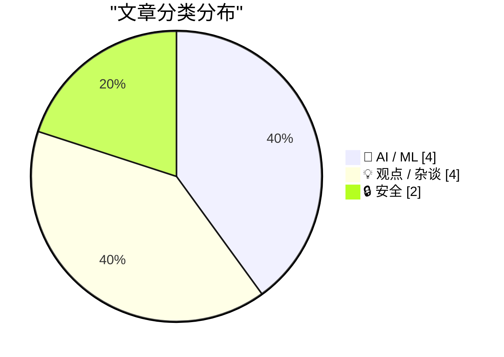
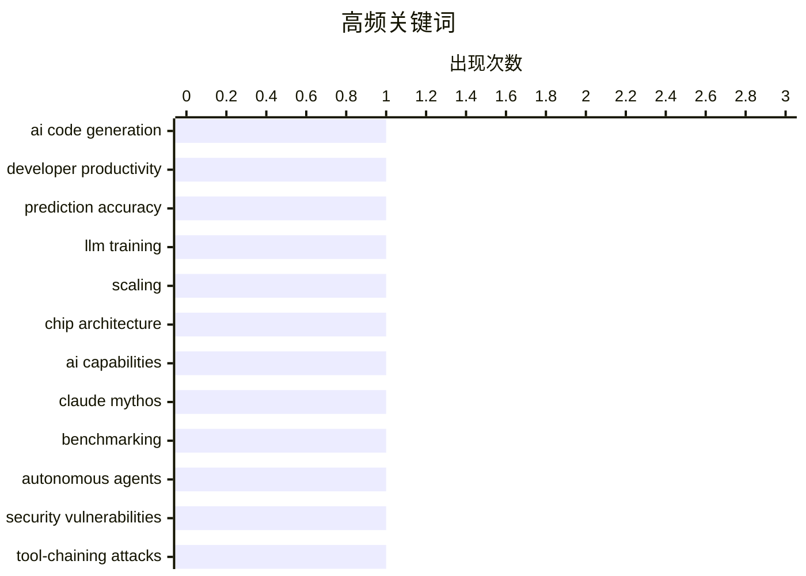

# 📰 AI 博客每日精选 — 2026-04-30

> 来自 Karpathy 推荐的 92 个顶级技术博客，AI 精选 Top 10

## 📝 今日看点

今日技术圈的焦点集中在AI能力的实际应用与风险并存。一方面，AI代码生成工具的采用远超预期，GitHub提交量激增反映出开发流程的深刻变革，同时大模型训练部署的数学原理也在被逐步揭示；另一方面，自主代理系统的安全漏洞触目惊心，超九成系统存在工具链攻击风险，这与对AI进展的过度恐慌形成了现实与预期的错位。此外，开源权重模型的消亡趋势预示着AI市场正在向寡头集中，这将深刻改变整个生态的竞争格局。

---

## 🏆 今日必读

🥇 **GitHub 提交量同比增长 14 倍，AI 代码生成远超预期**

[Commits on GitHub Are Up 14× Year-Over-Year](https://daringfireball.net/linked/2026/03/13/amodei-ai-code-claim-chowder) — daringfireball.net · 2026-05-04 · 🤖 AI / ML

> Anthropic CEO 一年前预测 AI 将在三到六个月内生成 90% 的代码，但实际情况更复杂。AI 代码生成工具不仅替代了人工编写的代码，更重要的是创造了原本不会被编写的新服务、应用和库。根据 GitHub 提交数据，当前 AI 生成的代码量约为人工编写的 14 倍，且仍在加速增长。未来人类程序员的角色将转变为代码审查和批准，而非主要的代码生成者。

💡 **为什么值得读**: 揭示了 AI 代码生成的真实影响远超表面数字，从代码替代演变为创造全新的开发生态。

🏷️ AI code generation, developer productivity, prediction accuracy

🥈 **大语言模型训练和部署背后的数学原理**

[Reiner Pope – The math behind how LLMs are trained and served](https://www.dwarkesh.com/p/reiner-pope) — dwarkesh.com · 5 小时前 · 🤖 AI / ML

> 这是一场黑板讲座，讲者Reiner Pope通过数学方程和公开API价格等信息，揭示了前沿LLM实验室的训练和部署方式。核心内容涵盖批大小如何影响token成本和速度、MoE模型在GPU集群中的布局、管道并行如何跨机架分配模型层，以及为什么管道并行存在效率问题。讲座还涉及强化学习导致模型可能过度训练100倍、从API定价推导长上下文内存成本，以及神经网络与密码学的收敛演化等话题。通过少量方程和公开信息就能推导出AI实验室的技术决策。

💡 **为什么值得读**: 如果你想理解大模型的实际训练和部署细节，这场讲座提供了从芯片设计到模型架构的完整技术栈视角，特别适合想要深入理解LLM工程实践的技术人员。

🏷️ LLM training, scaling, chip architecture

🥉 **对AI进展的过度恐慌**

[Misplaced panic over AI progress](https://garymarcus.substack.com/p/misplaced-panic-over-ai-progress) — garymarcus.substack.com · 2026-05-11 · 🤖 AI / ML

> METR发布的最新「时间视界」图表引发了关于AI能力突破的广泛担忧。该图表衡量的是前沿模型完成软件开发任务的时间长度，从最初的一分钟任务发展到现在的16小时任务。然而这个图表仅基于50%的成功率，而在80%或95%的成功率要求下仍有显著的性能提升空间，且未能反映GenAI的核心问题——可靠性。作者认为，将单一基准点的突破解读为AI能力的根本性突破是不恰当的。

💡 **为什么值得读**: 揭示了AI评估中常见的数据解读误区，帮助读者理性看待AI进展的真实含义，而非被单一指标的视觉冲击所误导。

🏷️ AI capabilities, Claude Mythos, benchmarking

---

## 📊 数据概览

| 扫描源 | 抓取文章 | 时间范围 | 精选 |
|:---:|:---:|:---:|:---:|
| 84/92 | 2471 篇 → 225 篇 | 24h | **10 篇** |

### 分类分布



### 高频关键词



<details>
<summary>📈 纯文本关键词图（终端友好）</summary>

```
ai code generation     │ ████████████████████ 1
developer productivity │ ████████████████████ 1
prediction accuracy    │ ████████████████████ 1
llm training           │ ████████████████████ 1
scaling                │ ████████████████████ 1
chip architecture      │ ████████████████████ 1
ai capabilities        │ ████████████████████ 1
claude mythos          │ ████████████████████ 1
benchmarking           │ ████████████████████ 1
autonomous agents      │ ████████████████████ 1
```

</details>

### 🏷️ 话题标签

**ai code generation**(1) · **developer productivity**(1) · **prediction accuracy**(1) · llm training(1) · scaling(1) · chip architecture(1) · ai capabilities(1) · claude mythos(1) · benchmarking(1) · autonomous agents(1) · security vulnerabilities(1) · tool-chaining attacks(1) · ai capex(1) · tech spending(1) · market analysis(1) · ai demand(1) · compute capacity(1) · industry analysis(1) · open-source(1) · security(1)

---

## 🤖 AI / ML

### 1. GitHub 提交量同比增长 14 倍，AI 代码生成远超预期

[Commits on GitHub Are Up 14× Year-Over-Year](https://daringfireball.net/linked/2026/03/13/amodei-ai-code-claim-chowder) — **daringfireball.net** · 2026-05-04 · ⭐ 27/30

> Anthropic CEO 一年前预测 AI 将在三到六个月内生成 90% 的代码，但实际情况更复杂。AI 代码生成工具不仅替代了人工编写的代码，更重要的是创造了原本不会被编写的新服务、应用和库。根据 GitHub 提交数据，当前 AI 生成的代码量约为人工编写的 14 倍，且仍在加速增长。未来人类程序员的角色将转变为代码审查和批准，而非主要的代码生成者。

🏷️ AI code generation, developer productivity, prediction accuracy

---

### 2. 大语言模型训练和部署背后的数学原理

[Reiner Pope – The math behind how LLMs are trained and served](https://www.dwarkesh.com/p/reiner-pope) — **dwarkesh.com** · 5 小时前 · ⭐ 27/30

> 这是一场黑板讲座，讲者Reiner Pope通过数学方程和公开API价格等信息，揭示了前沿LLM实验室的训练和部署方式。核心内容涵盖批大小如何影响token成本和速度、MoE模型在GPU集群中的布局、管道并行如何跨机架分配模型层，以及为什么管道并行存在效率问题。讲座还涉及强化学习导致模型可能过度训练100倍、从API定价推导长上下文内存成本，以及神经网络与密码学的收敛演化等话题。通过少量方程和公开信息就能推导出AI实验室的技术决策。

🏷️ LLM training, scaling, chip architecture

---

### 3. 对AI进展的过度恐慌

[Misplaced panic over AI progress](https://garymarcus.substack.com/p/misplaced-panic-over-ai-progress) — **garymarcus.substack.com** · 2026-05-11 · ⭐ 26/30

> METR发布的最新「时间视界」图表引发了关于AI能力突破的广泛担忧。该图表衡量的是前沿模型完成软件开发任务的时间长度，从最初的一分钟任务发展到现在的16小时任务。然而这个图表仅基于50%的成功率，而在80%或95%的成功率要求下仍有显著的性能提升空间，且未能反映GenAI的核心问题——可靠性。作者认为，将单一基准点的突破解读为AI能力的根本性突破是不恰当的。

🏷️ AI capabilities, Claude Mythos, benchmarking

---

### 4. 开源权重模型正在悄然消失——这是个问题

[Open weights are quietly closing up - and that's a problem](https://martinalderson.com/posts/open-weights-are-quietly-closing-up/?utm_source=rss&amp;utm_medium=rss&amp;utm_campaign=feed) — **martinalderson.com** · 2026-05-06 · ⭐ 24/30

> 开源权重模型对前沿实验室的定价形成制约作用。随着这些模型逐渐消失，市场将被少数寡头垄断，导致消费者剩余被这些企业攫取。

🏷️ open weights, LLM, market competition

---

## 💡 观点 / 杂谈

### 5. Am I Meant To Be Impressed?

[Am I Meant To Be Impressed?](https://www.wheresyoured.at/am-i-meant-to-be-impressed/) — **wheresyoured.at** · 2026-05-06 · ⭐ 25/30

> Am I Meant To Be Impressed? Ed Zitron May 6, 2026 38 min read Table of Contents If you liked this piece, please subscribe to my premium newsletter. It’s $70 a year, or $7 a month, and in return you ge

🏷️ AI capex, tech spending, market analysis

---

### 6. Premium: The AI Compute Demand Story Is A Lie

[Premium: The AI Compute Demand Story Is A Lie](https://www.wheresyoured.at/premium-the-ai-compute-demand-story-is-a-lie/) — **wheresyoured.at** · 2026-05-04 · ⭐ 25/30

> Premium: The AI Compute Demand Story Is A Lie Ed Zitron May 4, 2026 32 min read Table of Contents Everyone, it’s time to talk about AI demand and the capacity constraint issues across the industry. Th

🏷️ AI demand, compute capacity, industry analysis

---

### 7. NHS Goes To War Against Open Source

[NHS Goes To War Against Open Source](https://shkspr.mobi/blog/2026/05/nhs-goes-to-war-against-open-source/) — **shkspr.mobi** · 2026-05-01 · ⭐ 25/30

> NHS Goes To War Against Open Source government nhs Open Source politics · 26 comments · 1,050 words · Viewed ~17,742 times The NHS is preparing to close nearly all of its Open Source repositories. Thr

🏷️ open-source, security, government

---

### 8. ★ Software as the Product of Obsession Times Voice

[★ Software as the Product of Obsession Times Voice](https://daringfireball.net/2026/05/software_as_the_product_of_obsession_times_voice) — **daringfireball.net** · 2026-05-06 · ⭐ 24/30

> By John Gruber Archive The Talk Show Dithering Projects Contact Colophon Feeds / Social Twitter --> Sponsorship Manage GRC Faster with Drata’s Agentic Trust Management Platform Software as the Product

🏷️ software design, obsession, indie development, UI design

---

## 🔒 安全

### 9. 突发：自主代理系统一团糟

[Breaking: Autonomous Agents are a Shitshow](https://garymarcus.substack.com/p/breaking-autonomous-agents-are-a) — **garymarcus.substack.com** · 2026-05-06 · ⭐ 26/30

> 研究人员对来自医疗、金融、客服和代码生成领域的847个自主代理部署进行了研究，发现这些系统存在严重的安全漏洞。91%的代理容易受到工具链攻击，89.4%的代理在执行约30步后会偏离目标，94%具有记忆增强功能的代理容易遭受投毒攻击。真实案例OpenClaw/Moltbook事件中，77万个活跃代理通过单一数据库漏洞被同时攻破，每个代理都拥有对用户机器、邮件和文件的特权访问权限。自主代理在许多方面比无状态的大语言模型更容易受到攻击。

🏷️ autonomous agents, security vulnerabilities, tool-chaining attacks

---

### 10. 反DDoS公司暗中对巴西ISP发动攻击

[Anti-DDoS Firm Heaped Attacks on Brazilian ISPs](https://krebsonsecurity.com/2026/04/anti-ddos-firm-heaped-attacks-on-brazilian-isps/) — **krebsonsecurity.com** · 2026-04-30 · ⭐ 25/30

> 一家巴西网络安全公司Huge Networks声称专门防护DDoS攻击，却被发现正在支持一个针对巴西其他ISP的大规模DDoS攻击僵尸网络。该公司CEO声称这是安全漏洞导致，可能是竞争对手所为。攻击者通过扫描互联网上配置不当的TP-Link Archer AX21路由器和DNS服务器来构建僵尸网络，利用DNS反射放大攻击技术，使小于100字节的请求能产生60-70倍大小的响应。暴露的文件档案包含Python恶意程序和该公司CEO的私密SSH密钥，证实攻击者对Huge Networks基础设施拥有根访问权限。

🏷️ DDoS, botnet, Brazil, ISP

---

*生成于 2026-04-30 07:00 | 扫描 84 源 → 获取 2471 篇 → 精选 10 篇*
*基于 [Hacker News Popularity Contest 2025](https://refactoringenglish.com/tools/hn-popularity/) RSS 源列表*
