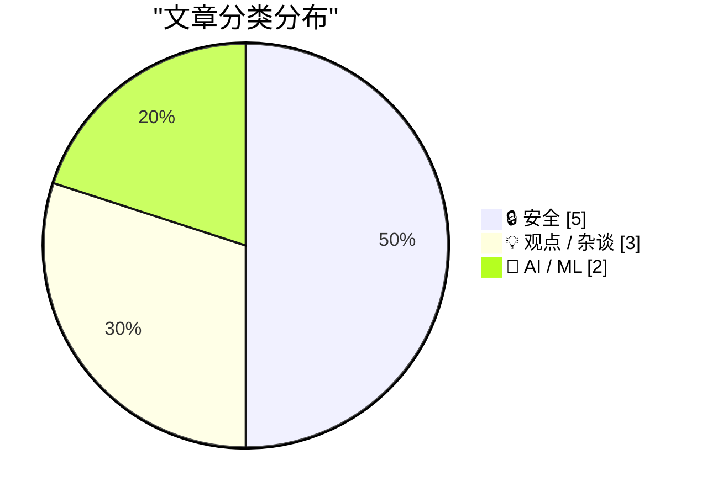
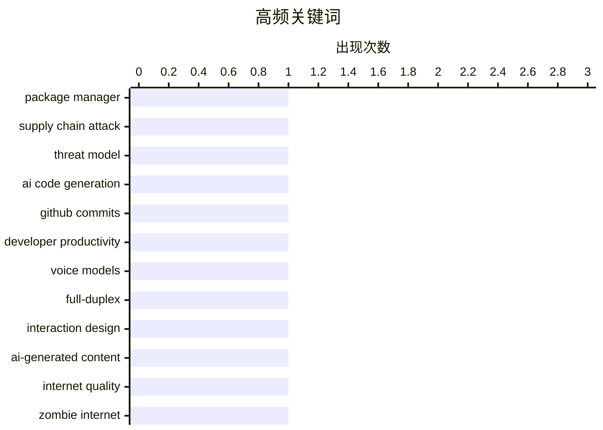

# 📰 AI 博客每日精选 — 2026-05-01

> 来自 Karpathy 推荐的 92 个顶级技术博客，AI 精选 Top 10

## 📝 今日看点

今日技术圈呈现三大焦点：其一，AI 生成内容与本地模型的应用争议升温，从代码提交量激增到对写作质量的质疑，AI 工具的双刃剑效应引发广泛讨论；其二，安全威胁面临新挑战，包管理器漏洞、教育平台数据泄露、自主智能体的系统性缺陷等多个维度暴露出基础设施的脆弱性；其三，AI 安全治理成为紧迫课题，91% 的自主智能体易受攻击、目标偏离率高企，促使业界重新审视 AI 系统的可靠性与防护机制。

---

## 🏆 今日必读

🥇 **Package Manager Threat Models**

[Package Manager Threat Models](https://nesbitt.io/2026/05/05/package-manager-threat-models.html) — nesbitt.io · 2026-05-05 · 🔒 安全

> The previous post catalogued the bugs that get filed against package managers: path traversal in the extractor, argument injection in the git driver, XSS in the registry’s README renderer. Things you 

🏷️ package manager, supply chain attack, threat model

🥈 **Commits on GitHub Are Up 14× Year-Over-Year**

[Commits on GitHub Are Up 14× Year-Over-Year](https://daringfireball.net/linked/2026/03/13/amodei-ai-code-claim-chowder) — daringfireball.net · 2026-05-04 · 🤖 AI / ML

> By John Gruber Archive The Talk Show Dithering Projects Contact Colophon Feeds / Social Twitter --> Sponsorship Manage GRC Faster with Drata’s Agentic Trust Management Platform Claim Chowder: Anthropi

🏷️ AI code generation, GitHub commits, developer productivity

🥉 **Thinking Machines and interaction models**

[Thinking Machines and interaction models](https://seangoedecke.com/interaction-models/) — seangoedecke.com · 2026-05-12 · 🤖 AI / ML

> Thinking Machines and interaction models Thinking Machines just released Interaction Models . This is their first real AI model release 1 after a year of work and two billion dollars of capital. What 

🏷️ voice models, full-duplex, interaction design

---

## 📊 数据概览

| 扫描源 | 抓取文章 | 时间范围 | 精选 |
|:---:|:---:|:---:|:---:|
| 83/92 | 2423 篇 → 200 篇 | 24h | **10 篇** |

### 分类分布



### 高频关键词



<details>
<summary>📈 纯文本关键词图（终端友好）</summary>

```
package manager        │ ████████████████████ 1
supply chain attack    │ ████████████████████ 1
threat model           │ ████████████████████ 1
ai code generation     │ ████████████████████ 1
github commits         │ ████████████████████ 1
developer productivity │ ████████████████████ 1
voice models           │ ████████████████████ 1
full-duplex            │ ████████████████████ 1
interaction design     │ ████████████████████ 1
ai-generated content   │ ████████████████████ 1
```

</details>

### 🏷️ 话题标签

**package manager**(1) · **supply chain attack**(1) · **threat model**(1) · ai code generation(1) · github commits(1) · developer productivity(1) · voice models(1) · full-duplex(1) · interaction design(1) · ai-generated content(1) · internet quality(1) · zombie internet(1) · ai coding(1) · engineer productivity(1) · skill distribution(1) · data breach(1) · canvas(1) · extortion(1) · local models(1) · llm(1)

---

## 🔒 安全

### 1. Package Manager Threat Models

[Package Manager Threat Models](https://nesbitt.io/2026/05/05/package-manager-threat-models.html) — **nesbitt.io** · 2026-05-05 · ⭐ 27/30

> The previous post catalogued the bugs that get filed against package managers: path traversal in the extractor, argument injection in the git driver, XSS in the registry’s README renderer. Things you 

🏷️ package manager, supply chain attack, threat model

---

### 2. Canvas Breach Disrupts Schools & Colleges Nationwide

[Canvas Breach Disrupts Schools & Colleges Nationwide](https://krebsonsecurity.com/2026/05/canvas-breach-disrupts-schools-colleges-nationwide/) — **krebsonsecurity.com** · 2026-05-08 · ⭐ 25/30

> An ongoing data extortion attack targeting the widely-used education technology platform Canvas disrupted classes and coursework at school districts and universities across the United States today, af

🏷️ data breach, Canvas, extortion

---

### 3. Behind the Scenes Hardening Firefox with Claude Mythos Preview

[Behind the Scenes Hardening Firefox with Claude Mythos Preview](https://simonwillison.net/2026/May/7/firefox-claude-mythos/#atom-everything) — **simonwillison.net** · 2026-05-08 · ⭐ 25/30

> Behind the Scenes Hardening Firefox with Claude Mythos Preview ( via ) Fascinating, in-depth details on how Mozilla used their access to the Claude Mythos preview to locate and then fix hundreds of vu

🏷️ vulnerability detection, LLM security, Firefox

---

### 4. Revisiting the 2015 Open Source Census

[Revisiting the 2015 Open Source Census](https://nesbitt.io/2026/05/06/revisiting-the-2015-open-source-census.html) — **nesbitt.io** · 2026-05-06 · ⭐ 25/30

> In July 2015, a year after Heartbleed, the Linux Foundation’s Core Infrastructure Initiative published a census of open source projects . The idea was to find the next OpenSSL before it found us: take

🏷️ supply chain, xz-utils, vulnerability assessment

---

### 5. 突发：自主智能体是一场混乱

[Breaking: Autonomous Agents are a Shitshow](https://garymarcus.substack.com/p/breaking-autonomous-agents-are-a) — **garymarcus.substack.com** · 2026-05-06 · ⭐ 25/30

> 研究人员对来自医疗、金融、客服和代码生成领域的847个自主智能体部署进行了研究，发现这些系统存在严重的安全漏洞。91%的智能体容易受到工具链攻击，89.4%的智能体在执行约30步后会偏离目标，94%具有记忆增强功能的智能体容易受到投毒攻击。一个真实案例是OpenClaw/Moltbook事件，77万个实时智能体通过单一数据库漏洞被同时攻击，每个智能体都拥有对用户机器、邮件和文件的特权访问权限。研究表明智能体在许多方面比无状态的大语言模型更容易受到攻击。

🏷️ autonomous agents, security vulnerabilities, tool-chaining attacks, agent safety

---

## 💡 观点 / 杂谈

### 6. Your AI Use Is Breaking My Brain

[Your AI Use Is Breaking My Brain](https://simonwillison.net/2026/May/11/zombie-internet/#atom-everything) — **simonwillison.net** · 2026-05-12 · ⭐ 25/30

> Your AI Use Is Breaking My Brain ( via ) Excellent, angry piece by Jason Koebler on how AI writing online is becoming impossible to avoid, filtering it is mentally exhausting and it's even starting to

🏷️ AI-generated content, internet quality, zombie internet

---

### 7. AI makes weak engineers less harmful

[AI makes weak engineers less harmful](https://seangoedecke.com/ai-makes-weak-engineers-less-harmful/) — **seangoedecke.com** · 2026-05-09 · ⭐ 25/30

> AI makes weak engineers less harmful Like other kinds of puzzle-solving, software engineering ability is strongly heavy-tailed. The strongest engineers produce way more useful output than the average,

🏷️ AI coding, engineer productivity, skill distribution

---

### 8. Pushing Local Models With Focus And Polish

[Pushing Local Models With Focus And Polish](https://lucumr.pocoo.org/2026/5/8/local-models/) — **lucumr.pocoo.org** · 2026-05-08 · ⭐ 25/30

> Armin Ronacher 's Thoughts and Writings blog archive projects travel talks about Pushing Local Models With Focus And Polish written on May 08, 2026 I really, really want local models to work. I want t

🏷️ local models, LLM, developer experience

---

## 🤖 AI / ML

### 9. Commits on GitHub Are Up 14× Year-Over-Year

[Commits on GitHub Are Up 14× Year-Over-Year](https://daringfireball.net/linked/2026/03/13/amodei-ai-code-claim-chowder) — **daringfireball.net** · 2026-05-04 · ⭐ 27/30

> By John Gruber Archive The Talk Show Dithering Projects Contact Colophon Feeds / Social Twitter --> Sponsorship Manage GRC Faster with Drata’s Agentic Trust Management Platform Claim Chowder: Anthropi

🏷️ AI code generation, GitHub commits, developer productivity

---

### 10. Thinking Machines and interaction models

[Thinking Machines and interaction models](https://seangoedecke.com/interaction-models/) — **seangoedecke.com** · 2026-05-12 · ⭐ 26/30

> Thinking Machines and interaction models Thinking Machines just released Interaction Models . This is their first real AI model release 1 after a year of work and two billion dollars of capital. What 

🏷️ voice models, full-duplex, interaction design

---

*生成于 2026-05-01 07:00 | 扫描 83 源 → 获取 2423 篇 → 精选 10 篇*
*基于 [Hacker News Popularity Contest 2025](https://refactoringenglish.com/tools/hn-popularity/) RSS 源列表*
