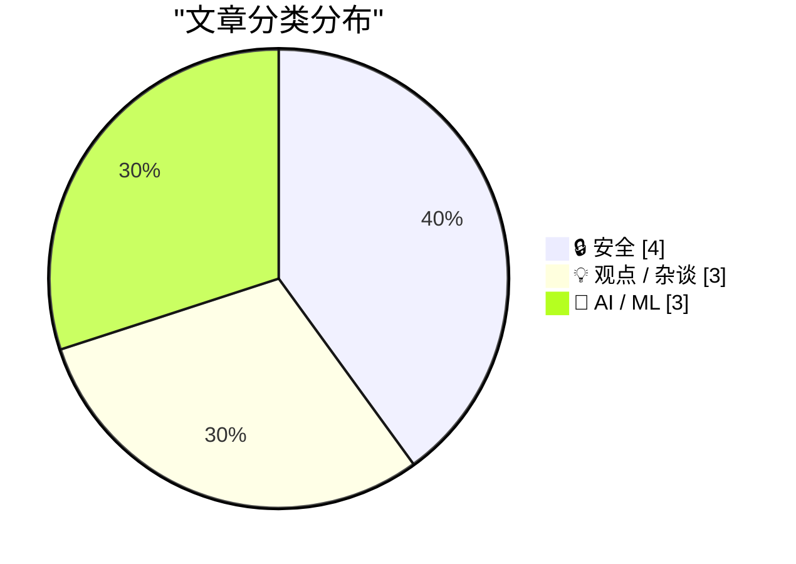
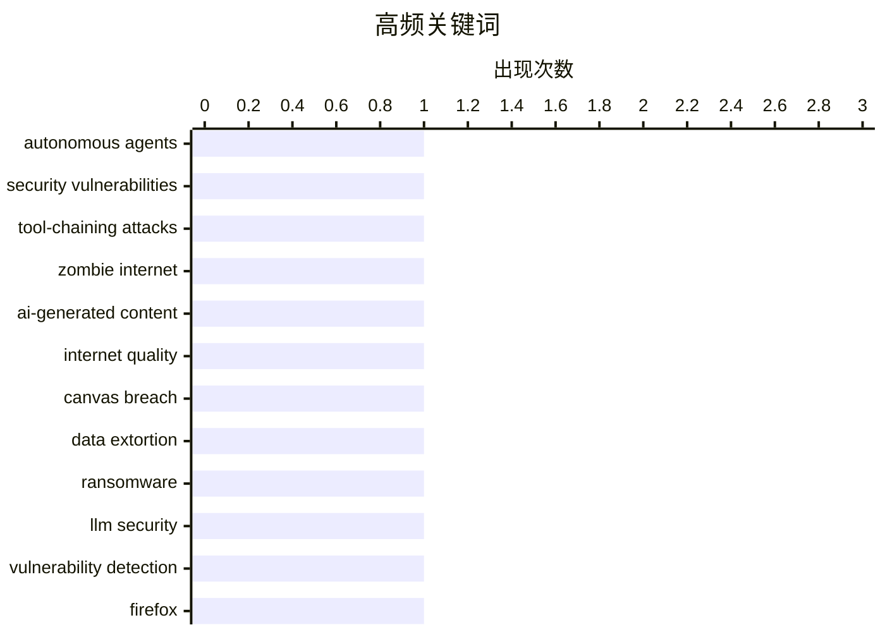

# 📰 AI 博客每日精选 — 2026-05-02

> 来自 Karpathy 推荐的 92 个顶级技术博客，AI 精选 Top 10

## 🏆 今日必读

🥇 **Breaking: Autonomous Agents are a Shitshow**

[Breaking: Autonomous Agents are a Shitshow](https://garymarcus.substack.com/p/breaking-autonomous-agents-are-a) — garymarcus.substack.com · 2026-05-06 · 🔒 安全

> Breaking: Autonomous Agents are a Shitshow Brace for chaos Gary Marcus May 05, 2026 282 92 29 Share Remember my essay back in August with Nathan Hamiel LLM + Coding Agents = Security Nightmare? We wer

🏷️ autonomous agents, security vulnerabilities, tool-chaining attacks

🥈 **Your AI Use Is Breaking My Brain**

[Your AI Use Is Breaking My Brain](https://simonwillison.net/2026/May/11/zombie-internet/#atom-everything) — simonwillison.net · 2026-05-12 · 💡 观点 / 杂谈

> Your AI Use Is Breaking My Brain ( via ) Excellent, angry piece by Jason Koebler on how AI writing online is becoming impossible to avoid, filtering it is mentally exhausting and it's even starting to

🏷️ Zombie Internet, AI-generated content, internet quality

🥉 **Canvas Breach Disrupts Schools & Colleges Nationwide**

[Canvas Breach Disrupts Schools & Colleges Nationwide](https://krebsonsecurity.com/2026/05/canvas-breach-disrupts-schools-colleges-nationwide/) — krebsonsecurity.com · 2026-05-08 · 🔒 安全

> An ongoing data extortion attack targeting the widely-used education technology platform Canvas disrupted classes and coursework at school districts and universities across the United States today, af

🏷️ Canvas breach, data extortion, ransomware

---

## 📊 数据概览

| 扫描源 | 抓取文章 | 时间范围 | 精选 |
|:---:|:---:|:---:|:---:|
| 87/92 | 2503 篇 → 203 篇 | 24h | **10 篇** |

### 分类分布



### 高频关键词



<details>
<summary>📈 纯文本关键词图（终端友好）</summary>

```
autonomous agents        │ ████████████████████ 1
security vulnerabilities │ ████████████████████ 1
tool-chaining attacks    │ ████████████████████ 1
zombie internet          │ ████████████████████ 1
ai-generated content     │ ████████████████████ 1
internet quality         │ ████████████████████ 1
canvas breach            │ ████████████████████ 1
data extortion           │ ████████████████████ 1
ransomware               │ ████████████████████ 1
llm security             │ ████████████████████ 1
```

</details>

### 🏷️ 话题标签

**autonomous agents**(1) · **security vulnerabilities**(1) · **tool-chaining attacks**(1) · zombie internet(1) · ai-generated content(1) · internet quality(1) · canvas breach(1) · data extortion(1) · ransomware(1) · llm security(1) · vulnerability detection(1) · firefox(1) · ai capex(1) · tech spending(1) · bubble(1) · ai demand(1) · hyperscaler investment(1) · anthropic(1) · interaction models(1) · voice ai(1)

---

## 🔒 安全

### 1. Breaking: Autonomous Agents are a Shitshow

[Breaking: Autonomous Agents are a Shitshow](https://garymarcus.substack.com/p/breaking-autonomous-agents-are-a) — **garymarcus.substack.com** · 2026-05-06 · ⭐ 28/30

> Breaking: Autonomous Agents are a Shitshow Brace for chaos Gary Marcus May 05, 2026 282 92 29 Share Remember my essay back in August with Nathan Hamiel LLM + Coding Agents = Security Nightmare? We wer

🏷️ autonomous agents, security vulnerabilities, tool-chaining attacks

---

### 2. Canvas Breach Disrupts Schools & Colleges Nationwide

[Canvas Breach Disrupts Schools & Colleges Nationwide](https://krebsonsecurity.com/2026/05/canvas-breach-disrupts-schools-colleges-nationwide/) — **krebsonsecurity.com** · 2026-05-08 · ⭐ 27/30

> An ongoing data extortion attack targeting the widely-used education technology platform Canvas disrupted classes and coursework at school districts and universities across the United States today, af

🏷️ Canvas breach, data extortion, ransomware

---

### 3. Behind the Scenes Hardening Firefox with Claude Mythos Preview

[Behind the Scenes Hardening Firefox with Claude Mythos Preview](https://simonwillison.net/2026/May/7/firefox-claude-mythos/#atom-everything) — **simonwillison.net** · 2026-05-08 · ⭐ 27/30

> Behind the Scenes Hardening Firefox with Claude Mythos Preview ( via ) Fascinating, in-depth details on how Mozilla used their access to the Claude Mythos preview to locate and then fix hundreds of vu

🏷️ LLM security, vulnerability detection, Firefox

---

### 4. Revisiting the 2015 Open Source Census

[Revisiting the 2015 Open Source Census](https://nesbitt.io/2026/05/06/revisiting-the-2015-open-source-census.html) — **nesbitt.io** · 2026-05-06 · ⭐ 26/30

> In July 2015, a year after Heartbleed, the Linux Foundation’s Core Infrastructure Initiative published a census of open source projects . The idea was to find the next OpenSSL before it found us: take

🏷️ xz-utils, critical infrastructure, risk assessment

---

## 💡 观点 / 杂谈

### 5. Your AI Use Is Breaking My Brain

[Your AI Use Is Breaking My Brain](https://simonwillison.net/2026/May/11/zombie-internet/#atom-everything) — **simonwillison.net** · 2026-05-12 · ⭐ 27/30

> Your AI Use Is Breaking My Brain ( via ) Excellent, angry piece by Jason Koebler on how AI writing online is becoming impossible to avoid, filtering it is mentally exhausting and it's even starting to

🏷️ Zombie Internet, AI-generated content, internet quality

---

### 6. Am I Meant To Be Impressed?

[Am I Meant To Be Impressed?](https://www.wheresyoured.at/am-i-meant-to-be-impressed/) — **wheresyoured.at** · 2026-05-06 · ⭐ 27/30

> Am I Meant To Be Impressed? Ed Zitron May 6, 2026 38 min read Table of Contents If you liked this piece, please subscribe to my premium newsletter. It’s $70 a year, or $7 a month, and in return you ge

🏷️ AI capex, tech spending, bubble

---

### 7. Premium: The AI Compute Demand Story Is A Lie

[Premium: The AI Compute Demand Story Is A Lie](https://www.wheresyoured.at/premium-the-ai-compute-demand-story-is-a-lie/) — **wheresyoured.at** · 2026-05-04 · ⭐ 27/30

> Premium: The AI Compute Demand Story Is A Lie Ed Zitron May 4, 2026 32 min read Table of Contents Everyone, it’s time to talk about AI demand and the capacity constraint issues across the industry. Th

🏷️ AI demand, hyperscaler investment, Anthropic

---

## 🤖 AI / ML

### 8. Thinking Machines and interaction models

[Thinking Machines and interaction models](https://seangoedecke.com/interaction-models/) — **seangoedecke.com** · 2026-05-12 · ⭐ 26/30

> Thinking Machines and interaction models Thinking Machines just released Interaction Models . This is their first real AI model release 1 after a year of work and two billion dollars of capital. What 

🏷️ interaction models, voice AI, full-duplex

---

### 9. Misplaced panic over AI progress

[Misplaced panic over AI progress](https://garymarcus.substack.com/p/misplaced-panic-over-ai-progress) — **garymarcus.substack.com** · 2026-05-11 · ⭐ 26/30

> Misplaced panic over AI progress Breaking down what METR’s latest “time horizon” graph does and does not show Gary Marcus May 10, 2026 263 65 34 Share 1. Take the mostly horizontal part (yellow dots, 

🏷️ AI capabilities, benchmarking, Claude Mythos

---

### 10. Open weights are quietly closing up - and that's a problem

[Open weights are quietly closing up - and that's a problem](https://martinalderson.com/posts/open-weights-are-quietly-closing-up/?utm_source=rss&amp;utm_medium=rss&amp;utm_campaign=feed) — **martinalderson.com** · 2026-05-06 · ⭐ 26/30

> It's been a bit of a given in the LLM world that there will be somewhat competitive open weights models. I'm not sure that's a good assumption anymore. A short history of LLMs In the relatively brief 

🏷️ open weights, LLM, DeepSeek, accessibility

---

*生成于 2026-05-02 07:00 | 扫描 87 源 → 获取 2503 篇 → 精选 10 篇*
*基于 [Hacker News Popularity Contest 2025](https://refactoringenglish.com/tools/hn-popularity/) RSS 源列表*
