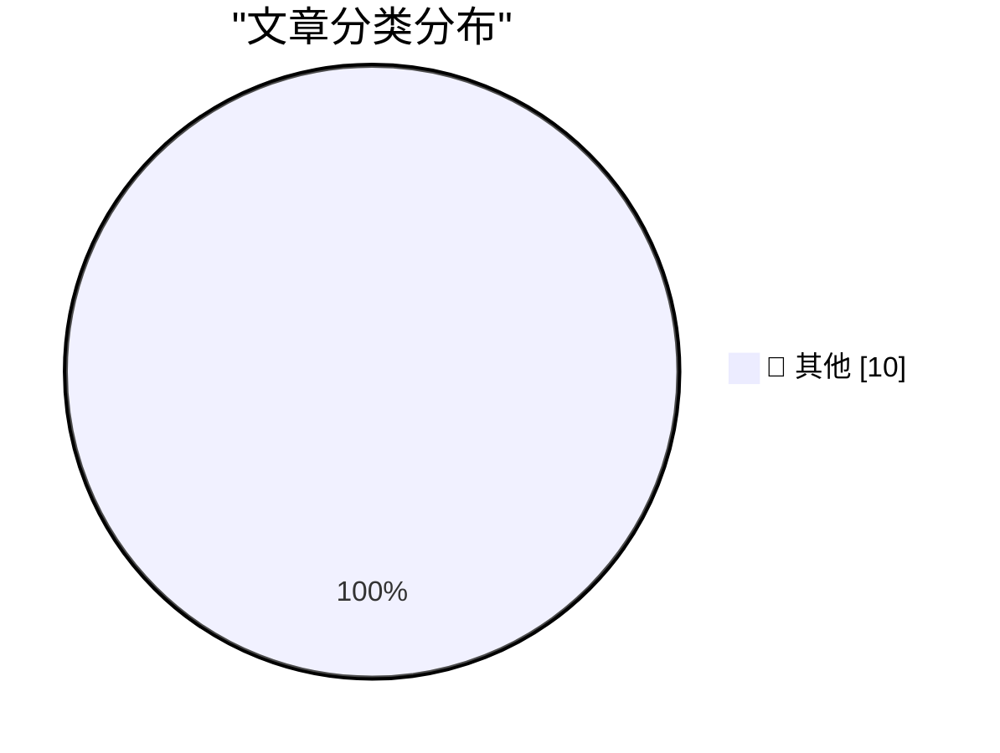

# 📰 AI 博客每日精选 — 2026-05-08

> 来自 Karpathy 推荐的 92 个顶级技术博客，AI 精选 Top 10

## 🏆 今日必读

🥇 **Euler function**

[Euler function](https://www.johndcook.com/blog/2026/05/11/euler-function/) — johndcook.com · 2026-05-12 · 📝 其他

> This morning I wrote a post about the probability that a random matrix over a finite field is invertible. If the field has q elements and the matrix has dimensions n × n then the probability is In tha

🥈 **Thinking Machines and interaction models**

[Thinking Machines and interaction models](https://seangoedecke.com/interaction-models/) — seangoedecke.com · 2026-05-12 · 📝 其他

> Thinking Machines and interaction models Thinking Machines just released Interaction Models . This is their first real AI model release 1 after a year of work and two billion dollars of capital. What 

🥉 **Thoughts on GitLab's workforce reduction" and "structural and strategic decisions"**

[Thoughts on GitLab's workforce reduction" and "structural and strategic decisions"](https://simonwillison.net/2026/May/11/gitlab-act-2/#atom-everything) — simonwillison.net · 2026-05-12 · 📝 其他

> GitLab Act 2 ( via ) There's a lot going on in this announcement from GitLab about the "workforce reduction" and "structural and strategic decisions" they are making with respect to the agentic era. T

---

## 📊 数据概览

| 扫描源 | 抓取文章 | 时间范围 | 精选 |
|:---:|:---:|:---:|:---:|
| 83/92 | 2106 篇 → 86 篇 | 24h | **10 篇** |

### 分类分布

---

## 📝 其他

### 1. Euler function

[Euler function](https://www.johndcook.com/blog/2026/05/11/euler-function/) — **johndcook.com** · 2026-05-12 · ⭐ 15/30

> This morning I wrote a post about the probability that a random matrix over a finite field is invertible. If the field has q elements and the matrix has dimensions n × n then the probability is In tha

---

### 2. Thinking Machines and interaction models

[Thinking Machines and interaction models](https://seangoedecke.com/interaction-models/) — **seangoedecke.com** · 2026-05-12 · ⭐ 15/30

> Thinking Machines and interaction models Thinking Machines just released Interaction Models . This is their first real AI model release 1 after a year of work and two billion dollars of capital. What 

---

### 3. Thoughts on GitLab's workforce reduction" and "structural and strategic decisions"

[Thoughts on GitLab's workforce reduction" and "structural and strategic decisions"](https://simonwillison.net/2026/May/11/gitlab-act-2/#atom-everything) — **simonwillison.net** · 2026-05-12 · ⭐ 15/30

> GitLab Act 2 ( via ) There's a lot going on in this announcement from GitLab about the "workforce reduction" and "structural and strategic decisions" they are making with respect to the agentic era. T

---

### 4. Welcoming the Bangladesh Government to Have I Been Pwned

[Welcoming the Bangladesh Government to Have I Been Pwned](https://www.troyhunt.com/welcoming-the-bangladesh-government-to-have-i-been-pwned/) — **troyhunt.com** · 2026-05-12 · ⭐ 15/30

> Today, we welcome the 43rd government onboarded to Have I Been Pwned's free gov service, Bangladesh. The BGD e-GOV CIRT department now has full access to query all their government domains via API, an

---

### 5. Quoting James Shore

[Quoting James Shore](https://simonwillison.net/2026/May/11/james-shore/#atom-everything) — **simonwillison.net** · 2026-05-12 · ⭐ 15/30

> Simon Willison’s Weblog Subscribe Sponsored by: WorkOS &mdash; Make your app Enterprise Ready with SSO, SCIM, RBAC, and more. 11th May 2026 Your AI coding agent, the one you use to write code, needs t

---

### 6. Inverse shift

[Inverse shift](https://www.johndcook.com/blog/2026/05/11/inverse-shift/) — **johndcook.com** · 2026-05-11 · ⭐ 15/30

> What is the inverse of shifting a sequence to the right? Shifting it to the left, obviously. But wait a minute. Suppose you have a sequence of eight bits abcdefgh and you shift it to the right. You ge

---

### 7. Additional notes on controlling which handles are inherited by CreateProcess

[Additional notes on controlling which handles are inherited by CreateProcess](https://devblogs.microsoft.com/oldnewthing/20260511-00/?p=112313) — **devblogs.microsoft.com/oldnewthing** · 2026-05-11 · ⭐ 15/30

> Some time ago, I wrote about programmatically controlling which handles are inherited by new processes in Win32 by using the PROC_THREAD_ATTRIBUTE_HANDLE_LIST to limit exactly which handles are inheri

---

### 8. We Are Not Going to Agree on AI

[We Are Not Going to Agree on AI](https://idiallo.com/blog/we-are-not-going-to-agree-on-ai?src=feed) — **idiallo.com** · 2026-05-11 · ⭐ 15/30

> On one hand, I know a developer producing 30,000 lines of code a month. On the other, I know a developer who says AI is stupid. Each swears by their stance and has evidence to back it up. One has a wo

---

### 9. Find blog posts with missing featured images - and missing alt text - without a plugin

[Find blog posts with missing featured images - and missing alt text - without a plugin](https://shkspr.mobi/blog/2026/05/find-blog-posts-with-missing-featured-images-and-missing-alt-text-without-a-plugin/) — **shkspr.mobi** · 2026-05-11 · ⭐ 15/30

> Find blog posts with missing featured images - and missing alt text - without a plugin accessibility TILvember WordPress · 500 words · Viewed ~788 times WordPress has the concept of "Featured Images".

---

### 10. Sony Betamax VCR: Born May 10, 1975

[Sony Betamax VCR: Born May 10, 1975](https://dfarq.homeip.net/sony-betamax-vcr-born-may-10-1975/?utm_source=rss&#038;utm_medium=rss&#038;utm_campaign=sony-betamax-vcr-born-may-10-1975) — **dfarq.homeip.net** · 2026-05-11 · ⭐ 15/30

> The consumer VCR turns 51 this week. On May 10, 1975, Sony introduced the Betamax. Although Betamax lost the famous format war, it kicked the door open, being the first VCR format that mere mortals co

---

*生成于 2026-05-08 07:00 | 扫描 83 源 → 获取 2106 篇 → 精选 10 篇*
*基于 [Hacker News Popularity Contest 2025](https://refactoringenglish.com/tools/hn-popularity/) RSS 源列表*
