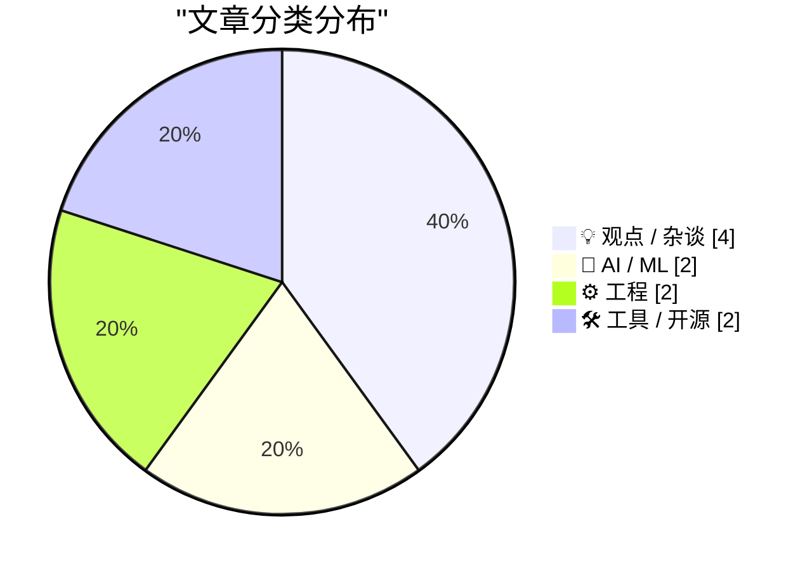
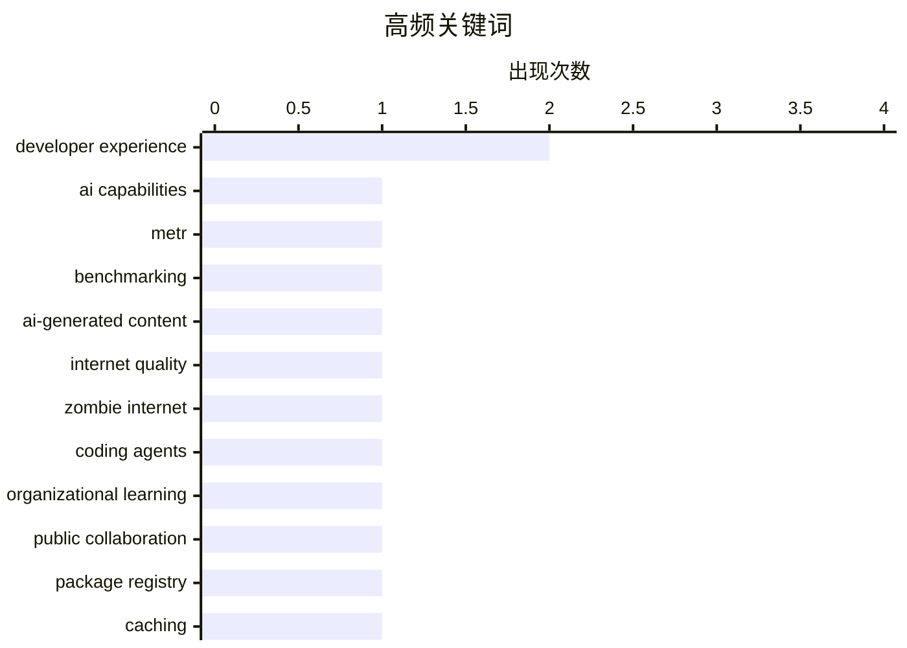

# 📰 AI 博客每日精选 — 2026-05-09

> 来自 Karpathy 推荐的 92 个顶级技术博客，AI 精选 Top 10

## 📝 今日看点

今日技术圈呈现三大焦点：其一，AI能力评估与应用体验的落差日益凸显，从过度恐慌的能力突破预测到本地模型部署的繁琐现实，AI的实际价值正在被理性重新审视；其二，开源生态面临维护危机，大量"僵尸"依赖包潜伏安全隐患，而互联网内容质量因AI生成内容泛滥而恶化，信任基础受到侵蚀；其三，工程实践在细节处创新突破，从可见工作促进组织学习、到跨包管理器的本地缓存方案、再到格式化工具的可控设计，开发者正在用务实的工具和方法论应对复杂性。

---

## 🏆 今日必读

🥇 **对AI进展的过度恐慌**

[Misplaced panic over AI progress](https://garymarcus.substack.com/p/misplaced-panic-over-ai-progress) — garymarcus.substack.com · 2026-05-11 · 🤖 AI / ML

> METR发布的最新"时间视界"图表引发了关于AI能力突破的广泛担忧。该图表衡量的是前沿模型完成软件开发任务的时间长度，从一分钟任务逐步提升到16小时任务。然而这个图表仅基于50%的成功率，而在80%或95%的成功率下仍有大量空间，且只关注数天内的任务而忽视了真实工程项目可能耗时数月或数年的情况。GenAI的核心问题是可靠性，而一个仅要求50%成功率的图表无法真正反映这一点。

💡 **为什么值得读**: 帮助理解如何正确解读AI能力评估数据，避免被单一指标的表面现象所误导。

🏷️ AI capabilities, METR, benchmarking

🥈 **AI内容充斥导致互联网体验恶化**

[Your AI Use Is Breaking My Brain](https://simonwillison.net/2026/May/11/zombie-internet/#atom-everything) — simonwillison.net · 2026-05-12 · 💡 观点 / 杂谈

> 互联网正在演变成"僵尸互联网"，其中人与AI、人与人、AI与AI之间的互动混杂在一起，难以区分。这包括影响力营销者创建的自动化YouTube频道和博客、用AI生成的书籍摘要被当作原著出售、以及营销公司运营的虚假账户提供虚伪建议等现象。过滤这些AI生成内容在精神上极其耗费，甚至开始扭曲真实人类的写作风格。

💡 **为什么值得读**: 揭示AI生成内容泛滥对互联网生态和用户体验的实际影响，超越了单纯的技术讨论。

🏷️ AI-generated content, internet quality, zombie internet

🥉 **通过可见工作实现组织学习**

[Learning on the Shop floor](https://simonwillison.net/2026/May/11/learning-on-the-shop-floor/#atom-everything) — simonwillison.net · 2026-05-11 · ⚙️ 工程

> Shopify的内部编码代理工具River采用公开Slack频道的方式运作，所有对话都可被搜索和观看。这种做法创造了"Lehrwerkstatt"（教学工坊）的环境，员工通过观察他人的工作进行学习，无需正式课程或培训计划。这种"渗透式学习"使100多人能够通过参与、添加上下文和相互学习，类似于Midjourney早期通过公开Discord频道让用户共享提示词和实验的成功模式。

💡 **为什么值得读**: 展示了一种创新的组织学习模式，通过工作透明度实现规模化的知识共享和能力提升。

🏷️ coding agents, organizational learning, public collaboration

---

## 📊 数据概览

| 扫描源 | 抓取文章 | 时间范围 | 精选 |
|:---:|:---:|:---:|:---:|
| 40/92 | 1155 篇 → 54 篇 | 24h | **10 篇** |

### 分类分布



### 高频关键词



<details>
<summary>📈 纯文本关键词图（终端友好）</summary>

```
developer experience    │ ████████████████████ 2
ai capabilities         │ ██████████░░░░░░░░░░ 1
metr                    │ ██████████░░░░░░░░░░ 1
benchmarking            │ ██████████░░░░░░░░░░ 1
ai-generated content    │ ██████████░░░░░░░░░░ 1
internet quality        │ ██████████░░░░░░░░░░ 1
zombie internet         │ ██████████░░░░░░░░░░ 1
coding agents           │ ██████████░░░░░░░░░░ 1
organizational learning │ ██████████░░░░░░░░░░ 1
public collaboration    │ ██████████░░░░░░░░░░ 1
```

</details>

### 🏷️ 话题标签

**developer experience**(2) · **ai capabilities**(1) · **metr**(1) · benchmarking(1) · ai-generated content(1) · internet quality(1) · zombie internet(1) · coding agents(1) · organizational learning(1) · public collaboration(1) · package registry(1) · caching(1) · go(1) · development tools(1) · open source maintenance(1) · security(1) · package management(1) · local models(1) · inference(1) · zig(1)

---

## 💡 观点 / 杂谈

### 1. AI内容充斥导致互联网体验恶化

[Your AI Use Is Breaking My Brain](https://simonwillison.net/2026/May/11/zombie-internet/#atom-everything) — **simonwillison.net** · 2026-05-12 · ⭐ 25/30

> 互联网正在演变成"僵尸互联网"，其中人与AI、人与人、AI与AI之间的互动混杂在一起，难以区分。这包括影响力营销者创建的自动化YouTube频道和博客、用AI生成的书籍摘要被当作原著出售、以及营销公司运营的虚假账户提供虚伪建议等现象。过滤这些AI生成内容在精神上极其耗费，甚至开始扭曲真实人类的写作风格。

🏷️ AI-generated content, internet quality, zombie internet

---

### 2. 开源包维护危机："僵尸"依赖的隐患

[Weekend at Bernie’s](https://nesbitt.io/2026/05/08/weekend-at-bernies.html) — **nesbitt.io** · 13 小时前 · ⭐ 25/30

> 许多被广泛依赖的开源包处于"僵尸"状态——仍在解析和下载，但无人维护。当这些包收到安全报告时，可能无人响应导致CVE发布时无修复版本，或修复代码停留在PR中因发布权限持有者已离职而无法发布。更隐蔽的问题是，如果僵尸包对其依赖声明了严格版本范围，而该依赖发布了安全更新的新主版本，下游所有项目会被死包的约束锁定在易受攻击的版本上。作者通过分析8606个关键包的提交和issue活动来识别真正的"死包"，而非仅看最后提交时间。

🏷️ open source maintenance, security, package management

---

### 3. AI是工具，不是救世主也不是末日

[We Are Not Going to Agree on AI](https://idiallo.com/blog/we-are-not-going-to-agree-on-ai?src=feed) — **idiallo.com** · 2026-05-11 · ⭐ 22/30

> 关于AI是否有效的争论无法达成共识，因为不同使用场景的结果差异巨大——有开发者月产30000行代码，也有人认为AI无用；Medvi年收入预计18亿美元但涉嫌欺诈，微软声称30%代码由AI生成但GitHub 90天内记录89起事件。AI本质上是一个能干的工具，其价值取决于具体应用而非理论能力。作者以Home Depot购买工具的比喻说明，工具的价值在于它能帮你完成目标，而非它能做什么。

🏷️ AI adoption, developer productivity, tool evaluation

---

### 4. GitLab裁员决策的战略失误

[I'm really frustrated that GitLab is doing layoffs](https://xeiaso.net/notes/2026/gitlab-layoffs/) — **xeiaso.net** · 2026-05-11 · ⭐ 21/30

> GitLab宣布裁员，这被认为是一个战略失误。GitHub正经历日常级别的大规模宕机，GitLab本可以通过市场自己为"稳定的选择"并提供工具将GitHub Actions迁移到GitLab来轻松获胜。相反，GitLab采取了常见的"股价下跌但声称AI将拯救我们"的叙事，这引发了对AI驱动的功能工厂（如Protos）可能带来的质量问题的担忧。

🏷️ GitLab, layoffs, DevOps

---

## 🤖 AI / ML

### 5. 对AI进展的过度恐慌

[Misplaced panic over AI progress](https://garymarcus.substack.com/p/misplaced-panic-over-ai-progress) — **garymarcus.substack.com** · 2026-05-11 · ⭐ 26/30

> METR发布的最新"时间视界"图表引发了关于AI能力突破的广泛担忧。该图表衡量的是前沿模型完成软件开发任务的时间长度，从一分钟任务逐步提升到16小时任务。然而这个图表仅基于50%的成功率，而在80%或95%的成功率下仍有大量空间，且只关注数天内的任务而忽视了真实工程项目可能耗时数月或数年的情况。GenAI的核心问题是可靠性，而一个仅要求50%成功率的图表无法真正反映这一点。

🏷️ AI capabilities, METR, benchmarking

---

### 6. 本地模型需要打磨而非仅可运行

[Pushing Local Models With Focus And Polish](https://lucumr.pocoo.org/2026/5/8/local-models/) — **lucumr.pocoo.org** · 23 小时前 · ⭐ 24/30

> 虽然本地模型推理的基础设施在改进，但用户体验仍远低于预期。与简单地输入API密钥使用托管模型相比，本地部署需要选择推理引擎、模型、量化方式、模板、上下文大小等多个参数，且配置繁琐。关键差距包括大多数本地模型不支持工具参数流式传输，导致无法实时看到模型的工具调用过程，影响连接监测、令牌效率和中断时机。本地模型的工作重点应从"可运行"转向"感觉完成"。

🏷️ local models, inference, developer experience

---

## ⚙️ 工程

### 7. 通过可见工作实现组织学习

[Learning on the Shop floor](https://simonwillison.net/2026/May/11/learning-on-the-shop-floor/#atom-everything) — **simonwillison.net** · 2026-05-11 · ⭐ 25/30

> Shopify的内部编码代理工具River采用公开Slack频道的方式运作，所有对话都可被搜索和观看。这种做法创造了"Lehrwerkstatt"（教学工坊）的环境，员工通过观察他人的工作进行学习，无需正式课程或培训计划。这种"渗透式学习"使100多人能够通过参与、添加上下文和相互学习，类似于Midjourney早期通过公开Discord频道让用户共享提示词和实验的成功模式。

🏷️ coding agents, organizational learning, public collaboration

---

### 8. 在8位微控制器上托管网站

[Hosting a website on an 8-bit microcontroller.](https://maurycyz.com/projects/mcusite/) — **maurycyz.com** · 2026-05-11 · ⭐ 21/30

> 使用AVR64DD32微控制器（8KB RAM、64KB闪存、成本1美元）通过SLIP（串行线路互联网协议）而非以太网连接互联网来托管网站。SLIP是一个简单的老标准，通过USB转串口适配器在115200波特率下运行，避免了以太网的高速要求。微控制器实现了IP头处理和HTTP服务，利用现代操作系统禁用分片的特性简化了实现。

🏷️ microcontroller, networking, embedded systems

---

## 🛠 工具 / 开源

### 9. 跨16个包管理器的本地代理缓存工具

[proxy](https://nesbitt.io/2026/05/11/proxy.html) — **nesbitt.io** · 2026-05-11 · ⭐ 25/30

> proxy是一个Go二进制工具，支持npm、PyPI、RubyGems、Cargo、Go modules、Maven、NuGet等16个包管理器的协议。它在本地缓存包管理器请求，首次安装从上游获取，之后从本地缓存提供，同时重写元数据响应使URL指向代理而非源站。该工具可用于CI/CD中跨多个运行器共享依赖缓存（通过S3或Postgres），以及通过mirror命令预先拉取SBOM中列出的所有工件。

🏷️ package registry, caching, Go, development tools

---

### 10. Zig格式化工具的可控设计

[Steering Zig Fmt](https://matklad.github.io/2026/05/08/steering-zig-fmt.html) — **matklad.github.io** · 23 小时前 · ⭐ 23/30

> zig fmt通过观察现有代码的格式来选择语法构造的布局方式，使其具有可控性。例如，函数调用是否单行显示取决于是否有尾逗号；数组的列数由第一行的换行位置决定，实现了列对齐。这种设计让开发者通过添加逗号或换行来指导格式化，而非让格式化工具猜测，相比rustfmt和deno fmt等其他格式化工具更优越。

🏷️ Zig, code formatter, developer experience

---

*生成于 2026-05-09 07:00 | 扫描 40 源 → 获取 1155 篇 → 精选 10 篇*
*基于 [Hacker News Popularity Contest 2025](https://refactoringenglish.com/tools/hn-popularity/) RSS 源列表*
