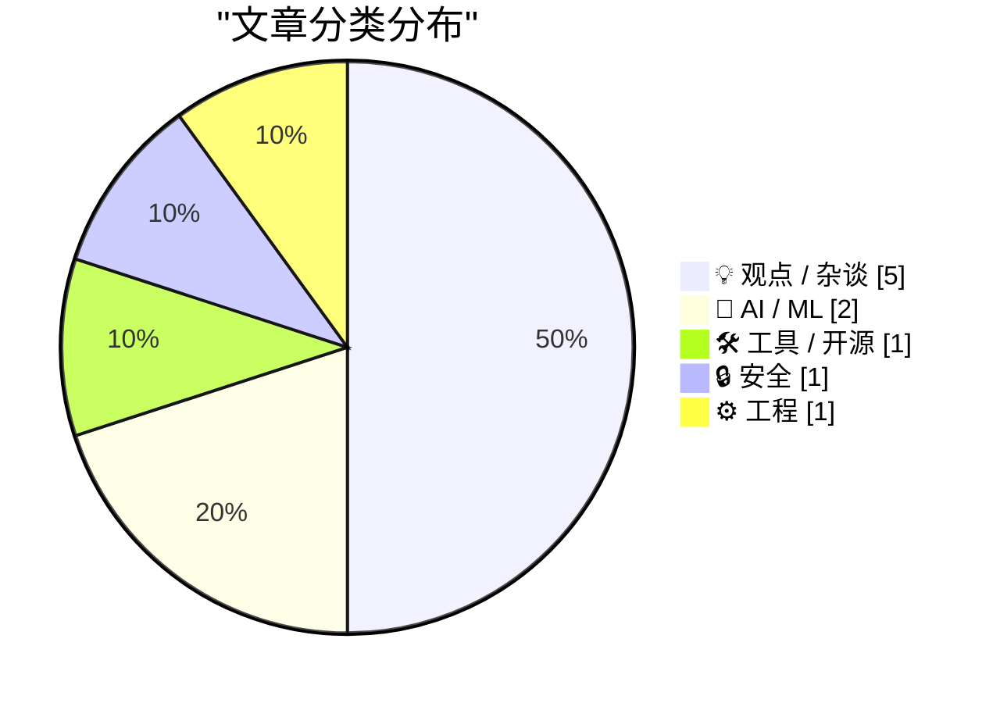
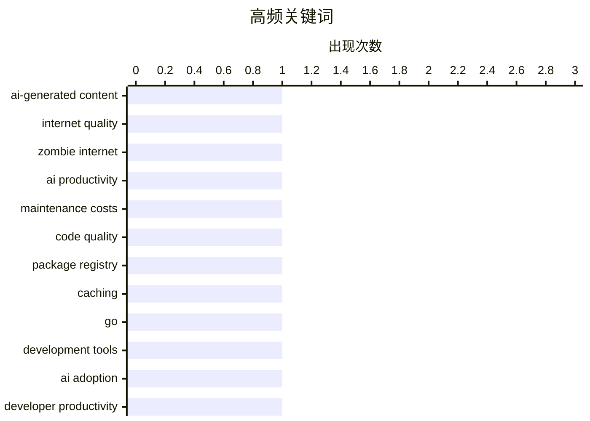

# 📰 AI 博客每日精选 — 2026-05-10

> 来自 Karpathy 推荐的 92 个顶级技术博客，AI 精选 Top 10

## 📝 今日看点

今日技术圈呈现三大焦点：其一，AI生成内容泛滥与AI编码助手的实际价值问题引发深度反思，从"僵尸互联网"现象到维护成本悖论，业界对AI工具的理性评估正在取代盲目乐观；其二，围绕AI在软件开发中的角色存在根本分歧，从能力分布差异到ROI质疑，开发者社区对AI的认知差异巨大且难以弥合；其三，安全与工程实践层面的关注持续升温，从密码学算法逆向到开源项目评估，技术社区在基础设施和风险管理上的投入不减。

---

## 🏆 今日必读

🥇 **你的AI使用正在摧毁我的大脑**

[Your AI Use Is Breaking My Brain](https://simonwillison.net/2026/May/11/zombie-internet/#atom-everything) — simonwillison.net · 2026-05-12 · 💡 观点 / 杂谈

> 互联网上充斥的AI生成内容正在造成严重问题。"僵尸互联网"现象描述了一个更复杂的局面：不仅是机器人之间的交互，而是人与机器人、人与人（使用AI）、人与人（一方使用AI一方未使用）的混杂互动，包括自动化YouTube频道、博客和社交媒体账户为赚钱而大量发布内容，以及AI摘要冒充真实书籍销售、营销公司运营的虚假账户等现象。这种无处不在的AI内容使得过滤变得精神疲惫，甚至开始扭曲正常人类的写作风格。

💡 **为什么值得读**: 深刻揭示了AI泛滥对互联网生态的实际破坏——不是简单的"死亡互联网"，而是真人与AI混杂互动导致的信息真伪难辨和认知疲劳问题。

🏷️ AI-generated content, internet quality, zombie internet

🥈 **引用詹姆斯·肖尔：AI编码助手必须降低维护成本**

[Quoting James Shore](https://simonwillison.net/2026/May/11/james-shore/#atom-everything) — simonwillison.net · 2026-05-12 · 🤖 AI / ML

> AI编码助手的价值不在于提升编码速度，而在于是否能降低代码维护成本。如果代码输出翻倍但维护成本不变，总维护成本反而会翻倍；如果输出翻倍但维护成本也翻倍，总成本会增加四倍。只有当维护成本的降幅与生产力提升幅度成反比时，使用AI才能带来真正的收益，否则就是用短期的速度优势换取长期的成本负担。

💡 **为什么值得读**: 揭示了AI编码工具评估的关键误区——不能只看速度提升，必须考虑代码质量和维护成本的长期影响。

🏷️ AI productivity, maintenance costs, code quality

🥉 **Proxy：支持16种包管理器的本地缓存镜像工具**

[proxy](https://nesbitt.io/2026/05/11/proxy.html) — nesbitt.io · 2026-05-11 · 🛠 工具 / 开源

> proxy 是一个 Go 单二进制工具，用于在本地缓存多个包管理器的依赖。它支持 npm、PyPI、RubyGems、Cargo、Go modules、Maven、NuGet、Composer、Hex、pub.dev、Conan、Conda、CRAN、Debian、RPM 和 OCI 容器镜像等16种协议，首次安装时从上游源获取并缓存到本地存储，后续安装直接从缓存提供。该工具通过重写元数据响应，确保 tarball URL 指向代理而非原始源，解决了简单 HTTP 缓存的常见问题。在 CI 环境中，registry 级别的缓存相比文件系统级缓存更高效，同一依赖包可跨多个 job 和 runner 共享，支持配置 S3 或 Postgres 作为后端存储。proxy 还支持预先镜像功能，可通过 PURL 或 SBOM 文件批量拉取依赖到本地缓存。

💡 **为什么值得读**: 如果你在开发依赖工具或 CI 流程中频繁调用包管理器，这个轻量级方案能显著减少网络请求和加速构建，同时避免对公共源的过度依赖。

🏷️ package registry, caching, Go, development tools

---

## 📊 数据概览

| 扫描源 | 抓取文章 | 时间范围 | 精选 |
|:---:|:---:|:---:|:---:|
| 87/92 | 2503 篇 → 47 篇 | 24h | **10 篇** |

### 分类分布



### 高频关键词



<details>
<summary>📈 纯文本关键词图（终端友好）</summary>

```
ai-generated content │ ████████████████████ 1
internet quality     │ ████████████████████ 1
zombie internet      │ ████████████████████ 1
ai productivity      │ ████████████████████ 1
maintenance costs    │ ████████████████████ 1
code quality         │ ████████████████████ 1
package registry     │ ████████████████████ 1
caching              │ ████████████████████ 1
go                   │ ████████████████████ 1
development tools    │ ████████████████████ 1
```

</details>

### 🏷️ 话题标签

**ai-generated content**(1) · **internet quality**(1) · **zombie internet**(1) · ai productivity(1) · maintenance costs(1) · code quality(1) · package registry(1) · caching(1) · go(1) · development tools(1) · ai adoption(1) · developer productivity(1) · evidence(1) · open source metrics(1) · risk assessment(1) · ecosystem analysis(1) · ai-progress(1) · metr(1) · capability-evaluation(1) · mersenne twister(1)

---

## 💡 观点 / 杂谈

### 1. 你的AI使用正在摧毁我的大脑

[Your AI Use Is Breaking My Brain](https://simonwillison.net/2026/May/11/zombie-internet/#atom-everything) — **simonwillison.net** · 2026-05-12 · ⭐ 25/30

> 互联网上充斥的AI生成内容正在造成严重问题。"僵尸互联网"现象描述了一个更复杂的局面：不仅是机器人之间的交互，而是人与机器人、人与人（使用AI）、人与人（一方使用AI一方未使用）的混杂互动，包括自动化YouTube频道、博客和社交媒体账户为赚钱而大量发布内容，以及AI摘要冒充真实书籍销售、营销公司运营的虚假账户等现象。这种无处不在的AI内容使得过滤变得精神疲惫，甚至开始扭曲正常人类的写作风格。

🏷️ AI-generated content, internet quality, zombie internet

---

### 2. 我们不会在AI问题上达成共识

[We Are Not Going to Agree on AI](https://idiallo.com/blog/we-are-not-going-to-agree-on-ai?src=feed) — **idiallo.com** · 2026-05-11 · ⭐ 23/30

> 文章探讨了对AI在软件开发中的作用存在的根本分歧。一方面，有开发者每月产出3万行代码并依赖AI工具，另一方面有开发者认为AI无用，双方都有实际案例支撑各自立场。Medvi公司被纽约时报报道年收入有望达18亿美元，展现了AI的商业价值，但同时也存在欺诈指控的争议。微软声称至少30%的代码由AI生成，反映了AI在业界的广泛应用。文章暗示AI的价值评估因人而异，取决于具体应用场景和实现方式。

🏷️ AI adoption, developer productivity, evidence

---

### 3. The Mismeasure of Open Source

[The Mismeasure of Open Source](https://nesbitt.io/2026/05/09/the-mismeasure-of-open-source.html) — **nesbitt.io** · 13 小时前 · ⭐ 23/30

> Every attempt to score open source projects for criticality, risk, or funding need ends up built on roughly the same dozen signals, because those are the dozen signals you can get from a registry API 

🏷️ open source metrics, risk assessment, ecosystem analysis

---

### 4. 真正的奇点是我们一路交到的朋友

[The Real Singularity is the Friends We Made Along the Way](https://geohot.github.io//blog/jekyll/update/2026/05/09/real-singularity.html) — **geohot.github.io** · 16 小时前 · ⭐ 21/30

> 作者批评了科技圈对AI奇点的宗教式信仰，认为这种信念类似于邪教而非理性预测。超大规模公司因战略恐慌而大举投资GPU基础设施，但实际ROI存疑；SF/Twitter社群则将AI开发神圣化，表现出类似Scientology的狂热。作者承认AI是与蒸汽机相当的技术变革，将深刻改造各行业，但反对将其妖魔化或神化的做法。

🏷️ AI singularity, skepticism, hype cycle

---

### 5. AI 让能力弱的工程师危害更小

[AI makes weak engineers less harmful](https://seangoedecke.com/ai-makes-weak-engineers-less-harmful/) — **seangoedecke.com** · 23 小时前 · ⭐ 21/30

> 软件工程能力呈现明显的长尾分布，顶尖工程师的产出远超平均水平，而能力最弱的工程师往往是负资产，会给同事制造需要花时间解决的问题。因此许多科技公司倾向于组建规模小但薪酬极高的精英团队，而非大规模的平均水平工程师团队，这种策略目前看起来是成功的。

🏷️ AI, engineering productivity, team composition

---

## 🤖 AI / ML

### 6. 引用詹姆斯·肖尔：AI编码助手必须降低维护成本

[Quoting James Shore](https://simonwillison.net/2026/May/11/james-shore/#atom-everything) — **simonwillison.net** · 2026-05-12 · ⭐ 24/30

> AI编码助手的价值不在于提升编码速度，而在于是否能降低代码维护成本。如果代码输出翻倍但维护成本不变，总维护成本反而会翻倍；如果输出翻倍但维护成本也翻倍，总成本会增加四倍。只有当维护成本的降幅与生产力提升幅度成反比时，使用AI才能带来真正的收益，否则就是用短期的速度优势换取长期的成本负担。

🏷️ AI productivity, maintenance costs, code quality

---

### 7. Misplaced panic over AI progress

[Misplaced panic over AI progress](https://garymarcus.substack.com/p/misplaced-panic-over-ai-progress) — **garymarcus.substack.com** · 2026-05-11 · ⭐ 24/30

> Breaking down what METR’s latest “time horizon” graph does and does not show

🏷️ AI-progress, METR, capability-evaluation

---

## 🛠 工具 / 开源

### 8. Proxy：支持16种包管理器的本地缓存镜像工具

[proxy](https://nesbitt.io/2026/05/11/proxy.html) — **nesbitt.io** · 2026-05-11 · ⭐ 24/30

> proxy 是一个 Go 单二进制工具，用于在本地缓存多个包管理器的依赖。它支持 npm、PyPI、RubyGems、Cargo、Go modules、Maven、NuGet、Composer、Hex、pub.dev、Conan、Conda、CRAN、Debian、RPM 和 OCI 容器镜像等16种协议，首次安装时从上游源获取并缓存到本地存储，后续安装直接从缓存提供。该工具通过重写元数据响应，确保 tarball URL 指向代理而非原始源，解决了简单 HTTP 缓存的常见问题。在 CI 环境中，registry 级别的缓存相比文件系统级缓存更高效，同一依赖包可跨多个 job 和 runner 共享，支持配置 S3 或 Postgres 作为后端存储。proxy 还支持预先镜像功能，可通过 PURL 或 SBOM 文件批量拉取依赖到本地缓存。

🏷️ package registry, caching, Go, development tools

---

## 🔒 安全

### 9. 用线性代数逆向工程梅森旋转算法

[Reverse engineering Mersenne Twister with Linear Algebra](https://www.johndcook.com/blog/2026/05/10/reverse-mersenne-twister/) — **johndcook.com** · 2026-05-11 · ⭐ 21/30

> 梅森旋转是一个统计性质良好但密码学性质差的伪随机数生成器，其内部状态可以从输出中恢复。通过将比特操作转换为 GF(2) 域上的线性运算，可以用矩阵表示 tempering 步骤，并通过求矩阵逆来实现 untemper 操作。由于 tempering 函数可逆，仅需 640 次调用的输出就能完全推导出内部状态，从而预测后续所有生成的随机数。这种线性代数方法虽然不如比特操作高效，但概念上更直观。

🏷️ Mersenne Twister, PRNG, cryptanalysis, linear algebra

---

## ⚙️ 工程

### 10. Hosting a website on an 8-bit microcontroller.

[Hosting a website on an 8-bit microcontroller.](https://maurycyz.com/projects/mcusite/) — **maurycyz.com** · 2026-05-11 · ⭐ 20/30

> In today's episode of "dumb things to do with an AVR microcontroller": Does your server come with real wood? MCU website demo (may go down if this gets posted to HN) My victim is the AVR64DD32 which i

🏷️ microcontroller, embedded systems, web server

---

*生成于 2026-05-10 07:00 | 扫描 87 源 → 获取 2503 篇 → 精选 10 篇*
*基于 [Hacker News Popularity Contest 2025](https://refactoringenglish.com/tools/hn-popularity/) RSS 源列表*
