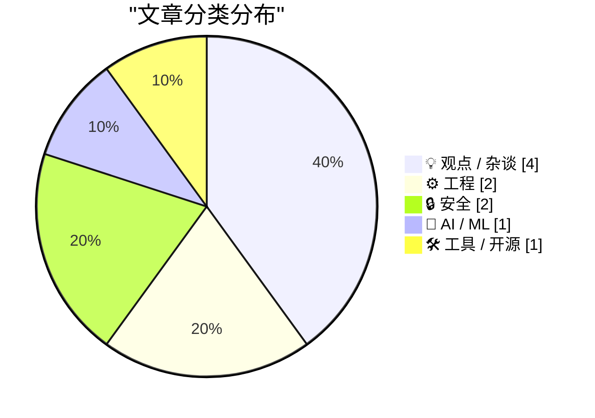
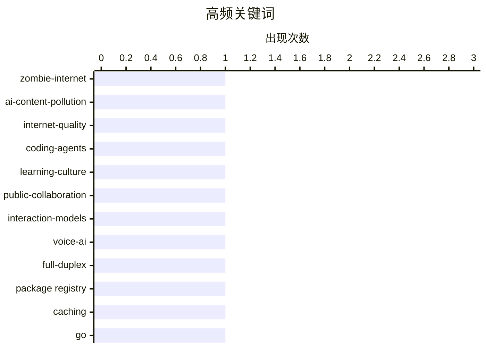

# 📰 AI 博客每日精选 — 2026-05-11

> 来自 Karpathy 推荐的 92 个顶级技术博客，AI 精选 Top 10

## 📝 今日看点

今日技术圈呈现三大主要趋势：其一，AI生成内容与人机交互的深度融合正在重塑互联网生态，从"僵尸互联网"现象到交互模型的实时对话体验，AI正在改变信息流动和人类协作的方式；其二，开发工具链的智能化升级成为焦点，从Shopify的编码智能体强制公开知识共享，到HTML替代JS的交互设计思路，再到多包管理器统一缓存方案，工程效率优化正在多个维度展开；其三，围绕AI的社会影响存在根本分歧，从安全隐忧到伦理价值观，技术圈对AI的态度从技术层面延伸到政治和哲学层面，共识遥遥无期。

---

## 🏆 今日必读

🥇 **你的AI使用正在摧毁我的大脑**

[Your AI Use Is Breaking My Brain](https://simonwillison.net/2026/May/11/zombie-internet/#atom-everything) — simonwillison.net · 2026-05-12 · 💡 观点 / 杂谈

> 互联网上充斥的AI生成内容正在造成严重问题。"僵尸互联网"现象描述了一个更复杂的局面：不仅是机器人之间的交互，而是人与机器人、人与人（使用AI）、人与人（一方使用AI一方未使用）的混杂互动，包括自动化YouTube频道、博客和社交媒体账户为赚钱而大量发布内容，以及AI摘要冒充真实书籍销售、营销公司运营的虚假账户等现象。这种无处不在的AI内容使得过滤变得精神疲惫，甚至开始扭曲正常人类的写作风格。

💡 **为什么值得读**: 深刻揭示了AI泛滥对互联网生态的实际破坏——不是简单的"死亡互联网"，而是真人与AI混杂互动导致的信息真伪难辨和认知疲劳问题。

🏷️ zombie-internet, AI-content-pollution, internet-quality

🥈 **车间里的学习：Shopify 的 River 编码智能体如何实现组织级的知识传递**

[Learning on the Shop floor](https://simonwillison.net/2026/May/11/learning-on-the-shop-floor/#atom-everything) — simonwillison.net · 2026-05-11 · ⚙️ 工程

> Shopify 开发了内部编码智能体 River，通过在公开 Slack 频道中运作来改变团队学习方式。River 拒绝私聊，强制所有对话在公开频道进行，使得每个人都能搜索、旁听和参与他人的工作过程。这种做法创造了一个「Lehrwerkstatt」（教学工坊）环境，员工通过观察他人的工作自然习得知识，无需正式课程或培训计划。Shopify 将这种可见性驱动的学习机制视为实现大规模组织学习的关键，类似于 Midjourney 早期通过公开 Discord 频道让用户互相学习的成功模式。

💡 **为什么值得读**: 展示了如何通过工具设计和透明度机制将知识工作转化为组织级学习资源，对构建学习型组织有实践启发。

🏷️ coding-agents, learning-culture, public-collaboration

🥉 **思维机器与交互模型**

[Thinking Machines and interaction models](https://seangoedecke.com/interaction-models/) — seangoedecke.com · 2026-05-12 · 🤖 AI / ML

> 思维机器公司发布了交互模型，这是其首个真正的AI模型产品，代表了一年工作和20亿美元资本投入的成果。交互模型并非前沿模型，而是专注于改进与AI的实时交互体验，采用全双工语音系统让模型能在200毫秒的微转换中快速切换听说模式，支持中断和同时说话等自然对话特性。其核心创新在于引入后台智能模型来处理推理任务，让交互模型可以通过工具调用委托复杂问题，从而在保持低延迟的同时提升对话质量。

💡 **为什么值得读**: 揭示了AI交互体验的实际改进方向——不是追求超级智能，而是通过架构创新实现更自然流畅的人机对话。

🏷️ interaction-models, voice-AI, full-duplex

---

## 📊 数据概览

| 扫描源 | 抓取文章 | 时间范围 | 精选 |
|:---:|:---:|:---:|:---:|
| 86/92 | 2493 篇 → 38 篇 | 24h | **10 篇** |

### 分类分布



### 高频关键词



<details>
<summary>📈 纯文本关键词图（终端友好）</summary>

```
zombie-internet      │ ████████████████████ 1
ai-content-pollution │ ████████████████████ 1
internet-quality     │ ████████████████████ 1
coding-agents        │ ████████████████████ 1
learning-culture     │ ████████████████████ 1
public-collaboration │ ████████████████████ 1
interaction-models   │ ████████████████████ 1
voice-ai             │ ████████████████████ 1
full-duplex          │ ████████████████████ 1
package registry     │ ████████████████████ 1
```

</details>

### 🏷️ 话题标签

**zombie-internet**(1) · **ai-content-pollution**(1) · **internet-quality**(1) · coding-agents(1) · learning-culture(1) · public-collaboration(1) · interaction-models(1) · voice-ai(1) · full-duplex(1) · package registry(1) · caching(1) · go(1) · html(1) · web components(1) · progressive enhancement(1) · ai-ethics(1) · disability-accessibility(1) · political-perspective(1) · ai productivity(1) · developer experience(1)

---

## 💡 观点 / 杂谈

### 1. 你的AI使用正在摧毁我的大脑

[Your AI Use Is Breaking My Brain](https://simonwillison.net/2026/May/11/zombie-internet/#atom-everything) — **simonwillison.net** · 2026-05-12 · ⭐ 25/30

> 互联网上充斥的AI生成内容正在造成严重问题。"僵尸互联网"现象描述了一个更复杂的局面：不仅是机器人之间的交互，而是人与机器人、人与人（使用AI）、人与人（一方使用AI一方未使用）的混杂互动，包括自动化YouTube频道、博客和社交媒体账户为赚钱而大量发布内容，以及AI摘要冒充真实书籍销售、营销公司运营的虚假账户等现象。这种无处不在的AI内容使得过滤变得精神疲惫，甚至开始扭曲正常人类的写作风格。

🏷️ zombie-internet, AI-content-pollution, internet-quality

---

### 2. 左翼支持AI的理由

[The left-wing case for AI](https://seangoedecke.com/the-left-wing-case-for-ai/) — **seangoedecke.com** · 23 小时前 · ⭐ 22/30

> 文章探讨了为什么左翼政治立场应该支持AI技术的发展。在残障权益方面，LLM为克服各类障碍的人群提供了强大的辅助工具，包括自动字幕、语音控制、代码转换等功能，这与左翼对包容性技术的价值观相符。在医疗领域，LLM能帮助慢性病患者进行自我倡导和医学研究，特别是在应对医学正统观念忽视的罕见病例时，这符合左翼对患者自主权的支持立场。作者认为，如果不是因为加密货币热潮和科技高管政治立场等无关因素的干扰，左翼本应形成一股支持AI的力量。

🏷️ AI-ethics, disability-accessibility, political-perspective

---

### 3. 我们不会在AI问题上达成共识

[We Are Not Going to Agree on AI](https://idiallo.com/blog/we-are-not-going-to-agree-on-ai?src=feed) — **idiallo.com** · 2026-05-11 · ⭐ 21/30

> 文章探讨了对AI在软件开发中的作用存在的根本分歧。一方面，有开发者每月产出3万行代码并依赖AI工具，另一方面有开发者认为AI无用，双方都有实际案例支撑各自立场。Medvi公司被纽约时报报道年收入有望达18亿美元，展现了AI的商业价值，但同时也存在欺诈指控。微软声称至少30%的代码由AI生成，反映了AI在业界的广泛应用。这些现象表明，AI的有效性因具体应用场景和实施方式而异，难以形成统一认识。

🏷️ AI productivity, developer experience, code generation

---

### 4. Misplaced panic over AI progress

[Misplaced panic over AI progress](https://garymarcus.substack.com/p/misplaced-panic-over-ai-progress) — **garymarcus.substack.com** · 3 小时前 · ⭐ 22/30

> Breaking down what METR’s latest “time horizon” graph does and does not show

🏷️ AI progress, METR, capability

---

## ⚙️ 工程

### 5. 车间里的学习：Shopify 的 River 编码智能体如何实现组织级的知识传递

[Learning on the Shop floor](https://simonwillison.net/2026/May/11/learning-on-the-shop-floor/#atom-everything) — **simonwillison.net** · 2026-05-11 · ⭐ 25/30

> Shopify 开发了内部编码智能体 River，通过在公开 Slack 频道中运作来改变团队学习方式。River 拒绝私聊，强制所有对话在公开频道进行，使得每个人都能搜索、旁听和参与他人的工作过程。这种做法创造了一个「Lehrwerkstatt」（教学工坊）环境，员工通过观察他人的工作自然习得知识，无需正式课程或培训计划。Shopify 将这种可见性驱动的学习机制视为实现大规模组织学习的关键，类似于 Midjourney 早期通过公开 Discord 频道让用户互相学习的成功模式。

🏷️ coding-agents, learning-culture, public-collaboration

---

### 6. 用 HTML 替代 JS：重新思考交互设计

[Out With the JS, In With the HTML](https://blog.jim-nielsen.com/2026/out-with-js-in-with-html/) — **blog.jim-nielsen.com** · 4 小时前 · ⭐ 22/30

> 作者探讨了如何通过减少客户端 JavaScript 来改进网站交互体验。他以图标调整大小功能为例，从原来的单页面加 JS 动态修改 DOM 的方案，改为生成多个预渲染页面（如 /colors/red/{sm|md|lg|xl}），让用户通过导航切换而非 JS 交互。通过添加 CSS 视图过渡（CSS view transitions），这种基于导航的方案反而获得了更好的视觉效果，同时消除了客户端逻辑重复、维护负担和同步问题。这个案例说明，随着 CSS 等新 Web 原语的出现，重新审视基础交互模式能发现移除 JS 反而带来更优体验的机会。

🏷️ HTML, web components, progressive enhancement

---

## 🔒 安全

### 7. iOS 26.5 包含端到端加密 RCS 消息的测试版支持

[iOS 26.5 Includes Beta Support for End-to-End Encrypted RCS Messaging](https://www.apple.com/newsroom/2026/05/end-to-end-encrypted-rcs-messaging-begins-rolling-out-today-in-beta/) — **daringfireball.net** · 2026-05-12 · ⭐ 24/30

> Apple 和 Google 联合推动为 RCS（富通信服务）添加端到端加密功能，使这一跨平台消息格式比传统短信更安全。从 iOS 26.5 开始，iPhone 用户和最新版 Google Messages 的 Android 用户可以在测试版中使用加密 RCS 消息，用户在聊天中会看到新的锁定图标表示消息已加密。加密功能默认启用，将自动应用于新建和现有的 RCS 对话。

🏷️ RCS, end-to-end encryption, messaging

---

### 8. 用线性代数逆向工程梅森旋转算法

[Reverse engineering Mersenne Twister with Linear Algebra](https://www.johndcook.com/blog/2026/05/10/reverse-mersenne-twister/) — **johndcook.com** · 5 小时前 · ⭐ 20/30

> 梅森旋转（MT）是一个统计性质良好但密码学性质差的伪随机数生成器。通过逆向梅森旋转的输出可以恢复其内部状态：tempering 函数的每一步都是可逆的，因此从 640 次调用的输出可以完全推断出 640 个 32 位数字组成的内部状态向量。将 tempering 操作表示为 GF(2) 域上的矩阵乘法（按模 2 算术），通过对单位向量进行 tempering 可以构造出 32×32 的变换矩阵 M，求其逆矩阵即可实现 untemper 操作。这个线性代数方法虽然不如位操作高效，但概念上更直观地说明了为什么梅森旋转不适合密码学应用。

🏷️ Mersenne Twister, PRNG, cryptanalysis

---

## 🤖 AI / ML

### 9. 思维机器与交互模型

[Thinking Machines and interaction models](https://seangoedecke.com/interaction-models/) — **seangoedecke.com** · 2026-05-12 · ⭐ 24/30

> 思维机器公司发布了交互模型，这是其首个真正的AI模型产品，代表了一年工作和20亿美元资本投入的成果。交互模型并非前沿模型，而是专注于改进与AI的实时交互体验，采用全双工语音系统让模型能在200毫秒的微转换中快速切换听说模式，支持中断和同时说话等自然对话特性。其核心创新在于引入后台智能模型来处理推理任务，让交互模型可以通过工具调用委托复杂问题，从而在保持低延迟的同时提升对话质量。

🏷️ interaction-models, voice-AI, full-duplex

---

## 🛠 工具 / 开源

### 10. Proxy：支持16种包管理器的本地缓存镜像工具

[proxy](https://nesbitt.io/2026/05/11/proxy.html) — **nesbitt.io** · 2026-05-11 · ⭐ 24/30

> proxy 是一个 Go 单二进制工具，用于在本地缓存多个包管理器的依赖。它支持 npm、PyPI、RubyGems、Cargo、Go modules、Maven、NuGet、Composer、Hex、pub.dev、Conan、Conda、CRAN、Debian、RPM 和 OCI 容器镜像等16种协议，首次安装时从上游源获取并缓存到本地存储，后续安装直接从缓存提供。该工具通过重写元数据响应，确保 tarball URL 指向代理而非原始源，解决了简单 HTTP 缓存的常见问题。在 CI 环境中，registry 级别的缓存相比文件系统级缓存更高效，同一依赖包可跨多个 job 和运行器共享，支持指向 S3 或 Postgres 实现跨运行器共享。proxy 还支持预先镜像功能，可通过 PURL 或 SBOM 文件批量拉取工件到本地缓存。

🏷️ package registry, caching, Go

---

*生成于 2026-05-11 07:00 | 扫描 86 源 → 获取 2493 篇 → 精选 10 篇*
*基于 [Hacker News Popularity Contest 2025](https://refactoringenglish.com/tools/hn-popularity/) RSS 源列表*
