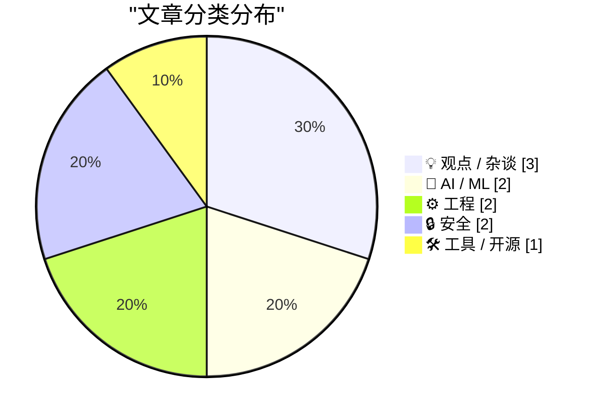
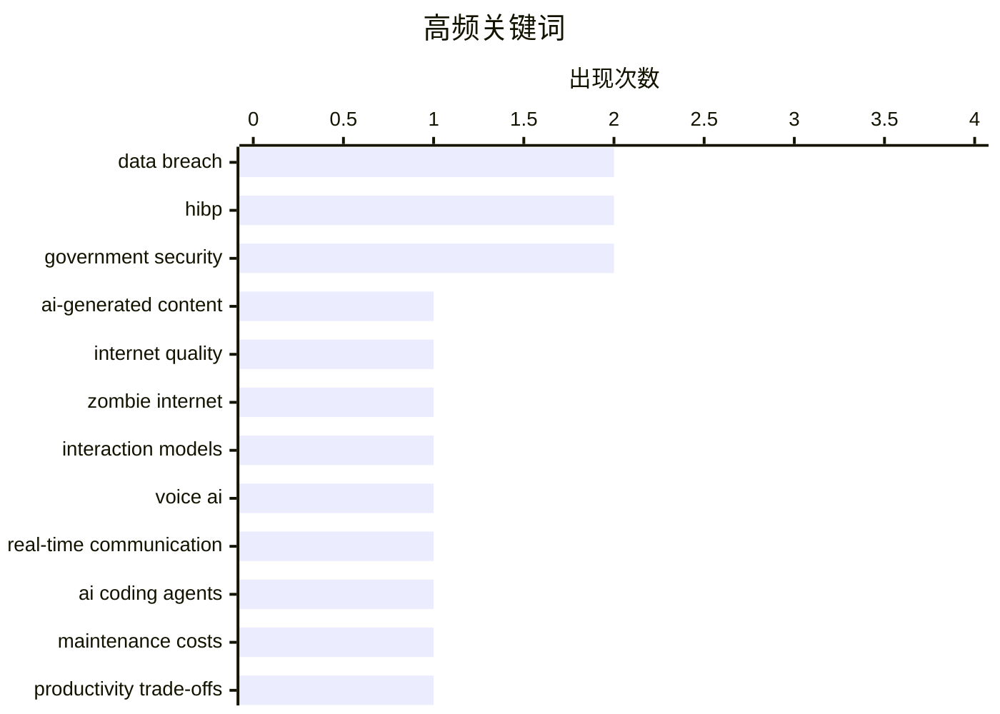

# 📰 AI 博客每日精选 — 2026-05-12

> 来自 Karpathy 推荐的 92 个顶级技术博客，AI 精选 Top 10

## 📝 今日看点

今日技术圈呈现三大焦点：其一，AI生成内容泛滥引发的"僵尸互联网"现象正在重塑信息生态，人机交互的混杂互动带来了前所未有的挑战；其二，AI工具的实际价值争议加剧，从编码助手的维护成本困境到业界对AI有效性的根本分歧，效能评估成为新的关键议题；其三，政府数据安全防护升级，多国政府接入Have I Been Pwned服务体现了公共部门对数据泄露监控的重视。

---

## 🏆 今日必读

🥇 **你的AI使用正在摧毁我的大脑**

[Your AI Use Is Breaking My Brain](https://simonwillison.net/2026/May/11/zombie-internet/#atom-everything) — simonwillison.net · 3 小时前 · 💡 观点 / 杂谈

> 互联网上充斥的AI生成内容正在造成严重问题。"僵尸互联网"现象描述了一个更复杂的局面：不仅是机器人之间的交互，而是人与机器人、人与人（使用AI）、人与人（一方使用AI一方未使用）的混杂互动，包括自动化YouTube频道、博客和社交媒体账户为赚钱而大量发布内容，以及AI摘要冒充真实书籍销售、营销公司运营的虚假账户等现象。这种无处不在的AI内容使得过滤变得精神疲惫，甚至开始扭曲正常人类的写作风格。

💡 **为什么值得读**: 深刻揭示了AI泛滥对互联网生态的实际破坏——不是简单的"死亡互联网"，而是真人与AI混杂互动导致的信息真伪难辨和认知疲劳问题。

🏷️ AI-generated content, internet quality, zombie internet

🥈 **思维机器与交互模型**

[Thinking Machines and interaction models](https://seangoedecke.com/interaction-models/) — seangoedecke.com · 2026-05-12 · 🤖 AI / ML

> 思维机器公司发布了交互模型，这是其首个真正的AI模型产品，代表了一年工作和20亿美元资本投入的成果。交互模型并非前沿模型，而是专注于改进与AI的实时交互体验，采用全双工语音系统让模型能在200毫秒的微转换中同时进行听和说，解决了ChatGPT语音模式中存在的延迟和无法中断的问题。其核心创新是引入后台智能模型来处理推理任务，让交互模型可以通过工具调用委托复杂问题，从而在保持快速响应的同时提升对话智能度。

💡 **为什么值得读**: 深入解析了交互模型这一新兴AI产品类别的技术原理和创新点，帮助理解实时对话AI的发展方向与技术权衡。

🏷️ interaction models, voice AI, real-time communication

🥉 **引用詹姆斯·肖尔：AI编码助手需要降低维护成本**

[Quoting James Shore](https://simonwillison.net/2026/May/11/james-shore/#atom-everything) — simonwillison.net · 3 小时前 · 🤖 AI / ML

> AI编码助手的价值不在于提升编码速度，而在于是否能降低代码维护成本。如果代码输出翻倍但维护成本不变，总维护成本反而会翻倍；如果输出翻倍但维护成本也翻倍，总成本会增加四倍。只有当维护成本的降幅与生产力提升幅度成反比时，使用AI才能带来真正的收益，否则就是用短期的速度优势换取长期的成本负担。

💡 **为什么值得读**: 揭示了AI编码工具评估的关键指标——不是速度而是维护成本，对企业采用AI编程助手的决策有重要参考价值。

🏷️ AI coding agents, maintenance costs, productivity trade-offs

---

## 📊 数据概览

| 扫描源 | 抓取文章 | 时间范围 | 精选 |
|:---:|:---:|:---:|:---:|
| 85/92 | 2478 篇 → 28 篇 | 24h | **10 篇** |

### 分类分布



### 高频关键词



<details>
<summary>📈 纯文本关键词图（终端友好）</summary>

```
data breach             │ ████████████████████ 2
hibp                    │ ████████████████████ 2
government security     │ ████████████████████ 2
ai-generated content    │ ██████████░░░░░░░░░░ 1
internet quality        │ ██████████░░░░░░░░░░ 1
zombie internet         │ ██████████░░░░░░░░░░ 1
interaction models      │ ██████████░░░░░░░░░░ 1
voice ai                │ ██████████░░░░░░░░░░ 1
real-time communication │ ██████████░░░░░░░░░░ 1
ai coding agents        │ ██████████░░░░░░░░░░ 1
```

</details>

### 🏷️ 话题标签

**data breach**(2) · **hibp**(2) · **government security**(2) · ai-generated content(1) · internet quality(1) · zombie internet(1) · interaction models(1) · voice ai(1) · real-time communication(1) · ai coding agents(1) · maintenance costs(1) · productivity trade-offs(1) · ai adoption(1) · developer productivity(1) · tool evaluation(1) · microcontroller(1) · networking(1) · embedded systems(1) · gitlab(1) · layoffs(1)

---

## 💡 观点 / 杂谈

### 1. 你的AI使用正在摧毁我的大脑

[Your AI Use Is Breaking My Brain](https://simonwillison.net/2026/May/11/zombie-internet/#atom-everything) — **simonwillison.net** · 3 小时前 · ⭐ 25/30

> 互联网上充斥的AI生成内容正在造成严重问题。"僵尸互联网"现象描述了一个更复杂的局面：不仅是机器人之间的交互，而是人与机器人、人与人（使用AI）、人与人（一方使用AI一方未使用）的混杂互动，包括自动化YouTube频道、博客和社交媒体账户为赚钱而大量发布内容，以及AI摘要冒充真实书籍销售、营销公司运营的虚假账户等现象。这种无处不在的AI内容使得过滤变得精神疲惫，甚至开始扭曲正常人类的写作风格。

🏷️ AI-generated content, internet quality, zombie internet

---

### 2. 我们永远不会在AI上达成共识

[We Are Not Going to Agree on AI](https://idiallo.com/blog/we-are-not-going-to-agree-on-ai?src=feed) — **idiallo.com** · 11 小时前 · ⭐ 24/30

> 关于AI是否真正有效，业界存在根本性的分歧——有开发者月产30000行代码，也有人认为AI无用；Medvi年收入预计18亿美元，但微软声称30%代码由AI生成的同时，GitHub在90天内记录了89起事件。作者认为AI本质上是一个能力工具，而非救世主或末日之兆，问题在于人们对工具的期待不同：AI公司期待它改变一切，而普通用户只想用它解决具体问题。就像买螺柱探测器一样，工具的价值取决于它能帮你完成什么，而非它理论上能做什么。

🏷️ AI adoption, developer productivity, tool evaluation

---

### 3. I'm really frustrated that GitLab is doing layoffs

[I'm really frustrated that GitLab is doing layoffs](https://xeiaso.net/notes/2026/gitlab-layoffs/) — **xeiaso.net** · 23 小时前 · ⭐ 22/30

> I'm really frustrated that GitLab is doing layoffs Published on 2026-05-11 , 430 words, 2 minutes to read Winning at this could have been so easy GitLab announced layoffs today . They don't state how 

🏷️ GitLab, layoffs, market competition

---

## 🤖 AI / ML

### 4. 思维机器与交互模型

[Thinking Machines and interaction models](https://seangoedecke.com/interaction-models/) — **seangoedecke.com** · 2026-05-12 · ⭐ 24/30

> 思维机器公司发布了交互模型，这是其首个真正的AI模型产品，代表了一年工作和20亿美元资本投入的成果。交互模型并非前沿模型，而是专注于改进与AI的实时交互体验，采用全双工语音系统让模型能在200毫秒的微转换中同时进行听和说，解决了ChatGPT语音模式中存在的延迟和无法中断的问题。其核心创新是引入后台智能模型来处理推理任务，让交互模型可以通过工具调用委托复杂问题，从而在保持快速响应的同时提升对话智能度。

🏷️ interaction models, voice AI, real-time communication

---

### 5. 引用詹姆斯·肖尔：AI编码助手需要降低维护成本

[Quoting James Shore](https://simonwillison.net/2026/May/11/james-shore/#atom-everything) — **simonwillison.net** · 3 小时前 · ⭐ 24/30

> AI编码助手的价值不在于提升编码速度，而在于是否能降低代码维护成本。如果代码输出翻倍但维护成本不变，总维护成本反而会翻倍；如果输出翻倍但维护成本也翻倍，总成本会增加四倍。只有当维护成本的降幅与生产力提升幅度成反比时，使用AI才能带来真正的收益，否则就是用短期的速度优势换取长期的成本负担。

🏷️ AI coding agents, maintenance costs, productivity trade-offs

---

## ⚙️ 工程

### 6. 在8位微控制器上托管网站

[Hosting a website on an 8-bit microcontroller.](https://maurycyz.com/projects/mcusite/) — **maurycyz.com** · 23 小时前 · ⭐ 23/30

> 作者在AVR64DD32微控制器上实现了一个可工作的网站服务器。由于8位AVR的IO速度限制（最高12 MHz），无法直接支持以太网（需要20 Mbps），作者改用SLIP（串行线路网络协议）通过USB串口连接实现网络通信。服务器通过简化IP协议实现（利用现代操作系统已禁用分片功能），仅需单根USB线缆供电和通信，整个系统成本低廉且功耗极低。

🏷️ microcontroller, networking, embedded systems

---

### 7. 控制 CreateProcess 句柄继承的补充说明

[Additional notes on controlling which handles are inherited by CreateProcess](https://devblogs.microsoft.com/oldnewthing/20260511-00/?p=112313) — **devblogs.microsoft.com/oldnewthing** · 9 小时前 · ⭐ 18/30

> 文章讨论了 Win32 中使用 PROC_THREAD_ATTRIBUTE_HANDLE_LIST 精确控制进程句柄继承时的一个反向问题：其他线程可能通过设置 bInheritHandles = TRUE 而意外继承所有句柄。解决方案是创建一个辅助进程，将需要继承的句柄复制到该进程中标记为可继承，然后通过 PROC_THREAD_ATTRIBUTE_PARENT_PROCESS 指定辅助进程作为父进程，最后使用 PROC_THREAD_ATTRIBUTE_HANDLE_LIST 列出要继承的句柄。这样主进程中的组件仍将句柄保持为不可继承状态，避免了意外继承问题，且一个辅助进程可以服务多个线程的句柄继承需求。

🏷️ Windows, process management, handle inheritance

---

## 🔒 安全

### 8. 孟加拉国政府加入 Have I Been Pwned 免费政府服务

[Welcoming the Bangladesh Government to Have I Been Pwned](https://www.troyhunt.com/welcoming-the-bangladesh-government-to-have-i-been-pwned/) — **troyhunt.com** · 32 分钟前 · ⭐ 18/30

> Have I Been Pwned 宣布孟加拉国成为第 43 个接入其免费政府服务的国家。孟加拉国电子政务 CIRT 部门获得完整权限，可通过 API 查询所有政府域名并监控其未来的数据泄露情况。孟加拉国加入了越来越多使用 HIBP 进行数据安全防护的国家政府行列。

🏷️ data breach, HIBP, government security

---

### 9. 欢迎哥斯达黎加政府加入 Have I Been Pwned

[Welcoming the Costa Rican Government to Have I Been Pwned](https://www.troyhunt.com/welcoming-the-costa-rican-government-to-have-i-been-pwned/) — **troyhunt.com** · 22 小时前 · ⭐ 18/30

> Have I Been Pwned 为政府机构提供免费服务，哥斯达黎加成为第 42 个加入该计划的政府。哥斯达黎加政府的 CSIRT（计算机安全事件响应小组）现可访问 HIBP 数据库，监控政府域名是否在数据泄露中暴露。这使其国家网络安全事件响应团队能够及时识别政府信息的泄露情况。

🏷️ data breach, HIBP, government security

---

## 🛠 工具 / 开源

### 10. 无需插件快速查找缺少特色图片和替代文本的博客文章

[Find blog posts with missing featured images - and missing alt text - without a plugin](https://shkspr.mobi/blog/2026/05/find-blog-posts-with-missing-featured-images-and-missing-alt-text-without-a-plugin/) — **shkspr.mobi** · 11 小时前 · ⭐ 17/30

> 文章介绍如何使用 WP CLI 命令行工具在 WordPress 中批量查找缺少特色图片的已发布文章。通过运行特定的 PHP 代码，可以生成包含发布日期、编辑链接和文章标题的列表，方便逐一编辑。同时提供了另一条命令用于查找特色图片缺少替代文本（alt text）的文章，这对于网站无障碍访问至关重要。作者通过这两个工具发现自己有 873 篇文章需要更新。

🏷️ WordPress, WP-CLI, accessibility

---

*生成于 2026-05-12 07:00 | 扫描 85 源 → 获取 2478 篇 → 精选 10 篇*
*基于 [Hacker News Popularity Contest 2025](https://refactoringenglish.com/tools/hn-popularity/) RSS 源列表*
