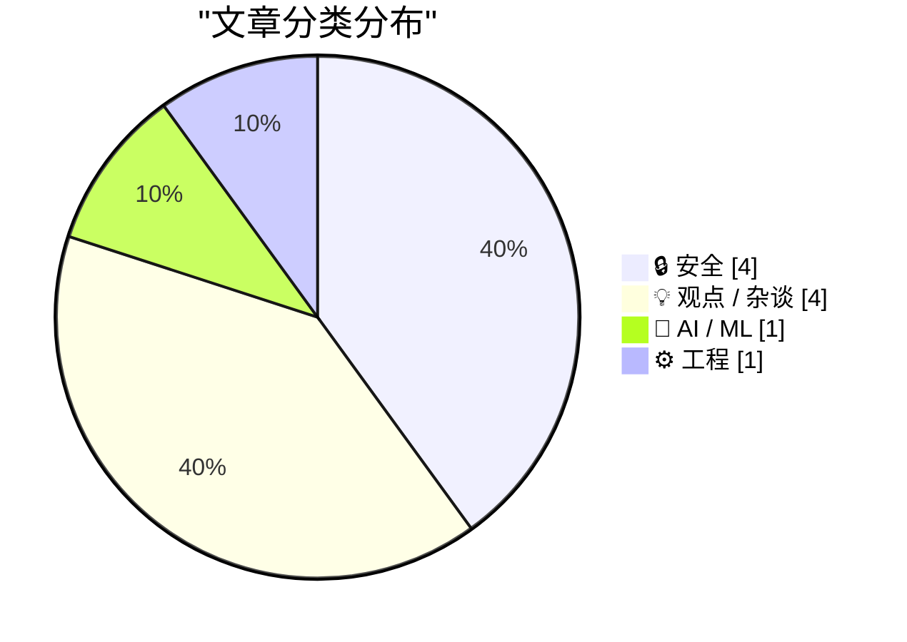
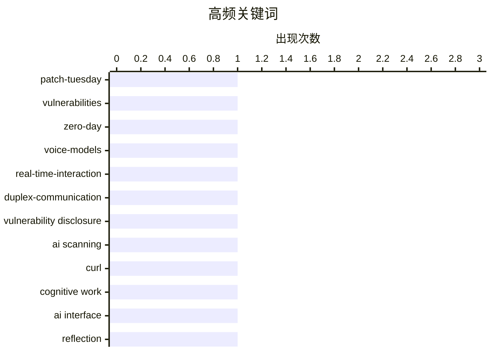

# 📰 AI 博客每日精选 — 2026-05-13

> 来自 Karpathy 推荐的 92 个顶级技术博客，AI 精选 Top 10

## 🏆 今日必读

🥇 **Patch Tuesday, May 2026 Edition**

[Patch Tuesday, May 2026 Edition](https://krebsonsecurity.com/2026/05/patch-tuesday-may-2026-edition/) — krebsonsecurity.com · 1 小时前 · 🔒 安全

> Artificial intelligence platforms may be just as susceptible to social engineering as human beings, but they are proving remarkably good at finding security vulnerabilities in human-made computer code

🏷️ patch-tuesday, vulnerabilities, zero-day

🥈 **Thinking Machines and interaction models**

[Thinking Machines and interaction models](https://seangoedecke.com/interaction-models/) — seangoedecke.com · 23 小时前 · 🤖 AI / ML

> Thinking Machines and interaction models Thinking Machines just released Interaction Models . This is their first real AI model release 1 after a year of work and two billion dollars of capital. What 

🏷️ voice-models, real-time-interaction, duplex-communication

🥉 **Not a Security Issue**

[Not a Security Issue](https://nesbitt.io/2026/05/12/not-a-security-issue.html) — nesbitt.io · 13 小时前 · 🔒 安全

> Daniel Stenberg wrote yesterday about Mythos finding a real curl vulnerability, which sent me poking around the curl tree with a couple of AI-assisted scanners to see what else turned up in a codebase

🏷️ vulnerability disclosure, AI scanning, curl

---

## 📊 数据概览

| 扫描源 | 抓取文章 | 时间范围 | 精选 |
|:---:|:---:|:---:|:---:|
| 88/92 | 2528 篇 → 23 篇 | 24h | **10 篇** |

### 分类分布



### 高频关键词



<details>
<summary>📈 纯文本关键词图（终端友好）</summary>

```
patch-tuesday            │ ████████████████████ 1
vulnerabilities          │ ████████████████████ 1
zero-day                 │ ████████████████████ 1
voice-models             │ ████████████████████ 1
real-time-interaction    │ ████████████████████ 1
duplex-communication     │ ████████████████████ 1
vulnerability disclosure │ ████████████████████ 1
ai scanning              │ ████████████████████ 1
curl                     │ ████████████████████ 1
cognitive work           │ ████████████████████ 1
```

</details>

### 🏷️ 话题标签

**patch-tuesday**(1) · **vulnerabilities**(1) · **zero-day**(1) · voice-models(1) · real-time-interaction(1) · duplex-communication(1) · vulnerability disclosure(1) · ai scanning(1) · curl(1) · cognitive work(1) · ai interface(1) · reflection(1) · ma(1) · open-source(1) · privacy(1) · hardware-control(1) · organizational-structure(1) · team-scaling(1) · agentic-era(1) · software architecture(1)

---

## 🔒 安全

### 1. Patch Tuesday, May 2026 Edition

[Patch Tuesday, May 2026 Edition](https://krebsonsecurity.com/2026/05/patch-tuesday-may-2026-edition/) — **krebsonsecurity.com** · 1 小时前 · ⭐ 26/30

> Artificial intelligence platforms may be just as susceptible to social engineering as human beings, but they are proving remarkably good at finding security vulnerabilities in human-made computer code

🏷️ patch-tuesday, vulnerabilities, zero-day

---

### 2. Not a Security Issue

[Not a Security Issue](https://nesbitt.io/2026/05/12/not-a-security-issue.html) — **nesbitt.io** · 13 小时前 · ⭐ 25/30

> Daniel Stenberg wrote yesterday about Mythos finding a real curl vulnerability, which sent me poking around the curl tree with a couple of AI-assisted scanners to see what else turned up in a codebase

🏷️ vulnerability disclosure, AI scanning, curl

---

### 3. Bambu Lab is abusing the open source social contract

[Bambu Lab is abusing the open source social contract](https://www.jeffgeerling.com/blog/2026/bambu-lab-abusing-open-source-social-contract/) — **jeffgeerling.com** · 9 小时前 · ⭐ 23/30

> Bambu Lab is abusing the open source social contract May 12, 2026 Last year I said I'd probably never recommend another Bambu Lab printer again . I still use my P1S, but after Bambu Lab started pushin

🏷️ open-source, privacy, hardware-control

---

### 4. Why the Wannacry outbreak was so bad

[Why the Wannacry outbreak was so bad](https://dfarq.homeip.net/why-the-wannacry-outbreak-was-so-bad/?utm_source=rss&#038;utm_medium=rss&#038;utm_campaign=why-the-wannacry-outbreak-was-so-bad) — **dfarq.homeip.net** · 12 小时前 · ⭐ 20/30

> On May 12, 2017, ransomware named Wannacry started spreading across the globe, infecting and encrypting Windows systems by exploiting CVE-2017-0144, a flaw that a two-month-old Microsoft patch, MS17-0

🏷️ Wannacry, CVE-2017-0144, patch management, NSA exploit

---

## 💡 观点 / 杂谈

### 5. Building Software Requires Digestion

[Building Software Requires Digestion](https://blog.jim-nielsen.com/2026/software-requires-digestion/) — **blog.jim-nielsen.com** · 4 小时前 · ⭐ 23/30

> Building Software Requires Digestion 2026-05-12 Here’s Scott Jenson in his insightful piece “The Ma of a New Machine” : the chatbot interface [makes us] feel like deep cognitive work is happening. But

🏷️ cognitive work, AI interface, reflection, Ma

---

### 6. Learning Software Architecture

[Learning Software Architecture](https://matklad.github.io/2026/05/12/software-architecture.html) — **matklad.github.io** · 23 小时前 · ⭐ 22/30

> Learning Software Architecture May 12, 2026 In reply to an email asking about learning software design skills as a researcher physicist: I was attached to a bioinformatics lab early in my career, so I

🏷️ software architecture, Conway's law, design

---

### 7. Quoting Mitchell Hashimoto

[Quoting Mitchell Hashimoto](https://simonwillison.net/2026/May/12/mitchell-hashimoto/#atom-everything) — **simonwillison.net** · 40 分钟前 · ⭐ 21/30

> Simon Willison’s Weblog Subscribe Sponsored by: WorkOS &mdash; Make your app Enterprise Ready with SSO, SCIM, RBAC, and more. 12th May 2026 The thing about 90% of TDMs [Technical Decision Makers] is t

🏷️ decision-making, marketing, enterprise

---

### 8. Where Are All The Data Centers?

[Where Are All The Data Centers?](https://www.wheresyoured.at/where-are-all-the-data-centers/) — **wheresyoured.at** · 6 小时前 · ⭐ 21/30

> Where Are All The Data Centers? Ed Zitron May 12, 2026 37 min read Table of Contents If you liked this piece, please subscribe to my premium newsletter. It’s $70 a year, or $7 a month, and in return y

🏷️ AI infrastructure, data centers, bubble analysis

---

## 🤖 AI / ML

### 9. Thinking Machines and interaction models

[Thinking Machines and interaction models](https://seangoedecke.com/interaction-models/) — **seangoedecke.com** · 23 小时前 · ⭐ 26/30

> Thinking Machines and interaction models Thinking Machines just released Interaction Models . This is their first real AI model release 1 after a year of work and two billion dollars of capital. What 

🏷️ voice-models, real-time-interaction, duplex-communication

---

## ⚙️ 工程

### 10. Thoughts on GitLab's workforce reduction" and "structural and strategic decisions"

[Thoughts on GitLab's workforce reduction" and "structural and strategic decisions"](https://simonwillison.net/2026/May/11/gitlab-act-2/#atom-everything) — **simonwillison.net** · 23 小时前 · ⭐ 23/30

> GitLab Act 2 ( via ) There's a lot going on in this announcement from GitLab about the "workforce reduction" and "structural and strategic decisions" they are making with respect to the agentic era. T

🏷️ organizational-structure, team-scaling, agentic-era

---

*生成于 2026-05-13 07:02 | 扫描 88 源 → 获取 2528 篇 → 精选 10 篇*
*基于 [Hacker News Popularity Contest 2025](https://refactoringenglish.com/tools/hn-popularity/) RSS 源列表*
