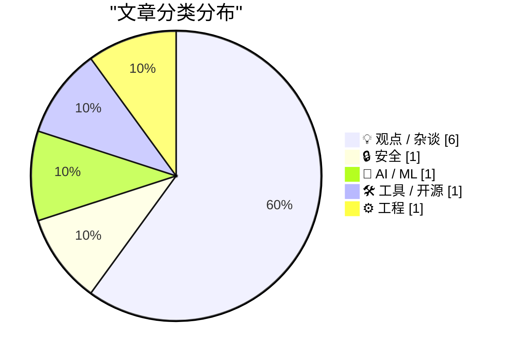
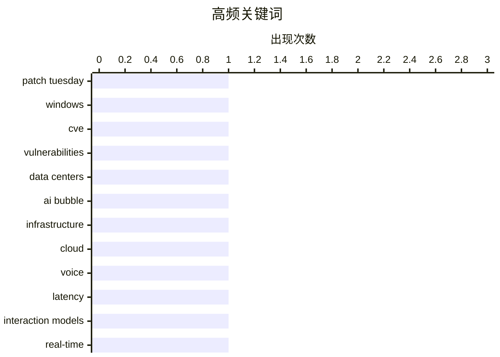

# 📰 AI 博客每日精选 — 2026-05-13

> 来自 Karpathy 推荐的 92 个顶级技术博客，AI 精选 Top 10

## 🏆 今日必读

🥇 **Patch Tuesday, May 2026 Edition**

[Patch Tuesday, May 2026 Edition](https://krebsonsecurity.com/2026/05/patch-tuesday-may-2026-edition/) — krebsonsecurity.com · 1 小时前 · 🔒 安全

> Artificial intelligence platforms may be just as susceptible to social engineering as human beings, but they are proving remarkably good at finding security vulnerabilities in human-made computer code

🏷️ Patch Tuesday, Windows, CVE, vulnerabilities

🥈 **Where Are All The Data Centers?**

[Where Are All The Data Centers?](https://www.wheresyoured.at/where-are-all-the-data-centers/) — wheresyoured.at · 6 小时前 · 💡 观点 / 杂谈

> Where Are All The Data Centers? Ed Zitron May 12, 2026 37 min read Table of Contents If you liked this piece, please subscribe to my premium newsletter. It’s $70 a year, or $7 a month, and in return y

🏷️ data centers, AI bubble, infrastructure, cloud

🥉 **Thinking Machines and interaction models**

[Thinking Machines and interaction models](https://seangoedecke.com/interaction-models/) — seangoedecke.com · 23 小时前 · 🤖 AI / ML

> Thinking Machines and interaction models Thinking Machines just released Interaction Models . This is their first real AI model release 1 after a year of work and two billion dollars of capital. What 

🏷️ voice, latency, interaction models, real-time

---

## 📊 数据概览

| 扫描源 | 抓取文章 | 时间范围 | 精选 |
|:---:|:---:|:---:|:---:|
| 78/92 | 2047 篇 → 45 篇 | 24h | **10 篇** |

### 分类分布



### 高频关键词



<details>
<summary>📈 纯文本关键词图（终端友好）</summary>

```
patch tuesday   │ ████████████████████ 1
windows         │ ████████████████████ 1
cve             │ ████████████████████ 1
vulnerabilities │ ████████████████████ 1
data centers    │ ████████████████████ 1
ai bubble       │ ████████████████████ 1
infrastructure  │ ████████████████████ 1
cloud           │ ████████████████████ 1
voice           │ ████████████████████ 1
latency         │ ████████████████████ 1
```

</details>

### 🏷️ 话题标签

**patch tuesday**(1) · **windows**(1) · **cve**(1) · vulnerabilities(1) · data centers(1) · ai bubble(1) · infrastructure(1) · cloud(1) · voice(1) · latency(1) · interaction models(1) · real-time(1) · llm cli(1) · openai(1) · responses api(1) · reasoning(1) · open source(1) · bambu lab(1) · agpl(1) · privacy(1)

---

## 💡 观点 / 杂谈

### 1. Where Are All The Data Centers?

[Where Are All The Data Centers?](https://www.wheresyoured.at/where-are-all-the-data-centers/) — **wheresyoured.at** · 6 小时前 · ⭐ 25/30

> Where Are All The Data Centers? Ed Zitron May 12, 2026 37 min read Table of Contents If you liked this piece, please subscribe to my premium newsletter. It’s $70 a year, or $7 a month, and in return y

🏷️ data centers, AI bubble, infrastructure, cloud

---

### 2. Bambu Lab is abusing the open source social contract

[Bambu Lab is abusing the open source social contract](https://www.jeffgeerling.com/blog/2026/bambu-lab-abusing-open-source-social-contract/) — **jeffgeerling.com** · 9 小时前 · ⭐ 23/30

> Bambu Lab is abusing the open source social contract May 12, 2026 Last year I said I'd probably never recommend another Bambu Lab printer again . I still use my P1S, but after Bambu Lab started pushin

🏷️ open source, Bambu Lab, AGPL, privacy

---

### 3. Thoughts on GitLab's workforce reduction" and "structural and strategic decisions"

[Thoughts on GitLab's workforce reduction" and "structural and strategic decisions"](https://simonwillison.net/2026/May/11/gitlab-act-2/#atom-everything) — **simonwillison.net** · 23 小时前 · ⭐ 23/30

> GitLab Act 2 ( via ) There's a lot going on in this announcement from GitLab about the "workforce reduction" and "structural and strategic decisions" they are making with respect to the agentic era. T

🏷️ GitLab, layoffs, management, agentic era

---

### 4. Ideal failures

[Ideal failures](https://danieldelaney.net/ideal-failures/) — **danieldelaney.net** · 2026-05-13 · ⭐ 22/30

> Ideal failures The way I used to design UI was to sit with paper sketches, or Figma, or a React prototype with no back end. Imagine every failure mode. Design beautiful flows for each. I slipped into 

🏷️ UI design, failure modes, prototyping, AI transcription

---

### 5. AI datacenters in space do not have a cooling problem

[AI datacenters in space do not have a cooling problem](https://seangoedecke.com/space-ai-datacenters-do-not-have-a-cooling-problem/) — **seangoedecke.com** · 2026-05-13 · ⭐ 21/30

> AI datacenters in space do not have a cooling problem This year Elon Musk has started banging the drum about building AI datacenters in space. As the only person who owns a successful space company an

🏷️ datacenter, space, cooling, AI infrastructure

---

### 6. Building Software Requires Digestion

[Building Software Requires Digestion](https://blog.jim-nielsen.com/2026/software-requires-digestion/) — **blog.jim-nielsen.com** · 4 小时前 · ⭐ 21/30

> Building Software Requires Digestion 2026-05-12 Here’s Scott Jenson in his insightful piece “The Ma of a New Machine” : the chatbot interface [makes us] feel like deep cognitive work is happening. But

🏷️ software design, LLM, reflection, productivity

---

## 🔒 安全

### 7. Patch Tuesday, May 2026 Edition

[Patch Tuesday, May 2026 Edition](https://krebsonsecurity.com/2026/05/patch-tuesday-may-2026-edition/) — **krebsonsecurity.com** · 1 小时前 · ⭐ 27/30

> Artificial intelligence platforms may be just as susceptible to social engineering as human beings, but they are proving remarkably good at finding security vulnerabilities in human-made computer code

🏷️ Patch Tuesday, Windows, CVE, vulnerabilities

---

## 🤖 AI / ML

### 8. Thinking Machines and interaction models

[Thinking Machines and interaction models](https://seangoedecke.com/interaction-models/) — **seangoedecke.com** · 23 小时前 · ⭐ 25/30

> Thinking Machines and interaction models Thinking Machines just released Interaction Models . This is their first real AI model release 1 after a year of work and two billion dollars of capital. What 

🏷️ voice, latency, interaction models, real-time

---

## 🛠 工具 / 开源

### 9. llm 0.32a2

[llm 0.32a2](https://simonwillison.net/2026/May/12/llm/#atom-everything) — **simonwillison.net** · 5 小时前 · ⭐ 24/30

> Simon Willison’s Weblog Subscribe Sponsored by: WorkOS &mdash; Make your app Enterprise Ready with SSO, SCIM, RBAC, and more. 12th May 2026 Release llm 0.32a2 &mdash; Access large language models from

🏷️ LLM CLI, OpenAI, responses API, reasoning

---

## ⚙️ 工程

### 10. Learning Software Architecture

[Learning Software Architecture](https://matklad.github.io/2026/05/12/software-architecture.html) — **matklad.github.io** · 23 小时前 · ⭐ 23/30

> Learning Software Architecture May 12, 2026 In reply to an email asking about learning software design skills as a researcher physicist: I was attached to a bioinformatics lab early in my career, so I

🏷️ software architecture, system design, Conway's Law, engineering culture

---

*生成于 2026-05-13 07:00 | 扫描 78 源 → 获取 2047 篇 → 精选 10 篇*
*基于 [Hacker News Popularity Contest 2025](https://refactoringenglish.com/tools/hn-popularity/) RSS 源列表*
