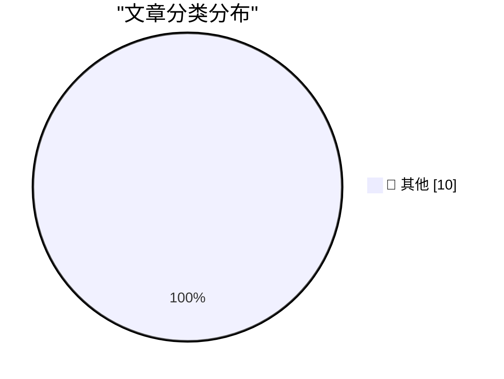

# 📰 AI 博客每日精选 — 2026-05-14

> 来自 Karpathy 推荐的 92 个顶级技术博客，AI 精选 Top 10

## 🏆 今日必读

🥇 **Commenting Guidelines**

[Commenting Guidelines](https://susam.net/commenting.html) — susam.net · 刚刚 · 📝 其他

> Commenting Guidelines When commenting on this website, please keep the following points in mind: You may include HTML or Markdown in your comment. Comments are converted to HTML and sanitised before t

🥈 **Software Engineers are Obsolete**

[Software Engineers are Obsolete](https://idiallo.com/blog/everyone-is-better-than-you?src=feed) — idiallo.com · 21 分钟前 · 📝 其他

> In my first interview for a developer position, I shared a link to my personal project with the interviewer. It was a website for learning how to program. I created it from the ground up. I built the 

🥉 **Quoting Boris Mann**

[Quoting Boris Mann](https://simonwillison.net/2026/May/13/boris-mann/#atom-everything) — simonwillison.net · 6 小时前 · 📝 其他

> Simon Willison’s Weblog Subscribe Sponsored by: WorkOS &mdash; Make your app Enterprise Ready with SSO, SCIM, RBAC, and more. 13th May 2026 “11 AI agents” is meaningless as a phrase. If I said “I have

---

## 📊 数据概览

| 扫描源 | 抓取文章 | 时间范围 | 精选 |
|:---:|:---:|:---:|:---:|
| 88/92 | 2529 篇 → 16 篇 | 24h | **10 篇** |

### 分类分布

---

## 📝 其他

### 1. Commenting Guidelines

[Commenting Guidelines](https://susam.net/commenting.html) — **susam.net** · 刚刚 · ⭐ 15/30

> Commenting Guidelines When commenting on this website, please keep the following points in mind: You may include HTML or Markdown in your comment. Comments are converted to HTML and sanitised before t

---

### 2. Software Engineers are Obsolete

[Software Engineers are Obsolete](https://idiallo.com/blog/everyone-is-better-than-you?src=feed) — **idiallo.com** · 21 分钟前 · ⭐ 15/30

> In my first interview for a developer position, I shared a link to my personal project with the interviewer. It was a website for learning how to program. I created it from the ground up. I built the 

---

### 3. Quoting Boris Mann

[Quoting Boris Mann](https://simonwillison.net/2026/May/13/boris-mann/#atom-everything) — **simonwillison.net** · 6 小时前 · ⭐ 15/30

> Simon Willison’s Weblog Subscribe Sponsored by: WorkOS &mdash; Make your app Enterprise Ready with SSO, SCIM, RBAC, and more. 13th May 2026 “11 AI agents” is meaningless as a phrase. If I said “I have

---

### 4. Points are a weird and inconsistent unit of measure

[Points are a weird and inconsistent unit of measure](https://buttondown.com/hillelwayne/archive/points-are-a-weird-and-inconsistent-unit-of/) — **buttondown.com/hillelwayne** · 7 小时前 · ⭐ 15/30

> May 13, 2026 Points are a weird and inconsistent unit of measure Where Webtech and LaTeX can't agree I'm in the middle of redoing the Logic for Programmers diagrams and this has surfaced a really anno

---

### 5. Pluralistic: Billionaire solipsism, dictator solipsism, AI, and the fascist paradigm (13 May 2026)

[Pluralistic: Billionaire solipsism, dictator solipsism, AI, and the fascist paradigm (13 May 2026)](https://pluralistic.net/2026/05/13/vibe-governance/) — **pluralistic.net** · 7 小时前 · ⭐ 15/30

> ->->->->->->->->->->->->->->->->->->->->->->->->->->->->-> Top Sources: None --> Today's links Billionaire solipsism, dictator solipsism, AI, and the fascist paradigm : AGI works best in a K-hole. Hey

---

### 6. The case of the hang when the user changed keyboard layouts

[The case of the hang when the user changed keyboard layouts](https://devblogs.microsoft.com/oldnewthing/20260513-00/?p=112318) — **devblogs.microsoft.com/oldnewthing** · 9 小时前 · ⭐ 15/30

> A customer reported that their program hung when the user changed keyboard layouts, say by using the Win + Space hotkey sequence. They debugged it as far as observing that the foreground window in the

---

### 7. Stupidly Simple SVG Sparklines

[Stupidly Simple SVG Sparklines](https://shkspr.mobi/blog/2026/05/stupidly-simple-svg-sparklines/) — **shkspr.mobi** · 11 小时前 · ⭐ 15/30

> Denilson That sounds overly complicated. How about something like this? Calculate the min and max values for both x and y (easy, just iterate over your input data). Usually, the minimum is zero. Set v

---

### 8. How Shark Tank’s Kevin O’Leary became rich

[How Shark Tank’s Kevin O’Leary became rich](https://dfarq.homeip.net/how-shark-tanks-kevin-oleary-became-rich/?utm_source=rss&#038;utm_medium=rss&#038;utm_campaign=how-shark-tanks-kevin-oleary-became-rich) — **dfarq.homeip.net** · 12 小时前 · ⭐ 15/30

> Kevin O’Leary, who calls himself Mr. Wonderful, is one of the most divisive stars of the reality TV series Shark Tank . Like Mark Cuban , O’Leary made much of his fortune in technology. But while Cuba

---

### 9. Showing Our Work

[Showing Our Work](https://nesbitt.io/2026/05/13/showing-our-work.html) — **nesbitt.io** · 13 小时前 · ⭐ 15/30

> A preprint went up on arXiv this week from Alexandros Tsakpinis, Emil Schwenger and Alexander Pretschner at fortiss and TU Munich: Modeling Dependency-Propagated Ecosystem Impact of Changes in Mainten

---

### 10. CSP Allow-list Experiment

[CSP Allow-list Experiment](https://simonwillison.net/2026/May/13/csp-allow/#atom-everything) — **simonwillison.net** · 18 小时前 · ⭐ 15/30

> Simon Willison’s Weblog Subscribe Sponsored by: WorkOS &mdash; Make your app Enterprise Ready with SSO, SCIM, RBAC, and more. 13th May 2026 Tool CSP Allow-list Experiment An experiment that shows that

---

*生成于 2026-05-14 07:01 | 扫描 88 源 → 获取 2529 篇 → 精选 10 篇*
*基于 [Hacker News Popularity Contest 2025](https://refactoringenglish.com/tools/hn-popularity/) RSS 源列表*
