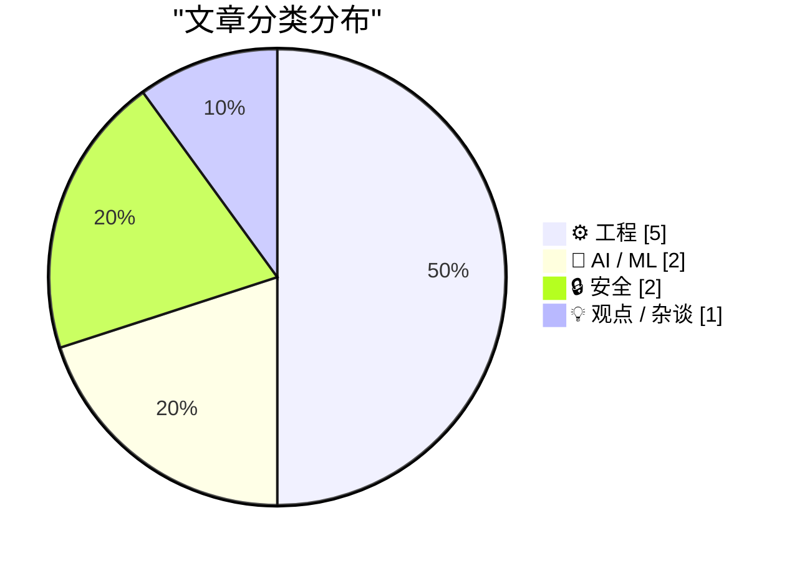
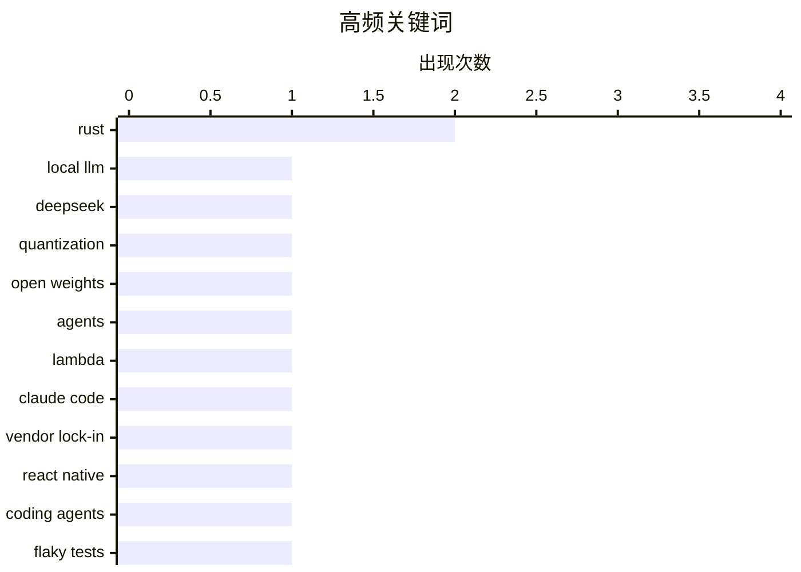

# 📰 AI 博客每日精选 — 2026-05-15

> 来自 Karpathy 推荐的 92 个顶级技术博客，AI 精选 Top 10

## 📝 今日看点

今天技术圈的主线很清晰：AI 正从“模型能力竞赛”转向“使用形态竞争”，一边是本地单模型体验迅速成熟，另一边是云端托管代理被视为下一代平台入口。与此同时，工程实践也在朝更强可迁移性与更高运行可靠性演进——语言和框架的锁定效应在减弱，团队开始把注意力更多放在 flaky 测试治理、依赖度量失真和基础工具效率这类“系统健康”问题上。另一条值得注意的信号是，技术治理与安全边界持续强化，从政府级数据泄露监测到爬虫遵守 robots.txt，再到欧洲推动更自主的技术生态，行业正在重新定义“可控”和“可信”的底线。

---

## 🏆 今日必读

🥇 **关于 DS4 的一些想法**

[A few words on DS4](http://antirez.com/news/165) — antirez.com · 46 分钟前 · 🤖 AI / ML

> DS4 的快速走红反映出，人们确实需要一种围绕单一模型集成、面向本地运行的 AI 使用体验。它抓住了几个同时成熟的条件：DeepSeek v4 Flash 这类接近前沿、同时足够大且足够快的模型出现，配合 2/8 bit 的高度非对称量化方案后，只需 96GB 或 128GB 内存就能运行；近几年本地 AI 社区积累的经验，也因为 GPT 5.5 的辅助而更快落地。作者认为 DS4 不会绑定在 DeepSeek v4 Flash 这一版模型上，而会持续切换到在高端 Mac 或 DGX Spark 这类“盒装 GPU”设备上实际速度最优的开放权重模型，并期待后续 checkpoint、面向编程的调优版本，以及 legal、medical 等专用变体。作者表示，这是自己第一次把本地模型真正用于原本会交给 Claude 或 GPT 的严肃任务，也是第一次借助 vector steering 获得更自由的使用体验；在他看来，DS4 的体验明显更接近在线前沿模型，而不是传统“小而好”的本地模型。接下来项目将重点推进质量基准测试、可能加入 coding agent、建立可跑 CI 的家庭硬件环境、扩展更多移植版本，以及串行和并行两类分布式推理，因为 AI 不应只是被当作一种托管服务来提供。

💡 **为什么值得读**: 它提供了一线开发者对本地大模型拐点的直接判断：哪些模型、量化方式和硬件组合，正在让“本地可用”第一次接近在线前沿体验。

🏷️ local LLM, DeepSeek, quantization, open weights

🥈 **托管代理将成为新的 Lambda**

[Managed agents are the new Lambda](https://martinalderson.com/posts/managed-agents-are-the-new-lambda/?utm_source=rss&amp;utm_medium=rss&amp;utm_campaign=feed) — martinalderson.com · 23 小时前 · 🤖 AI / ML

> 云托管代理被视为前沿实验室的下一波重点方向，本质上是把 Claude Code 这类 agent harness 放到云端运行，而不是运行在本地机器上。这样做的优势包括可 24/7 后台执行、能更容易响应邮件或 webhook 等外部事件，以及由提供商负责底层基础设施、操作系统补丁和相关服务管理，并通过沙箱限制代理只访问被授权的资源。作者认为，Claude Code、Codex、OpenCode、Pi 等代理框架在基本模式上相似，都是用提示词、上下文和工具运行代理并收集输出与日志，因此本来并不难替换，保留更换模型和代理框架的能力也很重要。问题在于，一旦采用前沿实验室提供的托管代理产品，数据和工作流会逐渐嵌入对方云环境，迁移难度会显著上升。作者将这种风险类比为 AWS Lambda：迁移 Docker 工作负载相对容易，但迁移 deeply integrated 的 Lambda 函数往往需要耗费数月拆解代码和隐含假设。

💡 **为什么值得读**: 值得读在于它没有停留在“托管代理很强大”的表面，而是提前点出了这类产品最容易被忽视的长期迁移成本和供应商锁定风险。

🏷️ agents, Lambda, Claude Code, vendor lock-in

🥉 **没那么被锁定了**

[Not so locked in any more](https://simonwillison.net/2026/May/14/not-so-locked-in/#atom-everything) — simonwillison.net · 15 分钟前 · ⚙️ 工程

> 文章围绕“技术选型是否仍然意味着强锁定”这个问题展开，讨论编程语言和应用框架的可迁移性正在发生变化。作者由 Bun 从 Zig 迁移到 Rust 的话题联想到一次会议交流：一家中型科技公司刚刚在 coding agent 驱动下，把一对历史悠久的 iPhone 和 Android 应用重写为 React Native。对方给出的理由是，React Native 这几年已经成熟很多，足以覆盖他们应用所需的全部能力。更重要的是，他们认为即便这个决定后来被证明不合适，未来也可以再迁回原生应用。作者的结论是，正如 Mitchell Hashimoto 所说，编程语言过去常常意味着锁定，但这种锁定正在减弱。

💡 **为什么值得读**: 值得读，因为它用 Bun、Rust、Zig 与 React Native 的真实案例，简洁点出了 AI 编码代理可能如何改变“技术选型一旦做错就难以回头”的传统判断。

🏷️ React Native, Rust, coding agents

---

## 📊 数据概览

| 扫描源 | 抓取文章 | 时间范围 | 精选 |
|:---:|:---:|:---:|:---:|
| 85/92 | 2490 篇 → 26 篇 | 24h | **10 篇** |

### 分类分布



### 高频关键词



<details>
<summary>📈 纯文本关键词图（终端友好）</summary>

```
rust           │ ████████████████████ 2
local llm      │ ██████████░░░░░░░░░░ 1
deepseek       │ ██████████░░░░░░░░░░ 1
quantization   │ ██████████░░░░░░░░░░ 1
open weights   │ ██████████░░░░░░░░░░ 1
agents         │ ██████████░░░░░░░░░░ 1
lambda         │ ██████████░░░░░░░░░░ 1
claude code    │ ██████████░░░░░░░░░░ 1
vendor lock-in │ ██████████░░░░░░░░░░ 1
react native   │ ██████████░░░░░░░░░░ 1
```

</details>

### 🏷️ 话题标签

**rust**(2) · **local llm**(1) · **deepseek**(1) · quantization(1) · open weights(1) · agents(1) · lambda(1) · claude code(1) · vendor lock-in(1) · react native(1) · coding agents(1) · flaky tests(1) · ci(1) · merge queue(1) · testing(1) · eu(1) · tech sovereignty(1) · democracy(1) · big tech(1) · pagerank(1)

---

## ⚙️ 工程

### 1. 没那么被锁定了

[Not so locked in any more](https://simonwillison.net/2026/May/14/not-so-locked-in/#atom-everything) — **simonwillison.net** · 15 分钟前 · ⭐ 24/30

> 文章围绕“技术选型是否仍然意味着强锁定”这个问题展开，讨论编程语言和应用框架的可迁移性正在发生变化。作者由 Bun 从 Zig 迁移到 Rust 的话题联想到一次会议交流：一家中型科技公司刚刚在 coding agent 驱动下，把一对历史悠久的 iPhone 和 Android 应用重写为 React Native。对方给出的理由是，React Native 这几年已经成熟很多，足以覆盖他们应用所需的全部能力。更重要的是，他们认为即便这个决定后来被证明不合适，未来也可以再迁回原生应用。作者的结论是，正如 Mitchell Hashimoto 所说，编程语言过去常常意味着锁定，但这种锁定正在减弱。

🏷️ React Native, Rust, coding agents

---

### 2. 在主分支上捕获 flaky 测试

[Catch Flakes On Main](https://matklad.github.io/2026/05/14/catch-flakes-on-main.html) — **matklad.github.io** · 23 小时前 · ⭐ 23/30

> 重点是如何更高效地识别并清除 CI 中偶发失败的 flaky 测试。文章建议即使已经采用 merge queue 这类“并不复杂”的规则，仍然要在 main 分支上重复运行完整测试套件，并维护一份最近 main 失败记录的易访问列表。flaky 测试可能来自真实缺陷，例如对调度的假设只在大多数情况下成立，也可能来自底层基础设施不稳定，例如无法从 GitHub 下载发布文件或无法在 Windows 上删除文件夹。作者认为 merge queue 的关键价值在于：如果能够保证进入 main 的每个提交都通过测试，那么 main 上出现的任何失败按定义都是 flaky；把这些失败集中到同一份列表里，还能压缩排查时间、优先处理影响最大的失稳来源，并发现失败之间的相关性。

🏷️ flaky tests, CI, merge queue, testing

---

### 3. 中心性不等于活力

[Centrality is not vitality](https://nesbitt.io/2026/05/14/centrality-is-not-vitality.html) — **nesbitt.io** · 13 小时前 · ⭐ 22/30

> 围绕包依赖图来衡量“关键性”“重要性”或“中心性”时，PageRank 经常被默认采用，但它在这一场景里的含义值得怀疑。PageRank 原本针对的是“链接代表推荐、用户沿链接跳转”的网页图，而依赖图中的边只表示某个消费方需要目标包提供的内容，并不包含审阅、认可或知情等信息。依赖关系里的很多传递依赖甚至可能在消费项目中从未被注意到，解析过程也不是沿图漫步，而是通过约束求解一次性选出一组包，因此用于网页的随机跳转和阻尼因子在 npm install 或 cargo build 中都没有对应物。依赖图在解析方向上又大多是有向无环的，使得 PageRank 依赖的稳定分布直觉并不真正适用。结论上，PageRank 虽然能算出一个单调、可定义的数值，但它在依赖图里未必是在衡量真正有意义的“重要性”。

🏷️ PageRank, dependency graph, open source, metrics

---

### 4. 一种用常量空间和线性时间删除目录中除最近 10 个文件外其余文件的算法

[A constant-space linear-time algorithm for deleting all but the 10 most recent files in a directory](https://devblogs.microsoft.com/oldnewthing/20260514-00/?p=112322) — **devblogs.microsoft.com/oldnewthing** · 9 小时前 · ⭐ 20/30

> 问题在于 Windows 的 FindFirstFile 无法按日期顺序枚举目录中文件，因此不能直接按“最近修改时间”保留最新的 10 个文件。相比先读入全部文件再排序的朴素做法（O(n) 空间、O(n log n) 时间），这里采用按修改时间排序的最小优先队列，在遍历过程中始终只保留最新的 10 个文件。每读到一个非目录文件就压入优先队列；当队列大小超过 10 时，立即删除队首中最早的那个文件并将其弹出。由于优先队列容量被固定为 10，单次操作可视为常量时间，整体遍历因此达到 O(n) 时间和常量空间。文中还给出了基于 std::priority_queue、CompareFileTime、FindFirstFileW/FindNextFileW 和 DeleteFileW 的 C++ 示例，并指出 std::priority_queue 在比较器推导和底层 vector 预留容量方面使用上不够方便。

🏷️ algorithm, priority queue, filesystem, Windows

---

### 5. 引用 Mitchell Hashimoto 的话

[Quoting Mitchell Hashimoto](https://simonwillison.net/2026/May/14/mitchell-hashimoto/#atom-everything) — **simonwillison.net** · 38 分钟前 · ⭐ 19/30

> 编程语言如今正变得更具可替代性，不再像过去那样构成强锁定。Mitchell Hashimoto 以 Bun 从 Zig 迁移到 Rust 为例，认为这并不意味着 Rust 获得了稳固优势。相反，这次迁移显示 Bun 大概可以在一两周内切换到几乎任何他们想用的语言。按照这一判断，Rust 也是可被替换的：在有用时使用，不再合适时就可以被丢弃。作者摘录这段话，突出了当代语言选择日益“可流动”的趋势。

🏷️ Rust, Zig, fungibility

---

## 🤖 AI / ML

### 6. 关于 DS4 的一些想法

[A few words on DS4](http://antirez.com/news/165) — **antirez.com** · 46 分钟前 · ⭐ 25/30

> DS4 的快速走红反映出，人们确实需要一种围绕单一模型集成、面向本地运行的 AI 使用体验。它抓住了几个同时成熟的条件：DeepSeek v4 Flash 这类接近前沿、同时足够大且足够快的模型出现，配合 2/8 bit 的高度非对称量化方案后，只需 96GB 或 128GB 内存就能运行；近几年本地 AI 社区积累的经验，也因为 GPT 5.5 的辅助而更快落地。作者认为 DS4 不会绑定在 DeepSeek v4 Flash 这一版模型上，而会持续切换到在高端 Mac 或 DGX Spark 这类“盒装 GPU”设备上实际速度最优的开放权重模型，并期待后续 checkpoint、面向编程的调优版本，以及 legal、medical 等专用变体。作者表示，这是自己第一次把本地模型真正用于原本会交给 Claude 或 GPT 的严肃任务，也是第一次借助 vector steering 获得更自由的使用体验；在他看来，DS4 的体验明显更接近在线前沿模型，而不是传统“小而好”的本地模型。接下来项目将重点推进质量基准测试、可能加入 coding agent、建立可跑 CI 的家庭硬件环境、扩展更多移植版本，以及串行和并行两类分布式推理，因为 AI 不应只是被当作一种托管服务来提供。

🏷️ local LLM, DeepSeek, quantization, open weights

---

### 7. 托管代理将成为新的 Lambda

[Managed agents are the new Lambda](https://martinalderson.com/posts/managed-agents-are-the-new-lambda/?utm_source=rss&amp;utm_medium=rss&amp;utm_campaign=feed) — **martinalderson.com** · 23 小时前 · ⭐ 25/30

> 云托管代理被视为前沿实验室的下一波重点方向，本质上是把 Claude Code 这类 agent harness 放到云端运行，而不是运行在本地机器上。这样做的优势包括可 24/7 后台执行、能更容易响应邮件或 webhook 等外部事件，以及由提供商负责底层基础设施、操作系统补丁和相关服务管理，并通过沙箱限制代理只访问被授权的资源。作者认为，Claude Code、Codex、OpenCode、Pi 等代理框架在基本模式上相似，都是用提示词、上下文和工具运行代理并收集输出与日志，因此本来并不难替换，保留更换模型和代理框架的能力也很重要。问题在于，一旦采用前沿实验室提供的托管代理产品，数据和工作流会逐渐嵌入对方云环境，迁移难度会显著上升。作者将这种风险类比为 AWS Lambda：迁移 Docker 工作负载相对容易，但迁移 deeply integrated 的 Lambda 函数往往需要耗费数月拆解代码和隐含假设。

🏷️ agents, Lambda, Claude Code, vendor lock-in

---

## 🔒 安全

### 8. 欢迎巴哈马政府加入 Have I Been Pwned

[Welcoming the Bahamian Government to Have I Been Pwned](https://www.troyhunt.com/welcoming-the-bahamian-government-to-have-i-been-pwned/) — **troyhunt.com** · 19 小时前 · ⭐ 22/30

> 巴哈马成为 Have I Been Pwned 免费政府服务接入的第 44 个政府。巴哈马国家计算机事件响应团队 CIRT-BS 现在可以使用 HIBP 监控政府域名是否出现在相关数据中。作为国家级 CIRT，CIRT-BS 负责协调相关安全工作。这个接入把政府域名监测能力直接纳入了 HIBP 的服务范围。

🏷️ Have I Been Pwned, government, breach, CIRT

---

### 9. Amazonbot 终于开始遵守 robots.txt 了

[Amazonbot is finally respecting robots.txt](https://xeiaso.net/notes/2026/amazonbot-respecting-robots-txt/) — **xeiaso.net** · 23 小时前 · ⭐ 20/30

> Amazon 通知站长，自 2026 年 6 月 15 日起，Amazonbot 的抓取偏好将仅通过行业标准的 robots.txt 指令管理，不再依赖手动申请。站点可以按页面、目录或全站级别控制 Amazonbot 的访问，并可随时更新规则；如果届时没有配置 robots.txt，Amazonbot 将按标准网页爬取方式访问站点。作者直接引用了 Amazon Publisher Support 的邮件内容，并注意到邮件里还保留了“Get Outlook for Mac”签名，邮件头中也有多个 Exchange 相关字段。作者认为这一变化很重要，因为 Amazon 的抓取器正是促使 Anubis 出现的原因，并表示会确认把相关 robots.txt 变更合并进 Anubis。

🏷️ robots.txt, Amazonbot, web crawling, scraping

---

## 💡 观点 / 杂谈

### 10. 首届民主科技联盟大会

[The First Democratic Tech Alliance Assembly](https://berthub.eu/articles/posts/democratic-tech-alliance-may-2026/) — **berthub.eu** · 8 小时前 · ⭐ 22/30

> 首届民主科技联盟（DTA）在欧洲议会举行，议题聚焦于建设支持民主价值与公共利益的欧盟技术生态，并回应“依赖他人技术将削弱民主与法治”的风险。联盟成员覆盖欧洲议会中的绿党/欧洲自由联盟、复兴欧洲党团、欧洲人民党、社会党与民主党进步联盟，也吸纳公民社会和产业界参与，强调只有广泛联盟才可能抗衡大型科技公司的游说力量。文中指出，欧洲大量新闻与宣传传播依赖美国控制的平台，而美国已表态希望利用其技术影响力塑造欧洲政策，这使相关工作具有紧迫性；DTA 共同发起人 Axel Voss 认为可采取行动的时间窗口只有 2 到 3 年。大会公开环节包含两场讨论，其中欧盟联合研究中心（JRC）展示了对“数字主权”的初步分析；这个近 3000 人的机构被视为欧洲协作能力的代表，因为单个成员国难以独自汇聚如此规模和广度的研究能力。JRC 的分析特别强调“人”处于数字主权框架的核心位置，这被作者视为值得重视的方向。

🏷️ EU, tech sovereignty, democracy, big tech

---

*生成于 2026-05-15 07:09 | 扫描 85 源 → 获取 2490 篇 → 精选 10 篇*
*基于 [Hacker News Popularity Contest 2025](https://refactoringenglish.com/tools/hn-popularity/) RSS 源列表*
