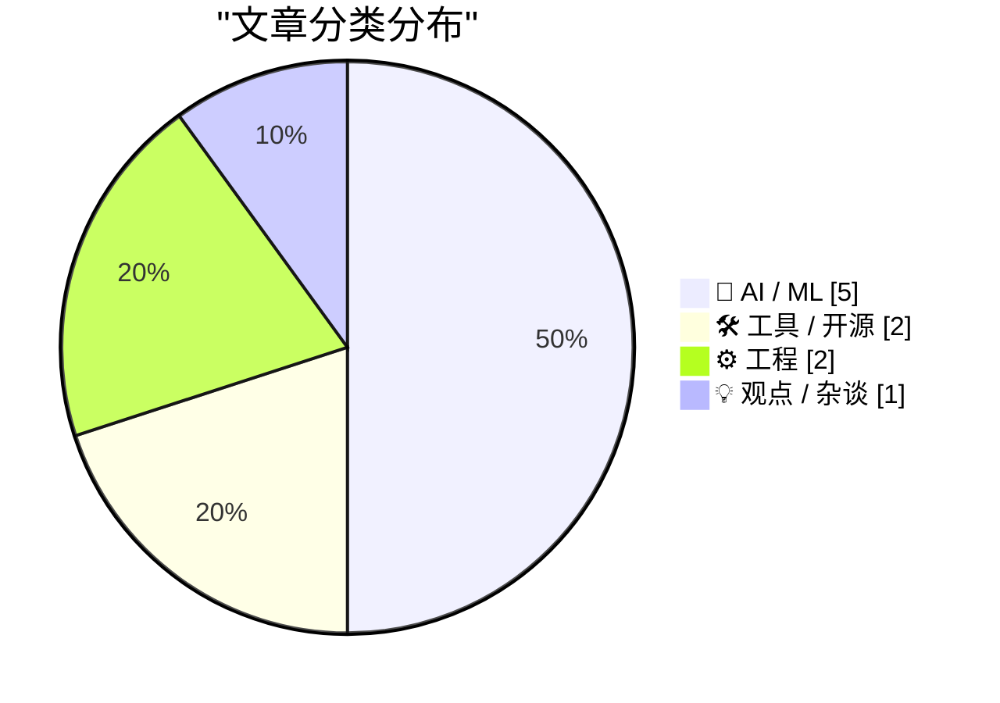
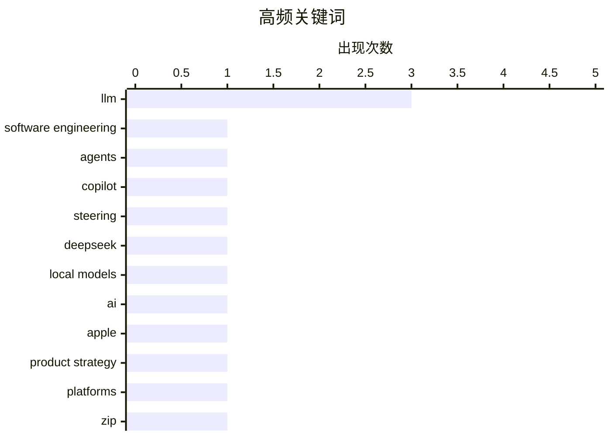

# 📰 AI 博客每日精选 — 2026-05-17

> 来自 Karpathy 推荐的 92 个顶级技术博客，AI 精选 Top 10

## 🏆 今日必读

🥇 **How I use LLMs as a staff engineer in 2026**

[How I use LLMs as a staff engineer in 2026](https://seangoedecke.com/how-i-use-llms-in-2026/) — seangoedecke.com · 刚刚 · 🤖 AI / ML

> How I use LLMs as a staff engineer in 2026 A bit over a year ago I wrote How I use LLMs as a staff engineer . Here’s a brief summary of what I used AI for last year: Smart autocomplete with Copilot Sh

🏷️ LLM, software engineering, agents, Copilot

🥈 **DeepSeek-V4-Flash means LLM steering is interesting again**

[DeepSeek-V4-Flash means LLM steering is interesting again](https://seangoedecke.com/steering-vectors/) — seangoedecke.com · 23 小时前 · 🤖 AI / ML

> DeepSeek-V4-Flash means LLM steering is interesting again Ever since Golden Gate Claude I’ve been fascinated with “steering”: the idea that you can guide LLM outputs by directly manipulating the activ

🏷️ LLM, steering, DeepSeek, local models

🥉 **★ AI Is Technology, Not a Product**

[★ AI Is Technology, Not a Product](https://daringfireball.net/2026/05/ai_is_technology_not_a_product) — daringfireball.net · 2 小时前 · 💡 观点 / 杂谈

> By John Gruber Archive The Talk Show Dithering Projects Contact Colophon Feeds / Social Twitter --> Sponsorship Manage GRC Faster with Drata’s Agentic Trust Management Platform AI Is Technology, Not a

🏷️ AI, Apple, product strategy, platforms

---

## 📊 数据概览

| 扫描源 | 抓取文章 | 时间范围 | 精选 |
|:---:|:---:|:---:|:---:|
| 87/92 | 2512 篇 → 20 篇 | 24h | **10 篇** |

### 分类分布



### 高频关键词



<details>
<summary>📈 纯文本关键词图（终端友好）</summary>

```
llm                  │ ████████████████████ 3
software engineering │ ███████░░░░░░░░░░░░░ 1
agents               │ ███████░░░░░░░░░░░░░ 1
copilot              │ ███████░░░░░░░░░░░░░ 1
steering             │ ███████░░░░░░░░░░░░░ 1
deepseek             │ ███████░░░░░░░░░░░░░ 1
local models         │ ███████░░░░░░░░░░░░░ 1
ai                   │ ███████░░░░░░░░░░░░░ 1
apple                │ ███████░░░░░░░░░░░░░ 1
product strategy     │ ███████░░░░░░░░░░░░░ 1
```

</details>

### 🏷️ 话题标签

**llm**(3) · **software engineering**(1) · **agents**(1) · copilot(1) · steering(1) · deepseek(1) · local models(1) · ai(1) · apple(1) · product strategy(1) · platforms(1) · zip(1) · compression(1) · webassembly(1) · libdeflate(1) · intelligence(1) · power(1) · asi(1) · ai alignment(1) · pretraining(1)

---

## 🤖 AI / ML

### 1. How I use LLMs as a staff engineer in 2026

[How I use LLMs as a staff engineer in 2026](https://seangoedecke.com/how-i-use-llms-in-2026/) — **seangoedecke.com** · 刚刚 · ⭐ 26/30

> How I use LLMs as a staff engineer in 2026 A bit over a year ago I wrote How I use LLMs as a staff engineer . Here’s a brief summary of what I used AI for last year: Smart autocomplete with Copilot Sh

🏷️ LLM, software engineering, agents, Copilot

---

### 2. DeepSeek-V4-Flash means LLM steering is interesting again

[DeepSeek-V4-Flash means LLM steering is interesting again](https://seangoedecke.com/steering-vectors/) — **seangoedecke.com** · 23 小时前 · ⭐ 25/30

> DeepSeek-V4-Flash means LLM steering is interesting again Ever since Golden Gate Claude I’ve been fascinated with “steering”: the idea that you can guide LLM outputs by directly manipulating the activ

🏷️ LLM, steering, DeepSeek, local models

---

### 3. The mistake of conflating intelligence and power

[The mistake of conflating intelligence and power](https://www.dwarkesh.com/p/the-mistake-of-conflating-intelligence) — **dwarkesh.com** · 4 小时前 · ⭐ 22/30

> Blog The mistake of conflating intelligence and power If this is your definition of intelligence is "the ability to achieve your goals across a wide variety of domains", then Stalin was the most intel

🏷️ intelligence, power, ASI, AI alignment

---

### 4. Notes on pretraining parallelisms and failed training runs.

[Notes on pretraining parallelisms and failed training runs.](https://www.dwarkesh.com/p/notes-on-pretraining-parallelisms) — **dwarkesh.com** · 4 小时前 · ⭐ 22/30

> Blog Notes on pretraining parallelisms and failed training runs. Dwarkesh Patel May 16, 2026 3 2 Share Wrote up some flashcards here to help myself retain all the stuff below . On why pretraining runs

🏷️ pretraining, MoE, causality, training failures

---

### 5. ArXiv to Ban Researchers for a Year if They Submit AI Slop

[ArXiv to Ban Researchers for a Year if They Submit AI Slop](https://www.404media.co/new-arxiv-rules-ai-generated-papers-ban/) — **daringfireball.net** · 3 小时前 · ⭐ 22/30

> Advertisement &bull; Go ad free AI ArXiv to Ban Researchers for a Year if They Submit AI Slop Samantha Cole · May 15, 2026 at 11:52 AM The change comes as arXiv and others struggle to manage an influx

🏷️ arXiv, AI slop, research integrity, LLM

---

## 🛠 工具 / 开源

### 6. Make ZIP files smaller with ZIP Shrinker

[Make ZIP files smaller with ZIP Shrinker](https://evanhahn.com/make-zip-files-smaller-with-zip-shrinker/) — **evanhahn.com** · 23 小时前 · ⭐ 23/30

> Make ZIP files smaller with ZIP Shrinker by Evan Hahn , posted May 16, 2026 , tagged #compression #tool #release I built ZIP Shrinker, a little browser tool to shrink ZIP files. It also works with for

🏷️ ZIP, compression, WebAssembly, libdeflate

---

### 7. inaturalist-clumper 0.1

[inaturalist-clumper 0.1](https://simonwillison.net/2026/May/15/inaturalist-clumper/#atom-everything) — **simonwillison.net** · 23 小时前 · ⭐ 16/30

> Simon Willison’s Weblog Subscribe Sponsored by: Datadog &mdash; Ship reliable AI faster with LLM Observability. Read the best practices guide 15th May 2026 Release inaturalist-clumper 0.1 &mdash; Grou

🏷️ iNaturalist, JSON, data processing, release

---

## ⚙️ 工程

### 8. SQLAlchemy 2 In Practice - Chapter 8: SQLAlchemy and the Web

[SQLAlchemy 2 In Practice - Chapter 8: SQLAlchemy and the Web](https://blog.miguelgrinberg.com/post/sqlalchemy-2-in-practice---chapter-8-sqlalchemy-and-the-web) — **miguelgrinberg.com** · 9 小时前 · ⭐ 20/30

> This is the eighth and final chapter of my SQLAlchemy 2 in Practice book. If you'd like to support my work, I encourage you to buy this book, either directly from my store or on Amazon . Thank you! Wh

🏷️ SQLAlchemy, Python, Flask, FastAPI

---

### 9. A nicer voltmeter clock

[A nicer voltmeter clock](https://lcamtuf.substack.com/p/a-nicer-voltmeter-clock) — **lcamtuf.substack.com** · 24 分钟前 · ⭐ 18/30

> A nicer voltmeter clock Sometimes, electronic circuit design is mostly about wood May 16, 2026 3 Share Back in 2019, I built a simple voltmeter clock: The clock, version 1. As the name implies, these 

🏷️ electronics, clock, hardware, DIY

---

## 💡 观点 / 杂谈

### 10. ★ AI Is Technology, Not a Product

[★ AI Is Technology, Not a Product](https://daringfireball.net/2026/05/ai_is_technology_not_a_product) — **daringfireball.net** · 2 小时前 · ⭐ 24/30

> By John Gruber Archive The Talk Show Dithering Projects Contact Colophon Feeds / Social Twitter --> Sponsorship Manage GRC Faster with Drata’s Agentic Trust Management Platform AI Is Technology, Not a

🏷️ AI, Apple, product strategy, platforms

---

*生成于 2026-05-17 07:06 | 扫描 87 源 → 获取 2512 篇 → 精选 10 篇*
*基于 [Hacker News Popularity Contest 2025](https://refactoringenglish.com/tools/hn-popularity/) RSS 源列表*
