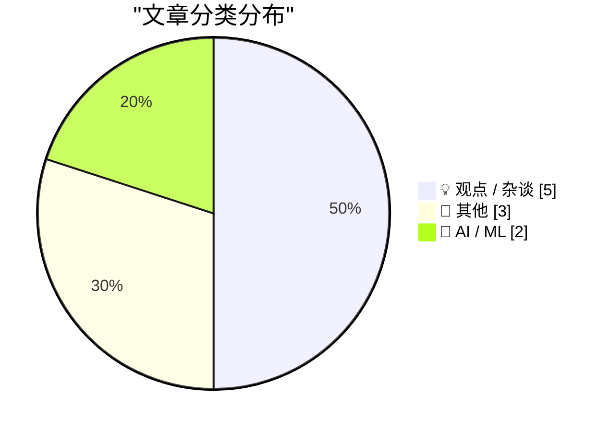
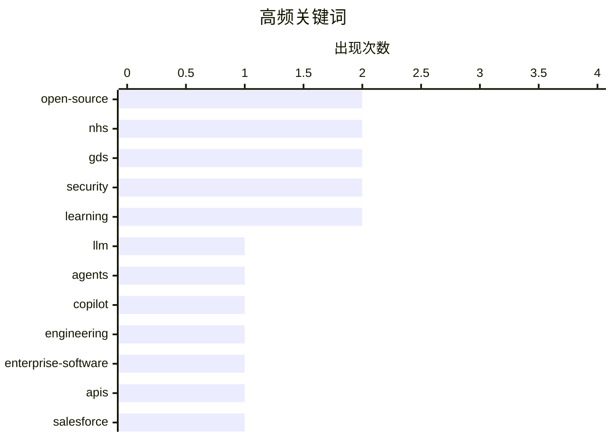

# 📰 AI 博客每日精选 — 2026-05-18

> 来自 Karpathy 推荐的 92 个顶级技术博客，AI 精选 Top 10

## 🏆 今日必读

🥇 **How I use LLMs as a staff engineer in 2026**

[How I use LLMs as a staff engineer in 2026](https://seangoedecke.com/how-i-use-llms-in-2026/) — seangoedecke.com · 23 小时前 · 🤖 AI / ML

> How I use LLMs as a staff engineer in 2026 A bit over a year ago I wrote How I use LLMs as a staff engineer . Here’s a brief summary of what I used AI for last year: Smart autocomplete with Copilot Sh

🏷️ LLM, agents, Copilot, engineering

🥈 **GDS weighs in on the NHS's decision to retreat from Open Source**

[GDS weighs in on the NHS's decision to retreat from Open Source](https://shkspr.mobi/blog/2026/05/gds-weighs-in-on-the-nhss-decision-to-retreat-from-open-source/) — shkspr.mobi · 11 小时前 · 💡 观点 / 杂谈

> GDS weighs in on the NHS's decision to retreat from Open Source AI gds government nhs nhsx Open Source · 5 comments · 900 words · Viewed ~1,660 times Within the UK's Civil Service you occasionally hea

🏷️ open-source, NHS, GDS, security

🥉 **Here Comes (Forward Deployed) Everybody**

[Here Comes (Forward Deployed) Everybody](https://worksonmymachine.ai/p/here-comes-forward-deployed-everybody) — worksonmymachine.substack.com · 9 小时前 · 💡 观点 / 杂谈

> Here Comes (Forward Deployed) Everybody Scott Werner May 17, 2026 17 7 Share Note: I just enabled paid subscriptions for $8/month. Most of these essays will still be free, but I’m working on adding pr

🏷️ enterprise-software, APIs, Salesforce, automation

---

## 📊 数据概览

| 扫描源 | 抓取文章 | 时间范围 | 精选 |
|:---:|:---:|:---:|:---:|
| 88/92 | 2532 篇 → 10 篇 | 24h | **10 篇** |

### 分类分布



### 高频关键词



<details>
<summary>📈 纯文本关键词图（终端友好）</summary>

```
open-source         │ ████████████████████ 2
nhs                 │ ████████████████████ 2
gds                 │ ████████████████████ 2
security            │ ████████████████████ 2
learning            │ ████████████████████ 2
llm                 │ ██████████░░░░░░░░░░ 1
agents              │ ██████████░░░░░░░░░░ 1
copilot             │ ██████████░░░░░░░░░░ 1
engineering         │ ██████████░░░░░░░░░░ 1
enterprise-software │ ██████████░░░░░░░░░░ 1
```

</details>

### 🏷️ 话题标签

**open-source**(2) · **nhs**(2) · **gds**(2) · security(2) · learning(2) · llm(1) · agents(1) · copilot(1) · engineering(1) · enterprise-software(1) · apis(1) · salesforce(1) · automation(1) · generative-ai(1) · neurosymbolic(1) · world-models(1) · scaling(1) · spaced-repetition(1) · memory(1) · education(1)

---

## 💡 观点 / 杂谈

### 1. GDS weighs in on the NHS's decision to retreat from Open Source

[GDS weighs in on the NHS's decision to retreat from Open Source](https://shkspr.mobi/blog/2026/05/gds-weighs-in-on-the-nhss-decision-to-retreat-from-open-source/) — **shkspr.mobi** · 11 小时前 · ⭐ 23/30

> GDS weighs in on the NHS's decision to retreat from Open Source AI gds government nhs nhsx Open Source · 5 comments · 900 words · Viewed ~1,660 times Within the UK's Civil Service you occasionally hea

🏷️ open-source, NHS, GDS, security

---

### 2. Here Comes (Forward Deployed) Everybody

[Here Comes (Forward Deployed) Everybody](https://worksonmymachine.ai/p/here-comes-forward-deployed-everybody) — **worksonmymachine.substack.com** · 9 小时前 · ⭐ 21/30

> Here Comes (Forward Deployed) Everybody Scott Werner May 17, 2026 17 7 Share Note: I just enabled paid subscriptions for $8/month. Most of these essays will still be free, but I’m working on adding pr

🏷️ enterprise-software, APIs, Salesforce, automation

---

### 3. The Applicability of Spaced Repetition

[The Applicability of Spaced Repetition](https://borretti.me/article/the-applicability-of-spaced-repetition) — **borretti.me** · 23 小时前 · ⭐ 17/30

> The Applicability of Spaced Repetition Spaced repetition has a natural domain of applicability: information that is systematically organized as an unambiguous key-value mapping with short keys and val

🏷️ spaced-repetition, learning, memory, education

---

### 4. GDS weighs in on the NHS's decision to retreat from Open Source

[GDS weighs in on the NHS's decision to retreat from Open Source](https://simonwillison.net/2026/May/17/gds-weighs-in/#atom-everything) — **simonwillison.net** · 7 小时前 · ⭐ 15/30

> GDS weighs in on the NHS's decision to retreat from Open Source . Terence Eden continues his coverage of the NHS' poorly considered decision to close down access to their open source repositories in r

🏷️ open-source, NHS, GDS, public-sector

---

### 5. How to be inspired without copying

[How to be inspired without copying](https://www.joanwestenberg.com/how-to-be-inspired-without-copying/) — **joanwestenberg.com** · 30 分钟前 · ⭐ 14/30

> 2026-05-17 // 7 min read How to be inspired without copying AUTHOR // JA Westenberg ACCESS // true In 1713, Johann Sebastian Bach sat down at his desk in Weimar and began copying out concertos by Anto

🏷️ creativity, learning, writing, imitation

---

## 📝 其他

### 6. The Tomy Tutor and the state of 1983 home computers

[The Tomy Tutor and the state of 1983 home computers](https://oldvcr.blogspot.com/feeds/7725068542078818117/comments/default) — **oldvcr.blogspot.com** · 21 小时前 · ⭐ 10/30

> The Tomy Tutor was my first computer, in late 1983. I was seven and we got it at Federated . I've acquired several more since then, but this is the actual one I used and it still works perfectly. Usin

🏷️ retrocomputing, home-computers, 1980s, Tomy-Tutor

---

### 7. In the Empire's Defense

[In the Empire's Defense](https://idiallo.com/blog/the-empire-won?src=feed) — **idiallo.com** · 11 小时前 · ⭐ 8/30

> I didn't watch Star Wars when it was released. I wasn't even born. By the time we popped the cassette tape in the VCR, it was at least 15 years old. But I liked the movie all the same. It was not my f

🏷️ Star-Wars, politics, culture, essay

---

### 8. Drata

[Drata](https://drata.com/daring) — **daringfireball.net** · 5 小时前 · ⭐ 3/30

> 900+ Drata + Daring Fireball 4.9 ( reviews) Automate Evidence Collection. Collect documentation from your tech stack. 300+ integrations and an open API. Frameworks. Automate compliance for 25+ framewo

🏷️ compliance, SOC2, security, SaaS

---

## 🤖 AI / ML

### 9. How I use LLMs as a staff engineer in 2026

[How I use LLMs as a staff engineer in 2026](https://seangoedecke.com/how-i-use-llms-in-2026/) — **seangoedecke.com** · 23 小时前 · ⭐ 25/30

> How I use LLMs as a staff engineer in 2026 A bit over a year ago I wrote How I use LLMs as a staff engineer . Here’s a brief summary of what I used AI for last year: Smart autocomplete with Copilot Sh

🏷️ LLM, agents, Copilot, engineering

---

### 10. The illusion of Generative AI, the insanity of massive bets on hyperscaling, and the case for world models and neurosymbolic AI

[The illusion of Generative AI, the insanity of massive bets on hyperscaling, and the case for world models and neurosymbolic AI](https://garymarcus.substack.com/p/the-illusion-of-generative-ai-the) — **garymarcus.substack.com** · 15 小时前 · ⭐ 17/30

> The illusion of Generative AI, the insanity of massive bets on hyperscaling, and the case for world models and neurosymbolic AI Three excellent new interviews Gary Marcus May 17, 2026 117 37 20 Share 

🏷️ Generative-AI, neurosymbolic, world-models, scaling

---

*生成于 2026-05-18 07:04 | 扫描 88 源 → 获取 2532 篇 → 精选 10 篇*
*基于 [Hacker News Popularity Contest 2025](https://refactoringenglish.com/tools/hn-popularity/) RSS 源列表*
