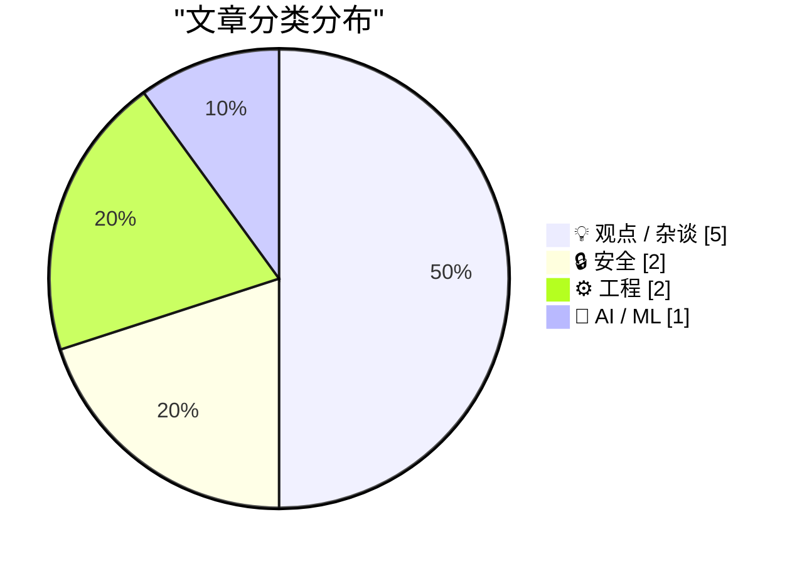
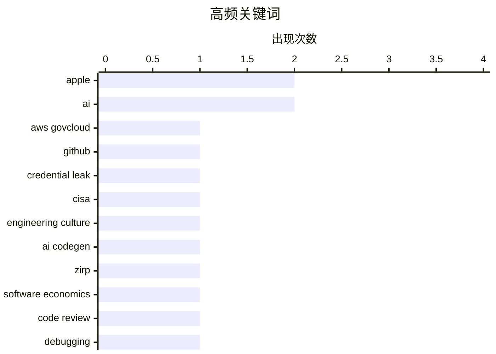

# 📰 AI 博客每日精选 — 2026-05-19

> 来自 Karpathy 推荐的 92 个顶级技术博客，AI 精选 Top 10

## 🏆 今日必读

🥇 **CISA Admin Leaked AWS GovCloud Keys on Github**

[CISA Admin Leaked AWS GovCloud Keys on Github](https://krebsonsecurity.com/2026/05/cisa-admin-leaked-aws-govcloud-keys-on-github/) — krebsonsecurity.com · 2 小时前 · 🔒 安全

> Until this past weekend, a contractor for the Cybersecurity & Infrastructure Security Agency (CISA) maintained a public GitHub repository that exposed credentials to several highly privileged AWS GovC

🏷️ AWS GovCloud, GitHub, credential leak, CISA

🥈 **The just-say-no engineer was a ZIRP phenomenon**

[The just-say-no engineer was a ZIRP phenomenon](https://seangoedecke.com/the-just-say-no-engineer-was-a-zirp-phenomenon/) — seangoedecke.com · 23 小时前 · 💡 观点 / 杂谈

> The just-say-no engineer was a ZIRP phenomenon The engineer who says no all the time is a real archetype among senior and staff engineers. Their role is to slow things down, to block the development o

🏷️ engineering culture, AI codegen, ZIRP, software economics

🥉 **Always Be Blaming**

[Always Be Blaming](https://matklad.github.io/2026/05/18/always-be-blaming.html) — matklad.github.io · 23 小时前 · ⚙️ 工程

> Always Be Blaming May 18, 2026 A few tips on 4D-ing your code comprehension skills. I wrote on the importance of reading code before: Look Out For Bugs My default approach to reading is “predictive”: 

🏷️ code review, debugging, software maintenance, theory of mind

---

## 📊 数据概览

| 扫描源 | 抓取文章 | 时间范围 | 精选 |
|:---:|:---:|:---:|:---:|
| 87/92 | 2523 篇 → 21 篇 | 24h | **10 篇** |

### 分类分布



### 高频关键词



<details>
<summary>📈 纯文本关键词图（终端友好）</summary>

```
apple               │ ████████████████████ 2
ai                  │ ████████████████████ 2
aws govcloud        │ ██████████░░░░░░░░░░ 1
github              │ ██████████░░░░░░░░░░ 1
credential leak     │ ██████████░░░░░░░░░░ 1
cisa                │ ██████████░░░░░░░░░░ 1
engineering culture │ ██████████░░░░░░░░░░ 1
ai codegen          │ ██████████░░░░░░░░░░ 1
zirp                │ ██████████░░░░░░░░░░ 1
software economics  │ ██████████░░░░░░░░░░ 1
```

</details>

### 🏷️ 话题标签

**apple**(2) · **ai**(2) · **aws govcloud**(1) · github(1) · credential leak(1) · cisa(1) · engineering culture(1) · ai codegen(1) · zirp(1) · software economics(1) · code review(1) · debugging(1) · software maintenance(1) · theory of mind(1) · ai strategy(1) · product philosophy(1) · platform shift(1) · productivity(1) · agents(1) · human factors(1)

---

## 💡 观点 / 杂谈

### 1. The just-say-no engineer was a ZIRP phenomenon

[The just-say-no engineer was a ZIRP phenomenon](https://seangoedecke.com/the-just-say-no-engineer-was-a-zirp-phenomenon/) — **seangoedecke.com** · 23 小时前 · ⭐ 23/30

> The just-say-no engineer was a ZIRP phenomenon The engineer who says no all the time is a real archetype among senior and staff engineers. Their role is to slow things down, to block the development o

🏷️ engineering culture, AI codegen, ZIRP, software economics

---

### 2. Existing Stakeholders Have a Say in the Future

[Existing Stakeholders Have a Say in the Future](https://daringfireball.net/2026/05/ai_is_technology_not_a_product) — **daringfireball.net** · 6 小时前 · ⭐ 22/30

> By John Gruber Archive The Talk Show Dithering Projects Contact Colophon Feeds / Social Twitter --> Sponsorship Manage GRC Faster with Drata’s Agentic Trust Management Platform AI Is Technology, Not a

🏷️ Apple, AI strategy, product philosophy, platform shift

---

### 3. Human Bottlenecks

[Human Bottlenecks](https://borretti.me/article/human-bottlenecks) — **borretti.me** · 23 小时前 · ⭐ 22/30

> Human Bottlenecks AI models are very capable and get more capable each year. So naturally people feel they’re underusing them. There’s a tweet that goes like: your laptop has a 100M USD startup in it,

🏷️ AI, productivity, agents, human factors

---

### 4. Don't call yourself a Software Engineer, you are an AI Enabled Engineer.

[Don't call yourself a Software Engineer, you are an AI Enabled Engineer.](https://idiallo.com/blog/you-are-an-ai-enabled-engineer-now?src=feed) — **idiallo.com** · 11 小时前 · ⭐ 19/30

> I can only imagine what it's like learning the skill of programming in this day and age. What does an average college class look like? What is the CS professor teaching? And students, how do you recon

🏷️ AI, software engineering, career, LinkedIn

---

### 5. ‘John Appleseed’

[‘John Appleseed’](https://om.co/2026/04/20/john-appleseed/) — **daringfireball.net** · 5 小时前 · ⭐ 22/30

> April 20, 2026 John Appleseed Tim totally cooked as the seventh CEO of Apple. But effective September 1, the hot seat belongs to John Ternus , the company’s eighth chief executive. Also, a great day f

🏷️ Apple, CEO transition, John Ternus, developer relations

---

## 🔒 安全

### 6. CISA Admin Leaked AWS GovCloud Keys on Github

[CISA Admin Leaked AWS GovCloud Keys on Github](https://krebsonsecurity.com/2026/05/cisa-admin-leaked-aws-govcloud-keys-on-github/) — **krebsonsecurity.com** · 2 小时前 · ⭐ 27/30

> Until this past weekend, a contractor for the Cybersecurity & Infrastructure Security Agency (CISA) maintained a public GitHub repository that exposed credentials to several highly privileged AWS GovC

🏷️ AWS GovCloud, GitHub, credential leak, CISA

---

### 7. Weekly Update 504

[Weekly Update 504](https://www.troyhunt.com/weekly-update-504/) — **troyhunt.com** · 19 小时前 · ⭐ 19/30

> It's a hot topic, the old "pay or don't pay" for hackers not to leak your data. Since recording this a few days ago, we've had Grafana go with the "no pay" approach , and I've seen a raft of commentar

🏷️ ransomware, data breach, extortion, leak

---

## ⚙️ 工程

### 8. Always Be Blaming

[Always Be Blaming](https://matklad.github.io/2026/05/18/always-be-blaming.html) — **matklad.github.io** · 23 小时前 · ⭐ 23/30

> Always Be Blaming May 18, 2026 A few tips on 4D-ing your code comprehension skills. I wrote on the importance of reading code before: Look Out For Bugs My default approach to reading is “predictive”: 

🏷️ code review, debugging, software maintenance, theory of mind

---

### 9. FediMeteo, HAProxy, and the art of not wasting snac threads

[FediMeteo, HAProxy, and the art of not wasting snac threads](https://it-notes.dragas.net/2026/05/18/fedimeteo-haproxy-and-the-art-of-not-wasting-snac-threads/) — **it-notes.dragas.net** · 13 小时前 · ⭐ 21/30

> FediMeteo, HAProxy, and the art of not wasting snac threads FreeBSD 25 min read 18/05/2026 09:44:00 by Stefano Marinelli Categories: freebsd , haproxy , server , networking , hosting , fediverse , sna

🏷️ HAProxy, FreeBSD, ActivityPub, performance

---

## 🤖 AI / ML

### 10. The AI trial of the century ends with a whimper

[The AI trial of the century ends with a whimper](https://garymarcus.substack.com/p/the-ai-trial-of-the-century-ends) — **garymarcus.substack.com** · 4 小时前 · ⭐ 17/30

> The AI trial of the century ends with a whimper and so there are some things we will never know Gary Marcus May 18, 2026 96 18 9 Share [ excuse brevity; very limited bandwidth on a train] The AI trial

🏷️ OpenAI, Musk, lawsuit, governance

---

*生成于 2026-05-19 07:03 | 扫描 87 源 → 获取 2523 篇 → 精选 10 篇*
*基于 [Hacker News Popularity Contest 2025](https://refactoringenglish.com/tools/hn-popularity/) RSS 源列表*
