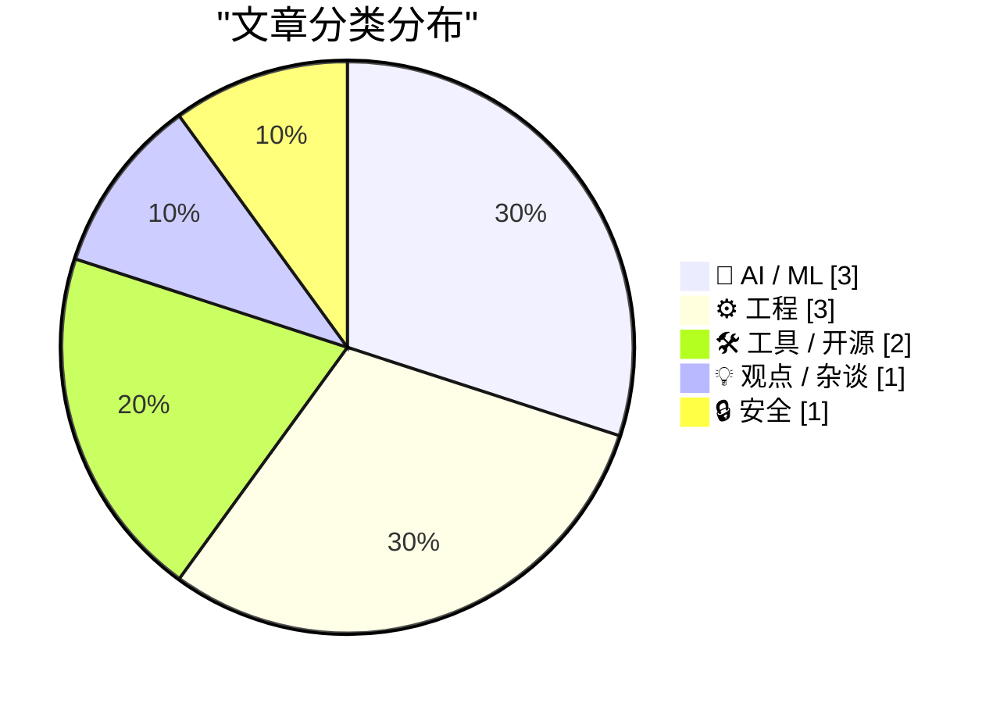
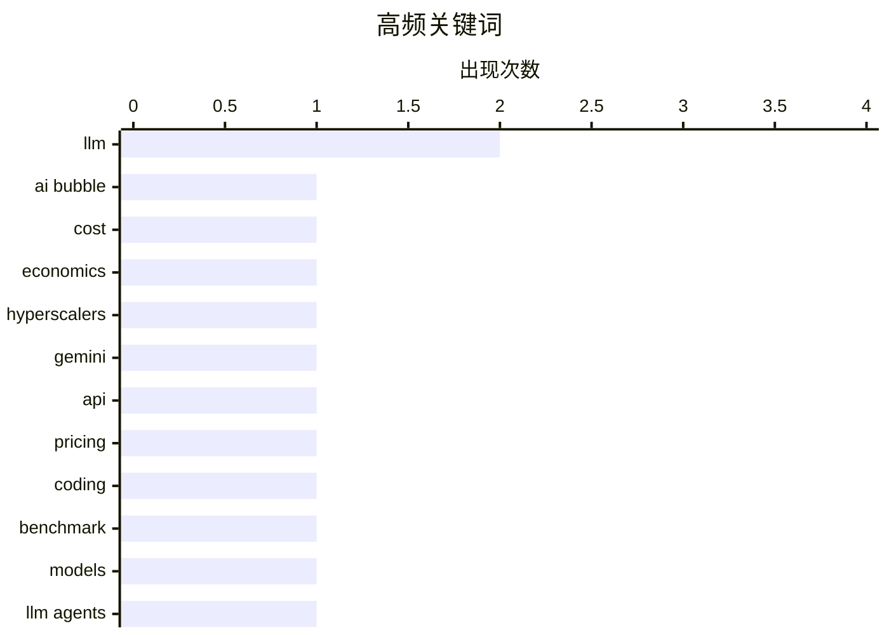

# 📰 AI 博客每日精选 — 2026-05-20

> 来自 Karpathy 推荐的 92 个顶级技术博客，AI 精选 Top 10

## 📝 今日看点

今天技术圈最突出的主线是：AI 正在从“能力竞赛”转入“规模化落地与成本拷问”并行阶段，一边是 Gemini 3.5 Flash 被全面铺开、头部人才继续向前沿模型公司集中，另一边是“AI 太贵且难盈利”的质疑持续升温。第二个趋势是，围绕 LLM 应用的工程基础设施正在快速重构，焦点从模型参数转向代理工具链、上下文集成与推理效率，谁能把系统做稳、做便宜、做可用，谁就更接近商业化闭环。第三个信号来自更广泛的技术治理与生态风险：从开源项目“未宣告死亡”到年龄验证等政策的可执行性争议，再到微软反垄断史的回看，都在提醒行业——技术优势最终仍要接受可持续性、治理与市场结构的检验。

---

## 🏆 今日必读

🥇 **AI 太昂贵了**

[AI Is Too Expensive](https://www.wheresyoured.at/ai-is-too-expensive/) — wheresyoured.at · 7 小时前 · 💡 观点 / 杂谈

> 文章核心判断是：当前 AI 产业链在经济上尚不可持续，主要受益者集中在数据中心建设相关企业、NVIDIA 及周边硬件厂商。文中称多数 AI 初创公司每年仍在亏损数百万到数十亿美元，尚未找到可停止现金流失的商业模式。作者给出的资本开支规模是，超大云厂商过去三年已投入超过 8000 亿美元，并计划在 2026 年再投约 7000 亿、2027 年再投约 1 万亿，由此推算仅回本就需要约 3 万亿美元 AI 专项收入，若要体现显著收益则需 6 万亿美元以上。与之对照，微软、Meta、亚马逊、谷歌最近财年的总营收合计约 1.599 万亿美元，且这些公司并未披露可核实的完整 AI 收入；文中还引用庭审证词称微软在 OpenAI 合作上累计支出约 1000 亿美元。结论是，按现有投入强度与收入透明度看，AI 难以覆盖超大云厂商的资本开支，行业回报逻辑仍不成立。

💡 **为什么值得读**: 这篇文章值得读，因为它把“AI 很热”转化为可核算的资本开支与收入对比，能帮助你快速判断当前 AI 商业化叙事的财务可行性。

🏷️ AI bubble, cost, economics, hyperscalers

🥈 **Gemini 3.5 Flash：更贵了，但 Google 计划把它用在所有地方**

[Gemini 3.5 Flash: more expensive, but Google plan to use it for everything](https://simonwillison.net/2026/May/19/gemini-35-flash/#atom-everything) — simonwillison.net · 23 分钟前 · 🤖 AI / ML

> Google 在 I/O 发布了已正式 GA 的 Gemini 3.5 Flash，并将其同时铺到 Gemini 应用、Google 搜索 AI Mode、Google Antigravity、Gemini API、AI Studio、Android Studio 以及企业平台，覆盖面非常广。该模型 ID 为 gemini-3.5-flash，知识截止到 2025 年 1 月，支持 1,048,576 输入 token 和 65,536 输出 token，整体平台能力与 3.x 系列接近，但不包含 computer use。Google 还推出了处于 beta 的 Interactions API，作者认为它与 OpenAI Responses 的模式相似，尤其是服务端历史管理。定价方面 3.5 Flash 涨幅明显：相对 3 Flash Preview 贵 3 倍、相对 3.1 Flash-Lite 贵 6 倍，价格达到每百万输入 1.50 美元、每百万输出 9 美元，已接近 Gemini 3.1 Pro 的 2/12 美元。作者引用 Artificial Analysis 成本数据指出，3.5 Flash（high）跑基准要 1,551.60 美元，甚至高于 3.1 Pro Preview 的 892.28 美元，并将此放在 GPT-5.5 与 Claude Opus 4.7 的涨价趋势中，判断头部实验室正在测试 API 客户的价格承受能力。

💡 **为什么值得读**: 这篇文章值得读在于它把“广泛上线”和“显著涨价”放在同一框架下，用具体 API 价格与基准成本数据快速揭示主流模型供应商的新定价信号。

🏷️ Gemini, LLM, API, pricing

🥉 **用五分钟回顾过去六个月的 LLM 进展**

[The last six months in LLMs in five minutes](https://simonwillison.net/2026/May/19/5-minute-llms/#atom-everything) — simonwillison.net · 21 小时前 · 🤖 AI / ML

> 这场在 PyCon US 2026 的 5 分钟闪电演讲聚焦 2025 年 11 月到 2026 年 5 月间 LLM 的关键变化，并将 2025 年 11 月定义为明显的拐点。模型“最佳”位置在三家头部厂商之间频繁更替，文中列出的顺序是 Claude Sonnet 4.5、GPT-5.1、Gemini 3、GPT-5.1 Codex Max，随后由 Claude Opus 4.5 重新夺回领先。作者用“生成一只骑自行车的鹈鹕”作为跨模型对比测试，认为 Gemini 3 在该样例中画得最好，但业界实践者整体更认可 Opus 4.5 在随后几个月保持优势。相比模型名次变化，更关键的进展是 coding agents 在 11 月明显跨过可用性门槛：结合 Codex 和 Claude Code 等 agent harness 后，代码生成从“经常能用”提升到“多数场景可用”，可支撑日常真实开发。作者还提到 12 月到 1 月开发者集中试验新模型与 agent 能力，社区热情高涨并出现对能力边界的激进探索。

💡 **为什么值得读**: 它把“模型榜单频繁洗牌”和“编程代理真正可日用”这两条主线压缩到同一时间轴里，适合快速建立近半年 LLM 演进的实战认知。

🏷️ LLM, coding, benchmark, models

---

## 📊 数据概览

| 扫描源 | 抓取文章 | 时间范围 | 精选 |
|:---:|:---:|:---:|:---:|
| 86/92 | 2503 篇 → 11 篇 | 24h | **10 篇** |

### 分类分布



### 高频关键词



<details>
<summary>📈 纯文本关键词图（终端友好）</summary>

```
llm          │ ████████████████████ 2
ai bubble    │ ██████████░░░░░░░░░░ 1
cost         │ ██████████░░░░░░░░░░ 1
economics    │ ██████████░░░░░░░░░░ 1
hyperscalers │ ██████████░░░░░░░░░░ 1
gemini       │ ██████████░░░░░░░░░░ 1
api          │ ██████████░░░░░░░░░░ 1
pricing      │ ██████████░░░░░░░░░░ 1
coding       │ ██████████░░░░░░░░░░ 1
benchmark    │ ██████████░░░░░░░░░░ 1
```

</details>

### 🏷️ 话题标签

**llm**(2) · **ai bubble**(1) · **cost**(1) · economics(1) · hyperscalers(1) · gemini(1) · api(1) · pricing(1) · coding(1) · benchmark(1) · models(1) · llm agents(1) · editing(1) · token efficiency(1) · checksums(1) · age verification(1) · privacy(1) · policy(1) · open source(1) · maintainers(1)

---

## 🤖 AI / ML

### 1. Gemini 3.5 Flash：更贵了，但 Google 计划把它用在所有地方

[Gemini 3.5 Flash: more expensive, but Google plan to use it for everything](https://simonwillison.net/2026/May/19/gemini-35-flash/#atom-everything) — **simonwillison.net** · 23 分钟前 · ⭐ 26/30

> Google 在 I/O 发布了已正式 GA 的 Gemini 3.5 Flash，并将其同时铺到 Gemini 应用、Google 搜索 AI Mode、Google Antigravity、Gemini API、AI Studio、Android Studio 以及企业平台，覆盖面非常广。该模型 ID 为 gemini-3.5-flash，知识截止到 2025 年 1 月，支持 1,048,576 输入 token 和 65,536 输出 token，整体平台能力与 3.x 系列接近，但不包含 computer use。Google 还推出了处于 beta 的 Interactions API，作者认为它与 OpenAI Responses 的模式相似，尤其是服务端历史管理。定价方面 3.5 Flash 涨幅明显：相对 3 Flash Preview 贵 3 倍、相对 3.1 Flash-Lite 贵 6 倍，价格达到每百万输入 1.50 美元、每百万输出 9 美元，已接近 Gemini 3.1 Pro 的 2/12 美元。作者引用 Artificial Analysis 成本数据指出，3.5 Flash（high）跑基准要 1,551.60 美元，甚至高于 3.1 Pro Preview 的 892.28 美元，并将此放在 GPT-5.5 与 Claude Opus 4.7 的涨价趋势中，判断头部实验室正在测试 API 客户的价格承受能力。

🏷️ Gemini, LLM, API, pricing

---

### 2. 用五分钟回顾过去六个月的 LLM 进展

[The last six months in LLMs in five minutes](https://simonwillison.net/2026/May/19/5-minute-llms/#atom-everything) — **simonwillison.net** · 21 小时前 · ⭐ 26/30

> 这场在 PyCon US 2026 的 5 分钟闪电演讲聚焦 2025 年 11 月到 2026 年 5 月间 LLM 的关键变化，并将 2025 年 11 月定义为明显的拐点。模型“最佳”位置在三家头部厂商之间频繁更替，文中列出的顺序是 Claude Sonnet 4.5、GPT-5.1、Gemini 3、GPT-5.1 Codex Max，随后由 Claude Opus 4.5 重新夺回领先。作者用“生成一只骑自行车的鹈鹕”作为跨模型对比测试，认为 Gemini 3 在该样例中画得最好，但业界实践者整体更认可 Opus 4.5 在随后几个月保持优势。相比模型名次变化，更关键的进展是 coding agents 在 11 月明显跨过可用性门槛：结合 Codex 和 Claude Code 等 agent harness 后，代码生成从“经常能用”提升到“多数场景可用”，可支撑日常真实开发。作者还提到 12 月到 1 月开发者集中试验新模型与 agent 能力，社区热情高涨并出现对能力边界的激进探索。

🏷️ LLM, coding, benchmark, models

---

### 3. Andrej Karpathy 加入 Anthropic

[Andrej Karpathy Joined Anthropic](https://x.com/karpathy/status/2056753169888334312) — **daringfireball.net** · 7 小时前 · ⭐ 25/30

> Andrej Karpathy 在 Twitter/X 宣布已加入 Anthropic，并表示未来几年处于大语言模型前沿的发展阶段将非常关键。 他提到自己对加入团队并回归研发工作感到非常兴奋，明确将重心放在前沿 LLM 的 R&D。 同时他也表示仍然对教育充满热情，并计划在未来恢复相关工作。 补充背景信息指出，Karpathy 是 AI 研究领域的重要人物，曾于 2015 年联合创办 OpenAI，并在 2017–2022 年担任特斯拉 AI 总监。 整体信息传达的是其职业重心再次转向前沿模型研究，并在产业一线团队中继续推进技术工作。

🏷️ Anthropic, Karpathy, OpenAI

---

## ⚙️ 工程

### 4. 开源项目的愚蠢死亡方式

[Dumb Ways for an Open Source Project to Die](https://nesbitt.io/2026/05/19/dumb-ways-for-an-open-source-project-to-die.html) — **nesbitt.io** · 13 小时前 · ⭐ 23/30

> 文章聚焦“被广泛依赖的开源包实际上已死亡”这一现象，并拆解项目如何在未正式终止的情况下进入长期失活。文中归纳了多种典型路径：维护者离开后长期无提交、Issue 持续堆积但仓库未归档，外部难以区分是暂时沉默还是彻底停摆。企业主导项目在组织转向或裁员后会变成“公司孤儿”，学术场景中则常见“论文仍被引用但代码已无法构建”的“学位孤儿”。此外还包括资助到期导致维护能力断崖式下降、维护者被新雇主工作与合规限制“带走”，以及因发布权限和管理员账户不可达而形成的继任僵局。核心观点是：开源项目的死亡往往不是技术失败，而是所有权、激励、资金与治理机制缺位造成的系统性失活。

🏷️ open source, maintainers, abandonware, npm

---

### 5. Wi-Wi：纳秒级无线时间同步

[Wi-Wi Is Wireless Time Sync at 1 nanosecond](https://www.jeffgeerling.com/blog/2026/wi-wi-is-wireless-time-sync-less-than-5ns/) — **jeffgeerling.com** · 9 小时前 · ⭐ 18/30

> Wi-Wi STAMP 是来自日本 NICT 的无线时间同步协议，使用 900 MHz 频段，在一个接近智能手机大小的设备里实现皮秒级相位同步和毫米级距离精度。现有原型的相位同步抖动为 20ps，时间同步可达到 30ns，下一代目标是在真实场景中把时间同步推进到 5ns。现场演示里，它被用于两台远程摄像机的无线 black burst 时间同步，也展示了三台设备配合发射器实现的毫米级位置测量。当前系统的无线范围大约在 0.2 到 5 公里之间，取决于射频功率，并且在室内或不便布线的环境里，900 MHz 的穿透能力可能优于 GNSS。作者认为，如果关注纳秒级无线时间同步，或者想了解为什么普通 Wi‑Fi 方案做不到这一点，这项技术值得关注。

🏷️ time sync, wireless, precision, RF

---

### 6. 1998 年微软反垄断案

[Microsoft Antitrust case of 1998](https://dfarq.homeip.net/microsoft-antitrust-case-of-1998/?utm_source=rss&#038;utm_medium=rss&#038;utm_campaign=microsoft-antitrust-case-of-1998) — **dfarq.homeip.net** · 12 小时前 · ⭐ 17/30

> 1998 年 5 月 18 日，美国司法部起诉微软，指控其借助 Windows 的垄断地位，通过对 OEM 和用户施加法律与技术限制，阻止卸载 Internet Explorer 并压制 Netscape、Java 等竞争软件。文中强调“拥有垄断并不违法，但利用一个垄断去获取另一个垄断才是问题核心”，并指出该案争议至今仍在。作者认为，后来和解中的约束条款限制了微软对待 Google 的方式，使其无法完全复制当年针对 Netscape 和 Lotus 的策略。文中还回顾了当时社会与舆论分裂：不少人的立场更多受政治倾向影响，而非对微软商业行为本身的判断。法院在 1999 年事实认定中认为微软打压了来自 Apple、Sun、Netscape、Lotus、RealNetworks 等对 Windows 垄断的威胁，并在 2000 年认定微软违反《谢尔曼反托拉斯法》第 1 和第 2 条。

🏷️ Microsoft, antitrust, browser, monopoly

---

## 🛠 工具 / 开源

### 7. LLM 代理 EDIT 工具的替代方案

[Alternatives for the EDIT tool of LLM agents](http://antirez.com/news/166) — **antirez.com** · 15 小时前 · ⭐ 24/30

> 核心问题是：当前常见的 EDIT 工具采用 CAS（check-and-set）模式时，要求模型逐字重复旧文本，导致本地推理场景下 token 开销大且易因特殊字符、空格不一致而反复失败。文中提出一种基于“行号+标签”的改进方案：READ/SEARCH 返回形如 `10:Q8fA` 的行标识，标签为 4 字符校验值，编辑时只需提交行号、标签与新内容，或用多行 `line:tag` 列表进行替换。该方案在删除大段文本和一般编辑中都能显著减少 token 消耗，同时保留 CAS 的冲突检测能力；作者也讨论了权衡点，如标签长度是否扩展到 8 字符、是否把行号纳入哈希、碰撞概率与分词成本。实测中 DeepSeek v4 Flash 能较自然高效地使用此工具，作者观察到编辑速度更快、可靠性更好（虽未给出精确量化）。另一个备选是仅返回整文件 CRC32，让编辑只基于行号+文件级校验以进一步省 token，但其缺点是即便无关改动也可能导致编辑失败，鲁棒性受限。

🏷️ LLM agents, editing, token efficiency, checksums

---

### 8. WorkOS：Agent 需要上下文，去交付能提供上下文的集成

[[Sponsor] WorkOS: Agents Need Context. Ship the Integrations That Give It to Them.](https://workos.com/docs/pipes?utm_source=daringfireball&amp;utm_medium=newsletter&amp;utm_campaign=q22026) — **daringfireball.net** · 21 小时前 · ⭐ 16/30

> WorkOS Pipes 的核心是让用户把第三方账户安全连接到应用中，降低集成外部服务的复杂度。方案上通过 WorkOS Dashboard 配置 provider，并支持使用自定义 OAuth 凭据（client ID、secret、redirect URI、scopes 与描述）来接入 GitHub、Slack、Google、Salesforce 等服务。产品提供 Pipes Widget 作为预置界面，负责展示可用 provider、发起授权流程、管理连接状态，并在访问令牌异常时提示用户重新授权。后端可通过 WorkOS API 获取访问令牌以代表用户调用第三方 API，令牌刷新由 Pipes 处理；若令牌有问题，接口会返回错误信息以引导用户重新授权。整体观点是把 OAuth 流程、token 刷新和凭据存储从业务侧抽离出来，用统一组件和接口完成多服务集成与账户连接管理。

🏷️ OAuth, integrations, agents

---

## 💡 观点 / 杂谈

### 9. AI 太昂贵了

[AI Is Too Expensive](https://www.wheresyoured.at/ai-is-too-expensive/) — **wheresyoured.at** · 7 小时前 · ⭐ 28/30

> 文章核心判断是：当前 AI 产业链在经济上尚不可持续，主要受益者集中在数据中心建设相关企业、NVIDIA 及周边硬件厂商。文中称多数 AI 初创公司每年仍在亏损数百万到数十亿美元，尚未找到可停止现金流失的商业模式。作者给出的资本开支规模是，超大云厂商过去三年已投入超过 8000 亿美元，并计划在 2026 年再投约 7000 亿、2027 年再投约 1 万亿，由此推算仅回本就需要约 3 万亿美元 AI 专项收入，若要体现显著收益则需 6 万亿美元以上。与之对照，微软、Meta、亚马逊、谷歌最近财年的总营收合计约 1.599 万亿美元，且这些公司并未披露可核实的完整 AI 收入；文中还引用庭审证词称微软在 OpenAI 合作上累计支出约 1000 亿美元。结论是，按现有投入强度与收入透明度看，AI 难以覆盖超大云厂商的资本开支，行业回报逻辑仍不成立。

🏷️ AI bubble, cost, economics, hyperscalers

---

## 🔒 安全

### 10. 并不存在所谓的“年龄验证”

[Pluralistic: There's no such thing as "age verification" (19 May 2026)](https://pluralistic.net/2026/05/19/shes-dead-of-course/) — **pluralistic.net** · 15 小时前 · ⭐ 24/30

> 文章批评技术治理中的“对象恒常性缺失”：立法者明知某些政策会造成附带伤害且易被规避，仍反复推动。作者用 Bruce Schneier 的“安全三段论”——“必须做点什么！看，我已经做了点什么。”——解释这类政策逻辑，指出其目标常是政治上的“做过事”而非真正解决问题。围绕“年龄验证”，文章主张这类概念与“流媒体”一样，往往通过政策话语被当作已存在且可执行的现实，但实际技术与社会后果并不随口号自动成立。文本还强调，这种“先做再说”的路径会引发不断升级的管制链条：前一轮措施无效或被绕过后，政治系统倾向于继续加码。核心观点是：所谓“年龄验证”并非中性、稳妥的技术解法，而是技术政治中可预见失败模式的又一次重演。

🏷️ age verification, privacy, policy

---

*生成于 2026-05-20 07:04 | 扫描 86 源 → 获取 2503 篇 → 精选 10 篇*
*基于 [Hacker News Popularity Contest 2025](https://refactoringenglish.com/tools/hn-popularity/) RSS 源列表*
