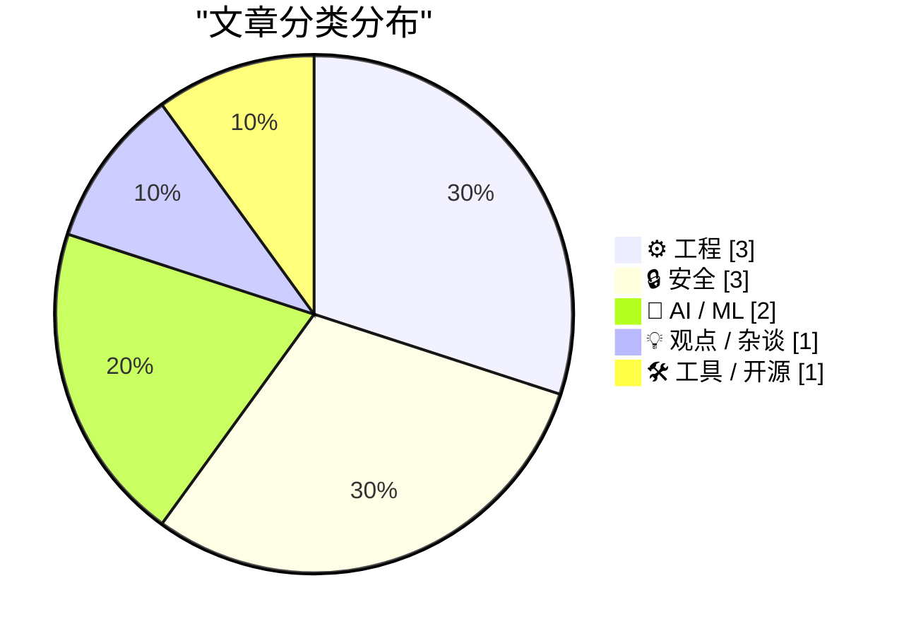
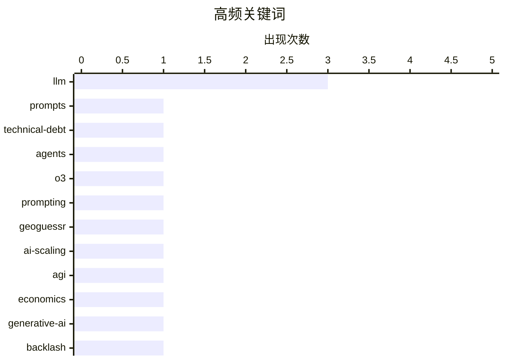

# 📰 AI 博客每日精选 — 2026-05-21

> 来自 Karpathy 推荐的 92 个顶级技术博客，AI 精选 Top 10

## 📝 今日看点

今天的技术焦点仍被 AI 占据，但讨论正从“能力突破”转向“可靠性、可验证性与社会接受度”：提示词被视为新的技术债，模型评测神话遭到复盘，公众对生成式 AI 的反弹也在升温。与此同时，安全议题持续敲警钟，NPM 供应链攻击、系统级漏洞与数字监控反思共同指向软件生态的信任危机。工程实践层面则回到基本功：更清晰的规格、更可控的配置管理，以及对细节 bug 的耐心排查，成为复杂系统中抵御失控的关键。

---

## 🏆 今日必读

🥇 **Prompts are technical debt too**

[Prompts are technical debt too](https://seangoedecke.com/prompts-are-technical-debt-too/) — seangoedecke.com · 23 小时前 · ⚙️ 工程

> Prompts are technical debt too It’s common and correct to say that “all code is technical debt”. Adding code is a necessary evil for developing new features: you almost always have to do it, but each 

🏷️ prompts, technical-debt, LLM, agents

🥈 **The famous o3 "GeoGuessr" prompt did not work**

[The famous o3 "GeoGuessr" prompt did not work](https://seangoedecke.com/the-o3-geoguessr-prompt-did-not-work/) — seangoedecke.com · 2026-05-21 · 🤖 AI / ML

> The famous o3 "GeoGuessr" prompt did not work In April last year, Kelsey Piper discovered that OpenAI’s o3 model was surprisingly good at figuring out where a photo was taken from. Like human “geogues

🏷️ o3, prompting, GeoGuessr, LLM

🥉 **更好的 AI 意味着什么？**

[What will better AI mean?](https://geohot.github.io//blog/jekyll/update/2026/05/20/what-will-better-mean.html) — geohot.github.io · 16 小时前 · 🤖 AI / ML

> 核心问题是，当 AI 已经很难被人类用问题难住时，“更好”或“超人类智能”到底还意味着什么。作者认为，美国前沿实验室并没有隐藏的秘密技巧，相关训练方法在可验证领域主要依赖修复 bug 和继续扩展，因此 AI 缺乏真正护城河。AI 和搜索一样，存在花费指数级增加但回报线性增长的特性，所以短期内 AI 理论上能解决很难的问题，但成本会很高。作者还指出，互联网已被充分挖掘，产出了约 20T 高质量 token；按 Chinchilla 最优模型计算约对应 1T 权重，500 GB 就能容纳一个易查询的人类知识归档，而 Wikipedia 约为 24 GB。结论是，依靠 scaling 产生明显更强 AI 的阶段已经结束，接下来更重要的是效率和品味，并应把触达这一 S 曲线末端的工具分发给尽可能多的人。

💡 **为什么值得读**: 值得读，因为它用成本、数据规模、S 曲线和“品味”这些角度，提出了一个不同于单纯追逐更大模型的 AI 发展判断。

🏷️ AI-scaling, LLM, AGI, economics

---

## 📊 数据概览

| 扫描源 | 抓取文章 | 时间范围 | 精选 |
|:---:|:---:|:---:|:---:|
| 87/92 | 2556 篇 → 16 篇 | 24h | **10 篇** |

### 分类分布



### 高频关键词



<details>
<summary>📈 纯文本关键词图（终端友好）</summary>

```
llm            │ ████████████████████ 3
prompts        │ ███████░░░░░░░░░░░░░ 1
technical-debt │ ███████░░░░░░░░░░░░░ 1
agents         │ ███████░░░░░░░░░░░░░ 1
o3             │ ███████░░░░░░░░░░░░░ 1
prompting      │ ███████░░░░░░░░░░░░░ 1
geoguessr      │ ███████░░░░░░░░░░░░░ 1
ai-scaling     │ ███████░░░░░░░░░░░░░ 1
agi            │ ███████░░░░░░░░░░░░░ 1
economics      │ ███████░░░░░░░░░░░░░ 1
```

</details>

### 🏷️ 话题标签

**llm**(3) · **prompts**(1) · **technical-debt**(1) · agents(1) · o3(1) · prompting(1) · geoguessr(1) · ai-scaling(1) · agi(1) · economics(1) · generative-ai(1) · backlash(1) · ai-bubble(1) · industry(1) · nixos(1) · dotfiles(1) · symlinks(1) · systemd(1) · npm(1) · supply-chain(1)

---

## ⚙️ 工程

### 1. Prompts are technical debt too

[Prompts are technical debt too](https://seangoedecke.com/prompts-are-technical-debt-too/) — **seangoedecke.com** · 23 小时前 · ⭐ 25/30

> Prompts are technical debt too It’s common and correct to say that “all code is technical debt”. Adding code is a necessary evil for developing new features: you almost always have to do it, but each 

🏷️ prompts, technical-debt, LLM, agents

---

### 2. 假设会削弱性质

[Assumptions weaken properties](https://buttondown.com/hillelwayne/archive/assumptions-weaken-properties/) — **buttondown.com/hillelwayne** · 7 小时前 · ⭐ 19/30

> 逻辑蕴含中的“Spec => Prop”和“ASSUME => Spec”可用来表达形式化规格与运行前提，而测试强度也可理解为性质强度。由于命题上有 Prop => (ASSUME => Prop)，加入 ASSUME 后，性质从“系统满足 Prop”变成“在假设成立时系统满足 Prop”，因此覆盖的情况更少、性质更弱。JSON 解析器示例说明，只验证 ASCII 字符串得到的是“输入只含 ASCII 且是合法 JSON => 正确解析”，而支持所有 Unicode 的解析器拥有更少假设、适用范围更大的性质。错误也因此更容易出现：当 Prop 为假时，Spec => Prop 只有在 Spec 为假时才仍可能成立；但 Spec => (ASSUME => Prop) 在 Spec 或 ASSUME 为假时都可能掩盖问题。加入假设有时是必要的，因为某些性质无法直接满足，例如“mergesort 总是返回有序列表”会被外部中断破坏，只能验证“若返回则有序”或“若持续推进则最终返回有序列表”等较弱性质；Rust 的内存安全保证也依赖 unsafe 块满足内存安全这一前提。

🏷️ formal-methods, logic, specification, testing

---

### 3. Leo 总是站不稳

[Leo wouldn't stand still](https://hey.paris/posts/leo-sprite-alignment/) — **hey.paris** · 2026-05-21 · ⭐ 17/30

> 冒险游戏《Leonardo’s Moon Ship》里的玩家角色 Leo 在切换动画时出现视觉错位：开始走路会变高约 3%，不同朝向时脚还会离地最多 27 像素。问题来自美术动画使用了差异很大的画布尺寸，例如 idle_right 是 675x1095，walk_right 和 walk_left 是 1920x1200，而角色本体只占其中约 700x1088。原先用单个 animated-sprite 节点统一套用 sprite_scale=0.28 和 feet_offset_y=-340，但不同动画的角色像素高度和画布内位置并不一致，导致 walk_right 可见高度约 305 像素、idle_right 约 296 像素，缩放后仍会产生高度差。关卡约定 Leo 的 root node 位于脚下，生成点和碰撞形状都依赖这个规则；实际碰撞体没有问题，是视觉表现偏离了身体位置。修复方向是在加载时为每个动画计算独立指标，而不是简单使用库存 alpha bounding box，因为抗锯齿光晕和阴影也会被计入并影响脚部定位。

🏷️ game-dev, animation, sprites, scaling

---

## 🔒 安全

### 4. “没办法阻止这种事”，唯一经常发生这种事的包管理器用户说

["No way to prevent this" say users of only package manager where this regularly happens](https://xeiaso.net/shitposts/no-way-to-prevent-this/supply-chain/2026-art-template/) — **xeiaso.net** · 2026-05-21 · ⭐ 19/30

> art-template 通过 NPM 遭遇供应链攻击后，开发者和系统管理员开始检查自己的项目是否受到影响。文章称攻击者自 2025 年以来控制了相关仓库，并用它从第三方域名加载未经授权的 JavaScript，包括 Baidu Analytics。文中把矛头指向 NPM，称其是供应链攻击经常发生的包管理器，并引用“过去十年全球 90% 的供应链攻击发生在这里”“项目遭遇供应链攻击的可能性高 20 倍”等说法。受访程序员将问题归因于维护者没有以更稳健的方式保护账户访问权限，同时又表示用户对此“无能为力”。整体观点以讽刺方式批评 NPM 生态对供应链安全事件的常态化和无力感。

🏷️ npm, supply-chain, JavaScript, malware

---

### 5. “没办法阻止这种事”，唯一经常发生这种事的语言用户说道

["No way to prevent this" say users of only language where this regularly happens](https://xeiaso.net/shitposts/no-way-to-prevent-this/CVE-2026-45250/) — **xeiaso.net** · 2026-05-21 · ⭐ 18/30

> FreeBSD 项目发布 CVE-2026-45250 后，站点可靠性工程师和系统管理员紧急重建并修补系统，以修复 setcred(2) 系统调用权限验证中的内核栈溢出问题。该漏洞允许以内核上下文执行任意代码，文章将原因指向受影响组件使用 C 语言编写。文中以讽刺口吻称，C 是唯一一种此类漏洞经常发生的编程语言，并提到过去 50 年全球 90% 的内存安全漏洞发生在这种语言相关项目中，且其项目出现安全漏洞的可能性高 20 倍。受访程序员声称“有时这种事就是会发生，没人能阻止”，并把问题归因于程序员不愿以更健壮的方式编写代码。文章最后继续讽刺称，这类漏洞在过去八年每季度发生一两次，而相关语言用户仍把自己描述为“无能为力”。

🏷️ C, memory-safety, FreeBSD, kernel

---

### 6. 读辛迪·科恩的新书《隐私的捍卫者：我对抗数字监控的三十年》

[Read Cindy Cohn's new book, Privacy's Defender: My Thirty-Year Fight Against Digital Surveillance](https://micahflee.com/read-cindy-cohns-new-book-privacys-defender-my-thirty-year-fight-against-digital-surveillance/) — **micahflee.com** · 23 分钟前 · ⭐ 17/30

> Micah Lee 推荐了 Cindy Cohn 的新书《Privacy's Defender: My Thirty-Year Fight Against Digital Surveillance》，称其是一部结合个人回忆与法律史的作品。Cindy Cohn 是电子前哨基金会（EFF）执行董事，书中回顾了她职业生涯中的三场重要法律斗争。内容包括 1990 年代为加密技术争取自由、确立“代码即言论”并受美国第一修正案保护的宪法判决；从 2006 年 Mark Klein 向 EFF 提供 AT&T 旧金山大楼中 NSA 复制互联网流量的证据，到 Edward Snowden 披露事件及之后对 NSA 监控的抗争。书中还讲到反对缺乏问责的国家安全信函（National Security Letters），尤其是阻止公司向客户、公众或国会披露 FBI 数据要求的禁言令。Micah Lee 提到自己在书中被简短提及，相关段落涉及他曾与 Snowden 沟通，并帮助其联系 Laura 以及尝试搭建发布宣言和请愿的网站。

🏷️ privacy, surveillance, EFF, cryptography

---

## 🤖 AI / ML

### 7. The famous o3 "GeoGuessr" prompt did not work

[The famous o3 "GeoGuessr" prompt did not work](https://seangoedecke.com/the-o3-geoguessr-prompt-did-not-work/) — **seangoedecke.com** · 2026-05-21 · ⭐ 23/30

> The famous o3 "GeoGuessr" prompt did not work In April last year, Kelsey Piper discovered that OpenAI’s o3 model was surprisingly good at figuring out where a photo was taken from. Like human “geogues

🏷️ o3, prompting, GeoGuessr, LLM

---

### 8. 更好的 AI 意味着什么？

[What will better AI mean?](https://geohot.github.io//blog/jekyll/update/2026/05/20/what-will-better-mean.html) — **geohot.github.io** · 16 小时前 · ⭐ 22/30

> 核心问题是，当 AI 已经很难被人类用问题难住时，“更好”或“超人类智能”到底还意味着什么。作者认为，美国前沿实验室并没有隐藏的秘密技巧，相关训练方法在可验证领域主要依赖修复 bug 和继续扩展，因此 AI 缺乏真正护城河。AI 和搜索一样，存在花费指数级增加但回报线性增长的特性，所以短期内 AI 理论上能解决很难的问题，但成本会很高。作者还指出，互联网已被充分挖掘，产出了约 20T 高质量 token；按 Chinchilla 最优模型计算约对应 1T 权重，500 GB 就能容纳一个易查询的人类知识归档，而 Wikipedia 约为 24 GB。结论是，依靠 scaling 产生明显更强 AI 的阶段已经结束，接下来更重要的是效率和品味，并应把触达这一 S 曲线末端的工具分发给尽可能多的人。

🏷️ AI-scaling, LLM, AGI, economics

---

## 💡 观点 / 杂谈

### 9. 生成式 AI 会成为科技行业的“越南战争”吗？公众反弹能否把 AI 引向更好的方向？

[Could generative AI turn out to be the tech industry’s Vietnam? And could public backlash lead AI to a better place?](https://garymarcus.substack.com/p/could-generative-ai-could-turn-out) — **garymarcus.substack.com** · 7 小时前 · ⭐ 21/30

> Gary Marcus 将近期针对 AI 的公众反弹与“科技行业的越南战争”作类比，指出多位毕业典礼演讲者因提到 AI 遭到嘘声，Jason Calacanis 也称 AI 正成为 Z 世代抵制的对象。文章认为，这一类比可能不只是情绪层面的相似：美国在越南战争中因傲慢投入巨资却收效甚微，而当前 AI 行业也在以空前速度消耗数万亿美元资金，却仍受幻觉、不可靠和不对齐问题困扰。Marcus 还提到，多数 AI 试点研究缺乏投资回报，使他怀疑这场投资热潮可能成为另一场由傲慢驱动的重大错误。与此同时，他认为自己此前预测的特朗普 AI 政策转向可能正在提前出现，因为特朗普正在考虑类似 FDA 的 AI “预检”机制，这与他和 Michelle Rempel Garner 三年前提出的监管建议相近。作者的核心观点是，如果公众反弹形成足够力量，AI 政策可能从反监管立场转向更重视安全评估与治理。

🏷️ generative-ai, backlash, AI-bubble, industry

---

## 🛠 工具 / 开源

### 10. 今天学到：在 NixOS 中为 Dotfiles 创建符号链接

[TIL: Symlinking NixOS Dotfiles](https://matklad.github.io/2026/05/21/symlinking-nixos-dotfiles.html) — **matklad.github.io** · 2026-05-21 · ⭐ 20/30

> NixOS 上管理 dotfiles 的常见方案是 home-manager，但作者因为不想增加依赖、偏好单用户桌面只维护一套包，以及不希望修改配置必须重建系统而没有采用它。作者更倾向于把 dotfiles 与 flake.nix / configuration.nix 放在同一个仓库中，再将它们符号链接到目标位置。NixOS 的 environment.etc 可以声明式配置符号链接，但范围限于 /etc，不能直接用于 ~/.config；gnu stow 等工具也能处理，但作者认为仅管理符号链接不值得再引入依赖。一个间接方案是使用 systemd-tmpfiles 创建符号链接，并通过 NixOS 配置 systemd-tmpfiles，例如用 systemd.tmpfiles.rules 将 /home/matklad/.config/git/config 链接到 /home/matklad/dotfiles/git/config。作者暂时没有判断这种方式相比专用脚本或更专门工具的优劣。

🏷️ NixOS, dotfiles, symlinks, systemd

---

*生成于 2026-05-21 07:00 | 扫描 87 源 → 获取 2556 篇 → 精选 10 篇*
*基于 [Hacker News Popularity Contest 2025](https://refactoringenglish.com/tools/hn-popularity/) RSS 源列表*
