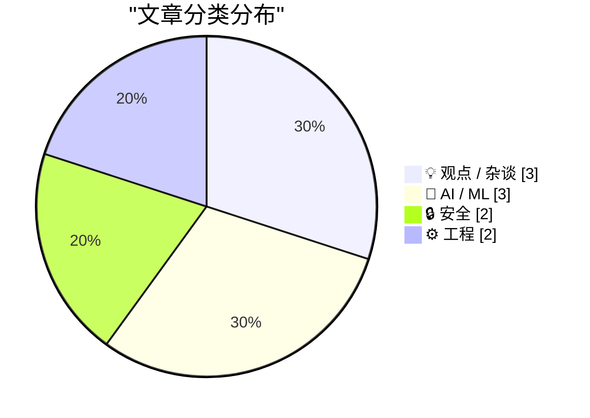
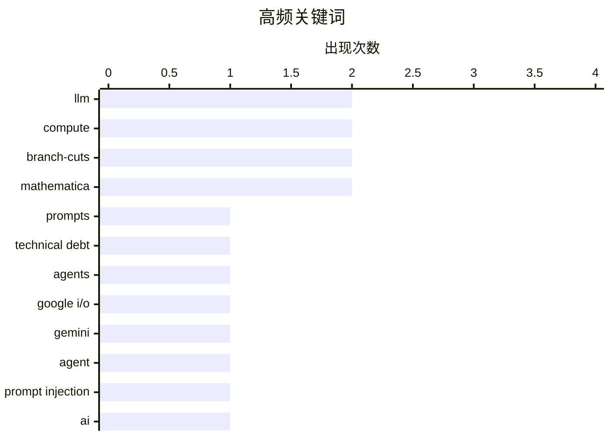

# 📰 AI 博客每日精选 — 2026-05-21

> 来自 Karpathy 推荐的 92 个顶级技术博客，AI 精选 Top 10

## 📝 今日看点

今日看点集中在三条主线：AI 的工程化代价、社会治理压力，以及“形式保证”的边界。几篇 AI 相关文章都在提醒，提示词、Agent、算力采购和模型升级并不只是能力扩张问题，也会带来维护债、安全风险、成本压力和生态锁定。与此同时，公众反弹、监管讨论和隐私史回顾显示，AI 与数字技术的发展越来越难脱离公共利益、可靠性和权利保护。另一个技术层面的共同点是：无论是形式化验证中的前提假设，还是复分析里的分支切割，很多“结论成立”都依赖精确定义适用范围，忽略这些边界就容易得到看似正确但并不稳固的判断。

---

## 🏆 今日必读

🥇 **提示词也是技术债**

[Prompts are technical debt too](https://seangoedecke.com/prompts-are-technical-debt-too/) — seangoedecke.com · 23 小时前 · 💡 观点 / 杂谈

> 文章把提示词视为与代码类似、甚至更隐蔽的技术债：它们会增加系统复杂度，并影响未来维护与变更。作者指出，许多团队现在为代码库、AI 工具、Agent 工作流和系统能力维护大量提示词，但这些提示词往往高度依赖具体模型版本。模型升级后，曾经有效的提示词可能失效或产生负面效果，而且这种退化不像代码错误那样容易被察觉。作者因此不建议普通团队投入大量时间打造复杂的自定义 Agent 提示体系，而是倾向使用由第三方持续维护的成熟 AI 编码工具，并尽量减少配置。对于 AGENTS.md 等项目提示文件，作者建议只写具体、稳定的项目信息，避免行为诱导式提示，也不要让模型生成大量未经审查的提示文本。

💡 **为什么值得读**: 它提醒团队在拥抱 AI 编码工具时，不要忽视提示词长期维护成本和模型迭代带来的隐性风险。

🏷️ prompts, technical debt, agents, LLM

🥈 **Simon Willison 评 Google I/O：Gemini Spark、Antigravity 与代理安全疑虑**

[Google I/O, Gemini Spark, Antigravity](https://simonwillison.net/2026/May/20/google-io/#atom-everything) — simonwillison.net · 7 小时前 · 🤖 AI / ML

> Simon Willison 表示，今年 Google I/O 的许多重磅发布仍处于“即将推出”状态，因此他只能谨慎评论自己能验证或已有较明确信息的部分。他认为除 Gemini 3.5 Flash 外，最值得关注的是 Gemini Spark：一个面向用户的个人 AI 代理，号称可原生连接 Gmail、Calendar、Drive、Docs、Sheets、YouTube 和 Maps 等 Google 应用。文章指出，Google FAQ 中称 Gemini Spark 运行在 Gemini 3.5 Flash 和 Antigravity 上，但 Antigravity 同时被描述为桌面应用、CLI 代理工具、SDK 和 VS Code 分支 IDE，这让产品边界显得混乱。作者重点关注 Spark 如何防范提示注入和敏感数据泄露，并引用 Google Cloud 面向企业的说明：任务会在隔离的临时 VM 中执行，流量经过 Agent Gateway，并应用 DLP 策略。文章最后还提到，Google 将让开源 Gemini CLI 停止支持其 AI 订阅计划，转而由新的闭源 Antigravity CLI 取代，这对开发者生态是一个重要变化。

💡 **为什么值得读**: 这篇文章值得读，因为它不只是复述 Google I/O 发布，而是抓住了 AI 代理产品最关键的安全、架构透明度和开源生态问题。

🏷️ Google I/O, Gemini, agent, prompt injection

🥉 **更强的 AI 究竟意味着什么？**

[What will better AI mean?](https://geohot.github.io//blog/jekyll/update/2026/05/20/what-will-better-mean.html) — geohot.github.io · 16 小时前 · 🤖 AI / ML

> 作者认为，前沿 AI 实验室并没有不可复制的秘密技巧，现有方法在可验证领域主要依赖修 bug、扩大规模和投入更多算力。文章指出，AI 搜索和推理往往呈现“成本指数增长、收益线性增加”的特征，因此未来一段时间里，AI 也许能解决很难的问题，但代价会非常高。作者还讨论了训练数据和模型规模的瓶颈，认为互联网高质量文本已经被充分挖掘，继续靠规模带来显著提升的空间正在变小。在他看来，所谓“超人智能”在很多领域并不容易被人类感知或定义，只有优化指标明确的任务才更容易体现优势。文章最后提出，AI 发展的重点可能会从单纯 scaling 转向效率、工具分发和“品味”，也就是让更多人用接近曲线末端的能力去创造和判断。

💡 **为什么值得读**: 这篇文章值得读，因为它用较少技术黑话讨论了 AI 规模化红利、成本瓶颈和未来竞争焦点的变化。

🏷️ AI, scaling-laws, LLM, compute

---

## 📊 数据概览

| 扫描源 | 抓取文章 | 时间范围 | 精选 |
|:---:|:---:|:---:|:---:|
| 88/92 | 2553 篇 → 16 篇 | 24h | **10 篇** |

### 分类分布



### 高频关键词



<details>
<summary>📈 纯文本关键词图（终端友好）</summary>

```
llm            │ ████████████████████ 2
compute        │ ████████████████████ 2
branch-cuts    │ ████████████████████ 2
mathematica    │ ████████████████████ 2
prompts        │ ██████████░░░░░░░░░░ 1
technical debt │ ██████████░░░░░░░░░░ 1
agents         │ ██████████░░░░░░░░░░ 1
google i/o     │ ██████████░░░░░░░░░░ 1
gemini         │ ██████████░░░░░░░░░░ 1
agent          │ ██████████░░░░░░░░░░ 1
```

</details>

### 🏷️ 话题标签

**llm**(2) · **compute**(2) · **branch-cuts**(2) · mathematica(2) · prompts(1) · technical debt(1) · agents(1) · google i/o(1) · gemini(1) · agent(1) · prompt injection(1) · ai(1) · scaling-laws(1) · memory safety(1) · c++(1) · windows defender(1) · vulnerability(1) · generative ai(1) · backlash(1) · investment(1)

---

## 💡 观点 / 杂谈

### 1. 提示词也是技术债

[Prompts are technical debt too](https://seangoedecke.com/prompts-are-technical-debt-too/) — **seangoedecke.com** · 23 小时前 · ⭐ 24/30

> 文章把提示词视为与代码类似、甚至更隐蔽的技术债：它们会增加系统复杂度，并影响未来维护与变更。作者指出，许多团队现在为代码库、AI 工具、Agent 工作流和系统能力维护大量提示词，但这些提示词往往高度依赖具体模型版本。模型升级后，曾经有效的提示词可能失效或产生负面效果，而且这种退化不像代码错误那样容易被察觉。作者因此不建议普通团队投入大量时间打造复杂的自定义 Agent 提示体系，而是倾向使用由第三方持续维护的成熟 AI 编码工具，并尽量减少配置。对于 AGENTS.md 等项目提示文件，作者建议只写具体、稳定的项目信息，避免行为诱导式提示，也不要让模型生成大量未经审查的提示文本。

🏷️ prompts, technical debt, agents, LLM

---

### 2. 生成式 AI 会成为科技行业的“越南战争”吗？公众反弹能否推动 AI 走向更好方向？

[Could generative AI turn out to be the tech industry’s Vietnam? And could public backlash lead AI to a better place?](https://garymarcus.substack.com/p/could-generative-ai-could-turn-out) — **garymarcus.substack.com** · 7 小时前 · ⭐ 21/30

> Gary Marcus 讨论了近期美国校园和公众场合对 AI 的明显反感，指出多位毕业典礼演讲者仅因提到 AI 就遭到嘘声，这显示年轻一代对 AI 扩张的抵触正在升温。他借用“AI 是 Z 世代的越南战争”这一说法，进一步比较生成式 AI 与越战之间的相似性：巨额投入、强烈自信、长期推进，却始终面临效果不佳和代价过高的问题。文章认为，当前 AI 行业投入数万亿美元，但在幻觉、不可靠、对齐困难和商业回报不足等方面仍未解决根本问题，因此可能成为一次由傲慢驱动的重大误判。Marcus 还提到，美国政治风向可能正在变化，特朗普政府据称开始考虑类似“预发布安全审查”的 AI 监管机制，这与他此前主张的按安全证据评估重大 AI 应用的思路接近。文章最后强调，如果公众反弹形成足够压力，AI 政策可能从放任行业扩张转向更重视安全、可靠性和公共利益的治理路径。

🏷️ generative AI, backlash, investment, hallucination

---

### 3. 假设会削弱性质保证

[Assumptions weaken properties](https://buttondown.com/hillelwayne/archive/assumptions-weaken-properties/) — **buttondown.com/hillelwayne** · 7 小时前 · ⭐ 18/30

> 文章讨论了形式化规格与测试中的一个直觉但容易被忽略的结论：给性质增加前提假设，会让这个性质变弱。作者用逻辑蕴含解释，若系统满足“在某个假设成立时性质成立”，这比无条件满足该性质覆盖的情况更少，因此保证更弱。文中用 JSON 解析器、Rust 的 unsafe、归并排序的终止性、公平性假设、宇宙射线和 Neovim 版本兼容等例子说明，假设常常是为了处理不可实现、成本过高或难以验证的强性质。作者还指出，许多假设来自程序外部环境，例如输入、硬件、操作系统、第三方 API 或社会化兼容约定。最后文章强调，验证“在假设下代码正确”和检查“假设本身是否成立”是两类不同问题，后者在实践中可能更困难。

🏷️ formal-methods, logic, specification, testing

---

## 🤖 AI / ML

### 4. Simon Willison 评 Google I/O：Gemini Spark、Antigravity 与代理安全疑虑

[Google I/O, Gemini Spark, Antigravity](https://simonwillison.net/2026/May/20/google-io/#atom-everything) — **simonwillison.net** · 7 小时前 · ⭐ 23/30

> Simon Willison 表示，今年 Google I/O 的许多重磅发布仍处于“即将推出”状态，因此他只能谨慎评论自己能验证或已有较明确信息的部分。他认为除 Gemini 3.5 Flash 外，最值得关注的是 Gemini Spark：一个面向用户的个人 AI 代理，号称可原生连接 Gmail、Calendar、Drive、Docs、Sheets、YouTube 和 Maps 等 Google 应用。文章指出，Google FAQ 中称 Gemini Spark 运行在 Gemini 3.5 Flash 和 Antigravity 上，但 Antigravity 同时被描述为桌面应用、CLI 代理工具、SDK 和 VS Code 分支 IDE，这让产品边界显得混乱。作者重点关注 Spark 如何防范提示注入和敏感数据泄露，并引用 Google Cloud 面向企业的说明：任务会在隔离的临时 VM 中执行，流量经过 Agent Gateway，并应用 DLP 策略。文章最后还提到，Google 将让开源 Gemini CLI 停止支持其 AI 订阅计划，转而由新的闭源 Antigravity CLI 取代，这对开发者生态是一个重要变化。

🏷️ Google I/O, Gemini, agent, prompt injection

---

### 5. 更强的 AI 究竟意味着什么？

[What will better AI mean?](https://geohot.github.io//blog/jekyll/update/2026/05/20/what-will-better-mean.html) — **geohot.github.io** · 16 小时前 · ⭐ 22/30

> 作者认为，前沿 AI 实验室并没有不可复制的秘密技巧，现有方法在可验证领域主要依赖修 bug、扩大规模和投入更多算力。文章指出，AI 搜索和推理往往呈现“成本指数增长、收益线性增加”的特征，因此未来一段时间里，AI 也许能解决很难的问题，但代价会非常高。作者还讨论了训练数据和模型规模的瓶颈，认为互联网高质量文本已经被充分挖掘，继续靠规模带来显著提升的空间正在变小。在他看来，所谓“超人智能”在很多领域并不容易被人类感知或定义，只有优化指标明确的任务才更容易体现优势。文章最后提出，AI 发展的重点可能会从单纯 scaling 转向效率、工具分发和“品味”，也就是让更多人用接近曲线末端的能力去创造和判断。

🏷️ AI, scaling-laws, LLM, compute

---

### 6. SpaceX S-1 文件披露：Anthropic 将为 Colossus 算力支付每月 12.5 亿美元

[Quoting SpaceX S-1](https://simonwillison.net/2026/May/20/spacex-s1/#atom-everything) — **simonwillison.net** · 37 分钟前 · ⭐ 19/30

> Simon Willison 摘录了 SpaceX S-1 文件中一段与 AI 算力业务有关的内容。文件称，SpaceX 可将计算资源用于自有 AI 应用，例如正在 COLOSSUS II 训练的 Grok 5，同时也会向第三方客户提供部分算力。披露内容显示，SpaceX 在 2026 年 5 月与 Anthropic 签署云服务协议，后者将获得 COLOSSUS 和 COLOSSUS II 的算力容量。协议金额高达每月 12.5 亿美元，持续到 2029 年 5 月，但 2026 年 5 月和 6 月因容量爬坡会按较低费用计费。协议还允许任一方提前 90 天通知后终止，说明这笔巨大算力采购虽然规模惊人，但仍保留了灵活退出条款。

🏷️ Anthropic, compute, SpaceX, Grok

---

## 🔒 安全

### 7. “无法阻止这种事发生”：唯一经常发生此类问题的语言用户如是说

["No way to prevent this" say users of only language where this regularly happens](https://xeiaso.net/shitposts/no-way-to-prevent-this/CVE-2026-45584/) — **xeiaso.net** · 23 小时前 · ⭐ 22/30

> 这篇文章来自 Xe Iaso 个人网站的“shitposts”栏目，标题明显是在借用新闻讽刺句式评论某个与 CVE-2026-45584 相关的技术事件。可用正文没有提供实际内容，只显示了站点的机器人校验页面，因此无法确认漏洞细节、涉及语言或作者的具体论点。根据标题和栏目判断，文章很可能是短篇讽刺文，用夸张方式批评某类编程语言或生态反复出现相似安全问题却将其描述为不可避免。摘要不应把它当作正式漏洞分析或公告，只能视为围绕安全事件的观点性、幽默性评论。若需要技术结论，应阅读原文或查找 CVE-2026-45584 的独立资料。

🏷️ memory safety, C++, Windows Defender, vulnerability

---

### 8. 《隐私捍卫者》：辛迪·科恩三十年反数字监控斗争回忆录

[Read Cindy Cohn's new book, Privacy's Defender: My Thirty-Year Fight Against Digital Surveillance](https://micahflee.com/read-cindy-cohns-new-book-privacys-defender-my-thirty-year-fight-against-digital-surveillance/) — **micahflee.com** · 28 分钟前 · ⭐ 14/30

> 作者推荐了电子前哨基金会执行主任辛迪·科恩的新书《Privacy's Defender: My Thirty-Year Fight Against Digital Surveillance》。这本书结合回忆录和法律史，回顾了科恩职业生涯中三场关键的数字权利战役：1990 年代争取密码学自由、挑战 NSA 大规模监控，以及反对国家安全信函中的保密令。文章特别提到，书中讲述了代码是否受第一修正案保护、AT&T 机房中的 NSA 监听证据、斯诺登披露事件后续等重要节点。作者还指出自己在书中被简短提及，涉及他曾帮助斯诺登与记者劳拉·波伊特拉斯建立联系的一段经历。整体来看，这篇文章更像是一篇个人推荐，但提供了足够线索说明该书如何串联美国数字隐私与监控法律斗争的历史。

🏷️ privacy, surveillance, EFF, cryptography

---

## ⚙️ 工程

### 9. 如何正确理解 √(z²−1) 的分支切割

[Square root of x² − 1](https://www.johndcook.com/blog/2026/05/19/square-root-of-x-squared-minus-one/) — **johndcook.com** · 22 小时前 · ⭐ 16/30

> 文章讨论复函数 √(z²−1) 的定义为什么不能简单理解为“先算 z²−1，再取主值平方根”。如果按平方根主分支逐步计算，就必须排除让 z²−1 落在负实轴上的点，从而产生包含虚轴和区间 [-1,1] 的分支切割。作者提出另一种更自然的看法：把 √(z²−1) 当作一个整体函数，通过解析延拓直接定义，而不是机械套用平方根函数。这样可以只在区间 [-1,1] 上设置切割，消除虚轴上的不连续。文章还用 Mathematica 图像和对数表达式解释了这种定义为何能在负实轴相关位置保持解析性。

🏷️ complex-analysis, branch-cuts, square-root, Mathematica

---

### 10. 重新审视一个反双曲余弦恒等式

[Closer look at an identity](https://www.johndcook.com/blog/2026/05/19/closer-look-at-an-identity/) — **johndcook.com** · 23 小时前 · ⭐ 16/30

> 文章讨论一个涉及 cosh、arccosh 和平方根的恒等式为什么需要对参数范围加限制。作者用 Mathematica 作图说明，该恒等式在 x>1、y>1 时成立，但一旦扩展到更广的区域就会失效或表现不同。问题的根源在于复数意义下的平方根和 arccosh 都不是天然单值函数，必须通过分支割来定义，而不同函数的分支割并不总是兼容。文中指出，不能简单地把 √a√b 合并成 √(ab)，因为当参数可能为负或落在复平面不同分支上时这个等式不一定成立。作者还给出一种用对数形式重写平方根项的方法，使对应恒等式可以在更一般的范围内成立，并用 Mathematica 的 FullSimplify 验证。

🏷️ branch-cuts, ArcCosh, symbolic-math, Mathematica

---

*生成于 2026-05-21 07:04 | 扫描 88 源 → 获取 2553 篇 → 精选 10 篇*
*基于 [Hacker News Popularity Contest 2025](https://refactoringenglish.com/tools/hn-popularity/) RSS 源列表*
