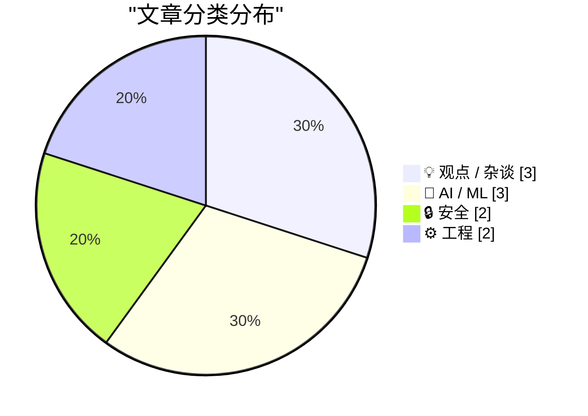
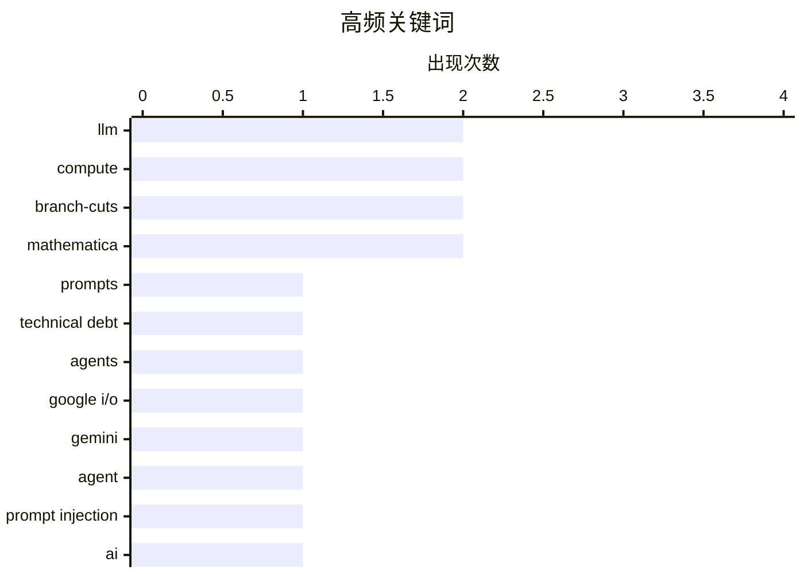

# 📰 AI 博客每日精选 — 2026-05-21

> 来自 Karpathy 推荐的 92 个顶级技术博客，AI 精选 Top 10

## 🏆 今日必读

🥇 **Prompts are technical debt too**

[Prompts are technical debt too](https://seangoedecke.com/prompts-are-technical-debt-too/) — seangoedecke.com · 23 小时前 · 💡 观点 / 杂谈

> Prompts are technical debt too It’s common and correct to say that “all code is technical debt”. Adding code is a necessary evil for developing new features: you almost always have to do it, but each 

🏷️ prompts, technical debt, agents, LLM

🥈 **Google I/O, Gemini Spark, Antigravity**

[Google I/O, Gemini Spark, Antigravity](https://simonwillison.net/2026/May/20/google-io/#atom-everything) — simonwillison.net · 7 小时前 · 🤖 AI / ML

> Simon Willison’s Weblog Subscribe Sponsored by: Datadog &mdash; Ship reliable AI faster with LLM Observability. Read the best practices guide 20th May 2026 It's hard to find much to write about Google

🏷️ Google I/O, Gemini, agent, prompt injection

🥉 **What will better AI mean?**

[What will better AI mean?](https://geohot.github.io//blog/jekyll/update/2026/05/20/what-will-better-mean.html) — geohot.github.io · 16 小时前 · 🤖 AI / ML

> I thought about posting this paper but rebranding it as the Claude Mythos technical report. As far as I can tell, there’s no secret tricks the US frontier labs have, and that basically describes how M

🏷️ AI, scaling-laws, LLM, compute

---

## 📊 数据概览

| 扫描源 | 抓取文章 | 时间范围 | 精选 |
|:---:|:---:|:---:|:---:|
| 88/92 | 2553 篇 → 16 篇 | 24h | **10 篇** |

### 分类分布



### 高频关键词



<details>
<summary>📈 纯文本关键词图（终端友好）</summary>

```
llm            │ ████████████████████ 2
compute        │ ████████████████████ 2
branch-cuts    │ ████████████████████ 2
mathematica    │ ████████████████████ 2
prompts        │ ██████████░░░░░░░░░░ 1
technical debt │ ██████████░░░░░░░░░░ 1
agents         │ ██████████░░░░░░░░░░ 1
google i/o     │ ██████████░░░░░░░░░░ 1
gemini         │ ██████████░░░░░░░░░░ 1
agent          │ ██████████░░░░░░░░░░ 1
```

</details>

### 🏷️ 话题标签

**llm**(2) · **compute**(2) · **branch-cuts**(2) · mathematica(2) · prompts(1) · technical debt(1) · agents(1) · google i/o(1) · gemini(1) · agent(1) · prompt injection(1) · ai(1) · scaling-laws(1) · memory safety(1) · c++(1) · windows defender(1) · vulnerability(1) · generative ai(1) · backlash(1) · investment(1)

---

## 💡 观点 / 杂谈

### 1. Prompts are technical debt too

[Prompts are technical debt too](https://seangoedecke.com/prompts-are-technical-debt-too/) — **seangoedecke.com** · 23 小时前 · ⭐ 24/30

> Prompts are technical debt too It’s common and correct to say that “all code is technical debt”. Adding code is a necessary evil for developing new features: you almost always have to do it, but each 

🏷️ prompts, technical debt, agents, LLM

---

### 2. Could generative AI turn out to be the tech industry’s Vietnam? And could public backlash lead AI to a better place?

[Could generative AI turn out to be the tech industry’s Vietnam? And could public backlash lead AI to a better place?](https://garymarcus.substack.com/p/could-generative-ai-could-turn-out) — **garymarcus.substack.com** · 7 小时前 · ⭐ 21/30

> Could generative AI turn out to be the tech industry’s Vietnam? And could public backlash lead AI to a better place? We live in interesting times Gary Marcus May 20, 2026 151 81 19 Share As I am sure 

🏷️ generative AI, backlash, investment, hallucination

---

### 3. Assumptions weaken properties

[Assumptions weaken properties](https://buttondown.com/hillelwayne/archive/assumptions-weaken-properties/) — **buttondown.com/hillelwayne** · 7 小时前 · ⭐ 18/30

> May 20, 2026 Assumptions weaken properties Assume a spherical cowputer In some tests are stronger than others , I defined STRONG => WEAK to mean "any system passing test STRONG is also guaranteed to p

🏷️ formal-methods, logic, specification, testing

---

## 🤖 AI / ML

### 4. Google I/O, Gemini Spark, Antigravity

[Google I/O, Gemini Spark, Antigravity](https://simonwillison.net/2026/May/20/google-io/#atom-everything) — **simonwillison.net** · 7 小时前 · ⭐ 23/30

> Simon Willison’s Weblog Subscribe Sponsored by: Datadog &mdash; Ship reliable AI faster with LLM Observability. Read the best practices guide 20th May 2026 It's hard to find much to write about Google

🏷️ Google I/O, Gemini, agent, prompt injection

---

### 5. What will better AI mean?

[What will better AI mean?](https://geohot.github.io//blog/jekyll/update/2026/05/20/what-will-better-mean.html) — **geohot.github.io** · 16 小时前 · ⭐ 22/30

> I thought about posting this paper but rebranding it as the Claude Mythos technical report. As far as I can tell, there’s no secret tricks the US frontier labs have, and that basically describes how M

🏷️ AI, scaling-laws, LLM, compute

---

### 6. Quoting SpaceX S-1

[Quoting SpaceX S-1](https://simonwillison.net/2026/May/20/spacex-s1/#atom-everything) — **simonwillison.net** · 37 分钟前 · ⭐ 19/30

> Simon Willison’s Weblog Subscribe Sponsored by: Datadog &mdash; Ship reliable AI faster with LLM Observability. Read the best practices guide 20th May 2026 We have the ability to use compute resources

🏷️ Anthropic, compute, SpaceX, Grok

---

## 🔒 安全

### 7. "No way to prevent this" say users of only language where this regularly happens

["No way to prevent this" say users of only language where this regularly happens](https://xeiaso.net/shitposts/no-way-to-prevent-this/CVE-2026-45584/) — **xeiaso.net** · 23 小时前 · ⭐ 22/30

> "No way to prevent this" say users of only language where this regularly happens Published on 2026-05-20 , 221 words, 1 minutes to read A forlorn business man resting his head on a brown wall next to 

🏷️ memory safety, C++, Windows Defender, vulnerability

---

### 8. Read Cindy Cohn's new book, Privacy's Defender: My Thirty-Year Fight Against Digital Surveillance

[Read Cindy Cohn's new book, Privacy's Defender: My Thirty-Year Fight Against Digital Surveillance](https://micahflee.com/read-cindy-cohns-new-book-privacys-defender-my-thirty-year-fight-against-digital-surveillance/) — **micahflee.com** · 28 分钟前 · ⭐ 14/30

> Read Cindy Cohn's new book, Privacy's Defender: My Thirty-Year Fight Against Digital Surveillance My copy of Privacy's Defender, signed by Cindy Cohn I just finished reading Privacy's Defender: My Thi

🏷️ privacy, surveillance, EFF, cryptography

---

## ⚙️ 工程

### 9. Square root of x² − 1

[Square root of x² − 1](https://www.johndcook.com/blog/2026/05/19/square-root-of-x-squared-minus-one/) — **johndcook.com** · 22 小时前 · ⭐ 16/30

> How should we define √( z ² − 1)? Well, you could square z , subtract 1, and take the square root. What else would you do?! The question turns out to be more subtle than it looks. When x is a non-nega

🏷️ complex-analysis, branch-cuts, square-root, Mathematica

---

### 10. Closer look at an identity

[Closer look at an identity](https://www.johndcook.com/blog/2026/05/19/closer-look-at-an-identity/) — **johndcook.com** · 23 小时前 · ⭐ 16/30

> The previous post derived the identity and said in a footnote that the identity holds at least for x > 1 and y > 1. That’s true, but let’s see why the footnote is necessary. Let’s have Mathematica plo

🏷️ branch-cuts, ArcCosh, symbolic-math, Mathematica

---

*生成于 2026-05-21 07:04 | 扫描 88 源 → 获取 2553 篇 → 精选 10 篇*
*基于 [Hacker News Popularity Contest 2025](https://refactoringenglish.com/tools/hn-popularity/) RSS 源列表*
