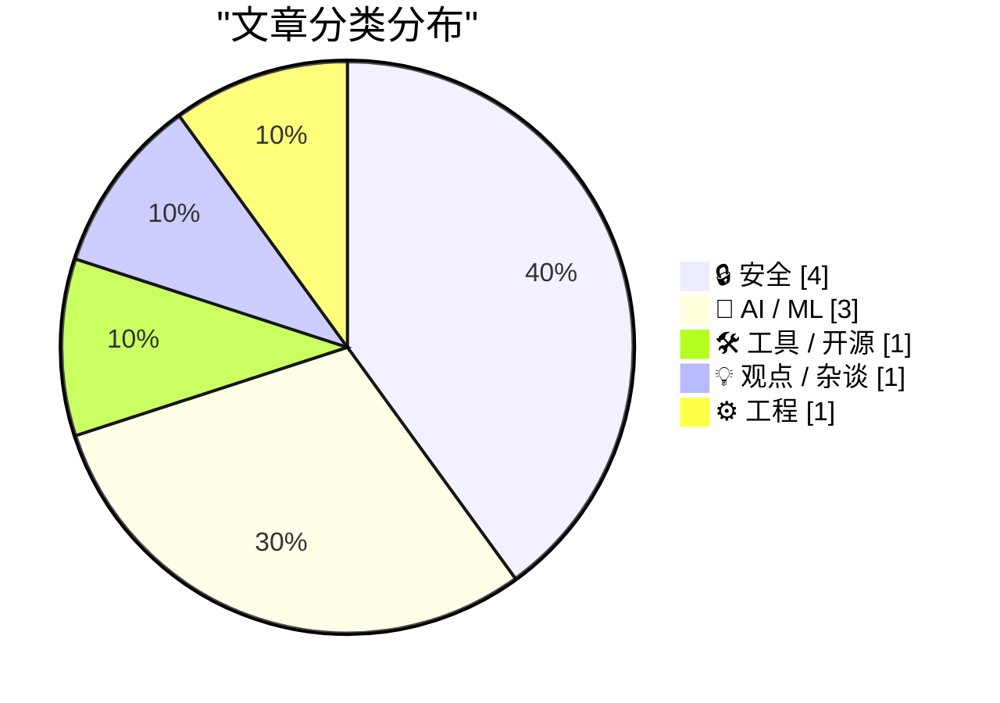
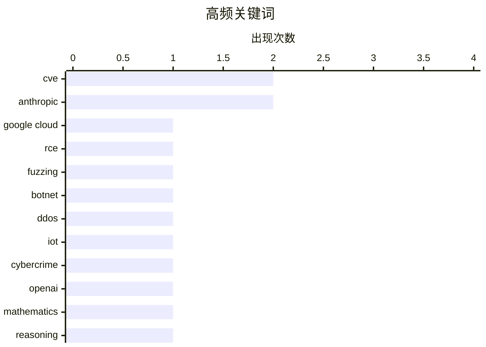

# 📰 AI 博客每日精选 — 2026-05-22

> 来自 Karpathy 推荐的 92 个顶级技术博客，AI 精选 Top 10

## 📝 今日看点

今日技术圈的主线仍是安全风险集中爆发：从 Google Cloud 生产环境 RCE、NPM 供应链污染到 FreeBSD 内核漏洞和 IoT 僵尸网络执法，云、开源生态与基础设施都在承压。AI 领域则从“能力炫技”转向“真实性审计”，外界开始更严肃地核查大模型数学突破、提示词效果与商业盈利叙事。与此同时，数字自主和自托管话题升温，Plex 大幅涨价与组织对美国科技依赖的反思，凸显用户和机构正在重新评估技术控制权与长期成本。

---

## 🏆 今日必读

🥇 **StubZero：Google Cloud 生产环境中的 148,337 美元 RCE**

[StubZero: $148,337 RCE in Google Cloud Production](https://brutecat.com/articles/google-cloud-rce) — brutecat.com · 2026-05-22 · 🔒 安全

> 一次自动化 fuzzing 工具告警发现 cloudcrmipfrontend-pa.googleapis.com 对可疑端点返回 200，并暴露多个公共调试端点。其中 /v1/integrationPlatform:getProtoDefinition 可返回 google3 中任意 protobuf message 的 proto definitions，甚至包括 YouTube 等无关服务；认证使用 Google 第一方 cookie、SAPISIDHASH Authorization 和 https://console.cloud.google.com Origin。由于 Google 内部 API 广泛以 gRPC 和 protobuf 定义，这类泄露可揭示任意端点的请求/响应结构，作者将其称为“req2proto as a Service”。最初的调试端点信息泄露进一步升级为 Google Cloud 生产环境的远程代码执行，并被分配 CVE-2026-2031。三个月后，类似情况再次发生，文章围绕两轮 RCE、内部工作流执行队列泄露和内部任务类型配置展开。

💡 **为什么值得读**: 值得读在于它展示了黑盒目标中从调试端点与 protobuf 定义泄露一路推进到 Google Cloud 生产 RCE 的完整攻击链。

🏷️ Google Cloud, RCE, CVE, fuzzing

🥈 **涉嫌 Kimwolf 僵尸网络主控者“Dort”被捕，并在美国和加拿大遭起诉**

[Alleged Kimwolf Botmaster ‘Dort’ Arrested, Charged in U.S. and Canada](https://krebsonsecurity.com/2026/05/alleged-kimwolf-botmaster-dort-arrested-charged-in-u-s-and-canada/) — krebsonsecurity.com · 1 小时前 · 🔒 安全

> 加拿大当局逮捕了渥太华 23 岁男子 Jacob Butler，又名“Dort”，他被怀疑构建并运营 IoT 僵尸网络 Kimwolf，并在加拿大和美国面临刑事黑客指控。Kimwolf 感染了数百万台设备，包括数字相框、网络摄像头等通常被防火墙隔离的设备，并被出租给其他网络犯罪分子或用于大规模 DDoS 攻击。美国司法部称，Kimwolf 相关 DDoS 攻击峰值接近 30 Tbps，部分受害者损失超过 100 万美元，僵尸网络被指发出超过 25,000 条攻击命令。3 月 19 日，美国与国际执法伙伴查封了 Kimwolf 以及 Aisuru、JackSkid、Mossad 三个大型 DDoS 僵尸网络的技术基础设施。KrebsOnSecurity 曾在 2026 年 2 月公开指认 Butler，并称其在身份被追踪后继续威胁和骚扰研究人员，还声称对针对 Synthient 创始人的至少两起 swatting 攻击负责。

💡 **为什么值得读**: 这篇文章值得读，因为它集中呈现了一个创纪录 IoT DDoS 僵尸网络从技术扩散、执法打击到跨境起诉的完整安全事件链条。

🏷️ botnet, DDoS, IoT, cybercrime

🥉 **核查 OpenAI 和 Anthropic 最新头条背后的数学**

[Checking the math behind OpenAI and Anthropic’s latest headlines](https://garymarcus.substack.com/p/checking-the-math-behind-openai-and) — garymarcus.substack.com · 5 小时前 · 🤖 AI / ML

> OpenAI 宣称其未发布的新推理模型在平面单位距离问题上取得突破，找到反例推翻了 Paul Erdős 1946 年提出的一个离散几何猜想。Cal Newport 概括称，该模型经过链式思维推理调优，会长时间“出声思考”，数学家从模型的长推理记录中识别出反例，并将关键部分整理成更简洁、标准的证明。Thomas Bloom 认为，这一问题适合 LLM 辅助发现，因为以往研究者多沿着 Erdős 认为猜想为真的方向推进，而该工具系统性地扩展既有技术去寻找猜想为假的证据。文章指出，近年来 LLM 技术已与计算机辅助数学工具结合，用于耐心探索人类数学家不愿投入的技术路径和问题空间角落。作者认为真正的技术看点在于，链式思维推理在没有多数既有工具所需复杂脚手架的情况下完成了这种系统性求解，但也提醒读者对相关头条保持审慎。

💡 **为什么值得读**: 它提供了对 AI 数学突破新闻的细节核查，帮助读者区分真正的技术进展、人工参与环节与宣传中的夸张成分。

🏷️ OpenAI, Anthropic, mathematics, reasoning

---

## 📊 数据概览

| 扫描源 | 抓取文章 | 时间范围 | 精选 |
|:---:|:---:|:---:|:---:|
| 86/92 | 2546 篇 → 17 篇 | 24h | **10 篇** |

### 分类分布



### 高频关键词



<details>
<summary>📈 纯文本关键词图（终端友好）</summary>

```
cve          │ ████████████████████ 2
anthropic    │ ████████████████████ 2
google cloud │ ██████████░░░░░░░░░░ 1
rce          │ ██████████░░░░░░░░░░ 1
fuzzing      │ ██████████░░░░░░░░░░ 1
botnet       │ ██████████░░░░░░░░░░ 1
ddos         │ ██████████░░░░░░░░░░ 1
iot          │ ██████████░░░░░░░░░░ 1
cybercrime   │ ██████████░░░░░░░░░░ 1
openai       │ ██████████░░░░░░░░░░ 1
```

</details>

### 🏷️ 话题标签

**cve**(2) · **anthropic**(2) · **google cloud**(1) · rce(1) · fuzzing(1) · botnet(1) · ddos(1) · iot(1) · cybercrime(1) · openai(1) · mathematics(1) · reasoning(1) · ai(1) · ebitda(1) · funding(1) · o3(1) · prompt-engineering(1) · geolocation(1) · llm(1) · plex(1)

---

## 🔒 安全

### 1. StubZero：Google Cloud 生产环境中的 148,337 美元 RCE

[StubZero: $148,337 RCE in Google Cloud Production](https://brutecat.com/articles/google-cloud-rce) — **brutecat.com** · 2026-05-22 · ⭐ 28/30

> 一次自动化 fuzzing 工具告警发现 cloudcrmipfrontend-pa.googleapis.com 对可疑端点返回 200，并暴露多个公共调试端点。其中 /v1/integrationPlatform:getProtoDefinition 可返回 google3 中任意 protobuf message 的 proto definitions，甚至包括 YouTube 等无关服务；认证使用 Google 第一方 cookie、SAPISIDHASH Authorization 和 https://console.cloud.google.com Origin。由于 Google 内部 API 广泛以 gRPC 和 protobuf 定义，这类泄露可揭示任意端点的请求/响应结构，作者将其称为“req2proto as a Service”。最初的调试端点信息泄露进一步升级为 Google Cloud 生产环境的远程代码执行，并被分配 CVE-2026-2031。三个月后，类似情况再次发生，文章围绕两轮 RCE、内部工作流执行队列泄露和内部任务类型配置展开。

🏷️ Google Cloud, RCE, CVE, fuzzing

---

### 2. 涉嫌 Kimwolf 僵尸网络主控者“Dort”被捕，并在美国和加拿大遭起诉

[Alleged Kimwolf Botmaster ‘Dort’ Arrested, Charged in U.S. and Canada](https://krebsonsecurity.com/2026/05/alleged-kimwolf-botmaster-dort-arrested-charged-in-u-s-and-canada/) — **krebsonsecurity.com** · 1 小时前 · ⭐ 27/30

> 加拿大当局逮捕了渥太华 23 岁男子 Jacob Butler，又名“Dort”，他被怀疑构建并运营 IoT 僵尸网络 Kimwolf，并在加拿大和美国面临刑事黑客指控。Kimwolf 感染了数百万台设备，包括数字相框、网络摄像头等通常被防火墙隔离的设备，并被出租给其他网络犯罪分子或用于大规模 DDoS 攻击。美国司法部称，Kimwolf 相关 DDoS 攻击峰值接近 30 Tbps，部分受害者损失超过 100 万美元，僵尸网络被指发出超过 25,000 条攻击命令。3 月 19 日，美国与国际执法伙伴查封了 Kimwolf 以及 Aisuru、JackSkid、Mossad 三个大型 DDoS 僵尸网络的技术基础设施。KrebsOnSecurity 曾在 2026 年 2 月公开指认 Butler，并称其在身份被追踪后继续威胁和骚扰研究人员，还声称对针对 Synthient 创始人的至少两起 swatting 攻击负责。

🏷️ botnet, DDoS, IoT, cybercrime

---

### 3. “没办法防止这种事”，唯一经常发生此类事件的包管理器用户说道

["No way to prevent this" say users of only package manager where this regularly happens](https://xeiaso.net/shitposts/no-way-to-prevent-this/supply-chain/2026-art-template/) — **xeiaso.net** · 23 小时前 · ⭐ 18/30

> art-template 被曝通过 NPM 遭遇供应链攻击，攻击者自 2025 年起控制了相关仓库，并加载来自第三方域名的未授权 JavaScript，包括百度统计。开发者和系统管理员在消息传出后检查项目是否受到影响，而文章将问题指向依赖通过 NPM 分发这一事实。文中以讽刺口吻称，NPM 是唯一经常发生此类供应链攻击的包管理器，并声称过去十年全球 90% 的供应链攻击发生在这里，项目受害可能性高出 20 倍。受访程序员表示，如果维护者不以稳健方式保护账户访问权限，用户似乎无能为力。结尾继续讽刺称，在过去一年里每周发生一两次类似漏洞的包管理器用户仍把自己描述为“无助”。

🏷️ NPM, supply-chain, JavaScript, dependencies

---

### 4. “没办法防止这种事”，唯一经常发生这种事的语言用户如此表示

["No way to prevent this" say users of only language where this regularly happens](https://xeiaso.net/shitposts/no-way-to-prevent-this/CVE-2026-45250/) — **xeiaso.net** · 23 小时前 · ⭐ 18/30

> FreeBSD 项目发布 CVE-2026-45250 后，SRE 和系统管理员紧急重建并修补系统，以应对 setcred(2) 系统调用权限验证中的内核栈溢出问题，该漏洞可导致以内核上下文执行任意代码。文章将问题归因于相关组件使用 C 编写，并以讽刺口吻称 C 是唯一经常出现这类漏洞的编程语言。文中称，过去 50 年全球 90% 的内存安全漏洞发生在这种语言中，其项目出现安全漏洞的可能性高出 20 倍。受访程序员表示这是一场“悲剧”，但又声称如果程序员不愿以稳健方式写代码，就没有办法阻止内存安全漏洞。文章最后讽刺说，这种语言的用户在过去八年中每季度一两次遭遇类似漏洞，却仍把自己称为“无助”。

🏷️ C, memory-safety, FreeBSD, CVE

---

## 🤖 AI / ML

### 5. 核查 OpenAI 和 Anthropic 最新头条背后的数学

[Checking the math behind OpenAI and Anthropic’s latest headlines](https://garymarcus.substack.com/p/checking-the-math-behind-openai-and) — **garymarcus.substack.com** · 5 小时前 · ⭐ 26/30

> OpenAI 宣称其未发布的新推理模型在平面单位距离问题上取得突破，找到反例推翻了 Paul Erdős 1946 年提出的一个离散几何猜想。Cal Newport 概括称，该模型经过链式思维推理调优，会长时间“出声思考”，数学家从模型的长推理记录中识别出反例，并将关键部分整理成更简洁、标准的证明。Thomas Bloom 认为，这一问题适合 LLM 辅助发现，因为以往研究者多沿着 Erdős 认为猜想为真的方向推进，而该工具系统性地扩展既有技术去寻找猜想为假的证据。文章指出，近年来 LLM 技术已与计算机辅助数学工具结合，用于耐心探索人类数学家不愿投入的技术路径和问题空间角落。作者认为真正的技术看点在于，链式思维推理在没有多数既有工具所需复杂脚手架的情况下完成了这种系统性求解，但也提醒读者对相关头条保持审慎。

🏷️ OpenAI, Anthropic, mathematics, reasoning

---

### 6. Anthropic 的“盈利能力”骗局

[Anthropic's "Profitability" Swindle](https://www.wheresyoured.at/anthropics-profitability-swindle/) — **wheresyoured.at** · 5 小时前 · ⭐ 24/30

> Anthropic 被《华尔街日报》报道称将在 2026 年第二季度首次实现运营利润，即 EBITDA 盈利，季度收入预计超过翻倍至 109 亿美元，并产生 5.59 亿美元运营利润。文章质疑这些数字在第二季度尚未结束、6 月尚未开始时就已被精确披露，且《华尔街日报》也注明 Anthropic 尚未受上市公司财务报告要求约束，其收入和成本的会计处理方式并不清楚。作者指出，这只是单季度、非 GAAP 口径下的 EBITDA 盈利，而且公司全年可能无法维持盈利，因为其巨大算力需求会带来支出增加。文章将这一盈利与 Anthropic 接手 SpaceX 的 Colossus-1 及部分或全部 Colossus-2 联系起来，称其从 5 月和 6 月开始支付每月 12.5 亿美元费用，但在爬坡期享有未明确折扣，正好压低了该季度成本。作者的结论是，这一“运营利润”更多来自会计处理和阶段性成本压低，而不是商业模式改善。

🏷️ Anthropic, AI, EBITDA, funding

---

### 7. 著名的 o3“GeoGuessr”提示词并没有奏效

[The famous o3 "GeoGuessr" prompt did not work](https://seangoedecke.com/the-o3-geoguessr-prompt-did-not-work/) — **seangoedecke.com** · 23 小时前 · ⭐ 23/30

> OpenAI 的 o3 模型曾因能从照片推断拍摄地点而引发关注，Kelsey Piper 使用一段逐步改进的“GeoGuessr”提示词展示了这一能力。作者质疑这种复杂提示词是否真的提升了模型表现，并用 200 张来自 Wikimedia Commons、Geograph Britain and Ireland 和 iNaturalist 的图片做了对比评测。结果显示，默认提示词的中位误差为 83.2 公里、平均误差为 440.7 公里，而复杂 GeoGuessr 提示词的中位误差为 102.3 公里、平均误差为 481.9 公里，整体上默认提示更接近真实地点。复杂提示词虽然长度约为默认提示的 10 倍，但只让 o3 平均多思考约 1 秒，最长耗时从约 5 分钟增加到约 10 分钟。作者认为，这说明在模型本身已经擅长某项任务时，人们很容易高估提示工程带来的实际改进。

🏷️ o3, prompt-engineering, geolocation, LLM

---

## 🛠 工具 / 开源

### 8. 500 美元的涨价

[The $500 Price Increase](https://feed.tedium.co/link/15204/17345764/plex-price-increase-self-hosting) — **tedium.co** · 7 小时前 · ⭐ 22/30

> Plex 将 Lifetime Plex Pass 的价格从 249.99 美元提高到 749.99 美元，涨幅达 500 美元，直接影响偏好一次性付费、反感月费的自托管用户。Plex 曾是自托管领域最容易被普通用户接受的工具，起源于 XBMC 的 Mac 分支，后来发展为现代 Kodi 之外的商业化产品，但它并不像许多自托管工具那样开源。公司解释称，持续订阅更有利于支撑长期开发，但仍保留终身订阅，并以更高价格体现软件的持续价值。作者指出，Plex 的难题在于用户选择它正是为了避开 SaaS 模式，而高价终身订阅可能会把许多人推向 Jellyfin 等替代方案。文章还提到 FUTO、Immich、Grayjay 和 Source First license，说明自托管工具如何在开源、付费与商业可持续之间长期存在张力。

🏷️ Plex, self-hosting, streaming, pricing

---

## 💡 观点 / 杂谈

### 9. 数字自主：组织现在能做什么

[Digitale autonomie: wat kunnen organisaties NU doen](https://berthub.eu/articles/posts/digitale-autonomie-wat-kunnen-organisaties-nu-doen/) — **berthub.eu** · 11 小时前 · ⭐ 21/30

> 数字自主的担忧正在上升，许多大型组织想知道在长期依赖美国大型科技公司之后，现在还能采取哪些实际行动。作者指出，过去 15 年里，许多机构把服务器、数据中心和软件迁移或外包到美国体系，甚至内部 IT 部门也逐渐变成了采购 big-tech SaaS 的部门。当前可立即做的第一件事是停止继续迁移，尤其是在旧系统仍可运行、欧洲服务器仍可用、迁移并不紧急的情况下，应让反对关键数据外流的人向管理层提供未过滤的反馈。第二件事是移除网站和应用中的美国 trackers 与 analytics，因为许多组织并未真正用这些数据做出有价值决策，却损害了访问者隐私。可替代方案包括自托管统计软件，或像政府一样使用 Matomo，并要求营销部门量化追踪用户的实际必要性。作者的核心观点是，这些措施不能一次性解决数字自主问题，但现在就能以较低成本开始，并证明组织仍有能力重新掌控数字基础设施。

🏷️ digital-sovereignty, cloud, SaaS, big-tech

---

## ⚙️ 工程

### 10. 今日所学：为 NixOS Dotfiles 创建符号链接

[TIL: Symlinking NixOS Dotfiles](https://matklad.github.io/2026/05/21/symlinking-nixos-dotfiles.html) — **matklad.github.io** · 23 小时前 · ⭐ 21/30

> NixOS 上管理 dotfiles 的常见方案是 home-manager，但作者因依赖偏好、单用户桌面系统的软件包管理方式，以及修改配置需要重建系统等原因没有采用。作者倾向于把 dotfiles 与 flake.nix、configuration.nix 放在同一个仓库中，再通过符号链接放到目标位置。NixOS 的 environment.etc 可以声明式配置符号链接，但范围限于 /etc，不能直接用于 ~/.config；gnu stow 等工具也能处理，但作者认为仅为管理符号链接引入额外依赖并不值得。可行的替代方案是使用 systemd-tmpfiles 创建符号链接，并通过 NixOS 配置 systemd-tmpfiles，例如用 systemd.tmpfiles.rules 将 /home/matklad/.config/git/config 链接到 /home/matklad/dotfiles/git/config。作者尚未判断这种方式与专用脚本或更专门的工具相比孰优孰劣。

🏷️ NixOS, dotfiles, symlinks, systemd

---

*生成于 2026-05-22 07:00 | 扫描 86 源 → 获取 2546 篇 → 精选 10 篇*
*基于 [Hacker News Popularity Contest 2025](https://refactoringenglish.com/tools/hn-popularity/) RSS 源列表*
