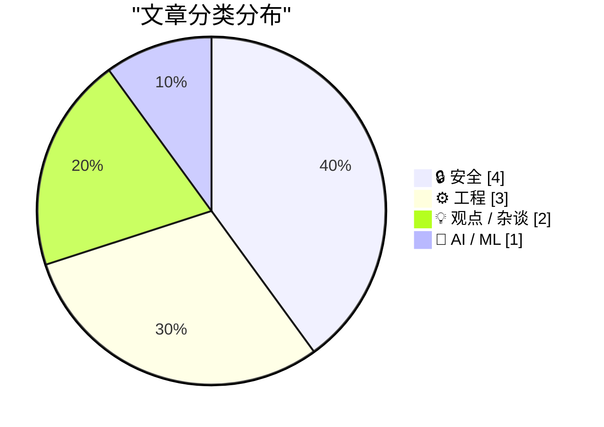
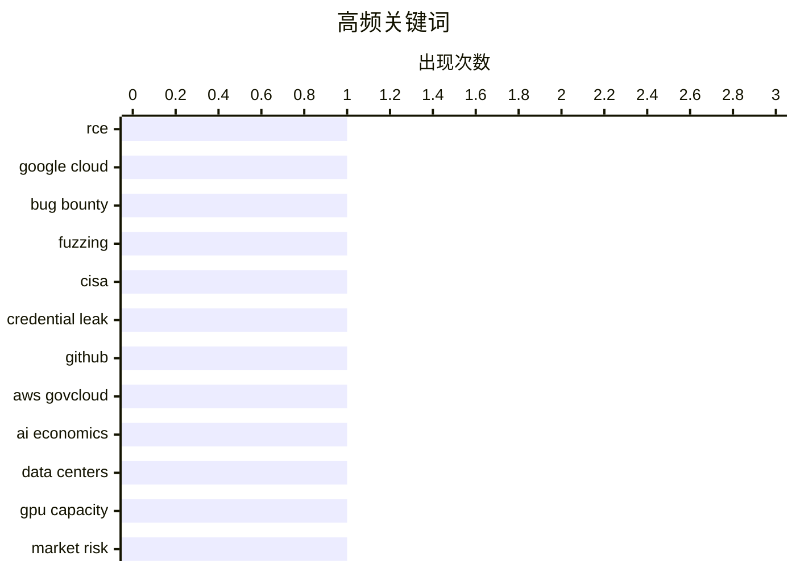

# 📰 AI 博客每日精选 — 2026-05-23

> 来自 Karpathy 推荐的 92 个顶级技术博客，AI 精选 Top 10

## 🏆 今日必读

🥇 **StubZero: $148,337 RCE in Google Cloud Production**

[StubZero: $148,337 RCE in Google Cloud Production](https://brutecat.com/articles/google-cloud-rce) — brutecat.com · 2026-06-01 · 🔒 安全

> Contents req2proto as a Service™ Leaking internal workflow execution queue Escalating further? The DM that changed everything Timeline (1st RCE) Round 2 (3 months later) Configuring internal task type

🏷️ RCE, Google Cloud, bug bounty, fuzzing

🥈 **Lawmakers Demand Answers as CISA Tries to Contain Data Leak**

[Lawmakers Demand Answers as CISA Tries to Contain Data Leak](https://krebsonsecurity.com/2026/05/lawmakers-demand-answers-as-cisa-tries-to-contain-data-leak/) — krebsonsecurity.com · 6 小时前 · 🔒 安全

> Lawmakers in both houses of Congress are demanding answers from the U.S. Cybersecurity & Infrastructure Security Agency (CISA) after KrebsOnSecurity reported this week that a CISA contractor intention

🏷️ CISA, credential leak, GitHub, AWS GovCloud

🥉 **Premium: What If...We're In An AI Bubble? (Part 2)**

[Premium: What If...We're In An AI Bubble? (Part 2)](https://www.wheresyoured.at/premium-what-if-were-in-an-ai-bubble-part-2/) — wheresyoured.at · 6 小时前 · 💡 观点 / 杂谈

> Premium: What If...We're In An AI Bubble? (Part 2) Ed Zitron May 22, 2026 33 min read Table of Contents Last week I ran the first part of my What If…We’re In An AI Bubble? Series, where I asked questi

🏷️ AI economics, data centers, GPU capacity, market risk

---

## 📊 数据概览

| 扫描源 | 抓取文章 | 时间范围 | 精选 |
|:---:|:---:|:---:|:---:|
| 88/92 | 2556 篇 → 20 篇 | 24h | **10 篇** |

### 分类分布



### 高频关键词



<details>
<summary>📈 纯文本关键词图（终端友好）</summary>

```
rce             │ ████████████████████ 1
google cloud    │ ████████████████████ 1
bug bounty      │ ████████████████████ 1
fuzzing         │ ████████████████████ 1
cisa            │ ████████████████████ 1
credential leak │ ████████████████████ 1
github          │ ████████████████████ 1
aws govcloud    │ ████████████████████ 1
ai economics    │ ████████████████████ 1
data centers    │ ████████████████████ 1
```

</details>

### 🏷️ 话题标签

**rce**(1) · **google cloud**(1) · **bug bounty**(1) · fuzzing(1) · cisa(1) · credential leak(1) · github(1) · aws govcloud(1) · ai economics(1) · data centers(1) · gpu capacity(1) · market risk(1) · openai(1) · operating margin(1) · chatgpt growth(1) · ai business(1) · dependencies(1) · supply chain(1) · cve(1) · lockfile(1)

---

## 🔒 安全

### 1. StubZero: $148,337 RCE in Google Cloud Production

[StubZero: $148,337 RCE in Google Cloud Production](https://brutecat.com/articles/google-cloud-rce) — **brutecat.com** · 2026-06-01 · ⭐ 27/30

> Contents req2proto as a Service™ Leaking internal workflow execution queue Escalating further? The DM that changed everything Timeline (1st RCE) Round 2 (3 months later) Configuring internal task type

🏷️ RCE, Google Cloud, bug bounty, fuzzing

---

### 2. Lawmakers Demand Answers as CISA Tries to Contain Data Leak

[Lawmakers Demand Answers as CISA Tries to Contain Data Leak](https://krebsonsecurity.com/2026/05/lawmakers-demand-answers-as-cisa-tries-to-contain-data-leak/) — **krebsonsecurity.com** · 6 小时前 · ⭐ 27/30

> Lawmakers in both houses of Congress are demanding answers from the U.S. Cybersecurity & Infrastructure Security Agency (CISA) after KrebsOnSecurity reported this week that a CISA contractor intention

🏷️ CISA, credential leak, GitHub, AWS GovCloud

---

### 3. Dependency Pruning

[Dependency Pruning](https://nesbitt.io/2026/05/22/dependency-pruning.html) — **nesbitt.io** · 13 小时前 · ⭐ 23/30

> The best time to prune your dependency tree was three years ago. The second best time is right now. Every package in your lockfile is a door someone else holds the key to. Install scripts run on your 

🏷️ dependencies, supply chain, CVE, lockfile

---

### 4. FTC to Require Cox Media Group, Two Other Firms to Pay Nearly $1 Million to Settle Charges They Deceived Customers About “Active Listening” AI-Powered Marketing Service

[FTC to Require Cox Media Group, Two Other Firms to Pay Nearly $1 Million to Settle Charges They Deceived Customers About “Active Listening” AI-Powered Marketing Service](https://simonwillison.net/2026/May/22/ftc-active-listening/#atom-everything) — **simonwillison.net** · 18 小时前 · ⭐ 20/30

> FTC to Require Cox Media Group, Two Other Firms to Pay Nearly $1 Million to Settle Charges They Deceived Customers About “Active Listening” AI-Powered Marketing Service ( via ) Back in 2024 Cox Media 

🏷️ FTC, adtech, privacy, voice data

---

## ⚙️ 工程

### 5. The memory shortage is causing a repricing of consumer electronics

[The memory shortage is causing a repricing of consumer electronics](https://simonwillison.net/2026/May/22/memory-shortage/#atom-everything) — **simonwillison.net** · 1 小时前 · ⭐ 21/30

> The memory shortage is causing a repricing of consumer electronics ( via ) David Oks provides the clearest explanation I've seen yet of why consumer products that use memory are likely to get signific

🏷️ HBM, DRAM, wafer capacity, consumer electronics

---

### 6. News about Raspberry Pi 6 and Microcontroller Development

[News about Raspberry Pi 6 and Microcontroller Development](https://www.jeffgeerling.com/blog/2026/news-about-raspberry-pi-6-and-microcontroller-development/) — **jeffgeerling.com** · 2 小时前 · ⭐ 21/30

> News about Raspberry Pi 6 and Microcontroller Development May 22, 2026 On Thursday, three of the lead Raspberry Pi engineers hosted an AMA on the r/engineering subreddit . Raspberry Pi 6 One of the mo

🏷️ Raspberry Pi 6, DRAM shortage, SBC, embedded

---

### 7. Reiner Pope – Chip design from the bottom up

[Reiner Pope – Chip design from the bottom up](https://www.dwarkesh.com/p/reiner-pope-2) — **dwarkesh.com** · 7 小时前 · ⭐ 19/30

> Playback speed × Share post Share post at current time Share from 0:00 0:00 / Transcript 21 2 1 Reiner Pope – Chip design from the bottom up Working up from basic logic gates to why GPUs, TPUs, FPGAs,

🏷️ chip design, GPU, TPU, FPGA

---

## 💡 观点 / 杂谈

### 8. Premium: What If...We're In An AI Bubble? (Part 2)

[Premium: What If...We're In An AI Bubble? (Part 2)](https://www.wheresyoured.at/premium-what-if-were-in-an-ai-bubble-part-2/) — **wheresyoured.at** · 6 小时前 · ⭐ 23/30

> Premium: What If...We're In An AI Bubble? (Part 2) Ed Zitron May 22, 2026 33 min read Table of Contents Last week I ran the first part of my What If…We’re In An AI Bubble? Series, where I asked questi

🏷️ AI economics, data centers, GPU capacity, market risk

---

### 9. This one weird trick might cost your retirement fund billions

[This one weird trick might cost your retirement fund billions](https://garymarcus.substack.com/p/this-one-weird-trick-might-cost-your) — **garymarcus.substack.com** · 9 小时前 · ⭐ 19/30

> This one weird trick might cost your retirement fund billions You should scream to your congresspeople Gary Marcus May 22, 2026 137 31 18 Share Part One: What’s a company worth? How much would you buy

🏷️ AI bubble, valuation, index funds, SpaceX IPO

---

## 🤖 AI / ML

### 10. News: OpenAI Had A Negative 122% Non-GAAP Operating Margin In Q1 2026, and ChatGPT Growth Has Stalled

[News: OpenAI Had A Negative 122% Non-GAAP Operating Margin In Q1 2026, and ChatGPT Growth Has Stalled](https://www.wheresyoured.at/news-openai-had-a-negative-122-operating-margin-in-q1-2026-and-chatgpt-growth-has-stalled/) — **wheresyoured.at** · 8 小时前 · ⭐ 23/30

> news News: OpenAI Had A Negative 122% Non-GAAP Operating Margin In Q1 2026, and ChatGPT Growth Has Stalled Ed Zitron May 22, 2026 4 min read Executive Summary: The Information reports that OpenAI gene

🏷️ OpenAI, operating margin, ChatGPT growth, AI business

---

*生成于 2026-05-23 07:04 | 扫描 88 源 → 获取 2556 篇 → 精选 10 篇*
*基于 [Hacker News Popularity Contest 2025](https://refactoringenglish.com/tools/hn-popularity/) RSS 源列表*
