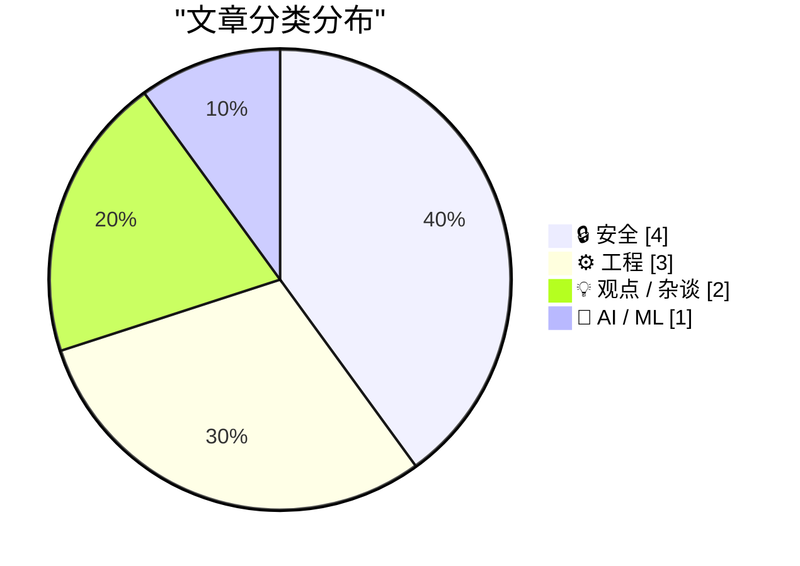
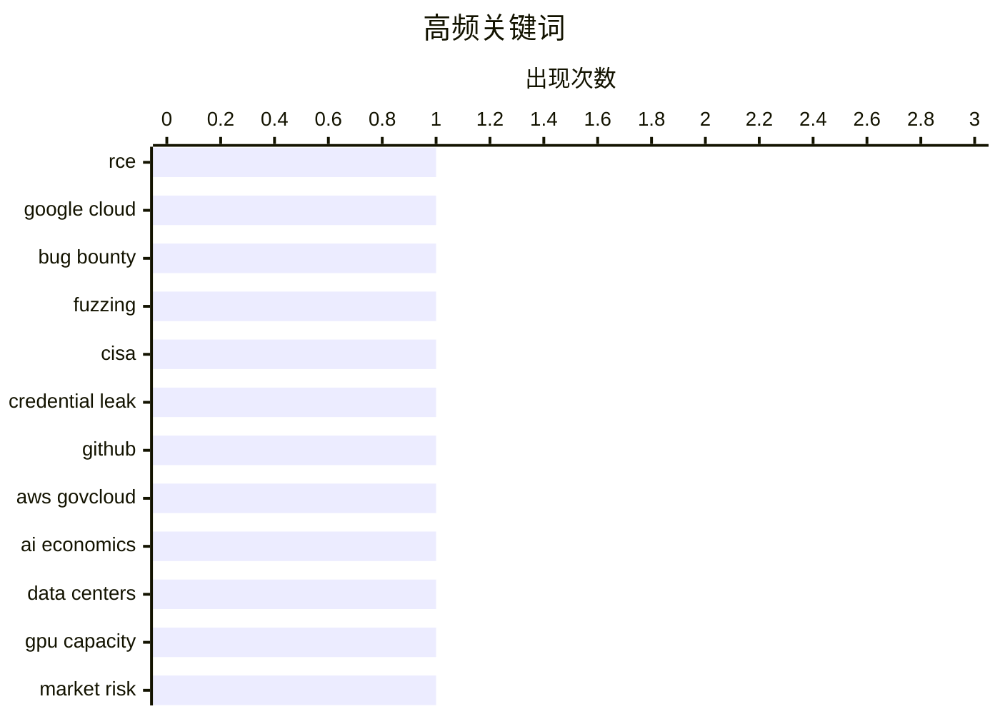

# 📰 AI 博客每日精选 — 2026-05-23

> 来自 Karpathy 推荐的 92 个顶级技术博客，AI 精选 Top 10

## 📝 今日看点

今日看点有三条主线：安全风险仍在从“代码漏洞”扩展到“内部接口、密钥、依赖和流程暴露”，Google Cloud RCE 与 CISA 密钥泄露都说明，调试端点、凭据管理和工作流配置一旦失控，影响会迅速放大。   供应链与硬件侧的压力也在变得具体：内存产能被 HBM 和 AI 数据中心挤压，已经影响消费电子和树莓派路线，依赖瘦身则提供了一个更朴素但有效的软件侧降风险办法。   AI 相关条目集中指向同一个问题：基础设施、资本市场和商业指标之间可能存在错配，OpenAI 的高亏损、数据中心债务风险，以及指数基金可能被动买入高估值科技公司，都在提醒市场不要只看增长叙事。   同时，FTC 对“主动监听”广告服务的处罚也说明，AI 包装并不能替代真实能力和合规同意。

---

## 🏆 今日必读

🥇 **StubZero：Google Cloud 生产环境 RCE 漏洞获 14.8 万美元赏金**

[StubZero: $148,337 RCE in Google Cloud Production](https://brutecat.com/articles/google-cloud-rce) — brutecat.com · 2026-06-01 · 🔒 安全

> 作者从一个 Google Cloud 相关 API 的公开调试端点入手，发现它可以泄露 Google 内部 protobuf 定义，从而让黑盒测试者还原许多内部接口的请求和响应结构。进一步测试中，作者利用响应格式切换和编码头绕过限制，解码出内部工作流执行队列，暴露了与 Spanner、Salesforce 同步等业务流程相关的信息。这些信息泄露让攻击面从单纯的调试接口问题扩大到对内部工作流机制的理解，并最终被串联成 Google Cloud 生产环境的远程代码执行漏洞。漏洞被 Google 评为高优先级并给予 148,337 美元奖励，编号为 CVE-2026-2031。文章还提到三个月后类似问题再次出现，说明同类内部接口暴露和工作流配置风险并非孤立事件。

💡 **为什么值得读**: 它完整展示了信息泄露如何一步步升级为云厂商生产环境 RCE，对 API 安全、内部调试端点治理和漏洞链构造都很有参考价值。

🏷️ RCE, Google Cloud, bug bounty, fuzzing

🥈 **CISA 承包商泄露大量密钥后，美国国会议员要求追责**

[Lawmakers Demand Answers as CISA Tries to Contain Data Leak](https://krebsonsecurity.com/2026/05/lawmakers-demand-answers-as-cisa-tries-to-contain-data-leak/) — krebsonsecurity.com · 6 小时前 · 🔒 安全

> KrebsOnSecurity 报道称，美国网络安全与基础设施安全局（CISA）一名承包商将 AWS GovCloud 密钥及大量内部系统凭据明文发布到公开 GitHub 仓库，引发国会两院议员质询。该仓库名为“Private-CISA”，据安全专家判断可能自 2025 年 11 月起存在，并显示发布者曾关闭 GitHub 对敏感凭据公开提交的内置保护。CISA 表示没有迹象表明敏感数据已被泄露，但报道指出，在收到安全公司 GitGuardian 通知一周多后，机构仍在轮换和作废部分泄露凭据。安全研究人员称，某个暴露的 RSA 私钥曾可访问 CISA 企业 GitHub 应用，并可能读取私有代码库、篡改 CI/CD 流水线或更改仓库安全设置。参议员 Maggie Hassan 和众议员 Bennie Thompson 等人要求 CISA 解释内部控制、承包商管理和事件响应情况，并将此事与 CISA 近期人员流失和安全文化弱化联系起来。文章还指出，公开代码平台的提交流常被攻击者监控，因此这类密钥泄露很可能在短时间内被犯罪团伙或外国对手发现。

💡 **为什么值得读**: 这篇文章揭示了负责保护美国关键基础设施的机构自身在密钥管理、承包商权限和事件响应上的严重风险。

🏷️ CISA, credential leak, GitHub, AWS GovCloud

🥉 **如果我们正处在 AI 泡沫中：数据中心、GPU 与债务的连锁风险**

[Premium: What If...We're In An AI Bubble? (Part 2)](https://www.wheresyoured.at/premium-what-if-were-in-an-ai-bubble-part-2/) — wheresyoured.at · 6 小时前 · 💡 观点 / 杂谈

> 文章延续作者关于“AI 是否处在泡沫中”的系列讨论，重点分析 AI 基础设施扩张如果放缓可能带来的连锁后果。作者认为，市场常把“AI 很贵”“数据中心建设慢”“算力紧缺”等事实分开看，却忽视它们叠加后会影响 OpenAI、Anthropic、云厂商、CoreWeave、英伟达以及数据中心债务市场。文中指出，当前所谓“算力需求旺盛”很大程度上由少数大客户和超大云厂商支撑，并不等于存在广泛、可持续的分布式需求。若数据中心无法按预期建成，大量 GPU 可能滞留、过时或被减记，相关项目融资也可能难以偿还。作者还质疑硬件销售额本身能否证明终端 AI 服务需求真实存在，认为供应链繁荣可能掩盖了商业模式和资本开支之间的错配。

💡 **为什么值得读**: 它把 AI 热潮背后的算力、资本开支、数据中心建设和债务风险串联起来，提供了一个审视 AI 泡沫的系统性框架。

🏷️ AI economics, data centers, GPU capacity, market risk

---

## 📊 数据概览

| 扫描源 | 抓取文章 | 时间范围 | 精选 |
|:---:|:---:|:---:|:---:|
| 88/92 | 2556 篇 → 20 篇 | 24h | **10 篇** |

### 分类分布



### 高频关键词



<details>
<summary>📈 纯文本关键词图（终端友好）</summary>

```
rce             │ ████████████████████ 1
google cloud    │ ████████████████████ 1
bug bounty      │ ████████████████████ 1
fuzzing         │ ████████████████████ 1
cisa            │ ████████████████████ 1
credential leak │ ████████████████████ 1
github          │ ████████████████████ 1
aws govcloud    │ ████████████████████ 1
ai economics    │ ████████████████████ 1
data centers    │ ████████████████████ 1
```

</details>

### 🏷️ 话题标签

**rce**(1) · **google cloud**(1) · **bug bounty**(1) · fuzzing(1) · cisa(1) · credential leak(1) · github(1) · aws govcloud(1) · ai economics(1) · data centers(1) · gpu capacity(1) · market risk(1) · openai(1) · operating margin(1) · chatgpt growth(1) · ai business(1) · dependencies(1) · supply chain(1) · cve(1) · lockfile(1)

---

## 🔒 安全

### 1. StubZero：Google Cloud 生产环境 RCE 漏洞获 14.8 万美元赏金

[StubZero: $148,337 RCE in Google Cloud Production](https://brutecat.com/articles/google-cloud-rce) — **brutecat.com** · 2026-06-01 · ⭐ 27/30

> 作者从一个 Google Cloud 相关 API 的公开调试端点入手，发现它可以泄露 Google 内部 protobuf 定义，从而让黑盒测试者还原许多内部接口的请求和响应结构。进一步测试中，作者利用响应格式切换和编码头绕过限制，解码出内部工作流执行队列，暴露了与 Spanner、Salesforce 同步等业务流程相关的信息。这些信息泄露让攻击面从单纯的调试接口问题扩大到对内部工作流机制的理解，并最终被串联成 Google Cloud 生产环境的远程代码执行漏洞。漏洞被 Google 评为高优先级并给予 148,337 美元奖励，编号为 CVE-2026-2031。文章还提到三个月后类似问题再次出现，说明同类内部接口暴露和工作流配置风险并非孤立事件。

🏷️ RCE, Google Cloud, bug bounty, fuzzing

---

### 2. CISA 承包商泄露大量密钥后，美国国会议员要求追责

[Lawmakers Demand Answers as CISA Tries to Contain Data Leak](https://krebsonsecurity.com/2026/05/lawmakers-demand-answers-as-cisa-tries-to-contain-data-leak/) — **krebsonsecurity.com** · 6 小时前 · ⭐ 27/30

> KrebsOnSecurity 报道称，美国网络安全与基础设施安全局（CISA）一名承包商将 AWS GovCloud 密钥及大量内部系统凭据明文发布到公开 GitHub 仓库，引发国会两院议员质询。该仓库名为“Private-CISA”，据安全专家判断可能自 2025 年 11 月起存在，并显示发布者曾关闭 GitHub 对敏感凭据公开提交的内置保护。CISA 表示没有迹象表明敏感数据已被泄露，但报道指出，在收到安全公司 GitGuardian 通知一周多后，机构仍在轮换和作废部分泄露凭据。安全研究人员称，某个暴露的 RSA 私钥曾可访问 CISA 企业 GitHub 应用，并可能读取私有代码库、篡改 CI/CD 流水线或更改仓库安全设置。参议员 Maggie Hassan 和众议员 Bennie Thompson 等人要求 CISA 解释内部控制、承包商管理和事件响应情况，并将此事与 CISA 近期人员流失和安全文化弱化联系起来。文章还指出，公开代码平台的提交流常被攻击者监控，因此这类密钥泄露很可能在短时间内被犯罪团伙或外国对手发现。

🏷️ CISA, credential leak, GitHub, AWS GovCloud

---

### 3. 依赖瘦身：如何找出项目里没用或用得太少的包

[Dependency Pruning](https://nesbitt.io/2026/05/22/dependency-pruning.html) — **nesbitt.io** · 13 小时前 · ⭐ 23/30

> 这篇文章把“删除无用依赖”视为一种低成本的供应链安全措施：不再使用的包仍然可能触发 CVE、安装脚本风险、维护者账号被接管等问题，因此能删就比单纯升级更彻底。作者区分了两类问题：一种是清单里声明了但代码完全没有导入的依赖，另一种是虽然导入了但实际只使用了库中极小一部分能力的“低利用率依赖”。文章重点盘点了各语言生态中的检测工具，例如 Python 的 deptry、creosote、FawltyDeps、pip-check-reqs，JavaScript 的 knip，Rust 的 unused_crate_dependencies、cargo-machete、cargo-shear、cargo-udeps 等。作者也提到，能衡量“实际触达了依赖多少代码”的工具更少，Python 的 unladen 是少数尝试通过调用图计算 heft ratio 的项目。整体建议是把依赖审计纳入日常维护：遇到安全告警或版本升级时，先判断是否还能删除该依赖，而不是默认继续保留并打补丁。

🏷️ dependencies, supply chain, CVE, lockfile

---

### 4. FTC 处罚 Cox Media 等公司：所谓“主动监听”AI 广告服务并未真的监听用户对话

[FTC to Require Cox Media Group, Two Other Firms to Pay Nearly $1 Million to Settle Charges They Deceived Customers About “Active Listening” AI-Powered Marketing Service](https://simonwillison.net/2026/May/22/ftc-active-listening/#atom-everything) — **simonwillison.net** · 18 小时前 · ⭐ 20/30

> 美国 FTC 要求 Cox Media Group、MindSift 和 1010 Digital Works 支付近 100 万美元，以和解其“主动监听”AI 营销服务的欺骗性宣传指控。这些公司曾向广告客户宣称，智能设备会实时监听消费者对话，并把语音意图数据与行为数据结合用于广告定向。FTC 的投诉称，该服务实际上并没有监听用户谈话，也没有使用语音数据，而主要是以较高加价转售来自数据经纪商的电子邮件名单。FTC 同时指出，把所谓语音数据使用授权藏在应用服务条款里，并不能构成有效的“选择加入”同意；如果服务真按宣传那样运行，也可能因未经充分同意收集家庭语音数据而违法。文章作者认为，这起案例更像是广告公司把常规定向广告包装成听起来很先进的概念，结果引发了关于设备麦克风监听的恐慌。

🏷️ FTC, adtech, privacy, voice data

---

## ⚙️ 工程

### 5. 内存短缺正在重估消费电子价格

[The memory shortage is causing a repricing of consumer electronics](https://simonwillison.net/2026/May/22/memory-shortage/#atom-everything) — **simonwillison.net** · 1 小时前 · ⭐ 21/30

> 文章解释了为什么未来几年使用内存的消费电子产品可能明显涨价。全球大型内存制造商只剩少数几家，晶圆处理能力相对固定，产能需要在桌面和服务器用 DDR、手机和低功耗设备用 LPDDR，以及 GPU 所需的 HBM 之间分配。AI 数据中心需求暴涨，使 HBM 在晶圆分配中的占比从过去约 2% 快速上升，预计到 2026 年底达到 20%，而每 GB HBM 消耗的晶圆产能又远高于普通 DDR 或 LPDDR。由于 HBM 利润更高、需求更强，内存厂商更倾向于把有限产能投向它，从而挤压消费设备 RAM 的供应。低价智能手机市场已经开始受到影响，这对非洲、南亚等依赖百美元以下手机的地区尤其重要。

🏷️ HBM, DRAM, wafer capacity, consumer electronics

---

### 6. 树莓派 6 或推迟到 2028 年，Zero 与 Pico 也受供应和成本约束

[News about Raspberry Pi 6 and Microcontroller Development](https://www.jeffgeerling.com/blog/2026/news-about-raspberry-pi-6-and-microcontroller-development/) — **jeffgeerling.com** · 2 小时前 · ⭐ 21/30

> 文章整理了树莓派工程师在 Reddit AMA 中透露的产品路线信息。树莓派 6 很可能不会按以往 3 到 4 年节奏在 2026 或 2027 年推出，Eben 暗示时间可能拉长到 2028 年初之后，部分原因是全球 DRAM 短缺会推高整机成本。下一代主板的重点看起来会是更快的 CPU 和 I/O，而不是内置 M.2、更多接口或专用 AI 加速器。Pi Zero 2 W 的缺货主要来自基板和晶圆产能紧张，Zero 3 也受单面 PCB、封装内存和低价 LPDDR 成本限制，短期内不太明朗。微控制器方面，RP2350 开发中遇到功耗和安全挑战，后续硅修订修复了漏电问题；Pico 继续使用 micro USB 主要是成本考量。文章还指出，树莓派的软件支持仍是其相对其他嵌入式平台的重要优势，工程团队计划把大量精力投入库、驱动、内核和系统维护。

🏷️ Raspberry Pi 6, DRAM shortage, SBC, embedded

---

### 7. Reiner Pope：从逻辑门开始理解芯片设计

[Reiner Pope – Chip design from the bottom up](https://www.dwarkesh.com/p/reiner-pope-2) — **dwarkesh.com** · 7 小时前 · ⭐ 19/30

> 这期黑板讲解从最基础的 AND、OR、NOT 等逻辑门出发，逐步解释 AI 芯片如何完成核心计算。Reiner Pope 以矩阵乘法中的 multiply-accumulate（乘加）为主线，说明为什么 AI 芯片常用低精度乘法和更高精度累加，以及误差如何在累加中放大。内容进一步讨论数据移动成本、mux、脉动阵列、时钟周期和流水线寄存器等概念，帮助读者理解芯片性能并不只取决于算力本身。访谈还比较了 FPGA 与 ASIC、缓存与 scratchpad、CPU 核与 GPU 核的差异，并解释 GPU、TPU 和人脑在结构上为什么呈现不同形态。整体是一篇从底层电路一路搭到现代 AI 加速器架构的技术入门。

🏷️ chip design, GPU, TPU, FPGA

---

## 💡 观点 / 杂谈

### 8. 如果我们正处在 AI 泡沫中：数据中心、GPU 与债务的连锁风险

[Premium: What If...We're In An AI Bubble? (Part 2)](https://www.wheresyoured.at/premium-what-if-were-in-an-ai-bubble-part-2/) — **wheresyoured.at** · 6 小时前 · ⭐ 23/30

> 文章延续作者关于“AI 是否处在泡沫中”的系列讨论，重点分析 AI 基础设施扩张如果放缓可能带来的连锁后果。作者认为，市场常把“AI 很贵”“数据中心建设慢”“算力紧缺”等事实分开看，却忽视它们叠加后会影响 OpenAI、Anthropic、云厂商、CoreWeave、英伟达以及数据中心债务市场。文中指出，当前所谓“算力需求旺盛”很大程度上由少数大客户和超大云厂商支撑，并不等于存在广泛、可持续的分布式需求。若数据中心无法按预期建成，大量 GPU 可能滞留、过时或被减记，相关项目融资也可能难以偿还。作者还质疑硬件销售额本身能否证明终端 AI 服务需求真实存在，认为供应链繁荣可能掩盖了商业模式和资本开支之间的错配。

🏷️ AI economics, data centers, GPU capacity, market risk

---

### 9. 一个指数规则变动，可能让你的退休基金被动买入高估值 SpaceX

[This one weird trick might cost your retirement fund billions](https://garymarcus.substack.com/p/this-one-weird-trick-might-cost-your) — **garymarcus.substack.com** · 9 小时前 · ⭐ 19/30

> 文章讨论了 SpaceX 可能 IPO 时的高估值风险，以及这种风险为什么不只影响主动认购新股的人。作者指出，许多退休账户通过指数基金间接持有标普 500 成分股，而标普正在考虑放宽新上市公司进入指数的规则，包括缩短 IPO 后等待时间、对超大市值公司放宽盈利要求等。如果这些规则变化落地，像 SpaceX 这样估值很高但盈利稳定性尚未充分验证的公司，可能更快被纳入指数，迫使大量指数基金自动买入。作者认为，这会把早期定价可能过高的风险转嫁给普通退休投资者；类似逻辑未来也可能适用于 OpenAI、Anthropic 等大型科技公司 IPO。文章的核心担忧不是某家公司一定会失败，而是指数规则可能让普通投资者在缺少选择权的情况下承担高度投机资产的估值风险。

🏷️ AI bubble, valuation, index funds, SpaceX IPO

---

## 🤖 AI / ML

### 10. OpenAI 2026 年一季度非 GAAP 经营利润率为 -122%，ChatGPT 增长放缓

[News: OpenAI Had A Negative 122% Non-GAAP Operating Margin In Q1 2026, and ChatGPT Growth Has Stalled](https://www.wheresyoured.at/news-openai-had-a-negative-122-operating-margin-in-q1-2026-and-chatgpt-growth-has-stalled/) — **wheresyoured.at** · 8 小时前 · ⭐ 23/30

> 文章根据 The Information 的报道称，OpenAI 2026 年一季度收入约为 57 亿美元，但调整后经营利润率为 -122%，意味着每赚 1 美元收入还要额外亏损约 1.22 美元。作者指出，这一口径排除了股权激励等大项，且未明确是否包含训练成本，因此实际亏损和利润率可能更差。即便 OpenAI 有望达到 2026 年 300 亿美元收入目标，如果维持该利润率，全年亏损规模可能超过 360 亿美元。文章还认为 ChatGPT 用户增长出现停滞：一季度平均周活约 9.05 亿，低于此前冲击 10 亿周活的预期。付费用户约 5500 万，对应转化率大约 6%，作者怀疑增长部分来自低价或促销订阅。文章进一步把 OpenAI 与 Anthropic 的财务叙事放在一起比较，认为两家公司都在向投资者展示更接近“真实公司”的经营指标，但生成式 AI 的核心成本结构并未根本改善。

🏷️ OpenAI, operating margin, ChatGPT growth, AI business

---

*生成于 2026-05-23 07:04 | 扫描 88 源 → 获取 2556 篇 → 精选 10 篇*
*基于 [Hacker News Popularity Contest 2025](https://refactoringenglish.com/tools/hn-popularity/) RSS 源列表*
