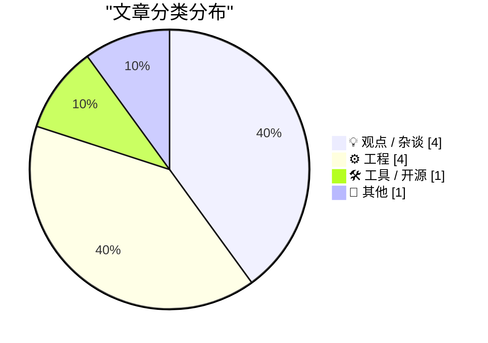
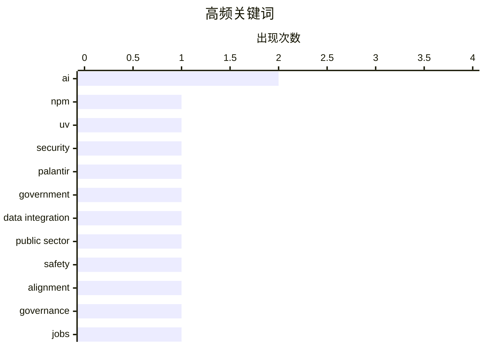

# 📰 AI 博客每日精选 — 2026-05-24

> 来自 Karpathy 推荐的 92 个顶级技术博客，AI 精选 Top 10

## 🏆 今日必读

🥇 **This Week in Package Management: 23 May 2026**

[This Week in Package Management: 23 May 2026](https://nesbitt.io/2026/05/23/this-week-in-package-management.html) — nesbitt.io · 13 小时前 · 🛠 工具 / 开源

> I’m trying out a weekly roundup built from the package manager OPML feed collection and whatever I’ve posted or boosted on Mastodon . npm is removing npm-shrinkwrap.json entirely in the v12 prerelease

🏷️ npm, uv, security

🥈 **Some notes on how we ended up with Palantir & how to replace it**

[Some notes on how we ended up with Palantir & how to replace it](https://berthub.eu/articles/posts/some-notes-on-palantir/) — berthub.eu · 14 小时前 · 💡 观点 / 杂谈

> There is justified anger about governments relying on Palantir software. There are also calls to write replacement software, perhaps imbued with European values, and with less fascism. And I&rsquo;d l

🏷️ Palantir, government, data integration, public sector

🥉 **There is only one bad AI scenario**

[There is only one bad AI scenario](https://geohot.github.io//blog/jekyll/update/2026/05/23/one-bad-scenario.html) — geohot.github.io · 16 小时前 · 💡 观点 / 杂谈

> I’ve pushed AI doomers on how exactly the AI kills us, and I’ve never heard a good answer. I think Skynet style scenarios where humanity is largely opposed to an out of control AI are science fiction 

🏷️ AI, safety, alignment, governance

---

## 📊 数据概览

| 扫描源 | 抓取文章 | 时间范围 | 精选 |
|:---:|:---:|:---:|:---:|
| 87/92 | 2547 篇 → 12 篇 | 24h | **10 篇** |

### 分类分布



### 高频关键词



<details>
<summary>📈 纯文本关键词图（终端友好）</summary>

```
ai               │ ████████████████████ 2
npm              │ ██████████░░░░░░░░░░ 1
uv               │ ██████████░░░░░░░░░░ 1
security         │ ██████████░░░░░░░░░░ 1
palantir         │ ██████████░░░░░░░░░░ 1
government       │ ██████████░░░░░░░░░░ 1
data integration │ ██████████░░░░░░░░░░ 1
public sector    │ ██████████░░░░░░░░░░ 1
safety           │ ██████████░░░░░░░░░░ 1
alignment        │ ██████████░░░░░░░░░░ 1
```

</details>

### 🏷️ 话题标签

**ai**(2) · **npm**(1) · **uv**(1) · security(1) · palantir(1) · government(1) · data integration(1) · public sector(1) · safety(1) · alignment(1) · governance(1) · jobs(1) · eric schmidt(1) · reverse engineering(1) · computer history(1) · spacelab(1) · html(1) · accessibility(1) · aria(1) · infrastructure(1)

---

## 💡 观点 / 杂谈

### 1. Some notes on how we ended up with Palantir & how to replace it

[Some notes on how we ended up with Palantir & how to replace it](https://berthub.eu/articles/posts/some-notes-on-palantir/) — **berthub.eu** · 14 小时前 · ⭐ 24/30

> There is justified anger about governments relying on Palantir software. There are also calls to write replacement software, perhaps imbued with European values, and with less fascism. And I&rsquo;d l

🏷️ Palantir, government, data integration, public sector

---

### 2. There is only one bad AI scenario

[There is only one bad AI scenario](https://geohot.github.io//blog/jekyll/update/2026/05/23/one-bad-scenario.html) — **geohot.github.io** · 16 小时前 · ⭐ 22/30

> I’ve pushed AI doomers on how exactly the AI kills us, and I’ve never heard a good answer. I think Skynet style scenarios where humanity is largely opposed to an out of control AI are science fiction 

🏷️ AI, safety, alignment, governance

---

### 3. The commencement speech that shook the world

[The commencement speech that shook the world](https://idiallo.com/blog/the-commencement-speech-that-shook-the-world?src=feed) — **idiallo.com** · 21 小时前 · ⭐ 21/30

> There he was, the man at the helm of innovation. Eric Schmidt, the former CEO of Google. The man who once said, google doesn't need to record your conversation, it already knows everything about you. 

🏷️ AI, jobs, Eric Schmidt

---

### 4. Which age-gates should be skill-gates and vice-versa?

[Which age-gates should be skill-gates and vice-versa?](https://shkspr.mobi/blog/2026/05/which-age-gates-should-be-skill-gates-and-vice-versa/) — **shkspr.mobi** · 11 小时前 · ⭐ 15/30

> Which age-gates should be skill-gates and vice-versa? politics thoughts · 4 comments · 650 words · Viewed ~515 times In the UK, it is illegal to buy alcohol if you are under 18 . Similarly, in most co

🏷️ voting, age-gate, skills

---

## ⚙️ 工程

### 5. Reverse engineering circuitry in a Spacelab computer from 1980

[Reverse engineering circuitry in a Spacelab computer from 1980](http://www.righto.com/feeds/872292081485114047/comments/default) — **righto.com** · 6 小时前 · ⭐ 18/30

> tag:blogger.com,1999:blog-6264947694886887540.post872292081485114047..comments 2026-05-23T11:04:47.313-07:00 Comments on Ken Shirriff's blog: Reverse engineering circuitry in a Spacelab computer from 

🏷️ reverse engineering, computer history, Spacelab

---

### 6. On the

[On the](https://simonwillison.net/2026/May/23/on-the-dl/#atom-everything) — **simonwillison.net** · 2 小时前 · ⭐ 17/30

> On the ( via ) I learned a few new-to-me things about the element from this article by Ben Meyer: A can be followed by multiple You can optionally group the and elements in a for styling - but only a 

🏷️ HTML, accessibility, ARIA

---

### 7. Real and imaginary parts

[Real and imaginary parts](https://www.johndcook.com/blog/2026/05/23/real-and-imaginary-parts/) — **johndcook.com** · 9 小时前 · ⭐ 14/30

> The previous post announced some notes I wrote up based on an article by Henry Baker implementing functions of a complex variable in terms of functions of a real variable. That is, it finds functions 

🏷️ complex analysis, harmonic, Laplace

---

### 8. Building complex functions out of real parts

[Building complex functions out of real parts](https://www.johndcook.com/blog/2026/05/22/complex-functions-real-parts/) — **johndcook.com** · 19 小时前 · ⭐ 14/30

> A couple months ago I wrote about how to compute the sine and cosine of a complex number using only real functions of real variables using the equations You can do something analogous for all the elem

🏷️ complex functions, branch cuts, Python

---

## 🛠 工具 / 开源

### 9. This Week in Package Management: 23 May 2026

[This Week in Package Management: 23 May 2026](https://nesbitt.io/2026/05/23/this-week-in-package-management.html) — **nesbitt.io** · 13 小时前 · ⭐ 25/30

> I’m trying out a weekly roundup built from the package manager OPML feed collection and whatever I’ve posted or boosted on Mastodon . npm is removing npm-shrinkwrap.json entirely in the v12 prerelease

🏷️ npm, uv, security

---

## 📝 其他

### 10. Reading List 05/23/26

[Reading List 05/23/26](https://www.construction-physics.com/p/reading-list-052326) — **construction-physics.com** · 11 小时前 · ⭐ 16/30

> Reading List 05/23/26 Squatter removal services, Apple finding uses for defective chips, process heat use in California, the brewing Colorado River crisis, and more. Brian Potter May 23, 2026 ∙ Paid 7

🏷️ infrastructure, supply chains, energy

---

*生成于 2026-05-24 07:04 | 扫描 87 源 → 获取 2547 篇 → 精选 10 篇*
*基于 [Hacker News Popularity Contest 2025](https://refactoringenglish.com/tools/hn-popularity/) RSS 源列表*
