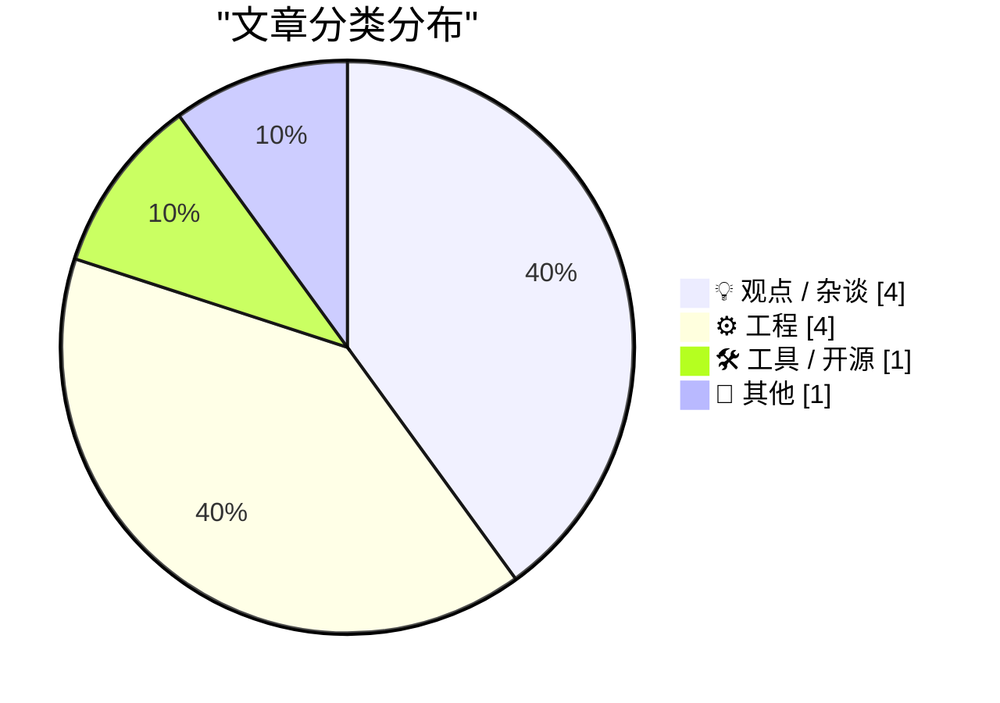
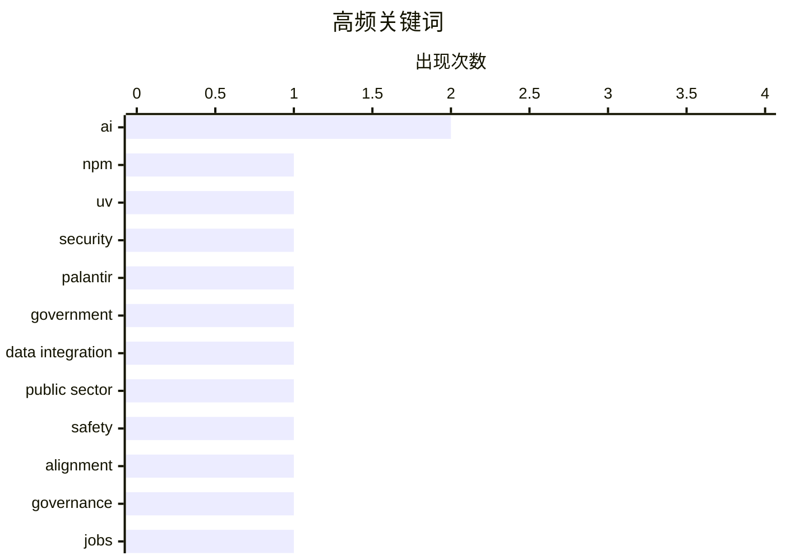

# 📰 AI 博客每日精选 — 2026-05-24

> 来自 Karpathy 推荐的 92 个顶级技术博客，AI 精选 Top 10

## 📝 今日看点

今日看点集中在三个方向：一是公共机构与大型技术供应商的关系，Palantir 的案例说明，真正难替代的往往不是软件界面，而是数据整合、现场支持和长期缺失的内部技术能力。二是 AI 讨论从“会不会失控”转向“谁来决定用途”：无论是对安全主义控制层的担忧，还是毕业生对 AI 必然论的嘘声，都在提醒技术并不天然等于命运。三是基础设施与底层技术仍有许多具体而细碎的工程问题，从包管理供应链安全、航天计算机逆向，到复分析公式和 HTML 语义细节，价值更多来自耐心梳理边界条件，而不是宏大叙事。另一个横向问题是规则设计：年龄门槛、能力门槛、住房规范和制造良率这些案例，都在追问制度如何在效率、风险和公平之间划线。

---

## 🏆 今日必读

🥇 **本周包管理动态：npm、uv、Deno、GitHub 与供应链安全更新**

[This Week in Package Management: 23 May 2026](https://nesbitt.io/2026/05/23/this-week-in-package-management.html) — nesbitt.io · 13 小时前 · 🛠 工具 / 开源

> 本期汇总了包管理生态在 2026 年 5 月下旬的重要发布、安全通告和文章。npm v12 预发布版将彻底移除 npm-shrinkwrap.json 相关支持，并引入 staged publishing 与安装来源控制，强化发布和安装环节的安全边界。安全方面，uv 修复 TAR 解析和脚本目录逃逸问题，并开始在审计中拒绝匹配已知恶意软件记录的锁定安装；Ruby 4.0.5 修复 CVE-2026-46727。文章还关注了 GitHub 内部仓库外泄、Nx Console 被投毒 VS Code 扩展攻破等事件，强调“最小发布时间”这类机制不能被简单当作安全控制。发布动态包括 Deno 2.8 更深度拥抱 npm、pnpm 试验 Rust 安装物化、conda 支持条件依赖和可选依赖组，以及 Homebrew、RubyGems、Verdaccio、PDM 等工具的版本更新。生态文章部分还提到 Go 官方 pkg.go.dev API、.NET 10 包裁剪、PHP 基金会安全团队、PyPI 令牌收窄工具和包差异分析工具等。

💡 **为什么值得读**: 它集中呈现了包管理器、供应链攻击和开源生态治理的最新变化，适合依赖大量第三方包的开发者和安全团队快速掌握风险与趋势。

🏷️ npm, uv, security

🥈 **为什么政府离不开 Palantir，以及替代它真正需要什么**

[Some notes on how we ended up with Palantir & how to replace it](https://berthub.eu/articles/posts/some-notes-on-palantir/) — berthub.eu · 14 小时前 · 💡 观点 / 杂谈

> 文章指出，政府依赖 Palantir 的原因不只是软件本身，也不一定只源于政治立场上的亲近。Palantir 真正有吸引力的地方在于它把软件、数据集成和现场咨询支持打包提供，帮助政府部门把分散的数据系统接起来并交付可用工具。许多政府和警务机构长期没有投入足够的内部 IT 能力，技术岗位薪酬和成长环境也难以吸引人才，因此外部供应商实际上承担了关键的数据运营工作。作者认为，想替代 Palantir 不能只写一个“价值观更好”的同类软件，还必须提供同等水平的集成、支持和迁移能力，或者推动政府重新建设自己的技术团队。文章还建议记者追问 Palantir 人员在政府现场工作的范围、数据访问监督、成本结构、安全审查以及退出计划等问题。

💡 **为什么值得读**: 它把“替代 Palantir”这个看似软件采购的问题，拆解为政府技术能力、外包依赖和数据治理风险的系统性问题。

🏷️ Palantir, government, data integration, public sector

🥉 **唯一真正糟糕的 AI 结局**

[There is only one bad AI scenario](https://geohot.github.io//blog/jekyll/update/2026/05/23/one-bad-scenario.html) — geohot.github.io · 16 小时前 · 💡 观点 / 杂谈

> 作者认为，传统的 AI 灾难叙事——例如机器突然反叛人类、Skynet 式战争或灰蛊吞噬世界——并不可信，因为它们都假设现实会发生过于剧烈的断裂。更可能的危险不是 AI 直接杀死人类，而是 AI 强化现有社会中以“安全、便利、可管理”为名的控制冲动，让现实越来越被技术系统中介和规训。文章指出，人类社会即使经历极权控制，也仍受繁衍、随机性和外部现实的约束；真正危险的是出现一个没有外部、没有竞争者、没有不可控演化过程的“单一控制层”。在这样的系统里，所有暴力和意外都可能被安全主义逻辑压制，任何独立行动者都无法对系统施加代价，现实也无法再纠正它。作者将这种结局称为 AI 时代最可信的末日场景：不是机器大战，而是开放式演化被缓慢、温和、行政化地终结。

💡 **为什么值得读**: 它把 AI 风险从科幻式反叛转向制度、技术治理和安全主义的长期耦合，提供了一个更现实也更不舒服的思考框架。

🏷️ AI, safety, alignment, governance

---

## 📊 数据概览

| 扫描源 | 抓取文章 | 时间范围 | 精选 |
|:---:|:---:|:---:|:---:|
| 87/92 | 2547 篇 → 12 篇 | 24h | **10 篇** |

### 分类分布



### 高频关键词



<details>
<summary>📈 纯文本关键词图（终端友好）</summary>

```
ai               │ ████████████████████ 2
npm              │ ██████████░░░░░░░░░░ 1
uv               │ ██████████░░░░░░░░░░ 1
security         │ ██████████░░░░░░░░░░ 1
palantir         │ ██████████░░░░░░░░░░ 1
government       │ ██████████░░░░░░░░░░ 1
data integration │ ██████████░░░░░░░░░░ 1
public sector    │ ██████████░░░░░░░░░░ 1
safety           │ ██████████░░░░░░░░░░ 1
alignment        │ ██████████░░░░░░░░░░ 1
```

</details>

### 🏷️ 话题标签

**ai**(2) · **npm**(1) · **uv**(1) · security(1) · palantir(1) · government(1) · data integration(1) · public sector(1) · safety(1) · alignment(1) · governance(1) · jobs(1) · eric schmidt(1) · reverse engineering(1) · computer history(1) · spacelab(1) · html(1) · accessibility(1) · aria(1) · infrastructure(1)

---

## 💡 观点 / 杂谈

### 1. 为什么政府离不开 Palantir，以及替代它真正需要什么

[Some notes on how we ended up with Palantir & how to replace it](https://berthub.eu/articles/posts/some-notes-on-palantir/) — **berthub.eu** · 14 小时前 · ⭐ 24/30

> 文章指出，政府依赖 Palantir 的原因不只是软件本身，也不一定只源于政治立场上的亲近。Palantir 真正有吸引力的地方在于它把软件、数据集成和现场咨询支持打包提供，帮助政府部门把分散的数据系统接起来并交付可用工具。许多政府和警务机构长期没有投入足够的内部 IT 能力，技术岗位薪酬和成长环境也难以吸引人才，因此外部供应商实际上承担了关键的数据运营工作。作者认为，想替代 Palantir 不能只写一个“价值观更好”的同类软件，还必须提供同等水平的集成、支持和迁移能力，或者推动政府重新建设自己的技术团队。文章还建议记者追问 Palantir 人员在政府现场工作的范围、数据访问监督、成本结构、安全审查以及退出计划等问题。

🏷️ Palantir, government, data integration, public sector

---

### 2. 唯一真正糟糕的 AI 结局

[There is only one bad AI scenario](https://geohot.github.io//blog/jekyll/update/2026/05/23/one-bad-scenario.html) — **geohot.github.io** · 16 小时前 · ⭐ 22/30

> 作者认为，传统的 AI 灾难叙事——例如机器突然反叛人类、Skynet 式战争或灰蛊吞噬世界——并不可信，因为它们都假设现实会发生过于剧烈的断裂。更可能的危险不是 AI 直接杀死人类，而是 AI 强化现有社会中以“安全、便利、可管理”为名的控制冲动，让现实越来越被技术系统中介和规训。文章指出，人类社会即使经历极权控制，也仍受繁衍、随机性和外部现实的约束；真正危险的是出现一个没有外部、没有竞争者、没有不可控演化过程的“单一控制层”。在这样的系统里，所有暴力和意外都可能被安全主义逻辑压制，任何独立行动者都无法对系统施加代价，现实也无法再纠正它。作者将这种结局称为 AI 时代最可信的末日场景：不是机器大战，而是开放式演化被缓慢、温和、行政化地终结。

🏷️ AI, safety, alignment, governance

---

### 3. 那场震动全场的毕业演讲：当毕业生用嘘声回应 AI 必然论

[The commencement speech that shook the world](https://idiallo.com/blog/the-commencement-speech-that-shook-the-world?src=feed) — **idiallo.com** · 21 小时前 · ⭐ 21/30

> 文章评论了前 Google CEO Eric Schmidt 面向 2026 届毕业生的一场演讲：他试图说服学生接受“AI 不可避免”的未来，却在每次提到 AI 时遭到嘘声。作者认为，科技领袖一边制造 AI 将取代一切的恐慌，一边销售相关工具，这种叙事把 AI 包装成无法抗拒的命运，而不是一种可选择、可管理的工具。毕业生的反应被作者视为一种真正的人类创新：出乎意料、无法由训练数据预测，也不服从预设脚本。文章进一步批评生成式 AI 往往只能重组既有材料，缺乏真正面对未知和创造意外结果的能力。作者最后强调，AI 可以像计算器一样成为有用补充，但不应替代思考；人类仍有权拒绝、质疑并重新定义技术的使用方式。

🏷️ AI, jobs, Eric Schmidt

---

### 4. 哪些年龄门槛该改成能力门槛，反之亦然？

[Which age-gates should be skill-gates and vice-versa?](https://shkspr.mobi/blog/2026/05/which-age-gates-should-be-skill-gates-and-vice-versa/) — **shkspr.mobi** · 11 小时前 · ⭐ 15/30

> 文章讨论社会规则中两类常见限制：只看年龄的“年龄门槛”，以及要求通过考试或证明能力的“技能门槛”。作者用饮酒、投票、驾驶、业余无线电执照和行医资格等例子说明，不同领域对年龄与能力的取舍并不一致，有些规则还同时使用两种门槛。文章重点提出一个思想实验：如果投票权被限制的理由是“不够成熟”，那么是否应允许未成年人通过某种能力测试来证明自己可以投票；反过来，成年人是否也应在某些活动中证明理解风险或具备能力。作者并不真正主张用考试决定投票权，而是借这些例子追问：为什么某些权利和活动以年龄划线，另一些却以技能划线，而各国标准又差异巨大。结尾将问题抛给读者：哪些年龄限制和能力限制其实应该互换，哪些则不该轻易改变。

🏷️ voting, age-gate, skills

---

## ⚙️ 工程

### 5. 逆向分析 1980 年 Spacelab 计算机的电路

[Reverse engineering circuitry in a Spacelab computer from 1980](http://www.righto.com/feeds/872292081485114047/comments/default) — **righto.com** · 6 小时前 · ⭐ 18/30

> Ken Shirriff 的文章围绕一台用于 Spacelab 项目的 1980 年代计算机展开，通过实物电路板分析来还原其内部逻辑。正文片段显示，讨论重点包括 Mitra 125 MS 相关硬件、ALU 电路、板级走线和缺失文档下的信号推断。评论中有人指出，这台机器的 ALU 宽度可能比体系结构本身更宽，这与许多早期计算机为了节省硬件而采用较窄 ALU 的做法相反。另有读者根据 Mitra 15/Mitra 125 文档推测，文章分析的电路也可能是乘除法或浮点加速单元，而不一定是主 16 位 ALU。由于可用内容主要来自评论流而非完整正文，具体结论需要谨慎看待，但可以确定文章关注的是航天实验室计算机硬件的细粒度逆向工程。

🏷️ reverse engineering, computer history, Spacelab

---

### 6. 关于 HTML 的 <dl> 描述列表元素

[On the](https://simonwillison.net/2026/May/23/on-the-dl/#atom-everything) — **simonwillison.net** · 2 小时前 · ⭐ 17/30

> 这篇短文整理了 HTML 中 <dl> 元素几个容易被忽视的用法细节。<dt> 后面可以跟多个 <dd>，因此一个术语或标签可以对应多条描述。为了便于样式控制，<dt> 和 <dd> 可以被包在 <div> 中，但允许的容器仅限 <div>。文章还提到可以用 ARIA 为描述列表提供标签，并指出自 2008 年 HTML5 草案以来，<dl> 更准确的名称是“description list”而不是“definition list”。最后，作者补充了关于屏幕阅读器支持情况的参考链接，提醒开发者关注可访问性表现。

🏷️ HTML, accessibility, ARIA

---

### 7. 把复函数拆成实部和虚部

[Real and imaginary parts](https://www.johndcook.com/blog/2026/05/23/real-and-imaginary-parts/) — **johndcook.com** · 9 小时前 · ⭐ 14/30

> 文章介绍了如何把一个复变量初等函数 f(x+iy) 拆写成两个实值函数 u(x,y) 和 v(x,y)，使其分别表示实部和虚部。作者基于 Henry Baker 的方法说明：如果原函数是初等函数，那么拆出来的实部和虚部通常也能用初等函数表达。这样的公式不仅可用于给不支持复数的数学库补上复数运算能力，也能在纯数学推导中提供更方便的实部、虚部表达。文章还指出，解析复函数的实部和虚部都是调和函数，因此满足拉普拉斯方程。更进一步，这两个函数构成调和共轭对，彼此之间可通过 Hilbert 变换联系起来。

🏷️ complex analysis, harmonic, Laplace

---

### 8. 用实变量函数构造复变量函数

[Building complex functions out of real parts](https://www.johndcook.com/blog/2026/05/22/complex-functions-real-parts/) — **johndcook.com** · 19 小时前 · ⭐ 14/30

> 文章讨论如何只借助实变量上的实函数来计算复变量的初等函数。作者提到，复数的正弦和余弦可以用实函数公式分解，类似方法也能推广到其他初等函数，但公式会复杂得多。这些公式来自 Henry G. Baker 的论文，作者将其整理成 LaTeX 后，又用 ChatGPT 生成 Python 代码与 NumPy 结果进行数值核对，从而发现并修正了若干排版错误。测试覆盖了复平面的不同象限，结果显示这些公式与 NumPy 在反函数分支切割的选择上保持一致。文章还把这个问题放在一系列关于双曲函数、反函数和分支切割的讨论中，说明看似基础的 arccos、平方根等定义背后其实有相当细致的复分析问题。

🏷️ complex functions, branch cuts, Python

---

## 🛠 工具 / 开源

### 9. 本周包管理动态：npm、uv、Deno、GitHub 与供应链安全更新

[This Week in Package Management: 23 May 2026](https://nesbitt.io/2026/05/23/this-week-in-package-management.html) — **nesbitt.io** · 13 小时前 · ⭐ 25/30

> 本期汇总了包管理生态在 2026 年 5 月下旬的重要发布、安全通告和文章。npm v12 预发布版将彻底移除 npm-shrinkwrap.json 相关支持，并引入 staged publishing 与安装来源控制，强化发布和安装环节的安全边界。安全方面，uv 修复 TAR 解析和脚本目录逃逸问题，并开始在审计中拒绝匹配已知恶意软件记录的锁定安装；Ruby 4.0.5 修复 CVE-2026-46727。文章还关注了 GitHub 内部仓库外泄、Nx Console 被投毒 VS Code 扩展攻破等事件，强调“最小发布时间”这类机制不能被简单当作安全控制。发布动态包括 Deno 2.8 更深度拥抱 npm、pnpm 试验 Rust 安装物化、conda 支持条件依赖和可选依赖组，以及 Homebrew、RubyGems、Verdaccio、PDM 等工具的版本更新。生态文章部分还提到 Go 官方 pkg.go.dev API、.NET 10 包裁剪、PHP 基金会安全团队、PyPI 令牌收窄工具和包差异分析工具等。

🏷️ npm, uv, security

---

## 📝 其他

### 10. Construction Physics 2026 年 5 月 23 日阅读清单：住房、芯片、能源与供应链

[Reading List 05/23/26](https://www.construction-physics.com/p/reading-list-052326) — **construction-physics.com** · 11 小时前 · ⭐ 16/30

> 这期阅读清单汇总了建筑、基础设施和工业技术相关的新闻与文章。内容涉及伊朗局势对海底光缆、航运保险、船舶维护以及石油化工供应链的连锁影响，例如中东 LPG 供应受阻如何间接推高加州汽油风险。住房部分关注美国住房建设政策、加州“占屋者清退服务”的灰色实践，以及华盛顿州允许剪刀楼梯等节省空间的建筑规范变化。制造业部分讨论半导体缺陷芯片的再利用，说明苹果如何通过关闭有缺陷的 GPU 核心，把原本不适合高端手机的 A18 Pro 芯片用于较低端设备。整体上，这是一组围绕现实供应链、住房制度和制造效率的跨领域链接与案例。

🏷️ infrastructure, supply chains, energy

---

*生成于 2026-05-24 07:04 | 扫描 87 源 → 获取 2547 篇 → 精选 10 篇*
*基于 [Hacker News Popularity Contest 2025](https://refactoringenglish.com/tools/hn-popularity/) RSS 源列表*
