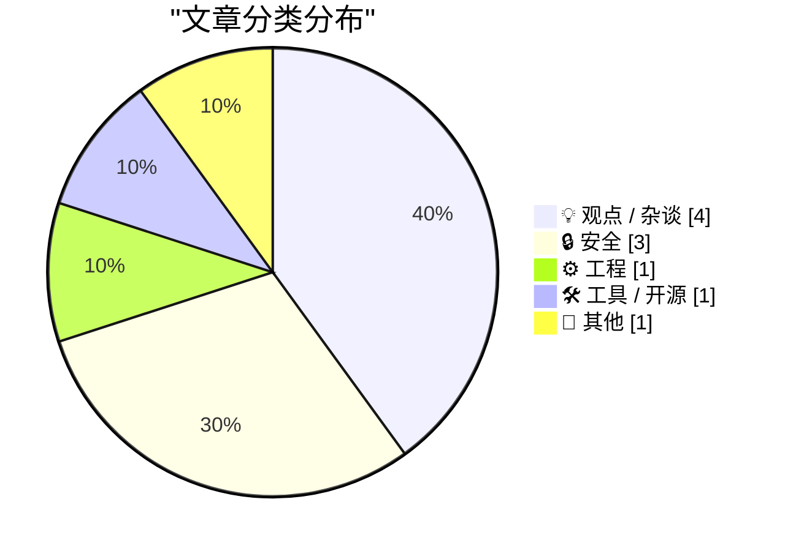
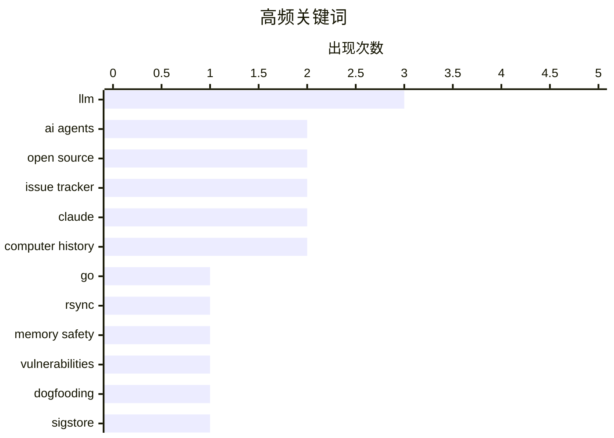

# 📰 AI 博客每日精选 — 2026-05-25

> 来自 Karpathy 推荐的 92 个顶级技术博客，AI 精选 Top 10

## 📝 今日看点

今日几篇文章共同指向一个更现实的 AI 开发问题：它能加速搜索、原型和整理，但一旦被当作工程师、维护者或事实来源，就会把低质量代码、误导性 Issue 和维护成本一起放大。另一条主线是软件质量与安全的“慢工夫”：无论是用更小的实现减少攻击面，还是用 TUF、in-toto、Sigstore 这类机制假设基础设施终会失守，本质都是在为失控和事故预留防线。与此同时，多篇内容也在提醒我们，真正有价值的技术能力不只是生成更多东西，而是把复杂问题讲清楚、把事实说准确、把系统边界想明白。最后，复古游戏和童年计算机启蒙提供了一个温和的对照：技术的吸引力，很多时候仍来自亲手理解和探索的过程。

---

## 🏆 今日必读

🥇 **一个极简 Go 版 rsync 如何避开多类安全漏洞**

[How my minimal, memory-safe Go rsync steers clear of vulnerabilities](https://michael.stapelberg.ch/posts/2026-05-24-minimal-memory-safe-go-rsync-vulns/) — michael.stapelberg.ch · 8 小时前 · 🔒 安全

> 文章回顾了 2025 年和 2026 年披露的多批 rsync 漏洞，包括可导致远程代码执行、越界读写和文件泄露的问题，并逐项分析这些漏洞对作者的 gokrazy/rsync 实现是否适用。作者的实现是一个兼容但更小的 Go 版 rsync，最初用于自己的 Linux 发行版和 gokrazy 设备场景，因此攻击面和上游 C 版 rsync 并不完全相同。文章重点讨论了内存安全语言的实际价值：Go 不能自动消除所有逻辑错误或协议校验缺陷，但能把许多越界写这类问题变成运行时 panic，而不是可利用的内存破坏。作者也指出，极简重实现同样会有自己的漏洞，例如输入验证不足，因此仍需要审计、升级和纵深防御。文章还把 gokrazy/rsync 与 OpenBSD 的 openrsync 作对比，并给出 Linux 上可用的隔离与防护思路。

💡 **为什么值得读**: 它用真实 rsync 漏洞逐案检验“内存安全语言”和“最小化实现”到底能防住什么、不能防住什么，对安全工程实践很有参考价值。

🏷️ Go, rsync, memory safety, vulnerabilities

🥈 **用 Pi 构建 Pi：AI 时代开源维护的新问题**

[Building Pi With Pi](https://lucumr.pocoo.org/2026/5/24/pi-oss/) — lucumr.pocoo.org · 23 小时前 · ⚙️ 工程

> Armin Ronacher 以参与 Pi 项目维护的经验，讨论了在 AI 代理大量介入后，开源项目 issue tracker 的角色变化。过去糟糕的 issue 往往只是信息不足，但现在很多报告会被 LLM 改写成看似完整、实则充满错误诊断和虚假复现的长文，反而误导维护者和用于处理 issue 的代理工具。作者认为，好的问题报告应回到事实本身：执行了什么、期望什么、实际发生了什么、日志或错误是什么，而不是把猜测包装成结论。文章还指出，LLM 生成代码常倾向于局部兜底和过度工程化，例如为坏数据增加宽容读取和迁移逻辑，而不是维护系统全局不变量、从源头避免坏状态。随着 LLM 辅助 issue 和 PR 数量上升，维护压力不只来自单个贡献质量，也来自总体吞吐量，项目不得不通过自动关闭新贡献者提交等机制来控制成本。

💡 **为什么值得读**: 这篇文章提供了来自真实开源项目维护一线的观察，能帮助开发者理解 AI 代理不是简单提高效率，也会改变协作规范、代码质量和维护成本。

🏷️ AI agents, open source, issue tracker, dogfooding

🥉 **软件签名的价值，只有在出事时才真正显现**

[Signing is for the bad days](https://nesbitt.io/2026/05/24/signing-is-for-the-bad-days.html) — nesbitt.io · 13 小时前 · 🔒 安全

> 文章解释了为什么 TUF、in-toto 和 Sigstore 这类供应链安全工具在平时看起来像额外负担，但在基础设施被攻破时能决定事故是否发生。作者指出，锁文件里的哈希只能证明下载到的字节没有变化，不能证明这些字节一开始就是可信的；签名和证明机制要解决的是“它是否本该存在”这个问题。TUF 通过角色拆分、离线根密钥、快照和短期时间戳来限制注册表被攻陷后的破坏范围，防止恶意包替换、回滚和长期冻结攻击。in-toto 则把信任范围扩展到构建流水线，记录每个步骤的输入、输出和授权身份，用可验证的链路证明产物确实来自预期源码和流程。文章还把这些项目放在 Santiago Torres-Arias 的研究脉络中，强调它们共同的设计前提是：假设某些基础设施终会被入侵，安全系统必须让这种入侵可承受。

💡 **为什么值得读**: 它清晰说明了现代软件供应链签名、证明和元数据框架各自防御什么威胁，适合重新理解“签名为什么不只是形式主义”。

🏷️ Sigstore, in-toto, supply chain, signing

---

## 📊 数据概览

| 扫描源 | 抓取文章 | 时间范围 | 精选 |
|:---:|:---:|:---:|:---:|
| 87/92 | 2511 篇 → 10 篇 | 24h | **10 篇** |

### 分类分布



### 高频关键词



<details>
<summary>📈 纯文本关键词图（终端友好）</summary>

```
llm              │ ████████████████████ 3
ai agents        │ █████████████░░░░░░░ 2
open source      │ █████████████░░░░░░░ 2
issue tracker    │ █████████████░░░░░░░ 2
claude           │ █████████████░░░░░░░ 2
computer history │ █████████████░░░░░░░ 2
go               │ ███████░░░░░░░░░░░░░ 1
rsync            │ ███████░░░░░░░░░░░░░ 1
memory safety    │ ███████░░░░░░░░░░░░░ 1
vulnerabilities  │ ███████░░░░░░░░░░░░░ 1
```

</details>

### 🏷️ 话题标签

**llm**(3) · **ai agents**(2) · **open source**(2) · issue tracker(2) · claude(2) · computer history(2) · go(1) · rsync(1) · memory safety(1) · vulnerabilities(1) · dogfooding(1) · sigstore(1) · in-toto(1) · supply chain(1) · signing(1) · programming(1) · tinygrad(1) · technical communication(1) · voice notes(1) · bug reports(1)

---

## 💡 观点 / 杂谈

### 1. 永恒的“垃圾九月”：AI 代理写代码为何可能伤害软件开发

[The Eternal Sloptember](https://geohot.github.io//blog/jekyll/update/2026/05/24/the-eternal-sloptember.html) — **geohot.github.io** · 16 小时前 · ⭐ 24/30

> 作者认为，把 AI 代理大规模引入软件开发，可能会成为行业史上代价高昂的错误之一。文中区分了“AI 有用”和“AI 能当软件工程师”：作者承认它适合搜索、快速原型和低要求任务，但认为它在需要打磨、理解上下文和保证质量的工程工作中远未达标。作者结合自己在 tinygrad 和硬件逆向等项目中的尝试，指出代理往往能在开头制造快速进展，却在收尾、修正和可靠性上变成反复抽奖。文章特别担心大型组织会因为反馈慢、责任分散和质量把关弱，让低水平产出借助代理被放大，最终生成更多代码、应用和功能，却降低平均质量。作者还提出，AI 生成物可能以过去不常见的方式损坏，语法正确和表面完整不再能作为质量代理指标；真正可靠的编程代理可能需要更强的世界模型，而不是只会模仿代码分布的语言模型。

🏷️ AI agents, programming, tinygrad, LLM

---

### 2. 和 Claude 遛狗时聊“把难事讲简单”

[Walking the dog with Claude](http://xania.org/202605/walking-the-dog?utm_source=feed&amp;utm_medium=rss) — **xania.org** · 6 小时前 · ⭐ 20/30

> Matt Godbolt 以一次遛狗时让 Claude 采访自己的对话，讨论技术内容为什么常在“准确但难懂”和“好看但不够准”之间摇摆。他认为好的技术解释并不是把专家模型粗暴简化，而是找到专家自己真正用来思考问题的清晰模型，并把它表达出来。他举 Usborne 早期计算机书中的小机器人图示为例，说明童年形成的直观模型至今仍帮助他理解乱序执行、寄存器重命名等复杂主题。文章还谈到他的“讲给妈妈听”测试：如果一个主题不能被简单、真实、不降智地讲清楚，就说明自己还没有准备好。他用 Computerphile、会议演讲和编译器优化系列的经验说明，看似即兴的讲解背后往往需要大量准备，而真正驱动他的不是炫技，而是让别人“突然懂了”的时刻。

🏷️ Claude, technical communication, voice notes, LLM

---

### 3. Armin Ronacher 谈 AI 生成的低质量 Issue 报告

[Quoting Armin Ronacher](https://simonwillison.net/2026/May/24/armin-ronacher/#atom-everything) — **simonwillison.net** · 4 小时前 · ⭐ 17/30

> Armin Ronacher 批评了一类越来越常见的开源协作问题：用户把真实遇到的问题交给 AI 改写后再提交 Issue，结果反而掩盖了原始事实。这样的报告往往语气自信，却夹杂错误推断、虚假的最小复现、猜测性的根因分析和不相关的实现建议。维护者真正需要的不是包装过的长篇解释，而是人类实际观察到的最小信息：运行了什么命令、期望发生什么、实际发生什么，以及完整错误或日志。Simon Willison 引用这段话，是在提醒开发者不要把 AI 生成的“看似专业”内容当作高质量 bug 报告。文章的核心观点是，AI 可以辅助整理信息，但不能替代准确、可验证的事实描述。

🏷️ LLM, issue tracker, open source, bug reports

---

### 4. 拥有“极具防御性”池塘的巫师

[The Wizard With the Very Defensible Pond](https://worksonmymachine.ai/p/the-wizard-with-the-very-defensible) — **worksonmymachine.substack.com** · 6 小时前 · ⭐ 13/30

> 这篇寓言用一个把小池塘称作“护城河”的巫师，讽刺技术公司常把有限的私有数据包装成不可逾越的竞争壁垒。巫师每天记录青蛙、涟漪和所谓“青蛙情绪”，相信这些独特数据本身就有巨大价值，但旅行术士的通用黑盒很快就能根据见过的大量池塘推断出相近结果。文章进一步借“金融文本哥布林”的例子说明，垂直领域模型或专有语料确实可能在一段时间内领先，但当通用模型能力边界扩大时，这种领先会迅速被吞没。它的核心观点不是说私有数据毫无价值，而是提醒读者区分真正难以复制的优势与只是听起来像护城河的资产叙事。整篇以童话和反讽写法讨论 AI 时代的数据护城河、垂直模型和创业融资话术，语言轻松但指向很现实。

🏷️ satire, data moat, AI, strategy

---

## 🔒 安全

### 5. 一个极简 Go 版 rsync 如何避开多类安全漏洞

[How my minimal, memory-safe Go rsync steers clear of vulnerabilities](https://michael.stapelberg.ch/posts/2026-05-24-minimal-memory-safe-go-rsync-vulns/) — **michael.stapelberg.ch** · 8 小时前 · ⭐ 27/30

> 文章回顾了 2025 年和 2026 年披露的多批 rsync 漏洞，包括可导致远程代码执行、越界读写和文件泄露的问题，并逐项分析这些漏洞对作者的 gokrazy/rsync 实现是否适用。作者的实现是一个兼容但更小的 Go 版 rsync，最初用于自己的 Linux 发行版和 gokrazy 设备场景，因此攻击面和上游 C 版 rsync 并不完全相同。文章重点讨论了内存安全语言的实际价值：Go 不能自动消除所有逻辑错误或协议校验缺陷，但能把许多越界写这类问题变成运行时 panic，而不是可利用的内存破坏。作者也指出，极简重实现同样会有自己的漏洞，例如输入验证不足，因此仍需要审计、升级和纵深防御。文章还把 gokrazy/rsync 与 OpenBSD 的 openrsync 作对比，并给出 Linux 上可用的隔离与防护思路。

🏷️ Go, rsync, memory safety, vulnerabilities

---

### 6. 软件签名的价值，只有在出事时才真正显现

[Signing is for the bad days](https://nesbitt.io/2026/05/24/signing-is-for-the-bad-days.html) — **nesbitt.io** · 13 小时前 · ⭐ 24/30

> 文章解释了为什么 TUF、in-toto 和 Sigstore 这类供应链安全工具在平时看起来像额外负担，但在基础设施被攻破时能决定事故是否发生。作者指出，锁文件里的哈希只能证明下载到的字节没有变化，不能证明这些字节一开始就是可信的；签名和证明机制要解决的是“它是否本该存在”这个问题。TUF 通过角色拆分、离线根密钥、快照和短期时间戳来限制注册表被攻陷后的破坏范围，防止恶意包替换、回滚和长期冻结攻击。in-toto 则把信任范围扩展到构建流水线，记录每个步骤的输入、输出和授权身份，用可验证的链路证明产物确实来自预期源码和流程。文章还把这些项目放在 Santiago Torres-Arias 的研究脉络中，强调它们共同的设计前提是：假设某些基础设施终会被入侵，安全系统必须让这种入侵可承受。

🏷️ Sigstore, in-toto, supply chain, signing

---

### 7. Troy Hunt 第 505 期周报：ShinyHunters 疑似重返勒索活动

[Weekly Update 505](https://www.troyhunt.com/weekly-update-505/) — **troyhunt.com** · 21 小时前 · ⭐ 16/30

> Troy Hunt 在本期周报中谈到，ShinyHunters 在疑似获得 Instructure 赎金后曾短暂沉寂，但很快又被曝声称拥有新的受害者。正文片段提到的目标包括美国牙科福利和口腔健康相关公司 DentaQuest，以及以 Spectrum 品牌知名的电信和有线电视公司 Charter Communications。Troy 认为，这类组织在受到关注或压力后短暂消失、随后重新出现，并不罕见。文章还指出，DentaQuest 后来从相关名单中消失，但其网站出现 “Access Denied”，这在公众观感上并不理想。整体来看，这期更新关注的是数据勒索生态中“支付赎金—短暂沉寂—再次活动”的循环，以及企业在事件响应和外部沟通中面临的声誉风险。

🏷️ ShinyHunters, ransomware, breach, cybercrime

---

## ⚙️ 工程

### 8. 用 Pi 构建 Pi：AI 时代开源维护的新问题

[Building Pi With Pi](https://lucumr.pocoo.org/2026/5/24/pi-oss/) — **lucumr.pocoo.org** · 23 小时前 · ⭐ 25/30

> Armin Ronacher 以参与 Pi 项目维护的经验，讨论了在 AI 代理大量介入后，开源项目 issue tracker 的角色变化。过去糟糕的 issue 往往只是信息不足，但现在很多报告会被 LLM 改写成看似完整、实则充满错误诊断和虚假复现的长文，反而误导维护者和用于处理 issue 的代理工具。作者认为，好的问题报告应回到事实本身：执行了什么、期望什么、实际发生了什么、日志或错误是什么，而不是把猜测包装成结论。文章还指出，LLM 生成代码常倾向于局部兜底和过度工程化，例如为坏数据增加宽容读取和迁移逻辑，而不是维护系统全局不变量、从源头避免坏状态。随着 LLM 辅助 issue 和 PR 数量上升，维护压力不只来自单个贡献质量，也来自总体吞吐量，项目不得不通过自动关闭新贡献者提交等机制来控制成本。

🏷️ AI agents, open source, issue tracker, dogfooding

---

## 🛠 工具 / 开源

### 9. Mad House：受 Usborne 复古电脑书启发的文字逃脱游戏

[Mad House — Usborne Creepy Computer Games](https://simonwillison.net/2026/May/24/usborne-mad-house/#atom-everything) — **simonwillison.net** · 5 小时前 · ⭐ 13/30

> 这是一个复古文字风格的逃脱小游戏，灵感来自 1980 年代 Usborne 出版的儿童电脑游戏书。玩家需要控制一座不断变化的房子里的门道，让三个出口对齐，才能在脚步声追上之前逃出去。操作方式包括键盘按键和屏幕按钮，用来左右移动近处和远处的门，而中间的门会以不可预测的方式变化。游戏刻意模拟老式 CRT 显示器效果，包括荧光屏色彩、扫描线和跳动的状态界面。整体体验更像一次怀旧的交互式小实验，而不是复杂的大型游戏。

🏷️ JavaScript, Claude, retro games, computer history

---

## 📝 其他

### 10. 童年时代的计算机启蒙

[Childhood Computing](https://susam.net/childhood-computing.html) — **susam.net** · 23 小时前 · ⭐ 11/30

> 作者回忆了自己在 1992 年、八岁时第一次接触学校计算机实验室的经历。那所位于小工业城镇的学校只有一些从工厂淘汰下来的 IBM PC 兼容机，没有硬盘，学生每月只能使用大约两小时，却足以打开一个全新的世界。作者描述了用软盘启动 MS-DOS、运行 Logo、在纸上保存和推演程序的年代，也讲到一个会画动态虚线房子的 Logo 程序如何被同学们手抄、修改和传播，像是一次早期的“开源”体验。文章还回忆了 Moon Bugs、Space Invaders、Digger 和 Grand Prix Circuit 等游戏给童年带来的震撼，以及这些体验后来如何延续为成年后实现童年编程梦想的动力。整篇文章不只是怀旧，也呈现了资源稀缺时代的学习方式、想象力和计算机带来的魔法感。

🏷️ childhood, MS-DOS, Logo, computer history

---

*生成于 2026-05-25 07:04 | 扫描 87 源 → 获取 2511 篇 → 精选 10 篇*
*基于 [Hacker News Popularity Contest 2025](https://refactoringenglish.com/tools/hn-popularity/) RSS 源列表*
