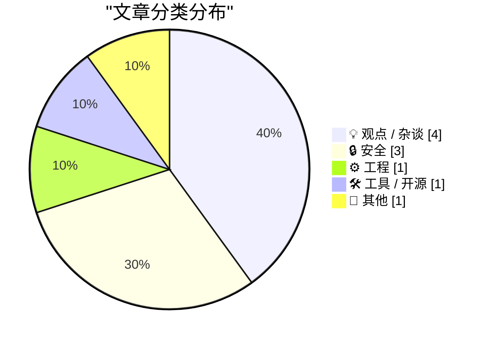
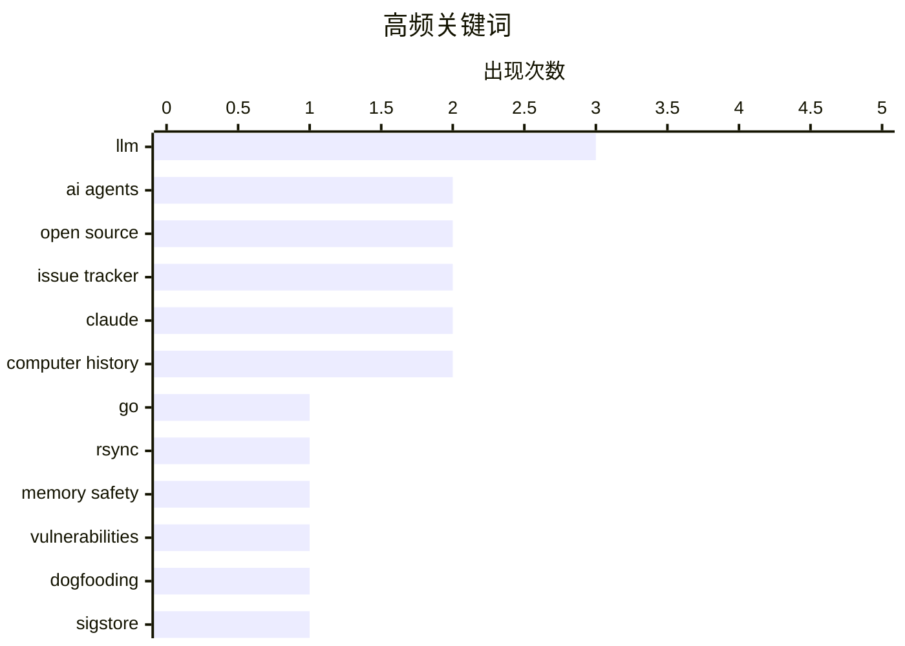

# 📰 AI 博客每日精选 — 2026-05-25

> 来自 Karpathy 推荐的 92 个顶级技术博客，AI 精选 Top 10

## 🏆 今日必读

🥇 **How my minimal, memory-safe Go rsync steers clear of vulnerabilities**

[How my minimal, memory-safe Go rsync steers clear of vulnerabilities](https://michael.stapelberg.ch/posts/2026-05-24-minimal-memory-safe-go-rsync-vulns/) — michael.stapelberg.ch · 8 小时前 · 🔒 安全

> How my minimal, memory-safe Go rsync steers clear of vulnerabilities published 2026-05-24 in tags golang rsync Table of contents Context: My own rsync Security Vulnerabilities January 2025 batch May 2

🏷️ Go, rsync, memory safety, vulnerabilities

🥈 **Building Pi With Pi**

[Building Pi With Pi](https://lucumr.pocoo.org/2026/5/24/pi-oss/) — lucumr.pocoo.org · 23 小时前 · ⚙️ 工程

> Armin Ronacher 's Thoughts and Writings blog archive projects travel talks about Building Pi With Pi written on May 24, 2026 Pi is now part of Earendil, but in the important sense it is still Mario’s 

🏷️ AI agents, open source, issue tracker, dogfooding

🥉 **Signing is for the bad days**

[Signing is for the bad days](https://nesbitt.io/2026/05/24/signing-is-for-the-bad-days.html) — nesbitt.io · 13 小时前 · 🔒 安全

> I have had roughly the same conversation four or five times in the last month. I’m explaining why a registry should adopt Sigstore, or why a build pipeline should emit in-toto attestations, and the pe

🏷️ Sigstore, in-toto, supply chain, signing

---

## 📊 数据概览

| 扫描源 | 抓取文章 | 时间范围 | 精选 |
|:---:|:---:|:---:|:---:|
| 87/92 | 2511 篇 → 10 篇 | 24h | **10 篇** |

### 分类分布



### 高频关键词



<details>
<summary>📈 纯文本关键词图（终端友好）</summary>

```
llm              │ ████████████████████ 3
ai agents        │ █████████████░░░░░░░ 2
open source      │ █████████████░░░░░░░ 2
issue tracker    │ █████████████░░░░░░░ 2
claude           │ █████████████░░░░░░░ 2
computer history │ █████████████░░░░░░░ 2
go               │ ███████░░░░░░░░░░░░░ 1
rsync            │ ███████░░░░░░░░░░░░░ 1
memory safety    │ ███████░░░░░░░░░░░░░ 1
vulnerabilities  │ ███████░░░░░░░░░░░░░ 1
```

</details>

### 🏷️ 话题标签

**llm**(3) · **ai agents**(2) · **open source**(2) · issue tracker(2) · claude(2) · computer history(2) · go(1) · rsync(1) · memory safety(1) · vulnerabilities(1) · dogfooding(1) · sigstore(1) · in-toto(1) · supply chain(1) · signing(1) · programming(1) · tinygrad(1) · technical communication(1) · voice notes(1) · bug reports(1)

---

## 💡 观点 / 杂谈

### 1. The Eternal Sloptember

[The Eternal Sloptember](https://geohot.github.io//blog/jekyll/update/2026/05/24/the-eternal-sloptember.html) — **geohot.github.io** · 16 小时前 · ⭐ 24/30

> I’m calling it now, the adoption of AI agents into software development will be one of the most costly mistakes in the field’s history. Agents cannot program, and it’s taking longer and longer to real

🏷️ AI agents, programming, tinygrad, LLM

---

### 2. Walking the dog with Claude

[Walking the dog with Claude](http://xania.org/202605/walking-the-dog?utm_source=feed&amp;utm_medium=rss) — **xania.org** · 6 小时前 · ⭐ 20/30

> Matt Godbolt's blog Menu Tags AI Amusing Stuff AoCO2025 Blog Coding Compiler Explorer Emulation Games Microarchitecture New Zealand Trip Personal Python Rants Rust WeeBox Project Archive AI Amusing St

🏷️ Claude, technical communication, voice notes, LLM

---

### 3. Quoting Armin Ronacher

[Quoting Armin Ronacher](https://simonwillison.net/2026/May/24/armin-ronacher/#atom-everything) — **simonwillison.net** · 4 小时前 · ⭐ 17/30

> Simon Willison’s Weblog Subscribe Sponsored by: exe.dev &mdash; ssh, root, https. Real VMs, not sandboxes. Edge-injected secrets so you can yolo. 0→1? ½→1! 24th May 2026 The most frustrating failure m

🏷️ LLM, issue tracker, open source, bug reports

---

### 4. The Wizard With the Very Defensible Pond

[The Wizard With the Very Defensible Pond](https://worksonmymachine.ai/p/the-wizard-with-the-very-defensible) — **worksonmymachine.substack.com** · 6 小时前 · ⭐ 13/30

> The Wizard With the Very Defensible Pond Scott Werner May 24, 2026 13 2 Share There was once a wizard who lived beside a pond. It was a small pond. The sort of pond that probably gets called a “water 

🏷️ satire, data moat, AI, strategy

---

## 🔒 安全

### 5. How my minimal, memory-safe Go rsync steers clear of vulnerabilities

[How my minimal, memory-safe Go rsync steers clear of vulnerabilities](https://michael.stapelberg.ch/posts/2026-05-24-minimal-memory-safe-go-rsync-vulns/) — **michael.stapelberg.ch** · 8 小时前 · ⭐ 27/30

> How my minimal, memory-safe Go rsync steers clear of vulnerabilities published 2026-05-24 in tags golang rsync Table of contents Context: My own rsync Security Vulnerabilities January 2025 batch May 2

🏷️ Go, rsync, memory safety, vulnerabilities

---

### 6. Signing is for the bad days

[Signing is for the bad days](https://nesbitt.io/2026/05/24/signing-is-for-the-bad-days.html) — **nesbitt.io** · 13 小时前 · ⭐ 24/30

> I have had roughly the same conversation four or five times in the last month. I’m explaining why a registry should adopt Sigstore, or why a build pipeline should emit in-toto attestations, and the pe

🏷️ Sigstore, in-toto, supply chain, signing

---

### 7. Weekly Update 505

[Weekly Update 505](https://www.troyhunt.com/weekly-update-505/) — **troyhunt.com** · 21 小时前 · ⭐ 16/30

> Well, that didn't last long! Recording this on Saturday morning my time, I observed ShinyHunters having gone quiet since the massive haul that would have been the Instructure ransom. It was two weeks 

🏷️ ShinyHunters, ransomware, breach, cybercrime

---

## ⚙️ 工程

### 8. Building Pi With Pi

[Building Pi With Pi](https://lucumr.pocoo.org/2026/5/24/pi-oss/) — **lucumr.pocoo.org** · 23 小时前 · ⭐ 25/30

> Armin Ronacher 's Thoughts and Writings blog archive projects travel talks about Building Pi With Pi written on May 24, 2026 Pi is now part of Earendil, but in the important sense it is still Mario’s 

🏷️ AI agents, open source, issue tracker, dogfooding

---

## 🛠 工具 / 开源

### 9. Mad House — Usborne Creepy Computer Games

[Mad House — Usborne Creepy Computer Games](https://simonwillison.net/2026/May/24/usborne-mad-house/#atom-everything) — **simonwillison.net** · 5 小时前 · ⭐ 13/30

> Simon Willison’s Weblog Subscribe Sponsored by: exe.dev &mdash; ssh, root, https. Real VMs, not sandboxes. Edge-injected secrets so you can yolo. 0→1? ½→1! 24th May 2026 Tool Mad House — Usborne Creep

🏷️ JavaScript, Claude, retro games, computer history

---

## 📝 其他

### 10. Childhood Computing

[Childhood Computing](https://susam.net/childhood-computing.html) — **susam.net** · 23 小时前 · ⭐ 11/30

> Childhood Computing By Susam Pal on 24 May 2026 I recently stumbled upon a nice blog post titled Childhood Computing . It made me think about my own childhood computing experience. I am much older tha

🏷️ childhood, MS-DOS, Logo, computer history

---

*生成于 2026-05-25 07:04 | 扫描 87 源 → 获取 2511 篇 → 精选 10 篇*
*基于 [Hacker News Popularity Contest 2025](https://refactoringenglish.com/tools/hn-popularity/) RSS 源列表*
