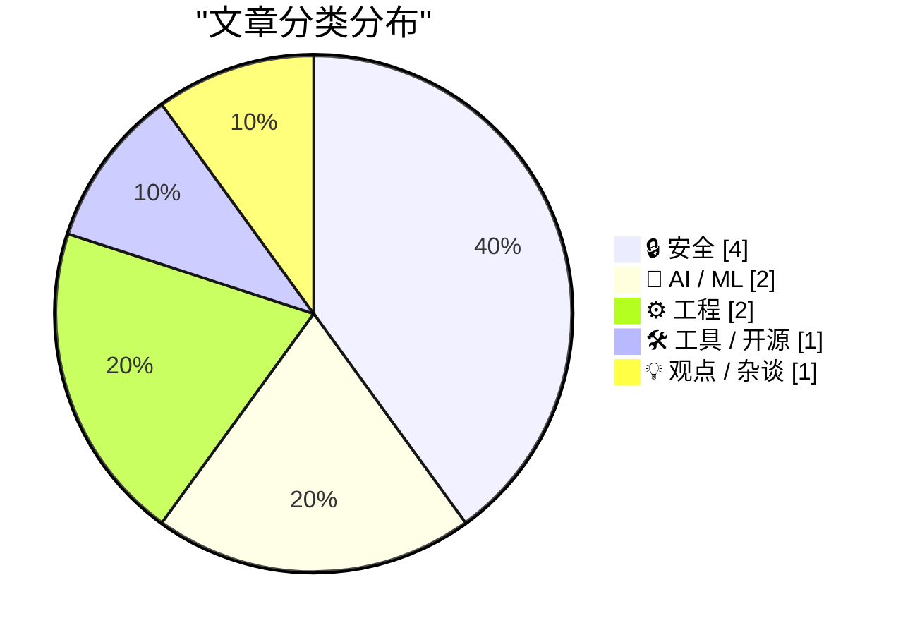
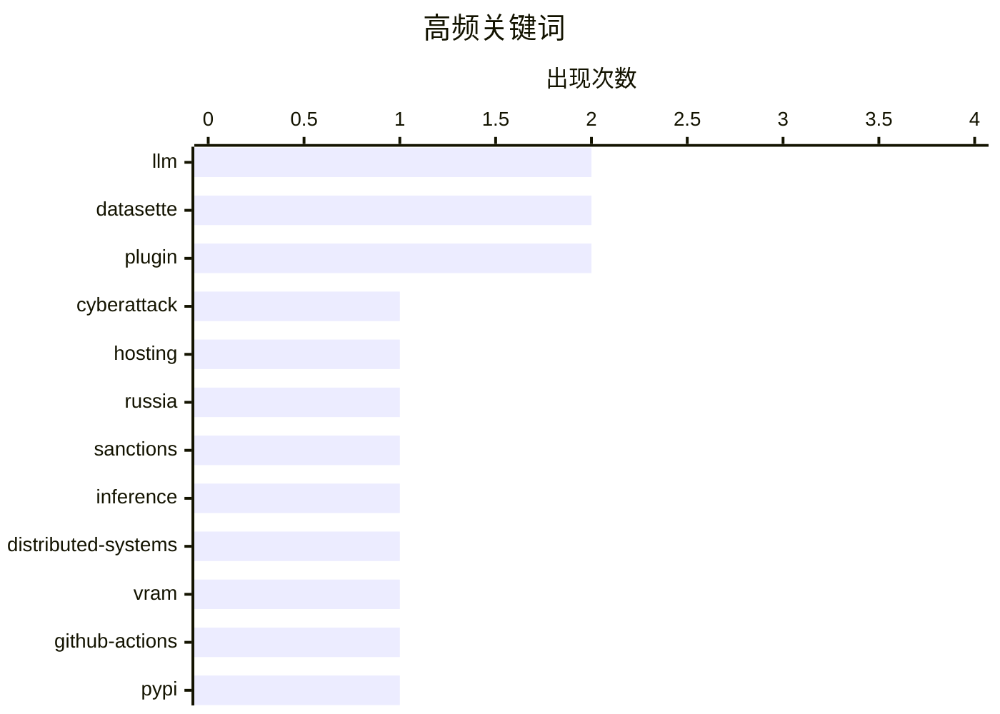

# 📰 AI 博客每日精选 — 2026-05-26

> 来自 Karpathy 推荐的 92 个顶级技术博客，AI 精选 Top 10

## 📝 今日看点

今日看点有两条安全主线：一是网络基础设施与供应链继续成为攻击和执法的焦点，从荷兰查扣涉嫌服务亲俄攻击的主机商，到 Python 项目中 GitHub Actions 成为新的发布信任边界，都说明“谁在提供底层能力”越来越关键。二是数据泄露与凭据监测仍是日常防线，不论是 Trump Mobile 疑似暴露预订信息，还是不丹政府接入 HIBP，重点都在于尽早发现可被滥用的数据。技术实践方面，几篇文章都围绕“在既有限制下渐进改进”：本地分布式 LLM 推理、Datasette 的可扩展入口、FediMeteo 的时区重构，以及 Quoridor 小棋盘求解，都是在现实约束中寻找更稳妥的工程路径。另有一篇广告技术批评提醒，评估技术风险时不必接受行业自我神话，数据滥用和商业欺诈本身已经足够值得关注。

---

## 🏆 今日必读

🥇 **荷兰查扣 800 台服务器并逮捕两名涉嫌协助俄方网络攻击的主机商负责人**

[Netherlands Seizes 800 Servers, Arrests 2 for Aiding Cyberattacks](https://krebsonsecurity.com/2026/05/netherlands-seizes-800-servers-arrests-2-for-aiding-cyberattacks/) — krebsonsecurity.com · 9 小时前 · 🔒 安全

> 荷兰金融犯罪调查机构逮捕了 MIRhosting 与 WorkTitans 相关的两名负责人，指控他们违反制裁规定，向已被欧盟制裁的实体直接或间接提供经济资源。调查核心是 Stark Industries 这类主机与网络基础设施，它被指在俄乌战争后频繁出现在针对欧洲目标的 DDoS 攻击、代理匿名服务和亲俄影响行动中。文章梳理了 Stark 的网络连接如何从此前被制裁的 PQHosting 转移到荷兰实体 WorkTitans，并继续通过 MIRhosting 接入互联网。荷兰当局在多处企业和数据中心搜查，查扣了笔记本、手机以及 800 多台服务器，部分客户随后被告知服务器数据无法恢复。报道还提到，WorkTitans 和 MIRhosting 曾被指是 2025 年丹麦地方选举期间亲俄攻击中最常用的网络之一，但 MIRhosting 否认知情或参与，并称已暂停 WorkTitans 服务、启动内部调查。

💡 **为什么值得读**: 这篇文章展示了制裁、主机服务商、匿名代理和国家级混合战之间的灰色基础设施链条，能帮助理解网络攻击背后的商业和执法环节。

🏷️ cyberattack, hosting, Russia, sanctions

🥈 **DwarfStar 中的分布式 LLM 推理思路**

[Distributing LLM inference in DwarfStar](http://antirez.com/news/167) — antirez.com · 8 小时前 · 🤖 AI / ML

> 文章讨论了在本地运行大模型推理时，昂贵 GPU、显存容量和内存带宽带来的现实限制。作者认为，在 NVIDIA 方案难以降价、Mac Studio 后续规格不确定的情况下，多台 Apple 设备或类似本地机器的分布式推理变得值得探索。文中比较了几种方案：按 Transformer 层切分模型可以降低单机内存压力，并可能提升 prefill 速度，但对单 token 解码帮助有限；利用 Apple RDMA 做专家或计算的纵向切分理论上可行，但通信开销和实现效果仍不确定。作者也指出传统 tensor parallelism 在普通 Apple 设备之间的通信带宽下大概率不现实。最后，文章提出一个更有趣的方向：让不同机器运行不同开源模型，通过 ensemble、logits 合并或选择更低困惑度的续写来提升质量，这种 shared-nothing 方式可能更适合当前本地硬件条件。

💡 **为什么值得读**: 它把本地大模型推理的硬件经济性、分布式架构取舍和模型集成方向放在一起分析，对想低成本运行强模型的人很有参考价值。

🏷️ LLM, inference, distributed-systems, VRAM

🥉 **Python 包中的 GitHub Actions 安全风险**

[GitHub Actions security in Python packages](https://nesbitt.io/2026/05/25/github-actions-security-in-python-packages.html) — nesbitt.io · 13 小时前 · 🔒 安全

> 这篇文章基于 PyCon US 2026 的演讲，系统分析了 PyPI 上 Python 项目对 GitHub Actions 的依赖以及由此带来的供应链风险。作者指出，许多包已经迁移到 PyPI trusted publishing，但这并不等于发布链路安全，因为工作流本身的完整性已经成为新的信任边界。文章解释了 GitHub Actions 的 `uses:` 本质上像一种包管理机制，但常见的标签引用、复合 Action 依赖和缺乏锁定机制，使其比传统依赖管理更容易被篡改。作者结合 Ultralytics、Trivy、LiteLLM、Telnyx、mistralai 等真实事件，说明攻击者如何通过 `pull_request_target` 配置错误、缓存投毒、标签劫持或令牌泄露，最终发布恶意 wheel 到 PyPI。文章还介绍了使用 zizmor 静态分析大规模扫描 Python 项目 GitHub Actions 工作流的方法，把个案攻击转化为可量化研究。

💡 **为什么值得读**: 它把近年 Python 供应链攻击和 GitHub Actions 配置风险串联起来，能帮助维护者重新评估发布流水线的真实安全边界。

🏷️ GitHub-Actions, PyPI, OIDC, supply-chain

---

## 📊 数据概览

| 扫描源 | 抓取文章 | 时间范围 | 精选 |
|:---:|:---:|:---:|:---:|
| 88/92 | 2562 篇 → 17 篇 | 24h | **10 篇** |

### 分类分布



### 高频关键词



<details>
<summary>📈 纯文本关键词图（终端友好）</summary>

```
llm                 │ ████████████████████ 2
datasette           │ ████████████████████ 2
plugin              │ ████████████████████ 2
cyberattack         │ ██████████░░░░░░░░░░ 1
hosting             │ ██████████░░░░░░░░░░ 1
russia              │ ██████████░░░░░░░░░░ 1
sanctions           │ ██████████░░░░░░░░░░ 1
inference           │ ██████████░░░░░░░░░░ 1
distributed-systems │ ██████████░░░░░░░░░░ 1
vram                │ ██████████░░░░░░░░░░ 1
```

</details>

### 🏷️ 话题标签

**llm**(2) · **datasette**(2) · **plugin**(2) · cyberattack(1) · hosting(1) · russia(1) · sanctions(1) · inference(1) · distributed-systems(1) · vram(1) · github-actions(1) · pypi(1) · oidc(1) · supply-chain(1) · release(1) · data(1) · agent(1) · quoridor(1) · game-theory(1) · algorithms(1)

---

## 🔒 安全

### 1. 荷兰查扣 800 台服务器并逮捕两名涉嫌协助俄方网络攻击的主机商负责人

[Netherlands Seizes 800 Servers, Arrests 2 for Aiding Cyberattacks](https://krebsonsecurity.com/2026/05/netherlands-seizes-800-servers-arrests-2-for-aiding-cyberattacks/) — **krebsonsecurity.com** · 9 小时前 · ⭐ 28/30

> 荷兰金融犯罪调查机构逮捕了 MIRhosting 与 WorkTitans 相关的两名负责人，指控他们违反制裁规定，向已被欧盟制裁的实体直接或间接提供经济资源。调查核心是 Stark Industries 这类主机与网络基础设施，它被指在俄乌战争后频繁出现在针对欧洲目标的 DDoS 攻击、代理匿名服务和亲俄影响行动中。文章梳理了 Stark 的网络连接如何从此前被制裁的 PQHosting 转移到荷兰实体 WorkTitans，并继续通过 MIRhosting 接入互联网。荷兰当局在多处企业和数据中心搜查，查扣了笔记本、手机以及 800 多台服务器，部分客户随后被告知服务器数据无法恢复。报道还提到，WorkTitans 和 MIRhosting 曾被指是 2025 年丹麦地方选举期间亲俄攻击中最常用的网络之一，但 MIRhosting 否认知情或参与，并称已暂停 WorkTitans 服务、启动内部调查。

🏷️ cyberattack, hosting, Russia, sanctions

---

### 2. Python 包中的 GitHub Actions 安全风险

[GitHub Actions security in Python packages](https://nesbitt.io/2026/05/25/github-actions-security-in-python-packages.html) — **nesbitt.io** · 13 小时前 · ⭐ 26/30

> 这篇文章基于 PyCon US 2026 的演讲，系统分析了 PyPI 上 Python 项目对 GitHub Actions 的依赖以及由此带来的供应链风险。作者指出，许多包已经迁移到 PyPI trusted publishing，但这并不等于发布链路安全，因为工作流本身的完整性已经成为新的信任边界。文章解释了 GitHub Actions 的 `uses:` 本质上像一种包管理机制，但常见的标签引用、复合 Action 依赖和缺乏锁定机制，使其比传统依赖管理更容易被篡改。作者结合 Ultralytics、Trivy、LiteLLM、Telnyx、mistralai 等真实事件，说明攻击者如何通过 `pull_request_target` 配置错误、缓存投毒、标签劫持或令牌泄露，最终发布恶意 wheel 到 PyPI。文章还介绍了使用 zizmor 静态分析大规模扫描 Python 项目 GitHub Actions 工作流的方法，把个案攻击转化为可量化研究。

🏷️ GitHub-Actions, PyPI, OIDC, supply-chain

---

### 3. 特朗普家族手机网站疑似暴露约2.7万名预订者个人信息

[Trump Mobile Website Exposed the Number of Pre-Orders — Both Completed and Abandoned — and the Associated Customer Information](https://www.theguardian.com/us-news/2026/may/23/trump-mobile-investigating-potential-exposure-of-would-be-customers-personal-information) — **daringfireball.net** · 4 小时前 · ⭐ 23/30

> 特朗普家族推出的手机品牌 Trump Mobile 正在调查一起网站安全问题，相关页面似乎暴露了填写 T1 金色智能手机预订表单用户的姓名、地址、邮箱、手机号和订单编号等信息。公司称，目前没有证据显示其系统、基础设施或网络被直接攻破，也未发现信用卡、银行账户、社保号、通话记录或短信等更敏感数据受影响。发现问题的程序员和审查代码的专家认为，网站的电商流程可能把已完成和未完成的下单尝试都计入数据，因此约 27,000 条记录并不等同于实际预订销量。事件发生时，Trump Mobile 刚开始发货其延迟近 10 个月的 T1 手机，而该产品此前关于“美国制造”的表述也已发生调整。公司表示已增加防护和监控措施，并提醒用户警惕借订单名义发起的钓鱼邮件、电话或短信。

🏷️ data-exposure, PII, preorders, website

---

### 4. 不丹政府加入 Have I Been Pwned 免费政府监测服务

[Welcoming the Bhutanese Government to Have I Been Pwned](https://www.troyhunt.com/welcoming-the-bhutanese-government-to-have-i-been-pwned/) — **troyhunt.com** · 12 分钟前 · ⭐ 15/30

> Have I Been Pwned 宣布将不丹政府纳入其免费政府服务，这是该服务接入的第 45 个政府实体。不丹计算机事件响应团队 BtCIRT 现在可以监测不丹政府域名是否出现在 HIBP 收录的数据泄露记录中。作为国家级 CIRT，BtCIRT 的职责是消费威胁情报，并把与政府服务和公众相关的风险信息分发给对应机构。该服务的价值在于帮助政府安全团队发现与官方域名相关的泄露凭据和受影响数据库，从而更快响应新泄露事件。文章也强调，提前识别被泄露的凭据能降低攻击者利用这些信息发起攻击的风险。

🏷️ HIBP, government, breach-monitoring, credentials

---

## 🤖 AI / ML

### 5. DwarfStar 中的分布式 LLM 推理思路

[Distributing LLM inference in DwarfStar](http://antirez.com/news/167) — **antirez.com** · 8 小时前 · ⭐ 26/30

> 文章讨论了在本地运行大模型推理时，昂贵 GPU、显存容量和内存带宽带来的现实限制。作者认为，在 NVIDIA 方案难以降价、Mac Studio 后续规格不确定的情况下，多台 Apple 设备或类似本地机器的分布式推理变得值得探索。文中比较了几种方案：按 Transformer 层切分模型可以降低单机内存压力，并可能提升 prefill 速度，但对单 token 解码帮助有限；利用 Apple RDMA 做专家或计算的纵向切分理论上可行，但通信开销和实现效果仍不确定。作者也指出传统 tensor parallelism 在普通 Apple 设备之间的通信带宽下大概率不现实。最后，文章提出一个更有趣的方向：让不同机器运行不同开源模型，通过 ensemble、logits 合并或选择更低困惑度的续写来提升质量，这种 shared-nothing 方式可能更适合当前本地硬件条件。

🏷️ LLM, inference, distributed-systems, VRAM

---

### 6. Datasette Agent 0.1a4 发布：在 Datasette 中加入 LLM 代理聊天入口

[datasette-agent 0.1a4](https://simonwillison.net/2026/May/24/datasette-agent/#atom-everything) — **simonwillison.net** · 23 小时前 · ⭐ 21/30

> Simon Willison 发布了 datasette-agent 0.1a4，这是一个面向 Datasette 的 LLM 驱动代理插件。新版本利用 Datasette 1.0a30 新增的 makeJumpSections() JavaScript 插件钩子，把“Start a new agent chat”入口集成进 Jump to 菜单。用户在 Datasette 界面中按下 / 时，就可以从跳转菜单中直接启动新的代理聊天。文章还提到，读者可以使用 GitHub 账号登录 agent.datasette.io 体验这个功能。整体来看，这次更新重点不是模型能力本身，而是把 LLM 代理更自然地嵌入 Datasette 的现有交互流程。

🏷️ Datasette, agent, LLM, plugin

---

## ⚙️ 工程

### 7. 求解棋盘游戏 Quoridor：小棋盘上的完整搜索与新结论

[Solving the board game Quoridor](https://grantslatton.com/solving-quoridor) — **grantslatton.com** · 3 小时前 · ⭐ 20/30

> 文章介绍了作者对棋盘游戏 Quoridor 的求解进展，重点是通过新的算法和优化技巧，在消费级笔记本上几乎完整求解面积不超过 28 的多种棋盘配置及不同墙数。Quoridor 的难点来自“不能完全封死对手到达终点路径”的规则：每次放墙都可能需要验证路径可达性，再加上大量可能的墙位置，使分支因子远高于许多传统棋类。作者给出了一批博弈论结果，例如奇数高度棋盘并不总是后手必胜；在墙数较少时后手可能因跳子奇偶性占优，但墙数增加后先手的节奏优势常会反超。文章还发现了从初始局面即可强制和棋的例子，如 8x3 且每人 3 面墙时，双方最优策略会进入重复移动。除结果表外，作者还讨论了异常几何形状、搜索复杂度、局面评估困难，以及若干与 Quoridor 和棋类搜索相关的优化经验。

🏷️ Quoridor, game-theory, algorithms, search

---

### 8. FediMeteo 的时区重构：在不破坏既有系统的前提下扩展天气机器人

[FediMeteo, timezones, and the art of not breaking what already works](https://it-notes.dragas.net/2026/05/25/fedimeteo-timezones-and-the-art-of-not-breaking-what-already-works/) — **it-notes.dragas.net** · 13 小时前 · ⭐ 19/30

> 这篇文章讲述 FediMeteo 从一个简单的意大利城市天气发布脚本，演进为支持多国家、多时区和大量城市的 Fediverse 天气服务的过程。作者最初用 Python 脚本查询地理编码和 Open-Meteo，再通过 shell、cron 和 snac 把 Markdown 天气预报发布出去，整体遵循“小组件做好一件事”的 Unix 风格。随着服务扩展到德国，重名城市暴露出地理消歧问题；而加入美国后，城市数量、六个时区以及大量同名地名让原有假设彻底失效。真正的难点不只是重写机器人，而是在不影响 FreeBSD jail、cron、HAProxy、snac 实例、备份和既有国家配置的情况下保持外部行为兼容。作者因此把命令行接口、输出格式、退出码和配置结构视为隐含契约，只在内部重构城市、州和时区处理逻辑。文章的核心是一次现实世界中的渐进式重构：既修正设计债务，又尊重已经稳定运行的生产系统。

🏷️ Fediverse, ActivityPub, timezones, Unix

---

## 🛠 工具 / 开源

### 9. Datasette 1.0a30 发布：新增可扩展的“Jump to”菜单

[datasette 1.0a30](https://simonwillison.net/2026/May/24/datasette/#atom-everything) — **simonwillison.net** · 23 小时前 · ⭐ 22/30

> Datasette 1.0a30 是这个开源数据探索与发布工具的一个 alpha 版本更新。此次最主要的新功能是可自定义的“Jump to...”菜单，用户可以通过快捷键快速搜索并跳转到相关资源。Simon Willison 提到，这个菜单已经可以在 latest.datasette.io 上试用，按下“/”即可打开。新版本还引入了 jump_items_sql() 插件钩子，让插件能够把自己的条目加入菜单搜索范围。这个改动强化了 Datasette 的可扩展性，也让大型数据站点中的导航和发现体验更灵活。

🏷️ Datasette, release, plugin, data

---

## 💡 观点 / 杂谈

### 10. 广告技术骗子之间也没有信用

[Pluralistic: No honor among (ad-tech) thieves (25 May 2026)](https://pluralistic.net/2026/05/25/lying-spies/) — **pluralistic.net** · 14 小时前 · ⭐ 20/30

> 文章批判商业监控和广告技术行业不仅欺骗用户，也欺骗真正付钱的广告主、客户和投资人。作者认为，把用户当作“产品”只是问题的一部分：这些公司会夸大定向广告和行为追踪的效果，把无效甚至欺诈性的广告服务包装成强大的说服机器。文中借 Tim Hwang《Subprime Attention Crisis》的论点说明，监控广告的危害主要在于隐私侵蚀、数据滥用和可能被国家压迫或诈骗利用，而不是它真的能精准操控人心。作者还批评“criti-hype”式科技批评，即把企业自我吹嘘的夸张能力反过来当作巨大风险来宣传，反而帮助广告技术公司维持神话。文章用宝洁削减 2 亿美元监控广告预算却销售不降等案例，说明大量广告支出可能被浪费或流入欺诈链条。整体观点是，评价广告技术应基于可验证的商业欺诈和数据滥用事实，而不是相信行业关于“超强影响力”的自我营销。

🏷️ ad-tech, surveillance, privacy, economics

---

*生成于 2026-05-26 07:04 | 扫描 88 源 → 获取 2562 篇 → 精选 10 篇*
*基于 [Hacker News Popularity Contest 2025](https://refactoringenglish.com/tools/hn-popularity/) RSS 源列表*
