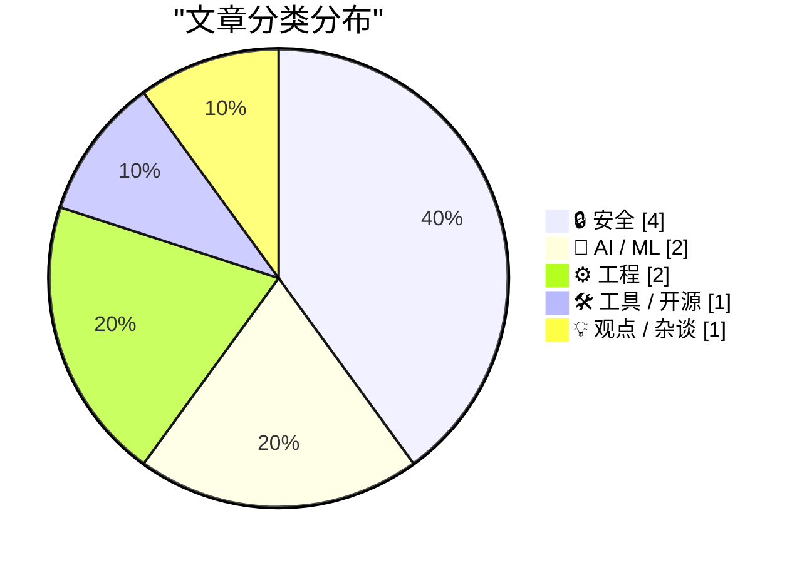
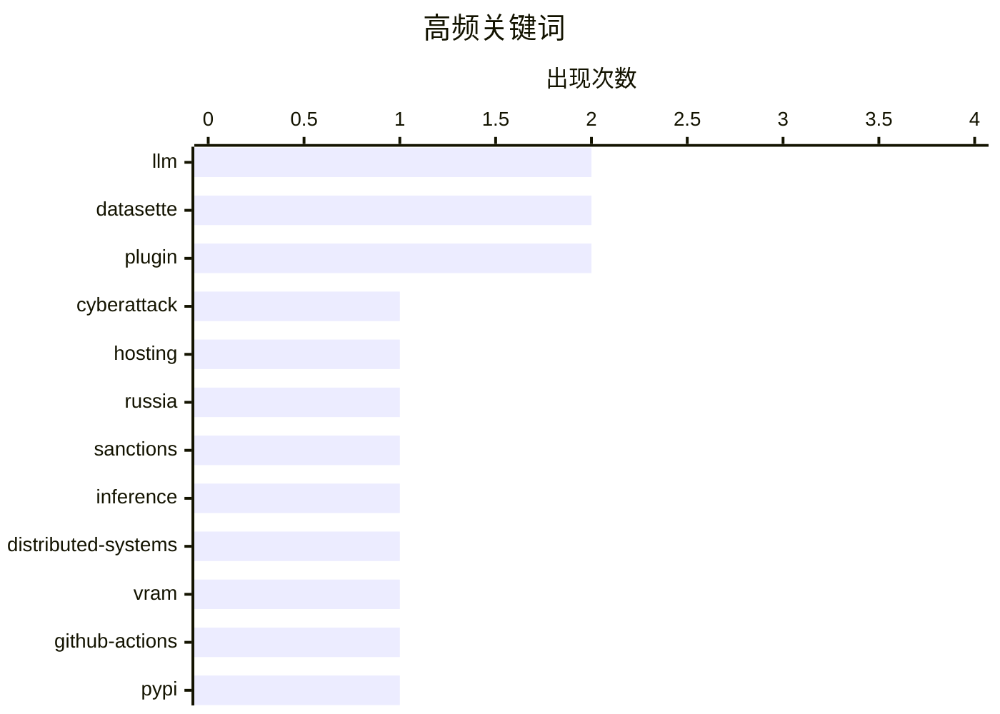

# 📰 AI 博客每日精选 — 2026-05-26

> 来自 Karpathy 推荐的 92 个顶级技术博客，AI 精选 Top 10

## 🏆 今日必读

🥇 **Netherlands Seizes 800 Servers, Arrests 2 for Aiding Cyberattacks**

[Netherlands Seizes 800 Servers, Arrests 2 for Aiding Cyberattacks](https://krebsonsecurity.com/2026/05/netherlands-seizes-800-servers-arrests-2-for-aiding-cyberattacks/) — krebsonsecurity.com · 9 小时前 · 🔒 安全

> Authorities in the Netherlands have arrested the co-owners of two related Internet hosting companies for operating IT infrastructure used by Russia to carry out cyberattacks, influence operations and 

🏷️ cyberattack, hosting, Russia, sanctions

🥈 **Distributing LLM inference in DwarfStar**

[Distributing LLM inference in DwarfStar](http://antirez.com/news/167) — antirez.com · 8 小时前 · 🤖 AI / ML

> antirez 8 hours ago. 3794 views. High end NVIDIA cards, and the server and power needed to run them, cost a lot of money, especially if you plan to reach enough VRAM to run massive models. The alterna

🏷️ LLM, inference, distributed-systems, VRAM

🥉 **GitHub Actions security in Python packages**

[GitHub Actions security in Python packages](https://nesbitt.io/2026/05/25/github-actions-security-in-python-packages.html) — nesbitt.io · 13 小时前 · 🔒 安全

> This is a written version of a talk I gave at PyCon US 2026 in Long Beach. Slides (PDF) , scripts, and datasets are at github.com/andrew/pycon . Of the roughly 864,000 packages PyPI lists, about 387,0

🏷️ GitHub-Actions, PyPI, OIDC, supply-chain

---

## 📊 数据概览

| 扫描源 | 抓取文章 | 时间范围 | 精选 |
|:---:|:---:|:---:|:---:|
| 88/92 | 2562 篇 → 17 篇 | 24h | **10 篇** |

### 分类分布



### 高频关键词



<details>
<summary>📈 纯文本关键词图（终端友好）</summary>

```
llm                 │ ████████████████████ 2
datasette           │ ████████████████████ 2
plugin              │ ████████████████████ 2
cyberattack         │ ██████████░░░░░░░░░░ 1
hosting             │ ██████████░░░░░░░░░░ 1
russia              │ ██████████░░░░░░░░░░ 1
sanctions           │ ██████████░░░░░░░░░░ 1
inference           │ ██████████░░░░░░░░░░ 1
distributed-systems │ ██████████░░░░░░░░░░ 1
vram                │ ██████████░░░░░░░░░░ 1
```

</details>

### 🏷️ 话题标签

**llm**(2) · **datasette**(2) · **plugin**(2) · cyberattack(1) · hosting(1) · russia(1) · sanctions(1) · inference(1) · distributed-systems(1) · vram(1) · github-actions(1) · pypi(1) · oidc(1) · supply-chain(1) · release(1) · data(1) · agent(1) · quoridor(1) · game-theory(1) · algorithms(1)

---

## 🔒 安全

### 1. Netherlands Seizes 800 Servers, Arrests 2 for Aiding Cyberattacks

[Netherlands Seizes 800 Servers, Arrests 2 for Aiding Cyberattacks](https://krebsonsecurity.com/2026/05/netherlands-seizes-800-servers-arrests-2-for-aiding-cyberattacks/) — **krebsonsecurity.com** · 9 小时前 · ⭐ 28/30

> Authorities in the Netherlands have arrested the co-owners of two related Internet hosting companies for operating IT infrastructure used by Russia to carry out cyberattacks, influence operations and 

🏷️ cyberattack, hosting, Russia, sanctions

---

### 2. GitHub Actions security in Python packages

[GitHub Actions security in Python packages](https://nesbitt.io/2026/05/25/github-actions-security-in-python-packages.html) — **nesbitt.io** · 13 小时前 · ⭐ 26/30

> This is a written version of a talk I gave at PyCon US 2026 in Long Beach. Slides (PDF) , scripts, and datasets are at github.com/andrew/pycon . Of the roughly 864,000 packages PyPI lists, about 387,0

🏷️ GitHub-Actions, PyPI, OIDC, supply-chain

---

### 3. Trump Mobile Website Exposed the Number of Pre-Orders — Both Completed and Abandoned — and the Associated Customer Information

[Trump Mobile Website Exposed the Number of Pre-Orders — Both Completed and Abandoned — and the Associated Customer Information](https://www.theguardian.com/us-news/2026/may/23/trump-mobile-investigating-potential-exposure-of-would-be-customers-personal-information) — **daringfireball.net** · 4 小时前 · ⭐ 23/30

> Trump Mobile says an investigation is under way into the potential security issue affecting ‘certain customer details’. It coincides with the company beginning to distribute its bespoke T1 smartphones

🏷️ data-exposure, PII, preorders, website

---

### 4. Welcoming the Bhutanese Government to Have I Been Pwned

[Welcoming the Bhutanese Government to Have I Been Pwned](https://www.troyhunt.com/welcoming-the-bhutanese-government-to-have-i-been-pwned/) — **troyhunt.com** · 12 分钟前 · ⭐ 15/30

> Today, we welcome the 45th government onboarded to Have I Been Pwned’s free gov service: Bhutan. The Bhutan Computer Incident Response Team, BtCIRT, now has access to monitor Bhutanese government doma

🏷️ HIBP, government, breach-monitoring, credentials

---

## 🤖 AI / ML

### 5. Distributing LLM inference in DwarfStar

[Distributing LLM inference in DwarfStar](http://antirez.com/news/167) — **antirez.com** · 8 小时前 · ⭐ 26/30

> antirez 8 hours ago. 3794 views. High end NVIDIA cards, and the server and power needed to run them, cost a lot of money, especially if you plan to reach enough VRAM to run massive models. The alterna

🏷️ LLM, inference, distributed-systems, VRAM

---

### 6. datasette-agent 0.1a4

[datasette-agent 0.1a4](https://simonwillison.net/2026/May/24/datasette-agent/#atom-everything) — **simonwillison.net** · 23 小时前 · ⭐ 21/30

> Simon Willison’s Weblog Subscribe Sponsored by: exe.dev &mdash; ssh, root, https. Real VMs, not sandboxes. Edge-injected secrets so you can yolo. 0→1? ½→1! 24th May 2026 Release datasette-agent 0.1a4 

🏷️ Datasette, agent, LLM, plugin

---

## ⚙️ 工程

### 7. Solving the board game Quoridor

[Solving the board game Quoridor](https://grantslatton.com/solving-quoridor) — **grantslatton.com** · 3 小时前 · ⭐ 20/30

> 2026-05-25 Solving Quoridor This post significantly improves the state of the art in solving the board game Quoridor. I describe novel techniques that enable fully solving almost all board configurati

🏷️ Quoridor, game-theory, algorithms, search

---

### 8. FediMeteo, timezones, and the art of not breaking what already works

[FediMeteo, timezones, and the art of not breaking what already works](https://it-notes.dragas.net/2026/05/25/fedimeteo-timezones-and-the-art-of-not-breaking-what-already-works/) — **it-notes.dragas.net** · 13 小时前 · ⭐ 19/30

> FediMeteo, timezones, and the art of not breaking what already works 20 min read 25/05/2026 09:14:00 by Stefano Marinelli Categories: server , networking , fediverse , snac , jail , ownyourdata , snac

🏷️ Fediverse, ActivityPub, timezones, Unix

---

## 🛠 工具 / 开源

### 9. datasette 1.0a30

[datasette 1.0a30](https://simonwillison.net/2026/May/24/datasette/#atom-everything) — **simonwillison.net** · 23 小时前 · ⭐ 22/30

> Simon Willison’s Weblog Subscribe Sponsored by: exe.dev &mdash; ssh, root, https. Real VMs, not sandboxes. Edge-injected secrets so you can yolo. 0→1? ½→1! 24th May 2026 Release datasette 1.0a30 &mdas

🏷️ Datasette, release, plugin, data

---

## 💡 观点 / 杂谈

### 10. Pluralistic: No honor among (ad-tech) thieves (25 May 2026)

[Pluralistic: No honor among (ad-tech) thieves (25 May 2026)](https://pluralistic.net/2026/05/25/lying-spies/) — **pluralistic.net** · 14 小时前 · ⭐ 20/30

> ->->->->->->->->->->->->->->->->->->->->->->->->->->->->-> Top Sources: None --> Today's links No honor among (ad-tech) thieves : Including "and" and "the." Hey look at this : Delights to delectate. O

🏷️ ad-tech, surveillance, privacy, economics

---

*生成于 2026-05-26 07:04 | 扫描 88 源 → 获取 2562 篇 → 精选 10 篇*
*基于 [Hacker News Popularity Contest 2025](https://refactoringenglish.com/tools/hn-popularity/) RSS 源列表*
