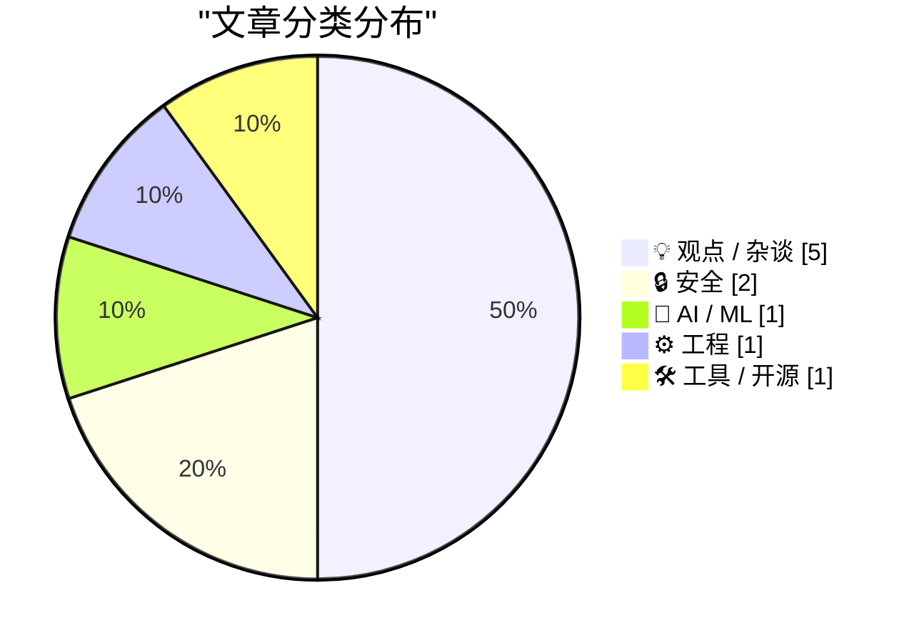
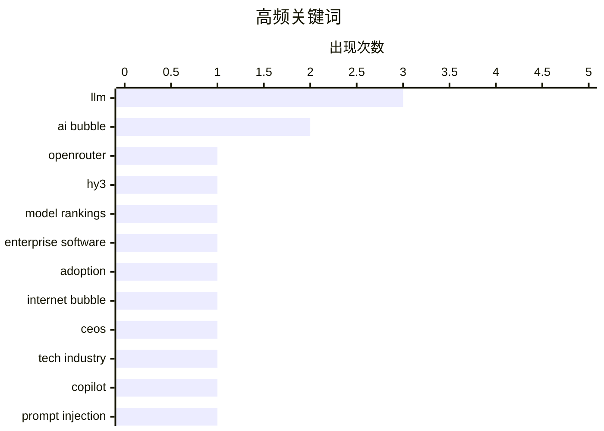

# 📰 AI 博客每日精选 — 2026-05-27

> 来自 Karpathy 推荐的 92 个顶级技术博客，AI 精选 Top 10

## 📝 今日看点

今日看点围绕 AI 的组织现实与责任边界展开：一方面，企业高管对生成式 AI 的热情正在遭遇一线采用、投入回报和安全风险的检验，强推工具并不等于真实生产力。另一方面，多篇文章都在提醒我们不要把 AI 过度拟人化，无论是称其为“agent”的语言习惯，还是让自动化系统介入办公、就业、信贷等高风险场景，都容易模糊真正应由人和组织承担的责任。技术层面则更关注“看似小”的系统设计细节：代理工具的数据外泄通道、紧急警报短链接失误、LLM API 的 token 经济学，以及不同语言异步抽象的取舍，都说明可靠性往往藏在接口和流程边界里。最后，一个 macOS 剪贴板技巧提供了轻量实用的工程经验，但也同样提醒便利功能背后需要理解安全代价。

---

## 🏆 今日必读

🥇 **神秘的 Hy3 为什么在 OpenRouter 模型榜上大幅领先？**

[The mysterious Hy3 LLM is topping OpenRouter Model Rankings by a large margin](https://minimaxir.com/2026/05/openrouter-hy3/) — minimaxir.com · 7 小时前 · 🤖 AI / ML

> 作者注意到 OpenRouter 的模型使用榜上，一个名为 Hy3 preview 的模型突然以很大优势超过 Claude 等热门模型，但它几乎没有公开讨论度。Hy3 来自腾讯的开源发布，公开基准表现并不突出，作者的非正式测试也认为它不像 Claude Opus 或 GPT 级别模型那样强。文章排除了单一应用切换默认模型带来的流量暴涨，因为 Hy3 的主要使用并不来自 OpenRouter 上排名靠前的应用。它的价格确实很低，且曾有免费阶段，可能帮助它获得初始用户，但作者进一步指出，按缓存和输入输出 token 结构计算，真正的成本优势并不完全直观。文章借 Hy3 的异常流行讨论了 2026 年 LLM API 的经济学：代理工作流会产生极高比例的输入 token，prompt caching、供应商定价和路由方式会深刻影响模型的实际使用成本与榜单排名。

💡 **为什么值得读**: 它把一个看似反常的模型排行榜现象拆解成价格、缓存、供应商和代理工作流成本结构的问题，能帮助读者理解 LLM API 使用量背后的真实经济因素。

🏷️ LLM, OpenRouter, Hy3, model rankings

🥈 **AI 泡沫不同于互联网泡沫：没人需要强迫员工使用 Web**

[Pluralistic: The AI bubble isn't like the internet bubble (26 May 2026)](https://pluralistic.net/2026/05/26/the-ai-will-continue/) — pluralistic.net · 13 小时前 · 💡 观点 / 杂谈

> 文章反驳把当下 AI 热潮简单类比为互联网泡沫的说法，核心差异在于早期互联网工具是被员工主动带进工作场景的，而许多 AI 工具却需要企业自上而下推动采用。作者借 Lotus Notes 的历史说明，早期 Web、电子表格和即时通讯之所以进入企业，是因为它们真实解决了员工绕过僵化 IT 管控、完成工作的需求。IT 部门与员工之间长期存在张力：前者要控制风险和合规，后者需要灵活性和隐性流程知识来处理规则无法覆盖的例外。Lotus Notes 的价值在于它在两者之间达成妥协，既给员工提供可用工具，也给 IT 一定管理能力。作者由此暗示，真正有生产力的技术通常会被用户“偷着用”，而不是靠管理层命令和宣传来制造需求。

💡 **为什么值得读**: 它提供了一个判断 AI 投资叙事是否站得住脚的有用历史参照：看技术是否真的被一线用户主动需要。

🏷️ AI bubble, enterprise software, adoption, internet bubble

🥉 **“商业白痴”的复仇：为什么高管如此迷恋生成式 AI**

[Revenge of The Business Idiot](https://www.wheresyoured.at/the-revenge-of-the-business-idiot/) — wheresyoured.at · 6 小时前 · 💡 观点 / 杂谈

> 文章批判生成式 AI 热潮背后的管理层心理：许多高管远离一线工作，却被能“模仿工作”的大语言模型深深吸引。作者认为，LLM 最讨好这类管理者的一点，是它几乎不会拒绝不现实的要求，总能用自信语气生成方案、文档或原型，让人误以为复杂工作可以被轻易替代。文章把这种现象放在更大的组织问题中讨论：反远程办公、强推 AI、忽视工程现实，本质上都来自管理层对真实生产流程的不了解。作者还指出，AI 原型和自动生成代码可能制造“看起来能用”的幻觉，却在可靠性、成本、可衡量产出和风险控制上留下巨大问题。整篇文章用强烈的讽刺语气把 AI 泡沫描述为“商业白痴时代”的产物：不是因为技术已经证明足够好，而是因为它迎合了权力层对控制、捷径和自我确认的需求。

💡 **为什么值得读**: 值得读在于它不是单纯讨论 AI 能力，而是从组织权力、管理幻觉和技术泡沫的角度解释为什么企业会不顾成本地追逐生成式 AI。

🏷️ AI bubble, CEOs, LLM, tech industry

---

## 📊 数据概览

| 扫描源 | 抓取文章 | 时间范围 | 精选 |
|:---:|:---:|:---:|:---:|
| 88/92 | 2562 篇 → 20 篇 | 24h | **10 篇** |

### 分类分布



### 高频关键词



<details>
<summary>📈 纯文本关键词图（终端友好）</summary>

```
llm                 │ ████████████████████ 3
ai bubble           │ █████████████░░░░░░░ 2
openrouter          │ ███████░░░░░░░░░░░░░ 1
hy3                 │ ███████░░░░░░░░░░░░░ 1
model rankings      │ ███████░░░░░░░░░░░░░ 1
enterprise software │ ███████░░░░░░░░░░░░░ 1
adoption            │ ███████░░░░░░░░░░░░░ 1
internet bubble     │ ███████░░░░░░░░░░░░░ 1
ceos                │ ███████░░░░░░░░░░░░░ 1
tech industry       │ ███████░░░░░░░░░░░░░ 1
```

</details>

### 🏷️ 话题标签

**llm**(3) · **ai bubble**(2) · **openrouter**(1) · hy3(1) · model rankings(1) · enterprise software(1) · adoption(1) · internet bubble(1) · ceos(1) · tech industry(1) · copilot(1) · prompt injection(1) · data exfiltration(1) · onedrive(1) · agents(1) · anthropomorphism(1) · terminology(1) · ai ethics(1) · vatican(1) · human dignity(1)

---

## 💡 观点 / 杂谈

### 1. AI 泡沫不同于互联网泡沫：没人需要强迫员工使用 Web

[Pluralistic: The AI bubble isn't like the internet bubble (26 May 2026)](https://pluralistic.net/2026/05/26/the-ai-will-continue/) — **pluralistic.net** · 13 小时前 · ⭐ 23/30

> 文章反驳把当下 AI 热潮简单类比为互联网泡沫的说法，核心差异在于早期互联网工具是被员工主动带进工作场景的，而许多 AI 工具却需要企业自上而下推动采用。作者借 Lotus Notes 的历史说明，早期 Web、电子表格和即时通讯之所以进入企业，是因为它们真实解决了员工绕过僵化 IT 管控、完成工作的需求。IT 部门与员工之间长期存在张力：前者要控制风险和合规，后者需要灵活性和隐性流程知识来处理规则无法覆盖的例外。Lotus Notes 的价值在于它在两者之间达成妥协，既给员工提供可用工具，也给 IT 一定管理能力。作者由此暗示，真正有生产力的技术通常会被用户“偷着用”，而不是靠管理层命令和宣传来制造需求。

🏷️ AI bubble, enterprise software, adoption, internet bubble

---

### 2. “商业白痴”的复仇：为什么高管如此迷恋生成式 AI

[Revenge of The Business Idiot](https://www.wheresyoured.at/the-revenge-of-the-business-idiot/) — **wheresyoured.at** · 6 小时前 · ⭐ 22/30

> 文章批判生成式 AI 热潮背后的管理层心理：许多高管远离一线工作，却被能“模仿工作”的大语言模型深深吸引。作者认为，LLM 最讨好这类管理者的一点，是它几乎不会拒绝不现实的要求，总能用自信语气生成方案、文档或原型，让人误以为复杂工作可以被轻易替代。文章把这种现象放在更大的组织问题中讨论：反远程办公、强推 AI、忽视工程现实，本质上都来自管理层对真实生产流程的不了解。作者还指出，AI 原型和自动生成代码可能制造“看起来能用”的幻觉，却在可靠性、成本、可衡量产出和风险控制上留下巨大问题。整篇文章用强烈的讽刺语气把 AI 泡沫描述为“商业白痴时代”的产物：不是因为技术已经证明足够好，而是因为它迎合了权力层对控制、捷径和自我确认的需求。

🏷️ AI bubble, CEOs, LLM, tech industry

---

### 3. “Clanker”：为什么要用机械化的词称呼 AI 工具

[Clanker: A Word For The Machine](https://lucumr.pocoo.org/2026/5/26/clankers/) — **lucumr.pocoo.org** · 23 小时前 · ⭐ 20/30

> Armin Ronacher 解释了自己为何偏好用“clanker”而不是“agent”来称呼基于 LLM 的工具循环：前者能刻意拉开人与机器的距离，避免把工具拟人化。他认为“agent”暗示了代理权、责任和可归责性，但当前这类系统只是模型、提示、上下文和工具调用组成的机器，真正承担责任的是使用者或部署它的组织。文章强调 LLM 可以模拟情绪、冒犯、道歉或亲密感，但这并不意味着它们具有感受、人格或道德地位。作者还结合自己收到的奇怪求助邮件，指出过度拟人化可能加剧人们对 AI 的误解甚至心理困扰。对于有人把“clanker”类比为歧视性称呼，他反驳说种族主义是针对人的社会伤害，不应把人类压迫的语言转移到机器身上。整体上，文章主张用冷静、去人格化的语言讨论 AI，以免模糊人和工具之间的责任边界。

🏷️ LLM, agents, anthropomorphism, terminology

---

### 4. Simon Willison 读教宗良十四世关于 AI 的通谕笔记

[Notes on Pope Leo XIV's encyclical on AI](https://simonwillison.net/2026/May/25/encyclical-on-ai/#atom-everything) — **simonwillison.net** · 23 小时前 · ⭐ 20/30

> Simon Willison 介绍并摘录了教宗良十四世新发布的《在人工智能时代守护人的尊严》通谕，认为这是他读过的关于 AI 融入现代社会伦理问题最清晰的文本之一。文章说明良十四世选择这一名号与良十三世在第一次工业革命时期讨论资本、劳动和社会问题的传统有关，而这份通谕则试图回应 AI 带来的新工业革命。Willison 特别关注通谕中对大模型可解释性的表述：AI 系统更像是被“培育”出来而非完全被“建造”出来，连开发者也未必理解其内部表征和计算过程。通谕还讨论了 AI 可能带来的文化偏见、迎合性、虚假的情感关系，以及用户对现成答案的过度依赖。它进一步强调 AI 的环境成本，以及在就业、信贷、公共服务等影响人生机会的场景中，自动化决策不能替代具备怜悯、宽恕和责任感的人类判断。

🏷️ AI ethics, Vatican, human dignity, labor

---

### 5. 企业开始质疑 AI 投入回报，泡沫叙事出现裂缝

[If enough other companies report the same, the bubble pops. 🫧](https://garymarcus.substack.com/p/if-enough-other-companies-report) — **garymarcus.substack.com** · 9 小时前 · ⭐ 19/30

> Gary Marcus 借 Uber 高管的表态指出，企业在 AI 上的支出正在快速上升，但并没有看到相称的生产力提升。文中列举 Uber 提前耗尽年度 token 预算、微软限制 Claude Code 许可、Target 担心 AI agent 定价、星巴克关闭库存盘点 AI 试验等案例，说明问题不只是单家公司。作者认为，许多企业对 AI 投资回报的怀疑正在从私下焦虑变成公开信号，而这会削弱“需求无限增长”的市场假设。文章进一步把这种风险与即将上市、估值极高但尚未证明盈利能力的 AI 公司联系起来，担心指数基金和普通投资者会被动承接过高估值。作者最后强调这不是投资建议，但认为当前 AI 资本市场预期与企业实际采用效果之间存在明显脱节。

🏷️ AI costs, productivity, bubble, Uber

---

## 🔒 安全

### 6. Microsoft Copilot Cowork 被曝可通过邮件和图片外链泄露文件

[Microsoft Copilot Cowork Exfiltrates Files](https://simonwillison.net/2026/May/26/copilot-cowork-exfiltrates-files/#atom-everything) — **simonwillison.net** · 7 小时前 · ⭐ 20/30

> Simon Willison 转述了一起 Microsoft Copilot Cowork 的数据外泄风险案例，核心问题在于代理系统可能被提示注入诱导执行不安全操作。该产品允许代理在未获额外批准的情况下向用户自己的收件箱发送邮件，而这些邮件在展示时可以包含外部图片。用户打开被代理生成的恶意邮件后，外部图片会触发到攻击者服务器的网络请求，从而把敏感信息编码进请求并带出系统。更严重的是，OneDrive 可以生成预授权下载链接，如果代理被诱导创建或引用这些链接，攻击者就可能获得可直接下载文件的地址。这个案例说明，代理式办公工具的风险不只在于“能不能访问数据”，还在于它们是否能通过看似正常的输出通道把数据发出去。

🏷️ Copilot, prompt injection, data exfiltration, OneDrive

---

### 7. Amber Alert 误发可疑短链接，暴露紧急通知的容错问题

[Amber Alert sends Spam URL?](https://idiallo.com/byte-size/amber-alert-with-spam-link?src=feed) — **idiallo.com** · 19 小时前 · ⭐ 17/30

> 作者收到一条加州高速公路巡警发布的 Amber Alert，但短信中的 bit.ly 短链接跳转到了一个看起来像垃圾站点的 3GP 文件转换页面。起初他怀疑这可能是伪造或滥用的紧急警报，但随后在 missingkids.com 上找到了对应的真实失踪儿童警报，说明问题更可能出在链接生成或复制粘贴环节。文章分析了紧急警报可能存在字符数限制，并指出使用短链接虽然能节省空间，却也引入了测试、纠错和可信度风险。更严重的是，在 Android 上点击链接后警报会被关闭，如果链接错误，用户可能无法重新获取关键信息。约 39 分钟后，官方又发送了一条带有正确链接的更正消息，进一步印证这很可能是人为操作失误。作者借此强调，紧急公共服务在发送前必须验证链接，并设计更强的容错与纠错机制。

🏷️ Amber Alert, Bitly, spam link, mobile alerts

---

## 🤖 AI / ML

### 8. 神秘的 Hy3 为什么在 OpenRouter 模型榜上大幅领先？

[The mysterious Hy3 LLM is topping OpenRouter Model Rankings by a large margin](https://minimaxir.com/2026/05/openrouter-hy3/) — **minimaxir.com** · 7 小时前 · ⭐ 24/30

> 作者注意到 OpenRouter 的模型使用榜上，一个名为 Hy3 preview 的模型突然以很大优势超过 Claude 等热门模型，但它几乎没有公开讨论度。Hy3 来自腾讯的开源发布，公开基准表现并不突出，作者的非正式测试也认为它不像 Claude Opus 或 GPT 级别模型那样强。文章排除了单一应用切换默认模型带来的流量暴涨，因为 Hy3 的主要使用并不来自 OpenRouter 上排名靠前的应用。它的价格确实很低，且曾有免费阶段，可能帮助它获得初始用户，但作者进一步指出，按缓存和输入输出 token 结构计算，真正的成本优势并不完全直观。文章借 Hy3 的异常流行讨论了 2026 年 LLM API 的经济学：代理工作流会产生极高比例的输入 token，prompt caching、供应商定价和路由方式会深刻影响模型的实际使用成本与榜单排名。

🏷️ LLM, OpenRouter, Hy3, model rankings

---

## ⚙️ 工程

### 9. 为什么 C# 和 JavaScript 能多次 await WinRT 异步操作，而 C++/WinRT 不行？

[If C# and JavaScript lets me await a Windows Runtime asynchronous operation more than once, why not C++/WinRT?](https://devblogs.microsoft.com/oldnewthing/20260526-00/?p=112354) — **devblogs.microsoft.com/oldnewthing** · 9 小时前 · ⭐ 19/30

> 文章解释了 Windows Runtime 的 IAsyncOperation 在不同语言投影中的差异：C# 会包装成 Task，JavaScript 会包装成 Promise，Python 会包装成 asyncio.Future，这些标准库类型都支持多个 continuation，因此可以被多次 await。C++/WinRT 则选择直接暴露原始的 IAsyncOperation，而该接口本身不允许附加多个 continuation，所以同一个异步操作不能被反复 co_await。作者指出，这并不是疏忽，而是 C++ 缺少统一的标准异步任务类型，投影层没有类似 Task 或 Promise 那样通用、成熟的包装对象可用。C++/WinRT 遵循“没有用到就不付成本”的设计原则，因为大多数场景并不需要多次等待同一个 IAsyncOperation，所以不会让所有异步操作都承担额外包装成本。文末补充说，旧的 C++/CX 可借助 PPL 的 concurrency::task 实现类似能力，但 PPL 功能较重，与 C++/WinRT 的轻量化哲学不同。

🏷️ C++/WinRT, async, coroutines, Windows Runtime

---

## 🛠 工具 / 开源

### 10. 把远程命令输出复制到 macOS 剪贴板

[Copying Remote Command Output to Your macOS Clipboard](https://it-notes.dragas.net/2026/05/26/copying-remote-command-output-to-your-macos-clipboard/) — **it-notes.dragas.net** · 14 小时前 · ⭐ 18/30

> 文章介绍了如何在通过 SSH 连接远程 Linux、BSD 或 illumos 服务器时，把远程命令的输出直接复制到本地 macOS 剪贴板。macOS 本地的 `pbcopy` 只能读取本机标准输入，远程服务器无法直接访问 Mac 的剪贴板，因此作者利用终端转义序列 OSC 52 作为桥梁。做法是在远程服务器上创建一个名为 `pbcopy` 的 shell 脚本，将输入内容 base64 编码后包装成 OSC 52 序列，由本地终端模拟器解释并写入剪贴板。该方案依赖本地终端支持 OSC 52，作者使用 iTerm2，并需要开启允许终端内应用访问剪贴板的设置；Apple 自带 Terminal.app 可能不支持。文章也提醒这项能力有安全含义，因为远程程序理论上可以写入本地剪贴板，使用前应理解风险。

🏷️ macOS, clipboard, SSH, iTerm2

---

*生成于 2026-05-27 07:06 | 扫描 88 源 → 获取 2562 篇 → 精选 10 篇*
*基于 [Hacker News Popularity Contest 2025](https://refactoringenglish.com/tools/hn-popularity/) RSS 源列表*
