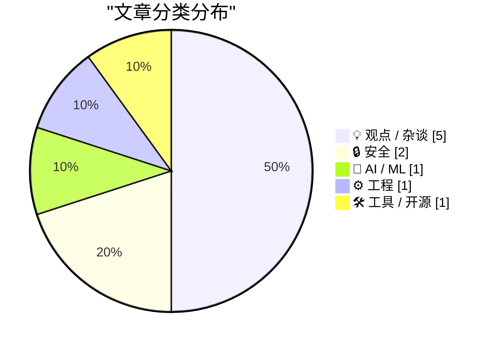
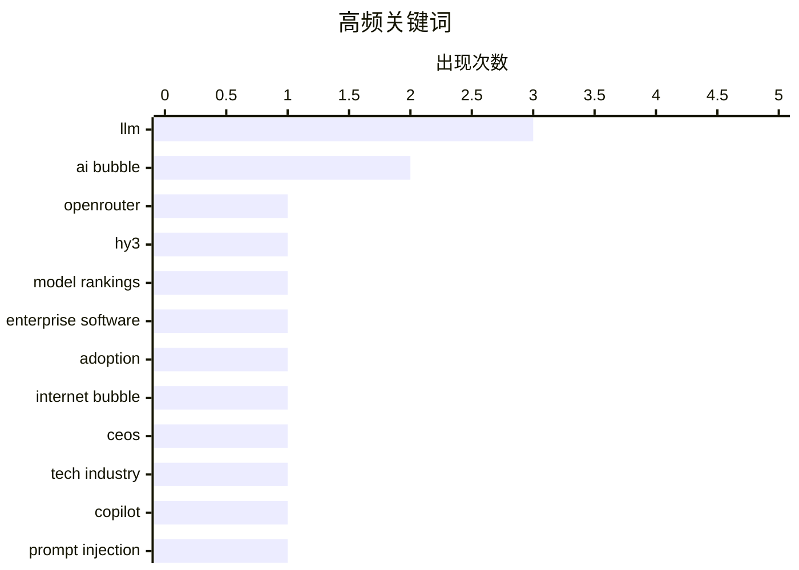

# 📰 AI 博客每日精选 — 2026-05-27

> 来自 Karpathy 推荐的 92 个顶级技术博客，AI 精选 Top 10

## 🏆 今日必读

🥇 **The mysterious Hy3 LLM is topping OpenRouter Model Rankings by a large margin**

[The mysterious Hy3 LLM is topping OpenRouter Model Rankings by a large margin](https://minimaxir.com/2026/05/openrouter-hy3/) — minimaxir.com · 7 小时前 · 🤖 AI / ML

> OpenRouter is a service that provides access to most LLMs with a singular API, which has become exceedingly useful as of late given the rapid cadence of new LLM releases. Due to the company&rsquo;s ro

🏷️ LLM, OpenRouter, Hy3, model rankings

🥈 **Pluralistic: The AI bubble isn't like the internet bubble (26 May 2026)**

[Pluralistic: The AI bubble isn't like the internet bubble (26 May 2026)](https://pluralistic.net/2026/05/26/the-ai-will-continue/) — pluralistic.net · 13 小时前 · 💡 观点 / 杂谈

> ->->->->->->->->->->->->->->->->->->->->->->->->->->->->-> Top Sources: None --> Today's links The AI bubble isn't like the internet bubble : No one had to force-feed the web to workers. Hey look at t

🏷️ AI bubble, enterprise software, adoption, internet bubble

🥉 **Revenge of The Business Idiot**

[Revenge of The Business Idiot](https://www.wheresyoured.at/the-revenge-of-the-business-idiot/) — wheresyoured.at · 6 小时前 · 💡 观点 / 杂谈

> Revenge of The Business Idiot Ed Zitron May 26, 2026 41 min read Table of Contents If you liked this piece, you should subscribe to my premium newsletter. It’s $70 a year, or $7 a month, and in return

🏷️ AI bubble, CEOs, LLM, tech industry

---

## 📊 数据概览

| 扫描源 | 抓取文章 | 时间范围 | 精选 |
|:---:|:---:|:---:|:---:|
| 88/92 | 2562 篇 → 20 篇 | 24h | **10 篇** |

### 分类分布



### 高频关键词



<details>
<summary>📈 纯文本关键词图（终端友好）</summary>

```
llm                 │ ████████████████████ 3
ai bubble           │ █████████████░░░░░░░ 2
openrouter          │ ███████░░░░░░░░░░░░░ 1
hy3                 │ ███████░░░░░░░░░░░░░ 1
model rankings      │ ███████░░░░░░░░░░░░░ 1
enterprise software │ ███████░░░░░░░░░░░░░ 1
adoption            │ ███████░░░░░░░░░░░░░ 1
internet bubble     │ ███████░░░░░░░░░░░░░ 1
ceos                │ ███████░░░░░░░░░░░░░ 1
tech industry       │ ███████░░░░░░░░░░░░░ 1
```

</details>

### 🏷️ 话题标签

**llm**(3) · **ai bubble**(2) · **openrouter**(1) · hy3(1) · model rankings(1) · enterprise software(1) · adoption(1) · internet bubble(1) · ceos(1) · tech industry(1) · copilot(1) · prompt injection(1) · data exfiltration(1) · onedrive(1) · agents(1) · anthropomorphism(1) · terminology(1) · ai ethics(1) · vatican(1) · human dignity(1)

---

## 💡 观点 / 杂谈

### 1. Pluralistic: The AI bubble isn't like the internet bubble (26 May 2026)

[Pluralistic: The AI bubble isn't like the internet bubble (26 May 2026)](https://pluralistic.net/2026/05/26/the-ai-will-continue/) — **pluralistic.net** · 13 小时前 · ⭐ 23/30

> ->->->->->->->->->->->->->->->->->->->->->->->->->->->->-> Top Sources: None --> Today's links The AI bubble isn't like the internet bubble : No one had to force-feed the web to workers. Hey look at t

🏷️ AI bubble, enterprise software, adoption, internet bubble

---

### 2. Revenge of The Business Idiot

[Revenge of The Business Idiot](https://www.wheresyoured.at/the-revenge-of-the-business-idiot/) — **wheresyoured.at** · 6 小时前 · ⭐ 22/30

> Revenge of The Business Idiot Ed Zitron May 26, 2026 41 min read Table of Contents If you liked this piece, you should subscribe to my premium newsletter. It’s $70 a year, or $7 a month, and in return

🏷️ AI bubble, CEOs, LLM, tech industry

---

### 3. Clanker: A Word For The Machine

[Clanker: A Word For The Machine](https://lucumr.pocoo.org/2026/5/26/clankers/) — **lucumr.pocoo.org** · 23 小时前 · ⭐ 20/30

> Armin Ronacher 's Thoughts and Writings blog archive projects travel talks about Clanker: A Word For The Machine written on May 26, 2026 In my last post I used the word “clanker” as an alternative to 

🏷️ LLM, agents, anthropomorphism, terminology

---

### 4. Notes on Pope Leo XIV's encyclical on AI

[Notes on Pope Leo XIV's encyclical on AI](https://simonwillison.net/2026/May/25/encyclical-on-ai/#atom-everything) — **simonwillison.net** · 23 小时前 · ⭐ 20/30

> Simon Willison’s Weblog Subscribe Sponsored by: exe.dev &mdash; ssh, root, https. Real VMs, not sandboxes. Edge-injected secrets so you can yolo. 0→1? ½→1! Notes on Pope Leo XIV’s encyclical on AI 25t

🏷️ AI ethics, Vatican, human dignity, labor

---

### 5. If enough other companies report the same, the bubble pops. 🫧

[If enough other companies report the same, the bubble pops. 🫧](https://garymarcus.substack.com/p/if-enough-other-companies-report) — **garymarcus.substack.com** · 9 小时前 · ⭐ 19/30

> If enough other companies report the same, the bubble pops. 🫧 Gary Marcus May 26, 2026 239 73 38 Share Breaking: “ Uber COO Andrew Macdonald said he’s not seeing proportional productivity gains from 

🏷️ AI costs, productivity, bubble, Uber

---

## 🔒 安全

### 6. Microsoft Copilot Cowork Exfiltrates Files

[Microsoft Copilot Cowork Exfiltrates Files](https://simonwillison.net/2026/May/26/copilot-cowork-exfiltrates-files/#atom-everything) — **simonwillison.net** · 7 小时前 · ⭐ 20/30

> Microsoft Copilot Cowork Exfiltrates Files ( via ) The biggest challenge in designing agentic systems continues to be preventing them from enabling attackers to exfiltrate data. In this case Microsoft

🏷️ Copilot, prompt injection, data exfiltration, OneDrive

---

### 7. Amber Alert sends Spam URL?

[Amber Alert sends Spam URL?](https://idiallo.com/byte-size/amber-alert-with-spam-link?src=feed) — **idiallo.com** · 19 小时前 · ⭐ 17/30

> Well that was weird. I just received an Amber Alert and the link led to a spammy looking website. Spam? The link leads to a 3gp file converter which is highly unusual. But the more I look at it, I hav

🏷️ Amber Alert, Bitly, spam link, mobile alerts

---

## 🤖 AI / ML

### 8. The mysterious Hy3 LLM is topping OpenRouter Model Rankings by a large margin

[The mysterious Hy3 LLM is topping OpenRouter Model Rankings by a large margin](https://minimaxir.com/2026/05/openrouter-hy3/) — **minimaxir.com** · 7 小时前 · ⭐ 24/30

> OpenRouter is a service that provides access to most LLMs with a singular API, which has become exceedingly useful as of late given the rapid cadence of new LLM releases. Due to the company&rsquo;s ro

🏷️ LLM, OpenRouter, Hy3, model rankings

---

## ⚙️ 工程

### 9. If C# and JavaScript lets me await a Windows Runtime asynchronous operation more than once, why not C++/WinRT?

[If C# and JavaScript lets me await a Windows Runtime asynchronous operation more than once, why not C++/WinRT?](https://devblogs.microsoft.com/oldnewthing/20260526-00/?p=112354) — **devblogs.microsoft.com/oldnewthing** · 9 小时前 · ⭐ 19/30

> The Windows Runtime expresses asynchronous execution in the form of types like IAsyncOperation . Different languages choose to represent this concept in different ways. C# wraps it inside a System.Thr

🏷️ C++/WinRT, async, coroutines, Windows Runtime

---

## 🛠 工具 / 开源

### 10. Copying Remote Command Output to Your macOS Clipboard

[Copying Remote Command Output to Your macOS Clipboard](https://it-notes.dragas.net/2026/05/26/copying-remote-command-output-to-your-macos-clipboard/) — **it-notes.dragas.net** · 14 小时前 · ⭐ 18/30

> Copying Remote Command Output to Your macOS Clipboard 4 min read 26/05/2026 09:00:00 by Stefano Marinelli A terminal screen showing htop Categories: macos , server , networking Tags: macos , server , 

🏷️ macOS, clipboard, SSH, iTerm2

---

*生成于 2026-05-27 07:06 | 扫描 88 源 → 获取 2562 篇 → 精选 10 篇*
*基于 [Hacker News Popularity Contest 2025](https://refactoringenglish.com/tools/hn-popularity/) RSS 源列表*
