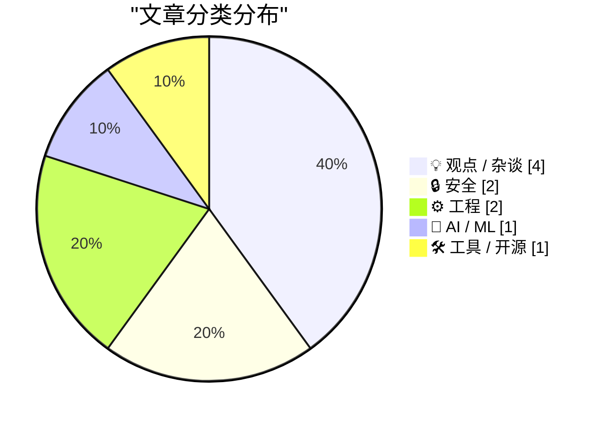
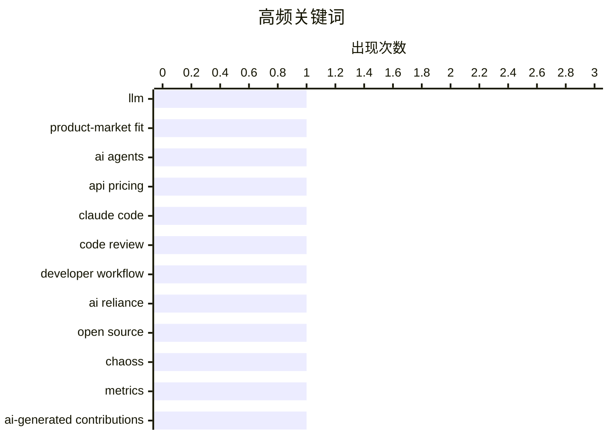

# 📰 AI 博客每日精选 — 2026-05-28

> 来自 Karpathy 推荐的 92 个顶级技术博客，AI 精选 Top 10

## 📝 今日看点

今天技术圈最鲜明的信号，是 AI 正从“会不会用”转向“如何治理”：一边，大模型在企业级编码代理和 API 计费上显露出清晰的产品市场契合点；另一边，开发者对过度依赖 AI 交付结果的反思，以及 AI 批量制造安全报告带来的响应负担，也在同步加剧。与此同时，开源与工程体系正被 AI 重新改写——无论是 CHAOSS 这类传统社区指标失真，还是异步编程、数据库实践、性能基准等基础工程话题回归，都说明“底层能力”仍是技术竞争的硬通货。再往更宏观处看，从关键基础设施并购审查到重提互联网时代的战略转向，行业关注点已不只是创新速度，更是技术扩张背后的制度、安全与长期选择。

---

## 🏆 今日必读

🥇 **我认为 Anthropic 和 OpenAI 已经找到了产品市场契合点**

[I think Anthropic and OpenAI have found product-market fit](https://simonwillison.net/2026/May/27/product-market-fit/#atom-everything) — simonwillison.net · 6 小时前 · 🤖 AI / ML

> 文章认为，Anthropic 和 OpenAI 在 2026 年已经通过企业级编码代理与 API 计费模式找到了产品市场契合点。作者用自己近 30 天的使用估算举例：Anthropic Claude Code 的 API 代币费用约为 1,199.79 美元，OpenAI Codex 约为 980.37 美元，而他实际只支付了 Anthropic Max 和 OpenAI Pro 共 200 美元订阅费，说明个人重度用户仍享有明显折扣。与此相对，Anthropic 已将 Enterprise 方案改为每席位每月 20 美元加按 API 用量计费，OpenAI 也在 2026 年 4 月把 Codex 与 ChatGPT Enterprise 等方案改为与 API token 用量对齐。文章还指出，4 月发布的新模型价格继续上升，GPT-5.5 的 API 价格是 GPT-5.4 的 2 倍，Opus 4.7 按新 tokenizer 计算约为 Opus 4.6 的 1.4 倍。作者的判断是，企业客户已经愿意按 API 价格持续付费，厂商也开始通过定价和产品机制把高价值使用场景沉淀为收入。

💡 **为什么值得读**: 值得读在于它把订阅套餐、企业计费变更和新模型涨价放在同一条商业线索里，清楚解释了大模型公司为何可能真正进入可持续收入阶段。

🏷️ LLM, product-market fit, AI agents, API pricing

🥈 **动动我自己的脑子**

[Using My Fucking Brain](https://terriblesoftware.org/2026/05/27/using-my-fucking-brain/) — terriblesoftware.org · 10 小时前 · 💡 观点 / 杂谈

> 作者反思了自己把 Sentry 问题直接交给 Claude 调查、生成 PR、通过审核并合并，却没有亲自查看 issue、代码或修复是否合理的经历。最令人不安的不是 Claude 这次给出了正确答案，而是即使它错了，整套流程在表面上看起来也几乎不会有区别。作者并不否定 Claude Code、Skills 这类工具的价值，仍然认可用模型解释代码、查 bug、建议修复、总结长讨论和处理重复性工作。真正的软件工程工作不在于敲代码，而在于判断报错是否只是症状、反复审视堆栈中的异常线索、识别“技术上正确但范围过窄”的修复，并让人的判断始终参与决策。更理想的用法是先自己阅读 issue、形成初步假设，再让模型挑战思路、搜索代码库、提出其他解释并起草修复，最后由人审阅补丁并做决定。

💡 **为什么值得读**: 值得读，因为它精准点出了 AI 编程工具最容易被忽视的风险：问题不在模型偶尔出错，而在开发者可能把自己的判断力从工作流里整体拿掉。

🏷️ Claude Code, code review, developer workflow, AI reliance

🥉 **2026 年的 CHAOSS 指标**

[CHAOSS Metrics in 2026](https://nesbitt.io/2026/05/27/chaoss-metrics-in-2026.html) — nesbitt.io · 13 小时前 · 💡 观点 / 杂谈

> 文章聚焦于 CHAOSS 为开源项目定义的一套通用指标，在 2026 年的现实环境下是否仍然成立，尤其是这些定义如何隐含依赖了早期“事件由人以较高成本产生”的前提。作者指出，2018 至 2023 年间形成的许多指标默认贡献产生于人工节奏、安全通告频率较低、维护者停止维护时通常也会停止提交，而这些条件如今都在变化。像 Issues New、Issues Closed、Change Requests、Change Request Acceptance Ratio、Code Changes Commits、Code Changes Lines 这类基于仓库事件计数的指标，在模型生成 bug 报告和低成本自动化 PR 增多后，越来越难代表真实的用户需求、社区活力或贡献质量。以 curl 的维护经验为例，顶部数字可能上升，但维护者每项投入时间增加、真正有价值的条目占比下降，而现有计数指标无法区分这些变化，连“变更请求接受率下降是否代表项目不友好”这样的原始解释都可能被反转。作者的结论是，CHAOSS 现有指标目录中相当一部分定义需要重新审视，因为单纯统计仓库事件，已不足以稳定反映开源社区的实际状态。

💡 **为什么值得读**: 值得读在于它具体指出了开源治理中常用指标在哪些前提下失效，能帮助维护者、研究者和做仪表盘的人避免把“更多事件”误读为“更健康的项目”。

🏷️ open source, CHAOSS, metrics, AI-generated contributions

---

## 📊 数据概览

| 扫描源 | 抓取文章 | 时间范围 | 精选 |
|:---:|:---:|:---:|:---:|
| 87/92 | 2553 篇 → 15 篇 | 24h | **10 篇** |

### 分类分布



### 高频关键词



<details>
<summary>📈 纯文本关键词图（终端友好）</summary>

```
llm                │ ████████████████████ 1
product-market fit │ ████████████████████ 1
ai agents          │ ████████████████████ 1
api pricing        │ ████████████████████ 1
claude code        │ ████████████████████ 1
code review        │ ████████████████████ 1
developer workflow │ ████████████████████ 1
ai reliance        │ ████████████████████ 1
open source        │ ████████████████████ 1
chaoss             │ ████████████████████ 1
```

</details>

### 🏷️ 话题标签

**llm**(1) · **product-market fit**(1) · **ai agents**(1) · api pricing(1) · claude code(1) · code review(1) · developer workflow(1) · ai reliance(1) · open source(1) · chaoss(1) · metrics(1) · ai-generated contributions(1) · kyndryl(1) · solvinity(1) · telecom law(1) · sovereignty(1) · ai(1) · labor(1) · migration(1) · automation(1)

---

## 💡 观点 / 杂谈

### 1. 动动我自己的脑子

[Using My Fucking Brain](https://terriblesoftware.org/2026/05/27/using-my-fucking-brain/) — **terriblesoftware.org** · 10 小时前 · ⭐ 25/30

> 作者反思了自己把 Sentry 问题直接交给 Claude 调查、生成 PR、通过审核并合并，却没有亲自查看 issue、代码或修复是否合理的经历。最令人不安的不是 Claude 这次给出了正确答案，而是即使它错了，整套流程在表面上看起来也几乎不会有区别。作者并不否定 Claude Code、Skills 这类工具的价值，仍然认可用模型解释代码、查 bug、建议修复、总结长讨论和处理重复性工作。真正的软件工程工作不在于敲代码，而在于判断报错是否只是症状、反复审视堆栈中的异常线索、识别“技术上正确但范围过窄”的修复，并让人的判断始终参与决策。更理想的用法是先自己阅读 issue、形成初步假设，再让模型挑战思路、搜索代码库、提出其他解释并起草修复，最后由人审阅补丁并做决定。

🏷️ Claude Code, code review, developer workflow, AI reliance

---

### 2. 2026 年的 CHAOSS 指标

[CHAOSS Metrics in 2026](https://nesbitt.io/2026/05/27/chaoss-metrics-in-2026.html) — **nesbitt.io** · 13 小时前 · ⭐ 23/30

> 文章聚焦于 CHAOSS 为开源项目定义的一套通用指标，在 2026 年的现实环境下是否仍然成立，尤其是这些定义如何隐含依赖了早期“事件由人以较高成本产生”的前提。作者指出，2018 至 2023 年间形成的许多指标默认贡献产生于人工节奏、安全通告频率较低、维护者停止维护时通常也会停止提交，而这些条件如今都在变化。像 Issues New、Issues Closed、Change Requests、Change Request Acceptance Ratio、Code Changes Commits、Code Changes Lines 这类基于仓库事件计数的指标，在模型生成 bug 报告和低成本自动化 PR 增多后，越来越难代表真实的用户需求、社区活力或贡献质量。以 curl 的维护经验为例，顶部数字可能上升，但维护者每项投入时间增加、真正有价值的条目占比下降，而现有计数指标无法区分这些变化，连“变更请求接受率下降是否代表项目不友好”这样的原始解释都可能被反转。作者的结论是，CHAOSS 现有指标目录中相当一部分定义需要重新审视，因为单纯统计仓库事件，已不足以稳定反映开源社区的实际状态。

🏷️ open source, CHAOSS, metrics, AI-generated contributions

---

### 3. AI与一个没有移民的世界

[Pluralistic: AI and a world without migrants (27 May 2026)](https://pluralistic.net/2026/05/27/unnecessariat/) — **pluralistic.net** · 15 小时前 · ⭐ 21/30

> 文章围绕“他人即麻烦”这一社会协调难题展开，把AI热潮放进人与人协作、说服与强制之间的长期张力中审视。文中认为，人类依靠新皮层以及法律、团队、政府、家庭、委员会、官僚机构等社会结构来理解他人视角并完成个体无法独立完成的事务，这些机制虽不完美，但仍优于强制。作者把一部分富有者和技术推动者对“他人有自己目标”这一事实的不耐烦，与试图用“听话”的聊天机器人替代真实人的冲动联系起来，指出这种替代已经延伸到亲密关系场景，如“AI男友”“AI女友”。配文所举例子强调，一些人把无需道德考量、无需妥协的陪伴视为吸引力，仿佛追求一种没有真实爱人的爱情。作者的核心判断是，这类AI想象背后是一种拒绝承认他人主体性的独我论式世界观。

🏷️ AI, labor, migration, automation

---

### 4. 比尔·盖茨的《互联网潮汐浪潮》微软备忘录

[Bill Gates’ Internet Tidal Wave Microsoft memo](https://dfarq.homeip.net/bill-gates-internet-tidal-wave-microsoft-memo/?utm_source=rss&#038;utm_medium=rss&#038;utm_campaign=bill-gates-internet-tidal-wave-microsoft-memo) — **dfarq.homeip.net** · 12 小时前 · ⭐ 15/30

> 文章回顾了比尔·盖茨在 1995 年 5 月 26 日写给微软的内部备忘录《The Internet Tidal Wave》，以及这份文件为何被视为微软面向互联网转向的警报。备忘录长约 5600 字、40 段，把互联网称为自 1981 年 IBM PC 以来最重要的发展，甚至比图形用户界面更重要，并较为技术性地讨论了协议、Web 基础技术以及未来方向。盖茨当时判断互联网会带来颠覆性变化，这一点后来基本应验；文中提到他谈及的 HTML 底层技术延续至今，而像 VRML 这样的 3D 虚拟现实方案则没有真正普及。真正让他发出警报的是，1995 年的互联网几乎是“没有微软存在感”的空间：他浏览 10 小时几乎没见到 Word、AVI 等微软格式，反而提到苹果因更早支持 TCP 在早期互联网中存在感更强，Netscape 还拥有 70% 的市场份额。文章认为，这份备忘录的重要性在于它准确识别了互联网对既有软件秩序和微软自身地位的威胁，并推动微软正视这场变化。

🏷️ Microsoft, Internet, Bill Gates, memo

---

## 🔒 安全

### 5. Solvinity 决定的细节及其可能后果

[Het Solvinity besluit in detail, en de mogelijke gevolgen](https://berthub.eu/articles/posts/het-solvinity-besluit-gevolgen/) — **berthub.eu** · 15 小时前 · ⭐ 23/30

> 荷兰经济与气候政策国务秘书已决定禁止 Kyndryl 收购 Solvinity，这项决定依据的是《不受欢迎电信控制法》（WOZT）。文中指出，促成此事进入政策与舆论焦点的力量包括约 20 万人签署的请愿、新成立基金会 The Firewall 的法律行动，以及作者本人在议会相关场合的发声。现阶段尚不清楚禁令具体依据了 WOZT 的哪些法定理由，这使结果的外溢影响存在很大不确定性：理由可能宽泛到影响美国企业未来收购对荷兰社会和政府重要的托管公司，也可能与 Kyndryl 自身经营或账目问题有关，或是多种因素并存。作者还注意到国务秘书信函中的程序性异常之处，例如案件已历时 5 个月，而 WOZT 中关于两个月决定与最多再延六个月的安排，以及“交易即将完成”的表述，都值得进一步审视。作者的结论是，当前最关键的问题不是禁令本身，而是应尽快明确其法律依据，因为这将决定该决定对后续并购与公共利益审查的实际影响范围。

🏷️ Kyndryl, Solvinity, telecom law, sovereignty

---

### 6. 压力

[The pressure](https://simonwillison.net/2026/May/26/the-pressure/#atom-everything) — **simonwillison.net** · 23 小时前 · ⭐ 19/30

> curl 团队正承受前所未有的安全响应压力，原因是大量由 AI 辅助产生且可信的安全问题报告持续涌入。安全报告的到达速度已达到 2024 年的 4 到 5 倍、2025 年的两倍，平均现在每天会收到超过一份报告，而且报告通常更长、更细致，整体质量也明显高于以往。这样的工作洪流正在挤压团队成员的时间与生活平衡，Daniel Stenberg 直言这类高优先级任务已经压过项目中的其他事务。与此同时，curl 本身仍被认为是非常稳固的软件，近几年发现的漏洞几乎都被评为 LOW 或 MEDIUM，最近一次 HIGH 严重级别的 curl CVE 还是在 2023 年 10 月。AI 让安全报告处理负担显著上升，但也侧面说明 curl 暂未频繁暴露出特别严重的漏洞。

🏷️ curl, vulnerability reports, AI-assisted, maintainer burnout

---

## ⚙️ 工程

### 7. 在多个协程之间共享单个 Windows Runtime IAsyncOperation 的结果，第 1 部分

[Sharing the result of a single Windows Runtime IAsyncOperation among multiple coroutines, part 1](https://devblogs.microsoft.com/oldnewthing/20260527-00/?p=112361) — **devblogs.microsoft.com/oldnewthing** · 9 小时前 · ⭐ 20/30

> 主题聚焦于在 C++/WinRT 中把一次性获取“something”的异步结果缓存起来，并让多个协程共享同一个 Windows Runtime IAsyncOperation 的结果。文章先对比了 C# 的做法：IAsyncOperation 会投影为可被多次 await 的 Task，因此很容易通过加锁和缓存任务来避免重复启动。随后分析了一位客户在 C++/WinRT 中借助 winrt::resume_on_signal、事件对象、busy 标志和互斥锁实现共享结果的方案：首次调用启动真实任务，后续调用等待同一个完成信号，完成后把结果保存到 m_thing。作者指出这段实现至少存在两个问题：完成回调在互斥锁外修改 m_busy 会产生 data race，而且代码缺乏异常安全性，若 GetThingWorkerAsync 在返回 IAsyncOperation 之前抛出异常，状态可能出错。结论是，直接用事件和状态位拼装共享异步结果在 C++/WinRT 中非常脆弱，现有方案并不可靠。

🏷️ C++/WinRT, coroutines, IAsyncOperation, async caching

---

### 8. SQLAlchemy 2 实战：练习题解答

[SQLAlchemy 2 In Practice - Solutions to the Exercises](https://blog.miguelgrinberg.com/post/sqlalchemy-2-in-practice---solutions-to-the-exercises) — **miguelgrinberg.com** · 3 小时前 · ⭐ 15/30

> 这篇内容汇总了《SQLAlchemy 2 in Practice》整套练习题的参考解答，并回顾了全书覆盖的主题，包括数据库表、关系建模、异步 SQLAlchemy 与 Web 集成等章节。已展示的解答主要围绕 Product 数据模型编写 SQLAlchemy 2 查询，涵盖条件过滤、排序、分页、模糊匹配、or_ 组合条件、distinct 去重、between 区间过滤，以及 min、max、count、group_by 等聚合操作。示例给出了多项具体结果，例如 1983 年按字母排序的前三个产品、包含 “Z80” 的 63 条结果、1980 年代生产过产品的 65 家制造商、克罗地亚产品的年份范围与总数为 1981 到 1984 年共 4 个，以及各年份产品数量统计中 1983 年以 24 个居首。内容定位明确，是系列收尾篇，重点不是讲解新概念，而是用完整答案对应书中练习，帮助读者核对 SQLAlchemy 2 查询写法与结果。

🏷️ SQLAlchemy, Python, database, ORM

---

## 🤖 AI / ML

### 9. 我认为 Anthropic 和 OpenAI 已经找到了产品市场契合点

[I think Anthropic and OpenAI have found product-market fit](https://simonwillison.net/2026/May/27/product-market-fit/#atom-everything) — **simonwillison.net** · 6 小时前 · ⭐ 26/30

> 文章认为，Anthropic 和 OpenAI 在 2026 年已经通过企业级编码代理与 API 计费模式找到了产品市场契合点。作者用自己近 30 天的使用估算举例：Anthropic Claude Code 的 API 代币费用约为 1,199.79 美元，OpenAI Codex 约为 980.37 美元，而他实际只支付了 Anthropic Max 和 OpenAI Pro 共 200 美元订阅费，说明个人重度用户仍享有明显折扣。与此相对，Anthropic 已将 Enterprise 方案改为每席位每月 20 美元加按 API 用量计费，OpenAI 也在 2026 年 4 月把 Codex 与 ChatGPT Enterprise 等方案改为与 API token 用量对齐。文章还指出，4 月发布的新模型价格继续上升，GPT-5.5 的 API 价格是 GPT-5.4 的 2 倍，Opus 4.7 按新 tokenizer 计算约为 Opus 4.6 的 1.4 倍。作者的判断是，企业客户已经愿意按 API 价格持续付费，厂商也开始通过定价和产品机制把高价值使用场景沉淀为收入。

🏷️ LLM, product-market fit, AI agents, API pricing

---

## 🛠 工具 / 开源

### 10. 我给 iozone 打了补丁，让它在现代 macOS 上做磁盘基准测试更可靠

[I patched iozone for better disk benchmarks on modern macOS](https://www.jeffgeerling.com/blog/2026/i-patched-iozone-for-better-disk-benchmarks-on-modern-macos/) — **jeffgeerling.com** · 21 小时前 · ⭐ 20/30

> 核心问题是 iozone 在较新的 macOS、尤其是 Apple Silicon Mac 上编译出错，影响作者统一使用这款工具进行磁盘基准测试。作者长期用 iozone 比较硬盘和 SSD 的真实文件系统性能，看重它跨 Mac、Windows 和 Linux 的一致性；虽然 fio 等工具在原始磁盘性能测试上更强，但 iozone 更适合快速获得整体表现概览。为解决编译问题，作者向上游提交了补丁，相关修复已被维护者合并进 iozone 509 和 510，其中 510 可在运行 macOS 26、使用 Clang 21.0.0 的多台 Mac 上完成构建。文中还给出了下载、编译和运行示例，并展示了用 1GB 测试文件、4K 和 1M 块大小测试 MacBook Neo 内置 SSD 的命令。作者的结论是，相比依赖包管理器绕过构建错误，直接修复上游代码更合适，现在 iozone 已能继续作为现代 macOS 上可用的磁盘基准工具。

🏷️ iozone, macOS, disk benchmark, Apple Silicon

---

*生成于 2026-05-28 07:05 | 扫描 87 源 → 获取 2553 篇 → 精选 10 篇*
*基于 [Hacker News Popularity Contest 2025](https://refactoringenglish.com/tools/hn-popularity/) RSS 源列表*
