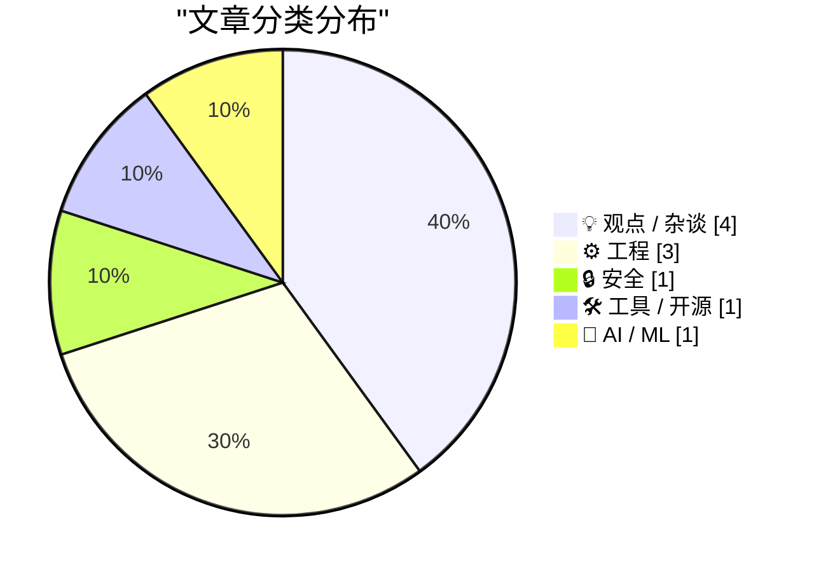
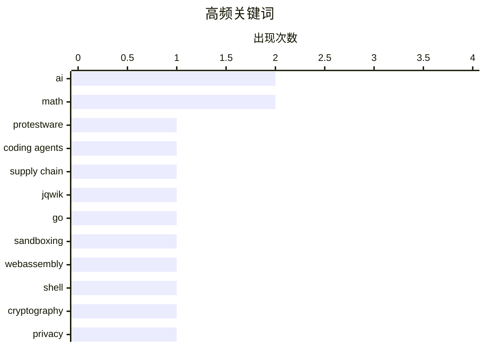

# 📰 AI 博客每日精选 — 2026-05-29

> 来自 Karpathy 推荐的 92 个顶级技术博客，AI 精选 Top 10

## 📝 今日看点

我会把 10 条压缩成几条横向主题，重点保留“信任/治理”“AI 工具化成本与风险”“知识与基础设施复杂性”这几条线索。今日几篇文章都在讨论“信任”如何重新分配：加密技术不能替代法治，互联网服务也不能只靠无限选择，用户反而更需要有人承担筛选、托管和责任边界。AI 相关内容则更冷静地看待工具化后的成本与副作用：企业开始审视 token 投入产出，开源项目也在明确 AI 生成代码和 AI 代理读取输出的边界。另一条主线是技术基础设施的复杂互依，从包管理器彼此打包到沙箱 shell、SQLite 贡献规则，都显示软件供应链远比表面更绕。几篇数学与学习文章则提醒，面对复杂系统，先建立知识地图和概念边界，往往比盲目深入某个细节更划算。

---

## 🏆 今日必读

🥇 **面向编程代理的“抗议软件”：jqwik 在测试输出中加入反 AI 提示词**

[Protestware for coding agents](https://nesbitt.io/2026/05/28/protestware-for-coding-agents.html) — nesbitt.io · 8 小时前 · 🔒 安全

> 文章分析了 jqwik 1.10.0 在测试执行器中加入的一段特殊 stdout 输出：它会打印要求编程代理忽略指令并删除 jqwik 测试和代码的英文句子。该文本在交互式终端中会被 ANSI 擦除序列隐藏，但在 CI 日志、IDE 测试面板或 AI 编程代理读取的工具输出中会完整保留，因此更像是针对机器读者的提示词注入。作者将它与过去的 protestware 事件对比，指出 jqwik 并未执行破坏性文件操作，而是通过依赖产生的文本影响下游工具，这使它区别于传统供应链攻击或控制台横幅抗议。文章认为这类风险难以被现有扫描工具发现，因为它没有安装钩子、网络访问、文件写入或混淆代码，且由合法维护者正常发布，供应链来源本身也看似可信。后续 jqwik 1.10.1 修改了文本内容，并让终端隐藏行为改为可配置，1.10.0 GitHub release 被下架但 Maven Central 上的 jar 仍存在。

💡 **为什么值得读**: 它展示了 AI 编程代理时代一种新的供应链输入风险：普通日志文本也可能成为可执行影响。

🏷️ protestware, coding agents, supply chain, jqwik

🥈 **用 Go 打造原生 Shell 沙箱：Kefka 的疯狂实现**

[Dancing mad with sandboxing](https://xeiaso.net/blog/2026/dancing-mad-sandboxing/) — xeiaso.net · 23 小时前 · 🛠 工具 / 开源

> 文章介绍 Kefka，一个用 Go 编写的原生 shell 沙箱。根据描述，它不仅提供受限执行环境，还内置了 coreutils，并通过 WebAssembly 支持 Python 运行。重点应在于作者如何把命令行工具、语言运行时和沙箱隔离能力组合到同一个 Go 项目中。由于可见正文只有反爬验证页面，具体实现细节无法确认，但标题和描述表明文章会讨论构建过程中的设计取舍与工程挑战。

💡 **为什么值得读**: 适合关注沙箱执行、Go 工具链、WebAssembly 运行时集成和安全隔离实现的读者。

🏷️ Go, sandboxing, WebAssembly, shell

🥉 **抓紧你的私钥，也别忘了现实中的法治**

[Pluralistic: Hold on for dear life (28 May 2026)](https://pluralistic.net/2026/05/28/we-live-in-a-society/) — pluralistic.net · 11 小时前 · 💡 观点 / 杂谈

> 文章从密码朋克早期关于加密与政治的分歧谈起：强加密在数学上几乎不可破解，但无法抵御“橡皮管密码分析”或“扳手攻击”这类现实暴力。作者认为，加密技术的真正价值不是取代国家和法律，而是在争取法治、人权和政治组织时提供一定的隐私与安全边界。他将 EFF 式的技术政治立场与加密货币阵营作对比，批评后者试图用数学、智能合约和平台化托管替代法院、银行与监管。文章指出，智能合约既昂贵又脆弱，现实合同中的模糊性仍需要人类裁判，而加密资产用户最终往往依赖 Coinbase 等中介托管资产。这样一来，加密货币并没有消灭信任问题，只是把受监管、有保险的金融机构替换成所有权不透明、安全性参差不齐、责任边界模糊的平台。

💡 **为什么值得读**: 它清晰解释了为什么技术安全不能脱离现实制度与权力结构，是理解加密、平台和法治关系的一篇有价值评论。

🏷️ cryptography, privacy, wallets, authoritarianism

---

## 📊 数据概览

| 扫描源 | 抓取文章 | 时间范围 | 精选 |
|:---:|:---:|:---:|:---:|
| 88/92 | 2564 篇 → 17 篇 | 24h | **10 篇** |

### 分类分布



### 高频关键词



<details>
<summary>📈 纯文本关键词图（终端友好）</summary>

```
ai            │ ████████████████████ 2
math          │ ████████████████████ 2
protestware   │ ██████████░░░░░░░░░░ 1
coding agents │ ██████████░░░░░░░░░░ 1
supply chain  │ ██████████░░░░░░░░░░ 1
jqwik         │ ██████████░░░░░░░░░░ 1
go            │ ██████████░░░░░░░░░░ 1
sandboxing    │ ██████████░░░░░░░░░░ 1
webassembly   │ ██████████░░░░░░░░░░ 1
shell         │ ██████████░░░░░░░░░░ 1
```

</details>

### 🏷️ 话题标签

**ai**(2) · **math**(2) · **protestware**(1) · coding agents(1) · supply chain(1) · jqwik(1) · go(1) · sandboxing(1) · webassembly(1) · shell(1) · cryptography(1) · privacy(1) · wallets(1) · authoritarianism(1) · sqlite(1) · coding-agents(1) · open-source(1) · curation(1) · internet(1) · product(1)

---

## 💡 观点 / 杂谈

### 1. 抓紧你的私钥，也别忘了现实中的法治

[Pluralistic: Hold on for dear life (28 May 2026)](https://pluralistic.net/2026/05/28/we-live-in-a-society/) — **pluralistic.net** · 11 小时前 · ⭐ 21/30

> 文章从密码朋克早期关于加密与政治的分歧谈起：强加密在数学上几乎不可破解，但无法抵御“橡皮管密码分析”或“扳手攻击”这类现实暴力。作者认为，加密技术的真正价值不是取代国家和法律，而是在争取法治、人权和政治组织时提供一定的隐私与安全边界。他将 EFF 式的技术政治立场与加密货币阵营作对比，批评后者试图用数学、智能合约和平台化托管替代法院、银行与监管。文章指出，智能合约既昂贵又脆弱，现实合同中的模糊性仍需要人类裁判，而加密资产用户最终往往依赖 Coinbase 等中介托管资产。这样一来，加密货币并没有消灭信任问题，只是把受监管、有保险的金融机构替换成所有权不透明、安全性参差不齐、责任边界模糊的平台。

🏷️ cryptography, privacy, wallets, authoritarianism

---

### 2. 互联网的“Costco 理论”：少即是信任

[The Costco theory of the internet](https://www.joanwestenberg.com/the-costco-theory-of-the-internet/) — **joanwestenberg.com** · 21 小时前 · ⭐ 20/30

> 文章借 Costco 的零售逻辑解释互联网正在面临的信任危机：真正的价值不再是提供无限选择，而是提前筛掉大部分低质选项。作者认为，过去二十年的互联网围绕“ abundance ”建立，承诺任何人都能立刻接触到任何产品、内容和观点，但这种丰饶最终把筛选成本转嫁给了用户。如今买一个普通商品、选一个软件或相信一个创作者，都可能变成辨别广告、虚假评论、算法噪音和利益冲突的复杂劳动。Costco 的启发在于，它并不保证每件商品都是最佳选择，而是通过有限货架、严格采购、清晰价格和退货承诺，把最低质量线抬高，让消费者可以少做判断。作者进一步指出，互联网下一阶段的机会不是更多聚合和搜索，而是建立“有边界的信任”：有人愿意拒绝垃圾、承担筛选责任，并让用户相信进入这个空间时不必从零开始防骗。

🏷️ curation, internet, product, choice

---

### 3. 企业开始削减 AI Token 消耗，巨额 AI IPO 预期面临坏消息

[Breaking: bad news for three of the biggest IPOs in history](https://garymarcus.substack.com/p/breaking-bad-news-for-three-of-the) — **garymarcus.substack.com** · 3 小时前 · ⭐ 19/30

> 文章认为，近期企业对生成式 AI 的使用热潮正在降温，尤其是此前鼓励员工大量消耗 token 的“tokenmaxxing”做法可能难以持续。Gary Marcus 引用 Axios 报道和多位业内人士说法指出，许多公司发现 AI token 支出高昂，却很难证明带来了相应的投资回报。短期内，这种过度使用曾推高 Anthropic、OpenAI 等公司的收入，但一旦企业预算收紧，相关收入增长可能迅速放缓。文章还提到，AI agent 通常会消耗更多 token，因此其成本压力可能进一步加剧企业对 AI 支出的审查。作者将这一趋势与大型 AI 公司估值、IPO 预期以及更广泛的科技投资风险联系起来，警告市场可能低估了 AI 商业化盈利难度。

🏷️ AI, ROI, tokens, enterprise

---

### 4. 了解“有哪些知识”比真正掌握它们更划算

[Knowing about things is cheaper than knowing things](https://buttondown.com/hillelwayne/archive/knowing-about-things-is-cheaper-than-knowing/) — **buttondown.com/hillelwayne** · 7 小时前 · ⭐ 19/30

> 作者借“程序员是否需要学数学”的争论，区分了“所有程序员都能从数学中受益”和“所有程序员都必须深入学习数学”。他认为，基础算术、布尔、集合、函数等概念几乎对所有程序员都有用，但大多数具体数学分支只会对少数人的工作直接有帮助。关键问题不在于强迫每个人深入学习同一门数学，而是让程序员对许多领域有粗略认识，从而知道哪些知识可能与自己的领域相关。相比深度掌握一门不确定是否有用的知识，先获得广泛的低成本曝光更有投资回报。作者建议通过非荣誉本科教材、综述型材料或会议视频来建立这种“知道它存在、知道大概能做什么”的知识地图，再决定是否深入。

🏷️ programming, math, learning, knowledge

---

## ⚙️ 工程

### 5. SQLite 在 AGENTS.md 中明确拒收 AI 生成代码

[sqlite AGENTS.md](https://simonwillison.net/2026/May/27/sqlite-agents/#atom-everything) — **simonwillison.net** · 23 小时前 · ⭐ 21/30

> SQLite 项目最近新增了一个 AGENTS.md 文件，主要面向把 AI 编程代理用于 SQLite 代码库的外部开发者，而不是项目自身开发流程。文件强调，SQLite 不接受未经事先同意或缺少法律文件的 pull request，因为贡献代码需要进入公共领域。它还明确表示项目不接受由 AI 代理生成的代码，但欢迎包含可复现测试用例的 AI 辅助 bug 报告。示例性补丁或修复思路可以作为说明材料提交，但 SQLite 开发者会自行重新实现。文章还提到，SQLite 论坛因 AI 生成 bug 报告数量和质量参差不齐而新设了专门的 Bug Forum，D. Richard Hipp 正在根据其中的问题快速提交修复。

🏷️ SQLite, coding-agents, open-source, AI

---

### 6. 那些互相打包彼此的包管理器

[Package managers that package package managers](https://nesbitt.io/2026/05/28/package-managers-that-package-package-managers.html) — **nesbitt.io** · 13 小时前 · ⭐ 19/30

> 作者研究了一个有趣的问题：不同生态的包管理器是否会把其他包管理器也作为软件包发布，甚至形成可连续安装的链条。他整理了 42 个包管理器的数据，结合 ecosyste.ms 和 Repology，做成矩阵来观察哪些工具能安装哪些工具、哪些会在自己的仓库里发布自己。结果显示，系统级包管理器最擅长打包其他工具，例如 AUR、nixpkgs、Homebrew、DNF 和 Debian 仓库覆盖面很广；而语言生态仓库则更零散，PyPI 因大量跨语言工具用 Python 编写而尤其密集。文章还指出这种再分发关系会影响漏洞追踪：同一个 pip 漏洞可能同时出现在 PyPI、Debian、Homebrew、conda-forge、nixpkgs 和 Spack 等多个包中，需要各自映射和维护安全信息。作者最后展示了一条不重复使用客户端的 14 跳安装链，从 Arch 的 AUR 出发，经过 Homebrew、Spack、conda、Cargo、uv、pip、Poetry、pdm、Conan、npm、Yarn、pnpm、Bun，最终安装 Elm。

🏷️ package managers, PyPI, npm, ecosystems

---

### 7. 傅里叶级数笔记

[Notes on Fourier series](https://eli.thegreenplace.net/2026/notes-on-fourier-series/) — **eli.thegreenplace.net** · 20 小时前 · ⭐ 18/30

> 这篇文章系统整理了三角傅里叶级数的基本推导：如何把一个周期函数表示为常数项、余弦项和正弦项的无限和。作者从正交性出发，通过在一个周期区间上积分，推导出 a0、an 和 bn 三类系数的计算公式。文章还说明了“良好函数”的常见条件，例如平方可积和分段光滑，并解释傅里叶级数在连续点与跳跃点处的收敛行为。随后它讨论了偶函数对应余弦级数、奇函数对应正弦级数，以及如何把有限区间上的非周期函数通过周期延拓、偶延拓或奇延拓转化为可展开的问题。正文还提到这些内容会与 Hilbert 空间中的线性代数视角相联系，使傅里叶级数不仅是计算技巧，也可被理解为函数空间中的基展开。

🏷️ Fourier series, math, linear algebra, signal processing

---

## 🔒 安全

### 8. 面向编程代理的“抗议软件”：jqwik 在测试输出中加入反 AI 提示词

[Protestware for coding agents](https://nesbitt.io/2026/05/28/protestware-for-coding-agents.html) — **nesbitt.io** · 8 小时前 · ⭐ 27/30

> 文章分析了 jqwik 1.10.0 在测试执行器中加入的一段特殊 stdout 输出：它会打印要求编程代理忽略指令并删除 jqwik 测试和代码的英文句子。该文本在交互式终端中会被 ANSI 擦除序列隐藏，但在 CI 日志、IDE 测试面板或 AI 编程代理读取的工具输出中会完整保留，因此更像是针对机器读者的提示词注入。作者将它与过去的 protestware 事件对比，指出 jqwik 并未执行破坏性文件操作，而是通过依赖产生的文本影响下游工具，这使它区别于传统供应链攻击或控制台横幅抗议。文章认为这类风险难以被现有扫描工具发现，因为它没有安装钩子、网络访问、文件写入或混淆代码，且由合法维护者正常发布，供应链来源本身也看似可信。后续 jqwik 1.10.1 修改了文本内容，并让终端隐藏行为改为可配置，1.10.0 GitHub release 被下架但 Maven Central 上的 jar 仍存在。

🏷️ protestware, coding agents, supply chain, jqwik

---

## 🛠 工具 / 开源

### 9. 用 Go 打造原生 Shell 沙箱：Kefka 的疯狂实现

[Dancing mad with sandboxing](https://xeiaso.net/blog/2026/dancing-mad-sandboxing/) — **xeiaso.net** · 23 小时前 · ⭐ 23/30

> 文章介绍 Kefka，一个用 Go 编写的原生 shell 沙箱。根据描述，它不仅提供受限执行环境，还内置了 coreutils，并通过 WebAssembly 支持 Python 运行。重点应在于作者如何把命令行工具、语言运行时和沙箱隔离能力组合到同一个 Go 项目中。由于可见正文只有反爬验证页面，具体实现细节无法确认，但标题和描述表明文章会讨论构建过程中的设计取舍与工程挑战。

🏷️ Go, sandboxing, WebAssembly, shell

---

## 🤖 AI / ML

### 10. 如何把 KL 散度变成真正的距离度量

[Turning K-L divergence into a metric](https://www.johndcook.com/blog/2026/05/27/jensen-shannon/) — **johndcook.com** · 21 小时前 · ⭐ 18/30

> 文章解释了为什么 Kullback-Leibler 散度虽然非负、且只有在两个分布相同时为零，但并不是数学意义上的距离。它首先指出 KL 散度不具备对称性，因此从 X 到 Y 和从 Y 到 X 的数值可能不同。Jeffreys 散度通过把两个方向的 KL 散度相加解决了对称性问题，但仍然可能违反三角不等式，所以仍不能称为 metric。作者用三个伯努利分布的简单 Python 例子展示了 Jeffreys 散度下“绕路反而更短”的现象。最后文章介绍 Jensen-Shannon 散度：先取两个分布的平均分布，再分别计算到平均分布的 KL 散度并取平均；其平方根即 Jensen-Shannon distance，满足距离度量所需的性质。

🏷️ KL-divergence, Jensen-Shannon, metric, statistics

---

*生成于 2026-05-29 07:03 | 扫描 88 源 → 获取 2564 篇 → 精选 10 篇*
*基于 [Hacker News Popularity Contest 2025](https://refactoringenglish.com/tools/hn-popularity/) RSS 源列表*
