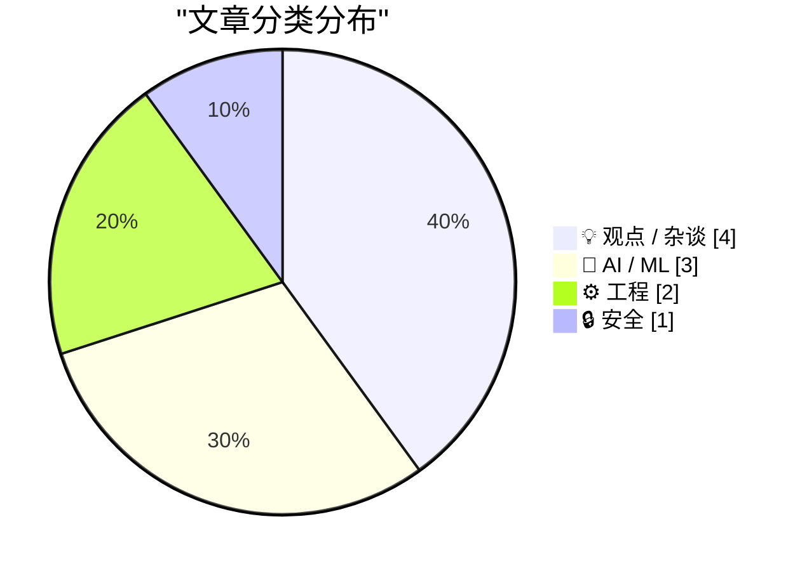
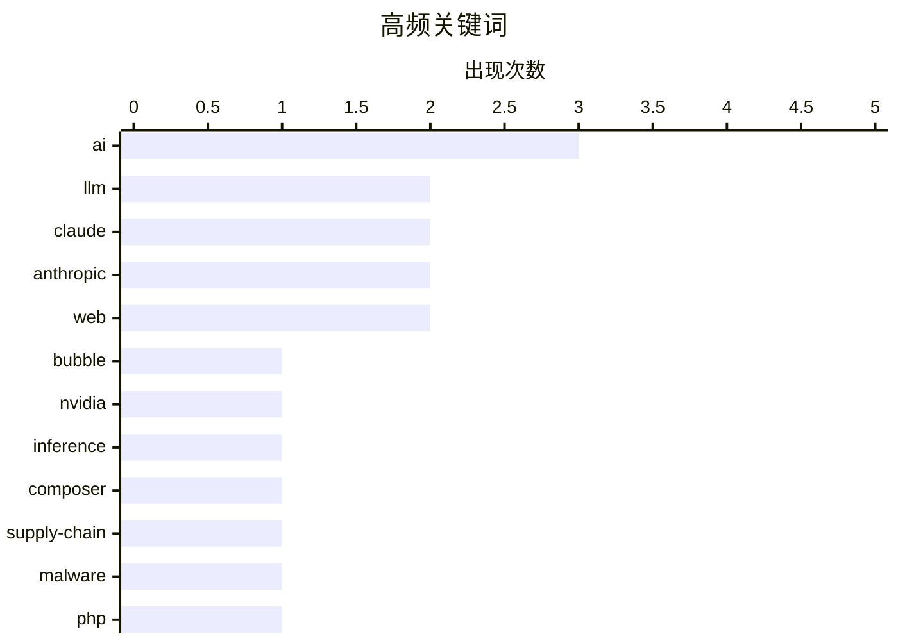

# 📰 AI 博客每日精选 — 2026-05-30

> 来自 Karpathy 推荐的 92 个顶级技术博客，AI 精选 Top 10

## 📝 今日看点

今天技术圈的焦点仍集中在 AI 基础设施与商业化兑现：算力需求、GPU 租赁价格、云厂商投入和头部 AI 公司营收正在共同决定“泡沫”叙事能否被证伪。模型竞争进入更微妙阶段，Anthropic 继续以产品迭代和营收增长强化存在感，而 Google Gemini 的开发者心智占位仍遭质疑。与此同时，软件生态回到“可信与可控”的基本面：依赖安全策略、开放 Web 标准和反骚扰式产品设计，正在成为工程社区重新审视平台责任的几个切口。

---

## 🏆 今日必读

🥇 **付费：如果我们正处在 AI 泡沫中？（第三部分）**

[Premium: What If...We're In An AI Bubble? (Part 3)](https://www.wheresyoured.at/premium-what-if-were-in-an-ai-bubble-part-3/) — wheresyoured.at · 6 小时前 · 💡 观点 / 杂谈

> AI 泡沫能否成立，取决于 NVIDIA、云厂商和 AI 公司对未来算力需求、数据中心建设与盈利能力的预测是否兑现。作者认为，NVIDIA 若要支撑到 2027 年底超过 1 万亿美元的 Blackwell 和 Vera Rubin GPU 销售，需要约 40GW 数据中心容量来承载 30GW 以上 GPU，并对应约 4350 亿美元的全球年度算力需求。除 OpenAI 和 Anthropic 外，当前可见需求似乎只有几十亿美元级别，而 NVIDIA 还在其合作伙伴处签下了 300 亿美元的多年云计算协议。数据中心建设周期过长，小型 40MW 项目也可能需要 24 个月以上，导致客户多年后才可能收回芯片和建设成本。作者的核心判断是，NVIDIA 的增长依赖市场相信这些数据中心会建成并赚钱，同时它至少已经囤放了 100 万块 Blackwell GPU。

💡 **为什么值得读**: 值得读，因为它用算力需求、GPU 销售、数据中心容量和建设周期等具体指标，拆解了 AI 基础设施繁荣背后的可持续性风险。

🏷️ AI, bubble, NVIDIA, inference

🥈 **Composer 的依赖策略**

[Composer’s dependency policies](https://nesbitt.io/2026/05/29/composer-dependency-policies.html) — nesbitt.io · 13 小时前 · 🔒 安全

> Composer 2.10 新增 config.policy 配置块，把安全公告、恶意软件报告、废弃包和自定义阻止列表统一到一个配置对象中。每个列表都提供 block、audit 和 ignore 三个选项，分别用于从解析器候选池移除匹配版本、控制审计行为，以及为特定包设置可带版本约束的豁免。恶意软件列表默认启用，并且会在 composer install 从 lockfile 安装时阻止已被标记的版本，而不是只在 composer audit 后报告。Composer 仓库可通过 packages.json 中的 filter.metadata: true 声明支持，并在包元数据中新增 filter 字段；Packagist.org 当前提供 malware 列表，由 Aikido 的 feed 驱动，summary 文件目前包含 70 个包。config.filter 的首版实现后来被重构为统一的 config.policy，现有 config.audit.* 会回退到该机制，并计划在 2.11 进入弃用路径。malware 不是保留名称，用户还可以在 config.policy 下定义 company-policy 等自定义列表，并从 Composer 仓库或 HTTPS sources 合并获取同样格式的策略数据。

💡 **为什么值得读**: 值得读，因为它展示了 Composer 正在把依赖安全控制从事后审计推进到解析和安装阶段的可配置策略体系。

🏷️ Composer, supply-chain, malware, PHP

🥉 **Gemini 到底怎么了？**

[What's going on with Gemini?](https://martinalderson.com/posts/whats-going-on-with-gemini/?utm_source=rss&amp;utm_medium=rss&amp;utm_campaign=feed) — martinalderson.com · 23 小时前 · 🤖 AI / ML

> Google 拥有深厚的研究团队、自研芯片和充足资金，但作者观察到许多开发者日常并不怎么使用 Gemini。当前前沿模型智能的共识是 Anthropic 和 OpenAI 领先，GPT-5.5 与 Opus 4.8 大致处于同一档；Gemini 3.1 Pro 在基准上领先部分中国模型，但落后于 Anthropic/OpenAI 旗舰模型。作者在软件工程任务中的个人体验是，GLM 5.1 和 Qwen 3.7 的效果优于 Gemini 3.1 Pro。Google I/O 的主要模型发布 Gemini 3.5 Flash 在编码基准中表现中等，但输出速度达到 206 tokens/s，约为 Anthropic/OpenAI 相关模型的 4 倍。问题在于 Gemini 3.5 Flash 价格比上一代 Flash 贵 3 倍，达到 9 美元/MTok，相比中国模型昂贵，使其在“最强智能”和“低价可用”之间定位不清。作者认为，如果把它看作面向 Google 内部产品如 AI mode、Gmail 的高速推理模型，并结合可能运行在单张 TPU 8i 卡上的推测，它的策略逻辑会更合理。

💡 **为什么值得读**: 它把 Gemini 3.5 Flash 的基准、速度、价格和潜在内部用途放在一起分析，能帮助读者判断这个模型到底适合什么场景。

🏷️ Gemini, Google, LLM, benchmarks

---

## 📊 数据概览

| 扫描源 | 抓取文章 | 时间范围 | 精选 |
|:---:|:---:|:---:|:---:|
| 87/92 | 2556 篇 → 20 篇 | 24h | **10 篇** |

### 分类分布



### 高频关键词



<details>
<summary>📈 纯文本关键词图（终端友好）</summary>

```
ai           │ ████████████████████ 3
llm          │ █████████████░░░░░░░ 2
claude       │ █████████████░░░░░░░ 2
anthropic    │ █████████████░░░░░░░ 2
web          │ █████████████░░░░░░░ 2
bubble       │ ███████░░░░░░░░░░░░░ 1
nvidia       │ ███████░░░░░░░░░░░░░ 1
inference    │ ███████░░░░░░░░░░░░░ 1
composer     │ ███████░░░░░░░░░░░░░ 1
supply-chain │ ███████░░░░░░░░░░░░░ 1
```

</details>

### 🏷️ 话题标签

**ai**(3) · **llm**(2) · **claude**(2) · anthropic(2) · web(2) · bubble(1) · nvidia(1) · inference(1) · composer(1) · supply-chain(1) · malware(1) · php(1) · gemini(1) · google(1) · benchmarks(1) · evaluation(1) · tokenmaxxing(1) · gpu(1) · roi(1) · framework(1)

---

## 💡 观点 / 杂谈

### 1. 付费：如果我们正处在 AI 泡沫中？（第三部分）

[Premium: What If...We're In An AI Bubble? (Part 3)](https://www.wheresyoured.at/premium-what-if-were-in-an-ai-bubble-part-3/) — **wheresyoured.at** · 6 小时前 · ⭐ 25/30

> AI 泡沫能否成立，取决于 NVIDIA、云厂商和 AI 公司对未来算力需求、数据中心建设与盈利能力的预测是否兑现。作者认为，NVIDIA 若要支撑到 2027 年底超过 1 万亿美元的 Blackwell 和 Vera Rubin GPU 销售，需要约 40GW 数据中心容量来承载 30GW 以上 GPU，并对应约 4350 亿美元的全球年度算力需求。除 OpenAI 和 Anthropic 外，当前可见需求似乎只有几十亿美元级别，而 NVIDIA 还在其合作伙伴处签下了 300 亿美元的多年云计算协议。数据中心建设周期过长，小型 40MW 项目也可能需要 24 个月以上，导致客户多年后才可能收回芯片和建设成本。作者的核心判断是，NVIDIA 的增长依赖市场相信这些数据中心会建成并赚钱，同时它至少已经囤放了 100 万块 Blackwell GPU。

🏷️ AI, bubble, NVIDIA, inference

---

### 2. Tokenmaxxing 衰退之后会发生什么？两组截然不同的预测

[What happens next, after the decline of tokenmaxxing?](https://garymarcus.substack.com/p/what-happens-next-after-the-decline) — **garymarcus.substack.com** · 5 小时前 · ⭐ 23/30

> 围绕“tokenmaxxing”衰退之后 AI 发展走向，Gary Marcus 汇集了若干新的市场和行业信号。文中提到，Nvidia H200 的租用价格在三周内从每小时 7 美元降至 4 美元，跌幅约 40%。另一个信号是 Financial Times 对 2025 至 2030 年超大规模云厂商 AI 投资回报的测算：即使按“最佳情况”且只比较收入与资本开支，也只有一家回报为正。Amazon 取消 AI 使用排行榜，以阻止员工追逐使用分数，也被作为 tokenmaxxing 退潮的例子。Marcus 给出自己的后续预测，同时引用 AI 研究者兼基准创建者 Lisan al Gaib 一组更乐观、且与他截然不同的预测；双方约定 12 个月后回看判断。

🏷️ AI, tokenmaxxing, GPU, ROI

---

### 3. 很难为购买 Framework 12 找到理由

[It's hard to justify buying a Framework 12](https://www.jeffgeerling.com/blog/2026/its-hard-to-justify-framework-12/) — **jeffgeerling.com** · 9 小时前 · ⭐ 23/30

> 作者围绕 Framework 12 与 Apple MacBook Neo 的性价比进行对比，重点是给刚高中毕业、看重价格和价值的学生选择笔记本。基准测试显示，MacBook Neo 在多数情况下更快、更省电、更安静，做工更好、屏幕更出色，而且价格更低；Framework 12 则更贵、多数情况下更慢、风扇更吵、屏幕较差，但具备触摸屏、360° 铰链，以及更强的可维修性和可升级性。价格上，低配 Framework 12 DIY 版在配二手 8GB RAM 和 256GB SSD 后约为 749 美元，预装版为 799 美元，而学生可购买 499 美元的基础款 MacBook Neo。性能测试中，Geekbench 6 显示 Apple 低端 CPU 核心明显快于 Intel，Neo 在测试任务中几乎有两倍能效且全程无风扇噪音；但在 HPL 这类持续高负载 FP64 HPC 任务中，Framework 12 依靠风扇降频更少。Framework 12 风扇满速时在电脑附近约 40-45 dBa，而 Neo 在作者 33 dBa 的工作室底噪上方没有明显噪声；GPU 方面 Intel 表现较弱，但一般 UI 响应和 4K 视频播放差异不明显。作者的核心判断是，在整体体验更差的情况下为 Framework 12 多付 20%-40% 很难说服人，除非用户特别看重可维修、可升级和形态特性。

🏷️ Framework, MacBook, laptop, repairability

---

### 4. 什么是 Dickover？

[★ What Is a Dickover?](https://daringfireball.net/2026/05/what_is_a_dickover) — **daringfireball.net** · 2 小时前 · ⭐ 18/30

> “Dickover”指网站或应用故意遮挡自身内容的模态面板、弹窗或全屏遮罩，迫使用户完成不想要、没必要的交互。常见场景包括要求接受 cookies、订阅新闻邮件、安装移动应用、同意服务条款，或处理其他用户并不关心的请求。John Gruber认为这种设计模式已经在网页和移动应用中高度泛滥，甚至出现在个人博客、Substack 首页、新闻网站和品牌网站上。Substack 的全屏遮罩被点名批评，因为它用文案和视觉设计暗示用户必须订阅邮件才能阅读内容，而关闭入口只是一个不起眼的文字链接。作者的核心观点是，访问网站时用户首先应该直接看到内容，而不是先被这些强制性干扰“挡住”。

🏷️ UX, popover, cookies, web

---

## 🤖 AI / ML

### 5. Gemini 到底怎么了？

[What's going on with Gemini?](https://martinalderson.com/posts/whats-going-on-with-gemini/?utm_source=rss&amp;utm_medium=rss&amp;utm_campaign=feed) — **martinalderson.com** · 23 小时前 · ⭐ 24/30

> Google 拥有深厚的研究团队、自研芯片和充足资金，但作者观察到许多开发者日常并不怎么使用 Gemini。当前前沿模型智能的共识是 Anthropic 和 OpenAI 领先，GPT-5.5 与 Opus 4.8 大致处于同一档；Gemini 3.1 Pro 在基准上领先部分中国模型，但落后于 Anthropic/OpenAI 旗舰模型。作者在软件工程任务中的个人体验是，GLM 5.1 和 Qwen 3.7 的效果优于 Gemini 3.1 Pro。Google I/O 的主要模型发布 Gemini 3.5 Flash 在编码基准中表现中等，但输出速度达到 206 tokens/s，约为 Anthropic/OpenAI 相关模型的 4 倍。问题在于 Gemini 3.5 Flash 价格比上一代 Flash 贵 3 倍，达到 9 美元/MTok，相比中国模型昂贵，使其在“最强智能”和“低价可用”之间定位不清。作者认为，如果把它看作面向 Google 内部产品如 AI mode、Gmail 的高速推理模型，并结合可能运行在单张 TPU 8i 卡上的推测，它的策略逻辑会更合理。

🏷️ Gemini, Google, LLM, benchmarks

---

### 6. Claude Opus 4.8：“小幅但实质的改进”

[Claude Opus 4.8: "a modest but tangible improvement"](https://simonwillison.net/2026/May/28/claude-opus-4-8/#atom-everything) — **simonwillison.net** · 23 小时前 · ⭐ 24/30

> Anthropic 发布了 Claude Opus 4.8，并在公告中将其称为相较前代“小幅但实质的改进”，同时表示仍在开发具备类似 Opus 能力但成本更低的模型。Opus 4.8 的突出变化是“诚实性”：早期测试者称它更常标注自身工作中的不确定性、更少做无依据断言，评估显示它让自己写出的代码缺陷未被指出的概率约为前代的四分之一。系统卡还称，Claude Opus 4.8 在六个模型的每项基准上 incorrect-rate 最低，主要原因是它会在不确定的问题上选择放弃回答，而不是回答出更多正确答案。模型规格相较 4.7 变化不大：价格仍为每百万输入 token 5 美元、每百万输出 token 25 美元，可靠知识截止和训练数据截止均为 2026 年 1 月，上下文窗口为 1,000,000 token，最大输出为 128,000 token。新功能包括在长对话中可于用户轮次后插入 role: "system" 消息，用于追加更新指令而不必重述完整系统提示，从而保留提示缓存命中并降低 agentic loops 的输入成本。作者认为，AI 实验室坦诚承认一次发布只是增量改进令人耳目一新，而中途调整系统提示的能力也很有潜力。

🏷️ Claude, Anthropic, LLM, evaluation

---

### 7. Anthropic 的年化营收达到 470 亿美元

[Anthropic's run-rate revenue hits $47 billion](https://simonwillison.net/2026/May/29/anthropic/#atom-everything) — **simonwillison.net** · 21 小时前 · ⭐ 23/30

> Anthropic 在 650 亿美元 H 轮融资公告中称，其 run-rate revenue 已在本月早些时候突破 470 亿美元。Simon Willison 指出，Anthropic 多次在融资或合作公告中披露这一指标，它通常是把最近一个月收入乘以 12 得到的年化预测值。此前 Anthropic 在 2026 年 2 月称 run-rate revenue 为 140 亿美元，4 月称超过 300 亿美元，并表示这一数字较 2025 年底约 90 亿美元继续增长。Axios CEO Jim VandeHei 曾称，在 Anthropic 达到 300 亿美元时，找不到任何行业、任何时代有公司能在这一规模下如此快地增长有机收入。作者认为这些数字不应简单被视为不可信，因为它们出现在融资公告中，若对刚投入 650 亿美元的投资者撒谎将构成证券欺诈，未来 IPO 的 S-1 文件也会披露真实数据。

🏷️ Anthropic, revenue, AI, Claude

---

## ⚙️ 工程

### 8. 在多个协程之间共享单个 Windows Runtime IAsyncOperation 的结果（第 3 部分）

[Sharing the result of a single Windows Runtime IAsyncOperation among multiple coroutines, part 3](https://devblogs.microsoft.com/oldnewthing/20260529-00/?p=112368) — **devblogs.microsoft.com/oldnewthing** · 9 小时前 · ⭐ 20/30

> Windows Runtime 的 IAsyncOperation 结果缓存不仅可能需要缓存成功值，也可能需要缓存失败异常，避免内部协程失败后被反复调用。示例将状态扩展为三种：从未尝试、已成功并缓存结果、已失败并缓存异常，可用 std::variant 搭配 std::monostate、winrt::Thing 和 std::exception_ptr 表示。GetThingAsync 通过 wil::unique_event 和 winrt::resume_on_signal 串行化访问，首次调用 GetThingWorkerAsync 后把成功结果或 current_exception 保存起来，后续调用直接返回缓存值或重新抛出缓存异常。如果能确定 GetThingWorkerAsync 不会以 nullptr 表示成功，则可用两个独立成员 winrt::Thing m_thing 和 std::exception_ptr m_ex 简化实现：两者都为空表示尚未尝试，最多只有一个非空。作者的核心方案是把“失败”也视为可缓存结果，从而保证内部异步操作只执行一次。

🏷️ C++, WinRT, coroutines, async

---

### 9. 加入 IndieWeb（一）：Microformats

[Joining the IndieWeb - #1: Microformats](https://tomrenner.com/posts/joining-the-indieweb-1/) — **tomrenner.com** · 23 小时前 · ⭐ 19/30

> 开放标准和互操作性是作者建设个人网站的核心关注点，本篇是其让网站更好兼容 IndieWeb 工具与标准的系列第一篇。作者从早期参与学术图书馆开放数据格式的经历出发，强调社区拥有的 schema 能让全球不同系统交换研究成果信息。大型社交平台通常不愿支持数据自由迁移，因为互操作性会削弱平台锁定效应，作者因此倾向于去中心化的数字世界。Microformats 是可添加到页面中的简单 HTML 标记，用开放标准把内容描述为机器可读数据，使其他网站能够识别主题、标注作者并在 feed 中更好展示信息。IndieWeb 由这些遵循共同数据描述方式的独立网站组成，目标是在不依赖单一大型平台的情况下，让互联网重新更具社交性和连接性。

🏷️ IndieWeb, microformats, interoperability, web

---

## 🔒 安全

### 10. Composer 的依赖策略

[Composer’s dependency policies](https://nesbitt.io/2026/05/29/composer-dependency-policies.html) — **nesbitt.io** · 13 小时前 · ⭐ 25/30

> Composer 2.10 新增 config.policy 配置块，把安全公告、恶意软件报告、废弃包和自定义阻止列表统一到一个配置对象中。每个列表都提供 block、audit 和 ignore 三个选项，分别用于从解析器候选池移除匹配版本、控制审计行为，以及为特定包设置可带版本约束的豁免。恶意软件列表默认启用，并且会在 composer install 从 lockfile 安装时阻止已被标记的版本，而不是只在 composer audit 后报告。Composer 仓库可通过 packages.json 中的 filter.metadata: true 声明支持，并在包元数据中新增 filter 字段；Packagist.org 当前提供 malware 列表，由 Aikido 的 feed 驱动，summary 文件目前包含 70 个包。config.filter 的首版实现后来被重构为统一的 config.policy，现有 config.audit.* 会回退到该机制，并计划在 2.11 进入弃用路径。malware 不是保留名称，用户还可以在 config.policy 下定义 company-policy 等自定义列表，并从 Composer 仓库或 HTTPS sources 合并获取同样格式的策略数据。

🏷️ Composer, supply-chain, malware, PHP

---

*生成于 2026-05-30 07:00 | 扫描 87 源 → 获取 2556 篇 → 精选 10 篇*
*基于 [Hacker News Popularity Contest 2025](https://refactoringenglish.com/tools/hn-popularity/) RSS 源列表*
