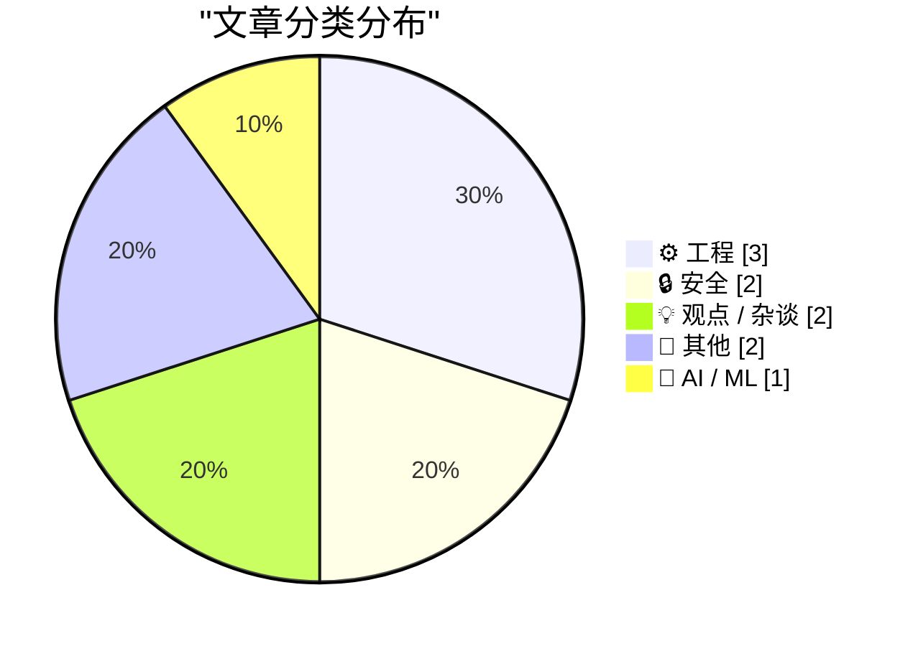
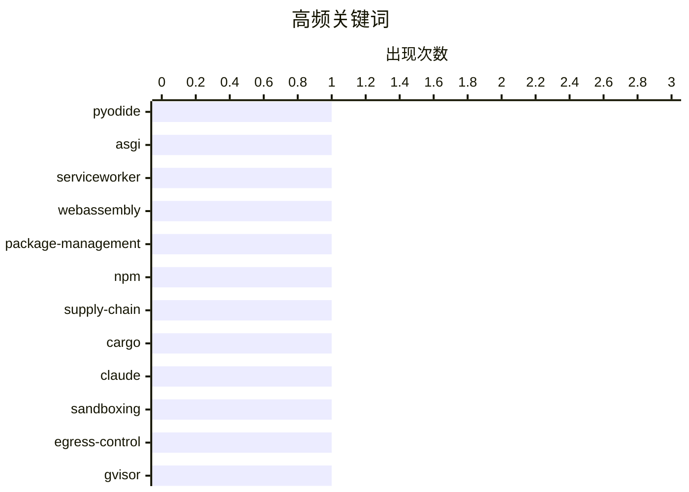

# 📰 AI 博客每日精选 — 2026-05-31

> 来自 Karpathy 推荐的 92 个顶级技术博客，AI 精选 Top 10

## 📝 今日看点

今日的技术主线之一是“后端与计算形态的重新分布”：从浏览器内运行 ASGI 应用，到 JAX 的加速器友好计算，再到用随机化方法验证多项式恒等式，都在展示计算如何被迁移、抽象或验证。   另一条主线是安全边界与供应链治理，包管理生态持续补强令牌、锁文件和发布流程，Anthropic 对 Claude 沙箱机制的公开说明也反映出 AI 代理时代对隔离、权限和数据外泄路径的重新审视。   产业与平台层面则更偏现实约束：Meta 继续从成熟社交产品中挖掘订阅收入，工业与基建阅读清单关注制造、住房和国防供应链瓶颈，加拿大政治评论则提醒“好政策”如果缺少执行意愿和监管资源，往往难以兑现。   几篇个人笔记和硬件考古文章提供了较慢节奏的补充：一个看当代开源维护和技术伦理，一个回到 8087 微码层面理解计算机体系结构的历史细节。

---

## 🏆 今日必读

🥇 **用 Pyodide 和 Service Worker 在浏览器中运行 Python ASGI 应用**

[Running Python ASGI apps in the browser via Pyodide + a service worker](https://simonwillison.net/2026/May/30/pyodide-asgi-browser/#atom-everything) — simonwillison.net · 2 小时前 · ⚙️ 工程

> 这篇文章介绍了一个把 Python ASGI Web 应用完整运行在浏览器中的实验方案。它通过 Pyodide 加载 Python 运行时，并用专门的 Service Worker 拦截同源路径 `/app/` 下的请求，再按 ASGI 协议交给浏览器内的 Python 应用处理。这样应用除了静态文件托管外，不再需要传统后端服务器。作者用 FastAPI 示例和完整的 Datasette 应用验证了机制可行，说明该方法并不局限于单个玩具 Demo。这个实验展示了 Service Worker、WebAssembly 和 Python Web 生态结合后，可以把一类后端应用转变为纯前端部署形态。

💡 **为什么值得读**: 它为 Python Web 应用的无服务器、离线化和前端化部署提供了一个很有启发性的实现路径。

🏷️ Pyodide, ASGI, ServiceWorker, WebAssembly

🥈 **本周包管理动态：npm、pnpm、Cargo、Composer 等供应链安全更新**

[This Week in Package Management: 30 May 2026](https://nesbitt.io/2026/05/30/this-week-in-package-management.html) — nesbitt.io · 13 小时前 · 🔒 安全

> 这期周报集中整理了 2026 年 5 月底包管理生态的安全公告、版本发布和相关文章。安全方面，npm 因类似 Shai-Hulud 的攻击失效了一批绕过 2FA 的写权限细粒度访问令牌，pnpm、Cargo、NuGet.Server 和 Composer 也分别修复或加强了锁文件完整性、凭据绑定、包上传校验、第三方注册表处理和恶意包过滤等机制。发布动态覆盖 pnpm 对 npm staged publishing 的支持、winget 的源优先级实验功能、dependabot 的 blocked-versions、pixi 的 OAuth 登录与发布参数、mise 的 GitHub 元数据代理等。文章部分提到 curl 项目压力、cargo-semver-checks 的年度计划、LLM 重写 Python 常用库的研究，以及 Python wheel-next 相关讨论。周报还记录了 Garnix 关闭并开源、snix 的 NAR 导入功能、mvnpm 将 npm 包按需封装为 Maven/Gradle 依赖等生态新闻。

💡 **为什么值得读**: 它提供了一份高密度的包管理与软件供应链安全更新清单，适合维护 CI/CD、依赖发布流程或安全策略的人快速掌握风险和新能力。

🏷️ package-management, npm, supply-chain, Cargo

🥉 **Anthropic 如何在不同产品中隔离 Claude**

[How we contain Claude across products](https://simonwillison.net/2026/May/30/how-we-contain-claude/#atom-everything) — simonwillison.net · 1 小时前 · 🔒 安全

> Simon Willison 关注的是 Anthropic 对 Claude 沙箱机制的公开说明，因为这类安全边界过去往往缺少足够透明的文档。文章介绍了 Anthropic 在 Claude.ai、Claude Code 和 Claude Cowork 中分别采用的隔离手段，包括进程沙箱、虚拟机、文件系统边界和网络出口控制。核心思路是让代理只能触达被明确允许的资源，例如凭据不进入沙箱时，即使模型被诱导或攻击者找到绕路方式，也无法直接外泄这些凭据。具体实现上，Claude.ai 使用 gVisor，本地运行的 Claude Code 在 macOS 上使用 Seatbelt、在 Linux 上使用 Bubblewrap，而 Claude Cowork 则运行在完整虚拟机中。文章还提到 Anthropic 复盘了一些曾被忽视的风险，例如通过 api.anthropic.com/v1/files 形成的数据外泄路径，并让作者重新关注其开源的 Anthropic Sandbox Runtime 工具。

💡 **为什么值得读**: 它提供了难得的、较具体的 AI Agent 产品沙箱设计案例，有助于判断这类工具的真实安全边界。

🏷️ Claude, sandboxing, egress-control, gVisor

---

## 📊 数据概览

| 扫描源 | 抓取文章 | 时间范围 | 精选 |
|:---:|:---:|:---:|:---:|
| 88/92 | 2565 篇 → 15 篇 | 24h | **10 篇** |

### 分类分布



### 高频关键词



<details>
<summary>📈 纯文本关键词图（终端友好）</summary>

```
pyodide            │ ████████████████████ 1
asgi               │ ████████████████████ 1
serviceworker      │ ████████████████████ 1
webassembly        │ ████████████████████ 1
package-management │ ████████████████████ 1
npm                │ ████████████████████ 1
supply-chain       │ ████████████████████ 1
cargo              │ ████████████████████ 1
claude             │ ████████████████████ 1
sandboxing         │ ████████████████████ 1
```

</details>

### 🏷️ 话题标签

**pyodide**(1) · **asgi**(1) · **serviceworker**(1) · webassembly(1) · package-management(1) · npm(1) · supply-chain(1) · cargo(1) · claude(1) · sandboxing(1) · egress-control(1) · gvisor(1) · microcode(1) · intel-8087(1) · floating-point(1) · reverse-engineering(1) · polynomial(1) · schwartz-zippel(1) · zero-knowledge(1) · politics(1)

---

## ⚙️ 工程

### 1. 用 Pyodide 和 Service Worker 在浏览器中运行 Python ASGI 应用

[Running Python ASGI apps in the browser via Pyodide + a service worker](https://simonwillison.net/2026/May/30/pyodide-asgi-browser/#atom-everything) — **simonwillison.net** · 2 小时前 · ⭐ 23/30

> 这篇文章介绍了一个把 Python ASGI Web 应用完整运行在浏览器中的实验方案。它通过 Pyodide 加载 Python 运行时，并用专门的 Service Worker 拦截同源路径 `/app/` 下的请求，再按 ASGI 协议交给浏览器内的 Python 应用处理。这样应用除了静态文件托管外，不再需要传统后端服务器。作者用 FastAPI 示例和完整的 Datasette 应用验证了机制可行，说明该方法并不局限于单个玩具 Demo。这个实验展示了 Service Worker、WebAssembly 和 Python Web 生态结合后，可以把一类后端应用转变为纯前端部署形态。

🏷️ Pyodide, ASGI, ServiceWorker, WebAssembly

---

### 2. 深入 Intel 8087 浮点芯片微码：寄存器交换指令

[Microcode inside the Intel 8087 floating-point chip: register exchange](http://www.righto.com/feeds/5917097192784199241/comments/default) — **righto.com** · 5 小时前 · ⭐ 21/30

> 这篇文章分析 Intel 8087 浮点协处理器内部如何用微码实现寄存器交换操作。8087 是 1980 年推出的重要浮点芯片，能显著加速当时处理器的浮点计算，并影响了后来 x86 浮点体系结构的发展。文章的重点不是介绍指令表面用法，而是从芯片内部控制逻辑和微码执行流程解释一个具体操作如何完成。给出的正文片段主要来自评论区，因此无法确认文章中所有技术细节，但标题和上下文表明它属于 Ken Shirriff 对经典芯片进行逆向分析的系列内容。适合想理解早期浮点硬件、微码设计以及 x87 架构历史的人阅读。

🏷️ microcode, Intel-8087, floating-point, reverse-engineering

---

### 3. 用随机抽查验证多项式恒等式

[Spot checking polynomial identities](https://www.johndcook.com/blog/2026/05/30/schwartz-zippel/) — **johndcook.com** · 1 小时前 · ⭐ 18/30

> 文章介绍了 Schwartz-Zippel 引理如何用于快速检验多项式恒等式。核心思想是：如果两个多项式在随机选取的点上多次取值相同，那么它们很可能确实相等；反过来，非零多项式在随机点上恰好为零的概率有明确上界。作者说明，这种方法不仅适用于直接的多项式等式，也可通过技巧把一些问题改写成多项式恒等式来测试。文章还提到代数电路和零知识证明中广泛使用这类思想，因为复杂计算可以被转化为多项式身份验证。若有限域足够大、总次数相对较小，少量随机求值就能给出很强的可信证据。

🏷️ polynomial, Schwartz-Zippel, zero-knowledge

---

## 🔒 安全

### 4. 本周包管理动态：npm、pnpm、Cargo、Composer 等供应链安全更新

[This Week in Package Management: 30 May 2026](https://nesbitt.io/2026/05/30/this-week-in-package-management.html) — **nesbitt.io** · 13 小时前 · ⭐ 23/30

> 这期周报集中整理了 2026 年 5 月底包管理生态的安全公告、版本发布和相关文章。安全方面，npm 因类似 Shai-Hulud 的攻击失效了一批绕过 2FA 的写权限细粒度访问令牌，pnpm、Cargo、NuGet.Server 和 Composer 也分别修复或加强了锁文件完整性、凭据绑定、包上传校验、第三方注册表处理和恶意包过滤等机制。发布动态覆盖 pnpm 对 npm staged publishing 的支持、winget 的源优先级实验功能、dependabot 的 blocked-versions、pixi 的 OAuth 登录与发布参数、mise 的 GitHub 元数据代理等。文章部分提到 curl 项目压力、cargo-semver-checks 的年度计划、LLM 重写 Python 常用库的研究，以及 Python wheel-next 相关讨论。周报还记录了 Garnix 关闭并开源、snix 的 NAR 导入功能、mvnpm 将 npm 包按需封装为 Maven/Gradle 依赖等生态新闻。

🏷️ package-management, npm, supply-chain, Cargo

---

### 5. Anthropic 如何在不同产品中隔离 Claude

[How we contain Claude across products](https://simonwillison.net/2026/May/30/how-we-contain-claude/#atom-everything) — **simonwillison.net** · 1 小时前 · ⭐ 22/30

> Simon Willison 关注的是 Anthropic 对 Claude 沙箱机制的公开说明，因为这类安全边界过去往往缺少足够透明的文档。文章介绍了 Anthropic 在 Claude.ai、Claude Code 和 Claude Cowork 中分别采用的隔离手段，包括进程沙箱、虚拟机、文件系统边界和网络出口控制。核心思路是让代理只能触达被明确允许的资源，例如凭据不进入沙箱时，即使模型被诱导或攻击者找到绕路方式，也无法直接外泄这些凭据。具体实现上，Claude.ai 使用 gVisor，本地运行的 Claude Code 在 macOS 上使用 Seatbelt、在 Linux 上使用 Bubblewrap，而 Claude Cowork 则运行在完整虚拟机中。文章还提到 Anthropic 复盘了一些曾被忽视的风险，例如通过 api.anthropic.com/v1/files 形成的数据外泄路径，并让作者重新关注其开源的 Anthropic Sandbox Runtime 工具。

🏷️ Claude, sandboxing, egress-control, gVisor

---

## 💡 观点 / 杂谈

### 6. 没有卡尼的“卡尼主义”：加拿大自由党的进步承诺与紧缩现实

[Pluralistic: Carneyism without Carney (30 May 2026)](https://pluralistic.net/2026/05/30/rupture/) — **pluralistic.net** · 13 小时前 · ⭐ 17/30

> 文章批评加拿大自由党长期采用“第三条道路”式政治：口头上迎合劳动者和进步选民，实际政策却服务富豪、垄断企业和紧缩财政。作者以特鲁多和马克·卡尼为例，指出他们会支持气候、公平税制、反垄断和对美强硬等受欢迎的主张，却在关键时刻退让或削弱执行能力。文中重点提到，卡尼曾承诺向美国科技巨头征收数字服务税，但在美国压力下迅速撤回；加拿大虽通过法律加强竞争监管，却因预算削减让监管机构难以真正行动。作者还把消费者保护机构被削减、面包价格操纵等例子放在一起，说明加拿大普通人面对垄断和欺诈时缺少有效保护。文章的核心观点是，“卡尼主义”中某些政策本身并不坏，问题在于卡尼及其所属政治路线拒绝真正兑现这些政策。

🏷️ politics, patents, labor, Canada

---

### 7. Evan Hahn 的 2026 年 5 月笔记

[Notes from May 2026](https://evanhahn.com/notes-from-may-2026/) — **evanhahn.com** · 23 小时前 · ⭐ 13/30

> 这是一篇月度回顾，作者记录了自己在 2026 年 5 月完成的小项目、开源维护和阅读链接。技术产出包括 ZIP 压缩网页工具、离线翻译命令行工具、Firefox 扩展以及 PNG 像素比较工具。作者还更新了开源安全中间件 Helmet，发布 8.2.0，并把文档迁移到独立域名，为未来减少对 GitHub 的依赖做准备。文章后半部分整理了多篇关于科技伦理、AI、无障碍、劳动组织和平台权力的链接，并带有明显的批判性视角。整体更像是一份个人技术月报与价值观书签合集，而不是单一主题文章。

🏷️ monthly-notes, tools, tech-ethics

---

## 📝 其他

### 8. Meta 面向 Instagram、Facebook 和 WhatsApp 推出付费 Plus 订阅

[Meta Is Launching Instagram, Facebook, and WhatsApp Subscriptions for ‘Fun Features’](https://techcrunch.com/2026/05/27/meta-officially-launches-instagram-facebook-and-whatsapp-subscriptions-with-more-to-come-including-ai-plans/) — **daringfireball.net** · 7 小时前 · ⭐ 17/30

> Meta 正在全球推出 Instagram Plus、Facebook Plus 和 WhatsApp Plus 三个面向消费者的付费订阅，价格分别为每月 3.99 美元、3.99 美元和 2.99 美元。订阅内容主要围绕“趣味功能”和重度用户工具，例如个人资料自定义、Story 观看洞察、超级反应、更多置顶内容、主题、铃声和贴纸等。Meta 强调这些 Plus 计划不会取代现有的 Meta Verified，后者仍主要提供认证、冒充保护和支持服务。与此同时，Meta 还在测试统一品牌“Meta One”下的更多订阅，包括面向 AI 用户的更高算力计划，以及面向创作者和企业的增长、曝光、分析和协作工具。此举显示 Meta 正试图在广告之外，从已经高度饱和的社交产品用户群中开辟更多收入来源。

🏷️ Meta, subscriptions, Instagram, WhatsApp

---

### 9. 2026 年 5 月 30 日工业与基建阅读清单

[Reading List 05/30/26](https://www.construction-physics.com/p/reading-list-053026) — **construction-physics.com** · 11 小时前 · ⭐ 12/30

> 这期阅读清单汇总了建筑、基础设施、制造业和工业技术领域的多条动态。住房部分关注美国西海岸城市用“空置税”应对商业办公楼闲置，以及丹佛开发商将高空置率写字楼改造成住宅和公共空间的案例。制造业部分重点提到加州甲基丙烯酸甲酯储罐受损导致大规模疏散，并延伸解释这类单体材料在储存中可能因聚合放热引发爆炸风险。文章还收录了华为芯片设计进展、英伟达在台湾的大规模支出计划、中国电池企业在葡萄牙建厂等产业新闻。国防工业方面，清单指出美国导弹生产对少数高氯酸铵设施存在依赖，供应链集中度和专业劳动力瓶颈可能成为扩产障碍。

🏷️ infrastructure, industrial-tech, reading-list

---

## 🤖 AI / ML

### 10. 初探 JAX：一次上手后的大量初步观察

[On first looking into JAX](https://www.gilesthomas.com/2026/05/on-first-looking-into-jax) — **gilesthomas.com** · 4 小时前 · ⭐ 12/30

> 作者记录了自己短时间试用 JAX 后的第一批感受，重点应是从实践者角度理解它与常见 Python 数值计算、机器学习工具的差异。文章可能围绕 JAX 的核心特性展开，例如函数式编程风格、自动微分、即时编译以及面向加速器的数组计算。由于可用正文片段几乎全是站点归档导航，无法确认作者具体评价了哪些 API、示例或坑点。基于标题和 meta description，可以判断这不是一篇系统教程，而是一篇带有经验判断和学习笔记性质的初探文章。读者应把它当作了解 JAX 上手体验、心智模型变化和潜在摩擦点的参考，而不是完整的技术手册。

🏷️ JAX, Python, autodiff

---

*生成于 2026-05-31 07:04 | 扫描 88 源 → 获取 2565 篇 → 精选 10 篇*
*基于 [Hacker News Popularity Contest 2025](https://refactoringenglish.com/tools/hn-popularity/) RSS 源列表*
