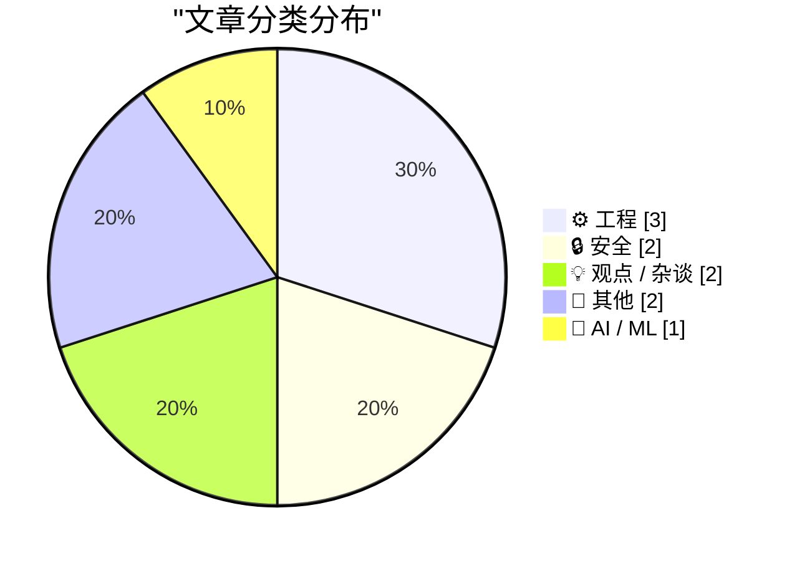
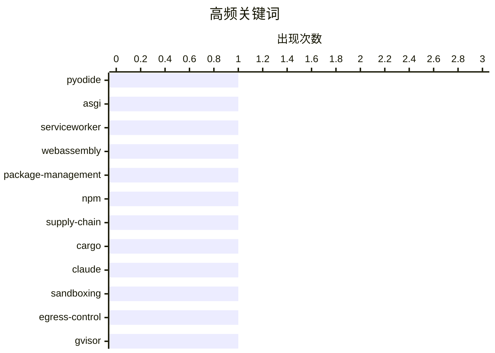

# 📰 AI 博客每日精选 — 2026-05-31

> 来自 Karpathy 推荐的 92 个顶级技术博客，AI 精选 Top 10

## 🏆 今日必读

🥇 **Running Python ASGI apps in the browser via Pyodide + a service worker**

[Running Python ASGI apps in the browser via Pyodide + a service worker](https://simonwillison.net/2026/May/30/pyodide-asgi-browser/#atom-everything) — simonwillison.net · 2 小时前 · ⚙️ 工程

> Simon Willison’s Weblog Subscribe Sponsored by: The AI App and Agent Factory &mdash; Microsoft Foundry is the enterprise Al platform where intelligence and trust ship with every agent. Try Foundry 30t

🏷️ Pyodide, ASGI, ServiceWorker, WebAssembly

🥈 **This Week in Package Management: 30 May 2026**

[This Week in Package Management: 30 May 2026](https://nesbitt.io/2026/05/30/this-week-in-package-management.html) — nesbitt.io · 13 小时前 · 🔒 安全

> Back for a second week, built from the package manager OPML feed collection and whatever I’ve posted or boosted on Mastodon . Security npm invalidated every granular access token with write access tha

🏷️ package-management, npm, supply-chain, Cargo

🥉 **How we contain Claude across products**

[How we contain Claude across products](https://simonwillison.net/2026/May/30/how-we-contain-claude/#atom-everything) — simonwillison.net · 1 小时前 · 🔒 安全

> How we contain Claude across products . A complaint I often have about sandboxing products is that they are rarely thoroughly documented , and in the absence of detailed documentation it's hard to kno

🏷️ Claude, sandboxing, egress-control, gVisor

---

## 📊 数据概览

| 扫描源 | 抓取文章 | 时间范围 | 精选 |
|:---:|:---:|:---:|:---:|
| 88/92 | 2565 篇 → 15 篇 | 24h | **10 篇** |

### 分类分布



### 高频关键词



<details>
<summary>📈 纯文本关键词图（终端友好）</summary>

```
pyodide            │ ████████████████████ 1
asgi               │ ████████████████████ 1
serviceworker      │ ████████████████████ 1
webassembly        │ ████████████████████ 1
package-management │ ████████████████████ 1
npm                │ ████████████████████ 1
supply-chain       │ ████████████████████ 1
cargo              │ ████████████████████ 1
claude             │ ████████████████████ 1
sandboxing         │ ████████████████████ 1
```

</details>

### 🏷️ 话题标签

**pyodide**(1) · **asgi**(1) · **serviceworker**(1) · webassembly(1) · package-management(1) · npm(1) · supply-chain(1) · cargo(1) · claude(1) · sandboxing(1) · egress-control(1) · gvisor(1) · microcode(1) · intel-8087(1) · floating-point(1) · reverse-engineering(1) · polynomial(1) · schwartz-zippel(1) · zero-knowledge(1) · politics(1)

---

## ⚙️ 工程

### 1. Running Python ASGI apps in the browser via Pyodide + a service worker

[Running Python ASGI apps in the browser via Pyodide + a service worker](https://simonwillison.net/2026/May/30/pyodide-asgi-browser/#atom-everything) — **simonwillison.net** · 2 小时前 · ⭐ 23/30

> Simon Willison’s Weblog Subscribe Sponsored by: The AI App and Agent Factory &mdash; Microsoft Foundry is the enterprise Al platform where intelligence and trust ship with every agent. Try Foundry 30t

🏷️ Pyodide, ASGI, ServiceWorker, WebAssembly

---

### 2. Microcode inside the Intel 8087 floating-point chip: register exchange

[Microcode inside the Intel 8087 floating-point chip: register exchange](http://www.righto.com/feeds/5917097192784199241/comments/default) — **righto.com** · 5 小时前 · ⭐ 21/30

> In 1980, Intel introduced the 8087 floating-point chip, a co-processor that made floating-point operations up to 100 times faster. This chip was highly influential, and today most processors use the f

🏷️ microcode, Intel-8087, floating-point, reverse-engineering

---

### 3. Spot checking polynomial identities

[Spot checking polynomial identities](https://www.johndcook.com/blog/2026/05/30/schwartz-zippel/) — **johndcook.com** · 1 小时前 · ⭐ 18/30

> If a polynomial identity holds at a few random points, it’s very like true. We’ll make this statement more precise, but first let’s look at some applications. You may want to test an identity that nat

🏷️ polynomial, Schwartz-Zippel, zero-knowledge

---

## 🔒 安全

### 4. This Week in Package Management: 30 May 2026

[This Week in Package Management: 30 May 2026](https://nesbitt.io/2026/05/30/this-week-in-package-management.html) — **nesbitt.io** · 13 小时前 · ⭐ 23/30

> Back for a second week, built from the package manager OPML feed collection and whatever I’ve posted or boosted on Mastodon . Security npm invalidated every granular access token with write access tha

🏷️ package-management, npm, supply-chain, Cargo

---

### 5. How we contain Claude across products

[How we contain Claude across products](https://simonwillison.net/2026/May/30/how-we-contain-claude/#atom-everything) — **simonwillison.net** · 1 小时前 · ⭐ 22/30

> How we contain Claude across products . A complaint I often have about sandboxing products is that they are rarely thoroughly documented , and in the absence of detailed documentation it's hard to kno

🏷️ Claude, sandboxing, egress-control, gVisor

---

## 💡 观点 / 杂谈

### 6. Pluralistic: Carneyism without Carney (30 May 2026)

[Pluralistic: Carneyism without Carney (30 May 2026)](https://pluralistic.net/2026/05/30/rupture/) — **pluralistic.net** · 13 小时前 · ⭐ 17/30

> ->->->->->->->->->->->->->->->->->->->->->->->->->->->->-> Top Sources: None --> Today's links Carneyism without Carney : Eh? Hey look at this : Delights to delectate. Object permanence : Replacing ph

🏷️ politics, patents, labor, Canada

---

### 7. Notes from May 2026

[Notes from May 2026](https://evanhahn.com/notes-from-may-2026/) — **evanhahn.com** · 23 小时前 · ⭐ 13/30

> Notes from May 2026 by Evan Hahn , posted May 30, 2026 , tagged #month-notes #me #link My blog turned 16 this month! I did nothing to celebrate, but made some little tools and clicked some links about

🏷️ monthly-notes, tools, tech-ethics

---

## 📝 其他

### 8. Meta Is Launching Instagram, Facebook, and WhatsApp Subscriptions for ‘Fun Features’

[Meta Is Launching Instagram, Facebook, and WhatsApp Subscriptions for ‘Fun Features’](https://techcrunch.com/2026/05/27/meta-officially-launches-instagram-facebook-and-whatsapp-subscriptions-with-more-to-come-including-ai-plans/) — **daringfireball.net** · 7 小时前 · ⭐ 17/30

> Meta is doubling down on its subscription offerings. On Wednesday, the social networking giant announced it’s now rolling out its consumer subscription plans globally for its flagship apps, Instagram,

🏷️ Meta, subscriptions, Instagram, WhatsApp

---

### 9. Reading List 05/30/26

[Reading List 05/30/26](https://www.construction-physics.com/p/reading-list-053026) — **construction-physics.com** · 11 小时前 · ⭐ 12/30

> Reading List 05/30/26 A California chemical leak, weapons-grade plutonium for nuclear reactor startups, a startup that will clean your house to get robot training data, Blue Origin’s rocket explosion,

🏷️ infrastructure, industrial-tech, reading-list

---

## 🤖 AI / ML

### 10. On first looking into JAX

[On first looking into JAX](https://www.gilesthomas.com/2026/05/on-first-looking-into-jax) — **gilesthomas.com** · 4 小时前 · ⭐ 12/30

> el.dataset.currentDropdown = '') }"> Giles' blog About Contact Archives Categories Blogroll May 2026 (2) April 2026 (11) March 2026 (3) February 2026 (4) January 2026 (4) December 2025 (1) November 20

🏷️ JAX, Python, autodiff

---

*生成于 2026-05-31 07:04 | 扫描 88 源 → 获取 2565 篇 → 精选 10 篇*
*基于 [Hacker News Popularity Contest 2025](https://refactoringenglish.com/tools/hn-popularity/) RSS 源列表*
