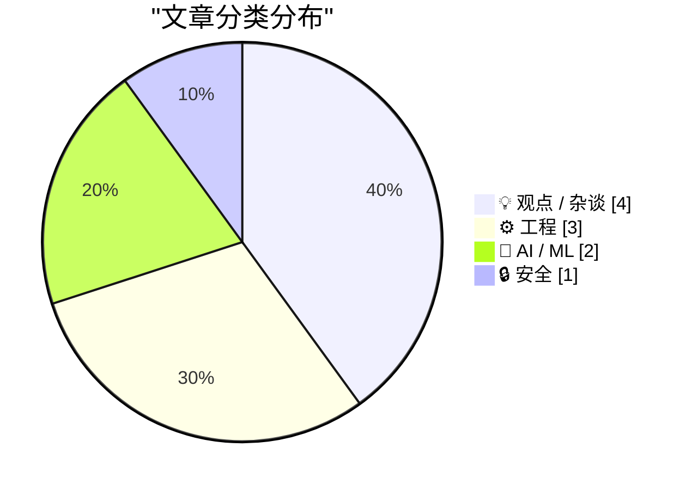
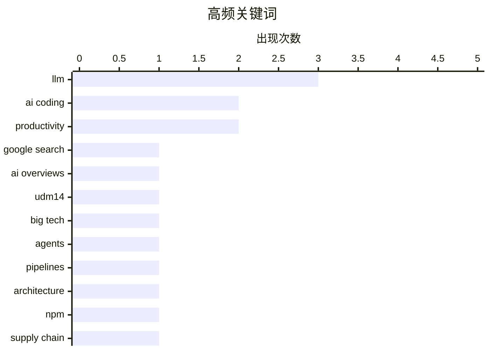

# 📰 AI 博客每日精选 — 2026-06-01

> 来自 Karpathy 推荐的 92 个顶级技术博客，AI 精选 Top 10

## 📝 今日看点

今日技术圈的焦点集中在 AI 从“炫技”走向“反思”：一边是智能体开发、AI 辅助交付继续推进，另一边是对 LLM 理解能力、过度自动化和订阅依赖的质疑升温。安全与基础设施风险同样突出，NPM 供应链攻击再次提醒开发者，现代软件生态的便利性正伴随系统性脆弱。与此同时，从搜索体验被 AI 改写到 Web 链接语义被破坏，用户可控性与开放网络基础规范正在成为新的争议前线。

---

## 🏆 今日必读

🥇 **&udm 风波一波接一波**

[One &udm After Another](https://feed.tedium.co/link/15204/17351430/google-ai-udm14-reflection) — tedium.co · 22 小时前 · 💡 观点 / 杂谈

> Google 再次调整用户依赖的搜索体验后，更多人开始了解并使用 &udm=14 这个绕过 AI Overviews 的方案。作者两年前在赶稿压力下做出一个简单站点，用来把用户转到正确的 Google 搜索位置；这个站点至今仍在线，并且经常因 Google 搜索变化而走红。作者认为，Google 正在基于“聊天机器人是新搜索”的信念让原本的核心搜索体验逐渐衰退，而 &udm=14 的反复流行说明用户仍然需要旧式搜索。Google I/O 上，Google 展示了 Google Beam、Googlebook 等方向，也强化了公司对前沿 AI 的投入和愿景。作者的核心看法是，Google 正试图把自己更深地嵌入用户生活，但这些方向并不一定是用户真正要求的。

💡 **为什么值得读**: 它用一个简单的 &udm=14 案例切入，揭示了 AI 搜索转型中用户真实需求与 Google 产品愿景之间的错位。

🏷️ Google Search, AI Overviews, udm14, Big Tech

🥈 **构建智能体，而不是流水线**

[Build agents, not pipelines](https://seangoedecke.com/build-agents-not-pipelines/) — seangoedecke.com · 23 小时前 · 🤖 AI / ML

> 在程序中使用 LLM 只有两种方式：把 LLM 放进由代码控制流程的流水线，或给 LLM 提供工具并让它自行管理控制流程的智能体。流水线类似使用库，开发者自己定义程序结构并在特定步骤调用 LLM；智能体类似框架，主流程由智能体循环掌控，只在需要时调用开发者提供的工具。在上下文很少、任务很简单时，两者可能执行相同步骤；但当上下文超过单个 prompt 容量，或需要先执行动作再根据结果反应时，选择就变得关键。流水线更可预测，智能体更灵活；智能体的运行轮次可能从几轮到数百轮，带来延迟和成本的不确定性。使用 frontier model API 时，单个 LLM 的推理强度通常可以显式设置，最多可能让耗时增加约 10% 到 20%，而智能体循环可能出现 2 倍或更高的波动。作者的取舍判断是：智能体更聪明，但要接受更大的成本和延迟不确定性。

💡 **为什么值得读**: 适合正在把 LLM 接入产品的人阅读，因为它用“库 vs 框架”的类比清楚说明了流水线和智能体在可控性、灵活性与成本上的关键取舍。

🏷️ agents, LLM, pipelines, architecture

🥉 **“没办法防止这种事”，唯一经常发生这种事的包管理器用户说**

["No way to prevent this" say users of only package manager where this regularly happens](https://xeiaso.net/shitposts/no-way-to-prevent-this/supply-chain/2026-redhat-javascript-clients/) — xeiaso.net · 2026-06-01 · 🔒 安全

> Redhat Insights 的 JavaScript 包通过 NPM 遭遇供应链攻击，开发者和系统管理员需要检查项目是否受到影响。攻击会窃取 AWS、GCP、Azure、Kubernetes、HashiCorp Vault、npm 和 CircleCI 凭据，并通过被盗 npm 凭据与 bypass_2fa 设置自我传播。文章称该攻击还会通过 Claude Code hooks 和 VS Code task injection 建立持久化；如果安装了受影响包，建议重新配置开发硬件。作者以讽刺口吻指出，NPM 被描述为“唯一经常发生这类供应链攻击的包管理器”，并提到过去十年全球 90% 的供应链攻击发生在该生态，项目受害概率高 20 倍。结尾延续讽刺，称用户把自己处境描述为“无能为力”，并链接到 Redhat Insights JavaScript 包的上游文档。

💡 **为什么值得读**: 值得读是因为它用讽刺方式把一次 NPM 供应链攻击的技术细节与包管理生态的安全惯性放在一起，信息密度高且观点鲜明。

🏷️ npm, supply chain, malware, JavaScript

---

## 📊 数据概览

| 扫描源 | 抓取文章 | 时间范围 | 精选 |
|:---:|:---:|:---:|:---:|
| 87/92 | 2556 篇 → 16 篇 | 24h | **10 篇** |

### 分类分布



### 高频关键词



<details>
<summary>📈 纯文本关键词图（终端友好）</summary>

```
llm           │ ████████████████████ 3
ai coding     │ █████████████░░░░░░░ 2
productivity  │ █████████████░░░░░░░ 2
google search │ ███████░░░░░░░░░░░░░ 1
ai overviews  │ ███████░░░░░░░░░░░░░ 1
udm14         │ ███████░░░░░░░░░░░░░ 1
big tech      │ ███████░░░░░░░░░░░░░ 1
agents        │ ███████░░░░░░░░░░░░░ 1
pipelines     │ ███████░░░░░░░░░░░░░ 1
architecture  │ ███████░░░░░░░░░░░░░ 1
```

</details>

### 🏷️ 话题标签

**llm**(3) · **ai coding**(2) · **productivity**(2) · google search(1) · ai overviews(1) · udm14(1) · big tech(1) · agents(1) · pipelines(1) · architecture(1) · npm(1) · supply chain(1) · malware(1) · javascript(1) · side projects(1) · reverse engineering(1) · sega cd(1) · fmv(1) · graphics(1) · z3(1)

---

## 💡 观点 / 杂谈

### 1. &udm 风波一波接一波

[One &udm After Another](https://feed.tedium.co/link/15204/17351430/google-ai-udm14-reflection) — **tedium.co** · 22 小时前 · ⭐ 24/30

> Google 再次调整用户依赖的搜索体验后，更多人开始了解并使用 &udm=14 这个绕过 AI Overviews 的方案。作者两年前在赶稿压力下做出一个简单站点，用来把用户转到正确的 Google 搜索位置；这个站点至今仍在线，并且经常因 Google 搜索变化而走红。作者认为，Google 正在基于“聊天机器人是新搜索”的信念让原本的核心搜索体验逐渐衰退，而 &udm=14 的反复流行说明用户仍然需要旧式搜索。Google I/O 上，Google 展示了 Google Beam、Googlebook 等方向，也强化了公司对前沿 AI 的投入和愿景。作者的核心看法是，Google 正试图把自己更深地嵌入用户生活，但这些方向并不一定是用户真正要求的。

🏷️ Google Search, AI Overviews, udm14, Big Tech

---

### 2. 教皇似乎比杰弗里·辛顿更懂 AI

[The Pope appears to understand AI better than Geoffrey Hinton does.](https://garymarcus.substack.com/p/the-pope-appears-to-understand-ai) — **garymarcus.substack.com** · 6 小时前 · ⭐ 20/30

> Gary Marcus 批评 Geoffrey Hinton 在新访谈中把 LLM 的输出表现与理解或意识混为一谈，认为这与 Richard Dawkins 此前犯过的错误相似。Marcus 的核心论点是，Claude 等 LLM 的回答来自模仿和文本近似，而不是对真实内部状态的报告；意识关乎内部状态，丰富的模仿本身不能证明理解。相似的输出不能说明两个系统以相似机制得到结果，因为 LLM 相当于记忆整个互联网，而人类通过与世界互动的经验建立心理模型。Pope Leo XIV 在推文中说“真正的理解来自经验，而不是文本近似”，Marcus 认为这比 Hinton 的说法更切中要害，也呼应了他与 Valerio Capraro、Walter Quattrociochi 在 Nature 中提出的观点：LLM 可以模仿或模拟，但并不理解。Marcus 的结论是，LLM 研究者创造的是被训练来预测真实存在者语言的互动虚构，而不是存在者本身。

🏷️ AI consciousness, LLM, Hinton, mimicry

---

### 3. 解决办法可能是取消我的 AI 订阅

[The solution might be cancelling my AI subscription](https://simonwillison.net/2026/May/31/the-solution-might-be-cancelling-my-ai-subscription/#atom-everything) — **simonwillison.net** · 6 小时前 · ⭐ 20/30

> AI 编程工具可能把“写个小脚本”的模糊需求迅速扩展成一个看似完整、带测试和文档的项目，但原本的问题未必得到解决。David Wilson 列举了自己用 AI 工具启动的 16 个以上项目，并认为这种低摩擦、低投入就能获得即时奖励的工具会严重分散注意力，甚至可能只能通过减少使用来管理。Simon Willison 认同这是现实问题：编码代理能在不到一小时内把想法变成可运行方案，但个人能长期维护和关心的项目数量是有限的，立刻被抛弃的项目价值存疑。David 认为这种使用方式不可持续，而 Simon 希望关键能力是“自律”，但也承认这对自己并不容易。Hacker News 讨论中也出现了相反经验：一些 ADHD 用户认为 AI 代理帮助他们完成副项目、维持 inbox zero，并让他们更专注、更投入。

🏷️ AI coding, productivity, attention, Claude

---

### 4. 总投注机

[the totalisator](https://computer.rip/2026-05-31-totalisator.html) — **computer.rip** · 23 小时前 · ⭐ 20/30

> 软件行业再次把赌博作为重要驱动力，线上娱乐体育投注和预测市场让现实事件赔率制定与盈利机制在美国更普遍。赌博与软件之间长期存在紧张关系：赌场发展出的技巧进入消费软件，而软件行业也拥抱了“gaming”中更古老的赌博含义。赌博之所以与技术紧密相连，一方面是因为它有利可图，另一方面是因为它本质上依赖数学或算术计算，并且带有现实资金风险。文章以赛马为例梳理了赌博历史：英国1539年已有赛马记录，1666年查理二世推动 Newmarket Town Plate，安妮女王1711年创立 Ascot 赛马场，随后赛马随大英帝国扩张传播到世界各地。传统赛马投注主要依赖庄家设定固定赔率，例如“7/1”意味着押1美元中奖可得7美元，而这种模式的关键局限在于赔率由庄家判断和估算。

🏷️ gambling, totalisator, software, betting

---

## ⚙️ 工程

### 5. 《Silpheed》的艺术与工程

[The art and engineering of Silpheed](https://fabiensanglard.net/silpheed/index.html) — **fabiensanglard.net** · 2026-06-01 · ⭐ 22/30

> Sega CD 版《Silpheed》的核心看点在于，它如何在 Mega-CD 有大容量但极慢读取性能的限制下实现令人惊讶的全动态视频效果。CD-ROM 提供 640 MiB 存储空间，约为卡带容量的 320 倍，但访问时间为 800ms、单速带宽仅 150 KiB/s，分别慢到 4,000,000 倍和 35 倍。Mega-CD 平台上许多游戏过度依赖 FMV 并留下负面名声，而《Silpheed》凭借艺术设计和高效引擎，让玩家难以分辨哪些是实时 3D、哪些是预计算画面。其近全屏过场动画运行在 12.5MHz m68k CPU 上，只用 16 色并消耗 150 KiB/s；在 16-bit 16kHz 音乐占用后，15fps 视频流每帧只剩约 8 KiB。作者用两周业余时间逆向分析了该 FMV 格式，并准备从 Sega Genesis 与 Mega-CD 的协作机制讲起，解释其视频格式的优化和技巧。

🏷️ reverse engineering, Sega CD, FMV, graphics

---

### 6. 用 Z3 检查汇编

[Checking assembly with Z3](https://bernsteinbear.com/blog/asm-z3/?utm_source=rss) — **bernsteinbear.com** · 2026-06-01 · ⭐ 21/30

> ZJIT 的 fixnum 除法在处理 `FIXNUM_MIN / -1` 时存在溢出相关的类型判断问题：除法结果会提升为 bignum，而不是 fixnum。CRuby 对这一情况进行了特殊处理，因为二进制补码表示下负数范围比正数多一个，导致 `-FIXNUM_MIN` 无法放入 fixnum。新的补丁用无分支表达式 `(left ^ FIXNUM_MIN) | (right ^ -1) == 0` 检测 `left == FIXNUM_MIN && right == -1`，并在命中时从 JIT 代码 side exit 到解释器。作者使用 Z3 SMT 求解器验证原始 C 条件与新的 LIR 条件等价，方法是让 Z3 搜索其否定条件的反例，若结果为 `unsat` 则说明不存在反例。核心观点是，Z3 可以用来快速验证底层位运算条件与原始语义是否一致。

🏷️ Z3, assembly, JIT, Ruby

---

### 7. 请不要乱改链接

[Please don't mess with links:](https://maurycyz.com/misc/real_links/) — **maurycyz.com** · 23 小时前 · ⭐ 18/30

> 链接不应被简化成“点击后跳转”的按钮，真正的链接支持新标签页/新窗口打开、保存为文件、复制 URL、键盘操作、搜索引擎和屏幕阅读器识别，以及悬停查看地址。用 JavaScript 按钮冒充链接，或拦截真实链接点击后打开弹窗，会破坏浏览器原生的加载进度、取消、错误页、重试、多标签组织、书签和分享 URL 等能力。作者批评慢连接下的自定义加载动画和弹窗体验，因为用户往往只能看到持续旋转的 spinner，甚至无法继续阅读原页面。文章还指出无限滚动会破坏 Ctrl-F、书签、Home/End 键和后退按钮，用 5 MB JavaScript 框架下载文本不如让浏览器渲染部分下载的 HTML，并提到减少往返次数、单个 TCP 连接受 TCP slow start 影响时可能更有利。结论是不要用 JavaScript 重新实现浏览器已经擅长的链接、加载、搜索可访问性和内置表单控件；可以用 CSS 美化，但应保留 Web 原生语义和行为。

🏷️ HTML, links, accessibility, UX

---

## 🤖 AI / ML

### 8. 构建智能体，而不是流水线

[Build agents, not pipelines](https://seangoedecke.com/build-agents-not-pipelines/) — **seangoedecke.com** · 23 小时前 · ⭐ 24/30

> 在程序中使用 LLM 只有两种方式：把 LLM 放进由代码控制流程的流水线，或给 LLM 提供工具并让它自行管理控制流程的智能体。流水线类似使用库，开发者自己定义程序结构并在特定步骤调用 LLM；智能体类似框架，主流程由智能体循环掌控，只在需要时调用开发者提供的工具。在上下文很少、任务很简单时，两者可能执行相同步骤；但当上下文超过单个 prompt 容量，或需要先执行动作再根据结果反应时，选择就变得关键。流水线更可预测，智能体更灵活；智能体的运行轮次可能从几轮到数百轮，带来延迟和成本的不确定性。使用 frontier model API 时，单个 LLM 的推理强度通常可以显式设置，最多可能让耗时增加约 10% 到 20%，而智能体循环可能出现 2 倍或更高的波动。作者的取舍判断是：智能体更聪明，但要接受更大的成本和延迟不确定性。

🏷️ agents, LLM, pipelines, architecture

---

### 9. 我用 AI 交付的奇怪项目

[Weird projects I shipped with AI](https://seangoedecke.com/weird-projects-i-shipped-with-ai/) — **seangoedecke.com** · 2026-06-01 · ⭐ 22/30

> 围绕“如果 LLM 很会写代码，为什么没有大量 AI 生成的应用、服务和游戏”这一质疑，作者用过去 12 个月的个人项目作为反例，说明写代码只是产品交付的瓶颈之一。Skifreedle 是一个类似 Wordle 的每日版 Windows 经典游戏 SkiFree，AI 帮助作者完成多个 SkiFree 对象、最快成绩幽灵等功能，并尝试了约 15 到 20 种 UI 视觉方案。Autodeck 源于自动生成随机主题 Anki 卡片的需求，作者用它搭建了自动生成间隔重复卡片的信息流，并接入 Stripe 以避免 Groq 推理费用失控；已有 500 多人试用，付费订阅足以覆盖推理和托管成本。Endless Wiki 是一个 AI 生成的无尽 wiki，采用点击链接而非聊天的 LLM 交互方式，但作者发现普通链接触发生成会被爬虫迅速耗尽推理预算，因此改用 JavaScript 伪造“尚无文章”的链接。作者的核心观点是，这些项目未必会在没有 AI 辅助时完成或上线，AI 的价值体现在降低从想法到可用产品的实际摩擦。

🏷️ AI coding, side projects, LLM, productivity

---

## 🔒 安全

### 10. “没办法防止这种事”，唯一经常发生这种事的包管理器用户说

["No way to prevent this" say users of only package manager where this regularly happens](https://xeiaso.net/shitposts/no-way-to-prevent-this/supply-chain/2026-redhat-javascript-clients/) — **xeiaso.net** · 2026-06-01 · ⭐ 23/30

> Redhat Insights 的 JavaScript 包通过 NPM 遭遇供应链攻击，开发者和系统管理员需要检查项目是否受到影响。攻击会窃取 AWS、GCP、Azure、Kubernetes、HashiCorp Vault、npm 和 CircleCI 凭据，并通过被盗 npm 凭据与 bypass_2fa 设置自我传播。文章称该攻击还会通过 Claude Code hooks 和 VS Code task injection 建立持久化；如果安装了受影响包，建议重新配置开发硬件。作者以讽刺口吻指出，NPM 被描述为“唯一经常发生这类供应链攻击的包管理器”，并提到过去十年全球 90% 的供应链攻击发生在该生态，项目受害概率高 20 倍。结尾延续讽刺，称用户把自己处境描述为“无能为力”，并链接到 Redhat Insights JavaScript 包的上游文档。

🏷️ npm, supply chain, malware, JavaScript

---

*生成于 2026-06-01 07:00 | 扫描 87 源 → 获取 2556 篇 → 精选 10 篇*
*基于 [Hacker News Popularity Contest 2025](https://refactoringenglish.com/tools/hn-popularity/) RSS 源列表*
