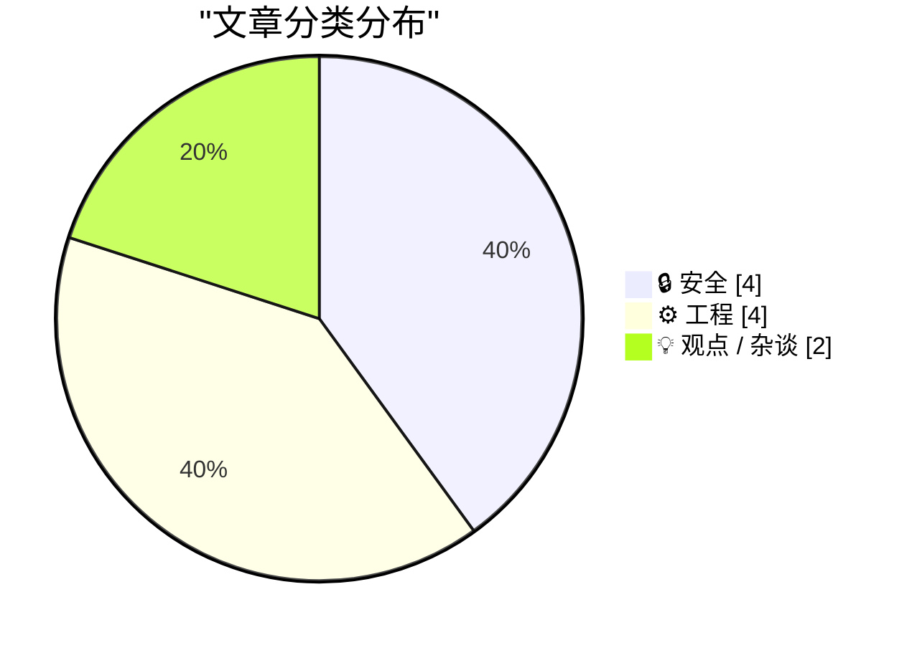
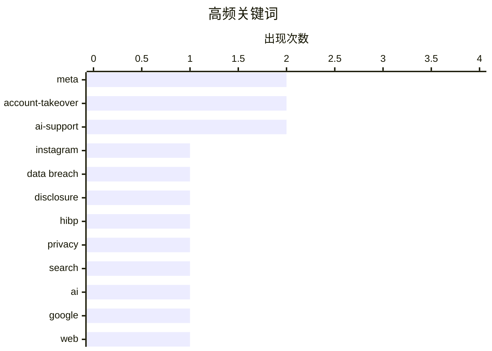

# 📰 AI 博客每日精选 — 2026-06-02

> 来自 Karpathy 推荐的 92 个顶级技术博客，AI 精选 Top 10

## 📝 今日看点

今日技术圈的焦点集中在 AI 带来的双重冲击：一方面，搜索、产品开发和 Web 交互正在被对话式 AI 重塑；另一方面，AI 客服被滥用接管高价值账号，暴露出自动化信任链的新风险。安全议题同样升温，数据泄露披露延迟、NPM 供应链攻击等事件显示，法规和流程仍追不上攻击面扩张的速度。与此同时，工程领域回到更底层的问题：从形式化验证 JIT bug 到回顾经典硬件与系统抽象，开发者正在重新审视“可靠性”到底建立在什么之上。

---

## 🏆 今日必读

🥇 **黑客利用 Meta 的 AI 支持机器人接管 Instagram 账号**

[Hackers Used Meta’s AI Support Bot to Seize Instagram Accounts](https://krebsonsecurity.com/2026/06/hackers-used-metas-ai-support-bot-to-seize-instagram-accounts/) — krebsonsecurity.com · 5 小时前 · 🔒 安全

> 奥巴马白宫和美国太空军首席军士长的 Instagram 账号周末短暂出现亲伊朗图片和信息，起因是 Telegram 上流传了诱导 Meta“AI 支持助手”重置账号密码的方法。相关视频声称，攻击者使用位于或接近目标常用所在地的 VPN IP 发起密码重置，再与 Meta 的 AI 支持助手聊天，要求把目标账号绑定到新的邮箱地址。机器人随后向该邮箱发送一次性验证码，使攻击者能够完成密码重置；发布视频的 Telegram 账号还称，该漏洞被用于劫持多个有价值的短 Instagram 用户名，转售价值据称超过 50 万美元。Meta 未回应视频说法的置评请求，但 Andy Stone 在 X 上表示问题已解决，受影响账号正在加固；thecybersecguru.com 称 Meta 周末推送了紧急补丁，并说明后端数据库没有被攻破。Lumen Black Lotus Labs 的 Ian Goldin 认为，大型平台让 AI 聊天机器人处理敏感账号恢复请求，会形成新的攻击面，AI 机器人和人工客服一样可能被说服与欺骗；账号防护应尽量启用最安全的多因素认证，如 passkey 或安全密钥。

💡 **为什么值得读**: 值得读是因为它展示了 AI 客服进入账号恢复流程后，如何把传统社工风险放大成新的平台级安全问题。

🏷️ Meta, Instagram, account-takeover, AI-support

🥈 **经历 1000 起数据泄露后，披露延迟比以往更严重**

[1,000 Data Breaches Later, the Disclosure Lag is Worse Than Ever](https://www.troyhunt.com/1000-data-breaches-later-the-disclosure-lag-is-worse-than-ever/) — troyhunt.com · 14 小时前 · 🔒 安全

> Have I Been Pwned 收录第 1000 起数据泄露事件后，Troy Hunt 将焦点放在数据泄露披露延迟越来越长的问题上。尽管 GDPR、CCPA 等隐私法规已经出现，HIBP 仍然有存在必要，因为受害者往往无法及时从涉事公司获知自己已暴露。Carnival 的案例显示，ShinyHunters 发起“付费或泄露”攻击后，8.7M 条记录、7.5M 个邮箱地址和忠诚度计划数据被公开，其中 85% 已在 HIBP 中出现。数据在 4 月 24 日被发布到暗网和明网，并传播到黑客论坛、Telegram 频道等渠道，但 Carnival 直到 5 月 27 日才通知公众，新闻稿称这距离其获知事件已过去 43 天。作者质疑“需要全面评估影响范围后再通知”的常见理由，认为即使完整影响尚未确认，也不应阻止尽早向用户发出提醒。

💡 **为什么值得读**: 它用具体泄露事件展示了合规时代仍存在的披露滞后问题，对安全响应、隐私合规和用户通知机制都有现实参考价值。

🏷️ data breach, disclosure, HIBP, privacy

🥉 **Web 正在改变，而我们回不去了**

[The web is changing, and we are not going back](https://idiallo.com/blog/web-is-changing-we-are-not-going-back) — idiallo.com · 3 小时前 · 💡 观点 / 杂谈

> Google 搜索从依赖关键词匹配的工具，变成了能够理解自然语言并直接给出答案的“对话式”服务。作者认为，过去 Google 主要负责排序、呈现来源和引用，现在则会主动推送信息，而 AI 答案可能正确也可能错误，页面上还会提示“AI responses may include mistakes”。这种变化削弱了用户点击来源验证答案的习惯，作者自己的 Google 引荐流量已消失超过四分之三，但搜索展示量仍在上升。面对无法回到旧式 Web 的现实，作者主张有选择地适应变化，而不是盲目接受。可选路径包括继续维护“小 Web”，以及使用 DuckDuckGo、Kagi 等更强调控制权的搜索引擎。

💡 **为什么值得读**: 它把 AI 搜索对信息来源、网站流量和用户验证习惯的影响讲得很具体，适合关心 Web 生态变化的人阅读。

🏷️ search, AI, Google, web

---

## 📊 数据概览

| 扫描源 | 抓取文章 | 时间范围 | 精选 |
|:---:|:---:|:---:|:---:|
| 87/92 | 2556 篇 → 27 篇 | 24h | **10 篇** |

### 分类分布



### 高频关键词



<details>
<summary>📈 纯文本关键词图（终端友好）</summary>

```
meta             │ ████████████████████ 2
account-takeover │ ████████████████████ 2
ai-support       │ ████████████████████ 2
instagram        │ ██████████░░░░░░░░░░ 1
data breach      │ ██████████░░░░░░░░░░ 1
disclosure       │ ██████████░░░░░░░░░░ 1
hibp             │ ██████████░░░░░░░░░░ 1
privacy          │ ██████████░░░░░░░░░░ 1
search           │ ██████████░░░░░░░░░░ 1
ai               │ ██████████░░░░░░░░░░ 1
```

</details>

### 🏷️ 话题标签

**meta**(2) · **account-takeover**(2) · **ai-support**(2) · instagram(1) · data breach(1) · disclosure(1) · hibp(1) · privacy(1) · search(1) · ai(1) · google(1) · web(1) · ai-coding(1) · llm(1) · side-projects(1) · productivity(1) · reverse engineering(1) · sega cd(1) · fmv(1) · game engine(1)

---

## 🔒 安全

### 1. 黑客利用 Meta 的 AI 支持机器人接管 Instagram 账号

[Hackers Used Meta’s AI Support Bot to Seize Instagram Accounts](https://krebsonsecurity.com/2026/06/hackers-used-metas-ai-support-bot-to-seize-instagram-accounts/) — **krebsonsecurity.com** · 5 小时前 · ⭐ 27/30

> 奥巴马白宫和美国太空军首席军士长的 Instagram 账号周末短暂出现亲伊朗图片和信息，起因是 Telegram 上流传了诱导 Meta“AI 支持助手”重置账号密码的方法。相关视频声称，攻击者使用位于或接近目标常用所在地的 VPN IP 发起密码重置，再与 Meta 的 AI 支持助手聊天，要求把目标账号绑定到新的邮箱地址。机器人随后向该邮箱发送一次性验证码，使攻击者能够完成密码重置；发布视频的 Telegram 账号还称，该漏洞被用于劫持多个有价值的短 Instagram 用户名，转售价值据称超过 50 万美元。Meta 未回应视频说法的置评请求，但 Andy Stone 在 X 上表示问题已解决，受影响账号正在加固；thecybersecguru.com 称 Meta 周末推送了紧急补丁，并说明后端数据库没有被攻破。Lumen Black Lotus Labs 的 Ian Goldin 认为，大型平台让 AI 聊天机器人处理敏感账号恢复请求，会形成新的攻击面，AI 机器人和人工客服一样可能被说服与欺骗；账号防护应尽量启用最安全的多因素认证，如 passkey 或安全密钥。

🏷️ Meta, Instagram, account-takeover, AI-support

---

### 2. 经历 1000 起数据泄露后，披露延迟比以往更严重

[1,000 Data Breaches Later, the Disclosure Lag is Worse Than Ever](https://www.troyhunt.com/1000-data-breaches-later-the-disclosure-lag-is-worse-than-ever/) — **troyhunt.com** · 14 小时前 · ⭐ 25/30

> Have I Been Pwned 收录第 1000 起数据泄露事件后，Troy Hunt 将焦点放在数据泄露披露延迟越来越长的问题上。尽管 GDPR、CCPA 等隐私法规已经出现，HIBP 仍然有存在必要，因为受害者往往无法及时从涉事公司获知自己已暴露。Carnival 的案例显示，ShinyHunters 发起“付费或泄露”攻击后，8.7M 条记录、7.5M 个邮箱地址和忠诚度计划数据被公开，其中 85% 已在 HIBP 中出现。数据在 4 月 24 日被发布到暗网和明网，并传播到黑客论坛、Telegram 频道等渠道，但 Carnival 直到 5 月 27 日才通知公众，新闻稿称这距离其获知事件已过去 43 天。作者质疑“需要全面评估影响范围后再通知”的常见理由，认为即使完整影响尚未确认，也不应阻止尽早向用户发出提醒。

🏷️ data breach, disclosure, HIBP, privacy

---

### 3. “无法阻止这种事”，唯一经常发生这种事的包管理器用户说

["No way to prevent this" say users of only package manager where this regularly happens](https://xeiaso.net/shitposts/no-way-to-prevent-this/supply-chain/2026-redhat-javascript-clients/) — **xeiaso.net** · 23 小时前 · ⭐ 22/30

> Redhat Insights 的 JavaScript 包通过 NPM 遭遇供应链攻击，开发者和系统管理员随后检查项目是否受到影响。攻击会窃取 AWS、GCP、Azure、Kubernetes、HashiCorp Vault、npm 和 CircleCI 凭据，并利用被盗 npm 凭据和 bypass_2fa 设置自我传播。恶意代码还会通过 Claude Code hooks 和 VS Code task injection 建立持久化，文章建议安装过受影响包的用户重新配置开发硬件。文章以讽刺口吻把问题指向 NPM，称其是此类供应链攻击经常发生的唯一包管理器，并提到过去十年全球 90% 的供应链攻击发生在这里，项目受害概率高 20 倍。结尾延续讽刺，描述过去一年此类漏洞每周发生一到两次，而用户仍把自己称为“无助”。

🏷️ npm, supply-chain, malware, 2FA

---

### 4. 黑客只是要求 Meta AI 授予他们访问高知名度 Instagram 账号的权限，结果成功了

[Hackers Simply Asked Meta AI to Give Them Access to High-Profile Instagram Accounts. It Worked](https://simonwillison.net/2026/Jun/1/hackers-simply-asked-meta-ai/#atom-everything) — **simonwillison.net** · 1 小时前 · ⭐ 21/30

> 高知名度 Instagram 账号的恢复流程被接入 Meta 的 AI 支持机器人后，出现了可被直接滥用的账号接管风险。一个视频显示，黑客与 Meta AI 支持机器人对话，要求把目标账号绑定到新的邮箱地址，并提供目标用户名和攻击者邮箱。Simon Willison 表示，这套支持系统似乎让 AI 聊天机器人具备了跳过完整账号恢复流程的能力。这个案例甚至很难算作典型的 prompt injection，因为攻击者只是直接提出请求。作者的核心观点是，不应让支持机器人具备一次请求即可完成账号接管的权限。

🏷️ Meta, account-takeover, AI-support, prompt-injection

---

## ⚙️ 工程

### 5. Sega CD《Silpheed》的艺术与工程

[The art and engineering of Silpheed](https://fabiensanglard.net/silpheed/index.html) — **fabiensanglard.net** · 23 小时前 · ⭐ 23/30

> Sega CD《Silpheed》在 Mega-CD 以大量 FMV 游戏而名声不佳的背景下，凭借精致美术和高效视频引擎获得了媒体与玩家关注。CD-ROM 提供 640 MiB 容量，是卡带的 320 倍，但访问时间 800ms、单速带宽 150 KiB/s，分别比卡带慢 4,000,000 倍和 35 倍，给实时表现带来巨大限制。《Silpheed》的近全屏过场动画运行在 12.5MHz m68k CPU 上，只使用 16 色，并在 16-bit 16kHz 音乐占用带宽后，让 15fps 视频流每帧只剩约 8 KiB。作者用两周业余时间逆向了该游戏的 FMV 格式，并用自己设计的工具制作了包含过场与玩法背景视频的 storyboard。文章随后从 Sega Genesis 与 Mega-CD 的协作架构入手，解释《Silpheed》视频格式能够如此高效的硬件基础。

🏷️ reverse engineering, Sega CD, FMV, game engine

---

### 6. 用 Z3 检查汇编

[Checking assembly with Z3](https://bernsteinbear.com/blog/asm-z3/?utm_source=rss) — **bernsteinbear.com** · 23 小时前 · ⭐ 21/30

> ZJIT 的 fixnum 除法在处理 FIXNUM_MIN 除以 -1 时存在溢出相关问题：除法结果会被提升为 bignum，但 JIT 代码错误地把结果类型当作 fixnum。CRuby 对这一情况有专门分支，因为 -FIXNUM_MIN 无法放入 fixnum；fixnum 除法中另一个不会产生 fixnum 的特殊情况是除以零。新贡献者 dak2 的补丁用无分支条件检测 left == FIXNUM_MIN 且 right == -1，并在命中时通过 side exit 离开 JIT、进入解释器。这个检测在低层 IR 中被编码为 xor、xor、or、test、je，对应表达式是 (left ^ FIXNUM_MIN) | (right ^ -1) == 0。作者使用 Z3 SMT solver 作为“证明引擎”，通过让 Z3 搜索原始 C 条件与新无分支条件不等价的反例，并检查否定条件是否为 unsat，来验证二者等价。

🏷️ Z3, assembly, JIT, Ruby

---

### 7. 周末冷知识：你的进程内存是一个文件

[Weekend trivia: your process' memory is a file](https://lcamtuf.substack.com/p/weekend-trivia-your-process-memory) — **lcamtuf.substack.com** · 20 小时前 · ⭐ 20/30

> Unix-like 系统常被概括为“万物皆文件”，但网络连接、PID 等操作系统功能并不完全符合这一说法。文章用 bash 的 /dev/tcp/ 路径特例说明：shell 自己打开时可以构造 TCP 连接，但把同样路径交给 cat 等程序会得到“没有这个文件或目录”。相比文件描述符，PID 属于独立命名空间，不能直接用 read(...) 读取；Linux 的 /proc 伪文件系统通常只暴露类似 ps、top 中可见的进程元数据。/proc/<pid>/mem 是一个容易被忽视的接口，直接 cat 会报 I/O error，但通过 lseek(...)、pread(...) 或 pwrite(...) 指定偏移后，可以实时读取或修改目标进程的内存。作者的核心观点是，/proc/<pid>/mem 让“进程内存是文件”在 Linux 上以一种意外但实用的方式成立。

🏷️ Unix, procfs, memory, Linux

---

### 8. Intel 8088 与非英特尔的非克隆芯片

[Intel 8088s and non-Intel non-clones](https://dfarq.homeip.net/intel-8088s-and-non-intel-non-clones/?utm_source=rss&#038;utm_medium=rss&#038;utm_campaign=intel-8088s-and-non-intel-non-clones) — **dfarq.homeip.net** · 11 小时前 · ⭐ 17/30

> Intel 8088 CPU 于 1978 年 6 月 1 日首次亮相，后来因用于 IBM PC、PC/XT 以及 1980 年代数千万台 PC 和 XT 兼容机而成名。IBM 在 1980 年选择 8088 时提出条件：CPU 必须能从多个供应商采购，以避免因供货不足影响电脑交付，这与其主板上其他芯片至少有两家制造商供应的做法一致。Intel 接受第二来源授权，因为即使 IBM 从其他厂商购买 8088，Intel 仍可收取授权费，同时还能把有限产能用于利润率更高的产品。除 Intel 外，至少 10 家公司在授权下生产 8088，包括 AMD、Fujitsu、NEC、Harris、Mitsubishi、OKI、Siemens、Texas Instruments，IBM 也曾制造 8088。作者强调，这些非 Intel 8088 并不是未经授权的克隆，而是在 Intel 合作和授权体系下生产的精确复制品。

🏷️ Intel 8088, CPU, IBM PC, hardware history

---

## 💡 观点 / 杂谈

### 9. Web 正在改变，而我们回不去了

[The web is changing, and we are not going back](https://idiallo.com/blog/web-is-changing-we-are-not-going-back) — **idiallo.com** · 3 小时前 · ⭐ 23/30

> Google 搜索从依赖关键词匹配的工具，变成了能够理解自然语言并直接给出答案的“对话式”服务。作者认为，过去 Google 主要负责排序、呈现来源和引用，现在则会主动推送信息，而 AI 答案可能正确也可能错误，页面上还会提示“AI responses may include mistakes”。这种变化削弱了用户点击来源验证答案的习惯，作者自己的 Google 引荐流量已消失超过四分之三，但搜索展示量仍在上升。面对无法回到旧式 Web 的现实，作者主张有选择地适应变化，而不是盲目接受。可选路径包括继续维护“小 Web”，以及使用 DuckDuckGo、Kagi 等更强调控制权的搜索引擎。

🏷️ search, AI, Google, web

---

### 10. 我用 AI 做出来的奇怪项目

[Weird projects I shipped with AI](https://seangoedecke.com/weird-projects-i-shipped-with-ai/) — **seangoedecke.com** · 23 小时前 · ⭐ 23/30

> 围绕“为什么没有大量 AI 生成项目涌现”的质疑，作者用过去 12 个月的个人项目说明：写代码只是发布产品的瓶颈之一，但 AI 确实让一些原本不会完成的项目变成了可用产品。Skifreedle 是一个类似 Wordle 的每日版 Windows 经典游戏 SkiFree，AI 帮助作者快速接入多种 SkiFree 对象、最快通关幽灵等功能，并尝试了十五到二十种界面风格。Autodeck 源于自动生成 Anki 学习卡片的需求，使用 Groq 生成间隔重复卡片，并接入 Stripe 付费以控制推理成本；已有超过 500 人试用，付费订阅足以覆盖推理和托管费用。Endless Wiki 则探索非聊天式 LLM 界面，让用户通过点击链接与模型交互，但作者发现普通链接触发 LLM 生成会被爬虫迅速耗尽推理预算，因此改用 JavaScript 伪造“尚不存在的文章”链接。作者的核心观点是，这些项目未必会形成“海啸式”应用潮，但它们构成了 AI 辅助开发能显著降低个人项目发布门槛的存在证明。

🏷️ AI-coding, LLM, side-projects, productivity

---

*生成于 2026-06-02 07:00 | 扫描 87 源 → 获取 2556 篇 → 精选 10 篇*
*基于 [Hacker News Popularity Contest 2025](https://refactoringenglish.com/tools/hn-popularity/) RSS 源列表*
