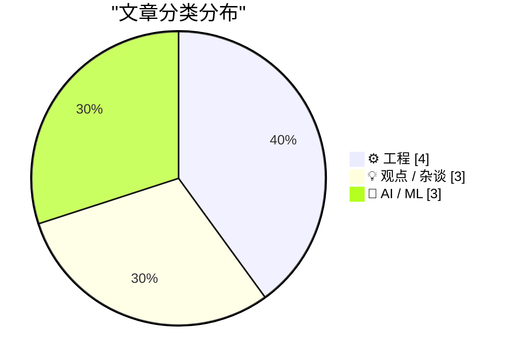
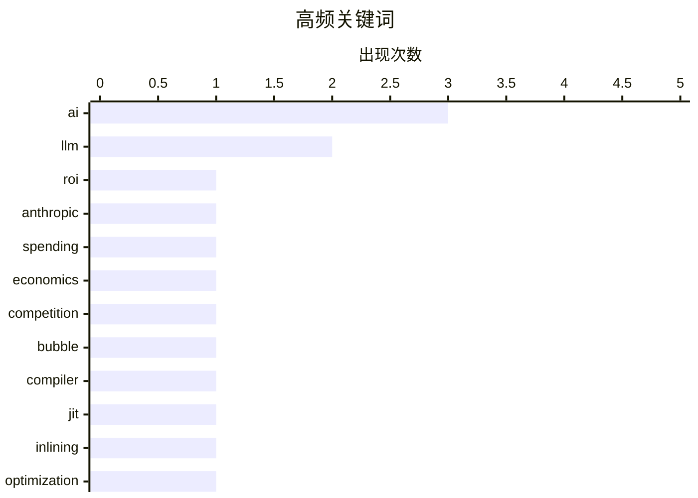

# 📰 AI 博客每日精选 — 2026-06-03

> 来自 Karpathy 推荐的 92 个顶级技术博客，AI 精选 Top 10

## 📝 今日看点

今天技术圈的焦点继续围绕 AI 泡沫与落地压力展开：企业投入巨大却难以证明 ROI，模型同质化削弱护城河，行业开始从“狂飙竞赛”转向对商业价值和监管机制的重新审视。与此同时，微软等大厂仍在加码自研模型，说明 AI 竞争并未降温，但叙事正在从规模崇拜转向场景、效率与风险控制。工程侧则回到更底层的确定性与精确性：从 JIT 内联、内存旋转到编程语言的严格表达，开发者重新强调计算机系统中那些不性感但关键的基本功。元宇宙旧梦的回顾也提醒人们，技术热潮终会退去，能留下来的往往不是概念，而是真正可用、可验证的能力。

---

## 🏆 今日必读

🥇 **AI 没有投资回报率**

[AI Doesn't Have ROI](https://www.wheresyoured.at/ai-doesnt-have-roi/) — wheresyoured.at · 8 小时前 · 💡 观点 / 杂谈

> 企业在 AI 上的投入越来越难证明价值，Uber COO Andrew Macdonald 称很难把 AI 支出与有用的消费者功能对应起来，而其 CTO 曾表示 Uber 在四个月内烧完了全年 token 预算。Axios 报道称，一家公司因未设置支出上限，在一个月内意外花费 5 亿美元使用 Anthropic 模型，随后其他公司也开始寻找降低 AI 开支的方法。作者认为，LLM 容易幻觉，加上各种工具封装和“agentic”界面不断增加，使任务成本、效果和投资回报都难以形成标准衡量。GitHub Copilot 从高级请求模式改为 token 计费，原因是用户曾可用每月 39 美元订阅消耗价值数千美元的 token，但新模式引发用户不满：有人单次提示就消耗 50% 或 31% 的月度额度，也有人数小时内消耗 60%。作者的核心观点是，如果无法可靠衡量 AI 的质量、成本和回报，就应质疑继续为其付费的合理性。

💡 **为什么值得读**: 它把 AI ROI 争议具体落到 token 计费、预算失控和 GitHub Copilot 用户成本体验上，能帮助读者判断企业 AI 支出是否真的可控。

🏷️ AI, ROI, Anthropic, spending

🥈 **为什么事情终将崩塌**

[Why things will eventually fall apart](https://garymarcus.substack.com/p/why-things-will-eventually-fall-apart) — garymarcus.substack.com · 7 小时前 · 🤖 AI / ML

> Gary Marcus 将当前 AI 竞争的风险分成“数学”和“心理”两部分：行业把 AI 当成类似搜索的赢家通吃市场，但他认为这个前提站不住脚。各家公司使用的是本质相近的技术方案和数据，因此缺乏护城河，也难以出现占据 90% 市场的垄断赢家。没有明确赢家就无法维持垄断定价，竞争会走向价格战和商品化定价，导致企业投入过高而利润有限。市场层面的怀疑正在扩散：他关于 Google 融资的 X 帖子一夜超过 75 万浏览，Steve Eisman、George Noble、Julie Garran 等参与的播客也讨论了类似担忧。Marcus 还提到“tokenmaxxing”趋势被认为正在结束，Anthropic 取消“无限量自助”式服务，更多报告开始质疑企业客户的 ROI；他最担心的是散户投资者和退休基金可能在这一过程中承受损失。

💡 **为什么值得读**: 值得读在于它把 AI 热潮的商业可持续性问题拆成市场结构、定价压力、ROI 和投资者风险几个具体层面，而不是只停留在技术乐观或悲观判断上。

🏷️ AI, economics, competition, bubble

🥉 **内联启发式策略综述**

[A survey of inlining heuristics](https://bernsteinbear.com/blog/inlining-heuristics/?utm_source=rss) — bernsteinbear.com · 2026-06-03 · ⚙️ 工程

> 方法级 JIT 编译器通常一次只处理一个函数，但在 Ruby 这类动态语言中，方法很小且无处不在，连属性读取也可能通过方法分发完成，导致编译器缺少优化上下文。示例中的 `distance_from_origin` 看似只是距离计算，却涉及 `Point.new`、`Point#initialize`、`Point#distance`、`Float#**`、`Math.sqrt` 等 8 次方法调用，至少 2 次堆分配，以及对 `Point` 实例的多次内存读写。负载-存储消除、逃逸分析等优化在没有内联时难以发挥作用，因为相关操作看起来会逃逸且有副作用。内联把被调用函数体复制进调用方，是触发后续优化的关键杠杆；作者曾为 Cinder 实现这一部分花费至少一周，算上 JIT 管线改造可能接近数月，而 k0kubun 在 ZJIT 中约 30 分钟做出了原型。Python 和 Ruby 还允许用户代码观察局部变量、调用栈等 VM 状态，采样分析器也需要栈信息，因此内联后仍要保留足够机制，让运行时表现得像被调用函数没有被内联一样。

💡 **为什么值得读**: 值得读是因为它用具体 Ruby 例子说明了内联为何是动态语言 JIT 优化的入口，以及为什么真正落地远不只是复制函数体。

🏷️ compiler, JIT, inlining, optimization

---

## 📊 数据概览

| 扫描源 | 抓取文章 | 时间范围 | 精选 |
|:---:|:---:|:---:|:---:|
| 87/92 | 2556 篇 → 27 篇 | 24h | **10 篇** |

### 分类分布



### 高频关键词



<details>
<summary>📈 纯文本关键词图（终端友好）</summary>

```
ai          │ ████████████████████ 3
llm         │ █████████████░░░░░░░ 2
roi         │ ███████░░░░░░░░░░░░░ 1
anthropic   │ ███████░░░░░░░░░░░░░ 1
spending    │ ███████░░░░░░░░░░░░░ 1
economics   │ ███████░░░░░░░░░░░░░ 1
competition │ ███████░░░░░░░░░░░░░ 1
bubble      │ ███████░░░░░░░░░░░░░ 1
compiler    │ ███████░░░░░░░░░░░░░ 1
jit         │ ███████░░░░░░░░░░░░░ 1
```

</details>

### 🏷️ 话题标签

**ai**(3) · **llm**(2) · **roi**(1) · anthropic(1) · spending(1) · economics(1) · competition(1) · bubble(1) · compiler(1) · jit(1) · inlining(1) · optimization(1) · microsoft(1) · copilot(1) · licensing(1) · regulation(1) · policy(1) · preflight(1) · c++(1) · std::rotate(1)

---

## ⚙️ 工程

### 1. 内联启发式策略综述

[A survey of inlining heuristics](https://bernsteinbear.com/blog/inlining-heuristics/?utm_source=rss) — **bernsteinbear.com** · 2026-06-03 · ⭐ 22/30

> 方法级 JIT 编译器通常一次只处理一个函数，但在 Ruby 这类动态语言中，方法很小且无处不在，连属性读取也可能通过方法分发完成，导致编译器缺少优化上下文。示例中的 `distance_from_origin` 看似只是距离计算，却涉及 `Point.new`、`Point#initialize`、`Point#distance`、`Float#**`、`Math.sqrt` 等 8 次方法调用，至少 2 次堆分配，以及对 `Point` 实例的多次内存读写。负载-存储消除、逃逸分析等优化在没有内联时难以发挥作用，因为相关操作看起来会逃逸且有副作用。内联把被调用函数体复制进调用方，是触发后续优化的关键杠杆；作者曾为 Cinder 实现这一部分花费至少一周，算上 JIT 管线改造可能接近数月，而 k0kubun 在 ZJIT 中约 30 分钟做出了原型。Python 和 Ruby 还允许用户代码观察局部变量、调用栈等 VM 状态，采样分析器也需要栈信息，因此内联后仍要保留足够机制，让运行时表现得像被调用函数没有被内联一样。

🏷️ compiler, JIT, inlining, optimization

---

### 2. 重新审视旋转：另一种单向算法

[Rotation revisited: Another unidirectional algorithm](https://devblogs.microsoft.com/oldnewthing/20260602-00/?p=112376) — **devblogs.microsoft.com/oldnewthing** · 9 小时前 · ⭐ 20/30

> 内存块旋转问题关注如何在常量内存中交换相邻的 A、B 两段元素，也对应 C++ 的 std::rotate 操作。作者更正了此前说法：gcc 的 libstdc++ 在一般情况下并不是把随机访问迭代器的旋转视为置换并分解为循环，而是使用另一种算法，只有单元素旋转有特殊处理。该算法假设 A 较小，从 first 和 mid 开始逐个交换并同步前进，直到 mid 到达 last，此时 B 已到达最终位置，而 A 会被分成两个可预测的乱序片段。设总长度为 n、A 的长度为 a，A 的第一段包含最后的 n % a 个元素，第二段包含最初的 a − (n % a) 个元素，随后通过递归旋转这两段 A 来完成整体旋转。该算法执行 n − 1 次交换，局部性较好：first 持续向前，mid 大多数时间向前移动，最多有 O(log(min(|A|, |B|))) 次向后重置。

🏷️ C++, std::rotate, algorithm, libstdc++

---

### 3. 使用 FourSquare API 将位置签到发布到社交媒体

[Using FourSquare's API to post location checkins to social media](https://shkspr.mobi/blog/2026/06/using-foursquares-api-to-post-location-checkins-to-social-media/) — **shkspr.mobi** · 11 小时前 · ⭐ 19/30

> 作者想把 FourSquare Swarm 的位置签到自动同步到 BlueSky 和 Mastodon，让没有使用 SwarmApp 的朋友也能看到更新。Swarm 本身不提供社交媒体跨发，因此作者实现了一个名为 SwarmToSocial 的方案，并将代码放在 GitLab 上。FourSquare 的 CheckIn API 文档被认为较易理解，开发者创建 OAuth 应用后可获得 Client ID、Client Secret，并通过授权流程换取 access_token。新增签到可向 `https://api.foursquare.com/v2/checkins/add` 发起 POST 请求，参数包括版本日期 `v`、`venueId`、最多 140 字符的 `shout` 和 `oauth_token`，响应会返回包含 `meta.code`、`checkin.id`、地点、用户和可见性等信息的 JSON。目前开发者每月可免费使用 10,000 次 API 调用，作者认为这对多数个人用途已经足够。

🏷️ Foursquare, API, Mastodon, Bluesky

---

### 4. 《程序员的逻辑》补充材料

[Logic for Programmers extra credits](https://buttondown.com/hillelwayne/archive/logic-for-programmers-extra-credits/) — **buttondown.com/hillelwayne** · 8 小时前 · ⭐ 16/30

> 作者本周因在布达佩斯准备会议，没有发布正式 newsletter，但分享了《Logic for Programmers》的若干补充材料。补充内容来自书中未能容纳的旁支或更技术性的主题，目前已有四篇。主题包括多个并发进程的排序数量计算、一阶逻辑如何量化“一组函数”以及函数如何用集合定义、Barbara Liskov 在子类型中的“history rule”，以及集合上的全序和偏序。作者说明这些材料是即兴写成，未经过书稿那样细致的编辑，可能比较粗糙或存在错误。整体上，这些补充提供了约 2,000-3,000 字的数学内容，作为本周正式更新的替代。

🏷️ logic, concurrency, type-theory, subtyping

---

## 💡 观点 / 杂谈

### 5. AI 没有投资回报率

[AI Doesn't Have ROI](https://www.wheresyoured.at/ai-doesnt-have-roi/) — **wheresyoured.at** · 8 小时前 · ⭐ 25/30

> 企业在 AI 上的投入越来越难证明价值，Uber COO Andrew Macdonald 称很难把 AI 支出与有用的消费者功能对应起来，而其 CTO 曾表示 Uber 在四个月内烧完了全年 token 预算。Axios 报道称，一家公司因未设置支出上限，在一个月内意外花费 5 亿美元使用 Anthropic 模型，随后其他公司也开始寻找降低 AI 开支的方法。作者认为，LLM 容易幻觉，加上各种工具封装和“agentic”界面不断增加，使任务成本、效果和投资回报都难以形成标准衡量。GitHub Copilot 从高级请求模式改为 token 计费，原因是用户曾可用每月 39 美元订阅消耗价值数千美元的 token，但新模式引发用户不满：有人单次提示就消耗 50% 或 31% 的月度额度，也有人数小时内消耗 60%。作者的核心观点是，如果无法可靠衡量 AI 的质量、成本和回报，就应质疑继续为其付费的合理性。

🏷️ AI, ROI, Anthropic, spending

---

### 6. 赞美计算机一丝不苟的较真

[An Ode to the Exacting Pedantry of Computers](https://blog.jim-nielsen.com/2026/pedantry-of-computing/) — **blog.jim-nielsen.com** · 4 小时前 · ⭐ 19/30

> 计算机编程曾要求开发者用精确语言表达意图，例如在 C++ 中区分 integers、floats 和 doubles，而 Python 则让这种负担有所降低。作者认为，计算机只会执行人明确告诉它的内容，程序中的 bug 往往不是计算机违背指令，而是开发者对执行过程的设想不够完整或精确。LLM 进一步减少了这种“较真”的摩擦：用户提出一个想法后，模型会补齐未说明、未预见的细节。过去这些细节会迫使开发者重新思考设计是否合理，现在则可能被自动假设并填充。作者的核心观点是，手写代码中的精确表达会塑造意图，而软件行业若更重视快速交付而非提前明确意图，可能会产出更多只被部分构想清楚的东西。

🏷️ programming, LLM, precision

---

### 7. 元宇宙狂热梦

[‘The Metaverse Fever Dream’](https://pxlnv.com/blog/metaverse-fever-dream/) — **daringfireball.net** · 22 小时前 · ⭐ 22/30

> “元宇宙”概念在 Neal Stephenson 1992 年小说《雪崩》中被定名，但原本带有警示意味，后来被 Second Life、Oculus 等产品逐步具象化。Facebook 在 2014 年收购 Oculus 后，早期并未频繁使用“metaverse”这一说法；Mark Zuckerberg 在 2018 年第一季度财报电话会上将虚拟现实和增强现实描述为未来 10 到 15 年的新计算范式，并称公司不想再次错过塑造移动平台的机会。Meta 后来把元宇宙包装成改变生活、工作和连接方式的长期方向，但作者回顾财报电话、演示和文档后认为，这场战略转向显得荒诞却曾被高管和媒体认真对待。元宇宙热潮在 COVID-19 疫情最紧迫的几年中达到高点，并从 Matthew Ball 2020 年 1 月关于其可能创造数万亿美元价值、成为新计算平台和劳动平台的文章中获得硅谷关注。随着 Meta 今年早些时候从元宇宙投入中后撤，曾被称为互联网下一前沿的叙事几乎无声地降温。

🏷️ metaverse, Meta, VR, AR

---

## 🤖 AI / ML

### 8. 为什么事情终将崩塌

[Why things will eventually fall apart](https://garymarcus.substack.com/p/why-things-will-eventually-fall-apart) — **garymarcus.substack.com** · 7 小时前 · ⭐ 23/30

> Gary Marcus 将当前 AI 竞争的风险分成“数学”和“心理”两部分：行业把 AI 当成类似搜索的赢家通吃市场，但他认为这个前提站不住脚。各家公司使用的是本质相近的技术方案和数据，因此缺乏护城河，也难以出现占据 90% 市场的垄断赢家。没有明确赢家就无法维持垄断定价，竞争会走向价格战和商品化定价，导致企业投入过高而利润有限。市场层面的怀疑正在扩散：他关于 Google 融资的 X 帖子一夜超过 75 万浏览，Steve Eisman、George Noble、Julie Garran 等参与的播客也讨论了类似担忧。Marcus 还提到“tokenmaxxing”趋势被认为正在结束，Anthropic 取消“无限量自助”式服务，更多报告开始质疑企业客户的 ROI；他最担心的是散户投资者和退休基金可能在这一过程中承受损失。

🏷️ AI, economics, competition, bubble

---

### 9. 微软新的 MAI 模型

[Microsoft's new MAI models](https://simonwillison.net/2026/Jun/2/microsofts-new-models/#atom-everything) — **simonwillison.net** · 38 分钟前 · ⭐ 22/30

> 微软发布了两个新的文本大语言模型：MAI-Thinking-1 和 MAI-Code-1-Flash，分别面向推理能力和 GitHub Copilot、VS Code 中的代码场景。MAI-Thinking-1 是 1T 参数、35B 激活参数的推理模型，面向“部分早期合作伙伴”开放；微软称其在盲测人工并排评估中优于 Sonnet 4.6。MAI-Code-1-Flash 是 137B 参数、5B 激活参数的代码模型，面向 GitHub Copilot 个人用户在 Visual Studio Code 中逐步推出，目标是提供更高性能和更低成本。作者最初误读了 MoE 激活参数与总参数规模，并在更新中纠正；他也关注微软所称“干净且适当授权”的训练数据。技术论文显示，训练数据仍包含公共网页抓取和 Common Crawl：专有网页语料从约 1.2 万亿页过滤到 7940 亿页，Common Crawl 处理后包含 242 亿页，因此作者认为其仍存在与其他主流 LLM 类似的授权问题。

🏷️ Microsoft, LLM, Copilot, licensing

---

### 10. 突发：AI 理性监管的梦想成真之时

[Breaking: When dreams for AI sanity come true](https://garymarcus.substack.com/p/breaking-when-dreams-for-ai-sanity) — **garymarcus.substack.com** · 3 小时前 · ⭐ 22/30

> Gary Marcus 关注的是对具有重大商业影响的 AI 模型建立立法层面的“起飞前检查”机制。三年多前，他在美国参议院被参议员 John Kennedy 问及最重要的三项 AI 立法建议时，将类似 FDA 药品审查的预先检查列为第一位。2026 年 6 月 2 日，特朗普总统签署了一项与这一思路非常接近的行政命令。Marcus 表示自己不能声称其中存在因果关系，但看到这一设想成为现实令他振奋。他希望这类监管能够保持两党共识，并服务于美国公民和全人类的利益。

🏷️ AI, regulation, policy, preflight

---

*生成于 2026-06-03 07:00 | 扫描 87 源 → 获取 2556 篇 → 精选 10 篇*
*基于 [Hacker News Popularity Contest 2025](https://refactoringenglish.com/tools/hn-popularity/) RSS 源列表*
