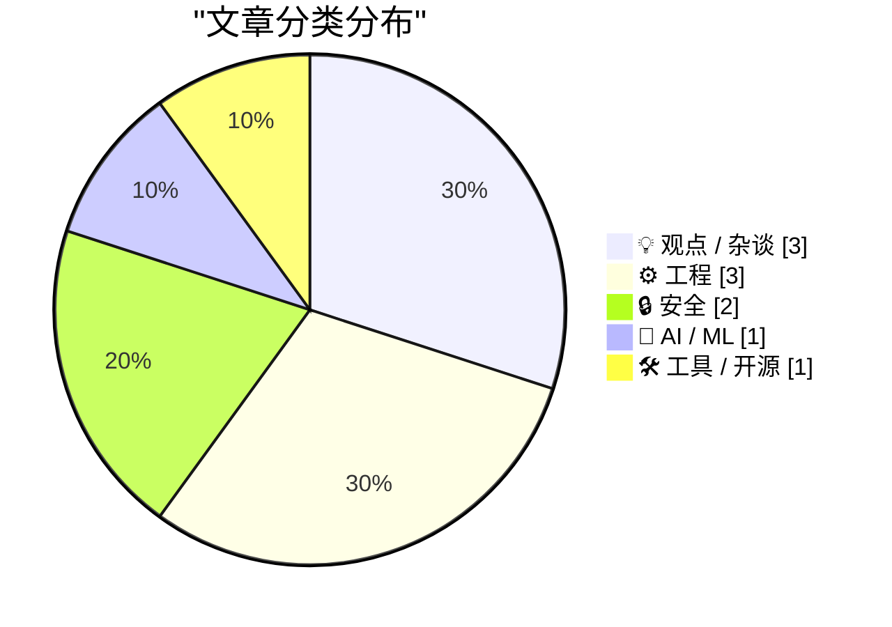
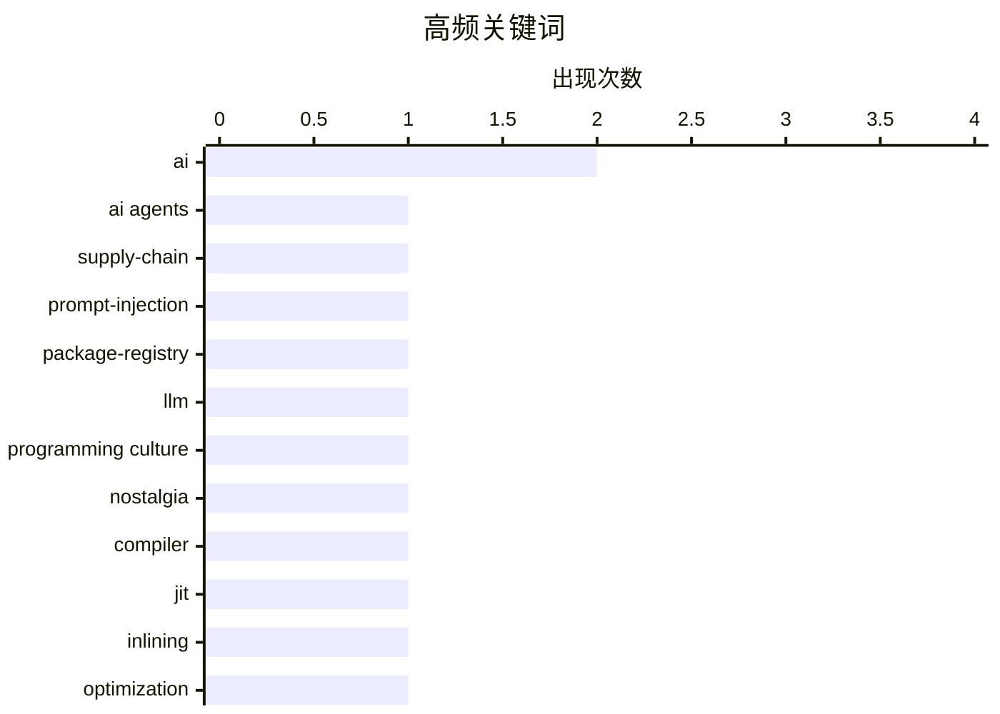

# 📰 AI 博客每日精选 — 2026-06-04

> 来自 Karpathy 推荐的 92 个顶级技术博客，AI 精选 Top 10

## 📝 今日看点

今日技术圈的焦点继续围绕 AI 的落地代价与信任边界展开：从 AI Agent 技能注册表的供应链风险，到企业限制 AI 编程工具 token 消耗，安全、成本与治理正在取代单纯的能力崇拜。与此同时，围绕 AI 内容生成、数据中心主权和“反 AI 怀旧”的争论升温，显示行业正在重新评估自动化、基础设施和人的价值。工程侧则回到基本功：编译器内联、数值计算和标准库算法的细节被重新审视，提醒开发者高层抽象背后仍离不开扎实的底层理解。

---

## 🏆 今日必读

🥇 **技能注册表威胁模型**

[Skills Registry Threat Models](https://nesbitt.io/2026/06/03/skills-registry-threat-models.html) — nesbitt.io · 8 小时前 · 🔒 安全

> AI Agent 的技能包会把提示词、脚本、依赖和工具权限打包，并通过技能注册表、索引中心或 GitHub 仓库列表分发。技能可声明来自 npm、pip、cargo、brew、go、apt 等多个包管理器的依赖，因此技能注册表实际上覆盖了传统包管理器客户端的威胁面。安装一个技能可能在用户机器上跨多个包管理器执行安装命令，而用户未必阅读过 manifest；技能内容还会在激活时进入 Agent 的 system prompt，使其同时具备代码执行和提示注入风险。技能会继承运行时已批准的 bash、文件编辑和网络权限，而许多加载器还接受任意 git URL，导致注册表侧的身份模型退化为 GitHub 的身份模型。作者强调，90 天 slug 过期、安装命令缺少 no-build 标志、lockfile 只记录名称不记录字节等问题，都是默认设计选择带来的安全边界，而不一定是静态扫描器能发现的代码错误。

💡 **为什么值得读**: 它把 AI Agent 技能生态与传统包管理器安全经验放在一起对照，能帮助读者识别技能注册表中容易被默认设计掩盖的真实风险。

🏷️ AI agents, supply-chain, prompt-injection, package-registry

🥈 **反 AI 怀旧与过去崇拜**

[Anti-AI nostalgia and the cult of the past](https://seangoedecke.com/anti-ai-nostalgia/) — seangoedecke.com · 2026-06-04 · 💡 观点 / 杂谈

> 围绕程序员圈对 LLM、现代软件工业和“过去真正程序员”的怀旧式反感，作者警惕这种话语中对传统和精神纯粹性的迷恋。开头那段激烈批判 AI 和“劣质代码”的文字并非作者真实立场，而是用来模拟互联网上一些反 AI 帖子和评论的语气。作者把这种语气与 Julius Evola、Ezra Pound、Hitler 等法西斯人物的引文并列，并引用 Mussolini 将法西斯定义为一种“精神态度”，以及 Umberto Eco 在《Ur-Fascism》中提出的“传统崇拜”和“拒斥现代主义”。他认为，当有人声称行业迷失方向、必须抵制现代技术腐蚀并回到“真正程序员”的时代时，这种论述值得怀疑。作者也承认，把反 AI 情绪描述为潜在法西斯很奇怪，因为另一种流行观点恰恰认为 LLM 本身是法西斯工具，但他强调法西斯式论证结构本身具有说服力，甚至反法西斯群体也可能落入类似框架。

💡 **为什么值得读**: 值得读是因为它没有停留在“支持或反对 AI”的常见争论，而是追问技术怀旧、反现代化叙事和政治修辞之间的潜在关系。

🏷️ AI, LLM, programming culture, nostalgia

🥉 **内联启发式方法综述**

[A survey of inlining heuristics](https://bernsteinbear.com/blog/inlining-heuristics/?utm_source=rss) — bernsteinbear.com · 23 小时前 · ⚙️ 工程

> 编译器，尤其是方法级 JIT 编译器，通常一次只处理一个函数，但动态语言中的方法往往很小且数量众多，这会限制优化上下文。以 Ruby 的 Point 示例为例，一个看似简单的 distance_from_origin 计算包含 Point.new、Point#initialize、Point#distance、Float#**、Math.sqrt 等 8 次方法调用，至少产生两个 Point 实例的堆分配，并带来对象读写的内存流量。即使存在 load-store elimination 或 escape analysis 等优化，如果调用和对象都表现为逃逸或有副作用，也难以发挥作用。内联可以把被调用函数体复制到调用方，从而为其他优化创造条件，是释放后续优化能力的关键杠杆。作者提到 Cinder 的内联器实现曾耗费较长时间，而同事在 ZJIT 中快速原型化了基础部分，但 Python 和 Ruby 允许用户代码观察局部变量、调用栈等 VM 状态，因此还需要额外机制让被内联的函数在外部看起来仍像未被内联。

💡 **为什么值得读**: 值得读是因为它用具体 Ruby JIT 场景说明了内联为什么不是单纯复制代码，而是动态语言编译器优化链条中的关键工程问题。

🏷️ compiler, JIT, inlining, optimization

---

## 📊 数据概览

| 扫描源 | 抓取文章 | 时间范围 | 精选 |
|:---:|:---:|:---:|:---:|
| 87/92 | 2556 篇 → 17 篇 | 24h | **10 篇** |

### 分类分布



### 高频关键词



<details>
<summary>📈 纯文本关键词图（终端友好）</summary>

```
ai                  │ ████████████████████ 2
ai agents           │ ██████████░░░░░░░░░░ 1
supply-chain        │ ██████████░░░░░░░░░░ 1
prompt-injection    │ ██████████░░░░░░░░░░ 1
package-registry    │ ██████████░░░░░░░░░░ 1
llm                 │ ██████████░░░░░░░░░░ 1
programming culture │ ██████████░░░░░░░░░░ 1
nostalgia           │ ██████████░░░░░░░░░░ 1
compiler            │ ██████████░░░░░░░░░░ 1
jit                 │ ██████████░░░░░░░░░░ 1
```

</details>

### 🏷️ 话题标签

**ai**(2) · **ai agents**(1) · **supply-chain**(1) · prompt-injection(1) · package-registry(1) · llm(1) · programming culture(1) · nostalgia(1) · compiler(1) · jit(1) · inlining(1) · optimization(1) · datacenter(1) · sovereignty(1) · latency(1) · ai coding(1) · claude code(1) · costs(1) · tokens(1) · ai-generated content(1)

---

## 💡 观点 / 杂谈

### 1. 反 AI 怀旧与过去崇拜

[Anti-AI nostalgia and the cult of the past](https://seangoedecke.com/anti-ai-nostalgia/) — **seangoedecke.com** · 2026-06-04 · ⭐ 23/30

> 围绕程序员圈对 LLM、现代软件工业和“过去真正程序员”的怀旧式反感，作者警惕这种话语中对传统和精神纯粹性的迷恋。开头那段激烈批判 AI 和“劣质代码”的文字并非作者真实立场，而是用来模拟互联网上一些反 AI 帖子和评论的语气。作者把这种语气与 Julius Evola、Ezra Pound、Hitler 等法西斯人物的引文并列，并引用 Mussolini 将法西斯定义为一种“精神态度”，以及 Umberto Eco 在《Ur-Fascism》中提出的“传统崇拜”和“拒斥现代主义”。他认为，当有人声称行业迷失方向、必须抵制现代技术腐蚀并回到“真正程序员”的时代时，这种论述值得怀疑。作者也承认，把反 AI 情绪描述为潜在法西斯很奇怪，因为另一种流行观点恰恰认为 LLM 本身是法西斯工具，但他强调法西斯式论证结构本身具有说服力，甚至反法西斯群体也可能落入类似框架。

🏷️ AI, LLM, programming culture, nostalgia

---

### 2. 数据中心主权真的那么重要吗？

[Is datacentre sovereignty really that important?](https://martinalderson.com/posts/is-datacentre-sovereignty-really-that-important/?utm_source=rss&amp;utm_medium=rss&amp;utm_campaign=feed) — **martinalderson.com** · 2026-06-04 · ⭐ 22/30

> 英国政界和评论界有人主张必须在本土建设大量数据中心，否则会在 AI 时代落后，但作者对此并不认同，并认为这类似于对重振重工业的执念。关于延迟问题，作者指出多数 AI 用例对延迟并不高度敏感：Opus 模型首 token 时间约为 1.6 到 3.6 秒，而英国到美国东海岸往返延迟约 80 毫秒、到欧洲约 10-20 毫秒、到亚洲约 200 毫秒，服务端耗时远高于跨境网络延迟。实时语音或视频应用确实更受益于低延迟，但作者认为这目前只是 AI 使用中的很小一部分，欧洲数据中心也能提供可接受延迟，未来实时音频代理甚至可能更适合完全在设备端运行。对于“本土数据中心可以带来税基”的说法，作者以 Virtus London campus 为例估算：100MW 负载对应约 1200 万英镑/年的应税价值，地方政府约可获得 600 万英镑/年商业地产税；即使扩展到 1GW，也可能接近 1 亿英镑/年。作者的核心观点是，英国本土数据中心在延迟和税收上的收益并不足以支撑“必须大规模本土化”的强主张。

🏷️ datacenter, sovereignty, AI, latency

---

### 3. 既然你的新闻通讯改由 AI 生成，我已经退订了

[Now that your newsletter is AI-generated, I've Unsubscribed](https://idiallo.com/blog/unsubscribed-from-ai-generated-newsletters) — **idiallo.com** · 1 小时前 · ⭐ 20/30

> 作者长期订阅一些新闻通讯，其中有的已持续超过 20 年，但在作者无说明地改用 AI 生成内容后，他选择退订。促使退订的变化包括连续出现带有高科技感的蓝色图片缩略图，以及内容变成可由提示词生成的形式；作者认为，如果只是提供 ChatGPT 式内容，读者自己也能做到。作者强调，新闻通讯的价值来自写作者真实经验、语气和思考，而不是机械化的高频输出。他还提到一份由已故作者之子接手的法语通讯：对方坦诚说明父亲去世并分享故事，因此他继续订阅到最后一篇。作者的核心观点是，人的声音和信任关系才是新闻通讯值得存在的理由，AI 生成内容更像一种变现策略。

🏷️ AI-generated content, newsletters, trust, authenticity

---

## ⚙️ 工程

### 4. 内联启发式方法综述

[A survey of inlining heuristics](https://bernsteinbear.com/blog/inlining-heuristics/?utm_source=rss) — **bernsteinbear.com** · 23 小时前 · ⭐ 23/30

> 编译器，尤其是方法级 JIT 编译器，通常一次只处理一个函数，但动态语言中的方法往往很小且数量众多，这会限制优化上下文。以 Ruby 的 Point 示例为例，一个看似简单的 distance_from_origin 计算包含 Point.new、Point#initialize、Point#distance、Float#**、Math.sqrt 等 8 次方法调用，至少产生两个 Point 实例的堆分配，并带来对象读写的内存流量。即使存在 load-store elimination 或 escape analysis 等优化，如果调用和对象都表现为逃逸或有副作用，也难以发挥作用。内联可以把被调用函数体复制到调用方，从而为其他优化创造条件，是释放后续优化能力的关键杠杆。作者提到 Cinder 的内联器实现曾耗费较长时间，而同事在 ZJIT 中快速原型化了基础部分，但 Python 和 Ruby 允许用户代码观察局部变量、调用栈等 VM 状态，因此还需要额外机制让被内联的函数在外部看起来仍像未被内联。

🏷️ compiler, JIT, inlining, optimization

---

### 5. 天真地求交错级数的和

[Naively summing an alternating series](https://www.johndcook.com/blog/2026/06/03/naive-sum/) — **johndcook.com** · 7 小时前 · ⭐ 19/30

> 用指数函数的幂级数直接实现 exp(x) 时，按“下一项小于 10^-12 就停止”的策略在 x=1 上表现正常，但在计算 exp(-20) 时得到 5.47893091802112e-10，而标准库 exp(-20) 为 2.061153622438558e-09。问题来自负数输入会让级数项正负交替，且在 x=-20 时项的绝对值会先增大到 n>20 后才减小，导致部分和剧烈振荡。计算过程中部分和的绝对值最大可达 21822593.77927747，而目标结果只有 10^-9 量级，大量抵消会造成精度丢失。继续测试 x=-22 时，程序甚至会给出负值，尽管理论上指数函数结果不可能为负。更稳妥的做法是把 exp(-20) 写成 1/exp(20)，避免交错级数带来的抵消问题。

🏷️ numerical methods, floating-point, series, Python

---

### 6. 重新审视旋转：关于 gcc 单向旋转算法的“惊人”发现

[Rotation revisited: A shocking discovery about gcc’s unidirectional rotation algorithm](https://devblogs.microsoft.com/oldnewthing/20260603-00/?p=112378) — **devblogs.microsoft.com/oldnewthing** · 9 小时前 · ⭐ 19/30

> gcc libstdc++ 用于随机访问迭代器的 rotation 算法，与旧的 forward-iterator rotation 算法本质上是同一个算法。以 A1、A2、A3 和 B1 到 B5 两个区块为例，两种算法都会先交换 first 与 mid 指向的元素，并在 first 到达原始 A 区块末尾前保持一致。旧算法随后通过递归交换剩余的 A 区块与 B 区块，新算法则继续交换 first 与 mid，最终完成相同的数据移动。两者并非完全相同：新算法是对称的，当较大区块在右侧时会从右向左交换，而旧算法始终从左向右执行。作者的结论是，这两个看似不同的 rotation 实现只是从不同视角描述了同一思路。

🏷️ C++, gcc, algorithms, iterators

---

## 🔒 安全

### 7. 技能注册表威胁模型

[Skills Registry Threat Models](https://nesbitt.io/2026/06/03/skills-registry-threat-models.html) — **nesbitt.io** · 8 小时前 · ⭐ 26/30

> AI Agent 的技能包会把提示词、脚本、依赖和工具权限打包，并通过技能注册表、索引中心或 GitHub 仓库列表分发。技能可声明来自 npm、pip、cargo、brew、go、apt 等多个包管理器的依赖，因此技能注册表实际上覆盖了传统包管理器客户端的威胁面。安装一个技能可能在用户机器上跨多个包管理器执行安装命令，而用户未必阅读过 manifest；技能内容还会在激活时进入 Agent 的 system prompt，使其同时具备代码执行和提示注入风险。技能会继承运行时已批准的 bash、文件编辑和网络权限，而许多加载器还接受任意 git URL，导致注册表侧的身份模型退化为 GitHub 的身份模型。作者强调，90 天 slug 过期、安装命令缺少 no-build 标志、lockfile 只记录名称不记录字节等问题，都是默认设计选择带来的安全边界，而不一定是静态扫描器能发现的代码错误。

🏷️ AI agents, supply-chain, prompt-injection, package-registry

---

### 8. 欢迎菲律宾政府加入 Have I Been Pwned

[Welcoming the Philippine Government to Have I Been Pwned](https://www.troyhunt.com/welcoming-the-philippine-government-to-have-i-been-pwned/) — **troyhunt.com** · 19 小时前 · ⭐ 18/30

> 菲律宾成为第 46 个接入 Have I Been Pwned 免费政府服务的国家政府。菲律宾国家 CERT 与信息和通信技术部合作，现可使用 HIBP 数据监控官方政府域名。其网络威胁情报与监控部门能够识别政府邮箱地址的泄露情况，并在相关账号出现在新数据泄露中时快速响应。HIBP 政府服务支持国家网络团队了解政府域名空间内的凭证暴露情况、通过 API 按需监控被攻陷账号，并在新加载的泄露数据影响政府域名时接收通知。菲律宾加入了使用 HIBP 强化国家网络防御、保护政府部门和资源、降低被泄露凭证风险的国家 CERT 与政府网络安全团队行列。

🏷️ HIBP, data-breach, government, CERT

---

## 🤖 AI / ML

### 9. Uber 为控制成本限制 Claude Code 等 AI 工具的使用额度

[Uber Caps Usage of AI Tools Like Claude Code to Manage Costs](https://simonwillison.net/2026/Jun/3/uber-caps-usage/#atom-everything) — **simonwillison.net** · 10 小时前 · ⭐ 22/30

> Uber 在 2026 年前四个月就用完 AI 预算后，开始限制员工使用 AI 编程工具的 token 支出。Bloomberg 报道称，Uber 将每名员工在每个 AI 编程工具上的月度 token 花费限制为 1,500 美元，且不同工具的额度彼此独立。该限制只适用于 Cursor、Anthropic Claude Code 等代理式编程软件。Simon Willison 认为，每工具每月 1,500 美元是应对超支的理性政策，比鼓励员工竞争 AI 使用量的“tokenmaxxing”排行榜更合理。按每名工程师活跃使用两个工具估算，年度上限为 36,000 美元，约为 Levels.fyi 上 Uber 美国软件工程师 330,000 美元年薪酬中位数的 11%。

🏷️ AI coding, Claude Code, costs, tokens

---

## 🛠 工具 / 开源

### 10. 伦敦数据存储平台重新上线

[London Data Store Relaunch](https://shkspr.mobi/blog/2026/06/london-data-store-relaunch/) — **shkspr.mobi** · 11 小时前 · ⭐ 15/30

> data.london.gov.uk 上线 16 年后进行了前后端刷新，目标是让伦敦开放数据平台不只是数据仓库，也更好地展示开放数据对市民生活的价值。此次更新包含一系列后端改动，前端也经过优化，使用户更容易找到所需数据。新版界面特别强化了数据可用许可证的展示，方便用户了解数据使用条件。新平台可通过 https://dfl.london.gov.uk/ 访问，发现问题可发送至 datastore@london.gov.uk。作者强调，这类开放数据资源需要被持续使用：浏览数据集、构建有趣项目，并推动本地机构向平台提交数据。

🏷️ open data, London, datasets, civic tech

---

*生成于 2026-06-04 07:00 | 扫描 87 源 → 获取 2556 篇 → 精选 10 篇*
*基于 [Hacker News Popularity Contest 2025](https://refactoringenglish.com/tools/hn-popularity/) RSS 源列表*
