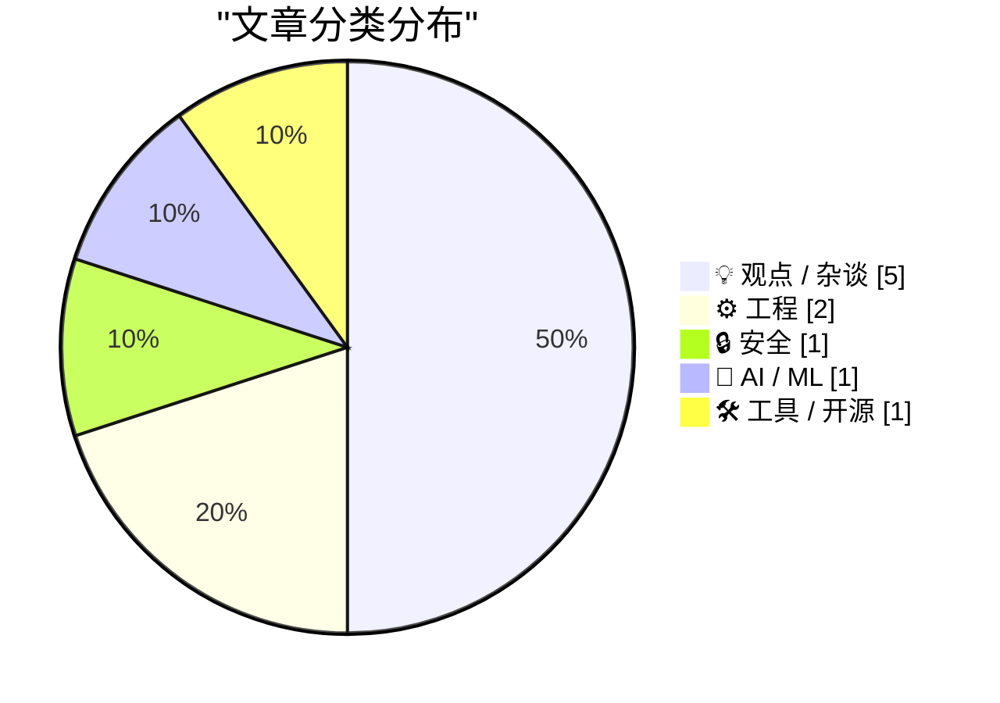
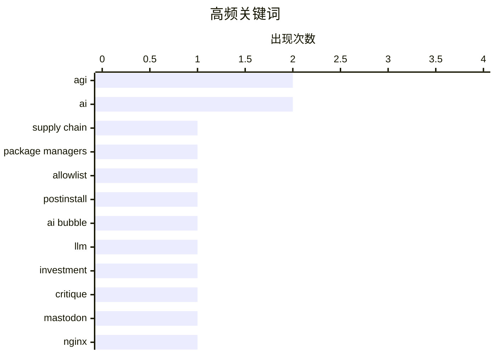

# 📰 AI 博客每日精选 — 2026-06-06

> 来自 Karpathy 推荐的 92 个顶级技术博客，AI 精选 Top 10

## 📝 今日看点

今天技术圈的主线，一边是 AI 叙事继续升温，一边是质疑声同步加码：从大厂并购传闻、AGI 时间表到“AI 泡沫”批判，行业显然正处在资本热情、技术想象与现实能力的激烈拉扯中。与此同时，AI 也在重塑开发者生态，PR、作品集与“会不会用 AI”正越来越像新的职业筛选信号。另一条清晰趋势是基础设施与供应链安全回归硬核工程本位，围绕安装脚本执行风险、反向代理缓存边界、远程运维与网络协议细节的讨论，说明行业正在重新强调系统可靠性与可控性。

---

## 🏆 今日必读

🥇 **安装脚本允许列表**

[Install-script allowlists](https://nesbitt.io/2026/06/05/install-script-allowlists.html) — nesbitt.io · 11 小时前 · 🔒 安全

> 包管理器中的依赖常会在安装阶段默认执行代码，例如 npm 的 postinstall、Setuptools 的 setup.py、CPAN 的 Makefile.PL、RPM scriptlet、Conda post-link 和 Debian postinst；而另一类工具改用按包显式放行的允许列表，或通过全局沙箱、签名验证来控制风险。文中区分了几种机制的边界：按包允许列表决定哪些依赖能运行安装脚本，全局沙箱限制脚本可访问的范围，签名与身份校验只决定哪些制品可以被安装，并不约束后续代码行为。npm 在 11.10.0（2026 年 2 月）加入 package.json 的 allowScripts 字段以及 npm approve-scripts、npm deny-scripts，但 11.x 仍是提示性模式，未审核脚本依然会执行，只在安装结束后汇总，并预告未来版本会改为硬阻止。pnpm v10（2025 年 1 月）开始默认阻止安装脚本，从 onlyBuiltDependencies / neverBuiltDependencies 读取允许列表，v11 将其合并为 allowBuilds，并以 dangerouslyAllowAllBuilds 作为放开开关；strictDepBuilds 在 v11 默认为 true，未列入清单的包会安装失败。Yarn Classic 只有全局 --ignore-scripts，Yarn Berry 可通过 .yarnrc.yml 的 enableScripts: false 配合 dependenciesMeta[].built: true 按包放行，@lavamoat/allow-scripts 则为 Yarn、npm 和 pnpm 提供统一的补充方案。

💡 **为什么值得读**: 值得读在于它把 npm、pnpm、Yarn 等生态里“安装脚本如何放行”这件事拆成可直接对照的机制与版本差异，便于快速判断各工具的安全默认值和可用配置。

🏷️ supply chain, package managers, allowlist, postinstall

🥈 **付费：AI 泡沫批判指南 3.0**

[Premium: The Hater's Guide To The AI Bubble 3.0](https://www.wheresyoured.at/premium-the-haters-guide-to-the-ai-bubble-3-0/) — wheresyoured.at · 7 小时前 · 💡 观点 / 杂谈

> 文章将 AI 泡沫描述为一场由市场、媒体与行业话术共同放大的金融与认知操纵，并质疑当前围绕生成式 AI 的主流叙事。作者承认 LLM 确实存在且“能做一些事”，但强调它们并未实现 Dario Amodei 所宣称的那类能力，例如“消灭 50% 白领工作”，而且四年过去，技术主体仍停留在早期能力上，只是做了局部改进。文中认为 Sam Altman、Dario Amodei 等人不断谈论 AI 将来“可能”“理论上能够”做什么，回避它当下实际表现；如果只看现实，AI 业务持续亏损、缺乏可衡量的 ROI，市场却把数据中心资本开支误当成 AI 产业繁荣。作者还给出具体判断：89% 以上的 AI 收入和 90% 以上的算力需求来自 OpenAI 与 Anthropic，而企业已经开始限制 AI 支出，多家公司在几个月内就耗尽全年 token 预算，且 Anthropic 和 OpenAI 直到今年第一季度才把企业计费切换到按 token 计费。结论是，整个 AI 行业的实际收入即便把 OpenAI、Google、Microsoft、Amazon 和 Anthropic 都算上，也才刚接近 1000 亿美元，远不足以支撑当前被资本和舆论推高的宏大预期。

💡 **为什么值得读**: 值得读，因为它用明确的数字、计费机制和企业支出现实，系统性拆解了“AI 繁荣”叙事与真实商业回报之间的落差。

🏷️ AI bubble, LLM, investment, critique

🥉 **为 Mastodon 反向代理做激进缓存：该缓存什么、绝不能缓存什么，以及为什么内容协商最终会坑你**

[Aggressive caching for a Mastodon reverse proxy: what to cache, what to never cache, and why content negotiation will eventually betray you](https://it-notes.dragas.net/2026/06/05/aggressive_caching_for_a_mastodon_reverse_proxy/) — it-notes.dragas.net · 14 小时前 · ⚙️ 工程

> 主题聚焦于为 Mastodon 实例前置反向代理缓存时，如何划分可缓存与不可缓存内容，以及如何避免内容协商导致的错误响应。作者在 mastodon.bsd.cafe 上使用 FreeBSD 上的 nginx 做生产代理，延续“让反向代理吸收重复且公开的请求负载，不把无意义的工作打到应用服务器”的思路，但指出 Mastodon 比 snac 更复杂，因为背后有 Puma、Sidekiq、更多端点、流式传输和联邦交互模式。最关键的问题是同一 URL 会面向不同客户端返回 HTML、ActivityPub JSON，或 API 用的普通 JSON，因此代理如果只按 URL 做缓存，最终会把错误格式返回给浏览器或远端实例。全文的配置思路都围绕这一点展开，包括缓存键、变体区分、绕过规则和诊断头；同时它假定 AUTHORIZED_FETCH 已关闭，因为开启 secure mode 后，ActivityPub GET 可能因请求 actor 不同而返回不同内容，盲目缓存既低效也可能形成缓存投毒面。作者还引用了已在 Mastodon 4.3.19、4.4.13 和 4.5.6 修复的 CVE-2026-25540，说明 actor 相关响应被错误缓存并非理论问题。

💡 **为什么值得读**: 值得读在于它把 Mastodon 作为“网站 + API + ActivityPub 服务器共用同一 URL 空间”的缓存难题讲得很具体，能帮助运维在提升性能的同时避开格式错配和安全风险。

🏷️ Mastodon, nginx, caching, content negotiation

---

## 📊 数据概览

| 扫描源 | 抓取文章 | 时间范围 | 精选 |
|:---:|:---:|:---:|:---:|
| 88/92 | 2569 篇 → 23 篇 | 24h | **10 篇** |

### 分类分布



### 高频关键词



<details>
<summary>📈 纯文本关键词图（终端友好）</summary>

```
agi              │ ████████████████████ 2
ai               │ ████████████████████ 2
supply chain     │ ██████████░░░░░░░░░░ 1
package managers │ ██████████░░░░░░░░░░ 1
allowlist        │ ██████████░░░░░░░░░░ 1
postinstall      │ ██████████░░░░░░░░░░ 1
ai bubble        │ ██████████░░░░░░░░░░ 1
llm              │ ██████████░░░░░░░░░░ 1
investment       │ ██████████░░░░░░░░░░ 1
critique         │ ██████████░░░░░░░░░░ 1
```

</details>

### 🏷️ 话题标签

**agi**(2) · **ai**(2) · **supply chain**(1) · package managers(1) · allowlist(1) · postinstall(1) · ai bubble(1) · llm(1) · investment(1) · critique(1) · mastodon(1) · nginx(1) · caching(1) · content negotiation(1) · github(1) · pull-requests(1) · hiring(1) · ai-generated-code(1) · anthropic(1) · recursive self-improvement(1)

---

## 💡 观点 / 杂谈

### 1. 付费：AI 泡沫批判指南 3.0

[Premium: The Hater's Guide To The AI Bubble 3.0](https://www.wheresyoured.at/premium-the-haters-guide-to-the-ai-bubble-3-0/) — **wheresyoured.at** · 7 小时前 · ⭐ 23/30

> 文章将 AI 泡沫描述为一场由市场、媒体与行业话术共同放大的金融与认知操纵，并质疑当前围绕生成式 AI 的主流叙事。作者承认 LLM 确实存在且“能做一些事”，但强调它们并未实现 Dario Amodei 所宣称的那类能力，例如“消灭 50% 白领工作”，而且四年过去，技术主体仍停留在早期能力上，只是做了局部改进。文中认为 Sam Altman、Dario Amodei 等人不断谈论 AI 将来“可能”“理论上能够”做什么，回避它当下实际表现；如果只看现实，AI 业务持续亏损、缺乏可衡量的 ROI，市场却把数据中心资本开支误当成 AI 产业繁荣。作者还给出具体判断：89% 以上的 AI 收入和 90% 以上的算力需求来自 OpenAI 与 Anthropic，而企业已经开始限制 AI 支出，多家公司在几个月内就耗尽全年 token 预算，且 Anthropic 和 OpenAI 直到今年第一季度才把企业计费切换到按 token 计费。结论是，整个 AI 行业的实际收入即便把 OpenAI、Google、Microsoft、Amazon 和 Anthropic 都算上，也才刚接近 1000 亿美元，远不足以支撑当前被资本和舆论推高的宏大预期。

🏷️ AI bubble, LLM, investment, critique

---

### 2. 为什么到处都是 PR？

[Why all the PRs?](https://idiallo.com/blog/why-all-the-prs?src=feed) — **idiallo.com** · 7 分钟前 · ⭐ 22/30

> AI 生成的 PR 被视为一种求职信号，反映出开发者正迎合“用可见作品证明能力”的招聘筛选方式。作者回顾了从个人网站、GitHub 项目到开源贡献和 GitHub stars 被当作候选人指标的演变，也指出招聘中真正长期活跃且高质量的 GitHub 资料一直很少见。多数普通候选人的链接往往只是为求职临时搭建的网站、学校作业或样板代码，而真正有分量的公开贡献需要时间、精力和经验积累。作者举了一个 Go 身份认证 issue 的例子：一名长期沉寂的账号一年内冲到 4000 次贡献，并在旧讨论串中集中发评论和 PR，明显是在放大 GitHub 指标。结论是，AI 让“刷贡献”变得更容易，当越来越多人用这种方式优化 GitHub 数据时，这类公开活动作为招聘信号的辨识度和可信度都会下降。

🏷️ GitHub, pull-requests, hiring, AI-generated-code

---

### 3. 没必要对 Anthropic 的新博客感到恐慌

[No need to panic about Anthropic’s new blog](https://garymarcus.substack.com/p/no-need-to-panic-about-anthropics) — **garymarcus.substack.com** · 22 小时前 · ⭐ 22/30

> 焦点集中在 Anthropic 关于 Claude 正在加速 AI 开发、可能通向递归式自我改进的说法，以及这种表述是否足以引发对 AGI 风险的恐慌。Gary Marcus 认为，Anthropic 展示的主要是系统写代码能力的明显进步，属于人类可利用的递归式自我改进（RSI），而不是机器能够自主完成人类所有任务的 AGI。文章强调，当前结果本质上是“更快的编码”和部分代码优化，仍处于人类控制之下；要走向 AGI，还需要新的想法，而不只是继续做代码优化。作者同时提到另一则“好消息”：S&P 500 没有修改纳入规则，因此 SpaceX 不会被更快、以更少限制地纳入指数。结论是，Anthropic 的博客提出了值得认真考虑的放缓 AI 研究理由，但现有证据不足以说明失控式 AGI 已经迫在眉睫。

🏷️ Anthropic, AGI, recursive self-improvement, Claude

---

### 4. AI 热衷者在与时间赛跑，AI 怀疑者在与熵赛跑

[AI enthusiasts are in a race against time, AI skeptics are in a race against entropy](https://simonwillison.net/2026/Jun/4/ai-enthusiasts-ai-skeptics/#atom-everything) — **simonwillison.net** · 23 小时前 · ⭐ 21/30

> 团队在采用 AI 开发软件时，AI 热衷者与 AI 怀疑者面对的是两种不同但同样真实的生存压力。支持积极拥抱 AI 的一方认为，已经出现了由深度使用 AI 带来的真实、非想象性的能力跃迁，这不是可以等尘埃落定再观望的普通技术周期，落后的团队可能在竞争中被淘汰。持怀疑态度的一方则担心，代码交付速度快到工程师来不及阅读、且没人掌握全局时，会持续透支多年建立的信任账户，导致可靠性下降、机构知识流失、系统无人真正理解，值班压力也会不断恶化。两种立场都指向“存在性威胁”，问题既是领导力挑战，也是工程挑战。真正的关键在于两派之间缺少天然的反馈回路，因此需要刻意设计反馈机制，去弥合双方对现实认知的裂缝。

🏷️ AI, engineering-management, software-quality, feedback-loops

---

### 5. 德米斯·哈萨比斯爵士对阵德米斯·哈萨比斯爵士

[Sir Demis Hassabis vs Sir Demis Hassabis](https://garymarcus.substack.com/p/sir-demis-hassabis-vs-sir-demis-hassabis) — **garymarcus.substack.com** · 8 小时前 · ⭐ 20/30

> 文章聚焦德米斯·哈萨比斯对 AGI 时间表前后不一致的公开表述。作者指出，哈萨比斯在斯坦福的说法将 AGI 时间压缩到 2030 年前后一年，而他在 2026 年 1 月达沃斯的说法则是 2031 至 2036 年。文中还引用了他在达沃斯对 AGI 的定义：AGI 不应沦为营销术语，而应是能够展现人类全部认知能力的系统，包括提出突破性科学猜想、形成类似广义相对论的新物理理论、创造全新艺术风格，以及具备身体智能。按照这一定义，他明确表示当下系统“远远谈不上”AGI，当前能力与跨领域创造力和机器人能力之间仍有明显距离。文章借这两套时间线的对照，质疑 AGI 预测口径为何在短时间内发生变化。

🏷️ AGI, Demis Hassabis, timeline, AI

---

## ⚙️ 工程

### 6. 为 Mastodon 反向代理做激进缓存：该缓存什么、绝不能缓存什么，以及为什么内容协商最终会坑你

[Aggressive caching for a Mastodon reverse proxy: what to cache, what to never cache, and why content negotiation will eventually betray you](https://it-notes.dragas.net/2026/06/05/aggressive_caching_for_a_mastodon_reverse_proxy/) — **it-notes.dragas.net** · 14 小时前 · ⭐ 23/30

> 主题聚焦于为 Mastodon 实例前置反向代理缓存时，如何划分可缓存与不可缓存内容，以及如何避免内容协商导致的错误响应。作者在 mastodon.bsd.cafe 上使用 FreeBSD 上的 nginx 做生产代理，延续“让反向代理吸收重复且公开的请求负载，不把无意义的工作打到应用服务器”的思路，但指出 Mastodon 比 snac 更复杂，因为背后有 Puma、Sidekiq、更多端点、流式传输和联邦交互模式。最关键的问题是同一 URL 会面向不同客户端返回 HTML、ActivityPub JSON，或 API 用的普通 JSON，因此代理如果只按 URL 做缓存，最终会把错误格式返回给浏览器或远端实例。全文的配置思路都围绕这一点展开，包括缓存键、变体区分、绕过规则和诊断头；同时它假定 AUTHORIZED_FETCH 已关闭，因为开启 secure mode 后，ActivityPub GET 可能因请求 actor 不同而返回不同内容，盲目缓存既低效也可能形成缓存投毒面。作者还引用了已在 Mastodon 4.3.19、4.4.13 和 4.5.6 修复的 CVE-2026-25540，说明 actor 相关响应被错误缓存并非理论问题。

🏷️ Mastodon, nginx, caching, content negotiation

---

### 7. URL 中的 IPv6 zone 是个错误

[IPv6 zones in URLs are a mistake](https://xeiaso.net/notes/2026/ipv6-zones-go-url/) — **xeiaso.net** · 23 小时前 · ⭐ 20/30

> IPv6 的链路本地地址会落在 fe80:: 范围内，当一台机器有多个网络接口时，需要用 scope/zone 来区分同样的链路本地地址，Linux 通常使用接口名，Windows 使用接口 ID。把这类地址放进 host:port 时，需要写成类似 [fe80::4%eth0]:80 的形式，但放进 URL 后，Go 的 net/url 解析 http://[fe80::4%eth0]:80 会因把 %et 视为非法转义而报错。解决方式是把 zone 里的百分号再做一次百分号编码，写成 http://[fe80::4%25eth0]:80，解析后 Hostname() 才会得到 fe80::4%eth0。文中还指出，RFC 6874 实际规定了 IPv6addrz 应使用 "%25" + ZoneID 的格式，而 Go 的行为因此是符合规范的；类似问题也出现在 nginx、Python requests 等其他框架和库中。作者的结论是，这种在 URL 中处理 IPv6 zone 的方式非常糟糕，但目前要让 Anubis 指向这类地址，就必须接受对 % 进行编码的做法。

🏷️ IPv6, URL, networking, standards

---

## 🔒 安全

### 8. 安装脚本允许列表

[Install-script allowlists](https://nesbitt.io/2026/06/05/install-script-allowlists.html) — **nesbitt.io** · 11 小时前 · ⭐ 25/30

> 包管理器中的依赖常会在安装阶段默认执行代码，例如 npm 的 postinstall、Setuptools 的 setup.py、CPAN 的 Makefile.PL、RPM scriptlet、Conda post-link 和 Debian postinst；而另一类工具改用按包显式放行的允许列表，或通过全局沙箱、签名验证来控制风险。文中区分了几种机制的边界：按包允许列表决定哪些依赖能运行安装脚本，全局沙箱限制脚本可访问的范围，签名与身份校验只决定哪些制品可以被安装，并不约束后续代码行为。npm 在 11.10.0（2026 年 2 月）加入 package.json 的 allowScripts 字段以及 npm approve-scripts、npm deny-scripts，但 11.x 仍是提示性模式，未审核脚本依然会执行，只在安装结束后汇总，并预告未来版本会改为硬阻止。pnpm v10（2025 年 1 月）开始默认阻止安装脚本，从 onlyBuiltDependencies / neverBuiltDependencies 读取允许列表，v11 将其合并为 allowBuilds，并以 dangerouslyAllowAllBuilds 作为放开开关；strictDepBuilds 在 v11 默认为 true，未列入清单的包会安装失败。Yarn Classic 只有全局 --ignore-scripts，Yarn Berry 可通过 .yarnrc.yml 的 enableScripts: false 配合 dependenciesMeta[].built: true 按包放行，@lavamoat/allow-scripts 则为 Yarn、npm 和 pnpm 提供统一的补充方案。

🏷️ supply chain, package managers, allowlist, postinstall

---

## 🤖 AI / ML

### 9. 再看苹果收购 Perplexity 的那些传闻

[Checking in on Perplexity](https://daringfireball.net/linked/2025/08/05/regarding-those-rumors-of-apple-pursuing-an-acquisition-of-perplexity) — **daringfireball.net** · 7 小时前 · ⭐ 21/30

> 围绕苹果可能收购 Perplexity AI 的传闻，信息源称苹果高管曾在早期阶段讨论过这一可能性，但尚未与 Perplexity 管理层谈判，且不一定会提出正式报价。相关背景是苹果希望为 AI 搜索做准备，并应对与 Google 每年约 200 亿美元的默认搜索合作面临美国反垄断压力的风险。作者认为，从苹果财报后的管理层表态来看，苹果似乎并不觉得自己必须通过大型收购来补齐这一领域能力。文章还指出，Perplexity 主要是在 OpenAI、Anthropic、Mistral、Google 和 xAI 等模型之上提供前端，并不自行开发或训练模型，因此收购它能给苹果带来的价值有限。作者最终判断这笔交易既缺乏明显战略收益，Perplexity 在 robots.txt 和伪装 user-agent 争议中的形象也与苹果文化不符，因此对传闻持明显怀疑态度。

🏷️ Perplexity, Apple, AI-search, acquisition

---

## 🛠 工具 / 开源

### 10. 我在家庭实验室里测试了所有 IP KVM

[I tested every IP KVM in my Homelab](https://www.jeffgeerling.com/blog/2026/i-tested-every-ip-kvm/) — **jeffgeerling.com** · 9 小时前 · ⭐ 21/30

> IP KVM 适合那些不能依赖远程桌面、VNC 或 SSH 的场景，尤其是在需要远程进入 BIOS、机器死机，甚至关机时仍要控制电脑的情况下。相比 HP iLO、Dell iDRAC 或 IPMI 这类服务器内建方案，独立 IP KVM 也适用于没有服务器主板的人，或者需要通过独立 GPU 而不是板载 VGA 接入的人。文中指出，这类设备近年随着 2017 年 PiKVM 出现而迅速增多，产品从不到 50 美元的基础款到带 PoE、HDMI passthrough、双向音频、电源控制、KVM 切换扩展和 5G 备份的高端型号都有覆盖。作者特别提醒 IP KVM 可能成为严重安全入口，甚至提到其中一台设备曾引来 FBI 上门，因此需要持续更新固件、谨慎选择厂商并尽量用防火墙隔离。对 PiKVM 的评价最明确：虽然 275 到 400 美元的价格偏高，但因其开源软件栈、1080p 60fps、HDMI passthrough 等能力，以及可自建方案，作者“100% 推荐”。

🏷️ IP-KVM, homelab, remote-access, hardware

---

*生成于 2026-06-06 07:07 | 扫描 88 源 → 获取 2569 篇 → 精选 10 篇*
*基于 [Hacker News Popularity Contest 2025](https://refactoringenglish.com/tools/hn-popularity/) RSS 源列表*
