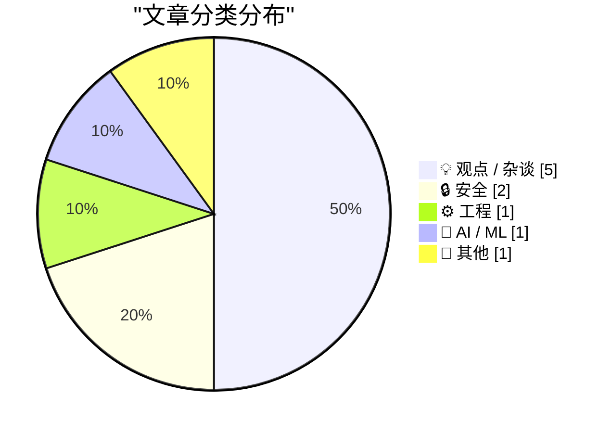
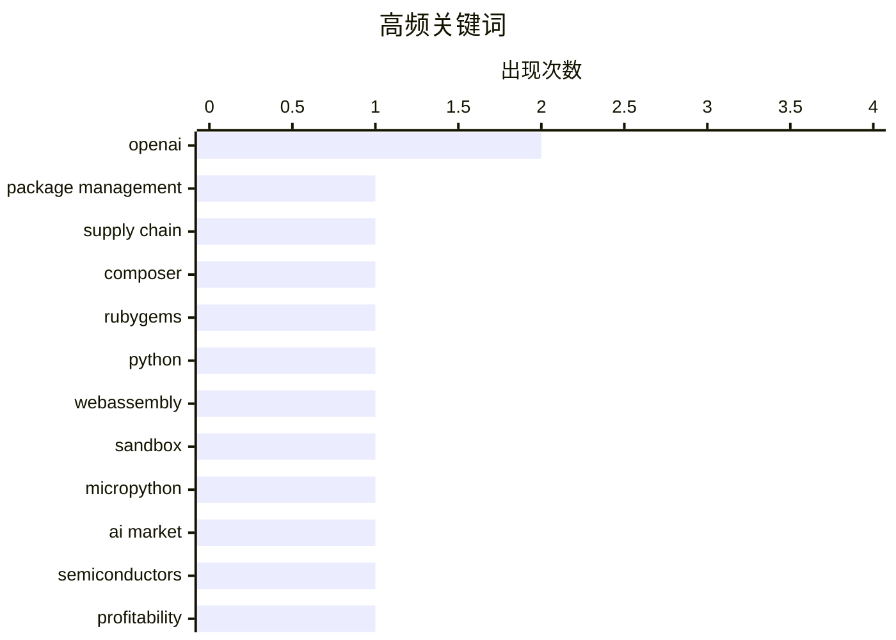

# 📰 AI 博客每日精选 — 2026-06-07

> 来自 Karpathy 推荐的 92 个顶级技术博客，AI 精选 Top 10

## 📝 今日看点

今日看点主要围绕 AI 叙事降温：多篇文章都在提醒，讨论 AI 不应停留在“万能机器”或末日恐慌上，而要回到商业可持续性、基础设施成本、治理责任与真实风险。与此同时，AI 安全也从抽象争论落到具体机制上，例如通过锁定出站通道减少提示注入造成的数据外泄，以及用 WebAssembly 构建更受限的代码执行沙箱。  另一条主线是技术如何影响人的自主性与判断力：无论是写作中保留“有益的困难”，还是警惕反对型社区滑向身份化敌意，核心都是避免把工具、立场或平台变成替自己思考的东西。开发者生态方面，包管理器和开源工具继续把供应链安全前移到解析、下载、信任和客户端准入环节，显示安全防护正在变得更默认、更制度化。最后，开普勒方程与贝塞尔函数的文章提供了一个安静但扎实的数学视角，提醒我们复杂问题有时需要耐心展开，而不是靠口号解决。

---

## 🏆 今日必读

🥇 **本周包管理动态：Bundler、Composer、Homebrew、NixOS 等更新汇总**

[This Week in Package Management: 6 June 2026](https://nesbitt.io/2026/06/06/this-week-in-package-management.html) — nesbitt.io · 13 小时前 · 🔒 安全

> 这期包管理周报集中梳理了多个生态的安全修复、供应链防护和版本发布。Ruby 生态中，Bundler 4.0.13 增加了可配置的版本冷却窗口，避免刚发布的恶意 gem 立刻被解析安装；RubyGems 同步修复了通过既有符号链接逃逸解包目录的问题。Composer 和 Private Packagist 的系列文章讨论了下载回退路径、旧版 Composer 的恶意包阻断，以及组织级强制客户端版本策略，反映出包管理器正在把供应链安全前移到解析、下载和客户端准入阶段。HexDocs 通过按包名拆分子域名来隔离文档页面，Homebrew 即将引入 Tap-Trust 机制，要求用户显式信任第三方 tap 后才执行其代码。发布部分还覆盖了 NixOS 26.05、Yarn、Hatch、Stack、Dependabot、mise、Windows Package Manager 等工具的新功能与兼容性变化，并附带了开源资助、SBOM 组件识别和可复现构建等相关文章与论文。

💡 **为什么值得读**: 它把多个语言和平台的包管理安全变化放在同一视角下，适合快速了解供应链防护正在如何落地。

🏷️ package management, supply chain, Composer, RubyGems

🥈 **用 MicroPython 和 WebAssembly 构建 Python 代码沙箱**

[Running Python code in a sandbox with MicroPython and WASM](https://simonwillison.net/2026/Jun/6/micropython-in-a-sandbox/#atom-everything) — simonwillison.net · 19 小时前 · ⚙️ 工程

> Simon Willison 介绍了他用 MicroPython 编译到 WebAssembly 来运行受限 Python 代码的最新实验，并发布了 alpha 包 micropython-wasm。文章的核心动机是为 Datasette、LLM、sqlite-utils 等支持插件的 Python 项目提供更安全的执行环境，避免插件拥有完整文件、网络和进程权限。他列出了理想沙箱需要满足的条件：易于通过 PyPI 安装、可限制 CPU 和内存、严格控制文件和网络访问、能安全暴露宿主函数，并且项目本身要可维护。作者认为 WebAssembly 比嵌入 JavaScript 引擎更适合这一场景，因为 wasmtime 的 Python 绑定维护活跃、支持二进制轮子，并且 WASM 天然适合能力受限的执行模型。由于 Pyodide 主要面向浏览器或 Node.js，他转向更轻量的 MicroPython，并借助 MicroPython 的 WASI 支持原型构建出能在 WASM 沙箱中执行 Python 的库。正文还说明了这个方案目前仍处于早期阶段，并讨论了它是否足够可信以及如何自己试用。

💡 **为什么值得读**: 这篇文章把插件安全、Python 沙箱和 WASM 实践串在一起，对需要在应用内执行不可信代码的开发者很有参考价值。

🏷️ Python, WebAssembly, sandbox, MicroPython

🥉 **AI 的“黑色星期五”：生成式 AI 泡沫正在承压**

[AI’s Black Friday](https://garymarcus.substack.com/p/ais-black-friday) — garymarcus.substack.com · 6 小时前 · 🤖 AI / ML

> Gary Marcus 将 2026 年 6 月初 AI 相关股票的大幅下跌称为“AI 的黑色星期五”，认为这暴露出生成式 AI 行业比外界想象中更脆弱。文章指出，芯片公司、GPU 租赁商和大型科技公司在市场抛售中受创明显，反映投资者开始质疑 AI 基础设施投入的回报。作者尤其批评美国政府可能入股 OpenAI 或其他 AI 公司，认为这更像是对缺乏盈利路径企业的变相救助，而不是正常投资。他还认为，如果美国政府持有 AI 公司股份，海外市场会像美国警惕华为一样警惕这些美国 AI 企业，从而加剧围绕 AI 的地缘政治分裂。文章还以 SpaceX/xAI 将大量 GPU 算力出租给 Google 和 Anthropic 为例，质疑此前囤积算力的公司是否真的找到了足够需求和商业用途。整体来看，作者的核心判断是：AI 行业的资本开支、商业回报和政治风险正在同时恶化，所谓“规模即一切”的叙事正在受到挑战。

💡 **为什么值得读**: 这篇文章值得读，因为它从股市、政府介入、算力供需和国际信任四个角度审视生成式 AI 热潮的系统性风险。

🏷️ AI market, OpenAI, semiconductors, profitability

---

## 📊 数据概览

| 扫描源 | 抓取文章 | 时间范围 | 精选 |
|:---:|:---:|:---:|:---:|
| 88/92 | 2569 篇 → 16 篇 | 24h | **10 篇** |

### 分类分布



### 高频关键词



<details>
<summary>📈 纯文本关键词图（终端友好）</summary>

```
openai             │ ████████████████████ 2
package management │ ██████████░░░░░░░░░░ 1
supply chain       │ ██████████░░░░░░░░░░ 1
composer           │ ██████████░░░░░░░░░░ 1
rubygems           │ ██████████░░░░░░░░░░ 1
python             │ ██████████░░░░░░░░░░ 1
webassembly        │ ██████████░░░░░░░░░░ 1
sandbox            │ ██████████░░░░░░░░░░ 1
micropython        │ ██████████░░░░░░░░░░ 1
ai market          │ ██████████░░░░░░░░░░ 1
```

</details>

### 🏷️ 话题标签

**openai**(2) · **package management**(1) · **supply chain**(1) · composer(1) · rubygems(1) · python(1) · webassembly(1) · sandbox(1) · micropython(1) · ai market(1) · semiconductors(1) · profitability(1) · prompt injection(1) · data exfiltration(1) · lockdown mode(1) · ai governance(1) · critique(1) · policy(1) · labor(1) · llm(1)

---

## 💡 观点 / 杂谈

### 1. 批判“万能机器”：为什么 AI 讨论总被夸大叙事带偏

[Pluralistic: Criticizing the everything machine (06 Jun 2026)](https://pluralistic.net/2026/06/06/applied-counterescatology/) — **pluralistic.net** · 5 小时前 · ⭐ 21/30

> 文章批评当下关于 AI 的公共讨论被“万能机器”叙事绑架：支持者把 AI 描述成会改变一切、治愈癌症、解决气候危机的下一次工业革命，反对者有时也照单全收这些能力宣称，再围绕失业、统治或失控展开恐慌式批判。作者认为，这种“Gish Gallop”式的议题轰炸让严肃讨论变得几乎不可能，因为每个问题都需要分开检验，而不是在十几分钟或几百字里一并回答。文章把重点拉回更基础的商业和治理问题：AI 服务目前高度依赖补贴，单位经济性糟糕，客户的“收益”往往建立在供应商持续亏钱的前提上。作者指出，在谈论未来 AI 能力之前，应先问谁会持续为这些能力买单、亏损企业能否长期支撑基础设施，以及数据中心等现实成本最终由谁承担。整体上，文章主张对 AI 既不要迷信也不要“批判式炒作”，而应逐项拆解其经济可行性、劳动影响、公共治理和环境代价。

🏷️ AI governance, critique, policy, labor

---

### 2. “反对某物”的共同体如何滑向敌意

[Communities of Not](https://lucumr.pocoo.org/2026/6/6/communities-of-not/) — **lucumr.pocoo.org** · 23 小时前 · ⭐ 21/30

> Armin Ronacher 讨论了围绕“拒绝某物”形成的社区为何容易把反对本身变成身份认同。文章指出，丁克、反汽车或质疑 LLM 的社区本可以围绕自主选择、城市安全、劳动未来和代码质量等议题展开建设性讨论，但当被拒绝的对象始终占据中心位置时，批评常会滑向身份审查和群体羞辱。作者举例说，当某个被社区视为同路人的公众人物改变选择，例如成为父母、买车或尝试 LLM，社区往往会把这理解为背叛，并通过断章取义和围攻来惩罚对方。作者并不认为人们应该停止关注这些议题，因为汽车、孩子和 LLM 确实会影响不选择它们的人；问题在于，正当抵抗不能成为网络暴力的借口。文章最后提醒读者放慢反应、降低冲突、避免总是采用最灾难化的解读，并警惕把否定态度变成自我身份。

🏷️ LLM, community, developer culture, criticism

---

### 3. Anthropic 并没有真正呼吁暂停 AI 开发

[No, Anthropic did not call for a pause on AI development](https://garymarcus.substack.com/p/no-anthropic-did-not-call-for-a-pause) — **garymarcus.substack.com** · 21 小时前 · ⭐ 20/30

> Gary Marcus 反驳了一些媒体标题对 Anthropic 立场的解读：Anthropic 并未真正要求暂停 AI 开发。作者认为，Anthropic 的表述更像是在提出一个“可讨论的选项”，而不是公司准备采取的实际行动。文章指出，这种说法让 Anthropic 同时获得谨慎负责的形象，又保留继续快速推进模型开发的空间。Marcus 还批评其可能借“最不谨慎的参与者”或中国竞争压力作为继续前进的理由。整体来看，文章把 Anthropic 的表态视为一种成本很低、时机精确的公关修辞，而非实质性政策转向。

🏷️ Anthropic, AI policy, Gary Marcus, IPO

---

### 4. 追求有益的困难

[In pursuit of desirable difficulties](https://www.joanwestenberg.com/in-pursuit-of-desirable-difficulties/) — **joanwestenberg.com** · 21 小时前 · ⭐ 19/30

> 文章借心理学家 Robert Bjork 的“有益的困难”概念，说明学习往往不是在省力时发生，而是在努力提取、辨析和修正中真正巩固。作者把这一原则延伸到写作：亲自和句子、论证、措辞较劲，能让写作者理解文本的结构、薄弱处和取舍。相反，如果机器迅速交出一段看似漂亮的文字，写作者可能没有经历判断和打磨的过程，却误以为作品已经完成。作者并不反对消除无意义的苦工，也承认工具有价值；关键在于区分“建立判断力的困难”和“纯粹消耗人的杂务”。文章提醒写作者，在发布一段光滑但几乎未经自己决策的文字前，应先问清楚自己到底参与了哪些实质判断。

🏷️ writing, AI assistance, learning, creativity

---

### 5. 我们的大战是一场精神之战

[Our Great War is a Spiritual War](https://geohot.github.io//blog/jekyll/update/2026/06/06/our-great-war.html) — **geohot.github.io** · 16 小时前 · ⭐ 17/30

> 作者把当代技术与 AI 的核心风险描述为一场关于“自主”与“被管理”的精神冲突。他认为，许多人选择中心化系统和被安排好的现实，是因为它们提供便利、安全和舒适；但当技术消除工作、风险和现实互动等摩擦后，过度依赖这些系统会让人失去主体性。文章批评一种由组织或平台代管个人决策循环的未来，认为那会把人变成没有目的、没有退出能力的“新封建”附庸。作者强调，真正危险的 AI 场景不是某个单点故障，而是一个善意包装下的总体化控制系统。最后，他呼吁读者审视自己正在建设的是增强个人主权的技术，还是诱导人进一步依赖的技术。

🏷️ centralization, autonomy, technology, society

---

## 🔒 安全

### 6. 本周包管理动态：Bundler、Composer、Homebrew、NixOS 等更新汇总

[This Week in Package Management: 6 June 2026](https://nesbitt.io/2026/06/06/this-week-in-package-management.html) — **nesbitt.io** · 13 小时前 · ⭐ 25/30

> 这期包管理周报集中梳理了多个生态的安全修复、供应链防护和版本发布。Ruby 生态中，Bundler 4.0.13 增加了可配置的版本冷却窗口，避免刚发布的恶意 gem 立刻被解析安装；RubyGems 同步修复了通过既有符号链接逃逸解包目录的问题。Composer 和 Private Packagist 的系列文章讨论了下载回退路径、旧版 Composer 的恶意包阻断，以及组织级强制客户端版本策略，反映出包管理器正在把供应链安全前移到解析、下载和客户端准入阶段。HexDocs 通过按包名拆分子域名来隔离文档页面，Homebrew 即将引入 Tap-Trust 机制，要求用户显式信任第三方 tap 后才执行其代码。发布部分还覆盖了 NixOS 26.05、Yarn、Hatch、Stack、Dependabot、mise、Windows Package Manager 等工具的新功能与兼容性变化，并附带了开源资助、SBOM 组件识别和可复现构建等相关文章与论文。

🏷️ package management, supply chain, Composer, RubyGems

---

### 7. OpenAI 推出 ChatGPT「锁定模式」以降低提示注入导致的数据外泄风险

[OpenAI Help: Lockdown Mode](https://simonwillison.net/2026/Jun/5/openai-help-lockdown-mode/#atom-everything) — **simonwillison.net** · 23 小时前 · ⭐ 22/30

> OpenAI 的 Lockdown Mode 已开始向符合条件的个人账号和自助式 ChatGPT Business 账号推出，目标是限制可能把敏感数据传给攻击者的出站网络请求。该功能并不能阻止提示注入内容进入 ChatGPT，例如网页缓存或上传文件中的恶意指令仍可能影响回答行为或准确性。Simon Willison 认为它针对的是所谓“致命三要素”中的数据外泄通道：当模型同时接触私有数据、不可信内容和可传输数据的出口时，风险会显著上升。锁定模式的价值在于用相对确定性的机制切断外泄路径，而不是依赖同样可能被攻击诱导的 AI 判断。文章也指出，这一功能的存在意味着 ChatGPT 默认设置下并不能对高度针对性的数据外泄攻击提供强保护。OpenAI CISO 补充称，该模式主要面向高风险用户，启用后会牺牲部分功能和便利性。

🏷️ OpenAI, prompt injection, data exfiltration, Lockdown Mode

---

## ⚙️ 工程

### 8. 用 MicroPython 和 WebAssembly 构建 Python 代码沙箱

[Running Python code in a sandbox with MicroPython and WASM](https://simonwillison.net/2026/Jun/6/micropython-in-a-sandbox/#atom-everything) — **simonwillison.net** · 19 小时前 · ⭐ 25/30

> Simon Willison 介绍了他用 MicroPython 编译到 WebAssembly 来运行受限 Python 代码的最新实验，并发布了 alpha 包 micropython-wasm。文章的核心动机是为 Datasette、LLM、sqlite-utils 等支持插件的 Python 项目提供更安全的执行环境，避免插件拥有完整文件、网络和进程权限。他列出了理想沙箱需要满足的条件：易于通过 PyPI 安装、可限制 CPU 和内存、严格控制文件和网络访问、能安全暴露宿主函数，并且项目本身要可维护。作者认为 WebAssembly 比嵌入 JavaScript 引擎更适合这一场景，因为 wasmtime 的 Python 绑定维护活跃、支持二进制轮子，并且 WASM 天然适合能力受限的执行模型。由于 Pyodide 主要面向浏览器或 Node.js，他转向更轻量的 MicroPython，并借助 MicroPython 的 WASI 支持原型构建出能在 WASM 沙箱中执行 Python 的库。正文还说明了这个方案目前仍处于早期阶段，并讨论了它是否足够可信以及如何自己试用。

🏷️ Python, WebAssembly, sandbox, MicroPython

---

## 🤖 AI / ML

### 9. AI 的“黑色星期五”：生成式 AI 泡沫正在承压

[AI’s Black Friday](https://garymarcus.substack.com/p/ais-black-friday) — **garymarcus.substack.com** · 6 小时前 · ⭐ 24/30

> Gary Marcus 将 2026 年 6 月初 AI 相关股票的大幅下跌称为“AI 的黑色星期五”，认为这暴露出生成式 AI 行业比外界想象中更脆弱。文章指出，芯片公司、GPU 租赁商和大型科技公司在市场抛售中受创明显，反映投资者开始质疑 AI 基础设施投入的回报。作者尤其批评美国政府可能入股 OpenAI 或其他 AI 公司，认为这更像是对缺乏盈利路径企业的变相救助，而不是正常投资。他还认为，如果美国政府持有 AI 公司股份，海外市场会像美国警惕华为一样警惕这些美国 AI 企业，从而加剧围绕 AI 的地缘政治分裂。文章还以 SpaceX/xAI 将大量 GPU 算力出租给 Google 和 Anthropic 为例，质疑此前囤积算力的公司是否真的找到了足够需求和商业用途。整体来看，作者的核心判断是：AI 行业的资本开支、商业回报和政治风险正在同时恶化，所谓“规模即一切”的叙事正在受到挑战。

🏷️ AI market, OpenAI, semiconductors, profitability

---

## 📝 其他

### 10. 从开普勒方程到贝塞尔函数

[From Kepler to Bessel](https://www.johndcook.com/blog/2026/06/06/from-kepler-to-bessel/) — **johndcook.com** · 4 小时前 · ⭐ 17/30

> 文章解释了为什么贝塞尔函数的积分表示会自然出现在开普勒方程的求解中。开普勒方程把平均近点角 M、偏近点角 E 和轨道离心率 e 联系起来，但无法用初等函数直接把 E 表示为 M 和 e 的函数。除了迭代法和牛顿法，作者介绍了另一种思路：把 E−M 展开成正弦傅里叶级数，从而得到一个可重复用于不同 M 值的表达式。由于 E−M 在区间端点 0 和 π 都为零，正弦级数展开很自然。推导傅里叶系数时，通过分部积分和代入开普勒方程，最终出现了与贝塞尔函数定义相同的积分形式。

🏷️ Kepler, Bessel, mathematics, orbital mechanics

---

*生成于 2026-06-07 07:08 | 扫描 88 源 → 获取 2569 篇 → 精选 10 篇*
*基于 [Hacker News Popularity Contest 2025](https://refactoringenglish.com/tools/hn-popularity/) RSS 源列表*
