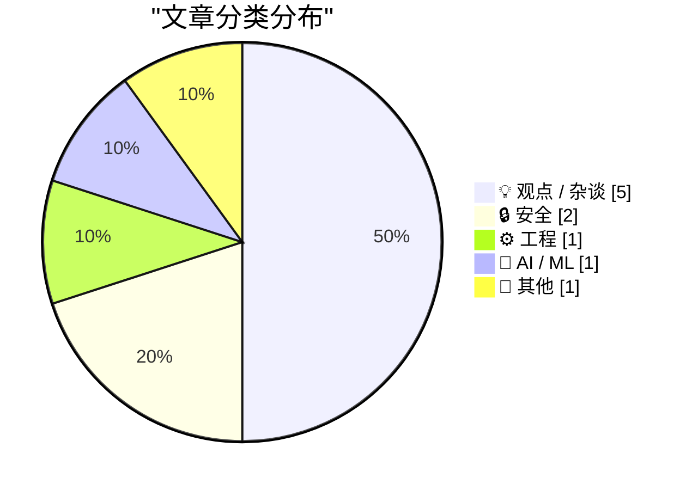
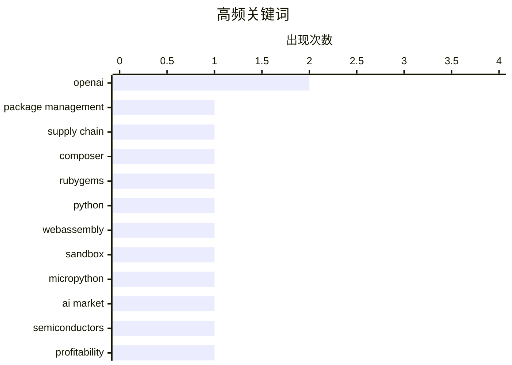

# 📰 AI 博客每日精选 — 2026-06-07

> 来自 Karpathy 推荐的 92 个顶级技术博客，AI 精选 Top 10

## 🏆 今日必读

🥇 **This Week in Package Management: 6 June 2026**

[This Week in Package Management: 6 June 2026](https://nesbitt.io/2026/06/06/this-week-in-package-management.html) — nesbitt.io · 13 小时前 · 🔒 安全

> Third week of the roundup, built from the package manager OPML feed collection and whatever I’ve posted or boosted on Mastodon . Five new project blog feeds and the NixOS announcements feed landed in 

🏷️ package management, supply chain, Composer, RubyGems

🥈 **Running Python code in a sandbox with MicroPython and WASM**

[Running Python code in a sandbox with MicroPython and WASM](https://simonwillison.net/2026/Jun/6/micropython-in-a-sandbox/#atom-everything) — simonwillison.net · 19 小时前 · ⚙️ 工程

> Simon Willison’s Weblog Subscribe Sponsored by: AWS &mdash; If you're building with AI, AWS Summit NYC on June 17 is the room you want to be in. 200+ sessions. Totally free. Register here Running Pyth

🏷️ Python, WebAssembly, sandbox, MicroPython

🥉 **AI’s Black Friday**

[AI’s Black Friday](https://garymarcus.substack.com/p/ais-black-friday) — garymarcus.substack.com · 6 小时前 · 🤖 AI / ML

> AI’s Black Friday Some thoughts on what just happened Gary Marcus Jun 06, 2026 225 69 35 Share The GenAI industry may be in worse shape than people realize. Posted Thursday night , before all the news

🏷️ AI market, OpenAI, semiconductors, profitability

---

## 📊 数据概览

| 扫描源 | 抓取文章 | 时间范围 | 精选 |
|:---:|:---:|:---:|:---:|
| 88/92 | 2569 篇 → 16 篇 | 24h | **10 篇** |

### 分类分布



### 高频关键词



<details>
<summary>📈 纯文本关键词图（终端友好）</summary>

```
openai             │ ████████████████████ 2
package management │ ██████████░░░░░░░░░░ 1
supply chain       │ ██████████░░░░░░░░░░ 1
composer           │ ██████████░░░░░░░░░░ 1
rubygems           │ ██████████░░░░░░░░░░ 1
python             │ ██████████░░░░░░░░░░ 1
webassembly        │ ██████████░░░░░░░░░░ 1
sandbox            │ ██████████░░░░░░░░░░ 1
micropython        │ ██████████░░░░░░░░░░ 1
ai market          │ ██████████░░░░░░░░░░ 1
```

</details>

### 🏷️ 话题标签

**openai**(2) · **package management**(1) · **supply chain**(1) · composer(1) · rubygems(1) · python(1) · webassembly(1) · sandbox(1) · micropython(1) · ai market(1) · semiconductors(1) · profitability(1) · prompt injection(1) · data exfiltration(1) · lockdown mode(1) · ai governance(1) · critique(1) · policy(1) · labor(1) · llm(1)

---

## 💡 观点 / 杂谈

### 1. Pluralistic: Criticizing the everything machine (06 Jun 2026)

[Pluralistic: Criticizing the everything machine (06 Jun 2026)](https://pluralistic.net/2026/06/06/applied-counterescatology/) — **pluralistic.net** · 5 小时前 · ⭐ 21/30

> ->->->->->->->->->->->->->->->->->->->->->->->->->->->->-> Top Sources: None --> Today's links Criticizing the everything machine : It slices, it dices, it even makes paperclips! Hey look at this : De

🏷️ AI governance, critique, policy, labor

---

### 2. Communities of Not

[Communities of Not](https://lucumr.pocoo.org/2026/6/6/communities-of-not/) — **lucumr.pocoo.org** · 23 小时前 · ⭐ 21/30

> Armin Ronacher 's Thoughts and Writings blog archive projects travel talks about Communities of Not written on June 06, 2026 There is a strange thing that happens in communities that gather around abs

🏷️ LLM, community, developer culture, criticism

---

### 3. No, Anthropic did not call for a pause on AI development

[No, Anthropic did not call for a pause on AI development](https://garymarcus.substack.com/p/no-anthropic-did-not-call-for-a-pause) — **garymarcus.substack.com** · 21 小时前 · ⭐ 20/30

> No, Anthropic did not call for a pause on AI development Not really Gary Marcus Jun 06, 2026 158 99 14 Share So many headlines like these but did Anthropic actually call for a pause? No. Not really. R

🏷️ Anthropic, AI policy, Gary Marcus, IPO

---

### 4. In pursuit of desirable difficulties

[In pursuit of desirable difficulties](https://www.joanwestenberg.com/in-pursuit-of-desirable-difficulties/) — **joanwestenberg.com** · 21 小时前 · ⭐ 19/30

> 2026-06-06 // 2 min read In pursuit of desirable difficulties The psychologist Robert Bjork called them desirable difficulties. Learning sticks better when practice is made harder, rather than easier.

🏷️ writing, AI assistance, learning, creativity

---

### 5. Our Great War is a Spiritual War

[Our Great War is a Spiritual War](https://geohot.github.io//blog/jekyll/update/2026/06/06/our-great-war.html) — **geohot.github.io** · 16 小时前 · ⭐ 17/30

> I often come back to the question of why this is happening. Why do people want the centralized world? Why do people want the administered reality? Why do people want to be managed? Why do people not w

🏷️ centralization, autonomy, technology, society

---

## 🔒 安全

### 6. This Week in Package Management: 6 June 2026

[This Week in Package Management: 6 June 2026](https://nesbitt.io/2026/06/06/this-week-in-package-management.html) — **nesbitt.io** · 13 小时前 · ⭐ 25/30

> Third week of the roundup, built from the package manager OPML feed collection and whatever I’ve posted or boosted on Mastodon . Five new project blog feeds and the NixOS announcements feed landed in 

🏷️ package management, supply chain, Composer, RubyGems

---

### 7. OpenAI Help: Lockdown Mode

[OpenAI Help: Lockdown Mode](https://simonwillison.net/2026/Jun/5/openai-help-lockdown-mode/#atom-everything) — **simonwillison.net** · 23 小时前 · ⭐ 22/30

> OpenAI Help: Lockdown Mode . OpenAI first teased this in February , but now it's live and "rolling out to eligible personal accounts, including Free, Go, Plus, and Pro, and self-serve ChatGPT Business

🏷️ OpenAI, prompt injection, data exfiltration, Lockdown Mode

---

## ⚙️ 工程

### 8. Running Python code in a sandbox with MicroPython and WASM

[Running Python code in a sandbox with MicroPython and WASM](https://simonwillison.net/2026/Jun/6/micropython-in-a-sandbox/#atom-everything) — **simonwillison.net** · 19 小时前 · ⭐ 25/30

> Simon Willison’s Weblog Subscribe Sponsored by: AWS &mdash; If you're building with AI, AWS Summit NYC on June 17 is the room you want to be in. 200+ sessions. Totally free. Register here Running Pyth

🏷️ Python, WebAssembly, sandbox, MicroPython

---

## 🤖 AI / ML

### 9. AI’s Black Friday

[AI’s Black Friday](https://garymarcus.substack.com/p/ais-black-friday) — **garymarcus.substack.com** · 6 小时前 · ⭐ 24/30

> AI’s Black Friday Some thoughts on what just happened Gary Marcus Jun 06, 2026 225 69 35 Share The GenAI industry may be in worse shape than people realize. Posted Thursday night , before all the news

🏷️ AI market, OpenAI, semiconductors, profitability

---

## 📝 其他

### 10. From Kepler to Bessel

[From Kepler to Bessel](https://www.johndcook.com/blog/2026/06/06/from-kepler-to-bessel/) — **johndcook.com** · 4 小时前 · ⭐ 17/30

> The previous post very briefly said that the integral representation for Bessel functions was motived by solving Kepler’s equation. This post will go into more detail. Kepler’s equation There are mult

🏷️ Kepler, Bessel, mathematics, orbital mechanics

---

*生成于 2026-06-07 07:08 | 扫描 88 源 → 获取 2569 篇 → 精选 10 篇*
*基于 [Hacker News Popularity Contest 2025](https://refactoringenglish.com/tools/hn-popularity/) RSS 源列表*
