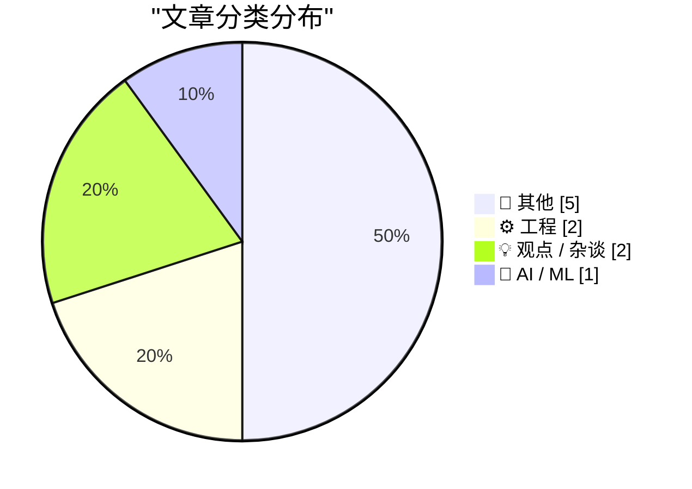
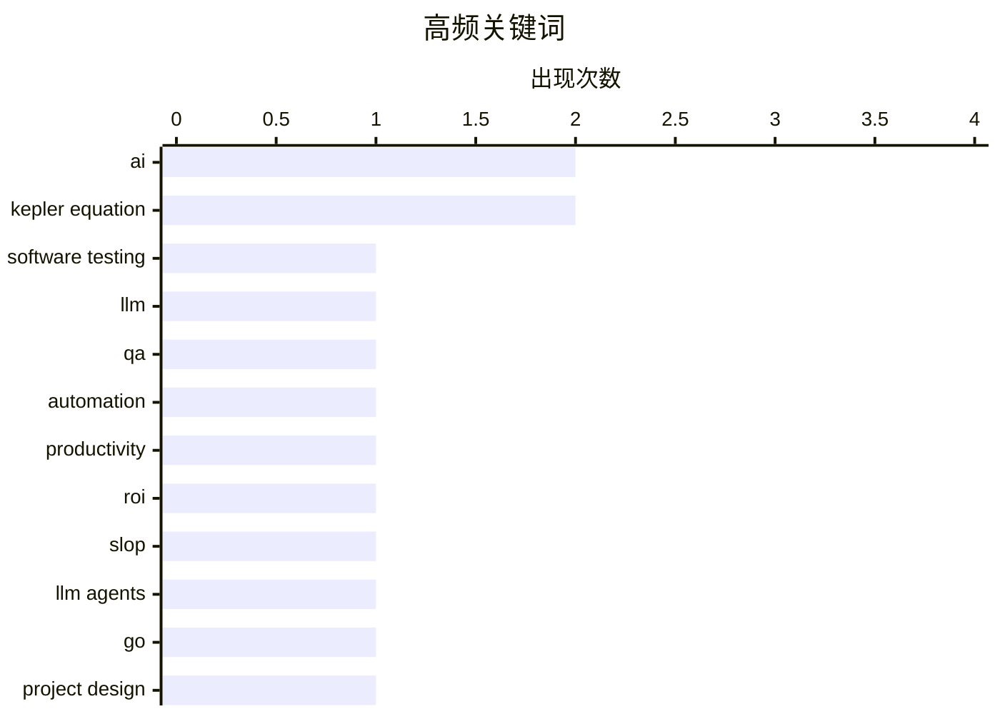

# 📰 AI 博客每日精选 — 2026-06-08

> 来自 Karpathy 推荐的 92 个顶级技术博客，AI 精选 Top 10

## 📝 今日看点

今天技术圈最鲜明的主线，是 AI 正从“能不能做”转向“做得值不值、做得靠不靠谱”：一边，LLM 在测试、QA 和新项目协作中展现出压缩开发周期的现实价值；另一边，围绕生产率泡沫、投资回报和内容泛滥的质疑也在同步升温。与此同时，技术讨论明显更关注“方法论落地”而非概念炒作，无论是把设计文档前置、让代理参与工程流程，还是在既有硬件与网络环境中做精细化改造，核心都指向更务实的系统工程。除此之外，从创作风格的法律边界到老计算设备与数学方法的再审视，也反映出今天的技术世界正在同时追问创新的边界、基础与代价。

---

## 🏆 今日必读

🥇 **软件测试的新纪元**

[A new era for software testing](http://antirez.com/news/168) — antirez.com · 13 小时前 · ⚙️ 工程

> 软件开发中，AI 自动编程在代码结构质量上未必优于最好的手写代码，但在某些项目里能把数月工作压缩到数周。相比写新代码时需要在质量与速度之间权衡，LLM 用于软件 QA 与测试被描述为一种几乎不牺牲质量、却能显著扩展测试能力的用法。传统测试套件覆盖局部测试、集成测试与人工 QA，但代码覆盖率无法覆盖所有状态，集成测试还常受时序、环境搭建和必须人工目检的输出限制。文中给出的做法是用一个 Markdown 文件把 AI agent 当作 QA 工程师，先检查相对已发布版本的新提交，再围绕受影响区域执行手工式验证，例如在 DwarfStar 中检查 MacBook A 与 MacBook B 间的分布式推理、一致性、GGUF 文件兼容性以及速度回退。结论是，把 LLM 叠加到现有测试方法之上，可以把过去因时间和后勤成本而难以执行的大量 QA 工作自动化，并让测试更有针对性地追踪回归。

💡 **为什么值得读**: 值得读在于它给出了把 LLM 真正嵌入发布前 QA 流程的具体方法，而不是停留在“让 AI 写代码”的泛泛讨论。

🏷️ software testing, LLM, QA, automation

🥈 **垃圾内容、生产率，以及为什么 AI 驱动的世界正迅速走向停滞**

[Slop, productivity, and why the AI-fueled world is going nowhere mighty fast](https://garymarcus.substack.com/p/slop-productivity-and-why-the-ai) — garymarcus.substack.com · 7 小时前 · 💡 观点 / 杂谈

> 焦点在于 AI 生成内容激增是否真正带来了经济价值与现实影响。文中引用 FT 的图表以及 MIT、麦肯锡、贝恩等研究，指出 AI 虽然制造了大量输出，符合很多人对“生产率”的直觉理解，但对许多公司的投资回报并不明显，也没有实质性改变 GDP。作者进一步举了图书、音乐、科学论文、网页内容和移动应用等例子：数量上升并不等于质量提升，图书销量甚至略有下降，也没有证据表明内容整体变得更好。文章还提到数学界对 AI 的担忧，《莱顿宣言》警告自动化技术会生成看似可信却不可靠甚至错误的论证，并给同行评审、正确性、透明性和可验证性带来压力。作者的结论是，生成式 AI 正在大规模制造“slop”，名义上的生产率增长并没有转化为真实的社会、科学或经济收益。

💡 **为什么值得读**: 值得读在于它把“AI 产出很多”与“AI 真正创造价值”明确区分开来，并用多个领域的例子质疑当下最常见的生产率叙事。

🏷️ AI, productivity, ROI, slop

🥉 **关于用 LLM 代理启动新项目的一些思考**

[Thoughts on starting new projects with LLM agents](https://eli.thegreenplace.net/2026/thoughts-on-starting-new-projects-with-llm-agents/) — eli.thegreenplace.net · 22 小时前 · 🤖 AI / ML

> 围绕一个用 Go 从零开始构建的 `watgo` 项目，作者总结了在新项目中使用 LLM 代理协作开发的实际经验。项目初期先与代理反复打磨设计和 API 草图，并建议把设计写进提交到仓库的 Markdown 文件，再按自己认可的逻辑顺序让代理产出小而可审查的 CL。对于难以拆小、一次改动过大的提交，作者会先提交，再通过后续独立 CL 让代理持续清理、重构，必要时直接回滚或借助分支调整方向。作者认为代理有时能在单个 CL 中产出相当于数天的工作量，但仍需要花数小时做审查、清理和重构，因此总体上有生产力提升，但没有一些观点宣称得那么夸张。对需要长期维护的重要项目，不应采用不审查代码的“vibe-coding”，而应坚持人工审阅、引导和理解代理生成的代码，因为维护工作远不止写代码，还包括排查缺陷、规划工作和长期保持代码健康。

💡 **为什么值得读**: 值得读，因为它没有停留在“AI 能提效”的泛论，而是给出了从设计、拆分 CL 到审查和回滚策略的一线实践判断，尤其适合要把代理真正用进可维护项目的人。

🏷️ LLM agents, Go, project design, code review

---

## 📊 数据概览

| 扫描源 | 抓取文章 | 时间范围 | 精选 |
|:---:|:---:|:---:|:---:|
| 87/92 | 2554 篇 → 12 篇 | 24h | **10 篇** |

### 分类分布



### 高频关键词



<details>
<summary>📈 纯文本关键词图（终端友好）</summary>

```
ai               │ ████████████████████ 2
kepler equation  │ ████████████████████ 2
software testing │ ██████████░░░░░░░░░░ 1
llm              │ ██████████░░░░░░░░░░ 1
qa               │ ██████████░░░░░░░░░░ 1
automation       │ ██████████░░░░░░░░░░ 1
productivity     │ ██████████░░░░░░░░░░ 1
roi              │ ██████████░░░░░░░░░░ 1
slop             │ ██████████░░░░░░░░░░ 1
llm agents       │ ██████████░░░░░░░░░░ 1
```

</details>

### 🏷️ 话题标签

**ai**(2) · **kepler equation**(2) · **software testing**(1) · llm(1) · qa(1) · automation(1) · productivity(1) · roi(1) · slop(1) · llm agents(1) · go(1) · project design(1) · code review(1) · copyright(1) · artistic style(1) · adobe(1) · networking(1) · linux(1) · vlan(1) · iptv(1)

---

## 📝 其他

### 1. Aitken 加速法出现之前的 Aitken 加速

[Aitken acceleration before Aitken](https://www.johndcook.com/blog/2026/06/07/aitkin-acceleration-kepler/) — **johndcook.com** · 2 小时前 · ⭐ 14/30

> 文章围绕开普勒方程 \(M = E - e\sin(E)\) 的迭代求解速度展开，比较了开普勒原始不动点迭代与更快的加速方法。直接迭代使用 \(E = M + e\sin(E)\)，收敛速度由偏心率 \(e\) 决定：当 \(e=0.05\) 时，两次迭代后的残差约为 \(2.77\times10^{-5}\)；当 \(e=0.2\) 时，需要三次迭代才能达到相近精度。对于哈雷彗星的高偏心率轨道 \(e=0.967\)，若取 \(M=1\) 且要求误差小于 \(10^{-8}\)，普通迭代需要 16 次。1891 年 C. F. W. Peters 提出了一种三步组合公式，在哈雷彗星这个例子中仅做 3 轮就得到约 \(-7.23\times10^{-10}\) 的残差，虽然单轮计算量略高于开普勒方法的两倍，但总体效率明显更优。作者最后指出，Peters 的 1891 年算法其实是 Alexander Aitken 于 1926 年发表的级数加速法的一个特例。

🏷️ numerical methods, Kepler equation, Aitken acceleration, convergence

---

### 2. 拉普拉斯极限

[The Laplace limit](https://www.johndcook.com/blog/2026/06/07/the-laplace-limit/) — **johndcook.com** · 3 小时前 · ⭐ 14/30

> 文章围绕开普勒方程 \(M = E - e \sin(E)\) 的两类级数解展开，重点解释拉格朗日幂级数解为何只在偏心率低于约 2/3 时收敛。贝塞尔把解写成关于 \(M\) 的正弦级数、系数依赖于 \(e\)，拉格朗日则把解写成关于 \(e\) 的幂级数、系数包含 \(M\) 的正弦项，两种形式可以通过重排互相转化。与对所有 \(e\) 都有效的正弦级数相比，拉格朗日形式的收敛半径被称为拉普拉斯极限，其数值为 \(e_L = 0.6627\ldots\)，这是幂级数表示方式带来的结果，并非天文学上的特殊常数。文中举了太阳系和系外天体的偏心率例子，说明虽然行星通常远低于这一阈值，但像 Sedna 这类天体以及一些系外行星会超过它。作者还给出一个用 Python 和 `scipy.optimize.root_scalar` 计算该极限数值的示例，并提到其精确值来自某个方程的唯一实根以及一个“透镜形收敛区域”中的最大内接圆问题。

🏷️ Laplace limit, Kepler equation, power series, orbital mechanics

---

### 3. Halide Mark III

[Halide Mark III](https://www.lux.camera/halide-mark-iii/) — **daringfireball.net** · 22 小时前 · ⭐ 14/30

> Halide Mark III 是这款 iPhone 相机应用的一次大版本升级，目标是拍出尽可能出色的 iPhone 照片、提供“开箱即用”的完整能力，并兼顾新手与专业用户的流畅体验。更新重点是 Looks：团队受胶片摄影中“少而精”的选择启发，与好莱坞调色师 Cullen Kelly 合作，打造了一组专属且具有明确意图的影像风格，并通过大量真实照片反复验证效果。新版本还配套推出了新的胶片模拟引擎，支持按需关闭颗粒、光晕等胶片特征，在审美风格和可控性之间做平衡。文章逐一介绍了 Valencia、Rembrandt、Nova、Zephyr 和黑白风格 Chroma Noir 的适用场景与画面特点，其中 Rembrandt 还建立在 Process Zero 之上以获得更自然的人像光线。除浏览器展示限制下仅显示 SDR 外，所有这些 Looks 都支持 HDR，用于保留更丰富的高光细节。

🏷️ iPhone, camera app, photography, image processing

---

### 4. 为 IBM 604 的一个模块通电：一台来自 1948 年的电子计算器

[Powering up a module from the IBM 604: an electronic calculator from 1948](http://www.righto.com/feeds/3379514160039863191/comments/default) — **righto.com** · 6 小时前 · ⭐ 8/30

> 内容围绕 Ken Shirriff 博文《为 IBM 604 的一个模块通电：一台来自 1948 年的电子计算器》的评论展开，主题指向这台 1948 年电子计算设备的供电与历史技术背景。评论中提到系统功耗为 5.5 kW，并专门讨论了脚注里“kW”写法与 SI 单位前缀大小写规范的区别，认为“k”表示 kilo 时通常不应大写。另一条评论把 IBM 604 评价为以今天标准看很原始、效率不高，但在当时却是现代且节省时间的技术奇迹。整体信息呈现出的结论是，这篇文章及其评论区同时引发了对早期计算设备工程细节和历史技术价值的关注。

🏷️ IBM 604, retrocomputing, electronics, history

---

### 5. Arp 297

[Arp 297:](https://maurycyz.com/astro/arp297/) — **maurycyz.com** · 23 小时前 · ⭐ 8/30

> 这是一组对 Arp 297 视场的天文成像记录，给出了目标天体、拍摄参数和后期处理流程。画面覆盖 13.5×8.5 角分，像元尺度为 0.35 角秒/像素，总曝光 410 张×30 秒共 3.4 小时，最终用于叠加的是 329 张×30 秒，共 2.7 小时，器材为 C9.25 望远镜和 IMX533 彩色相机。中心偏左是红移 z=0.015 的 NGC 5754 与 NGC 5752，这对引力相互作用的螺旋星系中只有 NGC 5752 的旋涡结构清晰可见，向上的潮汐尾因太暗未能在图中显现。中心偏右与右侧分别是 NGC 5755（z=0.033，不规则棒旋星系）和 NGC 5753（z=0.032，絮状旋涡星系而非椭圆星系），它们也构成另一对相互作用星系，但与 Arp 297 并不处于相同红移；作者还指出在 NGC 5752 背后存在一个 z=0.032 的成员，在图中像旋臂上的亮斑。处理流程包含暗场与平场校准、带剔除的平均叠加、白平衡、背景扣除、Asinh 拉伸、色调曲线和裁切，且未使用软件锐化。

🏷️ astronomy, astrophotography, galaxies, imaging

---

## ⚙️ 工程

### 6. 软件测试的新纪元

[A new era for software testing](http://antirez.com/news/168) — **antirez.com** · 13 小时前 · ⭐ 26/30

> 软件开发中，AI 自动编程在代码结构质量上未必优于最好的手写代码，但在某些项目里能把数月工作压缩到数周。相比写新代码时需要在质量与速度之间权衡，LLM 用于软件 QA 与测试被描述为一种几乎不牺牲质量、却能显著扩展测试能力的用法。传统测试套件覆盖局部测试、集成测试与人工 QA，但代码覆盖率无法覆盖所有状态，集成测试还常受时序、环境搭建和必须人工目检的输出限制。文中给出的做法是用一个 Markdown 文件把 AI agent 当作 QA 工程师，先检查相对已发布版本的新提交，再围绕受影响区域执行手工式验证，例如在 DwarfStar 中检查 MacBook A 与 MacBook B 间的分布式推理、一致性、GGUF 文件兼容性以及速度回退。结论是，把 LLM 叠加到现有测试方法之上，可以把过去因时间和后勤成本而难以执行的大量 QA 工作自动化，并让测试更有针对性地追踪回归。

🏷️ software testing, LLM, QA, automation

---

### 7. 不使用 Experia Box 的 KPN 互动电视

[KPN Interactieve TV zonder Experia Box](https://berthub.eu/articles/posts/kpn-interactieve-tv-zelf-doen/) — **berthub.eu** · 12 小时前 · ⭐ 15/30

> 内容聚焦于在不使用 KPN 官方 Experia Box 的前提下，让 KPN Interactieve TV 机顶盒（5202）继续正常工作的做法。机顶盒需要同时具备三项条件：接入 KPN 的电视多播服务 VLAN 4、获得正常互联网连接（如经由 VLAN 6 的 PPPoE）、并通过 IGMP proxy 处理多播组加入。文章指出，旧的“bridged”做法已经失效，实际部署还需要支持 VLAN 的 managed switch，并可用脚本让任意 Linux 设备，甚至 Pi Zero，承担相关功能。针对 VLAN 4，关键在于 DHCP 请求里加入 option60=`IPTV_RG`，并请求 `subnet-mask`、`broadcast-address`、`routers`、`rfc3442-classless-static-routes` 等参数；KPN 会分配私有地址，因此还需要为机顶盒做 NAT。作者的结论是，只要已经具备正常上网环境并愿意自行管理 VLAN、多播和代理配置，就可以不依赖 Experia Box 运行 KPN 互动电视，而 2026 年 6 月更新也说明这套方法在调整 `igmpproxy.conf` 后重新可用。

🏷️ networking, Linux, VLAN, IPTV

---

## 💡 观点 / 杂谈

### 8. 垃圾内容、生产率，以及为什么 AI 驱动的世界正迅速走向停滞

[Slop, productivity, and why the AI-fueled world is going nowhere mighty fast](https://garymarcus.substack.com/p/slop-productivity-and-why-the-ai) — **garymarcus.substack.com** · 7 小时前 · ⭐ 24/30

> 焦点在于 AI 生成内容激增是否真正带来了经济价值与现实影响。文中引用 FT 的图表以及 MIT、麦肯锡、贝恩等研究，指出 AI 虽然制造了大量输出，符合很多人对“生产率”的直觉理解，但对许多公司的投资回报并不明显，也没有实质性改变 GDP。作者进一步举了图书、音乐、科学论文、网页内容和移动应用等例子：数量上升并不等于质量提升，图书销量甚至略有下降，也没有证据表明内容整体变得更好。文章还提到数学界对 AI 的担忧，《莱顿宣言》警告自动化技术会生成看似可信却不可靠甚至错误的论证，并给同行评审、正确性、透明性和可验证性带来压力。作者的结论是，生成式 AI 正在大规模制造“slop”，名义上的生产率增长并没有转化为真实的社会、科学或经济收益。

🏷️ AI, productivity, ROI, slop

---

### 9. 模仿我的风格

[Copping My Style](https://feed.tedium.co/link/15204/17355475/adobe-creator-act-style-protection-commentary) — **tedium.co** · 20 小时前 · ⭐ 22/30

> 争议焦点是“艺术风格”或一种创作“感觉”能否被法律保护，以及这种保护在乐器设计与 AI 视觉生成场景中该如何界定。文章先以 Fender 围绕 Stratocaster 造型维权为例，写到其借助德国法院的一项缺席判决向长期生产 Strat 风格吉他的竞争者发难，而 PRS 与 John Mayer 合作推出的 Silver Sky 虽因外形近似 Strat 受到嘲讽，却在严肃乐手中获得了比 Strat 更高的人气。围绕这场纠纷，许多音乐人站在较小厂商一边，反映出业界普遍认为 Strat 设计早已趋于通用化。与此同时，Adobe 正推动名为 CREATOR Act 的法案，试图让艺术家对自己独特的视觉风格拥有权利，这一主张明显与 AI 时代的风格复制风险相关。作者的态度是，这类“风格所有权”主张存在大量模糊边界，无论在产品设计还是视觉创作中都很难简单划清归属。

🏷️ AI, copyright, artistic style, Adobe

---

## 🤖 AI / ML

### 10. 关于用 LLM 代理启动新项目的一些思考

[Thoughts on starting new projects with LLM agents](https://eli.thegreenplace.net/2026/thoughts-on-starting-new-projects-with-llm-agents/) — **eli.thegreenplace.net** · 22 小时前 · ⭐ 24/30

> 围绕一个用 Go 从零开始构建的 `watgo` 项目，作者总结了在新项目中使用 LLM 代理协作开发的实际经验。项目初期先与代理反复打磨设计和 API 草图，并建议把设计写进提交到仓库的 Markdown 文件，再按自己认可的逻辑顺序让代理产出小而可审查的 CL。对于难以拆小、一次改动过大的提交，作者会先提交，再通过后续独立 CL 让代理持续清理、重构，必要时直接回滚或借助分支调整方向。作者认为代理有时能在单个 CL 中产出相当于数天的工作量，但仍需要花数小时做审查、清理和重构，因此总体上有生产力提升，但没有一些观点宣称得那么夸张。对需要长期维护的重要项目，不应采用不审查代码的“vibe-coding”，而应坚持人工审阅、引导和理解代理生成的代码，因为维护工作远不止写代码，还包括排查缺陷、规划工作和长期保持代码健康。

🏷️ LLM agents, Go, project design, code review

---

*生成于 2026-06-08 07:03 | 扫描 87 源 → 获取 2554 篇 → 精选 10 篇*
*基于 [Hacker News Popularity Contest 2025](https://refactoringenglish.com/tools/hn-popularity/) RSS 源列表*
