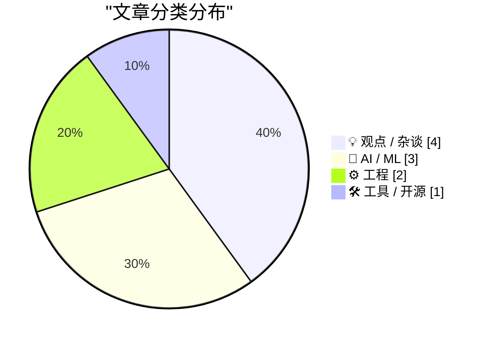
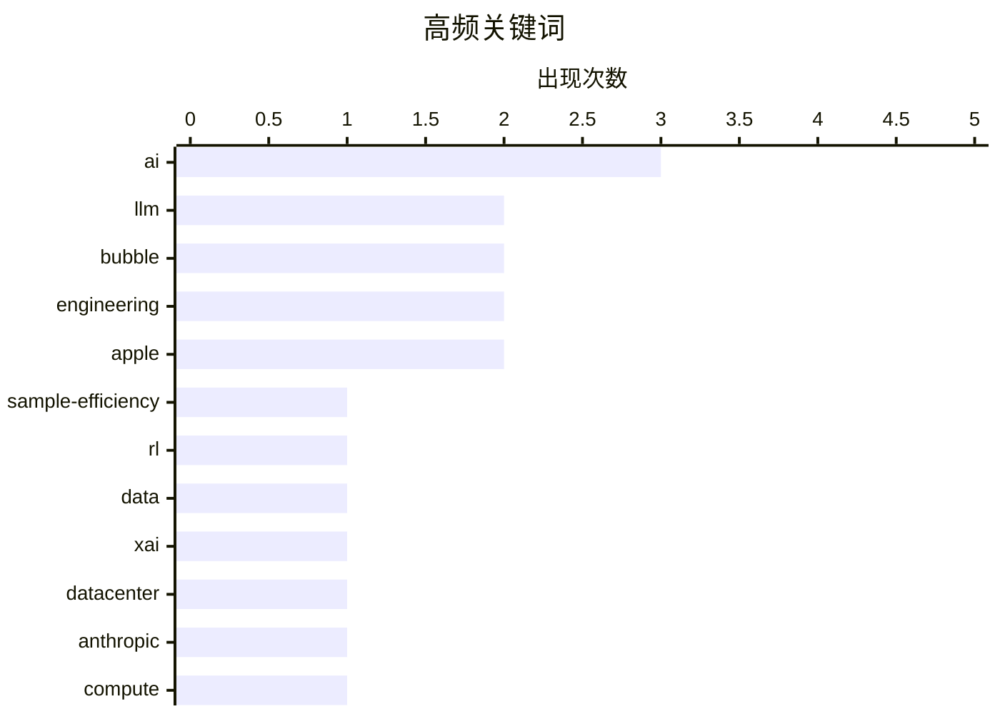

# 📰 AI 博客每日精选 — 2026-06-09

> 来自 Karpathy 推荐的 92 个顶级技术博客，AI 精选 Top 10

## 📝 今日看点

今天的技术圈焦点继续落在 AI 泡沫与基础设施化：多篇文章都在质疑大模型能力增长是否真正来自智能突破，还是主要依赖更庞大的数据、算力和资本开支。与此同时，xAI、OpenAI、Anthropic 等公司的估值与商业模式被重新审视，AI 正从“前沿实验室叙事”滑向“数据中心和融资机器叙事”。另一条主线是工程组织的现实主义回归：从工程师如何保留余裕、如何与产品协作，到开发框架和底层规范的细节争议，都指向一个判断——技术价值不在于持续狂奔，而在于能否在关键处稳定地产生高质量结果。

---

## 🏆 今日必读

🥇 **样本效率黑洞**

[The sample efficiency black hole](https://www.dwarkesh.com/p/the-sample-efficiency-black-hole) — dwarkesh.com · 5 小时前 · 🤖 AI / ML

> 智能的一种定义是样本效率，即在某个领域中需要看多少数据才能熟练、胜任地工作。近几年 AI 能力提升未必来自训练样本效率的显著进步，更像是通过增加更好、更多的数据并扩展用于生成这些数据的算力来扩大数据分布。RL 可以被视为一种合成数据生成方式：用大量算力配合验证器找出“好”数据，再训练模型预测这些正确轨迹。这个过程仍依赖大量高度任务特定的人类专家轨迹，例如 Word 文档处理、M&A 尽调、证券文件、市场研究等，每项技能都需要许多专家生成示例、编写评分标准并解释推理链。作者认为数据行业因此获得数十亿美元、未来可能达到数百亿美元收入，而开放模型能在 4 个月内接近最先进闭源模型，也说明数据才是当前进步的主要驱动力。

💡 **为什么值得读**: 值得读是因为它把 AI 能力飞跃背后的“数据黑洞”讲清楚，挑战了单纯用模型规模或算法进步解释前沿进展的常见叙事。

🏷️ LLM, sample-efficiency, RL, data

🥈 **xAI 越来越像数据中心 REIT，而不是前沿实验室**

[xAI is looking more like a datacentre REIT than a frontier lab](https://martinalderson.com/posts/xais-new-rental-business/?utm_source=rss&amp;utm_medium=rss&amp;utm_campaign=feed) — martinalderson.com · 23 小时前 · 🤖 AI / ML

> xAI 近期与 Anthropic 和 Google 达成合作，向两家公司提供大规模算力容量，这让其业务形态更像出租数据中心能力。xAI 已并入 SpaceX，因此这些交易收入会进入即将 IPO 的实体，但作者认为这不只是财务工程。Anthropic 此前因 Claude 在欧洲下午和美国上午的高峰时段面临严重容量问题，不得不对订阅用户设置 5am–11am PT / 1pm–7pm GMT 的高峰使用限制。xAI 5 月向 Anthropic 提供孟菲斯 Colossus 1 数据中心容量后，Anthropic 撤销了订阅限制，高峰期算力紧张暂时缓解；该交易费用最高升至每月 12.5 亿美元，对应 300MW 容量和约 22 万块 GPU。Google 随后也达成类似合作，每月 9.2 亿美元获得 11 万块 GPU，但两项协议都包含初始锁定期后可提前 90 天取消的条款。作者同时指出交易存在疑点，包括 Elon Musk 与 OpenAI 的法律纠纷，以及 Google 作为 SpaceX 主要股东可能有动力推高 IPO 估值。

💡 **为什么值得读**: 值得读之处在于它把 xAI 的算力出租、SpaceX IPO、Anthropic 容量危机和 GPU 短缺放在同一框架下，提供了一个不同于“前沿 AI 实验室”的观察角度。

🏷️ xAI, datacenter, Anthropic, compute

🥉 **AI 正在放缓**

[AI Is Slowing Down](https://www.wheresyoured.at/ai-is-slowing-down/) — wheresyoured.at · 7 小时前 · 💡 观点 / 杂谈

> 生成式 AI 的投资热潮被作者视为由炒作、欺骗和神话推动的泡沫，而不是由可持续的产品价值支撑。作者认为，AI 不能放缓，因为到 2030 年底前它需要 3 万亿美元或更多收入来维持自身存在。按照 Sightline Climate 2 月的数据，已规划的数据中心规模为 190GW；若采用 NVIDIA CEO 黄仁勋所说每 GW 数据中心成本 800 亿至 1000 亿美元估算，总成本将达到 9.5 万亿至 15 万亿美元。作者还指出，Bloomberg 将这一建设规模称为“3 万亿美元”并不准确，而 Financial Times 5 月报道称银行担心会被数据中心债务“噎住”，作者估计当前每年发行规模仅约 2500 亿美元。作者的核心观点是，AI 产业若要支撑现有叙事和基础设施扩张，需要面对远超当前融资与收入能力的资金压力。

💡 **为什么值得读**: 值得读，因为它用具体数据拆解 AI 基础设施扩张背后的资金缺口，提供了对 AI 泡沫叙事的强烈反向视角。

🏷️ AI, bubble, scaling, OpenAI

---

## 📊 数据概览

| 扫描源 | 抓取文章 | 时间范围 | 精选 |
|:---:|:---:|:---:|:---:|
| 87/92 | 2556 篇 → 18 篇 | 24h | **10 篇** |

### 分类分布



### 高频关键词



<details>
<summary>📈 纯文本关键词图（终端友好）</summary>

```
ai                │ ████████████████████ 3
llm               │ █████████████░░░░░░░ 2
bubble            │ █████████████░░░░░░░ 2
engineering       │ █████████████░░░░░░░ 2
apple             │ █████████████░░░░░░░ 2
sample-efficiency │ ███████░░░░░░░░░░░░░ 1
rl                │ ███████░░░░░░░░░░░░░ 1
data              │ ███████░░░░░░░░░░░░░ 1
xai               │ ███████░░░░░░░░░░░░░ 1
datacenter        │ ███████░░░░░░░░░░░░░ 1
```

</details>

### 🏷️ 话题标签

**ai**(3) · **llm**(2) · **bubble**(2) · engineering(2) · apple(2) · sample-efficiency(1) · rl(1) · data(1) · xai(1) · datacenter(1) · anthropic(1) · compute(1) · scaling(1) · openai(1) · productivity(1) · career(1) · impact(1) · product-management(1) · collaboration(1) · culture(1)

---

## 💡 观点 / 杂谈

### 1. AI 正在放缓

[AI Is Slowing Down](https://www.wheresyoured.at/ai-is-slowing-down/) — **wheresyoured.at** · 7 小时前 · ⭐ 24/30

> 生成式 AI 的投资热潮被作者视为由炒作、欺骗和神话推动的泡沫，而不是由可持续的产品价值支撑。作者认为，AI 不能放缓，因为到 2030 年底前它需要 3 万亿美元或更多收入来维持自身存在。按照 Sightline Climate 2 月的数据，已规划的数据中心规模为 190GW；若采用 NVIDIA CEO 黄仁勋所说每 GW 数据中心成本 800 亿至 1000 亿美元估算，总成本将达到 9.5 万亿至 15 万亿美元。作者还指出，Bloomberg 将这一建设规模称为“3 万亿美元”并不准确，而 Financial Times 5 月报道称银行担心会被数据中心债务“噎住”，作者估计当前每年发行规模仅约 2500 亿美元。作者的核心观点是，AI 产业若要支撑现有叙事和基础设施扩张，需要面对远超当前融资与收入能力的资金压力。

🏷️ AI, bubble, scaling, OpenAI

---

### 2. 在工作中什么都不做

[Doing nothing at work](https://seangoedecke.com/doing-nothing-at-work/) — **seangoedecke.com** · 23 小时前 · ⭐ 21/30

> 许多工程师不应总是满负荷工作，而应默认保持约 80% 的利用率，把 20% 的工作日留给离开电脑或放慢节奏。作者认为，科技公司的绩效往往由少数异常高影响事件主导，软件开发不奖励努力本身，关键是能在正确时间解决正确问题。大型工程组织里，一些看似琐碎的工程改动可能影响数千万或数亿美元的业务，例如为大型企业交易补功能或修 bug、在事故早期通过关闭正确的 feature flag 降低损失、为高曝光功能快速完成冷门但关键的系统改动。这些机会都有强时间依赖性，不能靠每天早上主动规划获得，而需要在机会出现时没有被低优先级工作占满。如果工程师长期 100% 忙于处理 JIRA backlog，就可能因不关注团队动态、事故进展和跨团队沟通而错过高影响机会，也会让经理不愿意把临时重要任务交给他。

🏷️ productivity, engineering, career, impact

---

### 3. 与产品经理合作

[Working with product managers](https://seangoedecke.com/working-with-product-managers/) — **seangoedecke.com** · 23 小时前 · ⭐ 21/30

> 工程师与产品管理之间的关系往往比公司其他协作关系更容易失衡，因为双方缺少共同文化和语言，权责边界也不像工程经理关系那样清晰。作者反对把产品经理视为“product mommy”的动态，即把工程师看作需要被家长式管理、避免走偏的技术执行者。产品经理和工程师的技能集高度不重合：产品经理通常难以判断技术理由，工程师也缺少产品经理对组织需求、功能优先级和利益相关方的可见性。双方都必须依赖彼此的判断，但信任又会不断受损：产品经理常听到“技术上不可能”却后来顺利完成，工程师也常被告知某需求极其关键却随后被悄然放弃或改变。作者认为这些问题通常并非恶意，而是源于技术估算本身困难，以及大型科技公司内部优先级会频繁变化。

🏷️ product-management, engineering, collaboration, culture

---

### 4. 整个行业正被疯狂的数学支撑着

[An entire industry is being propped up by math that is insane.](https://garymarcus.substack.com/p/an-entire-industry-is-being-propped) — **garymarcus.substack.com** · 4 小时前 · ⭐ 20/30

> Gary Marcus质疑围绕SpaceX、OpenAI和Anthropic等即将IPO公司的投资预期，认为把它们类比为早期Amazon、Google和Meta存在严重的数学问题。文中引用说法称，Amazon给早期投资带来2538倍回报；如果SpaceX实现同样回报，其市值将达到4442万亿美元，相当于当前全球GDP总量的36倍。另一条被引用的观点指出，要实现接近600倍增长，销售额需要在十年内平均每年增长50%。文章还提到Jessica Wachter和Jonathan Wachter的一项新研究，试图计算要让这种投资规模合理化，生产率累计需要提高多少。作者的核心判断是，这类IPO预期建立在不现实的增长假设上，购买SpaceX IPO的人可能忽视了数学和历史约束。

🏷️ AI, valuation, IPO, bubble

---

## 🤖 AI / ML

### 5. 样本效率黑洞

[The sample efficiency black hole](https://www.dwarkesh.com/p/the-sample-efficiency-black-hole) — **dwarkesh.com** · 5 小时前 · ⭐ 26/30

> 智能的一种定义是样本效率，即在某个领域中需要看多少数据才能熟练、胜任地工作。近几年 AI 能力提升未必来自训练样本效率的显著进步，更像是通过增加更好、更多的数据并扩展用于生成这些数据的算力来扩大数据分布。RL 可以被视为一种合成数据生成方式：用大量算力配合验证器找出“好”数据，再训练模型预测这些正确轨迹。这个过程仍依赖大量高度任务特定的人类专家轨迹，例如 Word 文档处理、M&A 尽调、证券文件、市场研究等，每项技能都需要许多专家生成示例、编写评分标准并解释推理链。作者认为数据行业因此获得数十亿美元、未来可能达到数百亿美元收入，而开放模型能在 4 个月内接近最先进闭源模型，也说明数据才是当前进步的主要驱动力。

🏷️ LLM, sample-efficiency, RL, data

---

### 6. xAI 越来越像数据中心 REIT，而不是前沿实验室

[xAI is looking more like a datacentre REIT than a frontier lab](https://martinalderson.com/posts/xais-new-rental-business/?utm_source=rss&amp;utm_medium=rss&amp;utm_campaign=feed) — **martinalderson.com** · 23 小时前 · ⭐ 25/30

> xAI 近期与 Anthropic 和 Google 达成合作，向两家公司提供大规模算力容量，这让其业务形态更像出租数据中心能力。xAI 已并入 SpaceX，因此这些交易收入会进入即将 IPO 的实体，但作者认为这不只是财务工程。Anthropic 此前因 Claude 在欧洲下午和美国上午的高峰时段面临严重容量问题，不得不对订阅用户设置 5am–11am PT / 1pm–7pm GMT 的高峰使用限制。xAI 5 月向 Anthropic 提供孟菲斯 Colossus 1 数据中心容量后，Anthropic 撤销了订阅限制，高峰期算力紧张暂时缓解；该交易费用最高升至每月 12.5 亿美元，对应 300MW 容量和约 22 万块 GPU。Google 随后也达成类似合作，每月 9.2 亿美元获得 11 万块 GPU，但两项协议都包含初始锁定期后可提前 90 天取消的条款。作者同时指出交易存在疑点，包括 Elon Musk 与 OpenAI 的法律纠纷，以及 Google 作为 SpaceX 主要股东可能有动力推高 IPO 估值。

🏷️ xAI, datacenter, Anthropic, compute

---

### 7. 苹果知道而硅谷不愿承认的 AI 真相

[Alberto Romero on Apple’s AI Spending](https://www.thealgorithmicbridge.com/p/what-apple-knows-about-ai-that-silicon) — **daringfireball.net** · 22 小时前 · ⭐ 23/30

> 核心观点是，苹果在 AI 资本开支上的克制并非落后，而是源于它并不相信 AI 会彻底重塑一切。2026 年，Amazon、Google、Meta、Microsoft 四大云和 AI 基础设施提供商承诺投入 6700 亿美元资本开支，而苹果上一财年资本开支为 127 亿美元，并预计 2026 年为 140 亿美元，仅约为同行的 2%。硅谷的主流解读认为苹果在 AI 上掉队，尤其是 Siri 长期表现不佳、进展被批评缓慢；但作者认为苹果是在按自己的信念行动。Tim Cook 宣布将于 2026 年 4 月卸任 CEO 后，选择硬件工程负责人 John Ternus 作为继任者，而不是任命一位以 AI 为核心的人物。苹果开放 Siri 接入第三方 AI 模型，让用户可选择 ChatGPT 或 Claude，显示其把 AI 模型和智能体视为可替换的商品，而不是必须自研并押注的“神性机器”。作者的结论是，其他科技公司其实也未必真正相信 AI 会改变一切，只是在资本、收入、股东和估值压力下扮演 AI 信徒。

🏷️ Apple, AI, capex, strategy

---

## ⚙️ 工程

### 8. 域名中可以连续使用多少个连字符？

[How many consecutive hyphens can you have in a domain name?](https://shkspr.mobi/blog/2026/06/how-many-consecutive-hyphens-can-you-have-in-a-domain-name/) — **shkspr.mobi** · 11 小时前 · ⭐ 19/30

> 域名中连续连字符的允许数量，看似简单，实际涉及从早期 Internet 主机名规则到 IDN 规范、再到 TLD 注册局政策的多层限制。早期 RFC 608、RFC 810、RFC 952 和 RFC 1035 允许字母、数字和连字符作为主机名字符，主要限制是不能以连字符结尾，后来 RFC 1123 又放宽了首字符可为数字。2010 年后的国际化域名 IDN 规则引入了 `xn--` 前缀，并规定 Unicode 字符串不能在第 3、4 位出现两个连续连字符，也不能以连字符开头或结尾。按 RFC 层面的推导，如果让连续连字符从第 4 位开始、到第 62 位结束，理论上可以出现最多 59 个连续连字符。实际注册时还要受顶级域名注册局政策限制，例如南苏丹 `.ss` 政策不允许任何连字符，因此标准允许并不等于所有 TLD 都能注册。

🏷️ DNS, domain, RFC, standards

---

### 9. SwiftUI 只是让开发糟糕应用变得容易

[★ SwiftUI Only Makes It Easy to Develop Bad Apps](https://daringfireball.net/2026/06/swiftui_only_makes_it_easy_to_develop_bad_apps) — **daringfireball.net** · 21 小时前 · ⭐ 19/30

> SwiftUI 在 2026 年的 macOS 原生应用开发中仍暴露出基础能力不足的问题，尤其是在追求跨 iOS、iPadOS 和 macOS 代码复用时。Paulo Andrade 以 Shopie 的 macOS 版本为例，说明一个完全使用 SwiftUI 构建的小型应用在移植到 Mac 时遇到的限制和问题。John Gruber 认为 Apple 没有把 AppKit 和 UIKit 统一成成熟的跨平台框架，而是让 AppKit 老化后试图用 SwiftUI 跳过问题。SwiftUI 在提升生产力和现代化体验方面有优势，但一旦要做“真正好的 Mac 应用”，开发者会在许多早已由 Mac 平台解决的基础功能上与框架对抗。Apple Journal 被举为典型例子：在 macOS 26 Tahoe 中删除单词后执行 Undo，可能导致整句消失，Redo 也无法恢复被删单词，暴露出文本编辑和撤销栈实现的严重问题。作者的核心观点是，SwiftUI 并非不能用，但它在 Mac 原生体验和基础交互可靠性上仍远未达到 AppKit 长期以来的水准。

🏷️ SwiftUI, macOS, AppKit, Apple

---

## 🛠 工具 / 开源

### 10. datasette-agent-edit 0.1a0

[datasette-agent-edit 0.1a0](https://simonwillison.net/2026/Jun/7/datasette-agent-edit/#atom-everything) — **simonwillison.net** · 23 小时前 · ⭐ 20/30

> datasette-agent-edit 0.1a0 是一个面向 Datasette Agent 插件的基础插件，提供与存储无关的文件编辑工具。Simon Willison 计划开发多个可编辑现有文本的 Datasette Agent 插件，场景包括协作式 Markdown 编辑、大型 SQL 查询更新和 SVG 文件编辑。由于智能体编辑文本不容易做好，他借鉴了 Claude text editor 的设计：用 view 查看带行号的文件片段，用 str_replace 精确替换唯一匹配的旧字符串，用 insert 在指定行号后插入文本。datasette-agent-edit 将这些核心编辑模式抽象出来，避免每个需要文本编辑能力的插件重复实现。

🏷️ Datasette, LLM, agent, text-editing

---

*生成于 2026-06-09 07:10 | 扫描 87 源 → 获取 2556 篇 → 精选 10 篇*
*基于 [Hacker News Popularity Contest 2025](https://refactoringenglish.com/tools/hn-popularity/) RSS 源列表*
