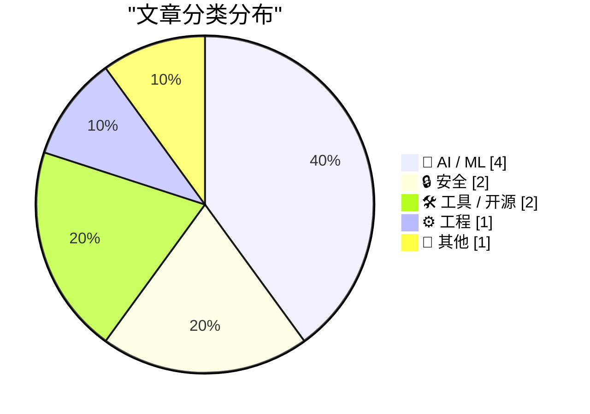
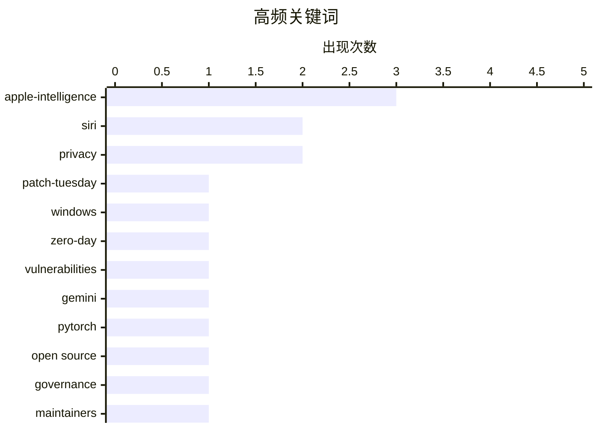

# 📰 AI 博客每日精选 — 2026-06-10

> 来自 Karpathy 推荐的 92 个顶级技术博客，AI 精选 Top 10

## 📝 今日看点

今天技术圈的焦点集中在 AI 助手再度升温：苹果借 WWDC 大幅推进 Siri 与 Apple Intelligence，但外界对其兑现能力仍保持审慎观望。安全领域同样压力陡增，微软创纪录补丁规模与 OpenSSL 漏洞应急修复，凸显基础软件供应链的脆弱性仍是高优先级风险。与此同时，开源治理和开发工具生态继续走向成熟，从项目决策机制到模型成本分析、对象存储 SDK，都在回应工程规模化后的长期治理与效率问题。

---

## 🏆 今日必读

🥇 **2026 年 6 月创纪录的补丁星期二**

[A Record-Breaking Patch Tuesday for June 2026](https://krebsonsecurity.com/2026/06/a-record-breaking-patch-tuesday-for-june-2026/) — krebsonsecurity.com · 1 小时前 · 🔒 安全

> 微软在 2026 年 6 月的补丁星期二发布更新，修复 Windows 操作系统及受支持软件中的近 200 个安全漏洞，创下该公司月度补丁周期的修复数量纪录。近三十多个漏洞被评为“critical”，至少 3 个漏洞的利用代码已公开；Tenable 的 Satnam Narang 认为，安全人员和工程师越来越多使用 AI 工具发现漏洞，可能让这种高补丁量成为常态。本月零日漏洞包括影响 Microsoft IIS 等多种 Web 服务器的拒绝服务漏洞 CVE-2026-49160，微软称该漏洞由 OpenAI 的 Codex 报告。另有两个零日漏洞似乎与 Nightmare Eclipse 近期披露的 Windows 漏洞有关，其中包括 Windows Collaborative Translation Framework 的权限提升问题，以及 BitLocker 中允许具备物理访问权限的攻击者查看加密数据的相关漏洞。微软此前因称考虑对该研究人员采取法律行动而遭到社交媒体批评，随后澄清不会追究研究人员法律责任，但若其违法会报告给执法机构。Nightmare Eclipse 还声称将在 7 月 14 日发布更多 Windows 零日漏洞利用代码，并在微软发布补丁后立即公布了一个自称为零日漏洞的利用代码。

💡 **为什么值得读**: 这篇文章值得读，因为它把一次创纪录补丁发布、AI 辅助漏洞发现、零日披露争议和 Windows 安全风险集中放在同一背景下，能帮助读者判断本轮补丁的紧迫性。

🏷️ Patch-Tuesday, Windows, zero-day, vulnerabilities

🥈 **WWDC 2026 上的 Siri AI**

[Siri AI at WWDC 2026](https://simonwillison.net/2026/Jun/8/wwdc/#atom-everything) — simonwillison.net · 23 小时前 · 🤖 AI / ML

> 苹果在 WWDC 2026 发布了新的 Siri AI 功能，但 Simon Willison 对这些发布保持“看到再相信”的态度，因为 2024 年 WWDC 的 Apple Intelligence 宣布曾让相信者失望。新的 Siri AI 看起来更符合当前技术条件，尤其是苹果正在授权一个基于 Gemini 定制的模型，并计划在自家的 Private Cloud Compute 上运行。它可能会利用视觉 LLM 从用户屏幕中提取信息，从而避免要求现有应用为 Apple Intelligence 编写专门集成代码。新的 Core AI 库被认为有助于开发者利用苹果硬件运行自己的模型，并通过 coreai-torch 将 PyTorch 模型转换为可在 Apple 硬件上运行的 Core AI AIProgram。更新信息显示，部分 Private Cloud Compute Gemini 模型会运行在 Google Cloud 和 NVIDIA 硬件上，同时苹果称会延续 PCC 的安全与隐私保护，并公开所有二进制文件供检查。

💡 **为什么值得读**: 值得读，因为它把 WWDC 2026 的 Siri AI、Gemini、Private Cloud Compute、Core AI 与 NVIDIA/Google Cloud 的技术关系梳理在一起，并保留了对实际效果的审慎判断。

🏷️ Siri, Apple-Intelligence, Gemini, PyTorch

🥉 **开源治理的形式**

[Forms of Open Source Government](https://nesbitt.io/2026/06/09/forms-of-open-source-government.html) — nesbitt.io · 13 小时前 · ⚙️ 工程

> 开源项目的治理可以从终身仁慈独裁者、失去善意后的终身独裁者，演变到指导委员会、永久核心团队、基金会治理和技术委员会等多种形态。BDFL 模式依赖创始人长期保留最终决定权，Python 在 Guido 2018 年卸任后转向由 PEP 13 和 PEP 8016 建立的五人 Steering Council，而 Linux、Ruby、Rails 和 Laravel 仍属于这一类。永久核心团队以 PostgreSQL 为代表，能积累制度记忆，但成员加入标准通常不成文；Apache Way 则通过 contributor、committer、PMC member 的统一阶梯、轮值主席和邮件列表上的 lazy consensus 或投票来换取可复制性，但代价是速度较慢。CNCF、Eclipse、OpenJS 和 Linux Foundation 伞下项目体现了厂商中立基金会模式，由基金会持有商标和法律实体、技术监督委员会授权维护者、成员公司缴费支持人员。Kubernetes 和 Node.js 代表技术指导委员会加 SIG 或工作组的结构，能随项目规模扩展，但在雇主集中度较高时，组织图本身未必暴露控制权集中问题。

💡 **为什么值得读**: 值得读是因为它把常见开源治理模式的权力来源、继任风险、组织成本和代表项目放在一起比较，便于判断一个项目的治理结构是否健康。

🏷️ open source, governance, maintainers, BDFL

---

## 📊 数据概览

| 扫描源 | 抓取文章 | 时间范围 | 精选 |
|:---:|:---:|:---:|:---:|
| 87/92 | 2556 篇 → 22 篇 | 24h | **10 篇** |

### 分类分布



### 高频关键词



<details>
<summary>📈 纯文本关键词图（终端友好）</summary>

```
apple-intelligence │ ████████████████████ 3
siri               │ █████████████░░░░░░░ 2
privacy            │ █████████████░░░░░░░ 2
patch-tuesday      │ ███████░░░░░░░░░░░░░ 1
windows            │ ███████░░░░░░░░░░░░░ 1
zero-day           │ ███████░░░░░░░░░░░░░ 1
vulnerabilities    │ ███████░░░░░░░░░░░░░ 1
gemini             │ ███████░░░░░░░░░░░░░ 1
pytorch            │ ███████░░░░░░░░░░░░░ 1
open source        │ ███████░░░░░░░░░░░░░ 1
```

</details>

### 🏷️ 话题标签

**apple-intelligence**(3) · **siri**(2) · **privacy**(2) · patch-tuesday(1) · windows(1) · zero-day(1) · vulnerabilities(1) · gemini(1) · pytorch(1) · open source(1) · governance(1) · maintainers(1) · bdfl(1) · claude(1) · ai safety(1) · anthropic(1) · hype(1) · assistant(1) · foundation-models(1) · ai(1)

---

## 🤖 AI / ML

### 1. WWDC 2026 上的 Siri AI

[Siri AI at WWDC 2026](https://simonwillison.net/2026/Jun/8/wwdc/#atom-everything) — **simonwillison.net** · 23 小时前 · ⭐ 24/30

> 苹果在 WWDC 2026 发布了新的 Siri AI 功能，但 Simon Willison 对这些发布保持“看到再相信”的态度，因为 2024 年 WWDC 的 Apple Intelligence 宣布曾让相信者失望。新的 Siri AI 看起来更符合当前技术条件，尤其是苹果正在授权一个基于 Gemini 定制的模型，并计划在自家的 Private Cloud Compute 上运行。它可能会利用视觉 LLM 从用户屏幕中提取信息，从而避免要求现有应用为 Apple Intelligence 编写专门集成代码。新的 Core AI 库被认为有助于开发者利用苹果硬件运行自己的模型，并通过 coreai-torch 将 PyTorch 模型转换为可在 Apple 硬件上运行的 Core AI AIProgram。更新信息显示，部分 Private Cloud Compute Gemini 模型会运行在 Google Cloud 和 NVIDIA 硬件上，同时苹果称会延续 PCC 的安全与隐私保护，并公开所有二进制文件供检查。

🏷️ Siri, Apple-Intelligence, Gemini, PyTorch

---

### 2. Claude Mythos 的复仇

[The revenge of Claude Mythos](https://garymarcus.substack.com/p/the-revenge-of-claude-mythos) — **garymarcus.substack.com** · 5 小时前 · ⭐ 20/30

> Gary Marcus 质疑 Anthropic 对 Claude Mythos 的“危险性”叙事，认为两个月前围绕该模型的恐慌并未兑现。Axios 推文称 Mythos 强大到完整发布可能造成灾难，甚至能击垮 Fortune 100 公司、瘫痪部分互联网或渗透关键国防系统；Tom Friedman 也在《纽约时报》表达担忧。两个月后，Anthropic 在加上 guardrails 后将 Mythos 推向市场，任何人只要支付相应价格就能使用。Marcus 指出，这一发布发生在 tokenmaxxing 结束、企业开始限制 AI token 预算之际，并认为 Anthropic 一边声称前沿模型危险，一边推出新前沿模型参与 benchmark 竞争。作者的核心观点是，Anthropic 再次利用媒体制造恐慌和关注，而许多人照单全收。

🏷️ Claude, AI safety, Anthropic, hype

---

### 3. 苹果推出 Siri AI

[Apple Introduces Siri AI](https://www.apple.com/newsroom/2026/06/apple-introduces-siri-ai-a-profoundly-more-capable-and-personal-assistant/) — **daringfireball.net** · 5 小时前 · ⭐ 23/30

> Siri AI 是苹果基于 Apple Intelligence 推出的新版 Siri，定位为更强大、更会对话、更个人化的助手。它具备个人上下文理解、广泛世界知识和屏幕感知能力，可回答网页上的各类问题，也能从用户的消息、邮件、照片等内容中提取相关信息。新版 Siri 深度集成到苹果产品和操作系统中，可围绕屏幕内容回答问题、跨应用搜索个人上下文，并通过网络获取最新信息生成回答。它还包含独立应用，用于跨产品回看对话，并扩展了 Visual Intelligence 体验和写作工具。苹果强调其新架构专为保护用户隐私而设计，相关功能已开放开发者测试，并将在今年晚些时候向用户提供 beta 版本。

🏷️ Siri, Apple-Intelligence, privacy, assistant

---

### 4. 苹果在 WWDC 发布全新 Apple Intelligence 系统

[Apple’s WWDC Announcement of the New Apple Intelligence System](https://www.apple.com/newsroom/2026/06/apple-intelligence-brings-powerful-ai-capabilities-into-everyday-experiences/) — **daringfireball.net** · 6 小时前 · ⭐ 23/30

> 苹果发布下一代 Apple Intelligence，采用新的架构，将最新 Apple Foundation Models 深度整合到 iPhone、iPad、Mac、Apple Watch、AirPods 和 Apple Vision Pro 等平台，并强调隐私保护。新能力覆盖 Photos、Safari、Passwords、Image Playground 等应用，包括照片编辑、浏览定制、安全保护升级和生成照片级图像。用户可以通过自然语言描述需求来查找内容或完成任务，相关功能从 2026 年 6 月 8 日起开放开发者测试，并计划在秋季面向用户推出。全新的 Siri AI 由下一代 Apple Intelligence 驱动，提供独立应用、跨平台写作工具和 Visual Intelligence，可在信息、邮件、照片等内容中搜索信息、回答问题并在应用中执行操作。Photos 的 AI 编辑会自动加入隐藏的 SynthID 水印，Spatial Reframing 可在拍摄后优化照片构图。苹果的核心观点是，真正有用的 AI 应以用户需求为中心、深度融入日常产品、结合个人上下文，并在每一步保护隐私。

🏷️ Apple-Intelligence, foundation-models, privacy, AI

---

## 🔒 安全

### 5. 2026 年 6 月创纪录的补丁星期二

[A Record-Breaking Patch Tuesday for June 2026](https://krebsonsecurity.com/2026/06/a-record-breaking-patch-tuesday-for-june-2026/) — **krebsonsecurity.com** · 1 小时前 · ⭐ 27/30

> 微软在 2026 年 6 月的补丁星期二发布更新，修复 Windows 操作系统及受支持软件中的近 200 个安全漏洞，创下该公司月度补丁周期的修复数量纪录。近三十多个漏洞被评为“critical”，至少 3 个漏洞的利用代码已公开；Tenable 的 Satnam Narang 认为，安全人员和工程师越来越多使用 AI 工具发现漏洞，可能让这种高补丁量成为常态。本月零日漏洞包括影响 Microsoft IIS 等多种 Web 服务器的拒绝服务漏洞 CVE-2026-49160，微软称该漏洞由 OpenAI 的 Codex 报告。另有两个零日漏洞似乎与 Nightmare Eclipse 近期披露的 Windows 漏洞有关，其中包括 Windows Collaborative Translation Framework 的权限提升问题，以及 BitLocker 中允许具备物理访问权限的攻击者查看加密数据的相关漏洞。微软此前因称考虑对该研究人员采取法律行动而遭到社交媒体批评，随后澄清不会追究研究人员法律责任，但若其违法会报告给执法机构。Nightmare Eclipse 还声称将在 7 月 14 日发布更多 Windows 零日漏洞利用代码，并在微软发布补丁后立即公布了一个自称为零日漏洞的利用代码。

🏷️ Patch-Tuesday, Windows, zero-day, vulnerabilities

---

### 6. “没办法防止这种事”，唯一经常发生此类问题的语言用户如是说

["No way to prevent this" say users of only language where this regularly happens](https://xeiaso.net/shitposts/no-way-to-prevent-this/memory-safety/CVE-2026-45447/) — **xeiaso.net** · 23 小时前 · ⭐ 18/30

> OpenSSL 发布 CVE-2026-45447 后，站点可靠性工程师和系统管理员紧急重建并修补系统，以修复 PKCS7_verify() 中的堆 use-after-free 漏洞。文章以讽刺口吻指出，受影响组件使用 C 编写，而 C 被描述为唯一经常出现此类内存安全漏洞的编程语言。文中引用的说法称，过去 50 年全球 90% 的内存安全漏洞发生在这种语言相关项目中，其项目出现安全漏洞的可能性高 20 倍。程序员将事件称为“悲剧”，同时声称如果开发者不愿以更稳健的方式编写代码，就没有办法阻止内存安全漏洞发生。结尾继续讽刺这种语言的用户在过去八年中每季度一两次遭遇类似漏洞，却仍把自身处境称为“无助”。

🏷️ OpenSSL, memory safety, C, vulnerability

---

## 🛠 工具 / 开源

### 7. 在 AgentsView 中为模型设置自定义价格

[Setting a custom price for a model in AgentsView](https://simonwillison.net/2026/Jun/9/agentsview-custom-model-price/#atom-everything) — **simonwillison.net** · 1 小时前 · ⭐ 19/30

> Simon Willison 记录了如何在 AgentsView 中为尚未收录定价的新模型设置自定义价格。AgentsView 是 Wes McKinney 开发的 Python 工具，可用于分析本机上编码代理的转录记录，并探索不同编码代理的 token 使用情况。Claude Fable 5 当天发布，但还没有加入 AgentsView 使用的定价数据库。作者用 Fable 反向分析 AgentsView，整理出一套设置自定义价格的方法，并用 AgentsView 将当天 Claude Fable 5 在不同本地项目中的使用情况绘制成 treemap。核心观点是，当模型价格数据库滞后于新模型发布时，手动补充定价可以让本地代理使用分析继续保持可用。

🏷️ AgentsView, LLM, pricing, coding-agents

---

### 8. 让你的 Go 应用获得 Tigris 超能力

[Giving your Go apps Tigris superpowers](https://www.tigrisdata.com/blog/storage-sdk-go/) — **xeiaso.net** · 23 小时前 · ⭐ 20/30

> Tigris 推出 Go Storage SDK，用来简化 Go Web 服务使用 Tigris 在 S3 基础上扩展出的高级对象存储能力。过去在 Go 中进行对象重命名需要手动给 AWS S3 客户端添加 `X-Tigris-Rename` 这类 API 选项，新 SDK 则提供 `RenameObject` 等专用方法。SDK 包含两种模式：`package storage` 作为现有 AWS S3 客户端的辅助封装，`package simplestorage` 则提供面向 Go 应用的高层对象存储客户端。`storage` 支持 `BundleObjects`、`CreateBucketFork`、`CreateBucketSnapshot`、`CreateSnapshotEnabledBucket`、`HeadBucketForkOrSnapshot`、`ListBucketSnapshots` 和 `RenameObject` 等方法，覆盖对象打包获取、bucket fork、快照和对象移动等操作。作者强调这种模式可作为现有 S3 客户端的直接替代方案，迁移成本很低，并计划随着 Tigris 增加功能继续添加更多方法。

🏷️ Go, SDK, object storage, Tigris

---

## ⚙️ 工程

### 9. 开源治理的形式

[Forms of Open Source Government](https://nesbitt.io/2026/06/09/forms-of-open-source-government.html) — **nesbitt.io** · 13 小时前 · ⭐ 22/30

> 开源项目的治理可以从终身仁慈独裁者、失去善意后的终身独裁者，演变到指导委员会、永久核心团队、基金会治理和技术委员会等多种形态。BDFL 模式依赖创始人长期保留最终决定权，Python 在 Guido 2018 年卸任后转向由 PEP 13 和 PEP 8016 建立的五人 Steering Council，而 Linux、Ruby、Rails 和 Laravel 仍属于这一类。永久核心团队以 PostgreSQL 为代表，能积累制度记忆，但成员加入标准通常不成文；Apache Way 则通过 contributor、committer、PMC member 的统一阶梯、轮值主席和邮件列表上的 lazy consensus 或投票来换取可复制性，但代价是速度较慢。CNCF、Eclipse、OpenJS 和 Linux Foundation 伞下项目体现了厂商中立基金会模式，由基金会持有商标和法律实体、技术监督委员会授权维护者、成员公司缴费支持人员。Kubernetes 和 Node.js 代表技术指导委员会加 SIG 或工作组的结构，能随项目规模扩展，但在雇主集中度较高时，组织图本身未必暴露控制权集中问题。

🏷️ open source, governance, maintainers, BDFL

---

## 📝 其他

### 10. Apple II：1977 年 6 月 10 日发布

[Apple II: Launched June 10, 1977](https://dfarq.homeip.net/apple-ii-launched-june-10-1977/?utm_source=rss&#038;utm_medium=rss&#038;utm_campaign=apple-ii-launched-june-10-1977) — **dfarq.homeip.net** · 12 小时前 · ⭐ 16/30

> Apple II 于 1977 年 6 月 10 日发布，是早期预装式台式电脑之一，并在随后 17 年售出约 600 万台。它最初售价 1295 美元，配备 4KB RAM，使用家用盒式磁带录音机存储数据，显示设备则需要复合显示器或第三方 RF 调制器连接电视。与 TRS-80 Model 1 和 Commodore PET 相比，Apple II 更贵，但也更通用，并且是三者中唯一支持彩色的机器。文章认为，Apple II 长期成功不能简单归因于销量或磁盘驱动器，而主要来自开放架构：机箱易于打开，内部有 8 个扩展槽，可通过扩展卡连接打印机、调制解调器、声卡等设备。Steve Wozniak 设计的低成本磁盘接口提升了苹果的盈利能力，而 Microsoft Softcard 等扩展卡还让 Apple II 能运行 CP/M 软件生态。作者的核心观点是，Apple II 的持久生命力更多来自可扩展性和开放硬件设计，而不是单一产品配置或早期销售表现。

🏷️ Apple II, computer history, Steve Wozniak, hardware

---

*生成于 2026-06-10 07:09 | 扫描 87 源 → 获取 2556 篇 → 精选 10 篇*
*基于 [Hacker News Popularity Contest 2025](https://refactoringenglish.com/tools/hn-popularity/) RSS 源列表*
