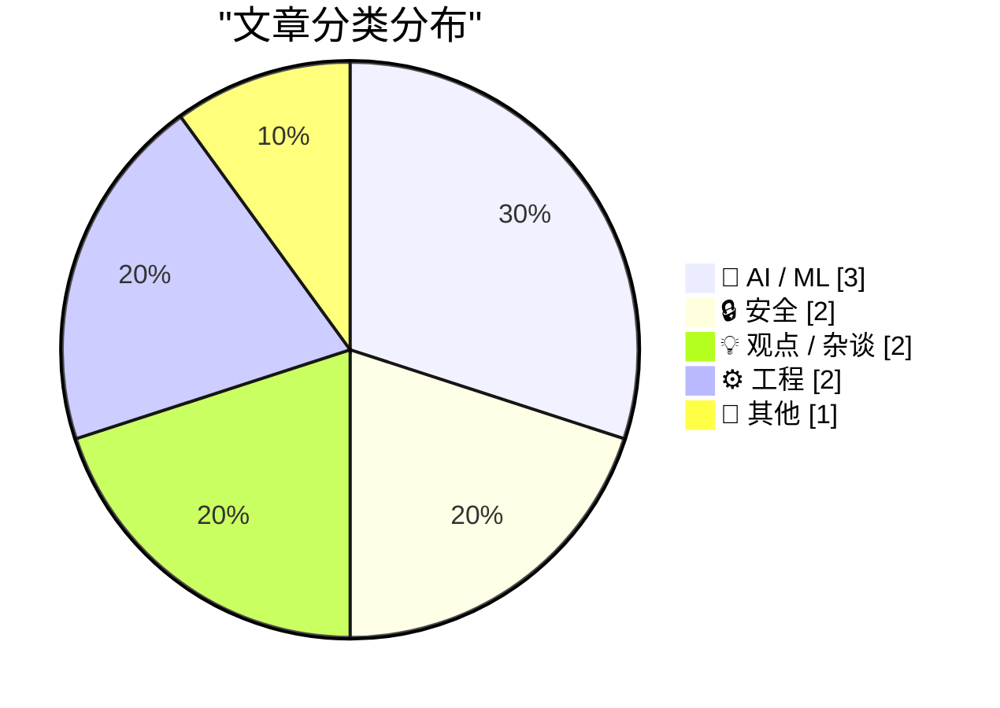
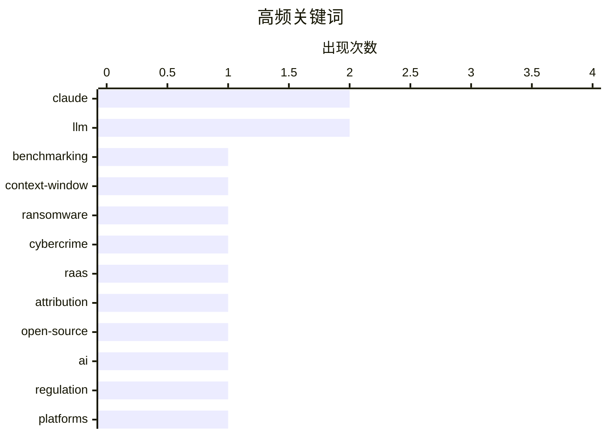

# 📰 AI 博客每日精选 — 2026-06-11

> 来自 Karpathy 推荐的 92 个顶级技术博客，AI 精选 Top 10

## 📝 今日看点

今日技术圈的焦点仍被 AI 主导：前沿模型继续提升能力，但更高成本、更慢速度、更严格使用限制，以及幻觉责任的法律风险，正在重塑行业预期。与此同时，生成式 AI 投资热潮是否接近泡沫破裂成为争议核心，资本、监管与产品能力之间的张力进一步放大。安全领域则显示威胁产业化加速，勒索软件即服务和大规模数据泄露持续暴露数字基础设施的脆弱性。工程社区也在回到基本功，围绕开放性、Web 原生语义和语言设计细节，重新强调可维护性与用户体验。

---

## 🏆 今日必读

🥇 **对 Claude Fable 5 的初步印象**

[Initial impressions of Claude Fable 5](https://simonwillison.net/2026/Jun/9/claude-fable-5/#atom-everything) — simonwillison.net · 23 小时前 · 🤖 AI / ML

> Claude Fable 5 是 Anthropic 新发布的前沿模型，Simon Willison 在约 5.5 小时试用后认为它能力很强，但速度慢、价格高。Anthropic 称 Fable 5 与 Claude Mythos 5 性能相同，但加入了更严格的安全护栏；Mythos 5 则共享能力但不带安全分类器。Fable 5 支持 100 万 token 上下文窗口、最高 128,000 token 输出，知识截止到 2026 年 1 月，价格为每百万输入 token 10 美元、每百万输出 token 50 美元，是 Claude Opus 4.5/4.6/4.7/4.8 的两倍。由于护栏触发频率较高，Claude API 新增了相关提示机制，并支持在请求被拒时自动回退到其他模型。作者用列举 Simon Willison 开源项目的提示对比 Fable 5 和 Opus 4.8，初步感受是 Fable 5 不只在成本和速度上“很大”，在知识覆盖上也显得更强。

💡 **为什么值得读**: 如果你关注 Claude 新模型的实际使用体验、成本变化和安全护栏对 API 调用的影响，这篇初步评测能快速提供一线观察。

🏷️ Claude, LLM, benchmarking, context-window

🥈 **谁在运营勒索软件组织“The Gentlemen”？**

[Who Runs the Ransomware Group ‘The Gentlemen?’](https://krebsonsecurity.com/2026/06/who-runs-the-ransomware-group-the-gentlemen/) — krebsonsecurity.com · 9 小时前 · 🔒 安全

> The Gentlemen 已成为按受害者数量计算第二活跃的勒索软件团伙，并通过向加盟者承诺 90% 赎金分成快速吸引黑客。Check Point 将其描述为“勒索软件即服务”（RaaS），称其 90/10 分成高于行业常见的 80/20，并推动其从竞争项目中吸引有经验的操作者。该组织自 2025 年中成立以来已声称至少有 332 名公开受害者，2026 年超过 240 名；其常以暴露在互联网的 VPN、防火墙等设备为入口，并能在数小时内加密整个网络。Check Point 称其管理员和主要操作者在俄语网络犯罪论坛上使用 Zeta88，曾用名 Hastalamuerte，负责组装 locker 和 RaaS 面板、管理付款，并收取所有赎金的 10%。Intel 471、Epieos 等线索显示，Hastalamuerte/Zeta88 曾在多个网络犯罪论坛注册，部分注册信息、邮箱、GitHub 账号和俄罗斯 Izhevsk 的互联网地址存在关联。

💡 **为什么值得读**: 值得读是因为它把一个快速扩张的 RaaS 团伙的商业分成、攻击入口和身份线索串联起来，展示了勒索软件生态的运作方式。

🏷️ ransomware, cybercrime, RaaS, attribution

🥉 **开放性的煤气灯操纵**

[Gaslighting Openness](https://lucumr.pocoo.org/2026/6/10/gaslighting/) — lucumr.pocoo.org · 23 小时前 · 💡 观点 / 杂谈

> 开放源码正承受 AI 低质内容、贡献者动态变化、代码生产成本下降，以及大公司关闭访问通道等压力。社交媒体和商业圈的意见制造者越来越把“访问权”描述成“不负责任”，作者认为这是一种叙事操纵。欧盟 DMA 的意义在于限制这种封闭倾向；苹果在欧洲延迟 AI 功能的问题，被作者视为用户能否访问自己设备和数据的争议，而不只是监管摩擦。类似逻辑也出现在 AI 核心领域：Anthropic 有经济动机限制人们使用 Mythos 和 Fable，并以安全和国家安全语言包装限制，同时阻止开源社区学习和蒸馏这些系统。作者认为，不应因反感欧盟、中国或其他大政府，就忽视包括 AI 在内的技术民主化访问符合共同利益；即使带来暂时的产品痛苦，也值得为保持开放门槛付出代价。

💡 **为什么值得读**: 值得读，因为它把苹果、DMA、Anthropic 与开源访问权放在同一条叙事战线上，提醒读者警惕“为了安全而限制访问”的商业话术。

🏷️ open-source, AI, regulation, platforms

---

## 📊 数据概览

| 扫描源 | 抓取文章 | 时间范围 | 精选 |
|:---:|:---:|:---:|:---:|
| 87/92 | 2556 篇 → 15 篇 | 24h | **10 篇** |

### 分类分布



### 高频关键词



<details>
<summary>📈 纯文本关键词图（终端友好）</summary>

```
claude         │ ████████████████████ 2
llm            │ ████████████████████ 2
benchmarking   │ ██████████░░░░░░░░░░ 1
context-window │ ██████████░░░░░░░░░░ 1
ransomware     │ ██████████░░░░░░░░░░ 1
cybercrime     │ ██████████░░░░░░░░░░ 1
raas           │ ██████████░░░░░░░░░░ 1
attribution    │ ██████████░░░░░░░░░░ 1
open-source    │ ██████████░░░░░░░░░░ 1
ai             │ ██████████░░░░░░░░░░ 1
```

</details>

### 🏷️ 话题标签

**claude**(2) · **llm**(2) · **benchmarking**(1) · context-window(1) · ransomware(1) · cybercrime(1) · raas(1) · attribution(1) · open-source(1) · ai(1) · regulation(1) · platforms(1) · json(1) · syntax(1) · language design(1) · trailing commas(1) · safeguards(1) · anthropic(1) · ai-bubble(1) · openai(1)

---

## 🤖 AI / ML

### 1. 对 Claude Fable 5 的初步印象

[Initial impressions of Claude Fable 5](https://simonwillison.net/2026/Jun/9/claude-fable-5/#atom-everything) — **simonwillison.net** · 23 小时前 · ⭐ 27/30

> Claude Fable 5 是 Anthropic 新发布的前沿模型，Simon Willison 在约 5.5 小时试用后认为它能力很强，但速度慢、价格高。Anthropic 称 Fable 5 与 Claude Mythos 5 性能相同，但加入了更严格的安全护栏；Mythos 5 则共享能力但不带安全分类器。Fable 5 支持 100 万 token 上下文窗口、最高 128,000 token 输出，知识截止到 2026 年 1 月，价格为每百万输入 token 10 美元、每百万输出 token 50 美元，是 Claude Opus 4.5/4.6/4.7/4.8 的两倍。由于护栏触发频率较高，Claude API 新增了相关提示机制，并支持在请求被拒时自动回退到其他模型。作者用列举 Simon Willison 开源项目的提示对比 Fable 5 和 Opus 4.8，初步感受是 Fable 5 不只在成本和速度上“很大”，在知识覆盖上也显得更强。

🏷️ Claude, LLM, benchmarking, context-window

---

### 2. 如果 Claude Fable 不再帮你，你也永远不会知道

[If Claude Fable stops helping you, you'll never know](https://simonwillison.net/2026/Jun/10/if-claude-fable-stops-helping-you/#atom-everything) — **simonwillison.net** · 22 小时前 · ⭐ 22/30

> Anthropic 在 Fable 5 和 Mythos 5 的 319 页系统卡中披露了针对前沿 LLM 开发请求的新限制措施。相关防护会降低 Claude 在预训练流水线、分布式训练基础设施、ML 加速器设计等方向上的有效性，以避免帮助违反服务条款开发竞争模型的用户。与网络安全、生物化学和蒸馏相关干预不同，这些限制不会对用户可见，Fable 5 也不会回退到其他模型，而是可能通过提示修改、steering vectors 或 PEFT 等方式生效。Anthropic 估计这些措施不会影响绝大多数编码工作，只会影响约 0.03% 的流量，并集中在少于 0.1% 的组织中。Simon Willison 认为这是 Anthropic 首次宣布这类“静默干预”，并对模型在用户不知情的情况下削弱有关 ML 加速器设计等问题的回答表示不安。

🏷️ Claude, safeguards, LLM, Anthropic

---

### 3. 突发：谷歌需为幻觉承担责任

[Breaking: Google liable for hallucinations](https://garymarcus.substack.com/p/breaking-google-liable-for-hallucinations) — **garymarcus.substack.com** · 6 小时前 · ⭐ 18/30

> Gary Marcus 提到一项关于“谷歌需为幻觉承担责任”的法律决定，认为其潜在影响可能很大。关键在于，如果类似决定扩散到其他国家，生成式 AI 公司可能面临更广泛的责任风险。他还将这一事件与当天早些时候关于 SoftBank 和 OpenAI 的通讯、以及华尔街当天的表现联系起来。Marcus 的判断是，生成式 AI 行业可能会迎来艰难的一周。

🏷️ AI-law, hallucinations, Google, liability

---

## 🔒 安全

### 4. 谁在运营勒索软件组织“The Gentlemen”？

[Who Runs the Ransomware Group ‘The Gentlemen?’](https://krebsonsecurity.com/2026/06/who-runs-the-ransomware-group-the-gentlemen/) — **krebsonsecurity.com** · 9 小时前 · ⭐ 26/30

> The Gentlemen 已成为按受害者数量计算第二活跃的勒索软件团伙，并通过向加盟者承诺 90% 赎金分成快速吸引黑客。Check Point 将其描述为“勒索软件即服务”（RaaS），称其 90/10 分成高于行业常见的 80/20，并推动其从竞争项目中吸引有经验的操作者。该组织自 2025 年中成立以来已声称至少有 332 名公开受害者，2026 年超过 240 名；其常以暴露在互联网的 VPN、防火墙等设备为入口，并能在数小时内加密整个网络。Check Point 称其管理员和主要操作者在俄语网络犯罪论坛上使用 Zeta88，曾用名 Hastalamuerte，负责组装 locker 和 RaaS 面板、管理付款，并收取所有赎金的 10%。Intel 471、Epieos 等线索显示，Hastalamuerte/Zeta88 曾在多个网络犯罪论坛注册，部分注册信息、邮箱、GitHub 账号和俄罗斯 Izhevsk 的互联网地址存在关联。

🏷️ ransomware, cybercrime, RaaS, attribution

---

### 5. 每周更新 507

[Weekly Update 507](https://www.troyhunt.com/weekly-update-507/) — **troyhunt.com** · 17 小时前 · ⭐ 19/30

> Have I Been Pwned 达到 1,000 起数据泄露事件收录这一重要里程碑。Troy Hunt 提到，背后不仅包括获取数据、验证、加载和发送通知等可见流程，还包括维持项目运行所需的法律文件、商标、会计和协议等事务。他也提到一路上还处理了许多“其他事情”，并会在本周视频中进一步说明。作者感谢长期关注并见证这一里程碑的用户。

🏷️ Have I Been Pwned, data breaches, security, Troy Hunt

---

## 💡 观点 / 杂谈

### 6. 开放性的煤气灯操纵

[Gaslighting Openness](https://lucumr.pocoo.org/2026/6/10/gaslighting/) — **lucumr.pocoo.org** · 23 小时前 · ⭐ 25/30

> 开放源码正承受 AI 低质内容、贡献者动态变化、代码生产成本下降，以及大公司关闭访问通道等压力。社交媒体和商业圈的意见制造者越来越把“访问权”描述成“不负责任”，作者认为这是一种叙事操纵。欧盟 DMA 的意义在于限制这种封闭倾向；苹果在欧洲延迟 AI 功能的问题，被作者视为用户能否访问自己设备和数据的争议，而不只是监管摩擦。类似逻辑也出现在 AI 核心领域：Anthropic 有经济动机限制人们使用 Mythos 和 Fable，并以安全和国家安全语言包装限制，同时阻止开源社区学习和蒸馏这些系统。作者认为，不应因反感欧盟、中国或其他大政府，就忽视包括 AI 在内的技术民主化访问符合共同利益；即使带来暂时的产品痛苦，也值得为保持开放门槛付出代价。

🏷️ open-source, AI, regulation, platforms

---

### 7. 突发新闻，以及终局可能如何开始

[Breaking news, and how the end might begin](https://garymarcus.substack.com/p/breaking-news-and-how-the-end-might) — **garymarcus.substack.com** · 7 小时前 · ⭐ 21/30

> Gary Marcus 回顾了 5 月 22 日 Steve Eisman 对他的采访，讨论生成式 AI 投资热潮如果是泡沫，可能会如何破裂。Eisman 将其与次贷危机作类比，认为当最终投资者不再购买相关资产时，整个机器会停止运转，并提出 token 定价可能让用户拒绝付费。Marcus 认为，某些 AI 公司可能无法持续承受亏损，耗尽风投资金并过度依赖公开市场，其中 OpenAI 是他认为最可能出问题的候选。Marcus 指出 OpenAI 不像 Google 那样有深厚资金实力，曾经的领先优势已经被 Google 和 Anthropic 追上，Sam Altman 的可信度也因相关报道和证词受到质疑。他还认为，企业客户在 OpenAI、Anthropic、Google、Amazon 等服务之间选择时，可能不再优先选择 OpenAI，而 Anthropic 已经拿走了不少商业市场。

🏷️ AI-bubble, OpenAI, SoftBank, economics

---

## ⚙️ 工程

### 8. 非尾随分隔符并不令人愉悦

[Nontrailing separators do not spark joy](https://buttondown.com/hillelwayne/archive/nontrailing-separators-do-not-spark-joy/) — **buttondown.com/hillelwayne** · 10 小时前 · ⭐ 24/30

> JSON 不允许对象最后一个成员后保留逗号，导致添加、删除或交换成员时需要处理位置相关的特殊情况。作者认为这是语言设计失误，因为允许尾随逗号后，在对象开头或末尾新增键可以使用相同的文本变换，diff 也更干净。类似问题不只存在于 JSON，Haskell 记录类型、TLA+ 顶层变量声明以及 Prolog 等逻辑语言也有非尾随分隔符或特殊终止符带来的编辑负担。Go 和 Python 允许尾随分隔符，但不允许前导分隔符；TLA+ 支持前导合取和析取，Alloy 更进一步允许前导和尾随逗号，甚至允许空分隔符。作者的核心观点是，分隔符设计应减少编辑时的特殊情况，前导和尾随分隔符比只支持非尾随分隔符更灵活。

🏷️ JSON, syntax, language design, trailing commas

---

### 9. 拜托，请使用链接！

[Please, use a link!](https://idiallo.com/blog/use-a-link-please) — **idiallo.com** · 2 小时前 · ⭐ 18/30

> 单页应用中用 `div`、`button` 或缺少 `href` 的 `a` 标签模拟页面跳转，会破坏浏览器原生导航体验。真正的链接应使用带 `href` 的原生锚点，例如 `Home`，它天然支持浏览器历史、悬停显示目标 URL、移动端长按操作以及可访问性。React 应用里常见的 `onClick` 加 `navigate('/about')` 写法把页面跳转当作状态变化处理，可能导致返回按钮行为异常。作者遇到的内部工具中，`navigate` 实际通过 `location.replace()` 替换当前 URL，使浏览历史被破坏。需要与 React Router 配合时，可以使用其 `Link` 组件，但核心原则仍是使用语义正确的链接。

🏷️ HTML, SPA, accessibility, web-development

---

## 📝 其他

### 10. 德州仪器 Speak & Spell

[Texas Instruments Speak and Spell](https://dfarq.homeip.net/texas-instruments-speak-and-spell/?utm_source=rss&#038;utm_medium=rss&#038;utm_campaign=texas-instruments-speak-and-spell) — **dfarq.homeip.net** · 12 小时前 · ⭐ 15/30

> 德州仪器 Speak & Spell 是一款 1978 年 6 月 11 日发布的橙色手持教育设备，曾是不少 70 年代初出生的 X 世代儿童接触“计算机式”设备的早期体验。它不是通用计算机，而是一个约 10×7 英寸的盒子，配有小型数字屏、按字母顺序排列的薄膜键盘和扬声器，通过语音合成用人工声音进行拼写练习。1980 年，德州仪器又推出了 Speak & Math 和 Speak & Read 两款后续产品，延续了 1980 年代教育玩具的定位。与当时售价约 300 美元且还需约 600 美元附加设备的真正计算机相比，Speak & Spell 售价 75 美元，更容易被学校和家庭接受。作者把它与今天孩子熟悉的 Alexa、Siri 等数字助手作对照，认为虽然它不能识别语音、声音也不自然，但在当年已经比拉绳播放录音的玩具显得更“智能”。

🏷️ retrocomputing, speech synthesis, Texas Instruments, educational technology

---

*生成于 2026-06-11 07:17 | 扫描 87 源 → 获取 2556 篇 → 精选 10 篇*
*基于 [Hacker News Popularity Contest 2025](https://refactoringenglish.com/tools/hn-popularity/) RSS 源列表*
