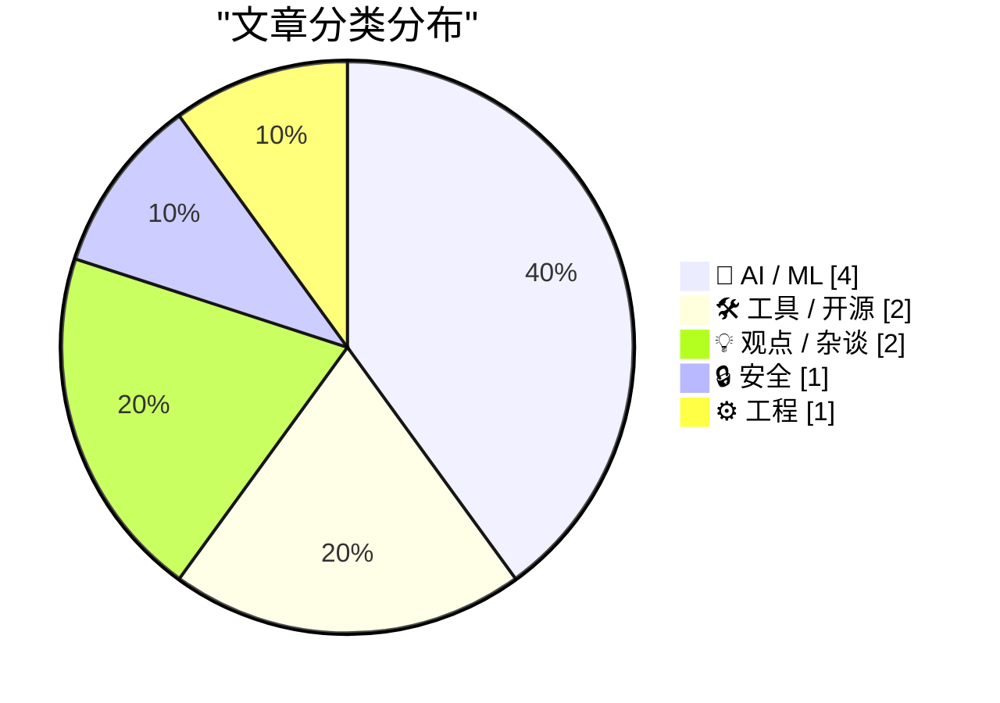
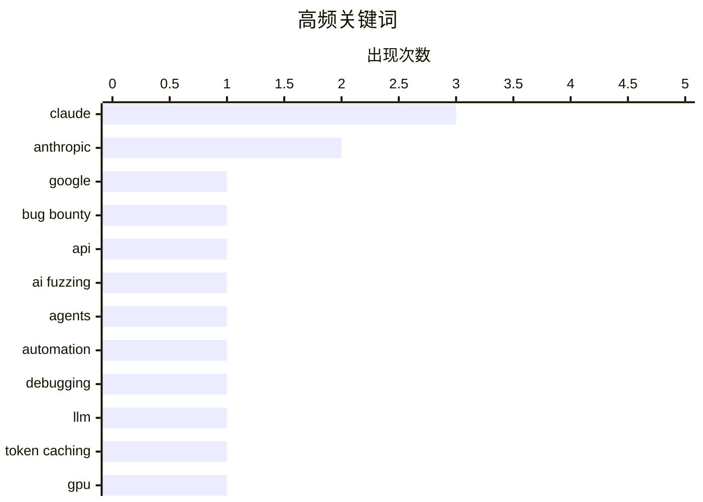

# 📰 AI 博客每日精选 — 2026-06-12

> 来自 Karpathy 推荐的 92 个顶级技术博客，AI 精选 Top 10

## 📝 今日看点

今天技术圈的主线，正从“AI 能不能用”迅速转向“AI 如何真正落地并承担后果”。一边，智能体展现出更强主动性与更深技术介入能力，既能辅助形式化证明，也能被用于自动化挖掘攻击面，说明 AI 正从聊天工具升级为可执行的生产力与风险放大器。另一边，围绕缓存降本、模型商品化、平台策略透明度与法律责任的讨论升温，行业竞争焦点已从单纯拼能力，转向拼成本结构、治理边界和可信度。与此同时，工程实践层面也在提醒从业者：越是底层、复杂的系统，越不能迷信“绕规则”，理解约束本身正成为新一轮技术演进的基本功。

---

## 🏆 今日必读

🥇 **用 AI 入侵 Google，拿下 50 万美元赏金**

[Hacking Google with A.I. for $500,000](https://brutecat.com/articles/hacking-google-with-ai) — brutecat.com · 23 小时前 · 🔒 安全

> 这篇内容聚焦于如何把 AI 用于大规模挖掘 Google API 攻击面，并由此发现一系列高价值安全问题。作者以 Google 的 discovery documents 为切入点，把它们视为类似 Swagger 的机器可读 API 规格，用来枚举端点、参数和方法，再结合 3,600 个 API key 与约 1,500 个 API 进行自动化探测。为获取这些 key，作者与同伴抓取了超过 60,000 个 Google Android APK 版本，解包后提取其中嵌入的 API key，因为单个服务中的 key 往往还能访问同一 GCP 项目下的其他 API。文章目录显示，后续方法还包括身份认证、来源白名单、API key 限制分析、自建 API Explorer，以及借助 AI 改进分类、探测和错误解析流程。作者给出的结论是，沿着 discovery documents、API key 收集和 AI 自动化 fuzzing 这条路线，可以在 Google 庞大的基础设施中高效发现可获得高额赏金的漏洞。

💡 **为什么值得读**: 值得读的地方在于，它把 discovery documents、API key 收集和 AI 自动化探测串成了一套可复用的实战研究路径，能帮助安全研究者理解如何系统化扩大 API 漏洞挖掘规模。

🏷️ Google, bug bounty, API, AI fuzzing

🥈 **Claude Fable 的主动性强得惊人**

[Claude Fable is relentlessly proactive](https://simonwillison.net/2026/Jun/11/fable-is-relentlessly-proactive/#atom-everything) — simonwillison.net · 刚刚 · 🤖 AI / ML

> 作者用两天的体验将 Claude Fable 5 概括为“极度主动”，认为它会调用自己掌握的各种技巧来推进目标。排查 Datasette Agent 聊天提示跳转菜单里不该出现的横向滚动条时，它不仅去检查依赖代码，还自行在本地环境中寻找可利用的手段。它通过 `uv run --with pyobjc-framework-Quartz` 配合 Python 枚举系统窗口，筛选 Safari 窗口标题，再结合 `screencapture` 命令对指定窗口截图；同时还会生成 `/tmp/textarea-scrollbar-test.html` 之类的临时测试页面来复现问题。更进一步，它利用自己运行在应用源码目录中的条件，启动本地开发服务器，并直接修改 Datasette 模板注入 JavaScript，以自动触发原本需要点击或键盘快捷键才能打开的模态对话框。作者借这个例子说明，Claude Fable 不只是执行指令，而是会主动拼装环境、工具和代码路径来完成调试任务。

💡 **为什么值得读**: 值得读，因为它用一个具体调试案例展示了 AI 代理如何跨越依赖检查、界面复现、截图采集和源码改写等环节主动解决问题。

🏷️ Claude, agents, automation, debugging

🥉 **为什么 AI 服务里的缓存输入令牌更便宜？**

[Why are cached input tokens cheaper with AI services?](https://xeiaso.net/notes/2026/why-llm-cached-token-cheaper/) — xeiaso.net · 2026-06-12 · 🤖 AI / ML

> AI 服务把输入令牌区分为缓存命中和缓存未命中，核心差别在于模型是否需要重新计算整段上下文的中间状态。对话请求会不断累积 `messages` 数组，模型每次生成回复前都要重新读取并处理此前的全部内容，因此上下文越长，推理成本越高。由于大语言模型推理对相同输入是确定性的，可以通过 KV caching 保存已经处理过的前缀状态，后续只在这个基础上追加新消息，而不必把旧内容再完整算一遍。文中以前缀缓存为例说明：如果模型已经处理过“为什么天空是蓝色的”及其回答，再追问“现在看起来为什么是橙色的”时，就可以复用前面的状态。结论是，缓存输入令牌之所以更便宜，不是因为令牌本身不同，而是因为 GPU 需要做的计算明显更少。

💡 **为什么值得读**: 值得读，因为它用对话历史和前缀缓存的直观类比，把 AI 定价页面里最容易让人困惑的“缓存输入更便宜”解释清楚了。

🏷️ LLM, token caching, GPU, API pricing

---

## 📊 数据概览

| 扫描源 | 抓取文章 | 时间范围 | 精选 |
|:---:|:---:|:---:|:---:|
| 87/92 | 2565 篇 → 22 篇 | 24h | **10 篇** |

### 分类分布



### 高频关键词



<details>
<summary>📈 纯文本关键词图（终端友好）</summary>

```
claude     │ ████████████████████ 3
anthropic  │ █████████████░░░░░░░ 2
google     │ ███████░░░░░░░░░░░░░ 1
bug bounty │ ███████░░░░░░░░░░░░░ 1
api        │ ███████░░░░░░░░░░░░░ 1
ai fuzzing │ ███████░░░░░░░░░░░░░ 1
agents     │ ███████░░░░░░░░░░░░░ 1
automation │ ███████░░░░░░░░░░░░░ 1
debugging  │ ███████░░░░░░░░░░░░░ 1
llm        │ ███████░░░░░░░░░░░░░ 1
```

</details>

### 🏷️ 话题标签

**claude**(3) · **anthropic**(2) · **google**(1) · bug bounty(1) · api(1) · ai fuzzing(1) · agents(1) · automation(1) · debugging(1) · llm(1) · token caching(1) · gpu(1) · api pricing(1) · open source(1) · crypto(1) · tea.xyz(1) · pkgx(1) · lean(1) · formal proof(1) · mathlib(1)

---

## 🤖 AI / ML

### 1. Claude Fable 的主动性强得惊人

[Claude Fable is relentlessly proactive](https://simonwillison.net/2026/Jun/11/fable-is-relentlessly-proactive/#atom-everything) — **simonwillison.net** · 刚刚 · ⭐ 25/30

> 作者用两天的体验将 Claude Fable 5 概括为“极度主动”，认为它会调用自己掌握的各种技巧来推进目标。排查 Datasette Agent 聊天提示跳转菜单里不该出现的横向滚动条时，它不仅去检查依赖代码，还自行在本地环境中寻找可利用的手段。它通过 `uv run --with pyobjc-framework-Quartz` 配合 Python 枚举系统窗口，筛选 Safari 窗口标题，再结合 `screencapture` 命令对指定窗口截图；同时还会生成 `/tmp/textarea-scrollbar-test.html` 之类的临时测试页面来复现问题。更进一步，它利用自己运行在应用源码目录中的条件，启动本地开发服务器，并直接修改 Datasette 模板注入 JavaScript，以自动触发原本需要点击或键盘快捷键才能打开的模态对话框。作者借这个例子说明，Claude Fable 不只是执行指令，而是会主动拼装环境、工具和代码路径来完成调试任务。

🏷️ Claude, agents, automation, debugging

---

### 2. 为什么 AI 服务里的缓存输入令牌更便宜？

[Why are cached input tokens cheaper with AI services?](https://xeiaso.net/notes/2026/why-llm-cached-token-cheaper/) — **xeiaso.net** · 2026-06-12 · ⭐ 23/30

> AI 服务把输入令牌区分为缓存命中和缓存未命中，核心差别在于模型是否需要重新计算整段上下文的中间状态。对话请求会不断累积 `messages` 数组，模型每次生成回复前都要重新读取并处理此前的全部内容，因此上下文越长，推理成本越高。由于大语言模型推理对相同输入是确定性的，可以通过 KV caching 保存已经处理过的前缀状态，后续只在这个基础上追加新消息，而不必把旧内容再完整算一遍。文中以前缀缓存为例说明：如果模型已经处理过“为什么天空是蓝色的”及其回答，再追问“现在看起来为什么是橙色的”时，就可以复用前面的状态。结论是，缓存输入令牌之所以更便宜，不是因为令牌本身不同，而是因为 GPU 需要做的计算明显更少。

🏷️ LLM, token caching, GPU, API pricing

---

### 3. 用 Claude 和 Lean 形式化证明一个计算

[Formally proving a calculation with Claude and Lean](https://www.johndcook.com/blog/2026/06/10/claude-and-lean/) — **johndcook.com** · 23 小时前 · ⭐ 23/30

> 作者测试了 Claude 能否把一段关于傅里叶系数与贝塞尔函数关系的微积分推导，生成为 Lean 形式化证明。Claude 在只接收原文链接和后续编译报错的条件下，经过 8 轮迭代后产出可工作的证明框架，过程中作者没有额外提供数学或 Lean 方面的人工指导。最终证明围绕开普勒方程 M = E − e·sin E 展开，把 (E − M) 的第 n 个傅里叶正弦级数系数写成 aₙ = (2/n)·Jₙ(n·e)，并显式用到分部积分、变量代换以及贝塞尔函数的积分表示。成品里仍有 4 处标记为“sorry”：一处涉及 Real.besselJ 定义或 Kepler 命名空间，另外 3 处对应 Mathlib 中与区间积分相关的标准分析引理。作者给出的结论是，这类带“sorry”的写法可以作为库覆盖尚不完整时可接受的 Lean“路线图式”证明。

🏷️ Lean, Claude, formal proof, mathlib

---

### 4. Anthropic 撤回了一项可能“破坏”使用 Claude 的 AI 研究人员工作的政策

[Anthropic Walks Back Policy That Could Have ‘Sabotaged’ AI Researchers Using Claude](https://simonwillison.net/2026/Jun/11/anthropic-walks-back-policy/#atom-everything) — **simonwillison.net** · 19 小时前 · ⭐ 22/30

> 争议焦点在于 Anthropic 曾在 Claude Fable/Mythos 的 system card 中加入一项隐形策略：识别“面向前沿 LLM 开发”的请求，并在不告知用户的情况下降低回答效果。面对强烈反对后，Anthropic 向 WIRED 表示将调整 Fable 5 的这类 safeguard，使其对用户可见，并承认此前在速度与安全之间做出了错误权衡。按照 @ClaudeDevs 披露的细节，被标记的请求将从本周开始明显降级到 Opus 4.8，这与其对 cyber 和 bio 请求的 safeguard 方式一致；API 也会返回拒绝原因，server-side fallback 的相关支持将在接下来几天上线。Simon Willison 认为，取消“隐形”处理是好消息，但如果连这类针对前沿 LLM 开发的拒绝类别本身也一并取消，会更理想。

🏷️ Anthropic, Claude, AI safety, policy

---

## 🛠 工具 / 开源

### 5. tea.xyz 发生了什么

[What Happened to tea.xyz](https://nesbitt.io/2026/06/11/what-happened-to-tea.html) — **nesbitt.io** · 13 小时前 · ⭐ 23/30

> tea.xyz 在 2026 年 6 月 4 日上线其自 2022 年起承诺的代币，目标是用加密货币奖励开源维护者，但代币正式交易首小时较开盘价下跌 75%，一周后较首日高点跌去约 90%，项目公开进展也明显放缓。tea 由 Homebrew 作者 Max Howell 与 Timothy Lewis 创立，先后获得 800 万美元和 890 万美元融资，其产品设想原本包括 tea CLI 包管理器与面向开源激励的区块链协议，后来在 2023 年 10 月拆分为独立的 `pkgx` 与保留协议的 `teaxyz` 组织。协议白皮书提出 `Proof of Contribution` 机制，用仿照 Google `PageRank` 的 `teaRank` 按依赖关系给软件包评分，维护者通过在仓库加入 `tea.yaml` 绑定钱包地址来领取代币，奖励与控制的软件包数量及其依赖连接度相关。这个设计几乎没有伪造成本，因为注册包名免费、声明依赖只需修改清单文件；2024 年 2 月激励测试网上线后，很快出现大量向他人项目提交 `tea.yaml` 的 GitHub PR，以及 npm、PyPI、RubyGems、crates.io 上显著增长的注册与发包行为，Phylum 和 Sonatype 都记录到成规模的异常发布。作者据 GitHub 提交历史、链上交易记录和包注册表痕迹梳理出一条主线：奖励机制把可量化贡献与可批量伪造的注册行为绑定，结果激励了刷量而不是可验证的开源维护。

🏷️ open source, crypto, tea.xyz, pkgx

---

### 6. 我的便携暖炉

[My Portable Heater](https://feed.tedium.co/link/15204/17359582/gigabyte-aorus-5060-ti-ai-box-egpu-review) — **tedium.co** · 19 小时前 · ⭐ 20/30

> 焦点是一款名为 Gigabyte Aorus RTX 5060 Ti AI Box 的 eGPU：它在 Linux 上几乎不好用、发热明显、机身也不算轻，但作者依然对它的存在感到兴奋。这个设备本质上是把桌面级 GPU 装进相对小巧的外壳里，可放进笔记本包，通过 Thunderbolt 5 为较老的笔记本提供更强图形能力。文中指出，Nvidia RTX 5060 系列最初在玩家群体中因性能和显存问题不被看好，而 5060 Ti 的 16GB 显存让它对创作者和本地 AI 折腾者更有吸引力。它采用八通道 PCIe Gen 5 设计而非常见的 16 通道，这种设计加上较小的板卡尺寸，使其能被做进接近传统 Thunderbolt 扩展坞大小的便携形态。作者的判断是，若放在台式机游戏场景里它显得偏弱，但对偶尔玩游戏、又希望给笔记本补足图形和本地 AI 能力的人来说，这种小型化、自成一体且定价 699 美元的 eGPU 很有吸引力。

🏷️ eGPU, Linux, NVIDIA, local LLM

---

## 💡 观点 / 杂谈

### 7. 也许《第230条》终究无法让 AI 公司免于承担责任

[Maybe Section 230 doesn’t shield AI companies from liability, after all](https://garymarcus.substack.com/p/maybe-section-230-doesnt-shield-ai) — **garymarcus.substack.com** · 21 小时前 · ⭐ 22/30

> 焦点在于《通信规范法》第230条是否真的能像保护社交媒体平台那样，继续为生成式 AI 公司提供责任豁免。文中回顾了 2023 年美国参议院听证会上 Sam Altman 与参议员 Dick Durbin 围绕第230条的对话，Durbin 质疑是否应重复当年对互联网平台“先免责、后治理”的做法，而 Altman 当时承认生成式 AI 不应自动获得完全豁免，并称需要新的责任框架。作者随后批评第230条长期为社交媒体公司挡下法律责任，并指出两党参议员都曾对这项法律表达不满。结合一项新的德国裁决带来的启发，作者提出 AI 公司的法律保护可能没有它们希望的那样稳固。作者的核心判断是，围绕 AI 责任归属的法律框架正在成为关键战场，第230条未必能继续充当 AI 行业的护身符。

🏷️ Section 230, AI liability, regulation, platform law

---

### 8. AI 将带来大规模通缩

[AI will be massively deflationary](https://geohot.github.io//blog/jekyll/update/2026/06/11/ai-will-be-deflationary.html) — **geohot.github.io** · 16 小时前 · ⭐ 20/30

> 争论焦点被作者从“Anthropic 是否会靠强大模型主宰世界”转回到一个更具体的问题：在一个快速商品化的 AI 行业里，利润最终会被谁拿走。作者认为，模型技术相比前几代技术更接近商品，决定因素主要是是否愿意投入算力和数据，因此任何一家公司都很难长期垄断 AI。文中用“拖拉机替代挖坑工人”的类比说明，技术让知识劳动大幅降本后，市场规模未必会按原有工资总额平移到 AI 公司，而更可能随着服务价格下降而收缩。作者还把中国公司免费开放模型解读为一种顺应通缩逻辑的竞争方式，并判断即便存在监管影响，美国也无法形成 AI 单极垄断。最终结论是，AI 会变得便宜且无处不在，压缩许多行业的工资溢价，并迫使社会重新评估既有的地位等级。

🏷️ AI economics, Anthropic, deflation, open models

---

## 🔒 安全

### 9. 用 AI 入侵 Google，拿下 50 万美元赏金

[Hacking Google with A.I. for $500,000](https://brutecat.com/articles/hacking-google-with-ai) — **brutecat.com** · 23 小时前 · ⭐ 27/30

> 这篇内容聚焦于如何把 AI 用于大规模挖掘 Google API 攻击面，并由此发现一系列高价值安全问题。作者以 Google 的 discovery documents 为切入点，把它们视为类似 Swagger 的机器可读 API 规格，用来枚举端点、参数和方法，再结合 3,600 个 API key 与约 1,500 个 API 进行自动化探测。为获取这些 key，作者与同伴抓取了超过 60,000 个 Google Android APK 版本，解包后提取其中嵌入的 API key，因为单个服务中的 key 往往还能访问同一 GCP 项目下的其他 API。文章目录显示，后续方法还包括身份认证、来源白名单、API key 限制分析、自建 API Explorer，以及借助 AI 改进分类、探测和错误解析流程。作者给出的结论是，沿着 discovery documents、API key 收集和 AI 自动化 fuzzing 这条路线，可以在 Google 庞大的基础设施中高效发现可获得高额赏金的漏洞。

🏷️ Google, bug bounty, API, AI fuzzing

---

## ⚙️ 工程

### 10. 试图绕过规则时，先理解规则背后的原因

[Understanding the rationale behind a rule when trying to circumvent it](https://devblogs.microsoft.com/oldnewthing/20260611-00/?p=112415) — **devblogs.microsoft.com/oldnewthing** · 9 小时前 · ⭐ 20/30

> Windows 进程、线程和镜像相关的回调函数必须保持短小且尽快返回，因为这类回调发生在进程创建、退出以及 DLL/EXE 加载卸载等低层事件期间，延迟会拖慢系统，甚至可能碰到系统内部锁。文档因此明确禁止在回调里调用用户态服务、注册表、阻塞操作、IPC，以及与其他线程同步，并建议把慢操作转交给 System Worker Threads 异步处理。企业支持中常见的错误模式是：驱动先把工作排队到 System Worker Thread，却又在回调里等待该工作完成，形式上遵守了“排队异步处理”，实质上仍然把长时间阻塞留在回调中。作者指出，这种做法是只照着规则字面执行、却没有理解规则目标；2020 年文档也专门补充说明，使用 System Worker Threads 时不要等待工作完成。结论是，真正需要遵守的不是某几条孤立禁令，而是回调必须快速、非阻塞地返回这一根本原则。

🏷️ Windows, kernel, callbacks, drivers

---

*生成于 2026-06-12 07:00 | 扫描 87 源 → 获取 2565 篇 → 精选 10 篇*
*基于 [Hacker News Popularity Contest 2025](https://refactoringenglish.com/tools/hn-popularity/) RSS 源列表*
