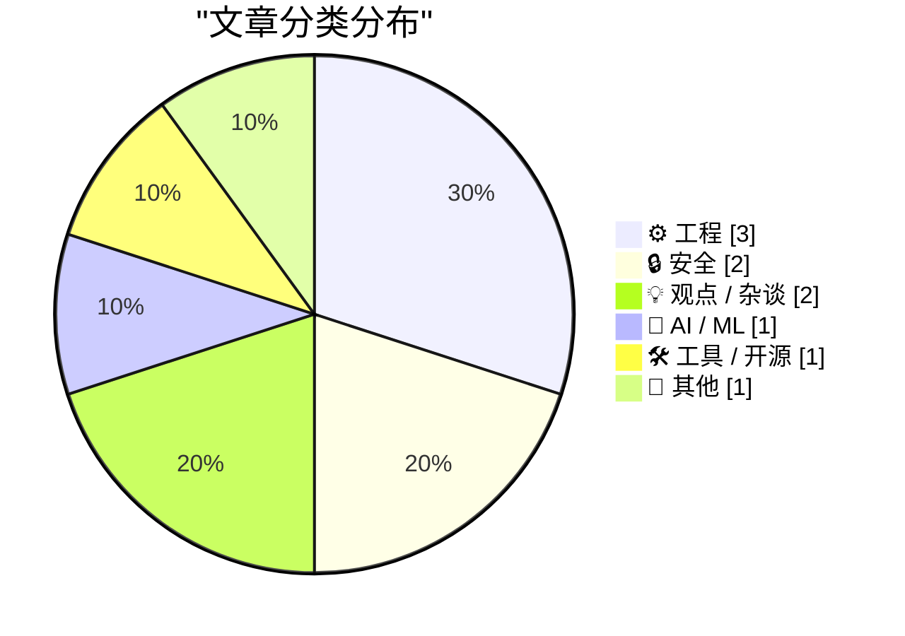
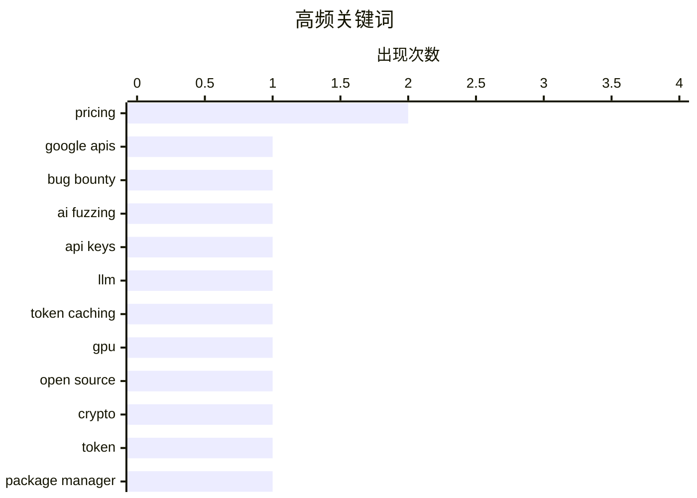

# 📰 AI 博客每日精选 — 2026-06-12

> 来自 Karpathy 推荐的 92 个顶级技术博客，AI 精选 Top 10

## 🏆 今日必读

🥇 **用 AI 入侵谷歌，赚到 50 万美元**

[Hacking Google with A.I. for $500,000](https://brutecat.com/articles/hacking-google-with-ai) — brutecat.com · 23 小时前 · 🔒 安全

> 围绕谷歌公开与内部 API 的大规模攻击面展开，核心目标是利用 discovery documents 和 API key 发现可访问的接口。作者先从 6 万多个 Android APK 中收集 API keys，再结合自建 API explorer 与 AI，对约 1,500 个 API 进行自动化探测。过程中重点处理了认证、origin 白名单、API key 限制、标准错误解析与多 key probing，以提高自动化 fuzz 的覆盖率和命中率。随后文章列出多类实际拿到的成果，包括 Google Voice ATO、AdExchange ATO、YouTube 未列公开视频泄漏、Widevine ATO、Nest 设备所有者去匿名化、Vertex AI Translation Hub、YouTube TV CMS、Cloud Console GraphQL、App Engine request logs、Vertex Assistant 和 Google Maps Platform billing credits 等。作者的核心结论是：把 AI 用在 Google API 规模化探测上，能显著放大研究效率，并最终带来 50 万美元漏洞奖金。

💡 **为什么值得读**: 能直接看到 AI 结合 API discovery docs 做大规模安全研究的具体打法，以及它如何落到真实漏洞和奖金收益上。

🏷️ Google APIs, bug bounty, AI fuzzing, API keys

🥈 **为什么 AI 服务中的缓存输入令牌更便宜？**

[Why are cached input tokens cheaper with AI services?](https://xeiaso.net/notes/2026/why-llm-cached-token-cheaper/) — xeiaso.net · 2026-06-12 · 🤖 AI / ML

> 核心问题是：为什么同样是输入 token，命中缓存时在大语言模型 API 中会显著更便宜。文中用持续增长的对话历史说明成本来源：每次请求都会把 `messages` 数组中的系统提示、用户消息、模型回复和工具调用一起送回模型，随着上下文变长，模型需要重新处理整段历史，推理成本也随之增加。作者给出的关键解释是，大语言模型推理虽然复杂，但对相同输入具有确定性，因此可以使用 KV caching（键值缓存）保存中间状态；实际服务里常见的是前缀缓存（prefix cache），这样当新请求只是沿着既有对话继续追加内容时，就不必重复处理已经算过的前缀。文中以 DeepSeek API 定价举例，`deepseek-chat` 的缓存命中输入价为每百万 token 0.07 美元、未命中为 0.27 美元，`deepseek-reasoner` 分别为 0.14 美元和 0.55 美元，说明高缓存命中率会带来非常明显的成本差异。结论很直接：缓存输入更便宜，不是因为 token 本身不同，而是因为 GPU 少做了重复计算。

💡 **为什么值得读**: 值得读在于它把 API 计费页里“缓存命中为什么更便宜”这个常见疑问，直接关联到对话重算、前缀缓存和 KV caching 的实际机制，能帮助你理解成本从哪里来。

🏷️ LLM, token caching, pricing, GPU

🥉 **tea.xyz 发生了什么**

[What Happened to tea.xyz](https://nesbitt.io/2026/06/11/what-happened-to-tea.html) — nesbitt.io · 13 小时前 · ⚙️ 工程

> tea.xyz 在 2026 年 6 月 4 日推出其自 2022 年起承诺的加密代币，目标是向开源维护者发放奖励，但代币开盘后一小时内较开盘价下跌 75%，一周后较首日高点跌去约 90%。项目最初由 Homebrew 作者 Max Howell 与 Timothy Lewis 创立，融资包括 2022 年 3 月由 Binance Labs 领投的 800 万美元，以及 2022 年 12 月的 890 万美元种子轮；其设想同时包含包管理器 tea CLI 和奖励开源维护者的区块链协议，后者在 2023 年 10 月与更名为 pkgx 的包管理器在组织上拆分。白皮书提出名为 Proof of Contribution 的机制，用 teaRank 按依赖图为包打分，明确参考 Google 的 PageRank，维护者通过在仓库中加入含钱包地址的 `tea.yaml` 领取奖励，奖励与控制的包数量及其依赖关系强相关。由于注册包名几乎没有成本、声明依赖只需在清单中加一行，这套激励设计很容易被伪造；2024 年 2 月激励测试网上线后，首周即报告近 20 万注册和 500 个项目，随后出现大量冒领他人仓库的 GitHub PR，以及 npm、PyPI、RubyGems、crates.io 上与 tea 相关的刷量发包，Phylum 和 Sonatype 都记录到异常增长。作者据 GitHub 提交历史、链上交易记录和包注册表痕迹串联出一条清晰线索：当奖励规则把“可批量伪造的贡献信号”直接映射为代币收益时，系统很快就会被刷子占满，而项目上线后的市场表现与仓库活跃度也进一步印证了这一点。

💡 **为什么值得读**: 值得读在于它把代币激励、开源生态和包注册表滥用放在同一条证据链里，能帮助读者具体理解一个激励机制为何会在真实系统中迅速被利用。

🏷️ open source, crypto, token, package manager

---

## 📊 数据概览

| 扫描源 | 抓取文章 | 时间范围 | 精选 |
|:---:|:---:|:---:|:---:|
| 86/92 | 2544 篇 → 22 篇 | 24h | **10 篇** |

### 分类分布



### 高频关键词



<details>
<summary>📈 纯文本关键词图（终端友好）</summary>

```
pricing       │ ████████████████████ 2
google apis   │ ██████████░░░░░░░░░░ 1
bug bounty    │ ██████████░░░░░░░░░░ 1
ai fuzzing    │ ██████████░░░░░░░░░░ 1
api keys      │ ██████████░░░░░░░░░░ 1
llm           │ ██████████░░░░░░░░░░ 1
token caching │ ██████████░░░░░░░░░░ 1
gpu           │ ██████████░░░░░░░░░░ 1
open source   │ ██████████░░░░░░░░░░ 1
crypto        │ ██████████░░░░░░░░░░ 1
```

</details>

### 🏷️ 话题标签

**pricing**(2) · **google apis**(1) · **bug bounty**(1) · ai fuzzing(1) · api keys(1) · llm(1) · token caching(1) · gpu(1) · open source(1) · crypto(1) · token(1) · package manager(1) · section 230(1) · liability(1) · ai companies(1) · law(1) · windows(1) · callbacks(1) · deadlock(1) · kernel(1)

---

## ⚙️ 工程

### 1. tea.xyz 发生了什么

[What Happened to tea.xyz](https://nesbitt.io/2026/06/11/what-happened-to-tea.html) — **nesbitt.io** · 13 小时前 · ⭐ 22/30

> tea.xyz 在 2026 年 6 月 4 日推出其自 2022 年起承诺的加密代币，目标是向开源维护者发放奖励，但代币开盘后一小时内较开盘价下跌 75%，一周后较首日高点跌去约 90%。项目最初由 Homebrew 作者 Max Howell 与 Timothy Lewis 创立，融资包括 2022 年 3 月由 Binance Labs 领投的 800 万美元，以及 2022 年 12 月的 890 万美元种子轮；其设想同时包含包管理器 tea CLI 和奖励开源维护者的区块链协议，后者在 2023 年 10 月与更名为 pkgx 的包管理器在组织上拆分。白皮书提出名为 Proof of Contribution 的机制，用 teaRank 按依赖图为包打分，明确参考 Google 的 PageRank，维护者通过在仓库中加入含钱包地址的 `tea.yaml` 领取奖励，奖励与控制的包数量及其依赖关系强相关。由于注册包名几乎没有成本、声明依赖只需在清单中加一行，这套激励设计很容易被伪造；2024 年 2 月激励测试网上线后，首周即报告近 20 万注册和 500 个项目，随后出现大量冒领他人仓库的 GitHub PR，以及 npm、PyPI、RubyGems、crates.io 上与 tea 相关的刷量发包，Phylum 和 Sonatype 都记录到异常增长。作者据 GitHub 提交历史、链上交易记录和包注册表痕迹串联出一条清晰线索：当奖励规则把“可批量伪造的贡献信号”直接映射为代币收益时，系统很快就会被刷子占满，而项目上线后的市场表现与仓库活跃度也进一步印证了这一点。

🏷️ open source, crypto, token, package manager

---

### 2. 试图绕过规则时，先理解规则背后的原因

[Understanding the rationale behind a rule when trying to circumvent it](https://devblogs.microsoft.com/oldnewthing/20260611-00/?p=112415) — **devblogs.microsoft.com/oldnewthing** · 9 小时前 · ⭐ 19/30

> 话题聚焦于 Windows 进程、线程和镜像相关回调函数为什么必须“短小且快速返回”，以及对这类规则的常见误解。文中列出的限制包括不要调用用户态服务、不要访问注册表、不要进行阻塞或 IPC 调用、不要与其他线程同步，并建议把慢操作转交给 System Worker Threads 异步处理。问题出在一些驱动虽然把工作排队到 System Worker Thread，却又在回调里等待工作项完成，看似遵守了“转移工作”的建议，实际仍然把回调变成了同步阻塞点，甚至可能导致重入死锁和系统挂起。作者强调，这些“不要做”的条目并不是可钻空子的字面清单，而是在说明任何会让回调长时间阻塞的做法都不应该出现；2020 年文档也明确补充了“使用 System Worker Threads 时不要等待其完成”。

🏷️ Windows, callbacks, deadlock, kernel

---

### 3. Formally proving a calculation with Claude and Lean

[Formally proving a calculation with Claude and Lean](https://www.johndcook.com/blog/2026/06/10/claude-and-lean/) — **johndcook.com** · 23 小时前 · ⭐ 16/30

> I ran an experiment today to see whether Claude [1] could generate Lean code to prove a calculation at the bottom of this post , six lines of calculus. I started with this prompt This page contains a 

🏷️ Claude, Lean, formal proof, mathlib

---

## 🔒 安全

### 4. 用 AI 入侵谷歌，赚到 50 万美元

[Hacking Google with A.I. for $500,000](https://brutecat.com/articles/hacking-google-with-ai) — **brutecat.com** · 23 小时前 · ⭐ 28/30

> 围绕谷歌公开与内部 API 的大规模攻击面展开，核心目标是利用 discovery documents 和 API key 发现可访问的接口。作者先从 6 万多个 Android APK 中收集 API keys，再结合自建 API explorer 与 AI，对约 1,500 个 API 进行自动化探测。过程中重点处理了认证、origin 白名单、API key 限制、标准错误解析与多 key probing，以提高自动化 fuzz 的覆盖率和命中率。随后文章列出多类实际拿到的成果，包括 Google Voice ATO、AdExchange ATO、YouTube 未列公开视频泄漏、Widevine ATO、Nest 设备所有者去匿名化、Vertex AI Translation Hub、YouTube TV CMS、Cloud Console GraphQL、App Engine request logs、Vertex Assistant 和 Google Maps Platform billing credits 等。作者的核心结论是：把 AI 用在 Google API 规模化探测上，能显著放大研究效率，并最终带来 50 万美元漏洞奖金。

🏷️ Google APIs, bug bounty, AI fuzzing, API keys

---

### 5. 也许《230条款》终究不会让 AI 公司免于责任

[Maybe Section 230 doesn’t shield AI companies from liability, after all](https://garymarcus.substack.com/p/maybe-section-230-doesnt-shield-ai) — **garymarcus.substack.com** · 21 小时前 · ⭐ 20/30

> 围绕美国《通信规范法》第230条是否能保护 AI 公司免于责任，文章把它和社交媒体时代的免责逻辑放在一起比较。作者指出，230条长期让社交媒体公司免于责任，而这一问题在 2023 年美国参议院听证会上就已被拿来讨论，Sam Altman 也承认生成式 AI 可能需要新的责任框架。文章进一步提到，OpenAI 近期还支持了伊利诺伊州的一项州法律，内容是为 AI 实验室在模型被用于造成严重社会危害时提供免责保护。作者借德国最新裁决引出判断，认为 AI 公司未必像它们希望的那样能被 Section 230 挡住。核心观点是，围绕 AI 责任边界的法律框架仍在重写，而且结果可能会颠覆现有预期。

🏷️ Section 230, liability, AI companies, law

---

## 💡 观点 / 杂谈

### 6. 突发：OpenAI 正在考虑“大幅”降价，而这暴露出其弱势

[Breaking: OpenAI is pondering “drastic” price cuts.](https://garymarcus.substack.com/p/breaking-openai-is-pondering-drastic) — **garymarcus.substack.com** · 9 小时前 · ⭐ 18/30

> 文章围绕《华尔街日报》披露的消息展开：OpenAI 正在考虑大幅下调价格。Gary Marcus 认为，这一动向并不意外，并将其视为公司处于弱势的信号。文中把这条消息与他在 2024 年 1 月写下的 OpenAI 预检讨分析相呼应，称此事与当时列出的第三点判断“完全吻合”。由于正文在付费墙之后，公开部分没有展开具体的降价方案、幅度或更多证据。整体可见的核心立场是：OpenAI 的潜在激进降价，被作者解读为竞争压力或经营态势转弱的表现。

🏷️ OpenAI, pricing, competition, strategy

---

### 7. AI will be massively deflationary

[AI will be massively deflationary](https://geohot.github.io//blog/jekyll/update/2026/06/11/ai-will-be-deflationary.html) — **geohot.github.io** · 16 小时前 · ⭐ 18/30

> The funny thing about Anthropic haters is that they still mostly believe Anthropic’s marketing. They think Claude is a recursively self-improving silicon God, and that we are all a couple refusals awa

🏷️ Anthropic, AI economics, deflation, compute

---

## 🤖 AI / ML

### 8. 为什么 AI 服务中的缓存输入令牌更便宜？

[Why are cached input tokens cheaper with AI services?](https://xeiaso.net/notes/2026/why-llm-cached-token-cheaper/) — **xeiaso.net** · 2026-06-12 · ⭐ 23/30

> 核心问题是：为什么同样是输入 token，命中缓存时在大语言模型 API 中会显著更便宜。文中用持续增长的对话历史说明成本来源：每次请求都会把 `messages` 数组中的系统提示、用户消息、模型回复和工具调用一起送回模型，随着上下文变长，模型需要重新处理整段历史，推理成本也随之增加。作者给出的关键解释是，大语言模型推理虽然复杂，但对相同输入具有确定性，因此可以使用 KV caching（键值缓存）保存中间状态；实际服务里常见的是前缀缓存（prefix cache），这样当新请求只是沿着既有对话继续追加内容时，就不必重复处理已经算过的前缀。文中以 DeepSeek API 定价举例，`deepseek-chat` 的缓存命中输入价为每百万 token 0.07 美元、未命中为 0.27 美元，`deepseek-reasoner` 分别为 0.14 美元和 0.55 美元，说明高缓存命中率会带来非常明显的成本差异。结论很直接：缓存输入更便宜，不是因为 token 本身不同，而是因为 GPU 少做了重复计算。

🏷️ LLM, token caching, pricing, GPU

---

## 🛠 工具 / 开源

### 9. My Portable Heater

[My Portable Heater](https://feed.tedium.co/link/15204/17359582/gigabyte-aorus-5060-ti-ai-box-egpu-review) — **tedium.co** · 19 小时前 · ⭐ 18/30

> My Portable Heater This new eGPU barely works in Linux, gets quite hot, and is based on tech gamers already rejected. So why am I so excited about it? By Ernie Smith • June 10, 2026 https://static.ted

🏷️ eGPU, Nvidia, local LLM, Thunderbolt

---

## 📝 其他

### 10. Claude Fable is relentlessly proactive

[Claude Fable is relentlessly proactive](https://simonwillison.net/2026/Jun/11/fable-is-relentlessly-proactive/#atom-everything) — **simonwillison.net** · 刚刚 · ⭐ 15/30

> Simon Willison’s Weblog Subscribe Sponsored by: Teleport &mdash; Prevent access bottlenecks. Unify identity. Teleport replaces fragmented identity and access tooling with a single identity layer that 

---

*生成于 2026-06-12 07:00 | 扫描 86 源 → 获取 2544 篇 → 精选 10 篇*
*基于 [Hacker News Popularity Contest 2025](https://refactoringenglish.com/tools/hn-popularity/) RSS 源列表*
