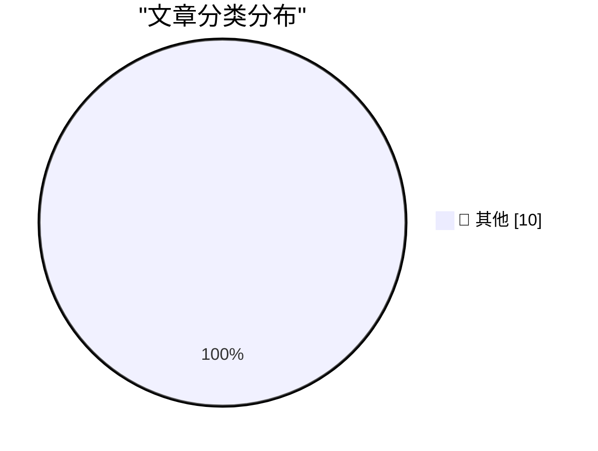

# 📰 AI 博客每日精选 — 2026-06-12

> 来自 Karpathy 推荐的 92 个顶级技术博客，AI 精选 Top 10

## 🏆 今日必读

🥇 **Why are cached input tokens cheaper with AI services?**

[Why are cached input tokens cheaper with AI services?](https://xeiaso.net/notes/2026/why-llm-cached-token-cheaper/) — xeiaso.net · 2026-06-12 · 📝 其他

> Why are cached input tokens cheaper with AI services? Published on 2026-06-12 , 761 words, 3 minutes to read TL;DR: the GPU doesn't have to math as hard When you see AI model pricing pages, you usuall

🥈 **Claude Fable is relentlessly proactive**

[Claude Fable is relentlessly proactive](https://simonwillison.net/2026/Jun/11/fable-is-relentlessly-proactive/#atom-everything) — simonwillison.net · 刚刚 · 📝 其他

> Simon Willison’s Weblog Subscribe Sponsored by: Teleport &mdash; Prevent access bottlenecks. Unify identity. Teleport replaces fragmented identity and access tooling with a single identity layer that 

🥉 **datasette 1.0a33**

[datasette 1.0a33](https://simonwillison.net/2026/Jun/11/datasette/#atom-everything) — simonwillison.net · 7 小时前 · 📝 其他

> Simon Willison’s Weblog Subscribe Sponsored by: Teleport &mdash; Prevent access bottlenecks. Unify identity. Teleport replaces fragmented identity and access tooling with a single identity layer that 

---

## 📊 数据概览

| 扫描源 | 抓取文章 | 时间范围 | 精选 |
|:---:|:---:|:---:|:---:|
| 87/92 | 2564 篇 → 22 篇 | 24h | **10 篇** |

### 分类分布

---

## 📝 其他

### 1. Why are cached input tokens cheaper with AI services?

[Why are cached input tokens cheaper with AI services?](https://xeiaso.net/notes/2026/why-llm-cached-token-cheaper/) — **xeiaso.net** · 2026-06-12 · ⭐ 15/30

> Why are cached input tokens cheaper with AI services? Published on 2026-06-12 , 761 words, 3 minutes to read TL;DR: the GPU doesn't have to math as hard When you see AI model pricing pages, you usuall

---

### 2. Claude Fable is relentlessly proactive

[Claude Fable is relentlessly proactive](https://simonwillison.net/2026/Jun/11/fable-is-relentlessly-proactive/#atom-everything) — **simonwillison.net** · 刚刚 · ⭐ 15/30

> Simon Willison’s Weblog Subscribe Sponsored by: Teleport &mdash; Prevent access bottlenecks. Unify identity. Teleport replaces fragmented identity and access tooling with a single identity layer that 

---

### 3. datasette 1.0a33

[datasette 1.0a33](https://simonwillison.net/2026/Jun/11/datasette/#atom-everything) — **simonwillison.net** · 7 小时前 · ⭐ 15/30

> Simon Willison’s Weblog Subscribe Sponsored by: Teleport &mdash; Prevent access bottlenecks. Unify identity. Teleport replaces fragmented identity and access tooling with a single identity layer that 

---

### 4. Pluralistic: The world has moved on (11 Jun 2026)

[Pluralistic: The world has moved on (11 Jun 2026)](https://pluralistic.net/2026/06/11/lapsarianism/) — **pluralistic.net** · 8 小时前 · ⭐ 15/30

> ->->->->->->->->->->->->->->->->->->->->->->->->->->->->-> Top Sources: None --> Today's links The world has moved on : Notes from the enshittocene. Hey look at this : Delights to delectate. Object pe

---

### 5. Understanding the rationale behind a rule when trying to circumvent it

[Understanding the rationale behind a rule when trying to circumvent it](https://devblogs.microsoft.com/oldnewthing/20260611-00/?p=112415) — **devblogs.microsoft.com/oldnewthing** · 9 小时前 · ⭐ 15/30

> In the documentation for best practices for implementing process and thread-related callback functions , it calls out Keep routines short and simple. Don’t make calls into a user mode service to valid

---

### 6. Breaking: OpenAI is pondering “drastic” price cuts.

[Breaking: OpenAI is pondering “drastic” price cuts.](https://garymarcus.substack.com/p/breaking-openai-is-pondering-drastic) — **garymarcus.substack.com** · 9 小时前 · ⭐ 15/30

> Breaking: OpenAI is pondering “drastic” price cuts. And that’s a sign of weakness Gary Marcus Jun 11, 2026 ∙ Paid 149 23 11 Share Gary Marcus @GaryMarcus 🚨 OpenAI pondering big price cuts, per WSJ sc

---

### 7. Solving a chess puzzle with Claude and Prolog

[Solving a chess puzzle with Claude and Prolog](https://www.johndcook.com/blog/2026/06/11/prolog-claude/) — **johndcook.com** · 9 小时前 · ⭐ 15/30

> Prolog is the original logic programming language. The name comes from pro gramming in log ic. More specifically, the name comes from pro grammation en log ique because the inventor of the language, P

---

### 8. Biological Evolution and Information Acquisition

[Biological Evolution and Information Acquisition](https://www.construction-physics.com/p/biological-evolution-and-information) — **construction-physics.com** · 10 小时前 · ⭐ 15/30

> Biological Evolution and Information Acquisition Brian Potter Jun 11, 2026 125 6 4 Share A few weeks ago we looked at a simulation of technological evolution by economist Brian Arthur, in which he was

---

### 9. The failed 3Com and US Robotics merger

[The failed 3Com and US Robotics merger](https://dfarq.homeip.net/the-failed-3com-and-us-robotics-merger/?utm_source=rss&#038;utm_medium=rss&#038;utm_campaign=the-failed-3com-and-us-robotics-merger) — **dfarq.homeip.net** · 11 小时前 · ⭐ 15/30

> On June 12, 1997, 3Com and US Robotics merged at a cost of $8.5 billion. At the time, it was the merger of the two biggest names in their respective fields, and it seemed poised to become a telecommun

---

### 10. What Happened to tea.xyz

[What Happened to tea.xyz](https://nesbitt.io/2026/06/11/what-happened-to-tea.html) — **nesbitt.io** · 13 小时前 · ⭐ 15/30

> On June 4th, tea.xyz launched what it had been promising since 2022: a cryptocurrency that pays open source maintainers. Within the first hour of official trading, the token fell 75% from its opening 

---

*生成于 2026-06-12 07:00 | 扫描 87 源 → 获取 2564 篇 → 精选 10 篇*
*基于 [Hacker News Popularity Contest 2025](https://refactoringenglish.com/tools/hn-popularity/) RSS 源列表*
