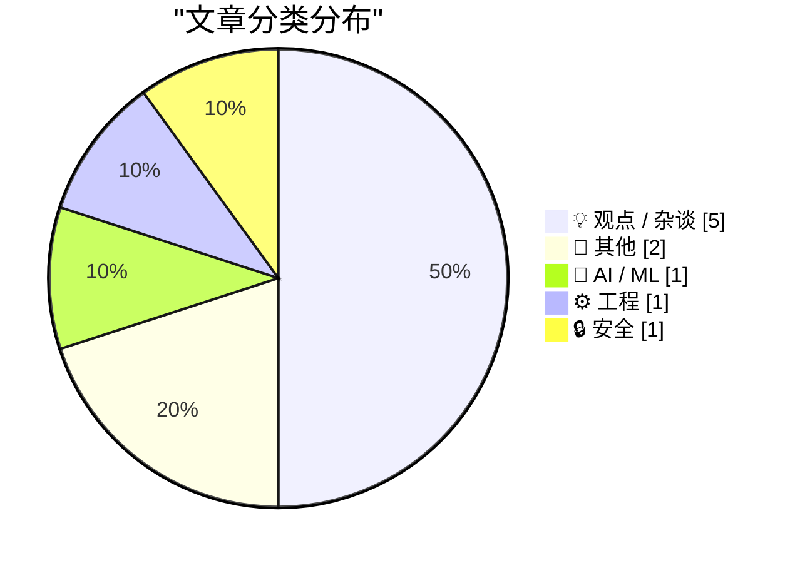
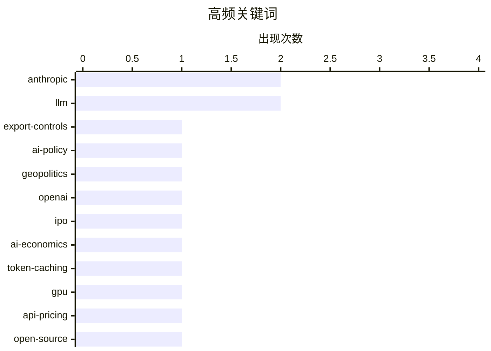

# 📰 AI 博客每日精选 — 2026-06-13

> 来自 Karpathy 推荐的 92 个顶级技术博客，AI 精选 Top 10

## 📝 今日看点

今天技术圈的主线，正在从“AI 能做什么”转向“谁能拥有、谁来买单、谁来收拾后果”。一边，美国对前沿模型访问收紧、资本市场又催促 OpenAI 和 Anthropic 讲出盈利故事，说明 AI 已同时进入地缘政治和金融博弈的深水区。另一边，围绕缓存计费、实时音频接入文档上下文等工程实践，行业仍在拼命把大模型服务做得更便宜、更快、更可落地。与此同时，AI 生成内容对开源协作、技术写作和公共信息质量的冲击持续发酵，治理规则与人类审查成本正成为无法回避的新议题。

---

## 🏆 今日必读

🥇 **仅限美国人的危险技术**

[Dangerous Technology For Americans Only](https://lucumr.pocoo.org/2026/6/13/americans-only/) — lucumr.pocoo.org · 2026-06-13 · 💡 观点 / 杂谈

> 美国政府对 Anthropic 下达出口管制指令，要求暂停外国人访问 Fable 和 Mythos，争议的焦点不只是企业先前的“安全”叙事反噬自身，而是政府正在划出“这项技术强大到只有美国人才能拥有”的边界。文中指出，这项限制适用于无论身处美国境内还是境外的外国人，甚至包括 Anthropic 的外籍员工，意味着界线已经从“不要卖给敌对政府”转向“以国籍本身作为限制标准”。作者认为，美国 AI 安全话语表面上诉诸人类共同风险、负责任部署和防护措施，但一谈到监管就不断滑向国家安全逻辑，隐含的是美国拥有道德优越性、他国“不值得信任”的前提。文章进一步强调，这不仅是能力控制问题，也涉及种族主义与民族主义；对欧洲而言，这不是单靠监管就能解决的议题，因为 regulation 无法替代技术能力，而欧洲恰恰缺少这种能力基础。结论是，欧洲和所有非美国公民都应把这类政策视为权力划界的警讯，而不是把注意力停留在对 Anthropic 遭遇的嘲讽上。

💡 **为什么值得读**: 它把 AI“安全监管”与国籍、权力和技术主权之间的关系挑明了，能帮助读者看清出口管制背后的真实分界线。

🏷️ Anthropic, export-controls, AI-policy, geopolitics

🥈 **付费：硅谷泡沫（上）**

[Premium: The Silicon Valley Bubble (Part 1)](https://www.wheresyoured.at/premium-the-silicon-valley-bubble-part-1/) — wheresyoured.at · 5 小时前 · 💡 观点 / 杂谈

> 文章围绕 OpenAI 和 Anthropic 启动上市准备这一动向，质疑当前 AI 实验室的商业模式与资本结构是否成立。作者认为，这两家公司每年烧掉数十亿美元，却看不到清晰的盈利路径，上市更像是在为持续融资和退出流动性铺路。文中引用的信息显示，OpenAI 预计将在未来一年内上市，同时因算力和基础设施扩张需要巨大资本，未来四年据称需要 8650 亿美元来履行承诺；Anthropic 也承认训练 AI 模型是资本密集型业务，认为公开市场适合这类融资需求。与此同时，Anthropic 在与 Broadcom 和 Google 相关的 350 亿美元交易、以及最终 44 亿美元票据融资中，被指出对部分贷款方未充分披露财务信息，进一步强化了作者对其财务状况的怀疑。结论是，作者不看好这两家 AI 公司的基础经济性，认为它们对公开市场的依赖暴露了行业泡沫化和不可持续的一面。

💡 **为什么值得读**: 值得读的地方在于，它把 AI 巨头的上市、融资、算力投入和财务披露问题放在一起审视，能帮助读者快速理解“高增长叙事”背后的资本压力。

🏷️ OpenAI, Anthropic, IPO, AI-economics

🥉 **为什么 AI 服务中的缓存输入令牌更便宜？**

[Why are cached input tokens cheaper with AI services?](https://xeiaso.net/notes/2026/why-llm-cached-token-cheaper/) — xeiaso.net · 23 小时前 · 🤖 AI / ML

> 核心问题是：AI 服务里“缓存命中的输入 tokens”为什么会比未命中的输入 tokens 便宜得多。文章用对话式 API 的 `messages` 数组说明，随着系统提示、用户消息、模型回复和工具调用不断累积，模型每次生成新回复前都要重新处理更长的上下文，因此输入成本会持续上升。作者给出的关键解释是，大语言模型推理虽然复杂，但对相同输入是确定性的，所以服务端可以使用 `key-value caching`，通常是前缀缓存（prefix cache），把已经处理过的上下文中间状态保存下来。这样在后续请求里，只要前面的内容没变，模型就不必从头重新计算整段历史，只需要在已缓存的前缀基础上继续处理新增部分。结论是，缓存输入之所以便宜，不是因为 tokens 变了，而是因为 GPU 少做了重复计算，这也是缓存命中能带来显著费用节省的原因。

💡 **为什么值得读**: 值得读，因为它用对话上下文和 `KV cache` 的直观类比，把 AI 计费页里最容易让人困惑的“缓存命中为何更便宜”解释清楚了。

🏷️ LLM, token-caching, GPU, API-pricing

---

## 📊 数据概览

| 扫描源 | 抓取文章 | 时间范围 | 精选 |
|:---:|:---:|:---:|:---:|
| 87/92 | 2565 篇 → 21 篇 | 24h | **10 篇** |

### 分类分布



### 高频关键词



<details>
<summary>📈 纯文本关键词图（终端友好）</summary>

```
anthropic       │ ████████████████████ 2
llm             │ ████████████████████ 2
export-controls │ ██████████░░░░░░░░░░ 1
ai-policy       │ ██████████░░░░░░░░░░ 1
geopolitics     │ ██████████░░░░░░░░░░ 1
openai          │ ██████████░░░░░░░░░░ 1
ipo             │ ██████████░░░░░░░░░░ 1
ai-economics    │ ██████████░░░░░░░░░░ 1
token-caching   │ ██████████░░░░░░░░░░ 1
gpu             │ ██████████░░░░░░░░░░ 1
```

</details>

### 🏷️ 话题标签

**anthropic**(2) · **llm**(2) · **export-controls**(1) · ai-policy(1) · geopolitics(1) · openai(1) · ipo(1) · ai-economics(1) · token-caching(1) · gpu(1) · api-pricing(1) · open-source(1) · pull-requests(1) · code-review(1) · thread-pool(1) · latency(1) · windows(1) · concurrency(1) · ai-writing(1) · authorship(1)

---

## 💡 观点 / 杂谈

### 1. 仅限美国人的危险技术

[Dangerous Technology For Americans Only](https://lucumr.pocoo.org/2026/6/13/americans-only/) — **lucumr.pocoo.org** · 2026-06-13 · ⭐ 25/30

> 美国政府对 Anthropic 下达出口管制指令，要求暂停外国人访问 Fable 和 Mythos，争议的焦点不只是企业先前的“安全”叙事反噬自身，而是政府正在划出“这项技术强大到只有美国人才能拥有”的边界。文中指出，这项限制适用于无论身处美国境内还是境外的外国人，甚至包括 Anthropic 的外籍员工，意味着界线已经从“不要卖给敌对政府”转向“以国籍本身作为限制标准”。作者认为，美国 AI 安全话语表面上诉诸人类共同风险、负责任部署和防护措施，但一谈到监管就不断滑向国家安全逻辑，隐含的是美国拥有道德优越性、他国“不值得信任”的前提。文章进一步强调，这不仅是能力控制问题，也涉及种族主义与民族主义；对欧洲而言，这不是单靠监管就能解决的议题，因为 regulation 无法替代技术能力，而欧洲恰恰缺少这种能力基础。结论是，欧洲和所有非美国公民都应把这类政策视为权力划界的警讯，而不是把注意力停留在对 Anthropic 遭遇的嘲讽上。

🏷️ Anthropic, export-controls, AI-policy, geopolitics

---

### 2. 付费：硅谷泡沫（上）

[Premium: The Silicon Valley Bubble (Part 1)](https://www.wheresyoured.at/premium-the-silicon-valley-bubble-part-1/) — **wheresyoured.at** · 5 小时前 · ⭐ 25/30

> 文章围绕 OpenAI 和 Anthropic 启动上市准备这一动向，质疑当前 AI 实验室的商业模式与资本结构是否成立。作者认为，这两家公司每年烧掉数十亿美元，却看不到清晰的盈利路径，上市更像是在为持续融资和退出流动性铺路。文中引用的信息显示，OpenAI 预计将在未来一年内上市，同时因算力和基础设施扩张需要巨大资本，未来四年据称需要 8650 亿美元来履行承诺；Anthropic 也承认训练 AI 模型是资本密集型业务，认为公开市场适合这类融资需求。与此同时，Anthropic 在与 Broadcom 和 Google 相关的 350 亿美元交易、以及最终 44 亿美元票据融资中，被指出对部分贷款方未充分披露财务信息，进一步强化了作者对其财务状况的怀疑。结论是，作者不看好这两家 AI 公司的基础经济性，认为它们对公开市场的依赖暴露了行业泡沫化和不可持续的一面。

🏷️ OpenAI, Anthropic, IPO, AI-economics

---

### 3. 我不是反向半人马

[I Am Not a Reverse Centaur](https://blog.miguelgrinberg.com/post/i-am-not-a-reverse-centaur) — **miguelgrinberg.com** · 13 小时前 · ⭐ 23/30

> 作者的核心焦虑是，开源项目里几乎所有新增贡献如今都带有 LLM 痕迹，维护者被迫把越来越多时间花在审查和合并机器生成代码上。文中借用 Cory Doctorow 的“反向半人马”说法，指人类沦为替冷漠而高强度运转的机器做收尾与把关的人，这正是作者明确拒绝接受的角色。作者认为，过去令人兴奋的陌生人主动 PR，如今往往变成红旗：有人只是让代码生成工具按自身需求改动项目，再附上一段冗长的 LLM 式描述，把判断改动是否合理、是否影响其他用户的负担丢给维护者。为抵制这种趋势，他强调贡献者必须先通过 issue 与维护者讨论变更，只有在提案被接受后再提交 PR，以确认贡献者本人真正理解并关心项目改进。结论是，作者不会把自己的工程经验消耗在替 LLM 产出的代码做低价值审稿上，而是用更严格的贡献流程保护维护工作的边界。

🏷️ LLM, open-source, pull-requests, code-review

---

### 4. 机器文字的人类路由器

[Human Routers of Machine Words](https://borretti.me/article/human-routers-of-machine-words) — **borretti.me** · 2026-06-13 · ⭐ 20/30

> 作者强烈批评用 AI 代写博客文章和 GitHub README，认为这不仅是在欺骗读者，也是在把低质量内容倾倒进公共空间。针对“想法是我的，文字是 AI 写的”这种辩护，文章指出这把“思想”和“写作”人为拆开了，但读者真正能接触、判断和讨论的只有最终写出来的文字。文中进一步强调，人的想法并不是现成、清晰、类似逻辑命题的完备结构，而是混杂着记忆、直觉和情绪的模糊集合。把这些模糊想法写出来的过程，本身就是澄清概念、暴露矛盾、补足缺漏的过程，因此写作不是可有可无的包装，而是思考的一部分。结论是，用 AI 替代写作，不只是把表达外包出去，也是在放弃把想法打磨成可检验内容的关键环节。

🏷️ AI-writing, authorship, content-quality, culture

---

### 5. 再没有比这更 2026 的了

[You can’t get more 2026 than that](https://garymarcus.substack.com/p/you-cant-get-more-2026-than-that) — **garymarcus.substack.com** · 9 小时前 · ⭐ 16/30

> 内容围绕三个新例子，呈现 AI 发展到 2026 年时“已经走了多远、又还有哪些地方没有真正进步”。其中最明确的案例来自 Anne Applebaum 转发的信息：毕马威发布了一份描述企业成功使用 AI 的报告，但其中案例研究本身却被曝是 AI 幻觉。文中还补充提到来自 404 Media 的后续例子，以及 Valerio Capraro 提供的另一个相关案例，三者共同构成作者要强调的现实反差。整体基调不是单纯庆祝进展，而是用这些最新事件指出，AI 的实际表现与外界叙事之间仍存在明显落差。作者借这些例子强调，到了 2026 年，AI 一边被广泛采用，一边仍反复暴露出幻觉和可靠性问题。

🏷️ AI-hallucination, KPMG, case-studies, critique

---

## 📝 其他

### 6. 为自制真空管制作玻璃-金属密封

[Making glass-to-metal seals for homemade vacuum tubes.](https://maurycyz.com/projects/glass/1/) — **maurycyz.com** · 2026-06-13 · ⭐ 15/30

> 主题聚焦于如何在自制真空管中实现硼硅玻璃与金属电极的气密穿封。现成玻璃管本身容易抽真空并封口，作者用旋片泵和加热收口做出了可长期保真空的玻璃安瓿，并通过高压交流下残余气体发光验证真空质量已接近可用于三极管等器件。真正困难出在金属穿玻璃的接头：铜的氧化层虽与玻璃结合很好，但铜与硼硅玻璃的热膨胀差异很大，玻璃在约 800 °C 以下每降 1 度收缩约 3 μm/m，铜则收缩 17 μm/m，冷却到室温后金属比周围玻璃小约 1%，最终导致接头开裂漏气。作者转而比较与硼硅玻璃更匹配的钨、钼和更常见的钢丝，并指出钢在热玻璃中会因含碳生成一氧化碳，因此尝试只让镀铜层而非钢基体接触玻璃。使用氨存在下的电镀铜方案，可在铁丝表面以 20 mA 数秒形成较好的铜层，得到无气泡封接，但冷却后仍然失效，说明问题尚未完全解决。

---

### 7. OpenAI WebRTC 音频会话：现在支持文档上下文

[OpenAI WebRTC Audio Session, now with document context](https://simonwillison.net/2026/Jun/12/openai-webrtc/#atom-everything) — **simonwillison.net** · 刚刚 · ⭐ 15/30

> 这次更新围绕一个基于 OpenAI WebRTC API 的浏览器端语音交互工具展开，重点是把实时音频对话与文档上下文结合起来。这个工具最早于 2024 年 12 月构建，用来试验当时刚推出的 OpenAI 实时音频模型接口。现在它新增了对 GPT‑Realtime‑2 的选择支持；OpenAI 将该模型描述为“首个具备 GPT‑5 级推理能力的语音模型”，知识截止时间为 2024 年 9 月 30 日。除了模型升级，工具还支持粘贴大段文档内容作为上下文，让用户直接在浏览器里围绕指定信息进行语音对话式探索。作者因此重新启用了旧的实验场，方向是把更强的实时语音模型和外部文档语境结合到同一交互流程中。

---

## 🤖 AI / ML

### 8. 为什么 AI 服务中的缓存输入令牌更便宜？

[Why are cached input tokens cheaper with AI services?](https://xeiaso.net/notes/2026/why-llm-cached-token-cheaper/) — **xeiaso.net** · 23 小时前 · ⭐ 24/30

> 核心问题是：AI 服务里“缓存命中的输入 tokens”为什么会比未命中的输入 tokens 便宜得多。文章用对话式 API 的 `messages` 数组说明，随着系统提示、用户消息、模型回复和工具调用不断累积，模型每次生成新回复前都要重新处理更长的上下文，因此输入成本会持续上升。作者给出的关键解释是，大语言模型推理虽然复杂，但对相同输入是确定性的，所以服务端可以使用 `key-value caching`，通常是前缀缓存（prefix cache），把已经处理过的上下文中间状态保存下来。这样在后续请求里，只要前面的内容没变，模型就不必从头重新计算整段历史，只需要在已缓存的前缀基础上继续处理新增部分。结论是，缓存输入之所以便宜，不是因为 tokens 变了，而是因为 GPU 少做了重复计算，这也是缓存命中能带来显著费用节省的原因。

🏷️ LLM, token-caching, GPU, API-pricing

---

## ⚙️ 工程

### 9. 如何在线程池上以低延迟调度工作？

[How can I schedule work on a thread pool with low latency?](https://devblogs.microsoft.com/oldnewthing/20260612-00/?p=112417) — **devblogs.microsoft.com/oldnewthing** · 9 小时前 · ⭐ 21/30

> 场景中的硬件设备回调必须尽快返回，否则由于设备缓冲区很小，处理过慢会导致缓冲区溢出并丢失数据。把数据处理工作排入默认线程池后，任务有时会出现约 100ms 的调度延迟，无法满足 20ms 内完成处理的需求，而且线程池本身面向吞吐量而非低延迟，也不支持为工作项设置截止时间。延迟的一个重要原因是默认线程池里还有其他无关任务竞争队列和线程，其中长时间运行的任务还会长时间占用线程。可行做法是使用 `CreateThreadPool` 创建私有线程池，并通过回调环境把工作项提交到这个私有线程池，从而避开默认线程池中的队列竞争；如果批次处理顺序很重要，可将最大线程数设为 1，让任务串行执行。进一步还可以预先创建可复用的工作项，使回调里只做入队数据和调用 `SubmitThreadpoolWork`，本质上相当于做了一个把簿记工作交给线程池管理的专用工作线程。

🏷️ thread-pool, latency, Windows, concurrency

---

## 🔒 安全

### 10. 关于漏洞命名与披露的联合指南

[Joint Guidance on Vulnerability Naming and Disclosure](https://nesbitt.io/2026/06/12/joint-guidance-on-vulnerability-naming-and-disclosure.html) — **nesbitt.io** · 13 小时前 · ⭐ 18/30

> 一套由 Vulnerability Naming Authority、CVE Numbering Authority 联盟和美国国家电信与信息管理局协调发布的统一流程，试图规范具名漏洞的命名、注册和披露。流程要求为每个具名漏洞建立结构化记录，包含单音节主名称、可选拉丁语后缀、唯一 SVG 标志、保留色板中的颜色以及适合幻灯片的一行描述，并在分配前与去冲突数据库比对；仅使用 CVE 编号而不另起名称的漏洞不在范围内。去冲突数据库预置了 Heartbleed、Shellshock、Spectre、Log4Shell 等既有漏洞名称，并每天从 vulnerability.garden 导入新增条目；名称冲突会追加数字后缀，商标冲突会改名，若与药品名称冲突则转交裁定。.vuln 顶级域被分配给该机构后，美国境内总部实体若以英文博客公开披露此前未发布的 CVE，需在披露后 72 小时内注册对应 `.vuln` 域名，并提供包含 CVE 记录、CVSS 向量、批准标志、FAQ 和媒体资料的单页站点；`disclosure_url` 还会对照注册表校验，未指向 `.vuln` 的记录会在公开 feed 中标记为不合规。整体立场是把漏洞“品牌化”披露进一步制度化，连命名元素、域名和发布页面格式都被纳入集中审批与合规检查。

🏷️ vulnerability-disclosure, CVE, naming, satire

---

*生成于 2026-06-13 07:00 | 扫描 87 源 → 获取 2565 篇 → 精选 10 篇*
*基于 [Hacker News Popularity Contest 2025](https://refactoringenglish.com/tools/hn-popularity/) RSS 源列表*
